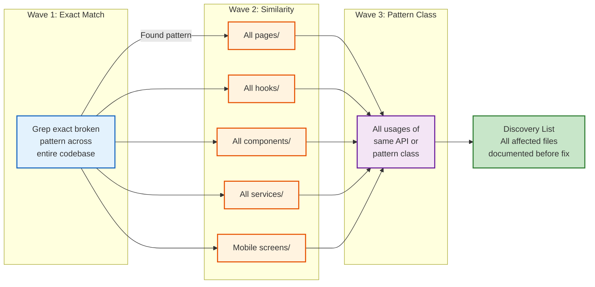

# Bug-Fix Protocol V3

> **Effective:** [Date] | **Applies to:** Every bug fix, no exceptions.
> **Orchestrator role:** Claude coordinates all agents, reports progress, executes autonomously.

---

```mermaid
flowchart TD
    S0[Stage 0<br/>Triage & Registration<br/>Assign P0-P3 severity] --> S1[Stage 1<br/>Discovery<br/>3-Wave Search]
    S1 --> S15{P0/P1?}
    S15 -->|Yes| S1B[Stage 1.5<br/>Containment<br/>Feature flag / rollback]
    S15 -->|No| S2
    S1B --> S2[Stage 2<br/>Fix Rounds<br/>FE + BE + QA parallel]
    S2 --> S3[Stage 3<br/>Visual Verification<br/>{E2E_FRAMEWORK} screenshots]
    S3 --> S4[Stage 4<br/>Full Verification<br/>Tests + health check]
    S4 --> S5{All pass?}
    S5 -->|No| S2
    S5 -->|Yes| S6[Stage 5<br/>Rollback Plan<br/>Document recovery path]
    S6 --> S7[Stage 6<br/>Container Deploy<br/>Multi-user auth verification]
    S7 --> S8[Stage 7<br/>Auto-Commit<br/>git commit + push]
    S8 --> S9[Stage 8<br/>RCA + OPEN_ISSUES<br/>Document root cause]

    classDef triage fill:#fff3e0,stroke:#e65100,stroke-width:2px
    classDef discover fill:#e3f2fd,stroke:#1565c0,stroke-width:2px
    classDef fix fill:#c8e6c9,stroke:#2e7d32,stroke-width:2px
    classDef verify fill:#f3e5f5,stroke:#6a1b9a,stroke-width:2px
    classDef deploy fill:#e0f2f1,stroke:#00695c,stroke-width:2px
    classDef decision fill:#fff9c4,stroke:#f57f17,stroke-width:2px

    class S0 triage
    class S1,S1B discover
    class S2 fix
    class S3,S4 verify
    class S6,S7 deploy
    class S8,S9 triage
    class S15,S5 decision
```

---

## Stage 0 — Triage & Registration

1. **Assign severity:**
   - **P0** (Critical): Data loss, all users blocked, security breach — fix NOW
   - **P1** (High): Feature broken for subset — fix today
   - **P2** (Medium): Degraded but workaround exists — fix this sprint
   - **P3** (Low): Polish, rare edge case — backlog
2. **Log in `OPEN_ISSUES.md`** — status Open, severity, domain (FE/BE/DB/Security/Infra)
3. **Severity gates:**
   - P0/P1: Rollback plan + monitoring REQUIRED before deploy
   - P2/P3: Standard verification sufficient
4. **Report:** "BUG-NNN (P1) registered, starting investigation"

---

## Stage 1 — Discovery (3 Waves — MANDATORY before any fix code)

**Skills loaded:** `systematic-debugging` + `discovery-wave-automator` + domain skill

| Agent | Role |
|-------|------|
| Agent-Investigator | Read logs → reproduce → root cause (use interactive debugger, NOT console.log) |
| Agent-Scanner | 3-wave parallel search |

### Wave 1 — Exact Match
Grep for the exact broken pattern (string, function, API call) across entire codebase.

### Wave 2 — Similarity Search (NEVER SKIP)
Check ALL relevant directories for variations of the same anti-pattern:
- [ ] `{FRONTEND_PAGES_DIR}`
- [ ] `{FRONTEND_HOOKS_DIR}`
- [ ] `{FRONTEND_COMPONENTS_DIR}`
- [ ] `{MOBILE_DIR}`
- [ ] ALL backend services (`{BACKEND_SERVICES_DIR}`)
- [ ] All resolver/controller files across all services
- [ ] Mobile equivalent of affected web component
- [ ] `{PACKAGES_DIR}` — shared packages (db, auth, event client, API shared types)
- [ ] `infrastructure/` + container orchestration configs — if infrastructure/config bug
- [ ] `.env*` files + config directories — if env-var or config-related bug

### Wave 3 — Pattern Class
Search all usages of the same API or pattern class. Examples:
- "no cleanup on unmount" → grep ALL `setInterval`/`setTimeout`/`useSubscription`
- "raw error in UI" → grep ALL `.message` rendered to user
- "missing try/catch" → grep ALL async service methods

### Output
**Numbered Discovery List** — every affected file + the exact issue.
Report to user before proceeding.



---

## Stage 1.5 — Containment (P0/P1 only)

**Before writing fix code, stop the bleeding:**
- Feature flag off
- Emergency rollback to last known good
- Circuit breaker / rate limit
- **P2/P3:** Skip — proceed to fix

Document containment action in OPEN_ISSUES.md.

---

## Stage 2 — Fix Rounds

**Agents per round (parallel):**

| Agent | Role |
|-------|------|
| Agent-FE | Frontend fixes |
| Agent-BE | Backend fixes |
| Agent-QA | Unit + E2E regression tests |
| Agent-Security | Security invariant compliance check on changed code |

### Round Structure
- **Round 1:** Original bug + structured logging added
- **Round 2:** All Wave 2 findings (variations)
- **Round 3:** All Wave 3 findings (pattern class)
- **Round N:** Continue until Discovery List is 100% empty

### Round Gate (MANDATORY after EVERY round)
```
[] {CONTAINER_ORCHESTRATION} ps — all containers healthy (if any went down during round, restore NOW)
[] ./scripts/health-check.sh — ALL services responding
[] {PACKAGE_MANAGER} {BUILD_ORCHESTRATOR} test — 100% pass
[] {PACKAGE_MANAGER} {BUILD_ORCHESTRATOR} typecheck — 0 errors
[] {PACKAGE_MANAGER} {BUILD_ORCHESTRATOR} lint — 0 errors
[] Regression test written: proves bad state is GONE (not just fix is present)
[] Structured logging added: [ServiceName] + tenantId + userId context
[] grep bug pattern — matches decreasing toward zero
[] ALL endpoints verified: Auth provider, API Gateway, Frontend, Database
```

**A round is NOT done until ALL boxes are checked.**

---

## Stage 3 — Visual Verification (UI bugs only)

**Skills loaded:** `{E2E_FRAMEWORK}-e2e-tester` + `fix`

1. Agent opens browser → reproduces original failure scenario
2. Screenshot saved to `docs/screenshots/BUG-NNN-*.png`
3. E2E spec written with:
   - `expect(element).not.toContainText(badString)` — bad text gone
   - `expect(page).toHaveScreenshot()` — visual regression baseline
4. Test runs and passes
5. Verify 10 consecutive passes (flake detection — `--repeat-each=10`)

---

## Stage 4 — Full Verification Suite

```
[] {PACKAGE_MANAGER} {BUILD_ORCHESTRATOR} test — all pass
[] {PACKAGE_MANAGER} {BUILD_ORCHESTRATOR} typecheck — 0 errors
[] {PACKAGE_MANAGER} {BUILD_ORCHESTRATOR} lint — 0 errors
[] {PACKAGE_MANAGER} test:security — pass (security invariants)
[] E2E {E2E_FRAMEWORK} — all pass
[] grep bug pattern — 0 matches outside test files
[] {PACKAGE_MANAGER} audit --audit-level=high — no new vulnerabilities
```

---

## Stage 5 — Rollback Readiness

**Document before deploying:**
```
[] Rollback command: [exact git revert / container image tag]
[] Database impact: [migration included? backwards-compatible?]
[] Estimated recovery time: [<5 min for P0/P1]
[] Data safety: [will rollback cause data loss?]
```

### Decision Framework
| Condition | Action |
|-----------|--------|
| Fix verified in <30 min | Fix-forward |
| Fix takes >30 min | Rollback now, fix in new cycle |
| Data integrity at risk | Rollback immediately (no fix-forward) |
| Fix includes DB migration | Evaluate data safety before fix-forward |

---

## Stage 6 — Container Deployment & Live Verification

### Deployment (Blue-Green)
1. `{CONTAINER_ORCHESTRATION} build --no-cache` — old container stays running
2. Verify build succeeds (exit 0) BEFORE touching running container
3. `{CONTAINER_ORCHESTRATION} down && {CONTAINER_ORCHESTRATION} up -d`

### Verification Checklist
```
[] {CONTAINER_ORCHESTRATION} ps — all containers healthy
[] ./scripts/health-check.sh — ALL services PASS
[] All backend services responding
[] API Gateway responds
[] Frontend loads
[] Process manager status — ALL processes RUNNING
```

### Multi-User Authentication Test

| User | Role | Password |
|------|------|----------|
| admin@{PROJECT_NAME}.dev | SUPER_ADMIN | [password] |
| instructor@example.com | INSTRUCTOR | [password] |
| org.admin@example.com | ORG_ADMIN | [password] |
| researcher@example.com | RESEARCHER | [password] |
| student@example.com | STUDENT | [password] |

### Live Bug Reproduction
- Reproduce the original bug scenario in the live container
- Confirm it is fixed
- **If ANY check fails** → fix → back to Stage 4

---

## Stage 7 — CI/CD Verification

1. `git add` relevant files (specific files, not `git add -A`)
2. `git commit -m "fix(scope): description"` — **automatic, no asking**
3. `git push`
4. **CI gate checks:**
   ```
   [] gh run list --limit 3 — new run triggered
   [] gh run watch — wait for completion
   [] All CI checks green (lint, typecheck, test, security)
   [] Schema validation — no breaking changes
   ```
5. **If CI fails:**
   - Read failure logs
   - Fix → new commit → re-push → verify again
   - **Never leave CI red**

---

## Stage 8 — Documentation & RCA

### Update `OPEN_ISSUES.md` — Structured RCA Format

```markdown
## BUG-NNN: [Title]
- **Status:** Fixed
- **Severity:** P1
- **Root Cause:** [layer: code/test/deploy/env] → exact issue
- **Why Missed:** [gap in: code-review / testing / CI / staging]
- **Containment:** [what was done to stop bleeding, or N/A for P2/P3]
- **Fix:** [what changed + affected files per round]
- **Tests Added:** [unit test files + E2E spec files — full paths]
- **Prevention:** [test-file:line or new-CI-gate or new-protocol-rule]
- **Discovery List:** [complete numbered list from all 3 waves]
- **Rollback Plan:** [documented rollback command]
```

### Additional Doc Updates
- README.md if stats changed
- API contracts if schema changed
- CHANGELOG.md entry

---

## Stage 9 — Final Report

```
===================================
BUG-NNN FIXED & DEPLOYED & VERIFIED
===================================
Severity: P1
Root cause: [what was broken]
Containment: [what stopped the bleeding]
Fix: [what changed]
Files modified: N
Tests added: N unit + N E2E
Regression guard: tests/xxx.spec.ts:42
Rounds: N
Discovery waves: 3 complete (N files found)
Container: deployed & verified
Multi-user auth: all pass
CI: all green
Rollback plan: documented
===================================
```

---

## Skills Loaded per Stage

| Stage | Skills |
|-------|--------|
| 1 (Discovery) | `systematic-debugging`, `discovery-wave-automator`, domain skill |
| 1.5 (Containment) | `incident-runbook-templates` |
| 2 (Fix Rounds) | `debugging-code` (interactive debugger), `parallel-debugging`, domain skill |
| 3 (Visual) | `{E2E_FRAMEWORK}-e2e-tester`, `fix` |
| 4-6 (Verification) | `session-completion-gate` |
| 8 (Documentation) | `postmortem-writing` (P0/P1 only) |

---

## Iron Rules (NEVER violate)

1. **Never fix without Discovery** — 3 waves mandatory before any fix code
2. **Never skip rounds** — every round passes the Round Gate
3. **Never declare fixed without container verification** — Stage 6 is mandatory
4. **Never ask about commit** — auto-commit in Stage 7 after all checks pass
5. **Never leave CI red** — fix and re-push until green
6. **Never report after fixing only the original file** — complete all 3 waves first
7. **Never close without regression test** — unit + E2E that catches recurrence
8. **Never close without logging** — structured logging must be in place
9. **Never skip multi-user auth** — all test users must login successfully
10. **Never skip rollback plan** — document before deploying (P0/P1 mandatory)
11. **ALWAYS restore services after ANY disruption** — If ANY operation (code change, container rebuild, config edit, service restart, container orchestration change) causes a service to go down, you MUST restore ALL services before ending that operation. Run `./scripts/health-check.sh` after every disruptive action. If any service is down: bring containers up → wait → verify ALL endpoints respond. **The user must NEVER encounter connection errors.** This rule applies after EVERY code change, not just at "session end".
