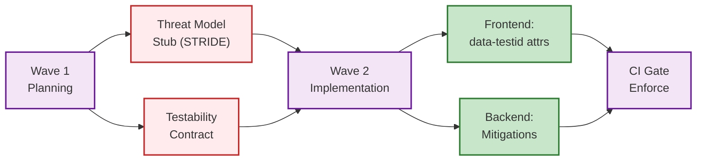

# Security & QA Shift-Left Protocol

> **Purpose:** Ensure security review and QA testability requirements are created at Wave 1, not Wave 2.



---

## Problem

Previously, Security and QA divisions only engaged at Wave 2 (implementation). This caused:
- Missing `data-testid` attributes discovered post-implementation
- Threat models written after code was committed
- Security gaps found too late to fix cheaply

## New Protocol

### Wave 1 — Required Deliverables

Each Wave 1 planning phase MUST produce:

#### 1. Threat Model Stub (Security Division)

For every new feature or mutation:

| Threat | STRIDE Category | Mitigation | Owner |
|--------|----------------|-----------|-------|
| Unauthorized access to [resource] | Spoofing | {AUTH_TOKEN} + {ROLE_DIRECTIVE} | Backend |
| Data leak across tenants | Information Disclosure | {ROW_SECURITY} + withTenantContext | Database |
| Injection via user input | Tampering | {VALIDATION_LIB} validation | Backend |

#### 2. Testability Contract (QA Division)

For every new UI component or API endpoint:

```markdown
## Required data-testid Attributes
- data-testid="feature-main-container"
- data-testid="feature-submit-button"
- data-testid="feature-error-message"

## Required Error Codes
- FEATURE_NOT_FOUND
- FEATURE_PERMISSION_DENIED

## Mock Seams
- API query: mockable via page.route()
- External service: mockable via dependency injection
```

### Wave 2 — Enforcement

- Frontend agents MUST include all `data-testid` from the testability contract
- Backend agents MUST implement all mitigations from the threat model
- Pre-commit check: new mutations without a corresponding security test file are flagged

### CI Gate

```yaml
# .github/workflows/security-shift-left.yml
- name: Check threat model exists
  run: |
    for mutation in $(grep -r '@Mutation' {BACKEND_SERVICES_DIR} --include='*.ts' -l); do
      feature=$(basename $(dirname $mutation))
      if [ ! -f "docs/security/threat-models/${feature}.md" ]; then
        echo "Missing threat model for $feature"
        exit 1
      fi
    done
```

---

*Template version: 1.0*
