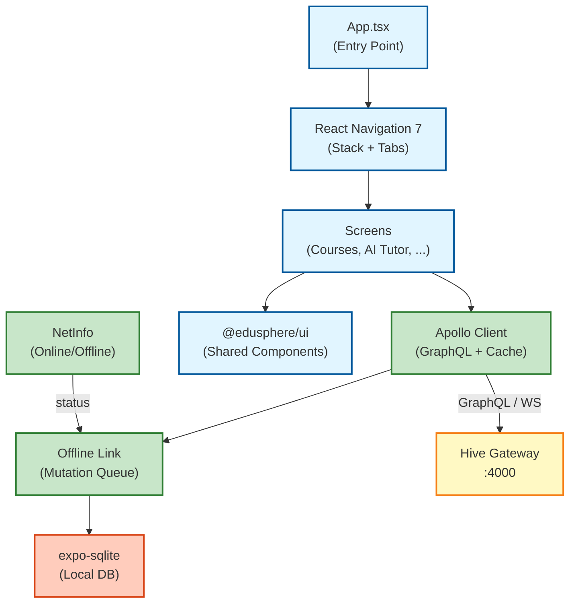

# EduSphere Mobile App

Native mobile application for iOS and Android built with Expo SDK 54 and React Native.

## Features

- 📱 **Native Experience**: Optimized for iOS and Android
- 🔄 **Real-time Updates**: WebSocket subscriptions for live data
- 💾 **Offline Support**: SQLite database for offline functionality
- 🎨 **Shared UI**: Reusable components from @edusphere/ui package
- 🔐 **Secure Storage**: expo-secure-store for tokens
- 📊 **GraphQL**: Apollo Client with offline mutations queue

## Architecture



## Tech Stack

- **Framework**: Expo SDK 54 (React Native 0.76.8)
- **Navigation**: React Navigation 7 (Stack + Bottom Tabs)
- **State Management**: Apollo Client 3.11
- **Database**: expo-sqlite 16.0
- **Network Detection**: @react-native-community/netinfo
- **Real-time**: GraphQL Subscriptions over WebSocket (graphql-ws)

## Project Structure

```
apps/mobile/
├── src/
│   ├── apollo/
│   │   └── offlineLink.ts          # Offline-first Apollo Link
│   ├── hooks/
│   │   ├── useLoadAssets.ts        # Asset loading hook
│   │   └── useOfflineSync.ts       # Offline sync hook
│   ├── navigation/
│   │   └── index.tsx               # React Navigation setup
│   ├── screens/
│   │   ├── AITutorScreen.tsx       # AI chat interface
│   │   ├── CourseDetailScreen.tsx  # Course details view
│   │   ├── CoursesScreen.tsx       # Courses list
│   │   ├── DiscussionsScreen.tsx   # Discussions feed
│   │   └── ProfileScreen.tsx       # User profile
│   └── services/
│       └── database.ts             # SQLite service
├── App.tsx                         # App entry point
├── app.json                        # Expo configuration
├── index.js                        # Root entry
└── package.json
```

## Getting Started

### Prerequisites

- Node.js 18+
- pnpm 8+
- Expo CLI (`npm install -g expo-cli`)
- iOS Simulator (Mac) or Android Studio

### Installation

```bash
# Install dependencies
pnpm install

# Start development server
cd apps/mobile
pnpm start
```

### Running on Devices

```bash
# iOS
pnpm ios

# Android
pnpm android

# Web (for testing)
pnpm web
```

## Offline Support

The app includes comprehensive offline functionality:

### Query Caching

- All GraphQL queries are automatically cached in SQLite
- Cached data is returned when offline
- Cache is automatically refreshed when online

### Offline Mutations

- Mutations are queued when offline
- Automatically synced when connection is restored
- Failed mutations are marked and can be retried

### Usage Example

```typescript
import { useOfflineSync } from './hooks/useOfflineSync';

function MyComponent() {
  const { isOnline, isSyncing, pendingCount } = useOfflineSync();

  return (
    <View>
      {!isOnline && <Text>Offline Mode</Text>}
      {isSyncing && <Text>Syncing {pendingCount} changes...</Text>}
    </View>
  );
}
```

## Shared Components

The app uses shared UI components from `@edusphere/ui`:

```typescript
import { Button, Card, Input, Text, Avatar, Badge } from '@edusphere/ui';

// Button variants
<Button title="Submit" variant="primary" onPress={...} />
<Button title="Cancel" variant="outline" onPress={...} />

// Cards
<Card variant="elevated">
  <Text variant="h3">Course Title</Text>
  <Text variant="body">Description...</Text>
</Card>

// Inputs
<Input
  label="Email"
  placeholder="Enter your email"
  error={errors.email}
/>

// Avatars
<Avatar name="John Doe" size={60} />
<Avatar uri="https://..." size={40} />

// Badges
<Badge label="Published" variant="success" />
```

## Real-time Subscriptions

Connect to real-time updates via GraphQL subscriptions:

```typescript
import { gql, useSubscription } from '@apollo/client';

const MESSAGE_SUB = gql`
  subscription OnMessage($sessionId: ID!) {
    agentMessageCreated(sessionId: $sessionId) {
      id
      role
      content
      createdAt
    }
  }
`;

function ChatScreen() {
  const { data } = useSubscription(MESSAGE_SUB, {
    variables: { sessionId: '123' },
  });

  // Handle new messages...
}
```

## Build for Production

```bash
# Install EAS CLI
npm install -g eas-cli

# Configure EAS
eas build:configure

# Build for Android
eas build --platform android

# Build for iOS
eas build --platform ios

# Submit to stores
eas submit --platform android
eas submit --platform ios
```

## Environment Configuration

Update API URLs in [App.tsx:12-18](App.tsx#L12-L18):

```typescript
const GATEWAY_URL = __DEV__
  ? 'http://10.0.2.2:4000/graphql' // Android emulator
  : 'https://api.edusphere.com/graphql';

const WS_URL = __DEV__
  ? 'ws://10.0.2.2:4000/graphql'
  : 'wss://api.edusphere.com/graphql';
```

For iOS simulator, use `http://localhost:4000/graphql`.

## Database Management

The app automatically:

- Creates tables on first launch
- Caches queries for 7 days (configurable)
- Cleans up old cache entries
- Queues offline mutations

Manual database operations:

```typescript
import { database } from './services/database';

// Initialize
await database.init();

// Clear old cache (older than 7 days)
await database.clearOldCache();

// Get pending mutations
const pending = await database.getPendingMutations();
```

## Performance Optimization

- Uses `React.memo` for expensive components
- FlatList for efficient list rendering
- Image lazy loading with placeholders
- Debounced search inputs
- Pagination for large datasets

## Code Sharing

The app shares ~70% of its code with the web client:

- **Shared**: GraphQL queries/mutations, business logic, UI components
- **Platform-specific**: Navigation, native modules, platform APIs

## Troubleshooting

### Metro bundler issues

```bash
expo start -c  # Clear cache
```

### iOS build errors

```bash
cd ios && pod install
```

### Android emulator connection

- Use `10.0.2.2` instead of `localhost`
- Enable port forwarding: `adb reverse tcp:4000 tcp:4000`

## License

MIT
