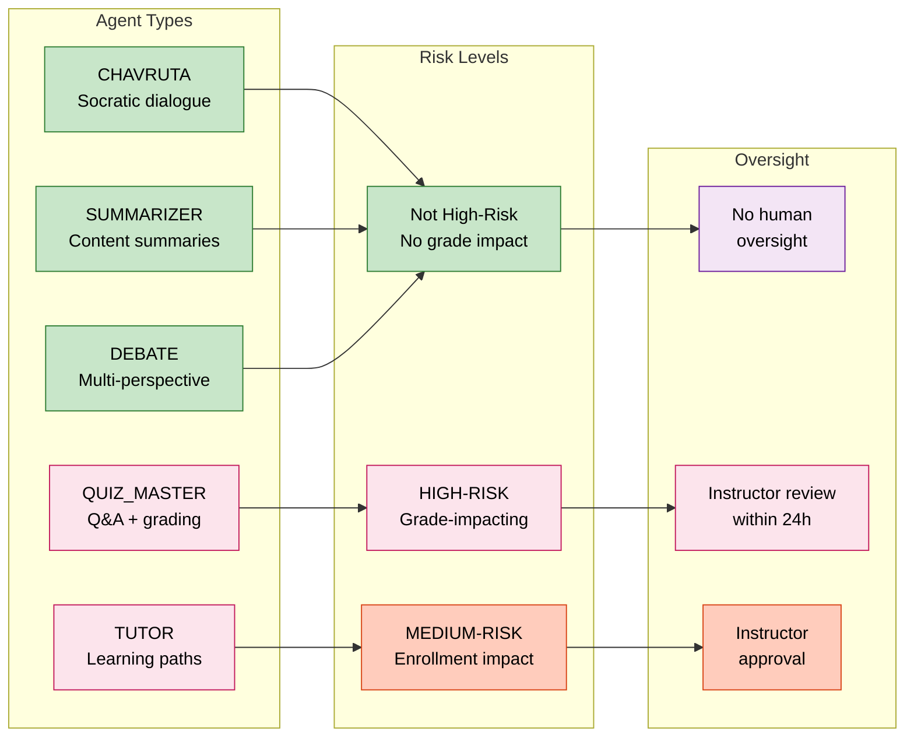

# EduSphere AI Model Cards

<!-- EU AI Act Art.53 — GPAI Model Documentation Requirements -->
<!-- Last Updated: 2026-02-24 -->

## Overview

EduSphere uses AI agents powered by large language models (LLMs). This document provides
transparency information about the AI models used, as required by the EU AI Act (Art.50, Art.53).

---

## Agent Risk Classification

## Agent Types

### CHAVRUTA Agent

- **Purpose:** Socratic dialogue — asks questions to guide student understanding
- **Model (Development):** `ollama/llama3.2` (local, air-gapped)
- **Model (Production):** `openai/gpt-4o-mini` or `anthropic/claude-haiku-4-5`
- **High-Risk Classification:** Not high-risk (advisory/tutoring, no grade impact)
- **Data Retention:** Conversation history purged after 90 days
- **Human Oversight:** Not required unless student flags response
- **Known Limitations:** May produce factually incorrect information; instructors should review flagged responses
- **Bias Considerations:** LLM training data may underrepresent non-English educational contexts

### QUIZ_MASTER Agent

- **Purpose:** Generates questions and evaluates student answers
- **Model (Development):** `ollama/llama3.2`
- **Model (Production):** `openai/gpt-4o` (higher accuracy for evaluation)
- **High-Risk Classification:** HIGH-RISK when quiz impacts course grade
- **Human Oversight:** REQUIRED for grade-impacting assessments (instructor review within 24h)
- **Known Limitations:** May not detect all forms of correct reasoning in free-text answers

### SUMMARIZER Agent

- **Purpose:** Generates summaries of course content and discussions
- **Model (Development):** `ollama/llama3.2`
- **Model (Production):** `openai/gpt-4o-mini`
- **High-Risk Classification:** Not high-risk
- **Human Oversight:** Not required

### DEBATE Agent

- **Purpose:** Presents multiple perspectives on a topic for critical thinking
- **Model (Development):** `ollama/llama3.2`
- **Model (Production):** `anthropic/claude-sonnet-4-6`
- **High-Risk Classification:** Not high-risk
- **Known Limitations:** Perspectives generated may not represent all viewpoints fairly

### TUTOR Agent

- **Purpose:** Personalized learning path recommendations
- **Model (Development):** `ollama/llama3.2`
- **Model (Production):** `openai/gpt-4o`
- **High-Risk Classification:** MEDIUM-RISK when recommendations affect course enrollment
- **Human Oversight:** Instructor approval required for enrollment recommendations

---

## Data Processing

| Data Type         | Sent to External LLM?        | Retention |
| ----------------- | ---------------------------- | --------- |
| Student questions | Yes (with consent)           | 90 days   |
| Student answers   | Yes (with consent)           | 90 days   |
| PII (email, name) | No — scrubbed before sending | N/A       |
| IP addresses      | No                           | N/A       |

## Opt-Out

Users can opt-out of AI features at any time via Settings → Privacy → AI Preferences.
Specific agent types can be disabled independently.
Opt-out requests are processed within 72 hours and are covered by GDPR Art.21 (right to object).

## Human Oversight

All high-risk AI decisions (grade-impacting quizzes, enrollment recommendations) require
human oversight by instructors before taking effect. Users can appeal AI decisions at any time
by contacting their instructor or the platform administrators.

## Contact

For questions about AI use: privacy@edusphere.io
For EU AI Act inquiries: dpo@edusphere.io
