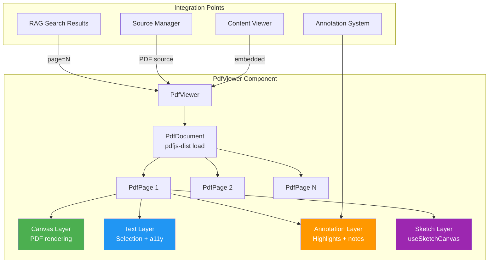

# ADR-PDF-VIEWER: Add In-Browser PDF Viewing with pdfjs-dist

## Status

Accepted

## Date

2026-03-27

## Context

EduSphere's content pipeline processes uploaded PDFs by extracting text via `pdf-parse` for chunking, embedding, and RAG search. However, learners had no way to view the original PDF document in the browser. The only option was downloading the file from MinIO, which:

1. Breaks the learning flow (context switch to external PDF reader)
2. Prevents in-context annotations on PDF pages
3. Prevents sketch/drawing overlays on PDF content
4. Makes it impossible to link RAG search results back to specific PDF pages
5. Mobile users on iOS/Android have inconsistent PDF download/viewing experiences

The platform already had annotation infrastructure (Word-style annotations, sketch canvas, visual anchoring) built for HTML content, but these features could not target PDF pages.

## Decision Drivers

- **Annotation parity**: PDF content must support the same annotation and sketch features as HTML content
- **Page-level linking**: RAG search results should deep-link to specific PDF pages
- **Offline support**: PDF viewing should work in the Expo mobile app (offline-first architecture)
- **Bundle size**: The PDF viewer library must not significantly increase the web bundle
- **Accessibility**: PDF viewing must meet WCAG 2.2 AA requirements (keyboard navigation, screen reader support)

## Considered Options

### Option 1: pdfjs-dist (Mozilla PDF.js) — Chosen

Use Mozilla's PDF.js rendering library (`pdfjs-dist` npm package) to render PDF pages as canvas elements in the browser.

- **Pros**: MIT licensed, industry standard (used by Firefox), renders to canvas (annotation-compatible), supports text layer for selection/search, worker-based rendering (non-blocking), 2.5MB gzipped (acceptable with code splitting), mature accessibility support
- **Cons**: Canvas-based rendering can be blurry on high-DPI displays (mitigated by `devicePixelRatio` scaling), large library size requires lazy loading

### Option 2: react-pdf

A React wrapper around pdfjs-dist that provides React components (`<Document>`, `<Page>`).

- **Pros**: React-idiomatic API, easier integration with React component tree
- **Cons**: Additional abstraction layer adds complexity for our annotation overlay needs, slower to adopt new pdfjs-dist features, less control over canvas rendering (needed for sketch overlays), adds ~50KB on top of pdfjs-dist

### Option 3: iframe with browser-native PDF viewer

Embed PDFs in an `<iframe>` using the browser's built-in PDF renderer.

- **Pros**: Zero bundle size impact, native rendering quality
- **Cons**: No annotation overlay possible (cross-origin iframe restrictions), no page-level event hooks, inconsistent across browsers (Chrome PDF viewer vs Firefox vs Safari), no mobile support (iOS Safari has no inline PDF rendering), no offline support

### Option 4: Google Docs Viewer / Office Online embed

Use Google's or Microsoft's online document viewer via iframe embed URL.

- **Pros**: High-quality rendering, supports many document types
- **Cons**: Requires internet connection (breaks offline-first), sends document content to third party (violates SI-10 consent requirements and air-gapped deployment requirement), no annotation overlay, no self-hosted option

## Decision

**Option 1: pdfjs-dist** with the following implementation approach:

1. **Lazy-loaded**: `React.lazy(() => import('./PdfViewer'))` to avoid impacting initial bundle
2. **Canvas rendering**: Each PDF page rendered to a `<canvas>` element with `devicePixelRatio` scaling
3. **Text layer**: pdfjs-dist text layer overlay for text selection and accessibility
4. **Annotation layer**: Custom annotation overlay component positioned over each page canvas
5. **Sketch layer**: Sketch canvas (`useSketchCanvas` hook) layered on top of page canvas
6. **Worker**: PDF.js worker loaded from CDN in production, bundled in development
7. **Page navigation**: Scroll-based with page jump controls and keyboard shortcuts

## Consequences

### Positive

- Full annotation and sketch support on PDF pages (same as HTML content)
- RAG search results can deep-link to specific PDF pages via `#page=N` fragment
- Text layer enables copy/paste and screen reader access (WCAG 2.2 AA)
- Canvas rendering supports high-DPI displays with proper scaling
- Lazy loading keeps initial bundle unaffected (~0KB impact on first load)
- Works offline in Expo mobile app (PDF stored in expo-sqlite, rendered locally)

### Negative

- Adds ~2.5MB gzipped to the lazy-loaded chunk (acceptable for a content viewer)
- Canvas rendering requires `devicePixelRatio` handling to avoid blurriness
- PDF.js worker requires separate bundling configuration in Vite
- Complex z-index management for canvas + text layer + annotation layer + sketch layer stack

### Risks

- Malicious PDFs (PDF bombs): mitigated by `maxPages: 1000` guard and 30s render timeout per page
- Large PDFs (1000+ pages): mitigated by virtual scrolling (only render visible pages + 2 buffer pages)
- Memory pressure from multiple large canvases: mitigated by destroying off-screen page canvases

## Component Architecture

## Related Decisions

- ADR-RAG-ACTIVATION — PDF viewing complements RAG by providing visual access to content that RAG indexes
- Word-Style Annotations feature — annotation overlay reuses the same infrastructure

## References

- [pdfjs-dist npm package](https://www.npmjs.com/package/pdfjs-dist)
- [Mozilla PDF.js GitHub](https://github.com/nicolo-ribaudo/pdfjs-dist)
- `docs/plans/features/RAG-ACTIVATION-UX.md` — UX specification including PDF viewer integration
