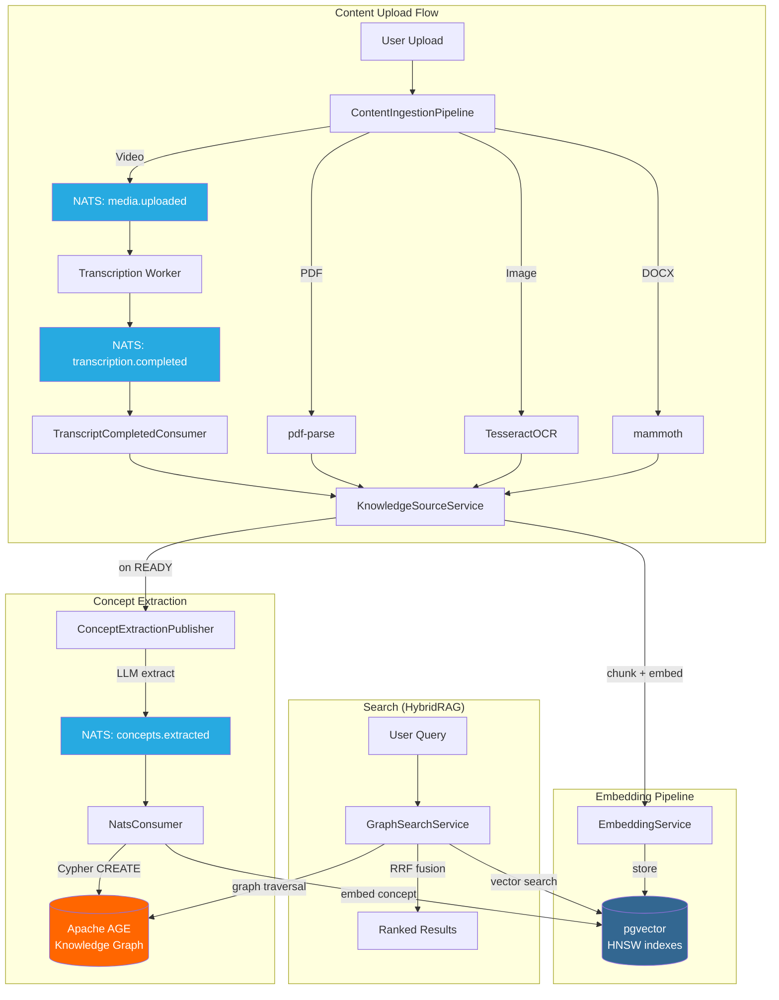

# ADR-RAG-ACTIVATION: Activate RAG Pipeline by Wiring Existing Components

## Status

Accepted

## Date

2026-03-27

## Context

EduSphere's RAG (Retrieval-Augmented Generation) pipeline had all major components built individually across multiple phases (Phases 26-35):

- **pgvector** embedding tables (`content_embeddings`, `annotation_embeddings`, `concept_embeddings`) with schema definitions including HNSW index SQL
- **Apache AGE** knowledge graph with Concept, Source, Term, Person, TopicCluster node types
- **HybridRAG** fusion engine in `packages/rag/src/hybridSearch.ts` combining vector and graph search
- **NATS JetStream** consumers for `knowledge.concepts.extracted` events
- **EmbeddingService** with Ollama (dev) and OpenAI (prod) provider abstraction
- **DocumentParserService** handling URL, text, and DOCX content types
- **Transcription Worker** with faster-whisper for video-to-text

However, none of these components were wired together for real users. The result:

1. HNSW indexes existed in code but no Drizzle migration applied them — all vector searches were O(n) sequential scans
2. PDF and image content ingestion handlers returned stubs
3. No NATS publisher existed for standalone content uploads (only lesson pipeline runs triggered concept extraction)
4. Seed/demo data had zero embeddings — demo searches returned empty results
5. Video transcripts were not linked to `knowledge_sources` — the RAG pipeline could not search transcript content
6. `findRelatedConcepts()` in HybridRAG returned an empty array, eliminating the graph signal entirely

**Net effect:** An instructor could upload content and it appeared in the UI, but asking the AI agent a question about that content returned nothing. The entire RAG value proposition was inert.

## Decision Drivers

- **Time to value**: All components existed; building from scratch would waste 3+ months of prior work
- **Risk minimization**: Wiring existing tested components is lower risk than rewriting
- **Incremental activation**: Each phase (HNSW, transcript bridge, concept publisher, seed embeddings) could be validated independently
- **Performance requirement**: Sub-50ms vector search at 100K vectors required HNSW indexes

## Considered Options

### Option 1: Wire Existing Components (Chosen)

Connect the existing services in the correct order: HNSW migration -> transcript FK bridge -> content pipeline activation -> concept publisher wiring -> seed embeddings.

- **Pros**: Leverages 6 months of tested code, minimal new code, predictable timeline (~26h)
- **Cons**: Inherits any architectural limitations of existing components

### Option 2: Rebuild RAG Pipeline from Scratch

Replace existing fragmented pipeline with a unified RAG service using LlamaIndex.TS end-to-end.

- **Pros**: Cleaner architecture, single entry point, unified error handling
- **Cons**: ~3 months effort, discards tested code, high risk of regressions, delays AI feature launch

### Option 3: Use External RAG Service (e.g., Pinecone + LangChain)

Replace pgvector + Apache AGE with a managed vector database and external RAG orchestration.

- **Pros**: Managed infrastructure, potentially faster search, less operational burden
- **Cons**: Vendor lock-in, loses Apache AGE graph signal, monthly cost at scale ($500+/mo for 1M vectors), latency from external calls, violates air-gapped deployment requirement

## Decision

**Option 1: Wire existing components** in a phased approach:

1. **Phase 1**: HNSW index migration (Drizzle migration applying `CREATE INDEX ... USING hnsw`)
2. **Phase 2**: Transcript-to-KnowledgeSource FK bridge (new `transcript_id` column + NATS consumer)
3. **Phase 3**: Seed embedding generation (pre-computed fixtures + runtime generation script)
4. **Phase 4**: Content ingestion pipeline activation (PDF via pdf-parse, image via TesseractOCR, video via NATS dispatch)
5. **Phase 5**: NATS concept publisher (bridge content uploads to concept extraction pipeline)
6. **Phase 6**: End-to-end validation

## Consequences

### Positive

- Full RAG pipeline operational with ~26 hours of focused work
- HNSW indexes deliver sub-5ms search at 10K vectors, sub-10ms at 100K vectors
- Demo data immediately searchable (pre-computed seed embeddings)
- Video transcripts automatically become searchable knowledge sources
- Apache AGE graph signal restored in HybridRAG (non-zero graph scores)
- Content uploads trigger automatic concept extraction and graph population

### Negative

- Existing `findRelatedConcepts()` placeholder required implementation (Apache AGE Cypher with 2-hop traversal)
- NATS event flow has 6 hops for video content (upload -> MinIO -> transcribe -> NATS -> bridge -> embed -> concept extract)
- Seed embedding fixtures add ~2MB to repository (768-dim float32 vectors x 500 chunks)

### Risks

- Ollama OOM on large PDFs: mitigated by chunk size limits (1000 chars) and batch embedding (20 at a time)
- HNSW index build locks table during creation: mitigated by `CREATE INDEX CONCURRENTLY`
- Embedding model mismatch between dev (nomic-embed-text) and prod (text-embedding-3-small): mitigated by pinning `dimensions: 768` in schema

## Component Diagram

## Related Decisions

- ADR-001-CONTENT-SUBGRAPH-SPLIT — content subgraph owns content ingestion
- ADR-PDF-VIEWER — PDF viewing complements RAG by providing visual rendering alongside extracted text

## References

- `docs/architecture/RAG-ACTIVATION-DESIGN.md` — full technical design document
- `docs/plans/features/FEAT-RAG-ACTIVATION.md` — feature plan with work items and acceptance criteria
- `docs/plans/features/RAG-ACTIVATION-UX.md` — UX specification for embedding status, search experience, admin dashboard
