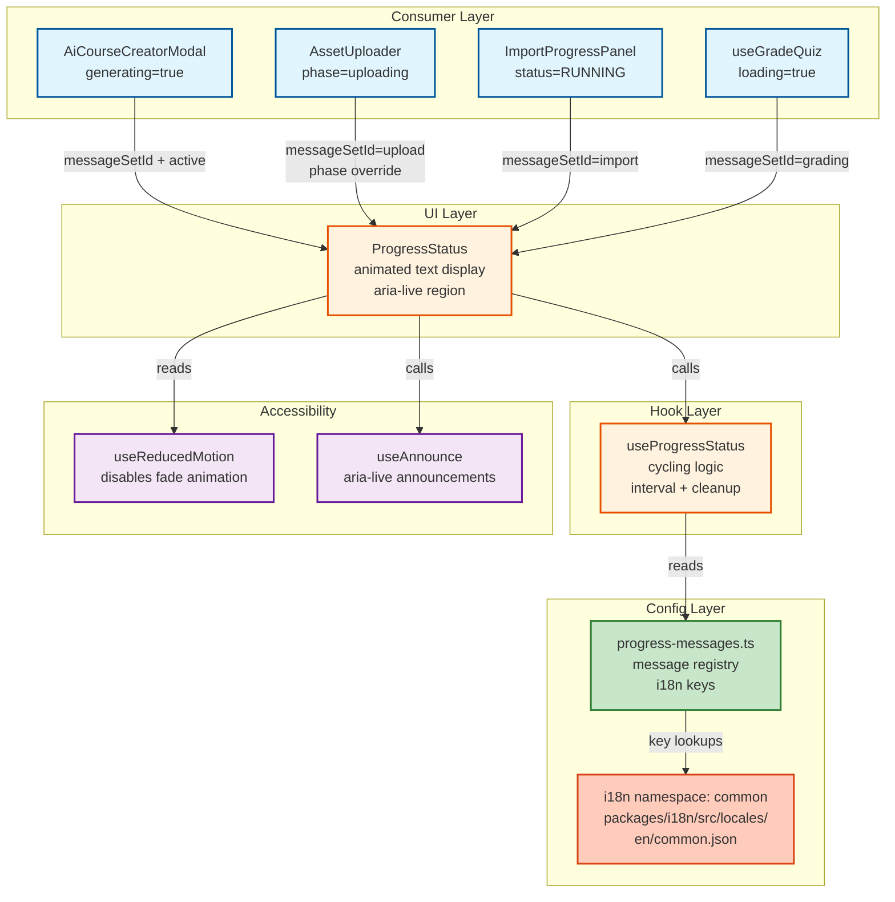
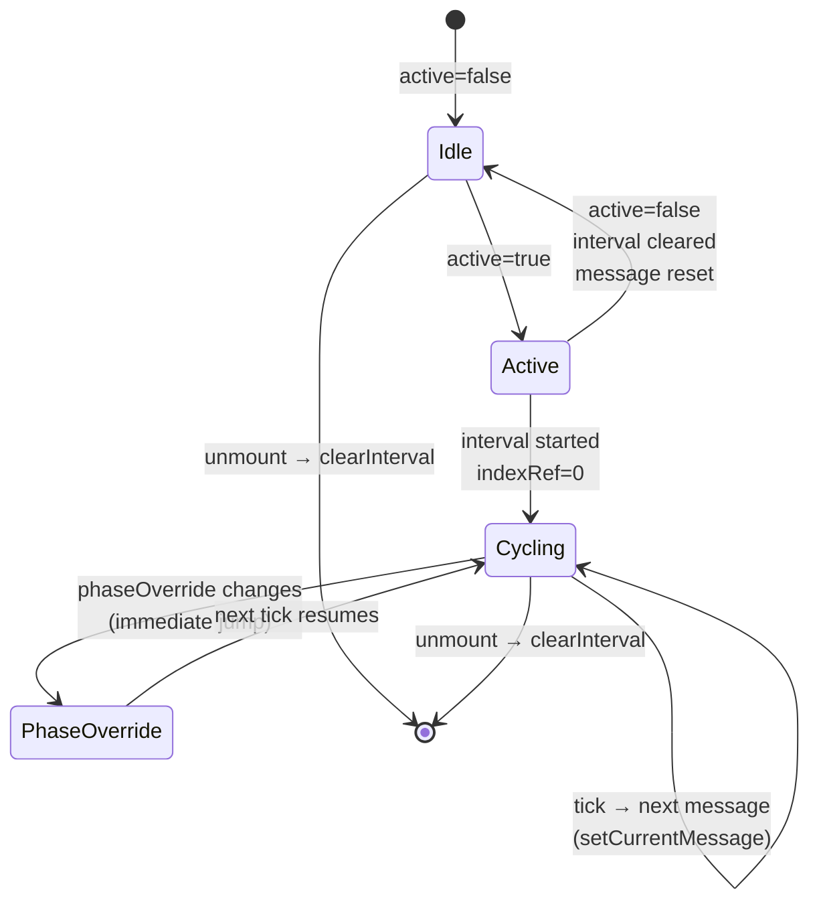
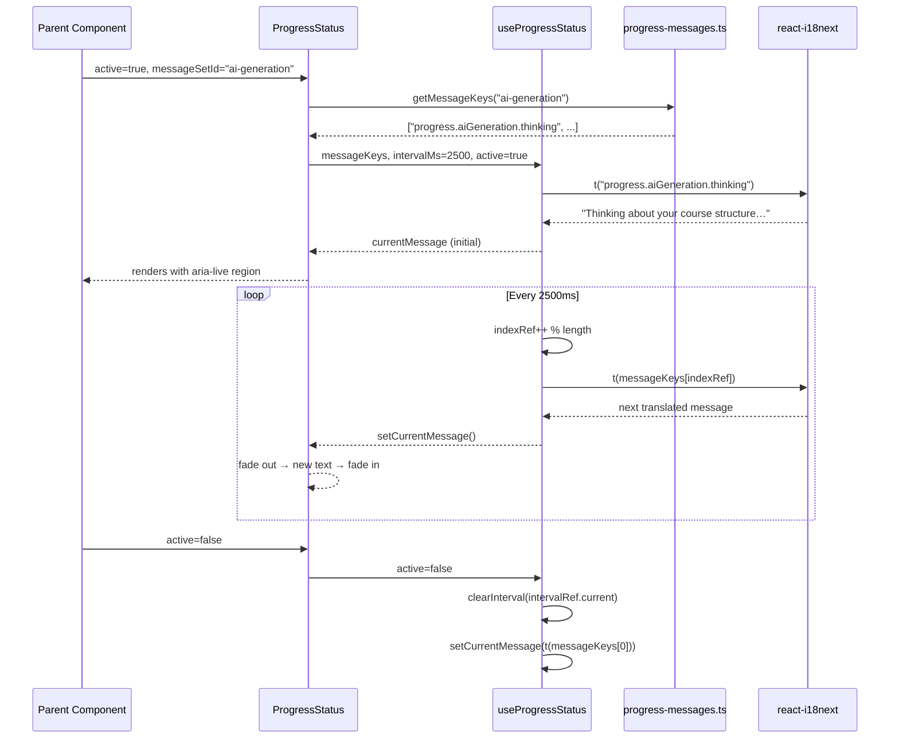

# ADR: Dynamic Progress Status Indicator

> **Status:** Accepted | **Date:** 2026-03-18 | **Deciders:** Architecture Division
> **Scope:** `apps/web` frontend only — React 19 + Vite 6

---

## 1. Context

Long-running operations in EduSphere (AI course generation, file upload, quiz grading,
content import) currently show a static `Loader2` spinner or a minimal text label.
Operations that exceed ~2 seconds with no progress feedback produce
[anxiety-driven abandonment](https://www.nngroup.com/articles/progress-indicators/) in
users. This ADR defines the architecture for a **Dynamic Progress Status** system that
displays rotating, encouraging text messages — analogous to Claude Code's status line —
for any operation whose duration is uncertain or long.

### Affected Operations (known today)

| Operation | Component / Hook | Current State | Target State |
|---|---|---|---|
| AI course generation | `AiCourseCreatorModal` | Static `Loader2` + "Generating…" | Rotating AI messages |
| File upload (presign→PUT→confirm) | `useFileUpload` | Phase label only | Phase-aware message sets |
| Content import | `ImportProgressPanel` | Static "Importing…" | Rotating import messages |
| Quiz grading | `useGradeQuiz` | No feedback (silent `loading`) | Rotating grading messages |
| Knowledge-graph queries | `KnowledgeGraph` | `LoadingSpinner` | Optional rotating messages |

---

## 2. Decision

Introduce a **three-layer architecture** composed of:

1. `useProgressStatus` hook — pure cycling logic, no UI coupling
2. `ProgressStatus` component — UI rendering, isolated re-renders
3. `progress-messages.ts` — typed message registry, i18n-keyed

The existing `LoadingSpinner` is **not replaced**. `ProgressStatus` is an additive
companion component that callers opt into for long-duration operations.

---

## 3. Component Architecture

### 3.1 Relationship Diagram



### 3.2 Replace vs. Wrap Decision

**Decision: Wrap (additive), do not replace `LoadingSpinner`.**

Rationale:

- `LoadingSpinner` is used in 15 page-level routes as a full-page loading state. Replacing
  it globally would change UX for every `isLoading` query state, which is undesirable for
  fast queries (<500 ms) where rotating text would flash confusingly.
- `ProgressStatus` is intended only for operations >2 seconds with meaningful progress
  semantics.
- Callers opt in by replacing a `Loader2` icon or `LoadingSpinner` with `<ProgressStatus>`
  where the operation warrants it.

```
LoadingSpinner  → remains for page-level query loading states
ProgressStatus  → used for known-long operations (AI gen, upload, import, grading)
```

---

## 4. File Structure

```
apps/web/src/
├── components/
│   └── ProgressStatus.tsx          ← UI component (<150 lines)
├── hooks/
│   └── useProgressStatus.ts        ← cycling logic hook (<80 lines)
└── lib/
    └── progress-messages.ts        ← message configuration registry (<100 lines)
```

No barrel files are required because these three files are independently imported by
consumers. A barrel `index.ts` should be added only if the feature grows beyond 5 files.

---

## 5. Message Configuration Pattern

### 5.1 Message Set Registry (`progress-messages.ts`)

Two message modes are supported:

**Static sets** — ordered messages matching predictable operation phases (e.g., upload:
presigning → uploading → confirming). Each message maps 1:1 to a phase; the set is
exhausted in order.

**Cyclic sets** — unordered arrays for unknown-duration operations. The hook cycles
through them in round-robin forever until the `active` flag becomes `false`.

```
MessageSetId (union type) = 'ai-generation' | 'upload' | 'import' | 'grading' | 'generic'
```

Each entry is an `i18n key` string (e.g. `"progress.aiGeneration.thinking"`), never a
hardcoded string. The registry maps `MessageSetId → string[]` where each element is a
`t()` key path resolvable within the `common` namespace.

### 5.2 i18n Integration

All message strings live in `packages/i18n/src/locales/en/common.json` under a
`progress` top-level key. This follows the existing pattern where shared UI copy
(loading, error, cancel) lives in `common.json`.

```json
{
  "progress": {
    "aiGeneration": {
      "thinking": "Thinking about your course structure…",
      "drafting": "Drafting module outlines…",
      "refining": "Refining content for your audience…",
      "building": "Building learning objectives…",
      "finalizing": "Putting the finishing touches on your course…",
      "almost": "Almost there — reviewing the outline…"
    },
    "upload": {
      "presigning": "Preparing secure upload…",
      "uploading": "Uploading your file…",
      "confirming": "Confirming upload with server…"
    },
    "import": {
      "parsing": "Parsing content structure…",
      "importing": "Importing lessons into the system…",
      "indexing": "Indexing content for search…",
      "finishing": "Finishing up…"
    },
    "grading": {
      "analyzing": "Analyzing your answers…",
      "scoring": "Calculating your score…",
      "preparing": "Preparing your results…"
    },
    "generic": {
      "working": "Working on it…",
      "processing": "Processing…",
      "justAMoment": "Just a moment…",
      "almostReady": "Almost ready…"
    }
  }
}
```

Each of the 9 supported locales (`zh-CN`, `hi`, `es`, `fr`, `bn`, `pt`, `ru`, `id`, `he`)
requires a corresponding `progress` block in its `common.json`. The `NAMESPACES` constant
in `packages/i18n/src/index.ts` is unchanged (messages remain in `common`).

### 5.3 Phase-Aware Message Switching

For `upload` specifically, the active message set can change mid-operation when
`useFileUpload`'s `phase` transitions (presigning → uploading → confirming).
This is handled by passing `phase` as a prop to `ProgressStatus`, which maps it to the
correct index in the static set via a lookup table in `progress-messages.ts`.

---

## 6. State Management & Hook Design

### 6.1 `useProgressStatus` Hook

```
Input:
  messageKeys: string[]   — resolved t() keys (returned by registry lookup)
  intervalMs?: number     — default 2500 ms
  active: boolean         — starts/stops cycling

Output:
  currentMessage: string  — the currently displayed message (translated)
```

**Cycling algorithm:**

- An `indexRef` (not `useState`) tracks the current position. Using a ref prevents a
  render on index increment — only the resolved message string triggers a render via
  `useState`.
- On each interval tick: `indexRef.current = (indexRef.current + 1) % messageKeys.length`
  then call `setCurrentMessage(t(messageKeys[indexRef.current]))`.
- When `active` transitions from `true → false`, the interval is cleared and
  `currentMessage` resets to the first message in the set (ready for re-use).
- When `active` transitions from `false → true`, a new interval is started and
  `indexRef.current` resets to 0.

### 6.2 Memory Safety

Following the project's Memory Safety rules (CLAUDE.md):

| Resource | Storage | Cleanup |
|---|---|---|
| `setInterval` handle | `intervalRef = useRef<ReturnType<typeof setInterval> \| null>(null)` | `clearInterval(intervalRef.current)` in `useEffect` cleanup |
| Mounted guard | `mountedRef = useRef(true)` | Set `false` in cleanup |
| `active` change listener | `useEffect([active])` | Clears old interval before starting new |

No `useState` for the interval index — only for the displayed string. This is critical:
incrementing a ref does not cause a parent re-render.

### 6.3 Phase Transition (upload example)

```
useFileUpload returns: phase = 'presigning' | 'uploading' | 'confirming'

ProgressStatus prop: phaseOverride?: UploadPhase

Internal lookup (progress-messages.ts):
  UPLOAD_PHASE_TO_INDEX: Record<UploadPhase, number> = {
    presigning: 0,
    uploading:  1,
    confirming: 2,
  }
```

When `phaseOverride` changes, `ProgressStatus` passes the index override to
`useProgressStatus` which immediately shows the phase-mapped message without waiting for
the next interval tick.

---

## 7. `ProgressStatus` Component Design

### 7.1 Props Interface

```typescript
interface ProgressStatusProps {
  /** Message set identifier — resolved via registry */
  messageSetId: MessageSetId;
  /** If true, the component renders and cycling begins */
  active: boolean;
  /** Optional phase override for phase-mapped sets (e.g. upload) */
  phaseOverride?: string;
  /** Cycling interval in ms (default: 2500) */
  intervalMs?: number;
  /** Visual layout: 'inline' (next to spinner) | 'block' (centered, full-width) */
  variant?: 'inline' | 'block';
  /** Additional className forwarded to the wrapper */
  className?: string;
}
```

### 7.2 Render Isolation

The component is a **leaf node** — it owns no external state and accepts no callbacks.
The parent only passes `active` and `messageSetId`. When only the status text changes
(interval tick), React re-renders `ProgressStatus` alone, not the parent modal.

This is guaranteed by:
1. `useProgressStatus` is called inside `ProgressStatus`, not the parent.
2. The parent does not subscribe to the current message at all.

### 7.3 Animation

Text transitions use a CSS `opacity` fade (`transition-opacity duration-500`) applied
whenever `currentMessage` changes. This avoids layout shift (no height changes) and is
automatically disabled when `useReducedMotion()` returns `true` (respects
`prefers-reduced-motion: reduce`).

```
reduced motion = false → opacity 0 → 500ms → opacity 1 on message change
reduced motion = true  → instant message swap, no animation
```

### 7.4 Accessibility

- The wrapper element uses `role="status"` and `aria-live="polite"` so screen readers
  announce new messages without interrupting the user.
- Message updates do not use `aria-atomic="true"` because partial announcements are
  acceptable (the full message will be announced on the next read cycle).
- The component also calls `useAnnounce` (existing hook at
  `apps/web/src/hooks/useAnnounce.ts`) when the message changes to ensure the ARIA live
  region triggers correctly in all browsers.

---

## 8. Integration Points

### 8.1 `AiCourseCreatorModal` — Replace `Loader2` + Static Text

```
Before:
  {generating && (
    <Loader2 className="h-4 w-4 animate-spin" />
    {t('aiCreator.generating')}
  )}

After:
  {generating && (
    <ProgressStatus
      messageSetId="ai-generation"
      active={generating}
      variant="inline"
    />
  )}
```

The `Loader2` icon should remain alongside `ProgressStatus` (the spinner is a loading
affordance; the text is the status). They compose visually.

### 8.2 `useFileUpload` + `AssetUploader` — Phase-Aware

`useFileUpload` already exposes `phase: UploadPhase`. Consumers that render upload UI
simply forward this:

```
<ProgressStatus
  messageSetId="upload"
  active={uploading}
  phaseOverride={phase}
  variant="block"
/>
```

No changes to `useFileUpload` itself — the hook remains UI-agnostic.

### 8.3 `ImportProgressPanel` — Replace Static Strings

`ImportProgressPanel` currently has hardcoded English strings. Integration:

```
{(job.status === 'PENDING' || job.status === 'RUNNING') && (
  <ProgressStatus
    messageSetId="import"
    active={job.status === 'RUNNING'}
    variant="block"
  />
)}
```

For `PENDING` (before the job is running), the component can show the first message from
the import set statically with `active={false}`.

### 8.4 `useGradeQuiz` — Silent Loading Becomes Visible

`useGradeQuiz` exposes a `loading` boolean. Consumer pages (e.g., quiz result page) that
currently show nothing while grading can add:

```
<ProgressStatus
  messageSetId="grading"
  active={loading}
  variant="block"
/>
```

### 8.5 `LoadingSpinner` — No Change Required

`LoadingSpinner` is unchanged. For page-level query loading states (TanStack Query
`isLoading`), `LoadingSpinner` remains appropriate. `ProgressStatus` is not a
replacement for fast query states.

---

## 9. Performance Considerations

### 9.1 Re-render Isolation

| Component | Re-renders on interval tick? | Reason |
|---|---|---|
| `ProgressStatus` | Yes — intentional | Owns `currentMessage` state |
| Parent modal/page | No | Does not subscribe to message state |
| Siblings in the modal | No | React reconciles only changed subtree |

The isolation is achieved by keeping `useProgressStatus` inside `ProgressStatus`, not
hoisted to the parent. This is a deliberate inversion from the usual "hoist state up"
pattern — here, the state is intentionally low because no other component needs it.

### 9.2 Interval Frequency

Default interval is **2500 ms**. This is slow enough to be readable, fast enough to
feel dynamic. Callers may pass `intervalMs` for specific needs (e.g., a fast-cycling
500 ms demo mode in Storybook).

### 9.3 Bundle Impact

The three files add approximately 1.5 KB gzipped to the web bundle. All three files are
in the main chunk (no dynamic import needed) because progress states occur post-login
inside the main app shell, which is already code-split at the route level.

---

## 10. State Machine: Component Lifecycle



---

## 11. Message Cycling Sequence



---

## 12. Testing Requirements

| Test Type | File | Coverage |
|---|---|---|
| Unit — hook cycling | `useProgressStatus.memory.test.ts` | `clearInterval` called on unmount; index wraps at array length; `active=false` clears interval |
| Unit — hook cycling | `useProgressStatus.test.ts` | Message advances on tick; `active` toggle starts/stops; `phaseOverride` immediately updates message |
| Unit — component | `ProgressStatus.test.tsx` | Renders with `role="status"`; text updates; reduced-motion disables animation class |
| Unit — registry | `progress-messages.test.ts` | All `MessageSetId` values resolve to non-empty arrays; all keys exist in `common.json` |
| i18n completeness | (existing `completeness.test.ts`) | After adding `progress.*` keys to all locale files, completeness test validates all 10 locales |
| E2E | `apps/web/e2e/progress-status.spec.ts` | AI course generation shows rotating text; upload shows phase-aware text; screenshot regression |

Memory safety test (mandatory per CLAUDE.md):

```typescript
// useProgressStatus.memory.test.ts
it('clears interval on unmount', () => {
  const clearIntervalSpy = vi.spyOn(globalThis, 'clearInterval');
  const { unmount } = renderHook(() =>
    useProgressStatus({ messageKeys: ['k1', 'k2'], intervalMs: 100, active: true })
  );
  unmount();
  expect(clearIntervalSpy).toHaveBeenCalled();
});
```

---

## 13. Consequences

### Positive

- Eliminates silent loading states for 5+ long-running operations.
- Zero coupling between the UI text and business logic hooks (`useFileUpload`,
  `useGradeQuiz` unchanged).
- i18n-first: all 10 locales supported from day one.
- Memory-safe by design: the ref-based interval pattern matches the established project
  pattern (`useStorageManager`, `useTokenExpiryWatcher`).
- Accessible: `role="status"` + `aria-live="polite"` + reduced-motion support.
- Isolated re-renders: parent components are not dirtied on each text cycle.

### Negative / Trade-offs

- Adds a new i18n key block (`progress.*`) to all 10 locale files — requires
  translation effort for 9 non-English locales.
- Engineers must consciously choose `messageSetId` per call site — wrong set selection
  (e.g., using `ai-generation` for a file upload) is a UX error with no compile-time
  guard. Mitigation: TypeScript union type `MessageSetId` limits choices; code review
  catches misuse.
- The 2500 ms default may feel slow on very fast networks. Callers can override
  `intervalMs` but the default should not be reduced below 1500 ms (messages need time
  to be read).

### Out of Scope

- Progress percentage bar (numeric 0–100) — that is served by the existing shadcn `Progress`
  component. `ProgressStatus` is text-only.
- Server-sent progress events — `ProgressStatus` is purely time-based. If a future
  operation emits real server-side progress percentages, a separate component integrating
  `Progress` + `ProgressStatus` should be designed.
- Mobile (`apps/mobile`) — Expo SDK 54 uses a separate loading pattern. This ADR covers
  `apps/web` only.

---

## 14. Implementation Checklist

- [ ] `packages/i18n/src/locales/en/common.json` — add `progress.*` block
- [ ] `packages/i18n/src/locales/{zh-CN,hi,es,fr,bn,pt,ru,id,he}/common.json` — add
      translated `progress.*` blocks
- [ ] `apps/web/src/lib/progress-messages.ts` — message registry
- [ ] `apps/web/src/hooks/useProgressStatus.ts` — cycling logic hook
- [ ] `apps/web/src/components/ProgressStatus.tsx` — UI component
- [ ] `apps/web/src/hooks/useProgressStatus.test.ts` — cycling tests
- [ ] `apps/web/src/hooks/useProgressStatus.memory.test.ts` — memory safety tests
- [ ] `apps/web/src/components/ProgressStatus.test.tsx` — component tests
- [ ] `apps/web/src/lib/progress-messages.test.ts` — registry tests
- [ ] `apps/web/e2e/progress-status.spec.ts` — E2E + visual regression
- [ ] `apps/web/src/components/AiCourseCreatorModal.tsx` — integrate
- [ ] `apps/web/src/components/visual-anchoring/AssetUploader.tsx` — integrate
- [ ] `apps/web/src/components/content-import/ImportProgressPanel.tsx` — integrate
- [ ] `packages/i18n/src/__tests__/completeness.test.ts` — verify all locales pass
- [ ] `OPEN_ISSUES.md` — add feature tracking entry

---

*ADR format: [Lightweight Architecture Decision Records](https://adr.github.io/)*
*Last updated: 2026-03-18 | Author: Architecture Division*
