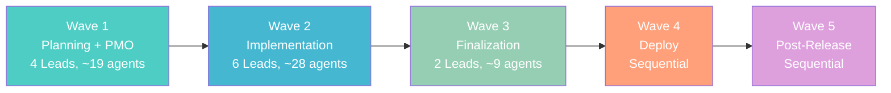
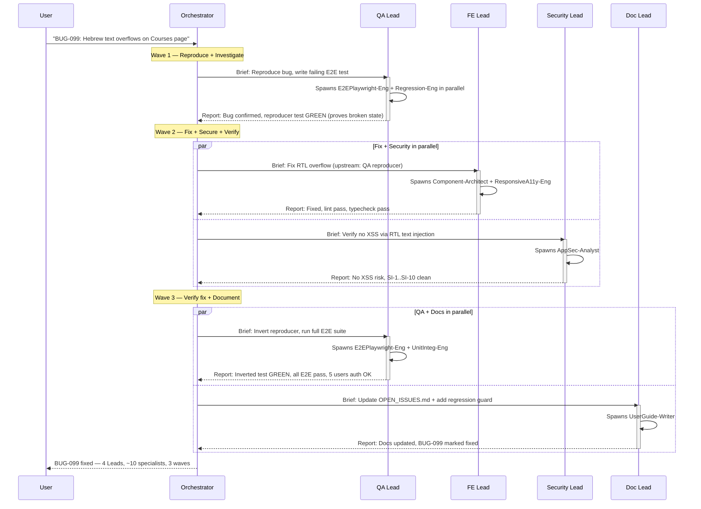

# Agent Hierarchy — Operations & Reference

> Part of the [Hierarchical Agent Architecture](./AGENT-HIERARCHY.md). See also [Lead Protocols & Iron Rules](./AGENT-HIERARCHY-PROTOCOLS.md).

---

## Skills + MCP Summary Matrix

### MCP Tool Assignment (by Division)

| MCP Server               | Product | Arch | UX  | PMO | FE  | BE  | DB  | Security | QA  | Docs | DevOps |
| ------------------------ | ------- | ---- | --- | --- | --- | --- | --- | -------- | --- | ---- | ------ |
| `memory`                 | Y       | Y    | —   | —   | —   | —   | —   | Y        | —   | Y    | —      |
| `sequential-thinking`    | Y       | Y    | —   | —   | —   | —   | Y   | Y        | —   | —    | —      |
| `eslint`                 | —       | —    | —   | —   | Y   | Y   | Y   | Y        | Y   | —    | —      |
| `github`                 | —       | —    | —   | —   | —   | —   | —   | Y        | —   | Y    | Y      |
| `tavily`                 | Y       | Y    | Y   | —   | —   | —   | —   | —        | —   | —    | —      |
| `postgres`               | —       | Y    | —   | —   | —   | Y   | Y   | Y        | Y   | —    | Y      |
| `graphql`                | —       | Y    | —   | —   | Y   | Y   | —   | Y        | Y   | Y    | —      |
| `nats`                   | —       | —    | —   | —   | —   | Y   | —   | —        | —   | —    | —      |
| `typescript-diagnostics` | —       | —    | —   | —   | Y   | Y   | —   | —        | Y   | —    | —      |
| `playwright`             | —       | —    | Y   | —   | Y   | —   | —   | Y        | Y   | —    | —      |
| `context7`               | —       | —    | Y   | —   | Y   | Y   | —   | —        | —   | —    | Y      |

### Core Skills (per Specialist)

| Specialist              | Skill 1                           | Skill 2                           | Skill 3                        | Skill 4 |
| ----------------------- | --------------------------------- | --------------------------------- | ------------------------------ | ------- |
| Component-Architect     | `react-expert`                    | `react-composition-patterns`      | `typescript-advanced-patterns` | —       |
| StatePerf-Eng           | `react-state-management`          | `react-performance-optimizer`     | —                              | —       |
| ResponsiveA11y-Eng      | `responsive-web-design`           | `accessibility-compliance`        | `internationalization-i18n`    | —       |
| Mobile-Engineer         | `react-native-expert`             | `expo-sdk-54-mobile-edusphere`    | `mobile-app-testing`           | —       |
| API-Architect           | `graphql-federation-edusphere`    | `graphql-architect`               | `apollo-federation`            | —       |
| DomainLogic-Eng         | `nestjs-best-practices`           | `error-handling-patterns`         | `zod`                          | —       |
| BackgroundJobs-Eng      | `nats-jetstream-patterns`         | `nodejs-backend-patterns`         | —                              | —       |
| AIAgent-Specialist      | `langgraph-agent-workflows`       | `ai-engineer`                     | `streaming-patterns`           | —       |
| GraphQL-ContractTester  | `api-contract-testing`            | `graphql-federation-edusphere`    | `test-driven-development`      | —       |
| Schema-Architect        | `drizzle-orm-edusphere`           | `postgresql-table-design`         | `access-control-rbac`          | —       |
| QueryOptimizer          | `postgresql-optimization`         | `sql-optimization-patterns`       | —                              | —       |
| Migration-Eng           | `drizzle-migrations`              | `database-migration`              | —                              | —       |
| GraphDB-Specialist      | `apache-age-knowledge-graph`      | `pgvector-hybrid-rag`             | `postgresql-optimization`      | —       |
| AppSec-Analyst          | `security-reviewer`               | `api-security-hardening`          | —                              | —       |
| PenTest-Spec            | `vulnerability-scanning`          | `stride-analysis-patterns`        | —                              | —       |
| AuthPrivacy-Eng         | `auth-implementation-patterns`    | `gdpr-data-handling`              | —                              | —       |
| InfraSec-Specialist     | `secrets-management`              | `docker-containerization`         | `kubernetes-specialist`        | —       |
| UnitInteg-Eng           | `javascript-testing-patterns`     | `vitest-testing-patterns`         | —                              | —       |
| E2EPlaywright-Eng       | `playwright-expert`               | `playwright-screenshot-inspector` | —                              | —       |
| Regression-Eng          | `systematic-debugging`            | `test-driven-development`         | —                              | —       |
| Mobile-E2E-Eng          | `mobile-app-testing`              | `react-native-expert`             | `e2e-testing-patterns`         | —       |
| APIDocs-Writer          | `api-reference-documentation`     | `graphql-schema`                  | —                              | —       |
| ArchDocs-Writer         | `architecture-decision-records`   | `mermaid-graph-writer`            | —                              | —       |
| CICD-Eng                | `github-actions-pipeline-builder` | `github-actions-templates`        | —                              | —       |
| Deploy-Validator        | `docker-containerization`         | `monitoring-expert`               | —                              | —       |
| GitOps-Eng              | `git-advanced-workflows`          | `turborepo-caching`               | —                              | —       |
| Observability-Eng       | `distributed-tracing`             | `monitoring-observability`        | `grafana-dashboards`           | —       |
| Wave-Planner            | `executing-plans`                 | `task-decomposer`                 | `dispatching-parallel-agents`  | —       |
| Risk-Dependency-Tracker | `task-coordination-strategies`    | `checklist-discipline`            | —                              | —       |
| Progress-Reporter       | `project-management-guru-adhd`    | `checklist-discipline`            | —                              | —       |
| Resource-Monitor        | `dispatching-parallel-agents`     | `task-coordination-strategies`    | —                              | —       |

---

## Wave Execution Model

### Concurrency Math

```
Wave 1 (4 Leads -> ~18 total agents):
  ProductLead + ArchLead + UXLead + PMOLead
  Each spawns 3-4 specialists internally
  Concurrency: 4 leads + ~15 specialists = 19
  PMOLead plans execution for Waves 2+

Wave 2 (6 Leads -> ~28 total agents):
  FELead (4) + API-Lead (2) + ServicesLead (3) + DBLead (4) + SecurityLead (4) + QALead (5)
  Each spawns 2-5 specialists internally
  Concurrency: 6 leads + ~22 specialists = 28

Wave 3 (2 Leads -> ~9 total agents):
  DocLead (3 specs) + DevOpsLead (4 specs)
  Each spawns 3-4 specialists internally
  Concurrency: 2 leads + 7 specialists = 9

TOTAL PEAK: ~28 concurrent agents (vs. 5 in flat model — 5.6x improvement)
Specialist density ratio: 3.8:1 (46 specialists / 12 leads)
```

### Wave Dependencies



### Wave Launch Rules

- **Wave 1** launches ALL 4 Leads in a single message (4 parallel agents: Product + Arch + UX + PMO). PMOLead plans execution for Waves 2+. Each Lead internally spawns its 3-4 specialists.
- **Wave 2** launches AFTER Wave 1 approvals — all 6 Leads launch together. Each Lead internally spawns its specialists.
- **Wave 3** launches AFTER Wave 2 approvals — both Leads launch in parallel.
- **Waves 4-5** are sequential (deploy then verify).
- **Platform constraint:** Claude Code SDK supports max ~5 concurrent agents at the Orchestrator level. Since each Lead is one agent from the Orchestrator's perspective, and Leads spawn their own specialists internally, the hierarchy bypasses the 5-agent limit.

### Sub-Wave Handling

If a wave has more than 5 Leads (unlikely but possible for special tasks):

1. First 5 Leads launch simultaneously
2. As Leads complete, remaining Leads launch
3. This is transparent to the user

---

## Live Example: Bug Fix Flow (BUG-099)

**Scenario:** A Hebrew RTL layout bug in the Courses page — text overflows container.



### Bug Fix Division Mapping

| Bug Fix Phase           | Lead                     | Specialists Used                                 |
| ----------------------- | ------------------------ | ------------------------------------------------ |
| Phase 0 (Reproduce)     | QALead                   | E2EPlaywright-Eng, Regression-Eng                |
| Phase 1 (Discovery)     | QALead                   | Regression-Eng (3-wave search)                   |
| Phase 2 (Root Cause)    | FELead or BELead         | Component-Architect or DomainLogic-Eng           |
| Phase 3 (Fix Rounds)    | FELead + BELead + DBLead | All relevant specialists                         |
| Phase 4 (Verification)  | QALead + SecurityLead    | E2EPlaywright-Eng, UnitInteg-Eng, AppSec-Analyst |
| Phase 5 (Documentation) | DocLead                  | UserGuide-Writer                                 |

---

## Monitoring Rules

### Silence Escalation Protocol

| Time Since Last Response | Action                                                |
| ------------------------ | ----------------------------------------------------- |
| 3 minutes                | Lead pings specialist with status request             |
| 5 minutes                | Lead re-spawns specialist with simplified scope       |
| 7 minutes                | Lead reports BLOCKED to Orchestrator with diagnostics |
| 10 minutes               | Orchestrator re-spawns the Lead with fresh context    |

### Availability Guarantees

| Entity            | Available To | Guarantee                                                                                                                                     |
| ----------------- | ------------ | --------------------------------------------------------------------------------------------------------------------------------------------- |
| **Orchestrator**  | User         | Continuously available throughout task execution. Proactive status updates every 3 minutes. Never goes silent.                                |
| **Division Lead** | Orchestrator | Continuously available during division's active phase. Reports immediately on completion, failure, or blocking. Max response time: 5 minutes. |
| **Division Lead** | Specialists  | Continuously available to receive specialist outputs and provide re-briefs. Never delays specialist unblocking.                               |
| **Specialist**    | Lead         | Returns result upon completion. If running >5 min without output, Lead proactively checks status.                                             |

**Iron Rule:** No entity in the hierarchy may go silent. If a Lead does not report within 7 minutes, the Orchestrator re-spawns it. If a Specialist does not return within 5 minutes, the Lead re-spawns it.

### Orchestrator Progress Reporting

The Orchestrator reports to the user every 3 minutes using this format:

```
[Progress: XX%] Wave N — Active Leads: {Lead1, Lead2, ...}
  Lead1: {status} — Specialists: {count active}/{count total}
  Lead2: {status} — Specialists: {count active}/{count total}
  Completed this cycle: {list of deliverables}
  Next: {upcoming actions}
```

### Agent Tracking Table (Updated Format)

The hierarchical model extends the tracking table with Lead/Specialist distinction:

| ID       | Level      | Division              | Mission                      | Status  |
| -------- | ---------- | --------------------- | ---------------------------- | ------- |
| Agent-1  | Lead       | QA & Validation       | Reproduce BUG-099, write E2E | Running |
| Agent-1a | Specialist | QA & Validation       | E2E Playwright reproducer    | Running |
| Agent-1b | Specialist | QA & Validation       | Regression pattern search    | Running |
| Agent-2  | Lead       | Frontend Engineering  | Fix RTL overflow             | Waiting |
| Agent-3  | Lead       | Security & Compliance | Verify no XSS via RTL        | Waiting |

**Naming convention:**

- `Agent-N` = Lead (top-level agent spawned by Orchestrator)
- `Agent-Na` / `Agent-Nb` / `Agent-Nc` = Specialists (spawned by Lead N)

---

## Verification Checklist

When validating the hierarchical model is working correctly:

1. Leads spawn specialists correctly (not doing work themselves)
2. Skills are loaded in specialist prompts
3. MCP tools are used by the correct agents
4. Cross-division data flows through Orchestrator (never direct Lead-to-Lead)
5. Silence monitoring works — Lead escalates if specialist does not respond in 5 min
6. Quality gates run at division level before reporting to Orchestrator
7. Retry logic works — max 2 retries before escalation
8. Division Reports follow the standardized format

---

## Shared Intelligence Layer (HiveMind Integration)

### Architecture

All agents in the 3-level hierarchy share access to 3 new MCP servers that provide cross-agent memory, coordination, and learning:

| Tier | MCP Server            | Backend           | Purpose                                                             | Tools |
| ---- | --------------------- | ----------------- | ------------------------------------------------------------------- | ----- |
| 1    | `hivemind`            | Cloud + Local     | Community KB, event log, FTS search                                 | 7     |
| 2    | `vector-memory`       | ChromaDB (Docker) | Persistent semantic search over decisions, bugs, patterns           | 12    |
| 3    | `coordination-bridge` | SQLite (local)    | Pub/sub, file locks, agent status, help requests, violation logging | 15    |

### Data Flow

1. **At session start:** Agent queries vector-memory for relevant past decisions
2. **During work:** Agent publishes events to coordination-bridge, locks files before editing
3. **Cross-division:** Agent sends help requests via coordination-bridge (lateral communication)
4. **At task end:** Agent stores decisions/patterns in vector-memory, contributes to hivemind
5. **Next session:** Future agents find these decisions via semantic search

### MCP Tool Assignment Matrix (Updated)

| MCP Server            | Product | Arch | UX  | PMO | FE  | BE  | DB  | Security | QA  | Docs | DevOps |
| --------------------- | ------- | ---- | --- | --- | --- | --- | --- | -------- | --- | ---- | ------ |
| `hivemind`            | Y       | Y    | —   | —   | Y   | Y   | Y   | Y        | Y   | Y    | Y      |
| `vector-memory`       | —       | Y    | —   | —   | Y   | Y   | Y   | Y        | Y   | Y    | —      |
| `coordination-bridge` | —       | —    | —   | —   | Y   | Y   | Y   | —        | Y   | —    | Y      |

### Configuration

- `hivemind` -> global `settings.json` (7 tools, available across all projects)
- `vector-memory` -> project `.mcp.json` (12 tools, only when working on EduSphere)
- `coordination-bridge` -> project `.mcp.json` (15 tools, only when working on EduSphere)
