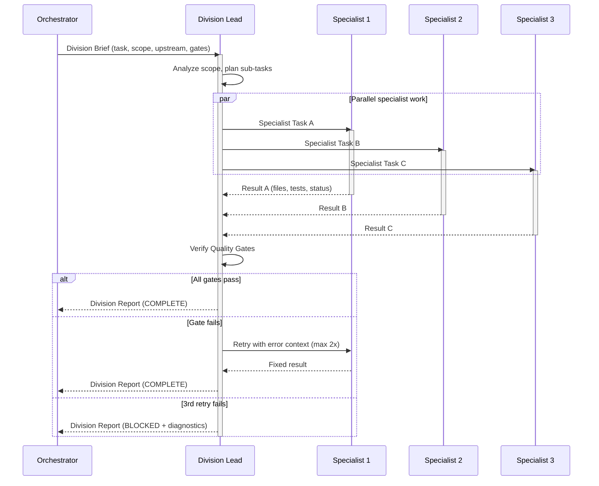
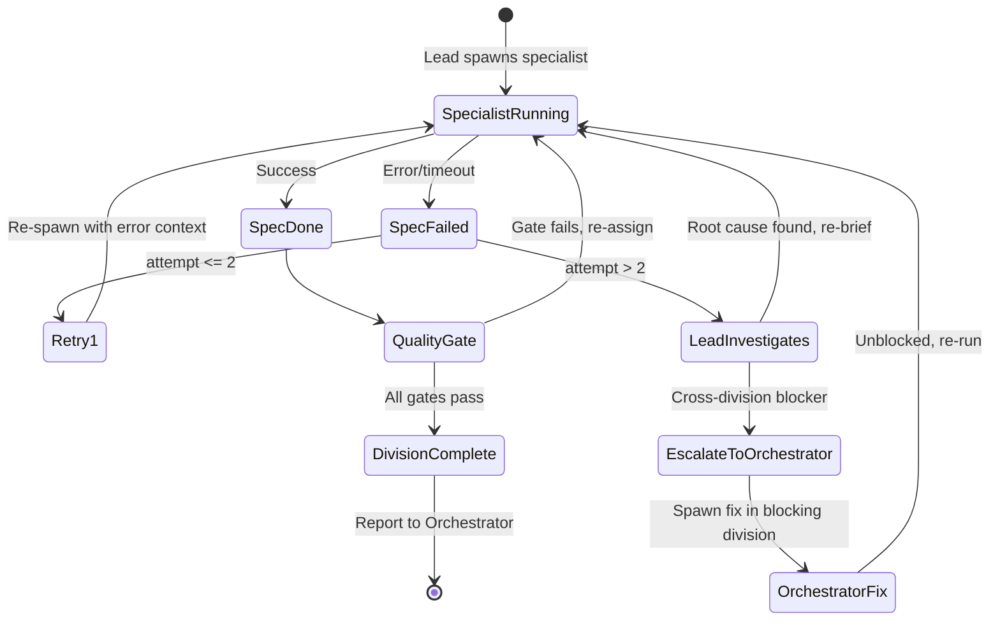

# Hierarchical Agent Architecture — Division Leads + Specialists

## Context

**Problem:** EduSphere currently uses a **flat orchestration model** — the Orchestrator spawns one agent per division directly, managing all 10+ agents itself. This creates a bottleneck: no division-internal quality gates, no specialist delegation, and the 5-agent concurrency limit caps total parallelism at 5.

**Goal:** Implement a **3-level hierarchical agent model** where each division (11 divisions, excluding Orchestrator) has a **Division Lead** + **2-5 Specialist agents**. The Orchestrator communicates ONLY with Division Leads. Leads manage, delegate, verify, and report. Each agent has pre-loaded Skills and MCP tools for its domain.

**Outcome:** 5.8x parallelism improvement (5 to ~29 concurrent agents), division-level quality ownership, skills-equipped specialists, and cleaner Orchestrator focus.

> **Note (2026-03-30):** The former BELead has been split into **API-Lead** (SDL/federation/contracts, 2 specialists) and **ServicesLead** (business logic/NATS/AI, 3 specialists). See [APILead.md](agent-prompts/APILead.md) and [ServicesLead.md](agent-prompts/ServicesLead.md). Cross-Lead sync windows are mandatory before Wave 2 specialists spawn — see [CROSS_LEAD_SYNC_PROTOCOL.md](../operations/CROSS_LEAD_SYNC_PROTOCOL.md).

### 3-Level Hierarchy

| Level | Role | Count | Responsibility |
|-------|------|-------|----------------|
| **Level 0** | Orchestrator | 1 | Coordinates Leads, tracks progress, communicates with user |
| **Level 1** | Division Leads | 11 | Plans, delegates to specialists, verifies quality gates, reports |
| **Level 2** | Specialists | 42+ | Implements code, tests, docs, security audits, deployments |

**Specialist density ratio:** 3.8:1 (42 specialists / 11 leads)

**Related:** [Lead Protocols & Iron Rules](./AGENT-HIERARCHY-PROTOCOLS.md) | [Operations & Reference](./AGENT-HIERARCHY-OPERATIONS.md)

## Architecture Diagram

```mermaid
graph TD
    O["ORCHESTRATOR<br/>Level 0 — Coordinator Only"]

    subgraph W1["Wave 1 — Planning (3 Leads)"]
        PL["ProductLead"]
        AL["ArchLead"]
        UL["UXLead"]
    end

    subgraph W2["Wave 2 — Implementation (6 Leads)"]
        FL["FELead"]
        APIL["API-Lead"]
        SVCL["ServicesLead"]
        DL["DBLead"]
        SL["SecurityLead"]
        QL["QALead"]
    end

    subgraph W3["Wave 3 — Finalization (2 Leads)"]
        DocL["DocLead"]
        DevL["DevOpsLead"]
    end

    O -->|"Brief"| PL
    O -->|"Brief"| AL
    O -->|"Brief"| UL
    O -->|"Brief + W1 outputs"| FL
    O -->|"Brief + W1 outputs"| APIL
    O -->|"Brief + W1 outputs"| SVCL
    O -->|"Brief + W1 outputs"| DL
    O -->|"Brief + W1 outputs"| SL
    O -->|"Brief + W1 outputs"| QL
    O -->|"Brief + W2 outputs"| DocL
    O -->|"Brief + W2 outputs"| DevL

    PL --> PS1["PRD-Analyst"] & PS2["EdgeCase-Analyst"] & PS3["AccCriteria-Eng"] & PS4["Risk-Analyst"]
    AL --> AS1["SystemImpact-Analyst"] & AS2["Perf-Architect"] & AS3["DomainModeler"]
    UL --> US1["FlowDesigner"] & US2["A11y-Auditor"] & US3["DesignSys-Eng"] & US4["Microcopy-Reviewer"]
    FL --> FS1["Component-Architect"] & FS2["StatePerf-Eng"] & FS3["ResponsiveA11y-Eng"] & FS4["Mobile-Engineer"]
    APIL --> APS1["API-Architect"] & APS2["GraphQL-ContractTester"]
    SVCL --> SVS1["DomainLogic-Eng"] & SVS2["BackgroundJobs-Eng"] & SVS3["AIAgent-Specialist"]
    DL --> DS1["Schema-Architect"] & DS2["QueryOptimizer"] & DS3["Migration-Eng"] & DS4["GraphDB-Specialist"]
    SL --> SS1["AppSec-Analyst"] & SS2["PenTest-Spec"] & SS3["AuthPrivacy-Eng"] & SS4["InfraSec-Specialist"]
    QL --> QS1["UnitInteg-Eng"] & QS2["E2EPlaywright-Eng"] & QS3["LoadCompat-Eng"] & QS4["Regression-Eng"] & QS5["Mobile-E2E-Eng"]
    DocL --> DoS1["APIDocs-Writer"] & DoS2["UserGuide-Writer"] & DoS3["ArchDocs-Writer"]
    DevL --> DeS1["CICD-Eng"] & DeS2["Deploy-Validator"] & DeS3["GitOps-Eng"] & DeS4["Observability-Eng"]

    style O fill:#ff6b6b,color:#fff,stroke:#333
    style PL fill:#4ecdc4,color:#fff
    style AL fill:#4ecdc4,color:#fff
    style UL fill:#4ecdc4,color:#fff
    style FL fill:#45b7d1,color:#fff
    style APIL fill:#45b7d1,color:#fff
    style SVCL fill:#45b7d1,color:#fff
    style DL fill:#45b7d1,color:#fff
    style SL fill:#45b7d1,color:#fff
    style QL fill:#45b7d1,color:#fff
    style DocL fill:#96ceb4,color:#fff
    style DevL fill:#96ceb4,color:#fff
```

## Communication Flow

## Failure Handling State Machine

## Per-Division Breakdown

### Division 2: Product & Requirements

| Role | Agent | Produces | Skills | MCP Tools |
|------|-------|----------|--------|-----------|
| **Lead** | ProductLead | Division report | `product-skills`, `sequential-thinking` | `memory`, `tavily` |
| Spec 1 | PRD-Analyst | PRD delta doc | `product-skills`, `brainstorming` | `tavily`, `memory` |
| Spec 2 | EdgeCase-Analyst | Edge case catalog | `stride-analysis-patterns`, `systems-thinking` | `sequential-thinking`, `tavily` |
| Spec 3 | AccCriteria-Eng | Given/When/Then criteria | `product-skills`, `test-driven-development` | `memory` |
| Spec 4 | Risk-Analyst | Risk matrix | `stride-analysis-patterns`, `systems-thinking` | `tavily`, `sequential-thinking` |

**Quality Gate:** All acceptance criteria testable. Risk matrix has mitigations for HIGH items. Edge cases cover multi-tenant + offline + concurrent.

### Division 3: Software Architecture

| Role | Agent | Produces | Skills | MCP Tools |
|------|-------|----------|--------|-----------|
| **Lead** | ArchLead | ADR, impact, perf budget | `architecture-patterns`, `architecture-decision-records` | `memory`, `sequential-thinking` |
| Spec 1 | SystemImpact-Analyst | Affected subgraphs map | `microservices-patterns`, `graphql-federation-edusphere` | `graphql`, `postgres` |
| Spec 2 | Perf-Architect | Latency/memory budgets | `performance-profiling`, `caching-strategies` | `postgres`, `sequential-thinking` |
| Spec 3 | DomainModeler | Entity relationships | `graphql-architect`, `database-design-patterns` | `graphql`, `postgres` |

**Quality Gate:** ADR produced for non-trivial decisions. Federation entity ownership clear. Performance budget defined.

### Division 4: UX/UI Design

| Role | Agent | Produces | Skills | MCP Tools |
|------|-------|----------|--------|-----------|
| **Lead** | UXLead | UX review, a11y report | `accessibility-compliance`, `design-system-creator` | `playwright`, `memory` |
| Spec 1 | FlowDesigner | User flow diagrams | `interaction-design`, `responsive-design` | `playwright` |
| Spec 2 | A11y-Auditor | WCAG 2.1 AA checklist | `wcag-audit-patterns`, `screen-reader-testing` | `playwright` |
| Spec 3 | DesignSys-Eng | shadcn/Tailwind compliance | `design-system-patterns`, `tailwind-v4-shadcn` | `context7` |
| Spec 4 | Microcopy-Reviewer | i18n/RTL coverage | `internationalization-i18n`, `responsive-design` | `tavily` |

**Quality Gate:** All flows have error states. WCAG AA complete. No hardcoded English. RTL verified. Design tokens consistent.

### Division 5: Frontend Engineering

| Role | Agent | Produces | Skills | MCP Tools |
|------|-------|----------|--------|-----------|
| **Lead** | FELead | Verified FE deliverables | `react-expert`, `react-state-management` | `typescript-diagnostics`, `eslint` |
| Spec 1 | Component-Architect | React components, hooks | `react-expert`, `react-composition-patterns`, `typescript-advanced-patterns` | `eslint`, `typescript-diagnostics`, `context7` |
| Spec 2 | StatePerf-Eng | TanStack/Zustand integration | `react-state-management`, `react-performance-optimizer` | `eslint`, `typescript-diagnostics`, `graphql` |
| Spec 3 | ResponsiveA11y-Eng | Responsive + ARIA + RTL | `responsive-web-design`, `accessibility-compliance`, `internationalization-i18n` | `eslint`, `playwright`, `typescript-diagnostics` |
| Spec 4 | Mobile-Engineer | Expo SDK 54, RN components, offline-first, expo-sqlite | `react-native-expert`, `expo-sdk-54-mobile-edusphere`, `mobile-app-testing` | `eslint`, `typescript-diagnostics`, `context7` |

**Quality Gate:** `typecheck` 0 errors. `lint` 0 errors. All components tested. No `any`. No `console.log`. Files <=150 lines. Mobile parity verified.

### Division 6a: API Engineering (split from Backend Engineering)

> **Prompt:** [APILead.md](agent-prompts/APILead.md) | **Cross-Lead Sync:** [CROSS_LEAD_SYNC_PROTOCOL.md](../operations/CROSS_LEAD_SYNC_PROTOCOL.md)

| Role | Agent | Produces | Skills | MCP Tools |
|------|-------|----------|--------|-----------|
| **Lead** | API-Lead | Verified SDL/federation deliverables | `graphql-federation-edusphere`, `graphql-architect` | `typescript-diagnostics`, `eslint`, `graphql` |
| Spec 1 | API-Architect | SDL schemas, resolvers, federation stubs, breaking change detection | `graphql-federation-edusphere`, `hive-gateway-v2-patterns`, `graphql-architect`, `apollo-federation` | `eslint`, `typescript-diagnostics`, `graphql` |
| Spec 2 | GraphQL-ContractTester | Federation composition validation, entity resolution tests, SDL contract checks, authorization directive verification | `graphql-federation-edusphere`, `api-contract-testing`, `graphql-authorization-directives-edusphere`, `hive-gateway-v2-patterns` | `graphql`, `eslint`, `typescript-diagnostics` |

**Quality Gate:** SDL valid. Federation composes. No breaking changes. All resolvers tested. Auth directives present. Entity resolution correct.

**Cross-Lead Syncs (mandatory before specialist spawn):**
- Sync 1: API-Lead + DBLead (schema fields match SDL types)
- Sync 2: API-Lead + FELead (GraphQL fields exist before component coding)

### Division 6b: Services Engineering (split from Backend Engineering)

> **Prompt:** [ServicesLead.md](agent-prompts/ServicesLead.md)

| Role | Agent | Produces | Skills | MCP Tools |
|------|-------|----------|--------|-----------|
| **Lead** | ServicesLead | Verified service/NATS/AI deliverables | `nestjs-best-practices`, `nats-jetstream-patterns` | `typescript-diagnostics`, `eslint`, `nats`, `context7` |
| Spec 1 | DomainLogic-Eng | NestJS services, Zod schemas, Drizzle queries | `nestjs-best-practices`, `error-handling-patterns`, `zod` | `eslint`, `typescript-diagnostics`, `context7` |
| Spec 2 | BackgroundJobs-Eng | NATS handlers, async workflows | `nats-jetstream-patterns`, `nodejs-backend-patterns` | `eslint`, `typescript-diagnostics`, `nats` |
| Spec 3 | AIAgent-Specialist | LangGraph.js state machines, Vercel AI SDK v6, HybridRAG, gVisor sandboxing | `langgraph-agent-workflows`, `memory-safety-resource-lifecycle-edusphere`, `pgvector-hybrid-rag` | `eslint`, `typescript-diagnostics`, `context7`, `nats` |

**Quality Gate:** All mutations have Zod. No raw SQL. Pino logger. `OnModuleDestroy` for connections. Timer cleanup. NATS TLS (SI-7). AI consent check (SI-10). RLS enforcement.

### Division 7: Database & Data

| Role | Agent | Produces | Skills | MCP Tools |
|------|-------|----------|--------|-----------|
| **Lead** | DBLead | Verified DB deliverables | `drizzle-orm-edusphere`, `postgresql-optimization` | `postgres`, `eslint` |
| Spec 1 | Schema-Architect | Drizzle schemas, RLS | `drizzle-orm-edusphere`, `postgresql-table-design`, `access-control-rbac` | `postgres`, `eslint` |
| Spec 2 | QueryOptimizer | EXPLAIN plans, indexes | `postgresql-optimization`, `sql-optimization-patterns` | `postgres`, `sequential-thinking` |
| Spec 3 | Migration-Eng | Migrations, rollback, seeds | `drizzle-migrations`, `database-migration` | `postgres`, `eslint` |
| Spec 4 | GraphDB-Specialist | Apache AGE Cypher queries, ontology design, knowledge graph integrity, HybridRAG fusion | `apache-age-knowledge-graph`, `pgvector-hybrid-rag`, `postgresql-optimization` | `postgres`, `sequential-thinking` |

**Quality Gate:** All tables RLS-enabled. `withTenantContext()` everywhere. Rollback path exists. `test:rls` passes. No `new Pool()`. Graph ontology consistent.

### Division 8: Security & Compliance

| Role | Agent | Produces | Skills | MCP Tools |
|------|-------|----------|--------|-----------|
| **Lead** | SecurityLead | SI-1..SI-10 audit | `security-auditor`, `access-control-rbac` | `postgres`, `sequential-thinking`, `memory` |
| Spec 1 | AppSec-Analyst | XSS/injection/secret scans | `security-reviewer`, `api-security-hardening` | `eslint`, `postgres` |
| Spec 2 | PenTest-Spec | Auth bypass, IDOR, RLS escape | `vulnerability-scanning`, `stride-analysis-patterns` | `postgres`, `playwright` |
| Spec 3 | AuthPrivacy-Eng | JWT scopes, GDPR, SI-10 | `auth-implementation-patterns`, `gdpr-data-handling`, `hipaa-compliance` | `postgres`, `graphql` |
| Spec 4 | InfraSec-Specialist | Dockerfile hardening (SI-5), inter-service TLS (SI-6), K8s RBAC, admission controllers, network policies | `secrets-management`, `docker-containerization`, `kubernetes-specialist` | `github`, `sequential-thinking` |

**Quality Gate:** SI-1..SI-10 all PASS. `test:security` passes (1,370+). No unprotected endpoints. No PII without encryption. Dockerfiles hardened. mTLS configured.

### Division 9: QA & Validation

| Role | Agent | Produces | Skills | MCP Tools |
|------|-------|----------|--------|-----------|
| **Lead** | QALead | Full test report | `playwright-expert`, `e2e-testing-patterns` | `playwright`, `eslint`, `typescript-diagnostics` |
| Spec 1 | UnitInteg-Eng | Unit + integration tests | `javascript-testing-patterns`, `vitest-testing-patterns` | `eslint`, `typescript-diagnostics` |
| Spec 2 | E2EPlaywright-Eng | E2E specs, screenshots | `playwright-expert`, `playwright-screenshot-inspector` | `playwright`, `eslint` |
| Spec 3 | LoadCompat-Eng | Load tests, cross-browser | `web-performance-audit`, `api-testing` | `playwright`, `postgres` |
| Spec 4 | Regression-Eng | Bug reproducers, pattern-clean | `systematic-debugging`, `test-driven-development` | `eslint`, `typescript-diagnostics` |
| Spec 5 | Mobile-E2E-Eng | Detox E2E specs, cross-platform testing, offline sync tests, mobile visual regression | `mobile-app-testing`, `react-native-expert`, `e2e-testing-patterns` | `typescript-diagnostics`, `eslint` |

**Quality Gate:** `pnpm turbo test` 100%. `typecheck` 0 errors. `lint` 0 errors. All E2E pass. 5 users authenticate. Health-check passes. Coverage met. Mobile E2E pass.

### Division 10: Documentation

| Role | Agent | Produces | Skills | MCP Tools |
|------|-------|----------|--------|-----------|
| **Lead** | DocLead | Verified doc updates | `api-reference-documentation`, `architecture-decision-records` | `memory`, `github` |
| Spec 1 | APIDocs-Writer | API_CONTRACTS, schema docs | `api-reference-documentation`, `graphql-schema` | `graphql`, `memory` |
| Spec 2 | UserGuide-Writer | README, OPEN_ISSUES | `technical-writer`, `changelog-automation` | `github`, `memory` |
| Spec 3 | ArchDocs-Writer | Architecture, ADRs, Mermaid | `architecture-decision-records`, `mermaid-graph-writer` | `memory` |

**Quality Gate:** All changed APIs documented. OPEN_ISSUES.md updated. README accurate. Mermaid present for new architecture.

### Division 11: DevOps & Release

| Role | Agent | Produces | Skills | MCP Tools |
|------|-------|----------|--------|-----------|
| **Lead** | DevOpsLead | Deploy readiness report | `devops-engineer`, `deployment-pipeline-design` | `github`, `postgres` |
| Spec 1 | CICD-Eng | Actions validation | `github-actions-pipeline-builder`, `github-actions-templates` | `github` |
| Spec 2 | Deploy-Validator | Docker health, blue-green | `docker-containerization`, `monitoring-expert` | `postgres` |
| Spec 3 | GitOps-Eng | Commits, push, CI verify | `git-advanced-workflows`, `turborepo-caching` | `github` |
| Spec 4 | Observability-Eng | OpenTelemetry tracing, Jaeger architecture, Prometheus metrics, alert rules, SLA correlation | `distributed-tracing`, `monitoring-observability`, `grafana-dashboards` | `sequential-thinking`, `context7` |

**Quality Gate:** `docker-compose build` succeeds. Health-check passes. 5 containers healthy. CI green. Blue-green followed. Traces flowing to Jaeger.
