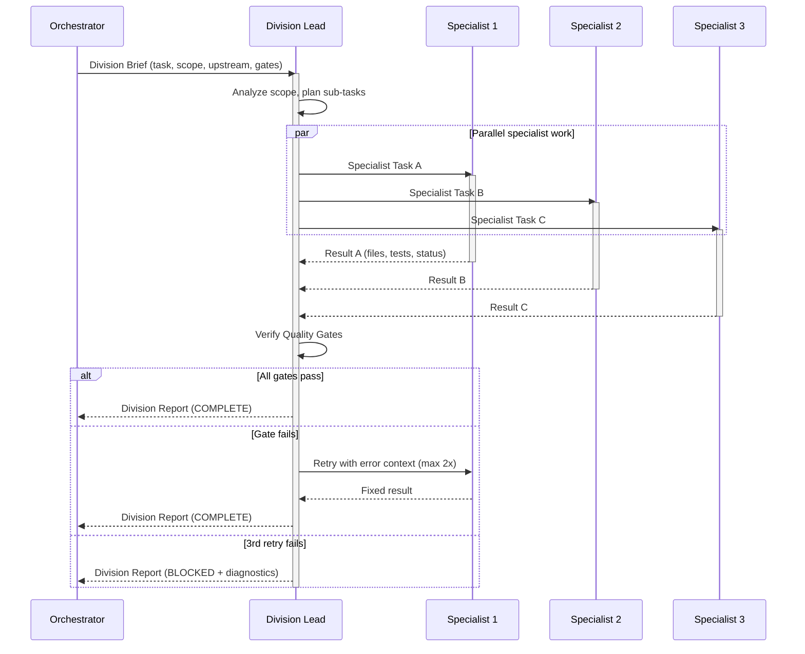
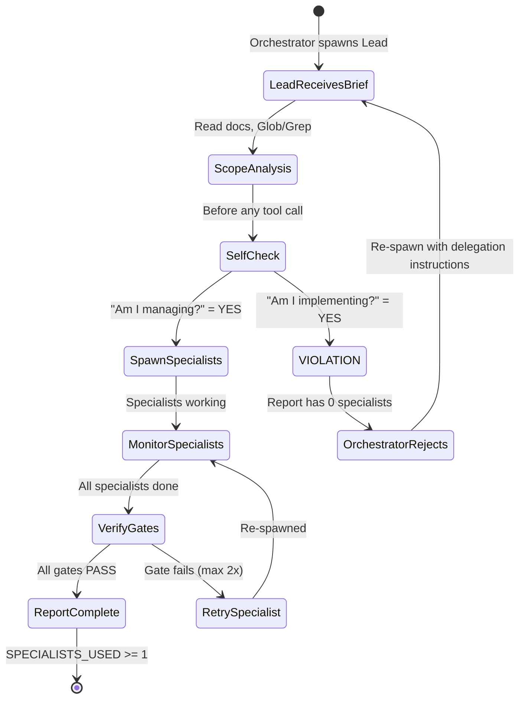
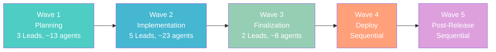
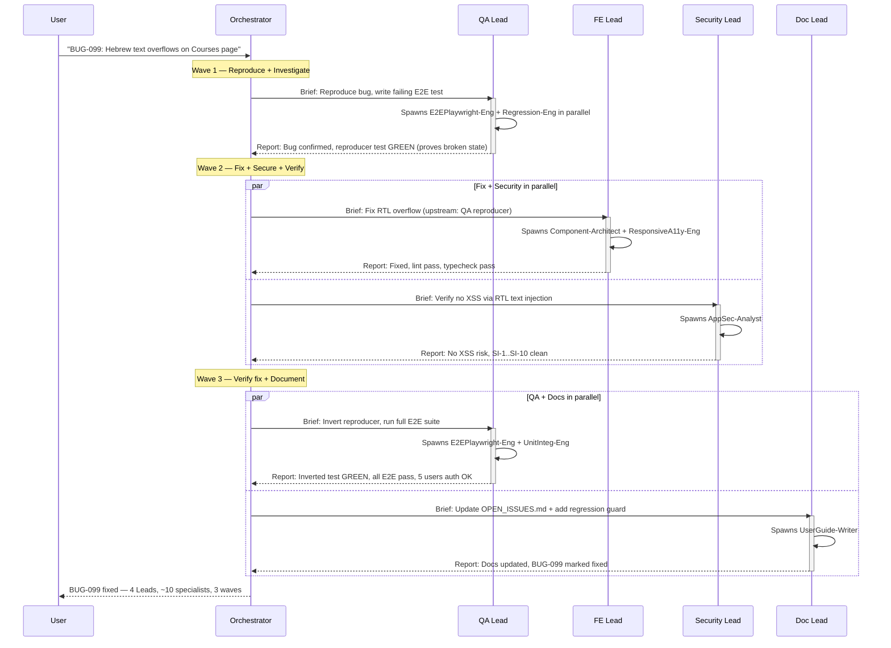

# Hierarchical Agent Architecture — Division Leads + Specialists

## Context

**Problem:** EduSphere currently uses a **flat orchestration model** — the Orchestrator spawns one agent per division directly, managing all 10+ agents itself. This creates a bottleneck: no division-internal quality gates, no specialist delegation, and the 5-agent concurrency limit caps total parallelism at 5.

**Goal:** Implement a **3-level hierarchical agent model** where each division (10 divisions, excluding Orchestrator) has a **Division Lead** + **3+ Specialist agents**. The Orchestrator communicates ONLY with Division Leads. Leads manage, delegate, verify, and report. Each agent has pre-loaded Skills and MCP tools for its domain.

**Outcome:** 4.6x parallelism improvement (5 to ~23 concurrent agents), division-level quality ownership, skills-equipped specialists, and cleaner Orchestrator focus.

### 3-Level Hierarchy

| Level | Role | Count | Responsibility |
|-------|------|-------|----------------|
| **Level 0** | Orchestrator | 1 | Coordinates Leads, tracks progress, communicates with user |
| **Level 1** | Division Leads | 10 | Plans, delegates to specialists, verifies quality gates, reports |
| **Level 2** | Specialists | 33+ | Implements code, tests, docs, security audits, deployments |

---

## Architecture Diagram

```mermaid
graph TD
    O["ORCHESTRATOR<br/>Level 0 — Coordinator Only"]

    subgraph W1["Wave 1 — Planning (3 Leads)"]
        PL["ProductLead"]
        AL["ArchLead"]
        UL["UXLead"]
    end

    subgraph W2["Wave 2 — Implementation (5 Leads)"]
        FL["FELead"]
        BL["BELead"]
        DL["DBLead"]
        SL["SecurityLead"]
        QL["QALead"]
    end

    subgraph W3["Wave 3 — Finalization (2 Leads)"]
        DocL["DocLead"]
        DevL["DevOpsLead"]
    end

    O -->|"Brief"| PL
    O -->|"Brief"| AL
    O -->|"Brief"| UL
    O -->|"Brief + W1 outputs"| FL
    O -->|"Brief + W1 outputs"| BL
    O -->|"Brief + W1 outputs"| DL
    O -->|"Brief + W1 outputs"| SL
    O -->|"Brief + W1 outputs"| QL
    O -->|"Brief + W2 outputs"| DocL
    O -->|"Brief + W2 outputs"| DevL

    PL --> PS1["PRD-Analyst"] & PS2["EdgeCase-Analyst"] & PS3["AccCriteria-Eng"] & PS4["Risk-Analyst"]
    AL --> AS1["SystemImpact-Analyst"] & AS2["Perf-Architect"] & AS3["DomainModeler"]
    UL --> US1["FlowDesigner"] & US2["A11y-Auditor"] & US3["DesignSys-Eng"] & US4["Microcopy-Reviewer"]
    FL --> FS1["Component-Architect"] & FS2["StatePerf-Eng"] & FS3["ResponsiveA11y-Eng"]
    BL --> BS1["API-Architect"] & BS2["DomainLogic-Eng"] & BS3["BackgroundJobs-Eng"]
    DL --> DS1["Schema-Architect"] & DS2["QueryOptimizer"] & DS3["Migration-Eng"]
    SL --> SS1["AppSec-Analyst"] & SS2["PenTest-Spec"] & SS3["AuthPrivacy-Eng"]
    QL --> QS1["UnitInteg-Eng"] & QS2["E2EPlaywright-Eng"] & QS3["LoadCompat-Eng"] & QS4["Regression-Eng"]
    DocL --> DoS1["APIDocs-Writer"] & DoS2["UserGuide-Writer"] & DoS3["ArchDocs-Writer"]
    DevL --> DeS1["CICD-Eng"] & DeS2["Deploy-Validator"] & DeS3["GitOps-Eng"]

    style O fill:#ff6b6b,color:#fff,stroke:#333
    style PL fill:#4ecdc4,color:#fff
    style AL fill:#4ecdc4,color:#fff
    style UL fill:#4ecdc4,color:#fff
    style FL fill:#45b7d1,color:#fff
    style BL fill:#45b7d1,color:#fff
    style DL fill:#45b7d1,color:#fff
    style SL fill:#45b7d1,color:#fff
    style QL fill:#45b7d1,color:#fff
    style DocL fill:#96ceb4,color:#fff
    style DevL fill:#96ceb4,color:#fff
```



---

## Communication Flow



---

## Failure Handling State Machine


---

## Per-Division Breakdown

### Division 2: Product & Requirements

| Role | Agent | Produces | Skills | MCP Tools |
|------|-------|----------|--------|-----------|
| **Lead** | ProductLead | Division report | `product-skills`, `sequential-thinking` | `memory`, `tavily` |
| Spec 1 | PRD-Analyst | PRD delta doc | `product-skills`, `brainstorming` | `tavily`, `memory` |
| Spec 2 | EdgeCase-Analyst | Edge case catalog | `stride-analysis-patterns`, `systems-thinking` | `sequential-thinking`, `tavily` |
| Spec 3 | AccCriteria-Eng | Given/When/Then criteria | `product-skills`, `test-driven-development` | `memory` |
| Spec 4 | Risk-Analyst | Risk matrix | `stride-analysis-patterns`, `systems-thinking` | `tavily`, `sequential-thinking` |

**Quality Gate:** All acceptance criteria testable. Risk matrix has mitigations for HIGH items. Edge cases cover multi-tenant + offline + concurrent.

---

### Division 3: Software Architecture

| Role | Agent | Produces | Skills | MCP Tools |
|------|-------|----------|--------|-----------|
| **Lead** | ArchLead | ADR, impact, perf budget | `architecture-patterns`, `architecture-decision-records` | `memory`, `sequential-thinking` |
| Spec 1 | SystemImpact-Analyst | Affected subgraphs map | `microservices-patterns`, `graphql-federation-edusphere` | `graphql`, `postgres` |
| Spec 2 | Perf-Architect | Latency/memory budgets | `performance-profiling`, `caching-strategies` | `postgres`, `sequential-thinking` |
| Spec 3 | DomainModeler | Entity relationships | `graphql-architect`, `database-design-patterns` | `graphql`, `postgres` |

**Quality Gate:** ADR produced for non-trivial decisions. Federation entity ownership clear. Performance budget defined.

---

### Division 4: UX/UI Design

| Role | Agent | Produces | Skills | MCP Tools |
|------|-------|----------|--------|-----------|
| **Lead** | UXLead | UX review, a11y report | `accessibility-compliance`, `design-system-creator` | `playwright`, `memory` |
| Spec 1 | FlowDesigner | User flow diagrams | `interaction-design`, `responsive-design` | `playwright` |
| Spec 2 | A11y-Auditor | WCAG 2.1 AA checklist | `wcag-audit-patterns`, `screen-reader-testing` | `playwright` |
| Spec 3 | DesignSys-Eng | shadcn/Tailwind compliance | `design-system-patterns`, `tailwind-v4-shadcn` | `context7` |
| Spec 4 | Microcopy-Reviewer | i18n/RTL coverage | `internationalization-i18n`, `responsive-design` | `tavily` |

**Quality Gate:** All flows have error states. WCAG AA complete. No hardcoded English. RTL verified. Design tokens consistent.

---

### Division 5: Frontend Engineering

| Role | Agent | Produces | Skills | MCP Tools |
|------|-------|----------|--------|-----------|
| **Lead** | FELead | Verified FE deliverables | `react-expert`, `react-state-management` | `typescript-diagnostics`, `eslint` |
| Spec 1 | Component-Architect | React components, hooks | `react-expert`, `react-composition-patterns`, `typescript-advanced-patterns` | `eslint`, `typescript-diagnostics`, `context7` |
| Spec 2 | StatePerf-Eng | TanStack/Zustand integration | `react-state-management`, `react-performance-optimizer` | `eslint`, `typescript-diagnostics`, `graphql` |
| Spec 3 | ResponsiveA11y-Eng | Responsive + ARIA + RTL | `responsive-web-design`, `accessibility-compliance`, `internationalization-i18n` | `eslint`, `playwright`, `typescript-diagnostics` |

**Quality Gate:** `typecheck` 0 errors. `lint` 0 errors. All components tested. No `any`. No `console.log`. Files ≤150 lines.

---

### Division 6: Backend Engineering

| Role | Agent | Produces | Skills | MCP Tools |
|------|-------|----------|--------|-----------|
| **Lead** | BELead | Verified BE deliverables | `nestjs-best-practices`, `graphql-architect` | `typescript-diagnostics`, `eslint`, `graphql` |
| Spec 1 | API-Architect | SDL, resolvers, stubs | `graphql-federation-edusphere`, `graphql-architect`, `apollo-federation` | `eslint`, `typescript-diagnostics`, `graphql`, `context7` |
| Spec 2 | DomainLogic-Eng | Services, Zod schemas | `nestjs-best-practices`, `error-handling-patterns`, `zod` | `eslint`, `typescript-diagnostics`, `postgres`, `context7` |
| Spec 3 | BackgroundJobs-Eng | NATS handlers, async | `nats-jetstream-patterns`, `nodejs-backend-patterns` | `eslint`, `typescript-diagnostics`, `nats` |

**Quality Gate:** All mutations have Zod. All resolvers tested. No raw SQL. Pino logger. `OnModuleDestroy` for connections.

---

### Division 7: Database & Data

| Role | Agent | Produces | Skills | MCP Tools |
|------|-------|----------|--------|-----------|
| **Lead** | DBLead | Verified DB deliverables | `drizzle-orm-edusphere`, `postgresql-optimization` | `postgres`, `eslint` |
| Spec 1 | Schema-Architect | Drizzle schemas, RLS | `drizzle-orm-edusphere`, `postgresql-table-design`, `access-control-rbac` | `postgres`, `eslint` |
| Spec 2 | QueryOptimizer | EXPLAIN plans, indexes | `postgresql-optimization`, `sql-optimization-patterns` | `postgres`, `sequential-thinking` |
| Spec 3 | Migration-Eng | Migrations, rollback, seeds | `drizzle-migrations`, `database-migration` | `postgres`, `eslint` |

**Quality Gate:** All tables RLS-enabled. `withTenantContext()` everywhere. Rollback path exists. `test:rls` passes. No `new Pool()`.

---

### Division 8: Security & Compliance

| Role | Agent | Produces | Skills | MCP Tools |
|------|-------|----------|--------|-----------|
| **Lead** | SecurityLead | SI-1..SI-10 audit | `security-auditor`, `access-control-rbac` | `postgres`, `sequential-thinking`, `memory` |
| Spec 1 | AppSec-Analyst | XSS/injection/secret scans | `security-reviewer`, `api-security-hardening` | `eslint`, `postgres` |
| Spec 2 | PenTest-Spec | Auth bypass, IDOR, RLS escape | `vulnerability-scanning`, `stride-analysis-patterns` | `postgres`, `playwright` |
| Spec 3 | AuthPrivacy-Eng | JWT scopes, GDPR, SI-10 | `auth-implementation-patterns`, `gdpr-data-handling`, `hipaa-compliance` | `postgres`, `graphql` |

**Quality Gate:** SI-1..SI-10 all PASS. `test:security` passes (1,370+). No unprotected endpoints. No PII without encryption.

---

### Division 9: QA & Validation

| Role | Agent | Produces | Skills | MCP Tools |
|------|-------|----------|--------|-----------|
| **Lead** | QALead | Full test report | `playwright-expert`, `e2e-testing-patterns` | `playwright`, `eslint`, `typescript-diagnostics` |
| Spec 1 | UnitInteg-Eng | Unit + integration tests | `javascript-testing-patterns`, `vitest-testing-patterns` | `eslint`, `typescript-diagnostics` |
| Spec 2 | E2EPlaywright-Eng | E2E specs, screenshots | `playwright-expert`, `playwright-screenshot-inspector` | `playwright`, `eslint` |
| Spec 3 | LoadCompat-Eng | Load tests, cross-browser | `web-performance-audit`, `api-testing` | `playwright`, `postgres` |
| Spec 4 | Regression-Eng | Bug reproducers, pattern-clean | `systematic-debugging`, `test-driven-development` | `eslint`, `typescript-diagnostics` |

**Quality Gate:** `pnpm turbo test` 100%. `typecheck` 0 errors. `lint` 0 errors. All E2E pass. 5 users authenticate. Health-check passes. Coverage met.

---

### Division 10: Documentation

| Role | Agent | Produces | Skills | MCP Tools |
|------|-------|----------|--------|-----------|
| **Lead** | DocLead | Verified doc updates | `api-reference-documentation`, `architecture-decision-records` | `memory`, `github` |
| Spec 1 | APIDocs-Writer | API_CONTRACTS, schema docs | `api-reference-documentation`, `graphql-schema` | `graphql`, `memory` |
| Spec 2 | UserGuide-Writer | README, OPEN_ISSUES | `technical-writer`, `changelog-automation` | `github`, `memory` |
| Spec 3 | ArchDocs-Writer | Architecture, ADRs, Mermaid | `architecture-decision-records`, `mermaid-graph-writer` | `memory` |

**Quality Gate:** All changed APIs documented. OPEN_ISSUES.md updated. README accurate. Mermaid present for new architecture.

---

### Division 11: DevOps & Release

| Role | Agent | Produces | Skills | MCP Tools |
|------|-------|----------|--------|-----------|
| **Lead** | DevOpsLead | Deploy readiness report | `devops-engineer`, `deployment-pipeline-design` | `github`, `postgres` |
| Spec 1 | CICD-Eng | Actions validation | `github-actions-pipeline-builder`, `github-actions-templates` | `github` |
| Spec 2 | Deploy-Validator | Docker health, blue-green | `docker-containerization`, `monitoring-expert` | `postgres` |
| Spec 3 | GitOps-Eng | Commits, push, CI verify | `git-advanced-workflows`, `turborepo-caching` | `github` |

**Quality Gate:** `docker-compose build` succeeds. Health-check passes. 5 containers healthy. CI green. Blue-green followed.

---

## Lead Prompt Template (Standard)

Every Lead receives this prompt structure from the Orchestrator:

```
You are the {DIVISION_NAME} Division Lead for EduSphere.

## YOUR ROLE — IRON RULE
You are a MANAGER. You NEVER implement code yourself.
You PLAN → DELEGATE to specialist agents → VERIFY outputs → REPORT results.
You use ONLY: Agent (spawn specialists), Read, Glob/Grep (scope), Bash (read-only).
You NEVER use: Edit, Write, Bash (mutating).

## DIVISION BRIEF
Task: {TASK_DESCRIPTION}
Scope: {WHAT_THIS_DIVISION_DELIVERS}
Upstream outputs: {OUTPUTS_FROM_PRIOR_WAVES}

## YOUR SPECIALISTS
{SPECIALIST_TABLE — name, role, skills, MCP tools}

## OPERATING PROCEDURE
1. Analyze the brief — identify sub-tasks for each specialist
2. Spawn ALL specialists in parallel (max 5 concurrent)
   - Include their Skills in the prompt: "Load skills: {skill1}, {skill2}"
   - Include their MCP tools: "Use MCP tools: {mcp1}, {mcp2}"
3. Collect outputs — verify each specialist delivered what was asked
4. Run Quality Gates:
   {QUALITY_GATES — division-specific checks}
5. If any gate fails → re-spawn responsible specialist (max 2 retries)
6. If specialist is silent for >3 min → ping with status request
7. If 3rd retry fails → report BLOCKED with diagnostics

### SKILL USAGE DIRECTIVE (MANDATORY)
Your specialists have pre-loaded Skills. They MUST actively USE these skills during implementation:
- **Apply** skill domain knowledge to implement high-quality, pattern-compliant solutions
- **Reference** skill guides when solving unfamiliar patterns — do not reinvent
- **Leverage** pre-loaded expertise to reduce iterations and catch edge cases early
- Skills are NOT decorative — they are operational tools that MUST inform every decision

When briefing specialists, include this directive:
"You have these skills loaded: {skills}. USE them actively — they contain domain patterns and best practices for your task."

## REPORTING FORMAT (MANDATORY)
DIVISION: {name}
STATUS: COMPLETE | PARTIAL | BLOCKED
SPECIALISTS_USED: [{id, role, status}]
DELIVERABLES:
  - {deliverable_1}: {summary}
  - {deliverable_2}: {summary}
QUALITY_GATES:
  - {gate_1}: PASS | FAIL
  - {gate_2}: PASS | FAIL
BLOCKING_ISSUES: none | [{description, blocked_by}]
HANDOFF_TO: [{division_name}]

## MONITORING RULE
If a specialist does not return within 5 minutes:
1. Check if it's still running (read output)
2. If stuck → re-spawn with simplified scope
3. Report any delays to Orchestrator immediately
```

---

## Lead Iron Rules (Manager-Only)

**Decision:** Lead = Manager ONLY. Never implements, even for small tasks. Identical to the Orchestrator principle.

### Allowed Tools (Lead ONLY uses these)

| Tool | Permitted Use |
|------|---------------|
| `Agent` | Spawn specialists — PRIMARY tool |
| `Read` | Read docs, upstream outputs, specialist results |
| `Glob` / `Grep` | Scope analysis before delegating |
| `Bash` (read-only) | `pnpm turbo test --filter=X`, `git diff`, verify commands |
| Direct text output | Report to Orchestrator |

### FORBIDDEN Tools (Lead MUST NEVER use)

| Tool | Why |
|------|-----|
| `Edit` / `Write` | Implementation = specialist work |
| `Bash` (mutating) | Build/deploy = specialist work |

### Lead Behavioral Rules

1. Lead does NOT implement — Lead PLANS, DELEGATES, VERIFIES, REPORTS
2. Lead spawns specialists for ALL work, even 1-line changes
3. Lead verifies division-specific quality gates before reporting COMPLETE
4. Lead retries failed specialists up to 2x, then escalates to Orchestrator
5. Lead reports in standardized Division Report format every time
6. Lead NEVER reports COMPLETE if any quality gate fails
7. Lead includes specialist agent IDs in report for traceability
8. Lead monitors specialist response times — escalates silence after 5 min

---

## Lead Violation Detection (IRON RULE — NEVER VIOLATE)

Division Leads are MANAGERS. They must NEVER do implementation work directly. This section mirrors the Orchestrator's "Violation Detection Rules" and applies identically to all 10 Division Leads.

### Violation Detection Rules

A Division Lead is VIOLATING its role if it does ANY of the following:

| # | Violation | Severity |
|---|-----------|----------|
| 1 | Uses `Edit` or `Write` tool on any file in `apps/`, `packages/`, `tests/`, `infrastructure/`, or `scripts/` | CRITICAL |
| 2 | Uses `Bash` to run `pnpm`, `npm`, `node`, build/test commands, `docker-compose build/up/down`, `git add/commit/push` | CRITICAL |
| 3 | Uses `Read` on `.ts`, `.tsx`, `.js`, `.jsx`, `.graphql`, `.sql`, `.json` source files to debug or solve a problem (instead of spawning an Explore specialist) | HIGH |
| 4 | Writes more than 5 lines of code in a message (even as "example" or "suggestion") | HIGH |
| 5 | Directly fixes a bug, writes a test, modifies a config, or edits a Dockerfile | CRITICAL |
| 6 | **Spawns 0 specialists and does all work itself** | **MOST CRITICAL** |

### Real-World Violation Example

**What happened:** A QA Lead received a task and made 38 direct tool calls (Edit, Write, Read source code) with 0 specialists spawned. The Lead acted as a solo developer instead of a manager.

**What should have happened:** The QA Lead should have:
1. Analyzed scope using Glob/Grep
2. Spawned UnitInteg-Eng for unit test writing
3. Spawned E2EPlaywright-Eng for E2E test writing
4. Spawned Regression-Eng for discovery wave searches
5. Verified specialist outputs against quality gates
6. Reported to Orchestrator with SPECIALISTS_USED listing all 3 agents

### Lead Self-Check Protocol (before every tool call)

1. **"Am I about to use Edit or Write?"** — If YES: STOP. Spawn a Specialist.
2. **"Am I about to use Bash to run pnpm/npm/node/build/test/deploy?"** — If YES: STOP. Spawn a Specialist.
3. **"Am I reading source code to solve a problem?"** — If YES: STOP. Spawn an Explore Specialist.
4. **"Have I spawned at least 1 specialist for this task?"** — If NO: STOP. You are violating the manager-only rule.
5. **"Am I writing more than 5 lines of code?"** — If YES: STOP. Delegate it.

### Orchestrator Enforcement

The Orchestrator MUST enforce Lead compliance:

1. **Every Lead prompt** MUST end with the CRITICAL REMINDER suffix (see CLAUDE.md Lead-Spawning Patterns)
2. **Every Lead report** MUST have `SPECIALISTS_USED` with at least 1 entry
3. **If SPECIALISTS_USED is empty**, Orchestrator MUST reject the report and re-spawn the Lead with explicit instructions to delegate
4. **If a Lead report describes work done but lists no specialist IDs**, treat it as a violation — the Lead did the work itself

### Violation State Machine



---

## Skills + MCP Summary Matrix

### MCP Tool Assignment (by Division)

| MCP Server | Product | Arch | UX | FE | BE | DB | Security | QA | Docs | DevOps |
|------------|---------|------|----|----|----|----|----------|----|----|--------|
| `memory` | Y | Y | — | — | — | — | Y | — | Y | — |
| `sequential-thinking` | Y | Y | — | — | — | Y | Y | — | — | — |
| `eslint` | — | — | — | Y | Y | Y | Y | Y | — | — |
| `github` | — | — | — | — | — | — | — | — | Y | Y |
| `tavily` | Y | Y | Y | — | — | — | — | — | — | — |
| `postgres` | — | Y | — | — | Y | Y | Y | Y | — | Y |
| `graphql` | — | Y | — | Y | Y | — | Y | Y | Y | — |
| `nats` | — | — | — | — | Y | — | — | — | — | — |
| `typescript-diagnostics` | — | — | — | Y | Y | — | — | Y | — | — |
| `playwright` | — | — | Y | Y | — | — | Y | Y | — | — |
| `context7` | — | — | Y | Y | Y | — | — | — | — | — |

### Core Skills (per Specialist)

| Specialist | Skill 1 | Skill 2 | Skill 3 | Skill 4 |
|-----------|---------|---------|---------|---------|
| Component-Architect | `react-expert` | `react-composition-patterns` | `typescript-advanced-patterns` | — |
| StatePerf-Eng | `react-state-management` | `react-performance-optimizer` | — | — |
| ResponsiveA11y-Eng | `responsive-web-design` | `accessibility-compliance` | `internationalization-i18n` | — |
| API-Architect | `graphql-federation-edusphere` | `graphql-architect` | `apollo-federation` | — |
| DomainLogic-Eng | `nestjs-best-practices` | `error-handling-patterns` | `zod` | — |
| BackgroundJobs-Eng | `nats-jetstream-patterns` | `nodejs-backend-patterns` | — | — |
| Schema-Architect | `drizzle-orm-edusphere` | `postgresql-table-design` | `access-control-rbac` | — |
| QueryOptimizer | `postgresql-optimization` | `sql-optimization-patterns` | — | — |
| Migration-Eng | `drizzle-migrations` | `database-migration` | — | — |
| AppSec-Analyst | `security-reviewer` | `api-security-hardening` | — | — |
| PenTest-Spec | `vulnerability-scanning` | `stride-analysis-patterns` | — | — |
| AuthPrivacy-Eng | `auth-implementation-patterns` | `gdpr-data-handling` | — | — |
| UnitInteg-Eng | `javascript-testing-patterns` | `vitest-testing-patterns` | — | — |
| E2EPlaywright-Eng | `playwright-expert` | `playwright-screenshot-inspector` | — | — |
| Regression-Eng | `systematic-debugging` | `test-driven-development` | — | — |
| APIDocs-Writer | `api-reference-documentation` | `graphql-schema` | — | — |
| ArchDocs-Writer | `architecture-decision-records` | `mermaid-graph-writer` | — | — |
| CICD-Eng | `github-actions-pipeline-builder` | `github-actions-templates` | — | — |
| Deploy-Validator | `docker-containerization` | `monitoring-expert` | — | — |
| GitOps-Eng | `git-advanced-workflows` | `turborepo-caching` | — | — |

---

## Wave Execution Model

### Concurrency Math

```
Wave 1 (3 Leads → ~13 total agents):
  ProductLead + ArchLead + UXLead
  Each spawns 3-4 specialists internally
  Concurrency: 3 leads + ~10 specialists = 13

Wave 2 (5 Leads → ~23 total agents):
  FELead + BELead + DBLead + SecurityLead + QALead
  Each spawns 3-4 specialists internally
  Concurrency: 5 leads + ~18 specialists = 23

Wave 3 (2 Leads → ~8 total agents):
  DocLead + DevOpsLead
  Each spawns 3 specialists internally
  Concurrency: 2 leads + 6 specialists = 8

TOTAL PEAK: ~23 concurrent agents (vs. 5 in flat model — 4.6x improvement)
```

### Wave Dependencies



### Wave Launch Rules

- **Wave 1** launches ALL 3 Leads in a single message (3 parallel agents). Each Lead internally spawns its 3-4 specialists.
- **Wave 2** launches AFTER Wave 1 approvals — all 5 Leads launch together. Each Lead internally spawns its specialists.
- **Wave 3** launches AFTER Wave 2 approvals — both Leads launch in parallel.
- **Waves 4-5** are sequential (deploy then verify).
- **Platform constraint:** Claude Code SDK supports max ~5 concurrent agents at the Orchestrator level. Since each Lead is one agent from the Orchestrator's perspective, and Leads spawn their own specialists internally, the hierarchy bypasses the 5-agent limit.

### Sub-Wave Handling

If a wave has more than 5 Leads (unlikely but possible for special tasks):
1. First 5 Leads launch simultaneously
2. As Leads complete, remaining Leads launch
3. This is transparent to the user

---

## Live Example: Bug Fix Flow (BUG-099)

**Scenario:** A Hebrew RTL layout bug in the Courses page — text overflows container.



### Bug Fix Division Mapping

| Bug Fix Phase | Lead | Specialists Used |
|---------------|------|-----------------|
| Phase 0 (Reproduce) | QALead | E2EPlaywright-Eng, Regression-Eng |
| Phase 1 (Discovery) | QALead | Regression-Eng (3-wave search) |
| Phase 2 (Root Cause) | FELead or BELead | Component-Architect or DomainLogic-Eng |
| Phase 3 (Fix Rounds) | FELead + BELead + DBLead | All relevant specialists |
| Phase 4 (Verification) | QALead + SecurityLead | E2EPlaywright-Eng, UnitInteg-Eng, AppSec-Analyst |
| Phase 5 (Documentation) | DocLead | UserGuide-Writer |

---

## Monitoring Rules

### Silence Escalation Protocol

| Time Since Last Response | Action |
|--------------------------|--------|
| 3 minutes | Lead pings specialist with status request |
| 5 minutes | Lead re-spawns specialist with simplified scope |
| 7 minutes | Lead reports BLOCKED to Orchestrator with diagnostics |
| 10 minutes | Orchestrator re-spawns the Lead with fresh context |

### Availability Guarantees

| Entity | Available To | Guarantee |
|--------|-------------|-----------|
| **Orchestrator** | User | Continuously available throughout task execution. Proactive status updates every 3 minutes. Never goes silent. |
| **Division Lead** | Orchestrator | Continuously available during division's active phase. Reports immediately on completion, failure, or blocking. Max response time: 5 minutes. |
| **Division Lead** | Specialists | Continuously available to receive specialist outputs and provide re-briefs. Never delays specialist unblocking. |
| **Specialist** | Lead | Returns result upon completion. If running >5 min without output, Lead proactively checks status. |

**Iron Rule:** No entity in the hierarchy may go silent. If a Lead does not report within 7 minutes, the Orchestrator re-spawns it. If a Specialist does not return within 5 minutes, the Lead re-spawns it.

### Orchestrator Progress Reporting

The Orchestrator reports to the user every 3 minutes using this format:

```
[Progress: XX%] Wave N — Active Leads: {Lead1, Lead2, ...}
  Lead1: {status} — Specialists: {count active}/{count total}
  Lead2: {status} — Specialists: {count active}/{count total}
  Completed this cycle: {list of deliverables}
  Next: {upcoming actions}
```

### Agent Tracking Table (Updated Format)

The hierarchical model extends the tracking table with Lead/Specialist distinction:

| ID | Level | Division | Mission | Status |
|----|-------|----------|---------|--------|
| Agent-1 | Lead | QA & Validation | Reproduce BUG-099, write E2E | Running |
| Agent-1a | Specialist | QA & Validation | E2E Playwright reproducer | Running |
| Agent-1b | Specialist | QA & Validation | Regression pattern search | Running |
| Agent-2 | Lead | Frontend Engineering | Fix RTL overflow | Waiting |
| Agent-3 | Lead | Security & Compliance | Verify no XSS via RTL | Waiting |

**Naming convention:**
- `Agent-N` = Lead (top-level agent spawned by Orchestrator)
- `Agent-Na` / `Agent-Nb` / `Agent-Nc` = Specialists (spawned by Lead N)

---

## Verification Checklist

When validating the hierarchical model is working correctly:

1. Leads spawn specialists correctly (not doing work themselves)
2. Skills are loaded in specialist prompts
3. MCP tools are used by the correct agents
4. Cross-division data flows through Orchestrator (never direct Lead-to-Lead)
5. Silence monitoring works — Lead escalates if specialist does not respond in 5 min
6. Quality gates run at division level before reporting to Orchestrator
7. Retry logic works — max 2 retries before escalation
8. Division Reports follow the standardized format

---

## Shared Intelligence Layer (HiveMind Integration)

### Architecture

All agents in the 3-level hierarchy share access to 3 new MCP servers that provide cross-agent memory, coordination, and learning:

| Tier | MCP Server | Backend | Purpose | Tools |
|------|-----------|---------|---------|-------|
| 1 | `hivemind` | Cloud + Local | Community KB, event log, FTS search | 7 |
| 2 | `vector-memory` | ChromaDB (Docker) | Persistent semantic search over decisions, bugs, patterns | 12 |
| 3 | `coordination-bridge` | SQLite (local) | Pub/sub, file locks, agent status, help requests, violation logging | 15 |

### Data Flow

1. **At session start:** Agent queries vector-memory for relevant past decisions
2. **During work:** Agent publishes events to coordination-bridge, locks files before editing
3. **Cross-division:** Agent sends help requests via coordination-bridge (lateral communication)
4. **At task end:** Agent stores decisions/patterns in vector-memory, contributes to hivemind
5. **Next session:** Future agents find these decisions via semantic search

### MCP Tool Assignment Matrix (Updated)

| MCP Server | Product | Arch | UX | FE | BE | DB | Security | QA | Docs | DevOps |
|---|---|---|---|---|---|---|---|---|---|---|
| `hivemind` | Y | Y | — | Y | Y | Y | Y | Y | Y | Y |
| `vector-memory` | — | Y | — | Y | Y | Y | Y | Y | Y | — |
| `coordination-bridge` | — | — | — | Y | Y | Y | — | Y | — | Y |

### Configuration

- `hivemind` → global `settings.json` (7 tools, available across all projects)
- `vector-memory` → project `.mcp.json` (12 tools, only when working on EduSphere)
- `coordination-bridge` → project `.mcp.json` (15 tools, only when working on EduSphere)
