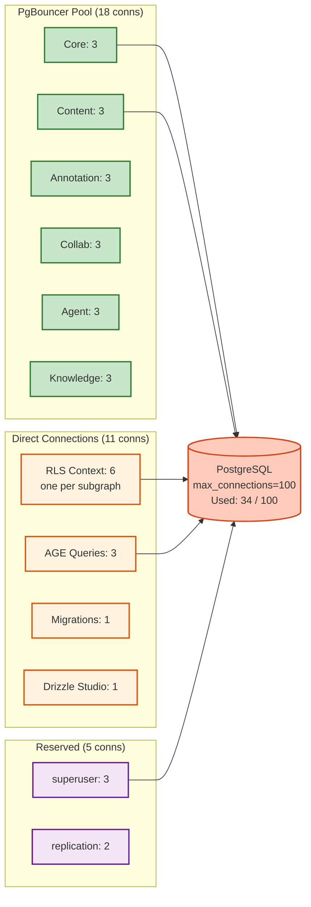

# PostgreSQL Connection Budget Model

> **Purpose:** Model `max_connections` across all connection paths to prevent exhaustion.

---



---

## Current Configuration

| Parameter | Value | Source |
|-----------|-------|--------|
| PostgreSQL `max_connections` | 100 (default) | `postgresql.conf` |
| PgBouncer `default_pool_size` | 20 | `pgbouncer.ini` |
| PgBouncer `max_client_conn` | 400 | `pgbouncer.ini` |

## Connection Consumers

### Via PgBouncer (Transaction Mode)

| Consumer | Pool Size | Max Burst | Notes |
|----------|-----------|-----------|-------|
| subgraph-core | 5 | 10 | Users, tenants, organizations |
| subgraph-content | 5 | 15 | Courses, modules, files, marketplace |
| subgraph-annotation | 3 | 5 | Annotations, highlights |
| subgraph-collaboration | 3 | 8 | CRDT, discussions, live sessions |
| Drizzle Studio | 1 | 1 | Dev only |
| Seed/Migration scripts | 1 | 3 | Transient |
| **Subtotal (PgBouncer)** | **18** | **42** | |

### Direct Connections (Bypass PgBouncer)

| Consumer | Connections | Max Burst | Notes |
|----------|------------|-----------|-------|
| subgraph-agent | 5 | 10 | Agent executions + AGE queries |
| subgraph-knowledge | 3 | 8 | AGE graph + pgvector HNSW |
| Apache AGE queries | 2 | 5 | `SET search_path = ag_catalog` requires session mode |
| pg_cron (if enabled) | 1 | 1 | Background jobs |
| **Subtotal (Direct)** | **11** | **24** | |

### Reserved

| Consumer | Connections | Notes |
|----------|------------|-------|
| superuser_reserved | 3 | PostgreSQL default |
| monitoring (pg_stat) | 2 | Prometheus exporter |
| **Subtotal (Reserved)** | **5** | |

## Budget Summary

| Category | Steady State | Max Burst |
|----------|-------------|-----------|
| PgBouncer pool | 18 | 42 |
| Direct connections | 11 | 24 |
| Reserved | 5 | 5 |
| **Total** | **34** | **71** |
| **Available (max_connections=100)** | **66 free** | **29 free** |

## Scaling Projections

| Concurrent Users | Estimated Connections | Status |
|-----------------|----------------------|--------|
| 100 | ~34 | Safe |
| 1,000 | ~50 | Safe |
| 10,000 | ~80 | Warning — increase max_connections |
| 50,000 | ~150 | Danger — extract agent/knowledge DBs |
| 100,000 | ~250 | Critical — full extraction required |

## Recommendations

1. **Now:** Set `max_connections = 200` (safe for current hardware)
2. **At 10K users:** Enable PgBouncer for agent/knowledge subgraphs (requires session mode pool for AGE)
3. **At 50K users:** Execute PostgreSQL Extraction Plan Phase 1 (agent DB)
4. **At 100K users:** Execute Phases 2-3 (knowledge + content DBs)

## Monitoring Queries

```sql
-- Current active connections by application
SELECT application_name, state, count(*)
FROM pg_stat_activity
WHERE datname = 'edusphere'
GROUP BY application_name, state
ORDER BY count DESC;

-- Connection usage percentage
SELECT count(*) AS active,
       current_setting('max_connections')::int AS max,
       round(count(*)::numeric / current_setting('max_connections')::int * 100, 1) AS pct
FROM pg_stat_activity
WHERE datname = 'edusphere';
```

---

*Last updated: March 2026 — Enterprise Audit Wave 7*
