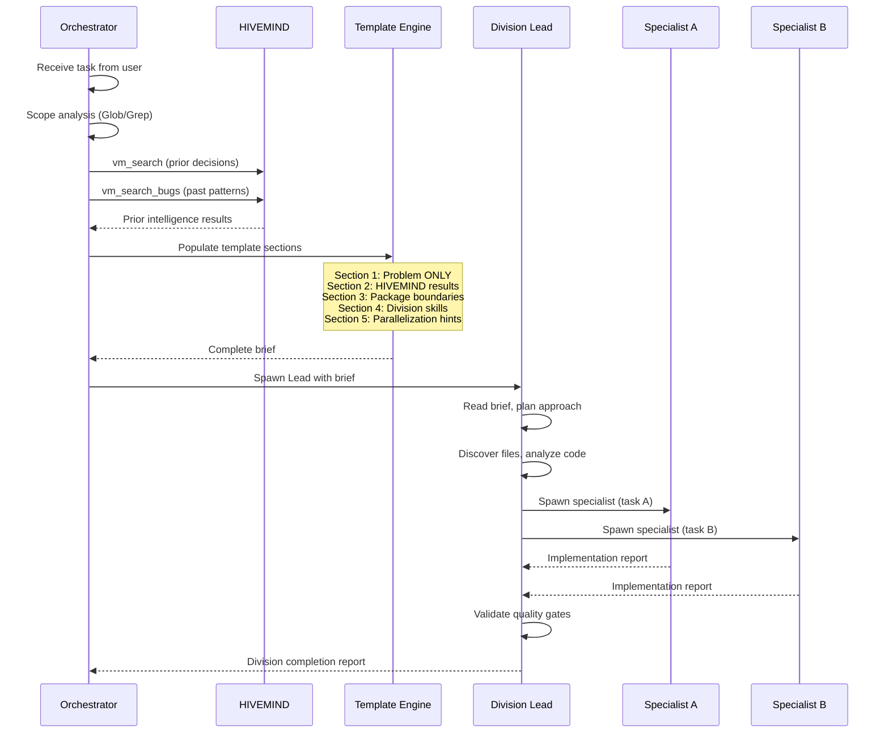

# Lead Brief Template — Standardized Orchestrator-to-Lead Communication

## Purpose

This template ensures every Division Lead receives a consistent, structured brief from the Orchestrator. It enforces the Iron Rule that briefs contain **problem descriptions only** -- never solutions, specific files, or code snippets. The Lead discovers the implementation approach independently.

**Related:** [AGENT-HIERARCHY.md](AGENT-HIERARCHY.md) | [TIERED_ORCHESTRATION.md](../operations/TIERED_ORCHESTRATION.md) | [MINDHIVE-PROTOCOL.md](MINDHIVE-PROTOCOL.md)

---

## Brief Flow



---

## Template

### Usage

Copy this template when spawning any Division Lead for Tier 2 or Tier 3 tasks. Replace bracketed placeholders with actual values. Delete sections that do not apply (mark as "N/A" if uncertain).

---

```
# Division Lead Brief — [Division Name]

## 1. Problem Statement

[Describe the SYMPTOM from the user's perspective.]
[What is broken, missing, or needs to be built.]
[Include observable behavior: error messages, wrong output, missing UI.]

DO NOT include:
- File paths where the bug lives
- Suggested solutions or approaches
- Code snippets showing the fix
- Root cause analysis

## 2. Prior Intelligence (Auto-Injected by Orchestrator)

### Past Decisions
[Paste vm_search_decisions results here, or:]
No prior decisions found for this domain.

### Past Bug Patterns
[Paste vm_search_bugs results here, or:]
No prior bug patterns found for this domain.

### Related Code Patterns
[Paste vm_search_patterns results here, or:]
No prior code patterns found for this domain.

## 3. Scope Boundaries

- **Affected packages:** [e.g., apps/web, packages/db]
- **Do NOT modify:** [packages owned by other divisions in this wave]
- **Tier:** [1 / 2 / 3]
- **Wave:** [1 / 2 / 3] (Tier 3 only)
- **Concurrent Leads in this wave:** [list other Leads active]

## 4. Pre-Loaded Skills

Your division has these skills available:
- [skill-name-1] — [one-line purpose]
- [skill-name-2] — [one-line purpose]
- [skill-name-3] — [one-line purpose]

## 5. Specialist Parallelization Hints

- [Specialist Role A] and [Specialist Role B] have no dependencies
  — spawn in parallel
- [Specialist Role C] depends on [Role A] output
  — spawn after Role A completes
- Maximum specialists for this task: [N]

## 6. Quality Gates

- [ ] TypeScript: 0 errors (`pnpm turbo typecheck`)
- [ ] Lint: 0 errors (`pnpm turbo lint`)
- [ ] All files: ≤300 lines
- [ ] Tests: 100% pass (`pnpm turbo test --filter=<packages>`)
- [ ] [Division-specific gate — see table below]

## 7. CRITICAL REMINDER (Mandatory Suffix)

You are a DIVISION LEAD — a MANAGER, not an implementer.
You HAVE the Agent tool — spawn specialists for ALL implementation work.

Allowed tools: Agent (primary), Read (docs only), Glob/Grep (scoping), Bash (read-only)
Forbidden tools: Edit, Write, Bash (mutating), Read (source code to debug/fix)

Even 1-line changes MUST be delegated to a specialist.
Your report MUST list SPECIALISTS_USED — empty list = violation.
```

---

## Division-Specific Gates

Each division has additional quality gates beyond the standard 4. The Orchestrator populates Section 6 from this table.

| Division               | Division-Specific Gate                               |
| ---------------------- | ---------------------------------------------------- |
| Product & Requirements | Acceptance criteria defined for every user story     |
| Software Architecture  | ADR written for non-trivial decisions                |
| UX/UI Design           | WCAG 2.1 AA compliance verified                      |
| Frontend Engineering   | Playwright E2E spec for every new component          |
| Backend Engineering    | RLS validation test for every new resolver           |
| Database & Data        | Migration rollback tested; RLS policy 100% coverage  |
| Security & Compliance  | All SI-1 through SI-10 invariants verified           |
| QA & Validation        | Coverage thresholds met (BE >90%, FE >80%)           |
| Documentation          | All affected docs updated; Mermaid diagrams included |
| DevOps & Release       | Health check passes; Docker containers healthy       |

---

## Division Skills Matrix

Auto-populate Section 4 from this reference. Each Lead receives only their division's skills.

| Division      | Skills                                                                                   |
| ------------- | ---------------------------------------------------------------------------------------- |
| Product       | `writing-plans`, `brainstorming`, `product-requirements`                                 |
| Architecture  | `architecture-patterns`, `architecture-decision-records`, `graphql-federation-edusphere` |
| UX/UI         | `accessibility-compliance`, `wcag-audit-patterns`, `design-system-patterns`              |
| Frontend      | `react-state-management`, `drizzle-orm-edusphere`, `e2e-testing-patterns`                |
| Backend       | `nestjs-best-practices`, `graphql-federation-edusphere`, `nats-jetstream-patterns`       |
| Database      | `drizzle-orm-edusphere`, `apache-age-knowledge-graph`, `pgvector-hybrid-rag`             |
| Security      | `auth-implementation-patterns`, `secrets-management`, `sast-configuration`               |
| QA            | `test-driven-development`, `e2e-testing-patterns`, `discovery-wave-automator`            |
| Documentation | `changelog-automation`, `mermaid-graph-writer`                                           |
| DevOps        | `deployment-pipeline-design`, `distributed-tracing`, `github-actions-templates`          |

---

## MCP Tools Per Division

Auto-reference for Orchestrator when composing briefs. Each Lead's specialists use these MCP servers.

| Division      | Primary MCP Tools                                            |
| ------------- | ------------------------------------------------------------ |
| Product       | `sequential-thinking`                                        |
| Architecture  | `sequential-thinking`, `memory`                              |
| UX/UI         | `playwright`                                                 |
| Frontend      | `eslint`, `typescript-diagnostics`, `playwright`             |
| Backend       | `eslint`, `typescript-diagnostics`, `graphql`, `context7`    |
| Database      | `postgres`, `eslint`, `typescript-diagnostics`               |
| Security      | `eslint`, `postgres`, `tavily`                               |
| QA            | `playwright`, `eslint`, `typescript-diagnostics`, `postgres` |
| Documentation | `github`, `memory`                                           |
| DevOps        | `github`, `nats`                                             |

---

## Iron Rules for Lead Briefs

### Section 1 Violations (Problem Statement)

The following patterns in Section 1 are **violations** that the Orchestrator must self-check before sending:

| Violation Pattern                       | Why Forbidden             | Correct Alternative                                |
| --------------------------------------- | ------------------------- | -------------------------------------------------- |
| "Fix the bug in `src/hooks/useAuth.ts`" | Specifies file path       | "Authentication fails when user logs in"           |
| "Change `useState` to `useRef`"         | Prescribes solution       | "Component re-renders excessively on state change" |
| "The root cause is missing cleanup"     | Pre-determines root cause | "Memory usage increases over time in this view"    |
| "Add a try-catch around line 42"        | Code-level instruction    | "Unhandled errors crash the page"                  |
| "Use `withTenantContext()` wrapper"     | Implementation detail     | "Queries return data from other tenants"           |

### Template Usage Rules

1. **Tier 2 and Tier 3 MUST use this template** -- no ad-hoc Lead briefs
2. **Tier 1 does NOT use this template** -- specialists get direct instructions
3. **Section 1 must NEVER contain solution hints** -- Iron Rule, no exceptions
4. **Section 2 is auto-populated** from HIVEMIND `vm_search` results
5. **Section 4 is auto-populated** from the Division Skills Matrix above
6. **Section 7 (Critical Reminder) must NEVER be omitted** -- prevents Lead self-implementation
7. **Empty SPECIALISTS_USED in Lead report = violation** -- Orchestrator must reject and re-spawn

---

## Lead Report Format

When a Lead completes, it must report back to the Orchestrator in this format:

```
# Division Report — [Division Name]

## Specialists Used
| Specialist | Task | Files Changed | Status |
|-----------|------|---------------|--------|
| [Role]    | [What they did] | [file list] | Done/Failed |

## Quality Gate Results
- TypeScript: [0 errors / N errors]
- Lint: [0 errors / N errors]
- Tests: [X/Y passed]
- File sizes: [all ≤300 / violations listed]
- Division gate: [result]

## Decisions Made
[Any architectural or implementation decisions for HIVEMIND storage]

## Issues Found
[Blockers, escalations, or cross-division dependencies discovered]
```

The Orchestrator uses the "Decisions Made" section to call `vm_store_decision` and the "Issues Found" section to escalate or spawn additional Leads.
