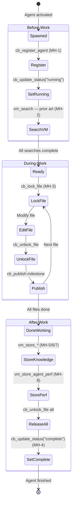

# MindHive Mandatory Utilization Protocol

> **Full reference document for the MindHive shared intelligence layer.**
> Condensed version in CLAUDE.md § "MindHive Shared Intelligence (Mandatory)".

## Overview

MindHive is EduSphere's shared intelligence layer for the 3-level agent hierarchy (Orchestrator → Division Leads → Specialists). It provides cross-agent coordination, persistent semantic memory, and cross-session knowledge accumulation via 2 project-local MCP servers.

**Problem it solves:** Without MindHive, each agent starts from scratch — no awareness of past decisions, no file locking, no performance tracking, no cross-division communication. This leads to duplicated work, contradictory decisions, concurrent edit conflicts, and lost institutional knowledge.

## MindHive Architecture

### MCP Servers

| Server | Tool Prefix | Backend | Port | Tools | Purpose |
|--------|-------------|---------|------|-------|---------|
| `coordination-bridge` | `mcp__coordination-bridge__cb_*` | SQLite (WAL mode) | N/A (local file) | 15 | Agent registration, pub/sub messaging, file locks, help requests, violation logging |
| `vector-memory` | `mcp__vector-memory__vm_*` | ChromaDB | 8100 | 12 | Semantic search over decisions, bug patterns, code patterns, agent performance |

**Database locations:**
- Coordination Bridge: `.hivemind/coordination.db` (project root)
- Vector Memory: ChromaDB Docker container (port 8100), data in `.hivemind/chromadb/`

**CRITICAL — Tool Name Format:** Use HYPHENS, not underscores:
- `mcp__coordination-bridge__cb_*`
- `mcp__vector-memory__vm_*`
- `mcp__coordination_bridge__` (WRONG — silently fails)
- `mcp__vector_memory__` (WRONG — silently fails)
- `mcp__hivemind__*` (DOES NOT EXIST)

### Collections (Vector Memory)

| Collection | Contents | Stored By | Searched By |
|-----------|----------|-----------|-------------|
| `decisions` | Architectural decisions with rationale | Leads, Architecture specialists | All agents (before-work) |
| `bug_patterns` | Bug root causes and solutions | QA, FE, BE specialists | Bug-fix agents (before investigation) |
| `code_patterns` | Reusable code patterns | Implementation specialists | All implementation agents |
| `feedback` | User feedback and corrections | Orchestrator | All agents |
| `agent_perf` | Agent performance metrics | Leads | Orchestrator (optimization) |

## Iron Rules (MH-1 through MH-10)

These are non-negotiable. Any agent violating these rules has the violation logged via `cb_log_violation`.

| # | Rule | Applies To | When | Enforcement |
|---|------|-----------|------|-------------|
| **MH-1** | Every agent MUST register via `cb_register_agent` within first 3 tool calls | All | On activation | Orchestrator audits `cb_get_agents` |
| **MH-2** | Every agent MUST search Vector Memory before starting work | All | Before any implementation | Lead verifies in specialist report |
| **MH-3** | Every file edit MUST be preceded by `cb_lock_file` and followed by `cb_unlock_file` | Specialists | Before/after every Edit | Concurrent edit = violation logged |
| **MH-4** | Every agent MUST call `cb_update_status("complete")` before finishing | All | On task completion | Orchestrator audits for stale agents |
| **MH-5** | Every bug fix MUST store pattern via `vm_store_bug_pattern` | QA/FE/BE | After fix verified | Lead verifies in report |
| **MH-6** | Every architectural decision MUST be stored via `vm_store_decision` | Leads/Arch | After decision made | Orchestrator checks `vm_get_recent` |
| **MH-7** | Every reusable pattern MUST be stored via `vm_store_code_pattern` | FE/BE/DB | After new pattern created | Lead verifies |
| **MH-8** | Every Lead MUST store agent perf via `vm_store_agent_perf` per specialist | Leads | After each specialist completes | Orchestrator checks perf data |
| **MH-9** | Cross-division requests MUST use `cb_request_help` / `cb_respond_help` | All | When needing info from another division | Audit `cb_get_pending_help` |
| **MH-10** | Orchestrator MUST audit MindHive compliance in Session Completion Gate | Orchestrator | Before declaring done | Row 11 in Completion Gate |

## 1. Agent Lifecycle Protocol

### 1.1 Registration (WHO: All | WHEN: First 3 tool calls)

Every agent MUST register immediately upon activation.

**Tool:** `mcp__coordination-bridge__cb_register_agent`

**ID naming convention:**
- L0: `L0-orchestrator`
- L1: `L1-{DIV}-lead` (e.g., `L1-FE-lead`, `L1-QA-lead`)
- L2: `L2-{DIV}-{role-slug}` (e.g., `L2-FE-component-architect`, `L2-QA-e2e-eng`)

**Why:** Without registration, `cb_get_agents` returns incomplete data. The Orchestrator cannot track which agents are alive, stale, or have capacity.

### 1.2 Status Updates (WHO: All | WHEN: On state transitions)

**Tool:** `mcp__coordination-bridge__cb_update_status`

| Transition | Status | When |
|-----------|--------|------|
| Brief received, starting work | `running` | After registration |
| Blocked by external dependency | `blocked` | When waiting on another division |
| Task completed successfully | `complete` | After all deliverables produced |
| Task failed after retries | `failed` | After max retries exhausted |

### 1.3 Completion (WHO: All | WHEN: Task done)

In exact order:
1. Unlock every file: `cb_unlock_file` for each locked path
2. Publish completion: `cb_publish({ channel: "{div}:complete", ... })`
3. Set final status: `cb_update_status({ id, status: "complete" })` or `"failed"`

## 2. Before-Work Protocol

Every agent MUST execute these searches before writing any code. This prevents rediscovering solved problems.

### Mandatory Checklist

| # | Check | Tool | Required For |
|---|-------|------|-------------|
| 1 | Register self | `cb_register_agent` | ALL agents |
| 2 | Set status running | `cb_update_status` | ALL agents |
| 3 | Search general memory | `vm_search({ query: "<task keywords>", n_results: 5 })` | ALL agents |
| 4 | Search bug patterns | `vm_search_bugs({ query: "<error/symptom>", n_results: 5 })` | Bug-fix agents |
| 5 | Search code patterns | `vm_search_patterns({ query: "<pattern type>", n_results: 5 })` | Implementation specialists |
| 6 | Search decisions | `vm_search_decisions({ query: "<domain>", n_results: 5 })` | Leads + Architecture |
| 7 | Check pending help | `cb_get_pending_help({ division: "<own>" })` | Leads only |

**If prior art found:** Read it. Follow existing patterns/decisions. If you disagree, document why in `vm_store_decision`.

## 3. During-Work Protocol

### 3.1 File Locking (WHO: Specialists | WHEN: Before EVERY file edit)

1. Check: `cb_check_lock({ path: "<absolute-path>" })`
2. If unlocked: `cb_lock_file({ path: "<absolute-path>", agent_id: "<self-id>", ttl_ms: 300000 })`
3. Edit the file
4. Release: `cb_unlock_file({ path: "<absolute-path>", agent_id: "<self-id>" })`

**If locked by another agent:** DO NOT EDIT. Wait 30s and retry, or publish on their channel, or report `blocked`.

**TTL:** 300000ms (5 min) default. For large refactors: 600000ms (10 min).

### 3.2 Status Broadcasting (WHO: All | WHEN: Every 3 minutes minimum)

**Tool:** `mcp__coordination-bridge__cb_publish`

**Channel convention:** `{division}:{event-type}`

| Event | Channel Example | When |
|-------|----------------|------|
| `started` | `fe:started` | Agent begins work |
| `milestone` | `be:milestone` | File complete, test passing |
| `blocked` | `db:blocked` | Waiting on dependency |
| `ready` | `fe:ready` | Deliverable ready for downstream |
| `complete` | `fe:complete` | All work done |

### 3.3 Cross-Division Communication

**Tools:** `cb_request_help` / `cb_respond_help`

1. Need info: `cb_request_help({ from_agent, to_division, query })`
2. Target Lead checks: `cb_get_pending_help({ division })` every 3 min
3. Response: `cb_respond_help({ id, response })`

**Lead obligation:** Unanswered requests older than 5 min = violation.

## 4. After-Work Protocol

Every agent MUST store learnings before finishing. An agent that completes without storing knowledge wastes institutional memory.

### Mandatory Checklist

| # | Action | Tool | Required For | Minimum |
|---|--------|------|-------------|---------|
| 1 | Store decisions | `vm_store_decision` | Leads + Arch | 1 per task |
| 2 | Store bug patterns | `vm_store_bug_pattern` | Bug-fix agents | 1 per bug |
| 3 | Store code patterns | `vm_store_code_pattern` | Implementation specialists | 1 if new pattern created |
| 4 | Store specialist perf | `vm_store_agent_perf` | Leads | 1 per specialist managed |
| 5 | Unlock all files | `cb_unlock_file` | All who locked | All locks released |
| 6 | Publish completion | `cb_publish` | All | 1 completion event |
| 7 | Set status complete | `cb_update_status` | All | Final status set |

### Decision Storage Examples

```json
vm_store_decision({
  "title": "Use Zustand over Context for course filter state",
  "rationale": "Context causes re-renders in all consumers; Zustand provides selector-based subscriptions",
  "alternatives": "React Context, Redux Toolkit, Jotai",
  "chosen": "Zustand v5 with shallow equality selector",
  "tags": ["frontend", "state-management", "performance"]
})
```

### Bug Pattern Storage Examples

```json
vm_store_bug_pattern({
  "error": "Hebrew text overflows container in RTL mode",
  "root_cause": "CSS overflow:hidden missing; direction:rtl not propagated to nested flex children",
  "solution": "Added overflow:hidden + dir={locale.dir} prop to wrapper; RTL-specific padding",
  "files": ["apps/web/src/components/CourseCard.tsx", "apps/web/src/styles/card.css"]
})
```

### Code Pattern Storage Examples

```json
vm_store_code_pattern({
  "name": "TanStack Query hook with optimistic update",
  "pattern": "useMutation with onMutate (optimistic), onError (rollback), onSettled (invalidate)",
  "usage": "Use for all mutations that update a list to provide instant UI feedback",
  "tags": ["frontend", "tanstack-query", "optimistic-update"]
})
```

### Agent Performance Storage Examples

```json
vm_store_agent_perf({
  "agent_id": "L2-FE-component-architect",
  "task": "Build CourseCard component + unit tests",
  "duration_ms": 180000,
  "success": true,
  "notes": "3 min, no retries. Used react-expert skill effectively."
})
```

## 5. Orchestrator Enforcement

### Session Start Audit

| Step | Tool | Expected |
|------|------|----------|
| 1 | `cb_health` | Returns ok |
| 2 | `vm_health` | Returns ok with collections |
| 3 | `cb_get_agents` | No stale "running" from previous sessions |
| 4 | `vm_search` with task keywords | Prior art for Lead briefs |
| 5 | `cb_register_agent` | Self registered |

### Mid-Session Monitoring (every 3-min cycle)

| Check | Tool | Red Flag |
|-------|------|----------|
| All agents registered? | `cb_get_agents` | Missing = MH-1 violation |
| No stale running? | `cb_get_agents` | Finished but still "running" = MH-4 |
| Help answered? | `cb_get_pending_help` | >5 min old = Lead negligence |
| Violations? | `cb_get_violations` | Non-zero = investigate |

### Session Completion Audit (Row 11 in Completion Gate)

| Sub | Check | Tool | Pass Criteria |
|-----|-------|------|---------------|
| 11a | All agents complete/failed | `cb_get_agents` | 0 with status "running" |
| 11b | All locks released | `cb_get_agents` | 0 active locks |
| 11c | New VM entries stored | `vm_get_recent({ n: 20 })` | >=1 decision + >=1 pattern |
| 11d | Agent perf recorded | `vm_get_recent` | >=1 entry per Lead |
| 11e | No orphan help requests | `cb_get_pending_help` | 0 pending |
| 11f | No unaddressed violations | `cb_get_violations` | 0 or all acknowledged |

### Lead Brief Enhancement

Every Lead brief MUST include:

```
## PRIOR INTELLIGENCE (from MindHive)
Decisions: [results from vm_search_decisions]
Bug Patterns: [results from vm_search_bugs]
Code Patterns: [results from vm_search_patterns]
```

## 6. Knowledge Accumulation Thresholds

### What MUST Be Stored

| Type | MUST Store | Examples |
|------|-----------|---------|
| Technology/library choice | YES | "Use urql over graphql-request" |
| Architecture choice | YES | "Annotation owned by Annotation subgraph" |
| Rejected approach with reason | YES | "Rejected Redux: too much boilerplate" |
| Bug with root cause found | YES | Any BUG-NNN with root cause |
| Pattern-class bug | YES | "All setInterval hooks missing cleanup" |
| New reusable hook/utility | YES | "useOptimisticMutation" hook |
| New service pattern | YES | "NestJS service with RLS + NATS + OnModuleDestroy" |
| New test pattern | YES | "Playwright E2E with page.route() mock" |

### What NOT to Store

| Type | Store? | Reason |
|------|--------|--------|
| Simple typo fix | NO | Too trivial |
| Configuration value | NO | Not a decision |
| Simple CRUD resolver | NO | Too generic |
| One-off component | NO | Not reusable |

## 7. Cross-Session Intelligence

### Session Start Sequence (before spawning Leads)

1. `vm_search_decisions({ query: "<task keywords>" })` — past decisions
2. `vm_search_bugs({ query: "<domain>" })` — known pitfalls
3. `vm_search_patterns({ query: "<pattern type>" })` — established patterns
4. `vm_get_recent({ n: 10 })` — recent context
5. `mcp__memory__search_nodes({ query: "<task>" })` — knowledge graph

Results from 1-5 go into Lead briefs as "Prior Intelligence".

### Dual Storage for Critical Decisions

After `vm_store_decision`, also create entity in `mcp__memory__create_entities` for cross-system discoverability.

## 8. Violation Tracking

**Tool:** `mcp__coordination-bridge__cb_log_violation`

```json
cb_log_violation({
  "agent_id": "L2-FE-component-architect",
  "rule": "MH-3",
  "details": "Edited CourseCard.tsx without cb_lock_file"
})
```

Violations are included in the session completion report to the user.

## Compliance Flow Diagram



---

*Last Updated: March 2026 | Version: 1.0.0*
*Condensed version: CLAUDE.md § "MindHive Shared Intelligence (Mandatory)"*
