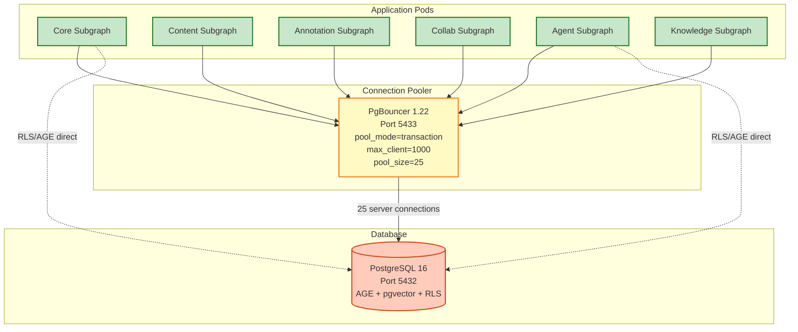
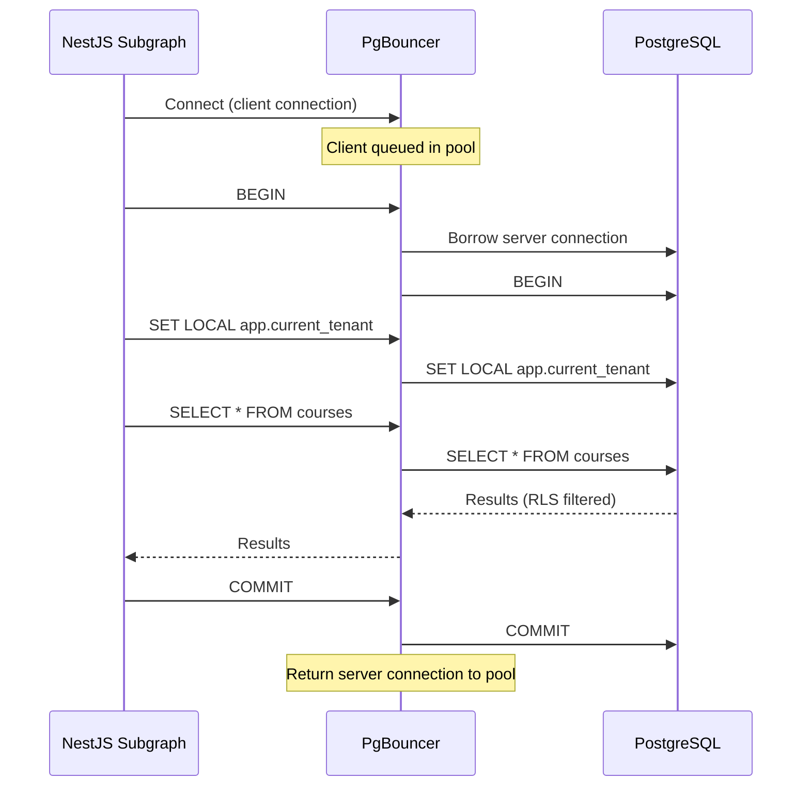

# PgBouncer — Connection Pooler

> **Version:** 1.22.1
> **Added:** Phase 7.1 (February 2026)
> **Pool mode:** transaction
> **Port:** 5433 (proxies to PostgreSQL on 5432)

---

## Purpose

At 100,000+ concurrent users each subgraph (NestJS process) maintains a
Drizzle ORM connection pool. Without a proxy layer, every pod replica opens
its own PostgreSQL server connections. PostgreSQL's default limit is 100
connections (`max_connections`); a fleet of 6 subgraph replicas × 10 pods ×
10 pool connections = 600 connections — well above the default and enough to
cause `FATAL: remaining connection slots are reserved`.

PgBouncer solves this by multiplexing many application connections onto a
small, stable set of server connections:



---

## Pool Mode: `transaction`

In **transaction** mode a server connection is borrowed from the pool for the
duration of a single transaction (or a single statement when outside an
explicit transaction) and returned immediately on `COMMIT` / `ROLLBACK`. This
gives maximum server connection reuse.

### Transaction Mode Lifecycle



### Implications for EduSphere

| Feature                                            | Safe via PgBouncer? | Notes                                                        |
| -------------------------------------------------- | ------------------- | ------------------------------------------------------------ |
| Regular `SELECT` / `INSERT` / `UPDATE` / `DELETE`  | Yes                 | Standard Drizzle ORM queries                                 |
| Explicit `BEGIN … COMMIT` transactions             | Yes                 | Connection held for full transaction                         |
| `SET LOCAL app.current_tenant` (RLS context)       | **No**              | `SET LOCAL` is session-scoped; cleared on connection release |
| `LISTEN` / `NOTIFY`                                | **No**              | Requires persistent session connection                       |
| Advisory locks (`pg_advisory_lock`)                | **No**              | Session-level state lost on release                          |
| Apache AGE Cypher (`LOAD 'age'; SELECT cypher(…)`) | **No**              | `LOAD` is session-scoped                                     |
| Temporary tables                                   | **No**              | Session-scoped objects                                       |

### Routing Rule (enforced in application code)

```
Standard Drizzle ORM queries  →  PGBOUNCER_URL  (localhost:5433)
RLS context / AGE / LISTEN    →  DATABASE_URL   (localhost:5432)
```

The `getOrCreatePool()` helper in `@edusphere/db` accepts an optional
`{ rls: true }` flag that selects `DATABASE_URL` instead of `PGBOUNCER_URL`
so callers never hard-code the routing decision.

---

## Configuration

### Docker Compose (development)

```yaml
pgbouncer:
  image: pgbouncer/pgbouncer:1.22.1
  mem_limit: 128m
  mem_reservation: 64m
  ports:
    - '5433:5432'
  environment:
    DATABASES_HOST: postgres
    DATABASES_PORT: 5432
    DATABASES_DBNAME: edusphere
    DATABASES_USER: ${POSTGRES_USER:-edusphere}
    DATABASES_PASSWORD: ${POSTGRES_PASSWORD:-edusphere_dev_password}
    PGBOUNCER_POOL_MODE: transaction
    PGBOUNCER_MAX_CLIENT_CONN: 1000
    PGBOUNCER_DEFAULT_POOL_SIZE: 25
    PGBOUNCER_SERVER_IDLE_TIMEOUT: 60
  depends_on:
    postgres:
      condition: service_healthy
```

### Environment Variables

| Variable         | Dev default                                         | Description                                    |
| ---------------- | --------------------------------------------------- | ---------------------------------------------- |
| `PGBOUNCER_URL`  | `postgresql://edusphere:…@localhost:5433/edusphere` | Use for standard Drizzle queries               |
| `PGBOUNCER_HOST` | `localhost`                                         | PgBouncer hostname                             |
| `PGBOUNCER_PORT` | `5433`                                              | PgBouncer port                                 |
| `DATABASE_URL`   | `postgresql://…@localhost:5432/edusphere`           | Direct PostgreSQL — use for RLS / AGE / LISTEN |

---

## Memory Safety

PgBouncer is capped at **128 MiB** (`mem_limit`). If the pod is OOM-killed:

1. Check `docker stats edusphere-pgbouncer` for actual RSS.
2. Reduce `PGBOUNCER_MAX_CLIENT_CONN` or increase `mem_limit`.
3. Idle client connections cost ~3 KiB each; 1000 clients ≈ 3 MiB overhead.

---

## Monitoring

Query the PgBouncer admin console (requires a dedicated `pgbouncer` user):

```sql
-- Pool statistics
SHOW POOLS;

-- Active/idle server connections
SHOW SERVERS;

-- Connected clients
SHOW CLIENTS;

-- Configuration
SHOW CONFIG;
```

In production, expose PgBouncer stats to Prometheus via
[pgbouncer_exporter](https://github.com/prometheus-community/pgbouncer_exporter)
and alert on `pgbouncer_pool_server_active_connections` approaching
`DEFAULT_POOL_SIZE`.

---

## Production Checklist

- [ ] Set `PGBOUNCER_AUTH_TYPE=scram-sha-256` (already in docker-compose)
- [ ] Use a dedicated low-privilege PostgreSQL role for PgBouncer
- [ ] Enable TLS between PgBouncer and PostgreSQL (`server_tls_sslmode=require`)
- [ ] Mount `pgbouncer.ini` from a Kubernetes Secret (not environment variables)
- [ ] Tune `PGBOUNCER_DEFAULT_POOL_SIZE` based on `pg_stat_activity` baseline
- [ ] Set `server_reset_query=DISCARD ALL` to clear any residual session state

---

## References

- [PgBouncer documentation](https://www.pgbouncer.org/config.html)
- [pgbouncer/pgbouncer Docker image](https://hub.docker.com/r/pgbouncer/pgbouncer)
- Transaction pooling caveats: `docs/architecture/ARCHITECTURE.md §5 (Database)`
