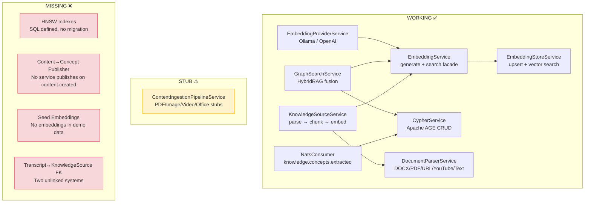
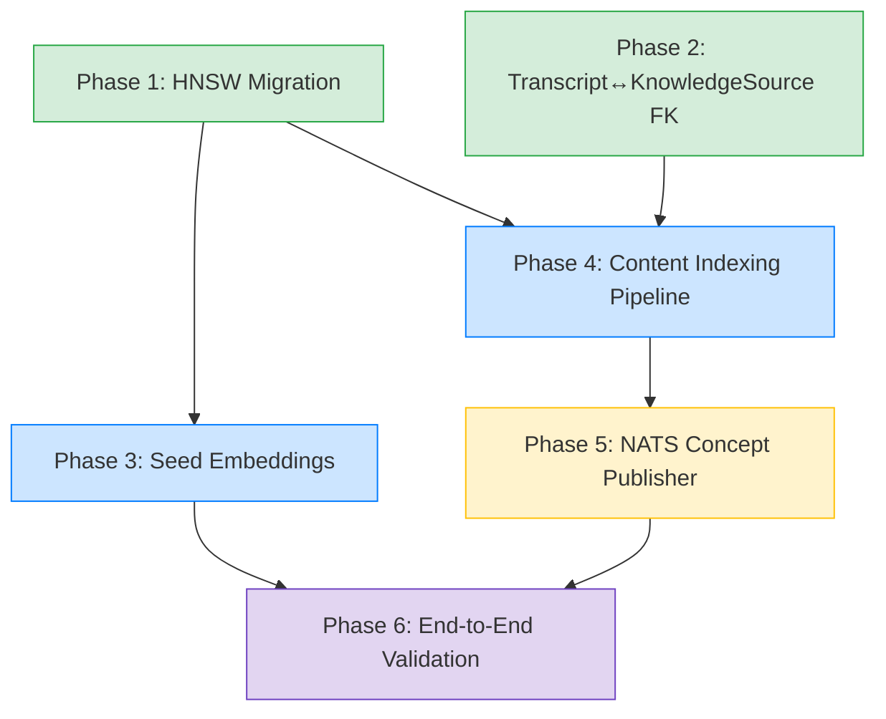
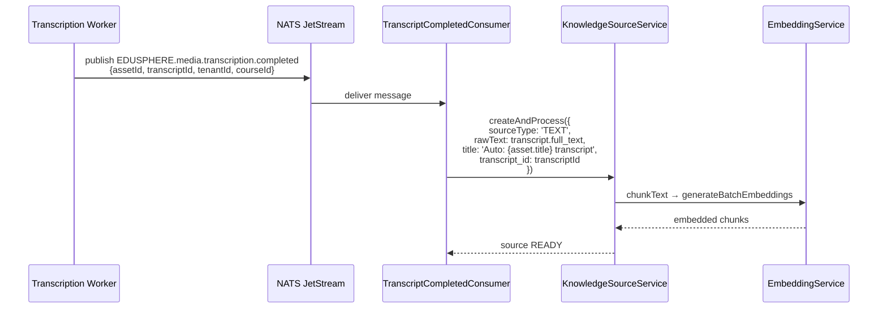
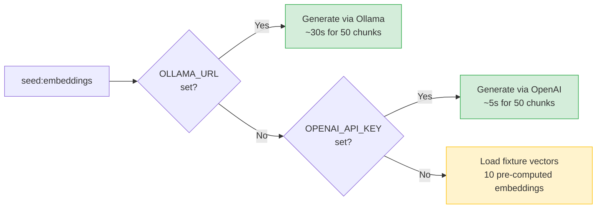
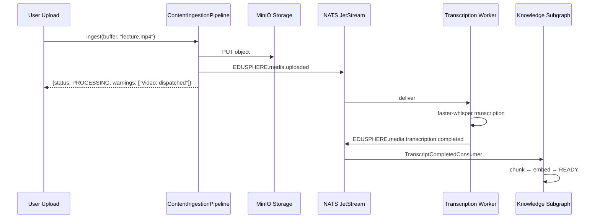
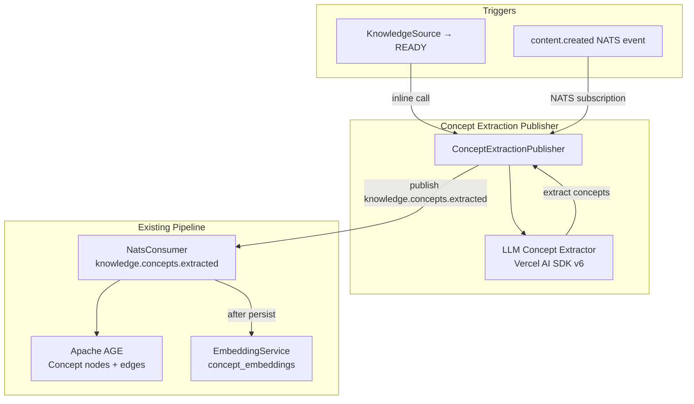
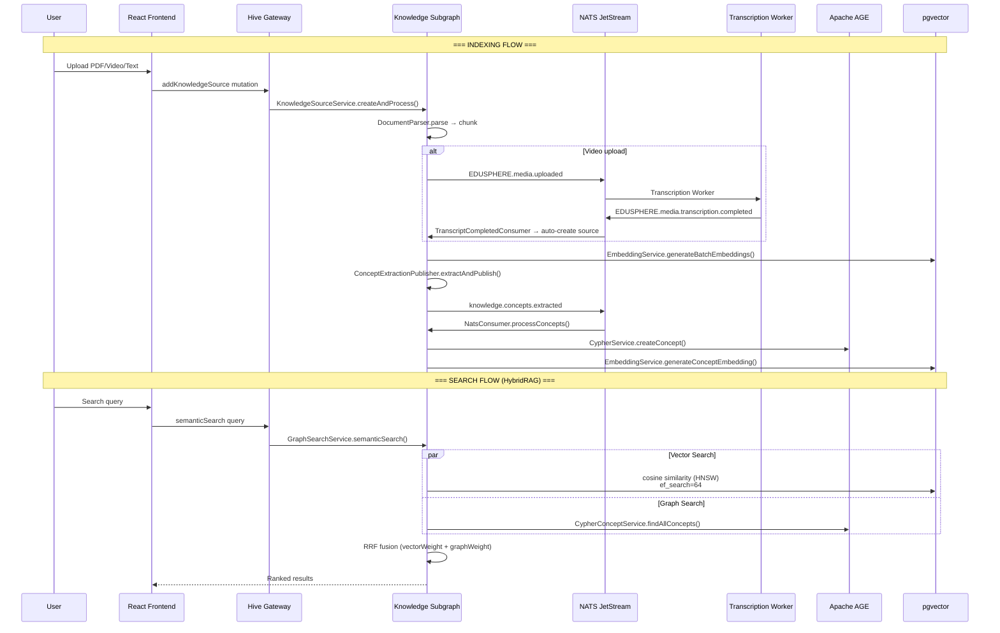

# RAG Pipeline Activation — Technical Architecture Design

> **Status:** APPROVED (ADR: `ADR-RAG-ACTIVATION.md`)
> **Author:** Software Architecture Division
> **Date:** 2026-03-27
> **Scope:** Connect all existing RAG components into a working end-to-end pipeline

---

## Executive Summary

The EduSphere RAG pipeline has all major components built but they are disconnected. This document specifies the exact changes needed to activate the full pipeline: HNSW index migration, content ingestion pipeline activation, NATS concept publisher wiring, seed embedding generation, and the transcript-to-KnowledgeSource bridge.

---

## 1. Current State — Component Inventory



---

## 2. Dependency Graph — Implementation Order



**Phases 1 and 2 are independent and can run in parallel.**
Phase 3 depends on Phase 1 (needs HNSW indexes for search validation).
Phase 4 depends on Phases 1 + 2 (needs indexes + FK bridge).
Phase 5 depends on Phase 4 (publishes concepts from processed content).
Phase 6 validates the full pipeline end-to-end.

---

## 3. Phase 1 — HNSW Index Migration

### Problem

The HNSW index SQL is defined in `packages/db/src/schema/embeddings.ts` (lines 48-64) but no Drizzle migration applies it. All pgvector searches use sequential O(n) scans.

### Solution

**Migration file:** `packages/db/src/migrations/0013_hnsw_vector_indexes.ts`

```sql
-- Up migration
CREATE EXTENSION IF NOT EXISTS vector;

CREATE INDEX IF NOT EXISTS idx_content_embeddings_hnsw
  ON content_embeddings USING hnsw (embedding vector_cosine_ops)
  WITH (m = 32, ef_construction = 128);

CREATE INDEX IF NOT EXISTS idx_annotation_embeddings_hnsw
  ON annotation_embeddings USING hnsw (embedding vector_cosine_ops)
  WITH (m = 32, ef_construction = 128);

CREATE INDEX IF NOT EXISTS idx_concept_embeddings_hnsw
  ON concept_embeddings USING hnsw (embedding vector_cosine_ops)
  WITH (m = 32, ef_construction = 128);
```

```sql
-- Down migration (rollback)
DROP INDEX IF EXISTS idx_content_embeddings_hnsw;
DROP INDEX IF EXISTS idx_annotation_embeddings_hnsw;
DROP INDEX IF EXISTS idx_concept_embeddings_hnsw;
```

### Index Parameters

| Parameter         | Value               | Rationale                                                                                                           |
| ----------------- | ------------------- | ------------------------------------------------------------------------------------------------------------------- |
| `m`               | 32                  | Connections per node. 32 balances recall vs memory for 768-dim vectors. Default 16 is too low for production.       |
| `ef_construction` | 128                 | Build-time search depth. 128 gives >95% recall at build time. Higher values slow migration but improve quality.     |
| `operator`        | `vector_cosine_ops` | Matches all existing `<=>` (cosine distance) queries in `embedding-store.service.ts` and `graph-search.service.ts`. |

### Performance Budget

| Metric                           | Without HNSW (current) | With HNSW (target)                                     |
| -------------------------------- | ---------------------- | ------------------------------------------------------ |
| Search latency (10K embeddings)  | ~50ms O(n) scan        | <5ms ANN                                               |
| Search latency (100K embeddings) | ~500ms O(n) scan       | <10ms ANN                                              |
| Search latency (1M embeddings)   | ~5s O(n) scan          | <15ms ANN                                              |
| Index build time (10K rows)      | N/A                    | ~30s                                                   |
| Memory overhead per index        | 0                      | ~2x row count × m × sizeof(float32) ≈ 200MB at 1M rows |
| Recall@10                        | 100% (exact)           | >95% (approximate)                                     |

### Query-time `ef_search` Tuning

Add `SET LOCAL hnsw.ef_search = 64` before search queries in `EmbeddingStoreService.searchByVector()` for query-time recall tuning. Default is 40; 64 gives ~98% recall with minimal latency increase.

### Files Affected

- `packages/db/src/migrations/0013_hnsw_vector_indexes.ts` — NEW
- `apps/subgraph-knowledge/src/embedding/embedding-store.service.ts` — add `SET LOCAL hnsw.ef_search = 64`

---

## 4. Phase 2 — Transcript-to-KnowledgeSource Bridge

### Problem

`transcripts` and `knowledge_sources` are completely separate systems:

- `transcripts` → linked to `media_assets` → linked to `courses` (via `asset_id`)
- `knowledge_sources` → linked directly to `courses` (via `course_id`)

When a video transcript completes, its text is NOT automatically available as a KnowledgeSource for RAG search. Users must manually re-upload the transcript text.

### Solution

**Migration file:** `packages/db/src/migrations/0014_transcript_knowledge_source_fk.ts`

Add an optional FK column `transcript_id` to `knowledge_sources`:

```sql
-- Up
ALTER TABLE knowledge_sources
  ADD COLUMN transcript_id UUID
  REFERENCES transcripts(id) ON DELETE SET NULL;

CREATE INDEX idx_knowledge_sources_transcript
  ON knowledge_sources (transcript_id)
  WHERE transcript_id IS NOT NULL;
```

```sql
-- Down
DROP INDEX IF EXISTS idx_knowledge_sources_transcript;
ALTER TABLE knowledge_sources DROP COLUMN IF EXISTS transcript_id;
```

### Schema Change

Update `packages/db/src/schema/knowledge-sources.ts`:

```typescript
transcript_id: uuid('transcript_id').references(() => transcripts.id, {
  onDelete: 'set null',
}),
```

### NATS Event Handler — Auto-Bridge

**New file:** `apps/subgraph-knowledge/src/nats/transcript-completed.consumer.ts`

Subscribe to `EDUSPHERE.media.transcription.completed` (published by the transcription worker when a transcript is finalized):



**Key design decisions:**

1. `SET NULL` on transcript delete — the KnowledgeSource remains useful even if the original video is removed.
2. `sourceType: 'TEXT'` — the full_text is already extracted, no need for file-based parsing.
3. Idempotent: check `WHERE transcript_id = $1` before creating to prevent duplicates on redelivery.

---

## 5. Phase 3 — Seed Embedding Generation

### Problem

The seed pipeline (`packages/db/src/seed/nahar-shalom-source.ts`) creates a KnowledgeSource with `status: 'PENDING'` and `raw_content: ''`. No embeddings are generated. The seed comment says "the running service embeds on demand" but there is no trigger mechanism.

### Solution

**Option A (Recommended): Post-seed embedding script**

Create `packages/db/src/seed/generate-seed-embeddings.ts`:

1. Query all `knowledge_sources` with `status = 'PENDING'` or `status = 'READY'` AND `chunk_count = 0`
2. For each source with non-empty `raw_content`: chunk → embed via `EmbeddingProviderService`
3. For `nahar-shalom-source`: run mammoth extraction inline (it was skipped at seed-time due to OOM concerns)
4. Requires `OLLAMA_URL` or `OPENAI_API_KEY` to be set

**New command:** `pnpm --filter @edusphere/db seed:embeddings`

Add to `packages/db/package.json`:

```json
"seed:embeddings": "tsx src/seed/generate-seed-embeddings.ts"
```

**Option B (Fallback): Hardcoded demo embeddings**

Pre-compute 10 representative 768-dim vectors offline and store them as a JSON fixture. This avoids requiring an embedding provider during seed but only provides minimal search coverage.

### Recommended: Option A with Option B as fallback



### Throughput Budget

| Provider                         | Throughput                | 50 chunks | 500 chunks            |
| -------------------------------- | ------------------------- | --------- | --------------------- |
| Ollama (local, nomic-embed-text) | ~20 chunks/s              | ~2.5s     | ~25s                  |
| OpenAI (text-embedding-3-small)  | ~100 chunks/s (batch API) | ~0.5s     | ~5s                   |
| Fixture (pre-computed)           | Instant                   | 0s        | N/A (only 10 vectors) |

---

## 6. Phase 4 — Content Ingestion Pipeline Activation

### Problem

`ContentIngestionPipelineService` has real ZIP handling but stubs for PDF, Image, Video, Office, and Text types. All stubs return `extractedText: ''` with warning messages like `'PDF processing: stub implementation'`.

### Activation Plan

| Handler                | Current           | Target Implementation                                                                 | External Dependency             |
| ---------------------- | ----------------- | ------------------------------------------------------------------------------------- | ------------------------------- |
| `handlePdf`            | Stub → empty text | `pdf-parse` (npm) → extract text + page count                                         | None (pure JS)                  |
| `handleImage`          | Stub → no OCR     | `TesseractOcrService` (already exists) + `ImageUnderstandingService` (already exists) | Tesseract.js (already imported) |
| `handleVideo`          | Stub → no action  | Dispatch to transcription worker via NATS `EDUSPHERE.media.uploaded`                  | Transcription worker running    |
| `handleText`           | **WORKING**       | No change needed                                                                      | None                            |
| `handleOfficeDocument` | Stub → no action  | `mammoth` for DOCX (already used in seed), `libreoffice-convert` for PPTX/XLSX        | mammoth (already dep)           |
| `handleZip`            | **WORKING**       | No change needed (security validated)                                                 | unzipper (already dep)          |

### Implementation Details

**handlePdf — Replace stub:**

```typescript
private async handlePdf(buffer: Buffer, filename: string): Promise<IngestionResult> {
  const pdfParse = (await import('pdf-parse')).default;
  const data = await pdfParse(buffer);
  return {
    extractedText: data.text,
    ocrMethod: 'EMBEDDED_TEXT',
    ocrConfidence: 1,
    topics: [],
    thumbnailUrl: null,
    estimatedDuration: Math.ceil(data.text.length / 1500),
    pageCount: data.numpages,
    warnings: [],
    aiCaption: null,
    isHandwritten: false,
  };
}
```

**handleImage — Wire to existing services:**

`TesseractOcrService` (at `apps/subgraph-knowledge/src/services/tesseract-ocr.service.ts`) and `ImageUnderstandingService` (at `apps/subgraph-knowledge/src/services/image-understanding.service.ts`) are already built. The pipeline needs DI injection of these services.

**handleVideo — Dispatch via NATS:**

Videos should NOT be processed inline. Instead:

1. Upload buffer to MinIO via the existing `MediaService.generatePresignedUrl` flow
2. Publish `EDUSPHERE.media.uploaded` event (same event MediaService already publishes)
3. The transcription worker picks it up, transcribes, and publishes `EDUSPHERE.media.transcription.completed`
4. Phase 2's `TranscriptCompletedConsumer` auto-creates the KnowledgeSource



### Files Affected

- `apps/subgraph-knowledge/src/services/content-ingestion-pipeline.service.ts` — replace stubs
- `apps/subgraph-knowledge/src/services/content-ingestion-pipeline.module.ts` — add DI for TesseractOcrService, ImageUnderstandingService
- `package.json` — add `pdf-parse` dependency (if not already present)

---

## 7. Phase 5 — NATS Concept Publisher

### Problem

The `NatsConsumer` in subgraph-knowledge subscribes to `knowledge.concepts.extracted` and persists concepts to Apache AGE. The transcription worker's `GraphBuilder` publishes to this subject. But there is NO publisher for:

1. **Content created/updated events** — when a course gets new content, concepts should be extracted
2. **KnowledgeSource processed events** — when a KnowledgeSource reaches READY, its text should be analyzed for concepts

### Solution

**New service:** `apps/subgraph-knowledge/src/nats/concept-extraction-publisher.service.ts`

This service subscribes to two triggers and publishes concept extraction requests:



### Message Schema

The existing `ConceptsExtractedPayload` (in `nats.types.ts`) is the target:

```typescript
interface ConceptsExtractedPayload {
  concepts: ExtractedConcept[]; // { name, definition, relatedTerms[] }
  courseId: string;
  tenantId: string;
}
```

### Trigger Points

**Trigger 1: KnowledgeSource READY**

In `KnowledgeSourceService.processSource()`, after marking status as `READY` (line 236-245), call the concept extraction publisher:

```typescript
// After: await this.db.update(...).set({ status: 'READY' ... })
await this.conceptPublisher.extractAndPublish(
  parsed.text,
  input.courseId,
  input.tenantId
);
```

**Trigger 2: content.created NATS event**

Subscribe to `content.created` (defined in `packages/nats-client/src/content-events.ts`). On receiving a content creation event, fetch the content text and run concept extraction.

### Concept Extraction Logic

Use Vercel AI SDK v6 with a structured prompt:

```typescript
const { object } = await generateObject({
  model: ollama('llama3.1'), // or openai('gpt-4o-mini') in prod
  schema: z.object({
    concepts: z.array(
      z.object({
        name: z.string(),
        definition: z.string(),
        relatedTerms: z.array(z.string()),
      })
    ),
  }),
  prompt: `Extract key educational concepts from the following text.
           For each concept, provide a clear definition and list related terms.
           Text: ${text.slice(0, 8000)}`, // Truncate to fit context window
});
```

### Embedding Concepts After Persistence

The existing `NatsConsumer.processConcepts()` persists concepts to AGE but does NOT generate embeddings for `concept_embeddings` table. Add an embedding step after concept creation:

In `NatsConsumer.processConcepts()`, after the concept creation loop, add:

```typescript
// After persisting all concepts to AGE, generate embeddings
for (const concept of concepts) {
  try {
    const text = `${concept.name}: ${concept.definition}`;
    await this.embeddingService.generateConceptEmbedding(text, concept.id);
  } catch (err) {
    this.logger.warn({ conceptName: concept.name }, 'Concept embedding failed');
  }
}
```

This requires:

1. Inject `EmbeddingService` into `NatsConsumer`
2. Add `generateConceptEmbedding()` method to `EmbeddingService` (upserts to `concept_embeddings` table)
3. Look up concept ID from AGE after creation (CypherService already returns it)

### Files Affected

- `apps/subgraph-knowledge/src/nats/concept-extraction-publisher.service.ts` — NEW
- `apps/subgraph-knowledge/src/nats/nats.consumer.ts` — add embedding generation after concept persist
- `apps/subgraph-knowledge/src/nats/nats.module.ts` — register new service
- `apps/subgraph-knowledge/src/sources/knowledge-source.service.ts` — inject + call concept publisher
- `apps/subgraph-knowledge/src/embedding/embedding.service.ts` — add `generateConceptEmbedding()` method

---

## 8. Full Pipeline — End-to-End Flow



---

## 9. Performance Budget Summary

| Operation                         | Target Latency                   | Target Throughput              |
| --------------------------------- | -------------------------------- | ------------------------------ |
| HNSW vector search (10K rows)     | <5ms                             | 200 qps                        |
| HNSW vector search (100K rows)    | <10ms                            | 150 qps                        |
| Embedding generation (single)     | <100ms (Ollama) / <50ms (OpenAI) | 20/s (Ollama) / 100/s (OpenAI) |
| Batch embedding (20 chunks)       | <2s (Ollama) / <500ms (OpenAI)   | 1 batch/2s                     |
| Concept extraction (LLM)          | <5s per source                   | 12/min                         |
| HybridRAG search (full)           | <200ms                           | 50 qps                         |
| Content ingestion (PDF, 50 pages) | <30s (parse+chunk+embed)         | 2/min                          |
| Content ingestion (Video, 1hr)    | <10min (transcription async)     | 6/hr                           |

---

## 10. Risk Matrix

| Risk                                 | Impact                             | Likelihood                                                          | Mitigation                                               |
| ------------------------------------ | ---------------------------------- | ------------------------------------------------------------------- | -------------------------------------------------------- |
| HNSW index build locks table         | HIGH — blocks writes during build  | LOW — `CREATE INDEX IF NOT EXISTS` is non-blocking by default in PG | Use `CREATE INDEX CONCURRENTLY` in production migration  |
| Ollama unavailable during seed       | MEDIUM — no demo embeddings        | MEDIUM — dev environments may not have Ollama                       | Option B fallback: pre-computed fixture vectors          |
| Concept extraction LLM hallucination | LOW — wrong concepts in graph      | MEDIUM — LLMs can generate plausible but incorrect concepts         | Confidence thresholds + human review flag                |
| NATS message loss                    | MEDIUM — missed concept extraction | LOW — JetStream provides at-least-once delivery                     | Idempotent consumers + DLQ pattern (already implemented) |
| Embedding dimension mismatch         | HIGH — search fails entirely       | LOW — all code uses 768-dim                                         | Validation check in EmbeddingProviderService             |

---

## 11. Implementation Checklist

### Phase 1 — HNSW Migration (Day 1)

- [ ] Create `packages/db/src/migrations/0013_hnsw_vector_indexes.ts`
- [ ] Add `SET LOCAL hnsw.ef_search = 64` to `EmbeddingStoreService.searchByVector()`
- [ ] Run migration: `pnpm --filter @edusphere/db migrate`
- [ ] Verify: `\d content_embeddings` shows HNSW index
- [ ] Benchmark: compare search latency before/after

### Phase 2 — Transcript↔KnowledgeSource FK (Day 1, parallel with Phase 1)

- [ ] Create `packages/db/src/migrations/0014_transcript_knowledge_source_fk.ts`
- [ ] Update `packages/db/src/schema/knowledge-sources.ts` — add `transcript_id` column
- [ ] Create `apps/subgraph-knowledge/src/nats/transcript-completed.consumer.ts`
- [ ] Register in `nats.module.ts`
- [ ] Test: verify transcript completion auto-creates KnowledgeSource

### Phase 3 — Seed Embeddings (Day 2)

- [ ] Create `packages/db/src/seed/generate-seed-embeddings.ts`
- [ ] Create pre-computed fixture at `packages/db/src/seed/fixtures/demo-embeddings.json`
- [ ] Add `seed:embeddings` script to `packages/db/package.json`
- [ ] Test: `pnpm --filter @edusphere/db seed:embeddings` generates vectors
- [ ] Verify: `SELECT count(*) FROM content_embeddings` > 0 after seed

### Phase 4 — Content Ingestion Pipeline (Day 2-3)

- [ ] Replace `handlePdf` stub with `pdf-parse` implementation
- [ ] Wire `handleImage` to `TesseractOcrService` + `ImageUnderstandingService`
- [ ] Wire `handleVideo` to MinIO upload + NATS dispatch
- [ ] Wire `handleOfficeDocument` to `mammoth` (DOCX) + `libreoffice-convert` (PPTX)
- [ ] Add DI providers in module
- [ ] Test each handler with real files

### Phase 5 — NATS Concept Publisher (Day 3-4)

- [ ] Create `apps/subgraph-knowledge/src/nats/concept-extraction-publisher.service.ts`
- [ ] Add concept extraction call to `KnowledgeSourceService.processSource()` after READY
- [ ] Add concept embedding generation to `NatsConsumer.processConcepts()`
- [ ] Add `generateConceptEmbedding()` to `EmbeddingService`
- [ ] Register all new services in modules
- [ ] Test: upload source → verify concepts appear in AGE + embeddings in pgvector

### Phase 6 — End-to-End Validation (Day 4)

- [ ] Upload a PDF → verify chunks embedded + concepts extracted + graph populated
- [ ] Upload a video → verify transcript → auto-source → embeddings + concepts
- [ ] Run `semanticSearch` query → verify HybridRAG returns results from both pgvector and AGE
- [ ] Verify HNSW index is used: `EXPLAIN ANALYZE` on search query
- [ ] Benchmark full pipeline latency against performance budget
- [ ] Run `pnpm turbo test` — all tests pass

---

## 12. Security Considerations

| Concern                                   | Control                                                                                                                                      |
| ----------------------------------------- | -------------------------------------------------------------------------------------------------------------------------------------------- |
| SI-9: Cross-tenant embedding access       | All vector searches wrapped in `withTenantContext()` (already enforced in `EmbeddingStoreService`)                                           |
| SI-10: LLM consent for concept extraction | Check `THIRD_PARTY_LLM` consent before calling OpenAI; Ollama (local) is exempt                                                              |
| SI-3: PII in embeddings                   | Content text may contain PII; embeddings are one-way (cannot reconstruct text), but chunked text in `raw_content` must be encrypted per SI-3 |
| NATS SI-7: TLS                            | All new NATS connections use `buildNatsOptions()` which enforces TLS/NKey auth                                                               |
| Zip bomb (content ingestion)              | Already handled: 5GB uncompressed limit + path traversal check in `handleZip()`                                                              |
| PDF bomb (malicious PDF)                  | `pdf-parse` has no native protection; add `maxPages: 1000` and `timeout: 30s` guards                                                         |

---

## Appendix A — File Inventory

| File                                                                         | Status    | Change Type                  |
| ---------------------------------------------------------------------------- | --------- | ---------------------------- |
| `packages/db/src/migrations/0013_hnsw_vector_indexes.ts`                     | NEW       | Migration                    |
| `packages/db/src/migrations/0014_transcript_knowledge_source_fk.ts`          | NEW       | Migration                    |
| `packages/db/src/schema/knowledge-sources.ts`                                | MODIFY    | Add transcript_id column     |
| `packages/db/src/schema/embeddings.ts`                                       | NO CHANGE | SQL already defined          |
| `packages/db/src/seed/generate-seed-embeddings.ts`                           | NEW       | Seed script                  |
| `packages/db/src/seed/fixtures/demo-embeddings.json`                         | NEW       | Fallback fixture             |
| `packages/db/package.json`                                                   | MODIFY    | Add seed:embeddings script   |
| `apps/subgraph-knowledge/src/services/content-ingestion-pipeline.service.ts` | MODIFY    | Replace stubs                |
| `apps/subgraph-knowledge/src/nats/transcript-completed.consumer.ts`          | NEW       | NATS consumer                |
| `apps/subgraph-knowledge/src/nats/concept-extraction-publisher.service.ts`   | NEW       | NATS publisher               |
| `apps/subgraph-knowledge/src/nats/nats.consumer.ts`                          | MODIFY    | Add concept embeddings       |
| `apps/subgraph-knowledge/src/nats/nats.module.ts`                            | MODIFY    | Register new services        |
| `apps/subgraph-knowledge/src/sources/knowledge-source.service.ts`            | MODIFY    | Call concept publisher       |
| `apps/subgraph-knowledge/src/embedding/embedding.service.ts`                 | MODIFY    | Add generateConceptEmbedding |
| `apps/subgraph-knowledge/src/embedding/embedding-store.service.ts`           | MODIFY    | Add ef_search tuning         |

**Total: 8 new files, 7 modified files**
