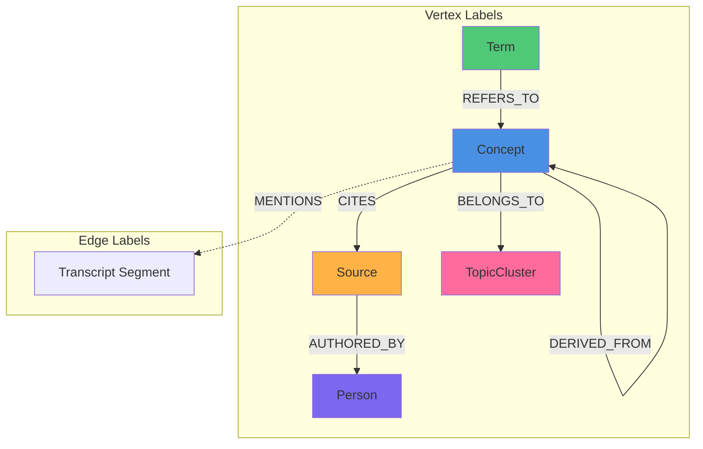

# EduSphere — Database Schema Documentation

**Version**: 1.0
**PostgreSQL**: 16+
**Extensions**: uuid-ossp, pgcrypto, age (1.5.0), vector (0.8.0)
**ORM**: Drizzle ORM 1.x with native RLS support
**Last Updated**: 2026-02-22

---

## Table of Contents

1. [Overview & Design Principles](#overview--design-principles)
2. [Extensions Setup](#extensions-setup)
3. [Core Schema](#core-schema)
4. [Indexes](#indexes)
5. [Row-Level Security (RLS) Policies](#row-level-security-rls-policies)
6. [Apache AGE Graph Ontology](#apache-age-graph-ontology)
7. [Embedding Strategy](#embedding-strategy)
8. [Migration Strategy](#migration-strategy)
9. [Backup & Recovery](#backup--recovery)
10. [Entity Relationship Diagram](#entity-relationship-diagram)

---

## 1. Overview & Design Principles

EduSphere's database architecture is designed for **multi-tenant SaaS at scale** (100,000+ concurrent users) with the following principles:

### Design Principles

1. **Tenant Isolation**: All user data is isolated by `tenant_id` with Row-Level Security (RLS) enforcement at the database level.
2. **Soft Deletes**: User-facing tables use `deleted_at` timestamp for soft deletion, enabling data recovery and audit trails.
3. **Immutable Audit**: Core historical data (transcripts, embeddings, CRDT updates) are append-only.
4. **Graph-Relational Hybrid**: PostgreSQL tables for operational data + Apache AGE graph for knowledge ontology.
5. **Vector-Native**: pgvector extension for semantic search with HNSW indexes for sub-100ms retrieval.
6. **CRDT Collaboration**: Yjs document snapshots and incremental updates stored for real-time collaboration.
7. **Zero-Trust Security**: RLS policies enforce permissions even for direct database access; GraphQL layer is defense-in-depth only.

### Scale Considerations

- **Horizontal Scaling**: Read replicas for search-heavy workloads (semantic search, graph traversal)
- **Connection Pooling**: PgBouncer or native pooling (max 100 connections per subgraph)
- **Partitioning Ready**: Large tables (transcript_segments, crdt_updates, agent_executions) can be partitioned by `tenant_id` or `created_at`
- **Index Strategy**: Partial indexes on `deleted_at IS NULL` reduce index size by 90% in active-record queries

---

## 2. Extensions Setup

### 2.1 Extension Installation

All extensions must be installed **before** running migrations. Execute in `infrastructure/docker/postgres-age/init.sql`:

```sql
-- UUID generation
CREATE EXTENSION IF NOT EXISTS "uuid-ossp";

-- Cryptographic functions (password hashing, HMAC)
CREATE EXTENSION IF NOT EXISTS "pgcrypto";

-- Apache AGE for graph database (Cypher queries)
CREATE EXTENSION IF NOT EXISTS "age";

-- pgvector for embeddings and semantic search
CREATE EXTENSION IF NOT EXISTS "vector";
```

### 2.2 Apache AGE Graph Setup

```sql
-- Load AGE extension into session
LOAD 'age';

-- Set search path to include ag_catalog
SET search_path = ag_catalog, "$user", public;

-- Create the knowledge graph
SELECT create_graph('edusphere_graph');

-- Verify graph creation
SELECT * FROM ag_graph WHERE name = 'edusphere_graph';
```

### 2.3 Database Role Configuration

```sql
-- Application role with restricted permissions
CREATE ROLE edusphere_app WITH LOGIN PASSWORD 'secure_password_here';

-- Grant necessary permissions
GRANT CONNECT ON DATABASE edusphere TO edusphere_app;
GRANT USAGE ON SCHEMA public TO edusphere_app;
GRANT USAGE ON SCHEMA ag_catalog TO edusphere_app;

-- Grant table permissions (applied after migrations)
GRANT SELECT, INSERT, UPDATE, DELETE ON ALL TABLES IN SCHEMA public TO edusphere_app;
GRANT SELECT ON ALL TABLES IN SCHEMA ag_catalog TO edusphere_app;

-- Grant sequence permissions
GRANT USAGE, SELECT ON ALL SEQUENCES IN SCHEMA public TO edusphere_app;

-- Grant AGE-specific permissions
GRANT EXECUTE ON FUNCTION ag_catalog.create_graph(text) TO edusphere_app;
GRANT EXECUTE ON FUNCTION ag_catalog.drop_graph(text, boolean) TO edusphere_app;
GRANT EXECUTE ON ALL FUNCTIONS IN SCHEMA ag_catalog TO edusphere_app;
```

### 2.4 Extension Verification

```bash
# Verify all extensions are installed
docker exec edusphere-postgres psql -U postgres -d edusphere -c "
  SELECT extname, extversion
  FROM pg_extension
  WHERE extname IN ('uuid-ossp', 'pgcrypto', 'age', 'vector')
  ORDER BY extname;
"

# Expected output:
#  extname   | extversion
# -----------+------------
#  age       | 1.5.0
#  pgcrypto  | 1.3
#  uuid-ossp | 1.1
#  vector    | 0.8.0
```

---

## 3. Core Schema

### 3.1 Shared Column Patterns

**Primary Key Pattern**:
```typescript
// Drizzle helper: packages/db/src/schema/_shared.ts
export const pk = () => uuid('id').primaryKey().defaultRandom();
```

**Tenant Isolation Pattern**:
```typescript
export const tenantId = () => uuid('tenant_id').notNull().references(() => tenants.id);
```

**Timestamp Pattern**:
```typescript
export const timestamps = () => ({
  created_at: timestamp('created_at', { withTimezone: true }).notNull().defaultNow(),
  updated_at: timestamp('updated_at', { withTimezone: true }).notNull().defaultNow()
    .$onUpdate(() => new Date()),
});
```

**Soft Delete Pattern**:
```typescript
export const softDelete = () => ({
  deleted_at: timestamp('deleted_at', { withTimezone: true }),
});
```

---

### 3.2 Table Definitions

#### Table 1: `tenants`

**Purpose**: Multi-tenant root entity. Each organization/institution is a tenant.

```sql
CREATE TABLE tenants (
  id UUID PRIMARY KEY DEFAULT uuid_generate_v4(),
  name TEXT NOT NULL,
  slug TEXT NOT NULL UNIQUE,
  plan TEXT NOT NULL DEFAULT 'FREE',
    -- Enum: 'FREE', 'STARTER', 'PROFESSIONAL', 'ENTERPRISE'
  settings JSONB NOT NULL DEFAULT '{}',
    -- Tenant-specific configuration (feature flags, branding, etc.)
  subscription_expires_at TIMESTAMP WITH TIME ZONE,
  created_at TIMESTAMP WITH TIME ZONE NOT NULL DEFAULT NOW(),
  updated_at TIMESTAMP WITH TIME ZONE NOT NULL DEFAULT NOW()
);

-- Indexes
CREATE INDEX idx_tenants_slug ON tenants(slug);
CREATE INDEX idx_tenants_plan ON tenants(plan);
```

**Drizzle Schema** (`packages/db/src/schema/core.ts`):
```typescript
export const tenants = pgTable('tenants', {
  id: pk(),
  name: text('name').notNull(),
  slug: text('slug').notNull().unique(),
  plan: text('plan', { enum: ['FREE', 'STARTER', 'PROFESSIONAL', 'ENTERPRISE'] })
    .notNull().default('FREE'),
  settings: jsonb('settings').notNull().default({}),
  subscription_expires_at: timestamp('subscription_expires_at', { withTimezone: true }),
  ...timestamps(),
});
```

---

#### Table 2: `users`

**Purpose**: User accounts with tenant membership and role-based access.

```sql
CREATE TABLE users (
  id UUID PRIMARY KEY DEFAULT uuid_generate_v4(),
  tenant_id UUID NOT NULL REFERENCES tenants(id) ON DELETE CASCADE,
  email TEXT NOT NULL,
  display_name TEXT NOT NULL,
  role TEXT NOT NULL DEFAULT 'STUDENT',
    -- Enum: 'SUPER_ADMIN', 'ORG_ADMIN', 'INSTRUCTOR', 'STUDENT', 'RESEARCHER'
  avatar_url TEXT,
  preferences JSONB NOT NULL DEFAULT '{}',
    -- User preferences (theme, language, notification settings)
  created_at TIMESTAMP WITH TIME ZONE NOT NULL DEFAULT NOW(),
  updated_at TIMESTAMP WITH TIME ZONE NOT NULL DEFAULT NOW(),
  deleted_at TIMESTAMP WITH TIME ZONE,

  CONSTRAINT users_email_tenant_unique UNIQUE (email, tenant_id)
);

-- RLS enabled
ALTER TABLE users ENABLE ROW LEVEL SECURITY;

-- Indexes
CREATE INDEX idx_users_tenant_id ON users(tenant_id) WHERE deleted_at IS NULL;
CREATE INDEX idx_users_email ON users(email);
CREATE INDEX idx_users_role ON users(tenant_id, role) WHERE deleted_at IS NULL;
CREATE INDEX idx_users_deleted_at ON users(deleted_at) WHERE deleted_at IS NOT NULL;
```

**Drizzle Schema**:
```typescript
export const users = pgTable('users', {
  id: pk(),
  tenant_id: tenantId(),
  email: text('email').notNull(),
  display_name: text('display_name').notNull(),
  role: text('role', {
    enum: ['SUPER_ADMIN', 'ORG_ADMIN', 'INSTRUCTOR', 'STUDENT', 'RESEARCHER']
  }).notNull().default('STUDENT'),
  avatar_url: text('avatar_url'),
  preferences: jsonb('preferences').notNull().default({}),
  ...timestamps(),
  ...softDelete(),
}, (table) => ({
  email_tenant_unique: unique().on(table.email, table.tenant_id),
})).withRLS();
```

---

#### Table 3: `courses`

**Purpose**: Learning courses with modules, metadata, and access control.

```sql
CREATE TABLE courses (
  id UUID PRIMARY KEY DEFAULT uuid_generate_v4(),
  tenant_id UUID NOT NULL REFERENCES tenants(id) ON DELETE CASCADE,
  title TEXT NOT NULL,
  description TEXT,
  creator_id UUID NOT NULL REFERENCES users(id) ON DELETE SET NULL,
  prerequisites JSONB NOT NULL DEFAULT '[]',
    -- Array of prerequisite course IDs or concept IDs
  is_public BOOLEAN NOT NULL DEFAULT FALSE,
    -- Public courses visible across tenants (for content sharing)
  tags JSONB NOT NULL DEFAULT '[]',
    -- Array of tag strings for categorization
  created_at TIMESTAMP WITH TIME ZONE NOT NULL DEFAULT NOW(),
  updated_at TIMESTAMP WITH TIME ZONE NOT NULL DEFAULT NOW(),
  deleted_at TIMESTAMP WITH TIME ZONE
);

-- RLS enabled
ALTER TABLE courses ENABLE ROW LEVEL SECURITY;

-- Indexes
CREATE INDEX idx_courses_tenant_id ON courses(tenant_id) WHERE deleted_at IS NULL;
CREATE INDEX idx_courses_creator_id ON courses(creator_id);
CREATE INDEX idx_courses_is_public ON courses(is_public) WHERE deleted_at IS NULL;
CREATE INDEX idx_courses_tags ON courses USING GIN(tags);
```

**Drizzle Schema** (`packages/db/src/schema/content.ts`):
```typescript
export const courses = pgTable('courses', {
  id: pk(),
  tenant_id: tenantId(),
  title: text('title').notNull(),
  description: text('description'),
  creator_id: uuid('creator_id').notNull().references(() => users.id, { onDelete: 'set null' }),
  prerequisites: jsonb('prerequisites').notNull().default([]),
  is_public: boolean('is_public').notNull().default(false),
  tags: jsonb('tags').notNull().default([]),
  ...timestamps(),
  ...softDelete(),
}).withRLS();
```

---

#### Table 4: `modules`

**Purpose**: Course modules (chapters/sections) with ordering.

```sql
CREATE TABLE modules (
  id UUID PRIMARY KEY DEFAULT uuid_generate_v4(),
  course_id UUID NOT NULL REFERENCES courses(id) ON DELETE CASCADE,
  title TEXT NOT NULL,
  description TEXT,
  order_index INTEGER NOT NULL DEFAULT 0,
    -- Ordering within course (0-based)
  created_at TIMESTAMP WITH TIME ZONE NOT NULL DEFAULT NOW(),
  updated_at TIMESTAMP WITH TIME ZONE NOT NULL DEFAULT NOW(),
  deleted_at TIMESTAMP WITH TIME ZONE,

  CONSTRAINT modules_course_order_unique UNIQUE (course_id, order_index)
);

-- RLS enabled
ALTER TABLE modules ENABLE ROW LEVEL SECURITY;

-- Indexes
CREATE INDEX idx_modules_course_id ON modules(course_id, order_index) WHERE deleted_at IS NULL;
```

**Drizzle Schema**:
```typescript
export const modules = pgTable('modules', {
  id: pk(),
  course_id: uuid('course_id').notNull().references(() => courses.id, { onDelete: 'cascade' }),
  title: text('title').notNull(),
  description: text('description'),
  order_index: integer('order_index').notNull().default(0),
  ...timestamps(),
  ...softDelete(),
}, (table) => ({
  course_order_unique: unique().on(table.course_id, table.order_index),
})).withRLS();
```

---

#### Table 5: `media_assets`

**Purpose**: Video/audio files with transcription status tracking.

```sql
CREATE TABLE media_assets (
  id UUID PRIMARY KEY DEFAULT uuid_generate_v4(),
  tenant_id UUID NOT NULL REFERENCES tenants(id) ON DELETE CASCADE,
  course_id UUID REFERENCES courses(id) ON DELETE CASCADE,
  module_id UUID REFERENCES modules(id) ON DELETE CASCADE,
  title TEXT NOT NULL,
  media_type TEXT NOT NULL,
    -- Enum: 'VIDEO', 'AUDIO', 'DOCUMENT'
  file_url TEXT NOT NULL,
    -- MinIO/S3 object URL
  duration INTEGER,
    -- Duration in seconds (for video/audio)
  transcription_status TEXT NOT NULL DEFAULT 'PENDING',
    -- Enum: 'PENDING', 'PROCESSING', 'COMPLETED', 'FAILED'
  metadata JSONB NOT NULL DEFAULT '{}',
    -- File size, codec, resolution, etc.
  created_at TIMESTAMP WITH TIME ZONE NOT NULL DEFAULT NOW(),
  updated_at TIMESTAMP WITH TIME ZONE NOT NULL DEFAULT NOW(),
  deleted_at TIMESTAMP WITH TIME ZONE
);

-- RLS enabled
ALTER TABLE media_assets ENABLE ROW LEVEL SECURITY;

-- Indexes
CREATE INDEX idx_media_assets_tenant_id ON media_assets(tenant_id) WHERE deleted_at IS NULL;
CREATE INDEX idx_media_assets_course_id ON media_assets(course_id);
CREATE INDEX idx_media_assets_module_id ON media_assets(module_id);
CREATE INDEX idx_media_assets_transcription_status ON media_assets(transcription_status)
  WHERE deleted_at IS NULL;
CREATE INDEX idx_media_assets_metadata ON media_assets USING GIN(metadata);
```

**Drizzle Schema**:
```typescript
export const media_assets = pgTable('media_assets', {
  id: pk(),
  tenant_id: tenantId(),
  course_id: uuid('course_id').references(() => courses.id, { onDelete: 'cascade' }),
  module_id: uuid('module_id').references(() => modules.id, { onDelete: 'cascade' }),
  title: text('title').notNull(),
  media_type: text('media_type', { enum: ['VIDEO', 'AUDIO', 'DOCUMENT'] }).notNull(),
  file_url: text('file_url').notNull(),
  duration: integer('duration'),
  transcription_status: text('transcription_status', {
    enum: ['PENDING', 'PROCESSING', 'COMPLETED', 'FAILED']
  }).notNull().default('PENDING'),
  metadata: jsonb('metadata').notNull().default({}),
  ...timestamps(),
  ...softDelete(),
}).withRLS();
```

---

#### Table 6: `transcripts`

**Purpose**: Transcript container for media assets (supports multiple languages).

```sql
CREATE TABLE transcripts (
  id UUID PRIMARY KEY DEFAULT uuid_generate_v4(),
  asset_id UUID NOT NULL REFERENCES media_assets(id) ON DELETE CASCADE,
  language TEXT NOT NULL DEFAULT 'en',
    -- ISO 639-1 language code
  full_text TEXT NOT NULL,
    -- Complete transcript text (for full-text search)
  created_at TIMESTAMP WITH TIME ZONE NOT NULL DEFAULT NOW(),
  updated_at TIMESTAMP WITH TIME ZONE NOT NULL DEFAULT NOW(),

  CONSTRAINT transcripts_asset_language_unique UNIQUE (asset_id, language)
);

-- Indexes
CREATE INDEX idx_transcripts_asset_id ON transcripts(asset_id);
CREATE INDEX idx_transcripts_full_text ON transcripts USING GIN(to_tsvector('english', full_text));
```

**Drizzle Schema**:
```typescript
export const transcripts = pgTable('transcripts', {
  id: pk(),
  asset_id: uuid('asset_id').notNull().references(() => media_assets.id, { onDelete: 'cascade' }),
  language: text('language').notNull().default('en'),
  full_text: text('full_text').notNull(),
  ...timestamps(),
}, (table) => ({
  asset_language_unique: unique().on(table.asset_id, table.language),
}));
```

---

#### Table 7: `transcript_segments`

**Purpose**: Time-stamped transcript segments for semantic search and annotation anchoring.

```sql
CREATE TABLE transcript_segments (
  id UUID PRIMARY KEY DEFAULT uuid_generate_v4(),
  transcript_id UUID NOT NULL REFERENCES transcripts(id) ON DELETE CASCADE,
  start_time NUMERIC(10, 3) NOT NULL,
    -- Start time in seconds (millisecond precision)
  end_time NUMERIC(10, 3) NOT NULL,
    -- End time in seconds
  text TEXT NOT NULL,
    -- Segment text (typically 1-2 sentences)
  speaker TEXT,
    -- Speaker identification (if available)
  created_at TIMESTAMP WITH TIME ZONE NOT NULL DEFAULT NOW(),
  updated_at TIMESTAMP WITH TIME ZONE NOT NULL DEFAULT NOW(),

  CONSTRAINT segments_time_order CHECK (end_time > start_time)
);

-- Indexes
CREATE INDEX idx_segments_transcript_id ON transcript_segments(transcript_id, start_time);
CREATE INDEX idx_segments_time_range ON transcript_segments(transcript_id, start_time, end_time);
CREATE INDEX idx_segments_text ON transcript_segments USING GIN(to_tsvector('english', text));
```

**Drizzle Schema**:
```typescript
export const transcript_segments = pgTable('transcript_segments', {
  id: pk(),
  transcript_id: uuid('transcript_id').notNull()
    .references(() => transcripts.id, { onDelete: 'cascade' }),
  start_time: numeric('start_time', { precision: 10, scale: 3 }).notNull(),
  end_time: numeric('end_time', { precision: 10, scale: 3 }).notNull(),
  text: text('text').notNull(),
  speaker: text('speaker'),
  ...timestamps(),
}, (table) => ({
  time_order: check('segments_time_order', sql`${table.end_time} > ${table.start_time}`),
}));
```

---

#### Table 8: `annotations`

**Purpose**: Multi-layered annotations (text, sketch, spatial comments, bookmarks).

```sql
CREATE TABLE annotations (
  id UUID PRIMARY KEY DEFAULT uuid_generate_v4(),
  tenant_id UUID NOT NULL REFERENCES tenants(id) ON DELETE CASCADE,
  asset_id UUID NOT NULL REFERENCES media_assets(id) ON DELETE CASCADE,
  user_id UUID NOT NULL REFERENCES users(id) ON DELETE CASCADE,
  annotation_type TEXT NOT NULL,
    -- Enum: 'TEXT', 'SKETCH', 'LINK', 'BOOKMARK', 'SPATIAL_COMMENT'
  layer TEXT NOT NULL DEFAULT 'PERSONAL',
    -- Enum: 'PERSONAL', 'SHARED', 'INSTRUCTOR', 'AI_GENERATED'
  content JSONB NOT NULL,
    -- Type-specific content (text, sketch data, link URL, etc.)
  spatial_data JSONB,
    -- Spatial coordinates for canvas annotations { x, y, width, height, timestamp }
  parent_id UUID REFERENCES annotations(id) ON DELETE CASCADE,
    -- For threaded replies
  is_resolved BOOLEAN NOT NULL DEFAULT FALSE,
    -- For comment/question resolution
  created_at TIMESTAMP WITH TIME ZONE NOT NULL DEFAULT NOW(),
  updated_at TIMESTAMP WITH TIME ZONE NOT NULL DEFAULT NOW(),
  deleted_at TIMESTAMP WITH TIME ZONE
);

-- RLS enabled
ALTER TABLE annotations ENABLE ROW LEVEL SECURITY;

-- Indexes
CREATE INDEX idx_annotations_tenant_id ON annotations(tenant_id) WHERE deleted_at IS NULL;
CREATE INDEX idx_annotations_asset_id ON annotations(asset_id, layer) WHERE deleted_at IS NULL;
CREATE INDEX idx_annotations_user_id ON annotations(user_id) WHERE deleted_at IS NULL;
CREATE INDEX idx_annotations_parent_id ON annotations(parent_id) WHERE deleted_at IS NULL;
CREATE INDEX idx_annotations_layer ON annotations(tenant_id, layer) WHERE deleted_at IS NULL;
CREATE INDEX idx_annotations_content ON annotations USING GIN(content);
CREATE INDEX idx_annotations_spatial ON annotations USING GIN(spatial_data);
```

**Drizzle Schema** (`packages/db/src/schema/annotation.ts`):
```typescript
export const annotations = pgTable('annotations', {
  id: pk(),
  tenant_id: tenantId(),
  asset_id: uuid('asset_id').notNull().references(() => media_assets.id, { onDelete: 'cascade' }),
  user_id: uuid('user_id').notNull().references(() => users.id, { onDelete: 'cascade' }),
  annotation_type: text('annotation_type', {
    enum: ['TEXT', 'SKETCH', 'LINK', 'BOOKMARK', 'SPATIAL_COMMENT']
  }).notNull(),
  layer: text('layer', {
    enum: ['PERSONAL', 'SHARED', 'INSTRUCTOR', 'AI_GENERATED']
  }).notNull().default('PERSONAL'),
  content: jsonb('content').notNull(),
  spatial_data: jsonb('spatial_data'),
  parent_id: uuid('parent_id').references((): any => annotations.id, { onDelete: 'cascade' }),
  is_resolved: boolean('is_resolved').notNull().default(false),
  ...timestamps(),
  ...softDelete(),
}).withRLS();
```

---

#### Table 9: `collab_documents`

**Purpose**: Yjs CRDT document snapshots for real-time collaboration.

```sql
CREATE TABLE collab_documents (
  id UUID PRIMARY KEY DEFAULT uuid_generate_v4(),
  tenant_id UUID NOT NULL REFERENCES tenants(id) ON DELETE CASCADE,
  entity_type TEXT NOT NULL,
    -- Enum: 'ANNOTATION', 'COURSE_NOTES', 'SHARED_CANVAS'
  entity_id UUID NOT NULL,
    -- Reference to the entity being collaborated on
  name TEXT NOT NULL,
    -- Document name for identification
  ydoc_snapshot BYTEA,
    -- Yjs document state snapshot (binary)
  created_at TIMESTAMP WITH TIME ZONE NOT NULL DEFAULT NOW(),
  updated_at TIMESTAMP WITH TIME ZONE NOT NULL DEFAULT NOW(),

  CONSTRAINT collab_docs_entity_unique UNIQUE (entity_type, entity_id)
);

-- RLS enabled
ALTER TABLE collab_documents ENABLE ROW LEVEL SECURITY;

-- Indexes
CREATE INDEX idx_collab_docs_tenant_id ON collab_documents(tenant_id);
CREATE INDEX idx_collab_docs_entity ON collab_documents(entity_type, entity_id);
```

**Drizzle Schema** (`packages/db/src/schema/collaboration.ts`):
```typescript
export const collab_documents = pgTable('collab_documents', {
  id: pk(),
  tenant_id: tenantId(),
  entity_type: text('entity_type', {
    enum: ['ANNOTATION', 'COURSE_NOTES', 'SHARED_CANVAS']
  }).notNull(),
  entity_id: uuid('entity_id').notNull(),
  name: text('name').notNull(),
  ydoc_snapshot: bytea('ydoc_snapshot'),
  ...timestamps(),
}, (table) => ({
  entity_unique: unique().on(table.entity_type, table.entity_id),
})).withRLS();
```

---

#### Table 10: `crdt_updates`

**Purpose**: Incremental CRDT updates (append-only for Yjs sync).

```sql
CREATE TABLE crdt_updates (
  id UUID PRIMARY KEY DEFAULT uuid_generate_v4(),
  document_id UUID NOT NULL REFERENCES collab_documents(id) ON DELETE CASCADE,
  update_data BYTEA NOT NULL,
    -- Yjs update binary data
  created_at TIMESTAMP WITH TIME ZONE NOT NULL DEFAULT NOW()
);

-- Indexes
CREATE INDEX idx_crdt_updates_document_id ON crdt_updates(document_id, created_at);
```

**Drizzle Schema**:
```typescript
export const crdt_updates = pgTable('crdt_updates', {
  id: pk(),
  document_id: uuid('document_id').notNull()
    .references(() => collab_documents.id, { onDelete: 'cascade' }),
  update_data: bytea('update_data').notNull(),
  created_at: timestamp('created_at', { withTimezone: true }).notNull().defaultNow(),
});
```

---

#### Table 11: `collab_sessions`

**Purpose**: Active collaboration sessions (presence tracking).

```sql
CREATE TABLE collab_sessions (
  id UUID PRIMARY KEY DEFAULT uuid_generate_v4(),
  document_id UUID NOT NULL REFERENCES collab_documents(id) ON DELETE CASCADE,
  user_id UUID NOT NULL REFERENCES users(id) ON DELETE CASCADE,
  connection_id TEXT NOT NULL,
    -- WebSocket connection identifier
  last_active TIMESTAMP WITH TIME ZONE NOT NULL DEFAULT NOW(),
  created_at TIMESTAMP WITH TIME ZONE NOT NULL DEFAULT NOW(),

  CONSTRAINT collab_sessions_conn_unique UNIQUE (connection_id)
);

-- Indexes
CREATE INDEX idx_collab_sessions_document_id ON collab_sessions(document_id, last_active);
CREATE INDEX idx_collab_sessions_user_id ON collab_sessions(user_id);
CREATE INDEX idx_collab_sessions_last_active ON collab_sessions(last_active);
```

**Drizzle Schema**:
```typescript
export const collab_sessions = pgTable('collab_sessions', {
  id: pk(),
  document_id: uuid('document_id').notNull()
    .references(() => collab_documents.id, { onDelete: 'cascade' }),
  user_id: uuid('user_id').notNull().references(() => users.id, { onDelete: 'cascade' }),
  connection_id: text('connection_id').notNull().unique(),
  last_active: timestamp('last_active', { withTimezone: true }).notNull().defaultNow(),
  created_at: timestamp('created_at', { withTimezone: true }).notNull().defaultNow(),
});
```

---

#### Table 12: `agent_definitions`

**Purpose**: AI agent templates and custom configurations.

```sql
CREATE TABLE agent_definitions (
  id UUID PRIMARY KEY DEFAULT uuid_generate_v4(),
  tenant_id UUID NOT NULL REFERENCES tenants(id) ON DELETE CASCADE,
  creator_id UUID NOT NULL REFERENCES users(id) ON DELETE SET NULL,
  name TEXT NOT NULL,
  template TEXT NOT NULL,
    -- Enum: 'CHAVRUTA_DEBATE', 'SUMMARIZE', 'QUIZ_ASSESS', 'RESEARCH_SCOUT',
    --       'EXPLAIN', 'CUSTOM'
  config JSONB NOT NULL DEFAULT '{}',
    -- Agent configuration: systemPrompt, toolsEnabled, modelOverride, etc.
  is_active BOOLEAN NOT NULL DEFAULT TRUE,
  created_at TIMESTAMP WITH TIME ZONE NOT NULL DEFAULT NOW(),
  updated_at TIMESTAMP WITH TIME ZONE NOT NULL DEFAULT NOW(),
  deleted_at TIMESTAMP WITH TIME ZONE
);

-- RLS enabled
ALTER TABLE agent_definitions ENABLE ROW LEVEL SECURITY;

-- Indexes
CREATE INDEX idx_agent_defs_tenant_id ON agent_definitions(tenant_id) WHERE deleted_at IS NULL;
CREATE INDEX idx_agent_defs_creator_id ON agent_definitions(creator_id);
CREATE INDEX idx_agent_defs_template ON agent_definitions(template) WHERE is_active = TRUE;
```

**Drizzle Schema** (`packages/db/src/schema/agent.ts`):
```typescript
export const agent_definitions = pgTable('agent_definitions', {
  id: pk(),
  tenant_id: tenantId(),
  creator_id: uuid('creator_id').notNull().references(() => users.id, { onDelete: 'set null' }),
  name: text('name').notNull(),
  template: text('template', {
    enum: ['CHAVRUTA_DEBATE', 'SUMMARIZE', 'QUIZ_ASSESS', 'RESEARCH_SCOUT', 'EXPLAIN', 'CUSTOM']
  }).notNull(),
  config: jsonb('config').notNull().default({}),
  is_active: boolean('is_active').notNull().default(true),
  ...timestamps(),
  ...softDelete(),
}).withRLS();
```

---

#### Table 13: `agent_executions`

**Purpose**: Agent execution history with input/output and status tracking.

```sql
CREATE TABLE agent_executions (
  id UUID PRIMARY KEY DEFAULT uuid_generate_v4(),
  agent_id UUID NOT NULL REFERENCES agent_definitions(id) ON DELETE CASCADE,
  user_id UUID NOT NULL REFERENCES users(id) ON DELETE CASCADE,
  input JSONB NOT NULL,
    -- User input and context
  output JSONB,
    -- Agent output (text, citations, tool calls)
  status TEXT NOT NULL DEFAULT 'QUEUED',
    -- Enum: 'QUEUED', 'RUNNING', 'COMPLETED', 'FAILED', 'CANCELLED'
  started_at TIMESTAMP WITH TIME ZONE,
  completed_at TIMESTAMP WITH TIME ZONE,
  metadata JSONB NOT NULL DEFAULT '{}',
    -- Token count, execution time, model used, etc.

  CONSTRAINT execution_status_times CHECK (
    (status = 'QUEUED' AND started_at IS NULL) OR
    (status IN ('RUNNING', 'COMPLETED', 'FAILED', 'CANCELLED') AND started_at IS NOT NULL)
  )
);

-- Indexes
CREATE INDEX idx_agent_exec_agent_id ON agent_executions(agent_id, started_at DESC);
CREATE INDEX idx_agent_exec_user_id ON agent_executions(user_id, started_at DESC);
CREATE INDEX idx_agent_exec_status ON agent_executions(status, started_at);
```

**Drizzle Schema**:
```typescript
export const agent_executions = pgTable('agent_executions', {
  id: pk(),
  agent_id: uuid('agent_id').notNull()
    .references(() => agent_definitions.id, { onDelete: 'cascade' }),
  user_id: uuid('user_id').notNull().references(() => users.id, { onDelete: 'cascade' }),
  input: jsonb('input').notNull(),
  output: jsonb('output'),
  status: text('status', {
    enum: ['QUEUED', 'RUNNING', 'COMPLETED', 'FAILED', 'CANCELLED']
  }).notNull().default('QUEUED'),
  started_at: timestamp('started_at', { withTimezone: true }),
  completed_at: timestamp('completed_at', { withTimezone: true }),
  metadata: jsonb('metadata').notNull().default({}),
});
```

---

#### Table 14: `content_embeddings`

**Purpose**: Vector embeddings for transcript segments (semantic search).

```sql
CREATE TABLE content_embeddings (
  id UUID PRIMARY KEY DEFAULT uuid_generate_v4(),
  segment_id UUID NOT NULL REFERENCES transcript_segments(id) ON DELETE CASCADE,
  embedding VECTOR(768) NOT NULL,
    -- 768-dimensional embedding (nomic-embed-text / OpenAI text-embedding-3-small)
  created_at TIMESTAMP WITH TIME ZONE NOT NULL DEFAULT NOW(),

  CONSTRAINT content_embeddings_segment_unique UNIQUE (segment_id)
);

-- Indexes
CREATE INDEX idx_content_embeddings_segment_id ON content_embeddings(segment_id);

-- HNSW index for fast cosine similarity search
CREATE INDEX idx_content_embeddings_hnsw ON content_embeddings
  USING hnsw (embedding vector_cosine_ops)
  WITH (m = 16, ef_construction = 64);
```

**Drizzle Schema** (`packages/db/src/schema/embeddings.ts`):
```typescript
import { vector } from 'drizzle-orm/pg-core';

export const content_embeddings = pgTable('content_embeddings', {
  id: pk(),
  segment_id: uuid('segment_id').notNull()
    .references(() => transcript_segments.id, { onDelete: 'cascade' }).unique(),
  embedding: vector('embedding', { dimensions: 768 }).notNull(),
  created_at: timestamp('created_at', { withTimezone: true }).notNull().defaultNow(),
});
```

---

#### Table 15: `annotation_embeddings`

**Purpose**: Vector embeddings for annotations (semantic annotation search).

```sql
CREATE TABLE annotation_embeddings (
  id UUID PRIMARY KEY DEFAULT uuid_generate_v4(),
  annotation_id UUID NOT NULL REFERENCES annotations(id) ON DELETE CASCADE,
  embedding VECTOR(768) NOT NULL,
  created_at TIMESTAMP WITH TIME ZONE NOT NULL DEFAULT NOW(),

  CONSTRAINT annotation_embeddings_annotation_unique UNIQUE (annotation_id)
);

-- Indexes
CREATE INDEX idx_annotation_embeddings_annotation_id ON annotation_embeddings(annotation_id);

-- HNSW index for fast cosine similarity search
CREATE INDEX idx_annotation_embeddings_hnsw ON annotation_embeddings
  USING hnsw (embedding vector_cosine_ops)
  WITH (m = 16, ef_construction = 64);
```

**Drizzle Schema**:
```typescript
export const annotation_embeddings = pgTable('annotation_embeddings', {
  id: pk(),
  annotation_id: uuid('annotation_id').notNull()
    .references(() => annotations.id, { onDelete: 'cascade' }).unique(),
  embedding: vector('embedding', { dimensions: 768 }).notNull(),
  created_at: timestamp('created_at', { withTimezone: true }).notNull().defaultNow(),
});
```

---

#### Table 16: `concept_embeddings`

**Purpose**: Vector embeddings for knowledge graph concepts (hybrid search).

```sql
CREATE TABLE concept_embeddings (
  id UUID PRIMARY KEY DEFAULT uuid_generate_v4(),
  concept_id UUID NOT NULL,
    -- References vertex in Apache AGE graph (no FK constraint due to cross-system reference)
  embedding VECTOR(768) NOT NULL,
  created_at TIMESTAMP WITH TIME ZONE NOT NULL DEFAULT NOW(),

  CONSTRAINT concept_embeddings_concept_unique UNIQUE (concept_id)
);

-- Indexes
CREATE INDEX idx_concept_embeddings_concept_id ON concept_embeddings(concept_id);

-- HNSW index for fast cosine similarity search
CREATE INDEX idx_concept_embeddings_hnsw ON concept_embeddings
  USING hnsw (embedding vector_cosine_ops)
  WITH (m = 16, ef_construction = 64);
```

**Drizzle Schema**:
```typescript
export const concept_embeddings = pgTable('concept_embeddings', {
  id: pk(),
  concept_id: uuid('concept_id').notNull().unique(),
  // Note: No FK to AGE graph — conceptually references ag_catalog vertex
  embedding: vector('embedding', { dimensions: 768 }).notNull(),
  created_at: timestamp('created_at', { withTimezone: true }).notNull().defaultNow(),
});
```

---

#### Table 17: `content_translations`

**Purpose**: On-demand AI translation cache for content items. Translations are generated asynchronously via NATS JetStream and cached here for subsequent reads (cache-first lookup).

```sql
CREATE TABLE content_translations (
  id UUID PRIMARY KEY DEFAULT uuid_generate_v4(),
  content_item_id UUID NOT NULL REFERENCES content_items.id ON DELETE CASCADE,
    -- Source content item being translated
  locale TEXT NOT NULL,
    -- BCP 47 target locale code (e.g., 'es', 'zh-CN', 'hi')
  translated_title TEXT,
    -- Translated title (NULL while PENDING or PROCESSING)
  translated_description TEXT,
    -- Translated description (NULL while PENDING or PROCESSING)
  translated_summary TEXT,
    -- AI-generated translated summary (NULL while PENDING or PROCESSING)
  translated_transcript TEXT,
    -- Translated transcript text (NULL while PENDING or PROCESSING)
  quality_score NUMERIC(3,2),
    -- Translation quality score 0.00–1.00 (NULL until COMPLETED)
  model_used TEXT NOT NULL DEFAULT 'ollama/llama3.2',
    -- AI model used for translation
  translation_status TEXT NOT NULL DEFAULT 'PENDING',
    -- Enum: 'PENDING', 'PROCESSING', 'COMPLETED', 'FAILED'
  created_at TIMESTAMP WITH TIME ZONE NOT NULL DEFAULT NOW(),
  updated_at TIMESTAMP WITH TIME ZONE NOT NULL DEFAULT NOW(),

  CONSTRAINT ct_item_locale_uq UNIQUE (content_item_id, locale)
);

-- Indexes
CREATE INDEX ct_locale_idx ON content_translations(locale);
CREATE INDEX ct_status_idx ON content_translations(translation_status);
```

**Drizzle Schema** (`packages/db/src/schema/contentTranslations.ts`):
```typescript
export const content_translations = pgTable('content_translations', {
  id: pk(),
  content_item_id: uuid('content_item_id').notNull(),
    // FK to content_items.id (application-level; no cross-schema FK constraint)
  locale: text('locale').notNull(),
  translated_title: text('translated_title'),
  translated_description: text('translated_description'),
  translated_summary: text('translated_summary'),
  translated_transcript: text('translated_transcript'),
  quality_score: numeric('quality_score', { precision: 3, scale: 2 }),
  model_used: text('model_used').notNull().default('ollama/llama3.2'),
  translation_status: text('translation_status', {
    enum: ['PENDING', 'PROCESSING', 'COMPLETED', 'FAILED']
  }).notNull().default('PENDING'),
  ...timestamps(),
}, (table) => ({
  ct_item_locale_uq: unique('ct_item_locale_uq').on(table.content_item_id, table.locale),
}));
```

**Notes:**
- **Idempotent upsert**: concurrent `requestContentTranslation` calls for the same `(content_item_id, locale)` are safe — the unique constraint prevents duplicate rows.
- **RLS**: Inherits tenant isolation via the `content_items` join. Translations are accessible only to users who have access to the source content item.
- **Cache-first**: TranslationService checks for an existing COMPLETED record before publishing to NATS. Only PENDING/FAILED records trigger a new NATS event.

---

## 4. Indexes

### 4.1 Index Strategy

EduSphere uses a multi-layered index strategy optimized for:
1. **Tenant isolation queries** (most common pattern)
2. **Soft-delete filtering** (partial indexes exclude deleted records)
3. **Full-text search** (GIN indexes on tsvector)
4. **JSONB queries** (GIN indexes on tags, metadata, content)
5. **Vector similarity** (HNSW indexes for sub-100ms semantic search)

### 4.2 B-Tree Indexes

**Pattern**: `tenant_id` + frequently filtered columns + `WHERE deleted_at IS NULL`

```sql
-- Users
CREATE INDEX idx_users_tenant_id ON users(tenant_id) WHERE deleted_at IS NULL;
CREATE INDEX idx_users_role ON users(tenant_id, role) WHERE deleted_at IS NULL;

-- Courses
CREATE INDEX idx_courses_tenant_id ON courses(tenant_id) WHERE deleted_at IS NULL;
CREATE INDEX idx_courses_creator_id ON courses(creator_id);
CREATE INDEX idx_courses_is_public ON courses(is_public) WHERE deleted_at IS NULL;

-- Modules
CREATE INDEX idx_modules_course_id ON modules(course_id, order_index) WHERE deleted_at IS NULL;

-- Media Assets
CREATE INDEX idx_media_assets_tenant_id ON media_assets(tenant_id) WHERE deleted_at IS NULL;
CREATE INDEX idx_media_assets_course_id ON media_assets(course_id);
CREATE INDEX idx_media_assets_module_id ON media_assets(module_id);
CREATE INDEX idx_media_assets_transcription_status ON media_assets(transcription_status)
  WHERE deleted_at IS NULL;

-- Annotations
CREATE INDEX idx_annotations_tenant_id ON annotations(tenant_id) WHERE deleted_at IS NULL;
CREATE INDEX idx_annotations_asset_id ON annotations(asset_id, layer) WHERE deleted_at IS NULL;
CREATE INDEX idx_annotations_user_id ON annotations(user_id) WHERE deleted_at IS NULL;
CREATE INDEX idx_annotations_layer ON annotations(tenant_id, layer) WHERE deleted_at IS NULL;

-- Agent Definitions
CREATE INDEX idx_agent_defs_tenant_id ON agent_definitions(tenant_id) WHERE deleted_at IS NULL;
CREATE INDEX idx_agent_defs_template ON agent_definitions(template) WHERE is_active = TRUE;
```

**Rationale**: Partial indexes on `deleted_at IS NULL` reduce index size by ~90% and speed up active-record queries. Tenant-scoped queries always filter by `tenant_id` first (enforced by RLS).

### 4.3 GIN Indexes (JSONB and Full-Text Search)

```sql
-- JSONB indexes
CREATE INDEX idx_courses_tags ON courses USING GIN(tags);
CREATE INDEX idx_media_assets_metadata ON media_assets USING GIN(metadata);
CREATE INDEX idx_annotations_content ON annotations USING GIN(content);
CREATE INDEX idx_annotations_spatial ON annotations USING GIN(spatial_data);

-- Full-text search indexes
CREATE INDEX idx_transcripts_full_text ON transcripts
  USING GIN(to_tsvector('english', full_text));
CREATE INDEX idx_segments_text ON transcript_segments
  USING GIN(to_tsvector('english', text));
```

**Rationale**: GIN indexes enable fast containment queries (`@>`, `?`, `?|`, `?&`) on JSONB and full-text search on transcript text.

### 4.4 HNSW Indexes (Vector Similarity)

**HNSW Parameters**:
- `m = 16`: Max connections per layer (higher = better recall, larger index)
- `ef_construction = 64`: Construction-time effort (higher = better quality, slower build)
- **Distance metric**: Cosine similarity (`vector_cosine_ops`)

```sql
-- Content embeddings (transcript segments)
CREATE INDEX idx_content_embeddings_hnsw ON content_embeddings
  USING hnsw (embedding vector_cosine_ops)
  WITH (m = 16, ef_construction = 64);

-- Annotation embeddings
CREATE INDEX idx_annotation_embeddings_hnsw ON annotation_embeddings
  USING hnsw (embedding vector_cosine_ops)
  WITH (m = 16, ef_construction = 64);

-- Concept embeddings (knowledge graph)
CREATE INDEX idx_concept_embeddings_hnsw ON concept_embeddings
  USING hnsw (embedding vector_cosine_ops)
  WITH (m = 16, ef_construction = 64);
```

**Query Performance**:
```sql
-- Semantic search query (target: <100ms p95)
SELECT
  ce.segment_id,
  ts.text,
  1 - (ce.embedding <=> '[0.1, 0.2, ...]'::vector) AS similarity
FROM content_embeddings ce
JOIN transcript_segments ts ON ce.segment_id = ts.id
ORDER BY ce.embedding <=> '[0.1, 0.2, ...]'::vector
LIMIT 20;
```

**Rationale**: HNSW provides approximate nearest neighbor (ANN) search with 95%+ recall at <100ms latency. For exact search (100% recall), use `ivfflat` index instead.

### 4.5 Composite Indexes for Common Queries

```sql
-- Time-range queries on transcript segments
CREATE INDEX idx_segments_time_range ON transcript_segments(transcript_id, start_time, end_time);

-- Agent execution history
CREATE INDEX idx_agent_exec_agent_id ON agent_executions(agent_id, started_at DESC);
CREATE INDEX idx_agent_exec_user_id ON agent_executions(user_id, started_at DESC);

-- Collaboration presence tracking
CREATE INDEX idx_collab_sessions_document_id ON collab_sessions(document_id, last_active);
```

---

## 5. Row-Level Security (RLS) Policies

### 5.1 RLS Enforcement Strategy

**Principle**: Database-level security as **primary** defense. GraphQL resolvers provide defense-in-depth.

All user-facing tables have RLS enabled:
```sql
ALTER TABLE users ENABLE ROW LEVEL SECURITY;
ALTER TABLE courses ENABLE ROW LEVEL SECURITY;
ALTER TABLE modules ENABLE ROW LEVEL SECURITY;
ALTER TABLE media_assets ENABLE ROW LEVEL SECURITY;
ALTER TABLE annotations ENABLE ROW LEVEL SECURITY;
ALTER TABLE collab_documents ENABLE ROW LEVEL SECURITY;
ALTER TABLE agent_definitions ENABLE ROW LEVEL SECURITY;
```

### 5.2 Session Variables

GraphQL context extractor sets session variables via Drizzle `withTenantContext()`:

```typescript
// packages/db/src/rls/withTenantContext.ts
export async function withTenantContext<T>(
  db: DrizzleDB,
  context: { tenantId: string; userId: string; userRole: UserRole },
  operation: (tx: DrizzleDB) => Promise<T>
): Promise<T> {
  return db.transaction(async (tx) => {
    // Set session variables for RLS policies
    await tx.execute(sql`SET LOCAL app.current_tenant = ${context.tenantId}`);
    await tx.execute(sql`SET LOCAL app.current_user_id = ${context.userId}`);
    await tx.execute(sql`SET LOCAL app.current_user_role = ${context.userRole}`);

    return operation(tx);
  });
}
```

### 5.3 RLS Policies

#### Tenant Isolation (Standard Pattern)

```sql
-- Users: tenant-scoped + SUPER_ADMIN cross-tenant access
CREATE POLICY users_tenant_isolation ON users
  FOR ALL
  USING (
    tenant_id = current_setting('app.current_tenant', true)::uuid
    OR current_setting('app.current_user_role', true) = 'SUPER_ADMIN'
  );

-- Courses: tenant-scoped + public courses visible to all
CREATE POLICY courses_tenant_isolation ON courses
  FOR SELECT
  USING (
    tenant_id = current_setting('app.current_tenant', true)::uuid
    OR is_public = TRUE
  );

CREATE POLICY courses_tenant_modification ON courses
  FOR INSERT, UPDATE, DELETE
  USING (tenant_id = current_setting('app.current_tenant', true)::uuid);

-- Media Assets: tenant-scoped
CREATE POLICY media_assets_tenant_isolation ON media_assets
  FOR ALL
  USING (tenant_id = current_setting('app.current_tenant', true)::uuid);

-- Agent Definitions: tenant-scoped
CREATE POLICY agent_defs_tenant_isolation ON agent_definitions
  FOR ALL
  USING (tenant_id = current_setting('app.current_tenant', true)::uuid);

-- Collaboration Documents: tenant-scoped
CREATE POLICY collab_docs_tenant_isolation ON collab_documents
  FOR ALL
  USING (tenant_id = current_setting('app.current_tenant', true)::uuid);
```

#### Annotation Layer-Based Access

```sql
-- PERSONAL layer: owner-only access
CREATE POLICY annotations_personal_layer ON annotations
  FOR ALL
  USING (
    (layer = 'PERSONAL' AND user_id = current_setting('app.current_user_id', true)::uuid)
    OR layer IN ('SHARED', 'INSTRUCTOR', 'AI_GENERATED')
  )
  WITH CHECK (
    (layer = 'PERSONAL' AND user_id = current_setting('app.current_user_id', true)::uuid)
    OR layer IN ('SHARED', 'INSTRUCTOR', 'AI_GENERATED')
  );

-- SHARED/INSTRUCTOR/AI_GENERATED: visible to all in tenant
CREATE POLICY annotations_shared_layers ON annotations
  FOR SELECT
  USING (
    tenant_id = current_setting('app.current_tenant', true)::uuid
    AND layer IN ('SHARED', 'INSTRUCTOR', 'AI_GENERATED')
  );

-- INSTRUCTOR layer: only instructors/admins can create
CREATE POLICY annotations_instructor_layer_create ON annotations
  FOR INSERT
  WITH CHECK (
    layer = 'INSTRUCTOR'
    AND current_setting('app.current_user_role', true) IN ('INSTRUCTOR', 'ORG_ADMIN', 'SUPER_ADMIN')
  );
```

#### Soft Delete Filtering

```sql
-- Hide soft-deleted records (applied to all soft-delete tables)
CREATE POLICY users_hide_deleted ON users
  FOR SELECT
  USING (deleted_at IS NULL);

CREATE POLICY courses_hide_deleted ON courses
  FOR SELECT
  USING (deleted_at IS NULL);

CREATE POLICY annotations_hide_deleted ON annotations
  FOR SELECT
  USING (deleted_at IS NULL);

-- Similar policies for modules, media_assets, agent_definitions
```

### 5.4 Bypassing RLS (Superuser Operations)

For administrative operations (e.g., data migration, analytics), use `edusphere_app` role with `BYPASSRLS`:

```sql
-- Grant bypass for specific operations
ALTER ROLE edusphere_admin BYPASSRLS;

-- Or use SET ROLE for temporary bypass
SET ROLE edusphere_admin;
SELECT * FROM users; -- RLS bypassed
RESET ROLE;
```

### 5.5 RLS Testing

**Test Isolation**:
```sql
-- Set tenant A context
SET app.current_tenant = 'tenant-a-uuid';
SET app.current_user_id = 'user-a-uuid';
SET app.current_user_role = 'STUDENT';

-- Query courses (should only see tenant A's courses)
SELECT * FROM courses;

-- Attempt to insert into tenant B (should fail)
INSERT INTO courses (tenant_id, title, creator_id)
VALUES ('tenant-b-uuid', 'Hacked Course', 'user-a-uuid');
-- ERROR: new row violates row-level security policy
```

**Integration Tests** (`packages/db/src/rls/__tests__/tenant-isolation.test.ts`):
```typescript
describe('Tenant Isolation', () => {
  it('prevents cross-tenant data access', async () => {
    const tenantA = await createTestTenant('Tenant A');
    const tenantB = await createTestTenant('Tenant B');

    // Create course in tenant A
    await withTenantContext(db, { tenantId: tenantA.id, ... }, async (tx) => {
      await tx.insert(courses).values({ title: 'Course A', ... });
    });

    // Query as tenant B (should not see Course A)
    await withTenantContext(db, { tenantId: tenantB.id, ... }, async (tx) => {
      const results = await tx.select().from(courses);
      expect(results).toHaveLength(0);
    });
  });
});
```

---

## 6. Apache AGE Graph Ontology

### 6.1 Graph Overview

The **EduSphere Knowledge Graph** uses Apache AGE to model domain knowledge as a property graph:
- **Vertices**: Concepts, People, Terms, Sources, TopicClusters
- **Edges**: Relationships between vertices (semantic, hierarchical, citation)

**Graph Name**: `edusphere_graph`

### 6.2 Vertex Labels

#### 6.2.1 Concept

**Purpose**: Core knowledge concepts (e.g., "Divine Simplicity", "Maimonidean Ethics")

**Properties**:
```typescript
{
  id: UUID,              // Unique identifier (maps to concept_embeddings.concept_id)
  tenant_id: UUID,       // Tenant isolation
  name: string,          // Concept name
  definition: string,    // Short definition
  source_ids: UUID[],    // References to Source vertices
  created_at: timestamp,
  updated_at: timestamp
}
```

**Cypher Creation**:
```cypher
LOAD 'age';
SET search_path = ag_catalog, "$user", public;

SELECT * FROM cypher('edusphere_graph', $$
  CREATE (c:Concept {
    id: 'uuid-here',
    tenant_id: 'tenant-uuid',
    name: 'Divine Simplicity',
    definition: 'The doctrine that God is absolutely simple, without parts or composition',
    source_ids: '["source-uuid-1", "source-uuid-2"]',
    created_at: timestamp(),
    updated_at: timestamp()
  })
  RETURN c
$$) AS (concept agtype);
```

---

#### 6.2.2 Person

**Purpose**: Authors, scholars, historical figures (e.g., "Maimonides", "Aquinas")

**Properties**:
```typescript
{
  id: UUID,
  tenant_id: UUID,
  name: string,          // Full name
  bio: string,           // Short biography
  birth_year: integer,   // Optional
  death_year: integer,   // Optional
  created_at: timestamp,
  updated_at: timestamp
}
```

**Cypher Creation**:
```cypher
SELECT * FROM cypher('edusphere_graph', $$
  CREATE (p:Person {
    id: 'uuid-here',
    tenant_id: 'tenant-uuid',
    name: 'Moses Maimonides',
    bio: 'Medieval Sephardic Jewish philosopher',
    birth_year: 1138,
    death_year: 1204,
    created_at: timestamp(),
    updated_at: timestamp()
  })
  RETURN p
$$) AS (person agtype);
```

---

#### 6.2.3 Term

**Purpose**: Technical terms, jargon, Hebrew/Aramaic terms (e.g., "Tzimtzum", "Sefirot")

**Properties**:
```typescript
{
  id: UUID,
  tenant_id: UUID,
  term: string,          // The term itself
  translation: string,   // English translation (if applicable)
  definition: string,
  created_at: timestamp,
  updated_at: timestamp
}
```

---

#### 6.2.4 Source

**Purpose**: Primary sources, texts, books (e.g., "Guide for the Perplexed", "Summa Theologica")

**Properties**:
```typescript
{
  id: UUID,
  tenant_id: UUID,
  title: string,
  author_id: UUID,       // References Person vertex
  publication_year: integer,
  url: string,           // External link (optional)
  created_at: timestamp,
  updated_at: timestamp
}
```

---

#### 6.2.5 TopicCluster

**Purpose**: High-level topic groupings for navigation (e.g., "Jewish Philosophy", "Medieval Scholasticism")

**Properties**:
```typescript
{
  id: UUID,
  tenant_id: UUID,
  name: string,
  description: string,
  created_at: timestamp,
  updated_at: timestamp
}
```

---

### 6.3 Edge Labels

#### 6.3.1 RELATED_TO

**Purpose**: General semantic relationship between concepts.

**Properties**:
```typescript
{
  strength: float,       // 0.0 - 1.0 (relationship strength)
  inferred: boolean,     // True if AI-inferred, false if manually curated
  created_at: timestamp
}
```

**Cypher**:
```cypher
SELECT * FROM cypher('edusphere_graph', $$
  MATCH (c1:Concept {id: 'concept-1-uuid'})
  MATCH (c2:Concept {id: 'concept-2-uuid'})
  CREATE (c1)-[r:RELATED_TO {
    strength: 0.85,
    inferred: false,
    created_at: timestamp()
  }]->(c2)
  RETURN r
$$) AS (relation agtype);
```

---

#### 6.3.2 CONTRADICTS

**Purpose**: Identifies conflicting viewpoints (key for Chavruta debate agent).

**Properties**:
```typescript
{
  description: string,   // Description of the contradiction
  source_id: UUID,       // Reference to Source where contradiction is discussed
  created_at: timestamp
}
```

**Cypher**:
```cypher
SELECT * FROM cypher('edusphere_graph', $$
  MATCH (c1:Concept {name: 'Divine Simplicity'})
  MATCH (c2:Concept {name: 'Divine Attributes'})
  CREATE (c1)-[r:CONTRADICTS {
    description: 'Simplicity implies no attributes; attributes imply composition',
    source_id: 'guide-uuid',
    created_at: timestamp()
  }]->(c2)
  RETURN r
$$) AS (contradiction agtype);
```

---

#### 6.3.3 PREREQUISITE_OF

**Purpose**: Prerequisite relationships for learning paths.

**Properties**:
```typescript
{
  necessity: string,     // 'REQUIRED' | 'RECOMMENDED' | 'OPTIONAL'
  created_at: timestamp
}
```

**Cypher**:
```cypher
SELECT * FROM cypher('edusphere_graph', $$
  MATCH (prereq:Concept {name: 'Basic Logic'})
  MATCH (advanced:Concept {name: 'Modal Logic'})
  CREATE (prereq)-[r:PREREQUISITE_OF {
    necessity: 'REQUIRED',
    created_at: timestamp()
  }]->(advanced)
  RETURN r
$$) AS (prerequisite agtype);
```

---

#### 6.3.4 MENTIONS

**Purpose**: Links transcript segments to concepts mentioned in the content.

**Properties**:
```typescript
{
  segment_id: UUID,      // References transcript_segments.id
  timestamp: float,      // Time in video (seconds)
  confidence: float,     // AI extraction confidence (0.0 - 1.0)
  created_at: timestamp
}
```

---

#### 6.3.5 CITES

**Purpose**: Source citation relationships.

**Properties**:
```typescript
{
  page_number: string,   // Optional page/section reference
  quote: string,         // Optional exact quote
  created_at: timestamp
}
```

**Cypher**:
```cypher
SELECT * FROM cypher('edusphere_graph', $$
  MATCH (c:Concept {name: 'Divine Simplicity'})
  MATCH (s:Source {title: 'Guide for the Perplexed'})
  CREATE (c)-[r:CITES {
    page_number: 'Part I, Chapter 51',
    quote: 'He is one in every respect...',
    created_at: timestamp()
  }]->(s)
  RETURN r
$$) AS (citation agtype);
```

---

#### 6.3.6 AUTHORED_BY

**Purpose**: Links sources to their authors.

**Properties**:
```typescript
{
  created_at: timestamp
}
```

---

#### 6.3.7 INFERRED_RELATED

**Purpose**: AI-inferred relationships (requires manual review).

**Properties**:
```typescript
{
  confidence: float,     // AI confidence score
  reviewed: boolean,     // False until manually accepted/rejected
  reviewed_by: UUID,     // User who reviewed (if applicable)
  created_at: timestamp
}
```

---

#### 6.3.8 REFERS_TO

**Purpose**: Terms referring to concepts.

**Properties**:
```typescript
{
  created_at: timestamp
}
```

---

#### 6.3.9 DERIVED_FROM

**Purpose**: Concept derivation (e.g., "Kantian Ethics" derived from "Deontology").

**Properties**:
```typescript
{
  description: string,
  created_at: timestamp
}
```

---

#### 6.3.10 BELONGS_TO

**Purpose**: Concepts belonging to topic clusters.

**Properties**:
```typescript
{
  created_at: timestamp
}
```

---

### 6.4 Graph Queries (Cypher Examples)

#### Find Related Concepts (2-hop traversal)

```cypher
SELECT * FROM cypher('edusphere_graph', $$
  MATCH (c:Concept {id: 'concept-uuid'})-[r:RELATED_TO*1..2]-(related:Concept)
  WHERE related.tenant_id = 'tenant-uuid'
  RETURN related.name, related.definition
  ORDER BY r[0].strength DESC
  LIMIT 10
$$) AS (name agtype, definition agtype);
```

#### Find Contradictions

```cypher
SELECT * FROM cypher('edusphere_graph', $$
  MATCH (c:Concept {id: 'concept-uuid'})-[r:CONTRADICTS]-(contra:Concept)
  RETURN contra.name, r.description, r.source_id
$$) AS (name agtype, description agtype, source_id agtype);
```

#### Learning Path (Prerequisite Chain)

```cypher
SELECT * FROM cypher('edusphere_graph', $$
  MATCH path = (start:Concept {id: 'concept-uuid'})<-[:PREREQUISITE_OF*1..5]-(prereq:Concept)
  RETURN path
  ORDER BY length(path) ASC
$$) AS (path agtype);
```

#### Concepts Mentioned in Transcript Segment

```cypher
SELECT * FROM cypher('edusphere_graph', $$
  MATCH (c:Concept)<-[m:MENTIONS]-(segment)
  WHERE m.segment_id = 'segment-uuid'
  RETURN c.name, m.timestamp, m.confidence
  ORDER BY m.confidence DESC
$$) AS (concept agtype, timestamp agtype, confidence agtype);
```

---

### 6.5 Graph Helper Functions (`packages/db/src/graph/`)

#### `client.ts`

```typescript
import { sql } from 'drizzle-orm';
import type { DrizzleDB } from '../index';

export async function executeCypher<T>(
  db: DrizzleDB,
  graphName: string,
  query: string
): Promise<T[]> {
  const result = await db.execute(sql`
    LOAD 'age';
    SET search_path = ag_catalog, "$user", public;
    SELECT * FROM cypher('${sql.raw(graphName)}', $$${sql.raw(query)}$$) AS result;
  `);
  return result.rows as T[];
}

export async function addVertex(
  db: DrizzleDB,
  label: string,
  properties: Record<string, any>
): Promise<string> {
  const props = JSON.stringify(properties).replace(/"/g, '\\"');
  const query = `
    CREATE (v:${label} ${props})
    RETURN v.id::text
  `;
  const result = await executeCypher<{ id: string }>(db, 'edusphere_graph', query);
  return result[0].id;
}

export async function addEdge(
  db: DrizzleDB,
  fromId: string,
  toId: string,
  edgeLabel: string,
  properties: Record<string, any> = {}
): Promise<void> {
  const props = JSON.stringify(properties).replace(/"/g, '\\"');
  const query = `
    MATCH (a {id: '${fromId}'})
    MATCH (b {id: '${toId}'})
    CREATE (a)-[r:${edgeLabel} ${props}]->(b)
  `;
  await executeCypher(db, 'edusphere_graph', query);
}
```

#### `ontology.ts`

```typescript
import type { DrizzleDB } from '../index';
import { executeCypher } from './client';

export async function initializeGraphOntology(db: DrizzleDB): Promise<void> {
  // Create vertex labels (implicitly created on first vertex insert)
  const labels = ['Concept', 'Person', 'Term', 'Source', 'TopicCluster'];

  console.log('Graph ontology initialized with labels:', labels);

  // Create sample vertices for testing
  await executeCypher(db, 'edusphere_graph', `
    CREATE (c:Concept {
      id: gen_random_uuid()::text,
      tenant_id: 'default',
      name: 'Sample Concept',
      definition: 'This is a test concept',
      source_ids: '[]',
      created_at: timestamp(),
      updated_at: timestamp()
    })
  `);
}
```

---

## 7. Embedding Strategy

### 7.1 Embedding Model

**Development**: `nomic-embed-text` via Ollama (768 dimensions)
**Production**: OpenAI `text-embedding-3-small` or `nomic-embed-text-v1.5` (768 dimensions)

### 7.2 Embedding Pipeline

**Trigger**: After transcript segment creation, annotation creation, or concept creation.

**Workflow**:
```typescript
// Example: Generate embedding for transcript segment
import { embed } from '@vercel/ai-sdk';
import { openai } from '@ai-sdk/openai';

async function generateSegmentEmbedding(segmentId: string, text: string) {
  const { embedding } = await embed({
    model: openai.embedding('text-embedding-3-small'),
    value: text,
  });

  await db.insert(content_embeddings).values({
    segment_id: segmentId,
    embedding: embedding, // 768-dimensional array
  });
}
```

### 7.3 HNSW Index Configuration

**Parameters**:
- `m = 16`: Moderate recall (~95%) with reasonable index size
- `ef_construction = 64`: Good build quality without excessive construction time
- **Distance metric**: Cosine similarity (`vector_cosine_ops`)

**Query-time tuning** (`ef_search`):
```sql
-- Higher ef_search = better recall, slower query
SET hnsw.ef_search = 100; -- Default is 40

SELECT segment_id, 1 - (embedding <=> query_vector) AS similarity
FROM content_embeddings
ORDER BY embedding <=> query_vector
LIMIT 20;
```

### 7.4 Semantic Search Query

```typescript
// packages/db/src/search/semanticSearch.ts
import { sql } from 'drizzle-orm';

export async function semanticSearchSegments(
  db: DrizzleDB,
  queryEmbedding: number[],
  limit: number = 20,
  similarityThreshold: number = 0.7
) {
  return db.execute(sql`
    SELECT
      ce.segment_id,
      ts.text,
      ts.start_time,
      ts.end_time,
      1 - (ce.embedding <=> ${queryEmbedding}::vector) AS similarity
    FROM content_embeddings ce
    JOIN transcript_segments ts ON ce.segment_id = ts.id
    WHERE 1 - (ce.embedding <=> ${queryEmbedding}::vector) >= ${similarityThreshold}
    ORDER BY ce.embedding <=> ${queryEmbedding}::vector
    LIMIT ${limit}
  `);
}
```

### 7.5 Hybrid Search (Vector + Graph)

**Strategy**: Combine pgvector similarity with Apache AGE graph traversal for context-aware results.

```typescript
// 1. Vector search (top 50 segments)
const vectorResults = await semanticSearchSegments(db, queryEmbedding, 50);

// 2. Extract mentioned concepts from top results
const conceptIds = vectorResults.flatMap(r => extractConceptIds(r.segment_id));

// 3. Graph expansion (2-hop from concepts)
const graphContext = await executeCypher(db, 'edusphere_graph', `
  MATCH (c:Concept)-[r:RELATED_TO*1..2]-(related:Concept)
  WHERE c.id IN ['${conceptIds.join("','")}']
  RETURN related.id, related.name, r[0].strength
`);

// 4. Re-rank by fusion score (vector similarity + graph centrality)
const hybridResults = fuseResults(vectorResults, graphContext);
```

---

## 8. Migration Strategy

### 8.1 Drizzle Migrations

**Generate Migration**:
```bash
pnpm --filter @edusphere/db exec drizzle-kit generate
```

**Apply Migration**:
```bash
pnpm --filter @edusphere/db exec drizzle-kit migrate
```

**Migration File Structure** (`packages/db/migrations/`):
```
migrations/
├── 0000_initial_schema.sql
├── 0001_add_rls_policies.sql
├── 0002_add_graph_ontology.sql
└── meta/
    └── _journal.json
```

### 8.2 Migration Best Practices

1. **Never edit applied migrations** — always create new migrations
2. **Test migrations on staging** before production
3. **Include rollback strategy** in complex migrations
4. **Use transactions** for multi-step migrations
5. **Document breaking changes** in migration comments

### 8.3 Seed Data

**Location**: `packages/db/src/seed.ts`

**Idempotency**: Use `onConflictDoNothing()` or `onConflictDoUpdate()` for all inserts.

**Seed Workflow**:
```bash
# Run seed
pnpm --filter @edusphere/db exec tsx src/seed.ts

# Verify
docker exec edusphere-postgres psql -U postgres -d edusphere -c "
  SELECT
    (SELECT COUNT(*) FROM tenants) AS tenants,
    (SELECT COUNT(*) FROM users) AS users,
    (SELECT COUNT(*) FROM courses) AS courses
"
```

**Example Seed**:
```typescript
import { db } from './index';
import { tenants, users, courses } from './schema';

export async function seed() {
  // Default tenant
  const [tenant] = await db.insert(tenants).values({
    id: 'default-tenant-uuid',
    name: 'EduSphere Demo',
    slug: 'demo',
    plan: 'PROFESSIONAL',
  }).onConflictDoNothing().returning();

  // Admin user
  await db.insert(users).values({
    tenant_id: tenant.id,
    email: 'admin@edusphere.dev',
    display_name: 'Admin User',
    role: 'ORG_ADMIN',
  }).onConflictDoNothing();

  // Sample course
  await db.insert(courses).values({
    tenant_id: tenant.id,
    title: 'Introduction to Jewish Philosophy',
    creator_id: adminUser.id,
    is_public: true,
  }).onConflictDoNothing();
}
```

---

## 9. Backup & Recovery

### 9.1 Backup Strategy

**Frequency**:
- **Continuous**: PostgreSQL WAL archiving (point-in-time recovery)
- **Daily**: Full database dump
- **Weekly**: Full database dump + retention (4 weeks)

**Backup Command** (pg_dump):
```bash
# Full database backup
docker exec edusphere-postgres pg_dump -U postgres -d edusphere \
  --format=custom --compress=9 --file=/backups/edusphere_$(date +%Y%m%d).dump

# Schema-only backup
docker exec edusphere-postgres pg_dump -U postgres -d edusphere \
  --schema-only --file=/backups/schema_$(date +%Y%m%d).sql

# Data-only backup
docker exec edusphere-postgres pg_dump -U postgres -d edusphere \
  --data-only --file=/backups/data_$(date +%Y%m%d).sql
```

### 9.2 Recovery Procedures

**Full Restore**:
```bash
# Restore from custom-format dump
docker exec edusphere-postgres pg_restore -U postgres -d edusphere \
  --clean --if-exists /backups/edusphere_20260217.dump
```

**Point-in-Time Recovery (PITR)**:
```bash
# Requires WAL archiving enabled in postgresql.conf
# Restore to specific timestamp
restore_command = 'cp /wal_archive/%f %p'
recovery_target_time = '2026-02-17 14:30:00'
```

### 9.3 Disaster Recovery Testing

**Quarterly DR Drill**:
1. Restore production backup to staging
2. Verify data integrity (row counts, foreign keys)
3. Run smoke tests against restored database
4. Document recovery time objective (RTO)

**Acceptance Criteria**:
- RTO: < 1 hour for full restore
- RPO: < 5 minutes (via WAL archiving)

---

## 10. Entity Relationship Diagram

```mermaid
erDiagram
    TENANTS ||--o{ USERS : "has"
    TENANTS ||--o{ COURSES : "owns"
    TENANTS ||--o{ MEDIA_ASSETS : "owns"
    TENANTS ||--o{ ANNOTATIONS : "owns"
    TENANTS ||--o{ COLLAB_DOCUMENTS : "owns"
    TENANTS ||--o{ AGENT_DEFINITIONS : "owns"

    USERS ||--o{ COURSES : "creates"
    USERS ||--o{ ANNOTATIONS : "creates"
    USERS ||--o{ COLLAB_SESSIONS : "participates"
    USERS ||--o{ AGENT_EXECUTIONS : "executes"

    COURSES ||--o{ MODULES : "contains"
    COURSES ||--o{ MEDIA_ASSETS : "has"

    MODULES ||--o{ MEDIA_ASSETS : "has"

    MEDIA_ASSETS ||--o{ TRANSCRIPTS : "has"
    MEDIA_ASSETS ||--o{ ANNOTATIONS : "annotates"

    TRANSCRIPTS ||--o{ TRANSCRIPT_SEGMENTS : "contains"

    TRANSCRIPT_SEGMENTS ||--o| CONTENT_EMBEDDINGS : "embeds"

    ANNOTATIONS ||--o{ ANNOTATIONS : "replies_to"
    ANNOTATIONS ||--o| ANNOTATION_EMBEDDINGS : "embeds"

    COLLAB_DOCUMENTS ||--o{ CRDT_UPDATES : "tracks"
    COLLAB_DOCUMENTS ||--o{ COLLAB_SESSIONS : "has"

    AGENT_DEFINITIONS ||--o{ AGENT_EXECUTIONS : "executes"

    TENANTS {
        uuid id PK
        text name
        text slug UK
        text plan
        jsonb settings
        timestamp subscription_expires_at
        timestamp created_at
        timestamp updated_at
    }

    USERS {
        uuid id PK
        uuid tenant_id FK
        text email
        text display_name
        text role
        text avatar_url
        jsonb preferences
        timestamp created_at
        timestamp updated_at
        timestamp deleted_at
    }

    COURSES {
        uuid id PK
        uuid tenant_id FK
        text title
        text description
        uuid creator_id FK
        jsonb prerequisites
        boolean is_public
        jsonb tags
        timestamp created_at
        timestamp updated_at
        timestamp deleted_at
    }

    MODULES {
        uuid id PK
        uuid course_id FK
        text title
        text description
        integer order_index
        timestamp created_at
        timestamp updated_at
        timestamp deleted_at
    }

    MEDIA_ASSETS {
        uuid id PK
        uuid tenant_id FK
        uuid course_id FK
        uuid module_id FK
        text title
        text media_type
        text file_url
        integer duration
        text transcription_status
        jsonb metadata
        timestamp created_at
        timestamp updated_at
        timestamp deleted_at
    }

    TRANSCRIPTS {
        uuid id PK
        uuid asset_id FK
        text language
        text full_text
        timestamp created_at
        timestamp updated_at
    }

    TRANSCRIPT_SEGMENTS {
        uuid id PK
        uuid transcript_id FK
        numeric start_time
        numeric end_time
        text text
        text speaker
        timestamp created_at
        timestamp updated_at
    }

    ANNOTATIONS {
        uuid id PK
        uuid tenant_id FK
        uuid asset_id FK
        uuid user_id FK
        text annotation_type
        text layer
        jsonb content
        jsonb spatial_data
        uuid parent_id FK
        boolean is_resolved
        timestamp created_at
        timestamp updated_at
        timestamp deleted_at
    }

    COLLAB_DOCUMENTS {
        uuid id PK
        uuid tenant_id FK
        text entity_type
        uuid entity_id
        text name
        bytea ydoc_snapshot
        timestamp created_at
        timestamp updated_at
    }

    CRDT_UPDATES {
        uuid id PK
        uuid document_id FK
        bytea update_data
        timestamp created_at
    }

    COLLAB_SESSIONS {
        uuid id PK
        uuid document_id FK
        uuid user_id FK
        text connection_id UK
        timestamp last_active
        timestamp created_at
    }

    AGENT_DEFINITIONS {
        uuid id PK
        uuid tenant_id FK
        uuid creator_id FK
        text name
        text template
        jsonb config
        boolean is_active
        timestamp created_at
        timestamp updated_at
        timestamp deleted_at
    }

    AGENT_EXECUTIONS {
        uuid id PK
        uuid agent_id FK
        uuid user_id FK
        jsonb input
        jsonb output
        text status
        timestamp started_at
        timestamp completed_at
        jsonb metadata
    }

    CONTENT_EMBEDDINGS {
        uuid id PK
        uuid segment_id FK UK
        vector_768 embedding
        timestamp created_at
    }

    ANNOTATION_EMBEDDINGS {
        uuid id PK
        uuid annotation_id FK UK
        vector_768 embedding
        timestamp created_at
    }

    CONCEPT_EMBEDDINGS {
        uuid id PK
        uuid concept_id UK
        vector_768 embedding
        timestamp created_at
    }
```

### Knowledge Graph (Apache AGE)



---

## Appendix: Quick Reference

### Common Queries

**Get user with tenant**:
```sql
SELECT u.*, t.name AS tenant_name
FROM users u
JOIN tenants t ON u.tenant_id = t.id
WHERE u.id = 'user-uuid' AND u.deleted_at IS NULL;
```

**Get course with modules**:
```sql
SELECT c.*,
  json_agg(m.* ORDER BY m.order_index) AS modules
FROM courses c
LEFT JOIN modules m ON c.id = m.course_id AND m.deleted_at IS NULL
WHERE c.id = 'course-uuid' AND c.deleted_at IS NULL
GROUP BY c.id;
```

**Get transcript segments by time range**:
```sql
SELECT * FROM transcript_segments
WHERE transcript_id = 'transcript-uuid'
  AND start_time >= 120.5
  AND end_time <= 180.0
ORDER BY start_time;
```

**Semantic search with context**:
```sql
WITH vector_search AS (
  SELECT
    ce.segment_id,
    1 - (ce.embedding <=> '[0.1, 0.2, ...]'::vector) AS similarity
  FROM content_embeddings ce
  ORDER BY ce.embedding <=> '[0.1, 0.2, ...]'::vector
  LIMIT 20
)
SELECT
  vs.*,
  ts.text,
  ts.start_time,
  ma.title AS asset_title,
  c.title AS course_title
FROM vector_search vs
JOIN transcript_segments ts ON vs.segment_id = ts.id
JOIN transcripts t ON ts.transcript_id = t.id
JOIN media_assets ma ON t.asset_id = ma.id
LEFT JOIN courses c ON ma.course_id = c.id
WHERE vs.similarity >= 0.7
ORDER BY vs.similarity DESC;
```

---

**End of Document**
