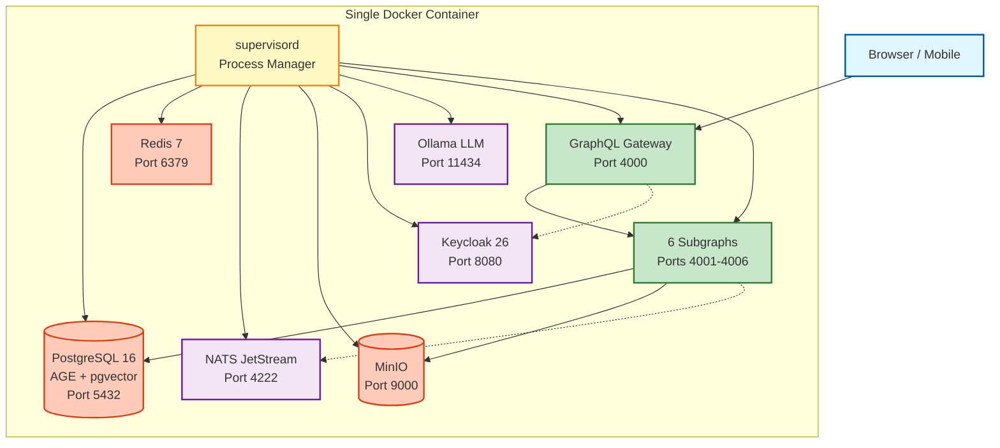

# EduSphere - Single Container Deployment

## ✅ All-in-One Architecture

**כל EduSphere פועל בתוך Docker container אחד.**

### מה כלול ב-Container:

- **PostgreSQL 16** + Apache AGE + pgvector (port 5432)
- **Redis 7** (port 6379)
- **NATS JetStream** (ports 4222, 8222)
- **MinIO** S3 storage (ports 9000, 9001)
- **Keycloak 26** OIDC (port 8080)
- **Ollama** LLM (port 11434)
- **GraphQL Gateway** (port 4000)
- **6 Subgraphs** (ports 4001-4006)

### Architecture Diagram



---

## 🚀 Quick Start

```bash
# Build image
docker-compose build

# Start container
docker-compose up -d

# Check status
curl http://localhost:4000/health

# View logs
docker-compose logs -f

# Stop
docker-compose down
```

---

## 🌐 Access Services

| Service         | URL                           | Credentials                        |
| --------------- | ----------------------------- | ---------------------------------- |
| GraphQL Gateway | http://localhost:4000/graphql | -                                  |
| Keycloak Admin  | http://localhost:8080         | admin / admin                      |
| MinIO Console   | http://localhost:9001         | minioadmin / minioadmin            |
| PostgreSQL      | localhost:5432                | edusphere / edusphere_dev_password |

---

## 📦 Data Persistence

Data stored in Docker volumes:

- `postgres_data` - PostgreSQL database
- `keycloak_data` - Keycloak configuration
- `minio_data` - Object storage
- `ollama_data` - LLM models

---

## 🔧 Development

### Hot Reload:

Uncomment in `docker-compose.yml`:

```yaml
volumes:
  - ./apps:/app/apps
  - ./packages:/app/packages
```

### Check Processes:

```bash
docker exec -it edusphere-all-in-one supervisorctl status
```

---

## 🌍 Production Deployment

```bash
# Build production image
docker build -t edusphere:prod .

# Run on any cloud (AWS/Azure/GCP) or on-premise
docker run -d \
  --name edusphere \
  --restart always \
  -p 80:4000 \
  -v /data:/var/lib/postgresql/16/main \
  edusphere:prod
```

---

## 🎁 Benefits

✅ **One command deployment** - `docker run`
✅ **Cloud-agnostic** - Run anywhere
✅ **Cost-effective** - Single VM
✅ **Perfect for:** Edge, SMB, Development

---

**Ready!** Run: `./scripts/run-docker.sh`
