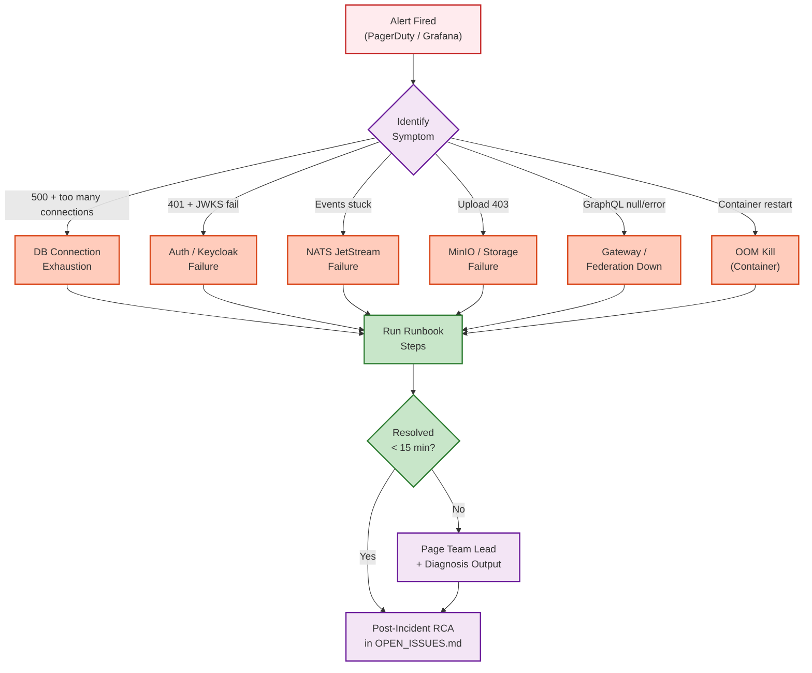

# EduSphere Operational Runbooks

> **Purpose:** Step-by-step playbooks for the 6 most common production failure modes.
> Follow these exactly — do not improvise under pressure.



---

## Runbook 1: Database Connection Exhaustion

**Symptoms:** `FATAL: too many connections`, services returning 500, slow queries
**Severity:** P0 — affects all users

### Diagnosis

```bash
# Check active connections
docker exec edusphere-postgres psql -U edusphere -c \
  "SELECT application_name, state, count(*) FROM pg_stat_activity WHERE datname='edusphere' GROUP BY 1,2 ORDER BY 3 DESC;"

# Check waiting queries
docker exec edusphere-postgres psql -U edusphere -c \
  "SELECT pid, state, wait_event_type, query FROM pg_stat_activity WHERE state = 'active' AND datname='edusphere';"
```

### Resolution

1. **Immediate:** Kill idle connections
   ```bash
   docker exec edusphere-postgres psql -U edusphere -c \
     "SELECT pg_terminate_backend(pid) FROM pg_stat_activity WHERE state = 'idle' AND query_start < now() - interval '5 minutes';"
   ```
2. **If PgBouncer:** Restart PgBouncer pool
   ```bash
   docker restart edusphere-pgbouncer
   ```
3. **If persistent:** Increase `max_connections` in `postgresql.conf` and restart PostgreSQL
4. **Root cause:** Check for connection leaks — verify all services implement `OnModuleDestroy` with `closeAllPools()`

### Prevention

- Monitor `pg_stat_activity` count in Grafana
- Alert at 80% of `max_connections`
- Verify connection pool cleanup in code review

---

## Runbook 2: Keycloak Authentication Failure

**Symptoms:** Users cannot log in, 401 on all API calls, JWKS fetch fails
**Severity:** P0 — all users locked out

### Diagnosis

```bash
# Check Keycloak health
curl -s http://localhost:8080/health/ready | jq .

# Check Keycloak logs
docker logs edusphere-keycloak --tail 50

# Check JWKS endpoint
curl -s http://localhost:8080/realms/edusphere/protocol/openid-connect/certs | jq .keys[0].kid
```

### Resolution

1. **If Keycloak is down:** Restart container
   ```bash
   docker restart edusphere-keycloak
   # Wait for health check
   until curl -sf http://localhost:8080/health/ready; do sleep 2; done
   ```
2. **If JWKS cache stale:** Restart gateway to clear JWKS cache
   ```bash
   docker restart edusphere-gateway  # or restart the gateway process
   ```
3. **If realm corrupted:** Restore from backup
   ```bash
   docker exec edusphere-keycloak /opt/keycloak/bin/kc.sh import --file /backup/edusphere-realm.json
   ```
4. **If passwords wrong:** Run password reset script
   ```bash
   node scripts/reset-keycloak-passwords.cjs
   ```

### Prevention

- JWKS cache TTL should be < 5 minutes
- Keycloak liveness probe in Kubernetes
- Daily realm export backup

---

## Runbook 3: NATS JetStream Failure

**Symptoms:** Events not processing, agent executions stuck, media upload callbacks lost
**Severity:** P1 — async features broken, core features still work

### Diagnosis

```bash
# Check NATS server health
docker exec edusphere-nats nats server check connection

# List streams
docker exec edusphere-nats nats stream ls

# Check stream health
docker exec edusphere-nats nats stream info EDUSPHERE

# Check consumer lag
docker exec edusphere-nats nats consumer ls EDUSPHERE
```

### Resolution

1. **If NATS is down:** Restart container
   ```bash
   docker restart edusphere-nats
   ```
2. **If stream corrupted:** Delete and recreate
   ```bash
   docker exec edusphere-nats nats stream rm EDUSPHERE --force
   # Streams will be auto-created on next service start
   ```
3. **If messages backing up:** Check consumer health
   ```bash
   docker exec edusphere-nats nats consumer info EDUSPHERE <consumer-name>
   # Look for "Num Pending" — if high, consumer is stuck
   ```
4. **If consumer stuck:** Delete and restart consuming service
   ```bash
   docker exec edusphere-nats nats consumer rm EDUSPHERE <consumer-name> --force
   docker restart <consuming-service>
   ```

### Prevention

- Set `max_age` and `max_bytes` on all streams
- Monitor consumer lag in Grafana
- Alert when pending messages > 1000

---

## Runbook 4: MinIO / Object Storage Failure

**Symptoms:** File uploads fail, media not loading, presign URLs return 403
**Severity:** P1 — upload/download broken, existing cached content may still work

### Diagnosis

```bash
# Check MinIO health
curl -s http://localhost:9000/minio/health/live

# Check MinIO logs
docker logs edusphere-minio --tail 50

# Check bucket exists
docker exec edusphere-minio mc ls local/edusphere
```

### Resolution

1. **If MinIO is down:** Restart container
   ```bash
   docker restart edusphere-minio
   ```
2. **If bucket missing:** Recreate
   ```bash
   docker exec edusphere-minio mc mb local/edusphere --ignore-existing
   docker exec edusphere-minio mc anonymous set download local/edusphere/public
   ```
3. **If presign URLs fail:** Check clock sync (presign URLs are time-sensitive)
   ```bash
   # Container time should match host time
   docker exec edusphere-minio date
   date
   ```
4. **If disk full:** Check MinIO disk usage
   ```bash
   docker exec edusphere-minio mc admin info local --json | jq '.info.usage'
   ```

### Prevention

- Monitor disk usage with alerts at 80%
- Set lifecycle rules for temporary upload folders
- Use CDN for public assets to reduce MinIO load

---

## Runbook 5: Gateway / Federation Failure

**Symptoms:** GraphQL queries return null/errors, `Cannot return null for non-nullable field`
**Severity:** P1 — API layer broken

### Diagnosis

```bash
# Check gateway health
curl -s http://localhost:4000/graphql -H 'Content-Type: application/json' \
  -d '{"query":"{ __typename }"}' | jq .

# Check all subgraph health
for port in 4001 4002 4003 4004 4005 4006; do
  echo "Subgraph :$port: $(curl -s -o /dev/null -w '%{http_code}' http://localhost:$port/graphql -H 'Content-Type: application/json' -d '{"query":"{ __typename }"}')"
done

# Check supergraph composition
pnpm --filter @edusphere/gateway compose 2>&1 | tail -5
```

### Resolution

1. **If gateway down:** Restart
   ```bash
   # Kill and restart gateway process
   pnpm --filter @edusphere/gateway dev
   ```
2. **If subgraph down:** Restart specific subgraph
   ```bash
   pnpm --filter @edusphere/subgraph-<name> dev
   ```
3. **If supergraph stale:** Recompose
   ```bash
   pnpm --filter @edusphere/gateway compose
   # Restart gateway to pick up new supergraph
   ```
4. **If entity resolution fails:** Check `@key` stubs in extending subgraphs

### Prevention

- Gateway health check endpoint in load balancer
- Supergraph composition in CI (already implemented)
- Individual subgraph liveness probes

---

## Runbook 6: Out of Memory (OOM) Kill

**Symptoms:** Container restarts, `docker ps` shows restart count > 0, `dmesg` shows OOM
**Severity:** P1 — affected service restarts, brief downtime

### Diagnosis

```bash
# Check container restart counts
docker ps --format "table {{.Names}}\t{{.Status}}"

# Check for OOM kills
docker inspect --format='{{.State.OOMKilled}}' <container-name>

# Check memory usage
docker stats --no-stream --format "table {{.Name}}\t{{.MemUsage}}\t{{.MemPerc}}"

# Check Node.js heap (if accessible)
# Set NODE_OPTIONS=--expose-gc --heap-prof in service, then analyze .heapprofile
```

### Resolution

1. **Immediate:** Increase `mem_limit` in docker-compose
   ```yaml
   mem_limit: 2g # was 1g
   mem_reservation: 1g # was 512m
   ```
2. **If recurring:** Profile the heap
   ```bash
   # Add to service environment
   NODE_OPTIONS: "--max-old-space-size=1536 --expose-gc --heap-prof"
   # Reproduce the OOM, analyze .heapprofile in Chrome DevTools
   ```
3. **If NATS consumer:** Check for unbounded message accumulation
4. **If database pool:** Check for connection pool leaks (missing `closeAllPools()`)

### Prevention

- All containers MUST have `mem_limit` AND `mem_reservation`
- `NODE_OPTIONS=--max-old-space-size` ≤ 75% of container `mem_limit`
- Memory alerts in Grafana at 80% of container limit
- Memory safety tests (`*.memory.spec.ts`) for all new services

---

## General Escalation Path

1. **On-call engineer:** Follow runbook → resolve in < 15 minutes
2. **If unresolved:** Page team lead with diagnosis output
3. **If data loss risk:** Freeze deployments, take PostgreSQL snapshot
4. **Post-incident:** Write RCA in OPEN_ISSUES.md, add monitoring to prevent recurrence

---

_Last updated: March 2026 — Enterprise Audit Wave 1_
