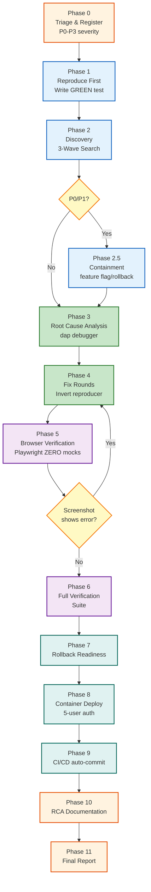

# Bug Fix Protocol V5 — EduSphere

> **Effective:** 2026-04-17 | **Supersedes:** V3 (BUG_FIX_PROTOCOL.md) + V4 (feedback)
> **Applies to:** Every bug fix, no exceptions.



## Delegation Model

The **Orchestrator** spawns one **QA Lead Agent** who owns Phases 0–11.
The QA Lead spawns sub-agents (FE, BE, DB, Security, Playwright, DevOps) per phase.
The Orchestrator only monitors and relays progress — it NEVER reads source code or makes fix decisions.

---

## Phase 0 — Triage & Registration

1. **Assign severity:** P0 (data loss/all blocked) | P1 (feature broken) | P2 (degraded) | P3 (polish)
2. **Log in `OPEN_ISSUES.md`** — status 🔴 Open, severity, domain
3. P0/P1: Rollback plan + monitoring REQUIRED before deploy

---

## Phase 1 — Reproduce First (TEST-FIRST — IRON RULE)

> **Never investigate a bug you cannot prove exists.**

1. Read logs: subgraph, gateway, PostgreSQL, NATS, frontend console
2. Write a reproducer test that asserts the **broken behavior** (must be **GREEN**)
   - UI bug → Playwright E2E (real browser, zero mocks)
   - Logic bug → unit test
   - RLS bug → integration test
3. Run the test — it MUST be GREEN (proving the bug is real)
4. Mark the test: `// BUG-NNN: reproducer — asserts BROKEN state, will be INVERTED after fix`

---

## Phase 2 — Discovery (3 Waves — MANDATORY before any fix code)

**Wave 1 — Exact Match:** Grep for the exact broken pattern across the entire codebase.

**Wave 2 — Similarity (NEVER SKIP):**

- [ ] `apps/web/src/pages/` — same anti-pattern
- [ ] `apps/web/src/hooks/` — same anti-pattern
- [ ] `apps/web/src/components/` — same anti-pattern
- [ ] `apps/mobile/src/` — mobile equivalent
- [ ] All 6 backend subgraphs `apps/subgraph-*/src/` — server-side variant
- [ ] All resolver files across subgraphs
- [ ] `packages/*/src/` — shared packages (db, auth, nats-client, graphql-shared)
- [ ] `infrastructure/` + `docker-compose*.yml` — infra/config bugs
- [ ] `.env*` + `apps/*/src/config/` — env-var/config bugs

**Wave 3 — Pattern Class:** All usages of the same API or pattern class (e.g. all `setInterval` for a cleanup bug).

Build a numbered **Discovery List** — every affected file + exact issue — before writing a single line of fix code.

---

## Phase 2.5 — Containment (P0/P1 only)

Before writing fix code, stop the bleeding: feature flag off, emergency rollback, circuit breaker.
Document containment action in OPEN_ISSUES.md.

---

## Phase 3 — Root Cause Analysis

Use `dap` debugger (NEVER console.log):

```bash
dap debug apps/subgraph-core/src/main.ts --break user.service.ts:55
dap eval "this.tenantId"   # inspect live state
dap step / dap continue / dap stop
```

Document: file:line where bug originates + why it happens.

---

## Phase 4 — Fix Rounds

| Round   | Scope                                                            |
| ------- | ---------------------------------------------------------------- |
| Round 1 | Original bug + add Pino logging + **INVERT the reproducer test** |
| Round 2 | All Wave 2 findings                                              |
| Round 3 | All Wave 3 findings                                              |
| Round N | Continue until Discovery List 100% empty                         |

**Round Completion Gate (MANDATORY after EVERY round):**

- [ ] `docker ps` — postgres, keycloak, nats, minio, jaeger healthy
- [ ] `./scripts/health-check.sh` — all services PASS
- [ ] `pnpm turbo test` — 100% pass for ALL affected packages
- [ ] `pnpm turbo typecheck` — zero TypeScript errors
- [ ] `pnpm turbo lint` — zero errors
- [ ] Reproducer test **INVERTED** and GREEN — proves fix actually works
- [ ] Regression test: asserts the bad state is GONE
- [ ] Pino structured logging added (tenantId + userId context)
- [ ] `grep bug pattern` — matches decreasing toward zero

---

## Phase 5 — Browser Verification (REAL — Zero Mocks)

> **NEVER declare fixed based on mock tests alone.**
> **YOU verify — never suggest the user should verify your work.**

```
1. docker ps ≥5 healthy — infrastructure MUST be UP
2. docker exec edusphere-all-in-one supervisorctl status
   → ALL subgraphs must be RUNNING (not FATAL/BACKOFF)
   → If FATAL: supervisorctl tail -500 <service> stderr → fix first
3. Playwright script with ZERO page.route() / ZERO mocks
4. Real Keycloak login (client: edusphere-web):
   - Fill actual credentials on the form
   - student@example.com / Student123!  (or role relevant to the bug)
5. Real navigation to the affected page
6. Real interaction (click, type, save — whatever triggers the bug)
7. Verify the SUCCESS result appears (not the error)
8. Take screenshot → save to docs/screenshots/BUG-NNN-verify-NN.png
9. Read the screenshot file with the Read tool → visually confirm
10. If screenshot shows error → NOT fixed → back to Phase 4
11. Run 10 consecutive passes: --repeat-each=10 (flake detection)
```

---

## Phase 6 — Full Verification Suite

- [ ] `pnpm turbo test` — all pass
- [ ] `pnpm turbo typecheck` — 0 errors
- [ ] `pnpm turbo lint` — 0 errors
- [ ] `pnpm test:security` — SI-1..SI-10 pass
- [ ] Playwright E2E — all pass
- [ ] `grep bug pattern` — 0 matches outside test files
- [ ] `pnpm audit --audit-level=high` — no new vulnerabilities

---

## Phase 7 — Rollback Readiness

- [ ] Rollback command documented (exact git revert / docker image tag)
- [ ] Database impact assessed (migration included? backwards-compatible?)
- [ ] Estimated recovery time: <5 min for P0/P1
- [ ] Data safety confirmed (will rollback cause data loss?)

**Decision gate:** Fix verified in <30 min → fix-forward. Takes >30 min or data at risk → rollback.

---

## Phase 8 — Container Deploy & Live Verification

**Blue-Green deploy:**

```bash
docker-compose build --no-cache   # old container stays running
# verify build succeeds (exit 0) BEFORE touching running container
docker-compose down && docker-compose up -d
```

**Verification:**

- [ ] `docker ps` — ≥5 containers healthy
- [ ] `./scripts/health-check.sh` — ALL services PASS
- [ ] `supervisorctl status` — ALL subgraphs RUNNING
- [ ] Gateway: `curl -s -X POST http://localhost:4000/graphql -H "Content-Type: application/json" -d '{"query":"{ __typename }"}'` responds
- [ ] Frontend: http://localhost:5173 loads

**5-User Authentication Test:**

| User                      | Role        | Password       |
| ------------------------- | ----------- | -------------- |
| super.admin@edusphere.dev | SUPER_ADMIN | SuperAdmin123! |
| instructor@example.com    | INSTRUCTOR  | Instructor123! |
| org.admin@example.com     | ORG_ADMIN   | OrgAdmin123!   |
| researcher@example.com    | RESEARCHER  | Researcher123! |
| student@example.com       | STUDENT     | Student123!    |

**Container-specific traps:**

- ESM-only packages (file-type v17+) fail under CJS require
- pnpm hoisting: package in package.json but symlink missing → `pnpm install` inside container
- Custom directives in SDL must be declared via `@link(import: [...])` or subgraph crashes

---

## Phase 9 — CI/CD (Auto-commit — NEVER ask)

```bash
git add <specific files>   # never git add -A
git commit -m "fix(scope): description"   # AUTOMATIC — no asking
git push
gh run list --limit 3      # verify run triggered
gh run watch               # wait for completion
```

If CI fails: `gh run view <id> --log-failed` → fix → new commit → re-push. NEVER leave CI red.

---

## Phase 10 — Documentation & RCA

Update `OPEN_ISSUES.md`:

```markdown
## BUG-NNN: [Title]

- **Status:** ✅ Fixed
- **Severity:** P1
- **Root Cause:** [layer] → exact issue at file:line
- **Reproducer test:** [path to test] (GREEN → inverted → GREEN)
- **Fix:** [what changed + files per round]
- **Tests Added:** [unit + E2E full paths]
- **Discovery List:** [numbered list from all 3 waves]
- **Prevention:** [test file:line or new CI gate]
- **Rollback Plan:** [documented command]
```

---

## Phase 11 — Final Report

```
BUG-NNN FIXED & DEPLOYED & VERIFIED
Root cause: [what was broken at file:line]
Reproducer lifecycle: GREEN (bug proven) → INVERTED (fix proven) → GREEN
Rounds: N | Discovery waves: 3 complete (N files found)
Container: deployed & verified | 5-user auth: all pass | CI: all green
```

---

## Iron Rules (NEVER violate)

1. **Test-First:** Never write fix code before a reproducer test proves the bug exists (GREEN)
2. **Inversion:** After fix, invert reproducer assertions — must be GREEN again
3. **3 Waves mandatory** before any fix code — complete Discovery List first
4. **Round Gate mandatory** after EVERY fix round — all boxes checked
5. **Container mandatory** — Phase 8 is not optional, ever
6. **Real browser mandatory** — Playwright zero mocks, real Keycloak, screenshot READ visually
7. **YOU verify** — NEVER suggest the user should verify your work
8. **NEVER claim tests passed without running them** — docker ps first
9. **If screenshot shows error → NOT fixed** — restart from Phase 4
10. **Screenshots → `docs/screenshots/`** always, never root
11. **Auto-commit in Phase 9** — never ask "should I commit?"
12. **Restore services after ANY disruption** — health-check.sh after every disruptive action
13. **Never leave CI red** — fix and re-push until green
14. **Never skip 5-user auth** — all 5 users must login successfully
