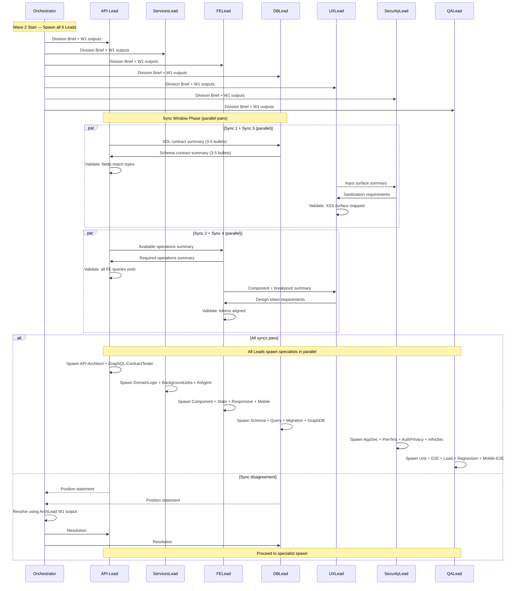

# Cross-Lead Sync Windows Protocol

## Purpose

Before Wave 2 specialists are spawned, certain Lead pairs must exchange **contract summaries** to prevent interface mismatches, schema drift, and wasted specialist cycles. These sync windows are mandatory and happen at Wave 2 start.

## Sync Windows

| #   | Sync                 | Leads                 | Duration | Validation                                     |
| --- | -------------------- | --------------------- | -------- | ---------------------------------------------- |
| 1   | Schema-SDL Alignment | API-Lead + DBLead     | 2 min    | Schema fields match SDL types                  |
| 2   | GraphQL-FE Contract  | API-Lead + FELead     | 2 min    | GraphQL fields exist before component coding   |
| 3   | UX-Security Surface  | UXLead + SecurityLead | 1 min    | RTL/i18n XSS surface mapped                    |
| 4   | Design-FE Alignment  | FELead + UXLead       | 1 min    | Design tokens + responsive breakpoints aligned |

**Total sync overhead:** 6 minutes (syncs 1+3 and 2+4 can run in parallel = ~4 min effective).

---

## Protocol

### Phase 1: Orchestrator Spawns All Wave 2 Leads

The Orchestrator spawns all 6 Wave 2 Leads simultaneously (API-Lead, ServicesLead, FELead, DBLead, SecurityLead, QALead). Each Lead receives its Division Brief with Wave 1 outputs.

### Phase 2: Sync Windows (Before Specialists)

Each Lead pair exchanges a **contract summary** — a concise 3-5 bullet point list of what they will produce and what they need from the other Lead.

#### Sync 1: API-Lead + DBLead (2 min)

**API-Lead provides:**

- List of new/modified SDL types with field names and types
- Entity ownership changes (`@key` fields)
- New federation stubs needed from other subgraphs

**DBLead provides:**

- List of new/modified Drizzle schema tables with column names and types
- RLS policy changes affecting entity access
- Migration sequence and rollback plan

**Validation:** Every SDL field maps to a Drizzle column. No type mismatches (e.g., `String!` vs `integer`). Entity `@key` fields exist as indexed DB columns.

#### Sync 2: API-Lead + FELead (2 min)

**API-Lead provides:**

- List of available queries/mutations with input/output types
- Pagination pattern (Relay cursor connection fields)
- Authorization requirements per operation

**FELead provides:**

- List of GraphQL operations the UI will call
- Expected response shapes for components
- Real-time subscription needs

**Validation:** Every FE query/mutation exists in the SDL. Response shapes match component props. No FE component depends on a field that does not exist yet.

#### Sync 3: UXLead + SecurityLead (1 min)

**UXLead provides:**

- User input fields and their expected formats
- RTL/i18n text rendering approach
- File upload and rich text editor usage

**SecurityLead provides:**

- XSS-sensitive surfaces (user-generated content, rich text, file names)
- Input sanitization requirements
- CSRF protection points

**Validation:** Every user input surface has a sanitization plan. RTL text rendering does not bypass output encoding. i18n interpolation is safe.

#### Sync 4: FELead + UXLead (1 min)

**FELead provides:**

- Component library used (shadcn/ui + Radix primitives)
- Responsive breakpoints in use (Tailwind defaults)
- Current design token values (colors, spacing, typography)

**UXLead provides:**

- Design token requirements for the feature
- Responsive behavior expectations (mobile-first, tablet, desktop)
- Animation/transition specs

**Validation:** Design tokens exist in Tailwind config. Responsive breakpoints match UX expectations. No hardcoded pixel values that contradict the design system.

### Phase 3: Disagreement Resolution

If any Lead pair cannot align within their time window:

1. Both Leads submit their position (1 bullet point each) to the Orchestrator
2. Orchestrator resolves within 1 minute using Architecture Lead output from Wave 1
3. Resolution is final — both Leads proceed with the Orchestrator's decision

### Phase 4: Specialist Spawn

After all sync windows complete, all Leads spawn their specialists in parallel. Specialists receive the sync contract summaries as part of their brief.

---

## Sync Flow Diagram

---

## Enforcement Rules

1. **No specialist may be spawned before sync windows complete** — Leads must hold until their sync partner confirms alignment
2. **Sync summaries are 3-5 bullets max** — no lengthy documents, no full schemas
3. **Time-boxed strictly** — if a Lead does not respond within the window, Orchestrator intervenes
4. **QALead and ServicesLead have no mandatory syncs** — they begin specialist planning immediately and spawn after the sync phase completes
5. **Sync results are included in specialist briefs** — every specialist receives the relevant contract summary from their Lead's sync windows

## When to Skip Syncs

Syncs may be skipped ONLY when:

- The task affects a single subgraph with no schema changes (skip Sync 1)
- The task is backend-only with no UI impact (skip Syncs 2, 3, 4)
- The task is a pure bug fix with no interface changes (skip all syncs)

The Orchestrator decides which syncs to skip based on task scope analysis. Skipped syncs must be noted in the Lead brief.
