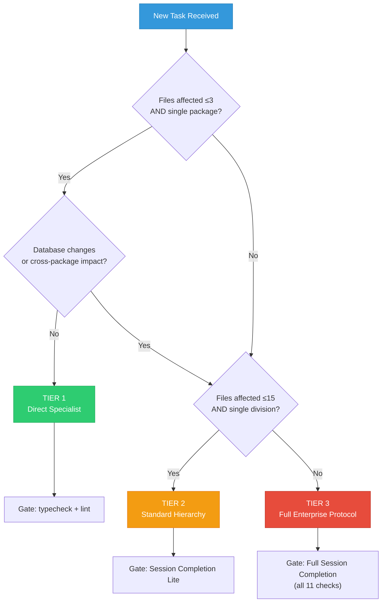
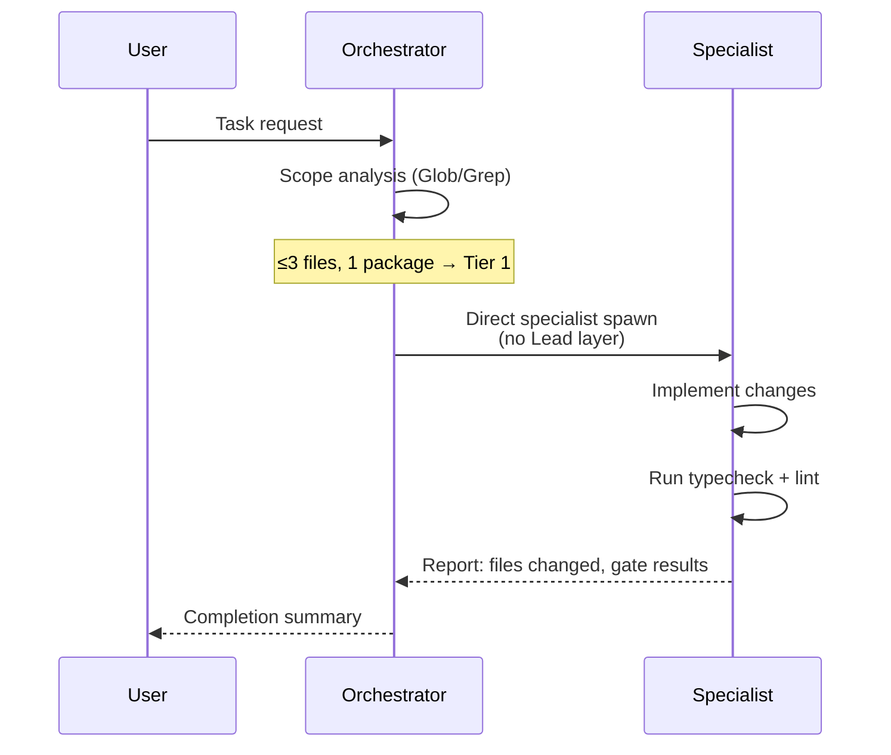
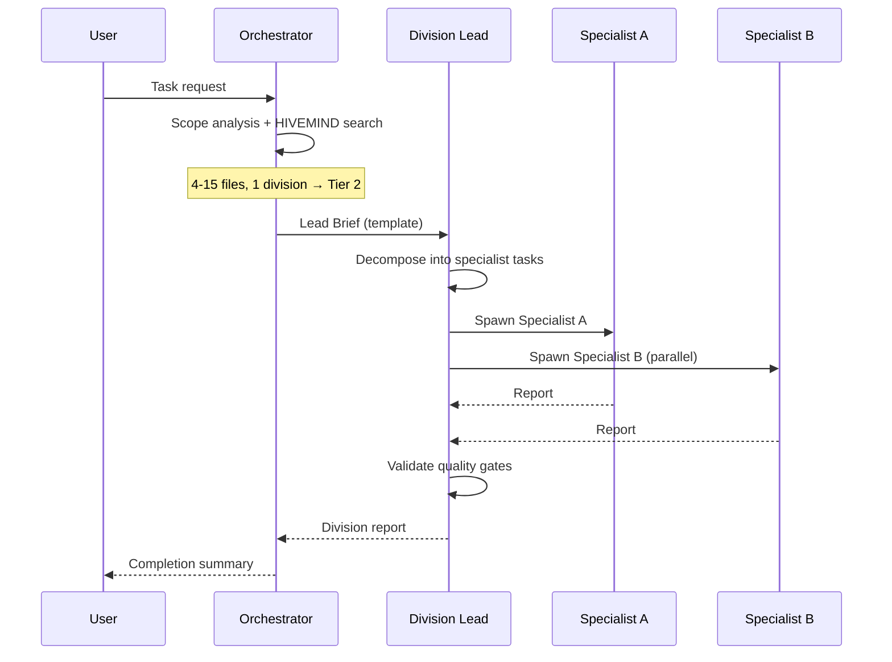
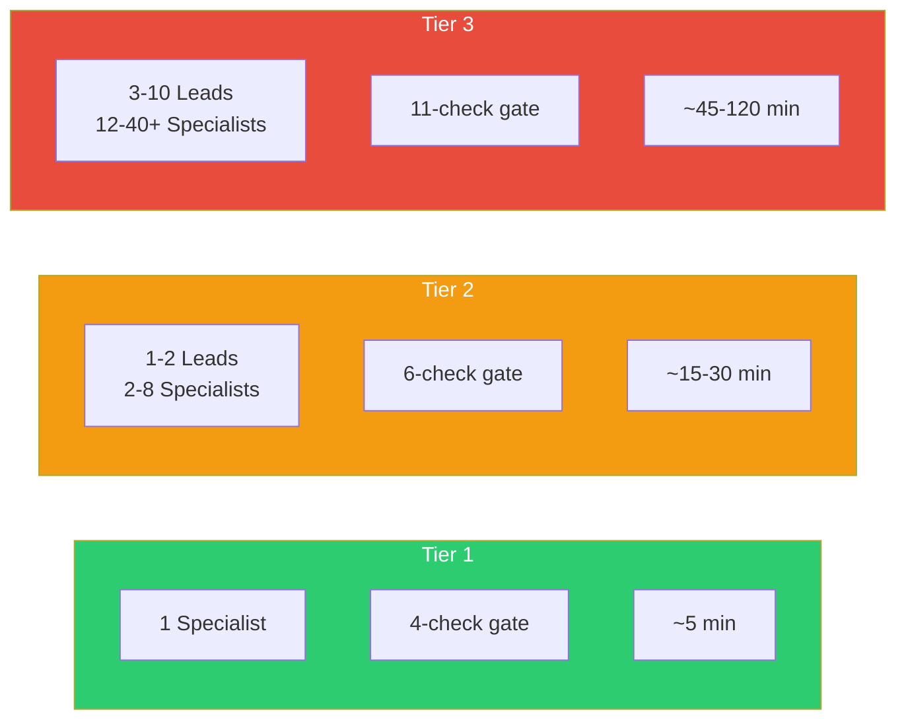

# Tiered Orchestration Protocol

## Purpose

Not every task needs the full 3-level Enterprise Protocol with 10 Division Leads and 40+ specialists. Small changes (typo fix, single test update) should not spawn a Lead agent just to spawn one specialist. This document defines 3 tiers that match orchestration overhead to task complexity.

**Related:** [AGENT-HIERARCHY.md](../architecture/AGENT-HIERARCHY.md) | [LEAD_BRIEF_TEMPLATE.md](../architecture/LEAD_BRIEF_TEMPLATE.md) | [SESSION_COMPLETION_GATE.md](SESSION_COMPLETION_GATE.md)

---

## Decision Flowchart



---

## Tier 1 — Direct Specialist

### When to Use

| Criterion | Threshold |
|-----------|-----------|
| Files affected | 1-3 |
| Packages affected | 1 (same package) |
| Database changes | None |
| Cross-package imports | None added/changed |
| Security impact | None |

### Examples

- Typo fix in a component or doc
- Single component style update
- Test fix (flaky test, assertion update)
- Doc update (README, OPEN_ISSUES)
- Single hook refactor within same file
- Config file update (tsconfig, eslint)
- Storybook story addition

### Execution Model



### Agent Spawn Pattern

The Orchestrator spawns exactly 1 specialist directly, skipping the Lead layer entirely.

**Specialist prompt must include:**
- Exact problem description (symptom only)
- Affected package name
- Gate requirement: `pnpm turbo typecheck --filter=<package>` + `pnpm turbo lint --filter=<package>`
- File size rule: all files must be under 300 lines

### Quality Gate (Tier 1)

| # | Check | Command | Required |
|---|-------|---------|----------|
| 1 | TypeScript | `pnpm turbo typecheck --filter=<package>` | 0 errors |
| 2 | Lint | `pnpm turbo lint --filter=<package>` | 0 errors |
| 3 | File size | `wc -l` on changed files | All ≤300 lines |
| 4 | Unit tests | `pnpm turbo test --filter=<package>` | 100% pass |

**Not required for Tier 1:** Health check, 5-user auth, E2E Playwright, Docker verification, HIVEMIND storage.

---

## Tier 2 — Standard Hierarchy

### When to Use

| Criterion | Threshold |
|-----------|-----------|
| Files affected | 4-15 |
| Packages affected | 1-2 (same division) |
| Database changes | Simple (single migration) |
| Cross-package imports | Minimal |
| Security impact | Low (no auth changes) |

### Examples

- New React component + unit test + Storybook story
- GraphQL resolver + service + test update
- Database migration + seed update + schema test
- Hook refactor across 2-3 components in same package
- Bug fix spanning multiple files in same subgraph
- New E2E test suite for existing feature

### Execution Model



### Agent Spawn Pattern

Orchestrator spawns 1-2 Division Leads using the [Lead Brief Template](../architecture/LEAD_BRIEF_TEMPLATE.md). Each Lead spawns 2-4 specialists.

### Quality Gate (Tier 2 — Session Completion Lite)

| # | Check | Command | Required |
|---|-------|---------|----------|
| 1 | TypeScript | `pnpm turbo typecheck` | 0 errors |
| 2 | Lint | `pnpm turbo lint` | 0 errors |
| 3 | File size | `wc -l` on changed files | All ≤300 lines |
| 4 | Unit tests | `pnpm turbo test --filter=<affected>` | 100% pass |
| 5 | E2E (if UI) | Playwright spec for changed feature | Pass |
| 6 | Health check | `./scripts/health-check.sh` | All services UP |

**Not required for Tier 2:** Full 5-user auth verification, GitHub CI check, HIVEMIND storage (unless major decision made), Docker rebuild.

---

## Tier 3 — Full Enterprise Protocol

### When to Use

| Criterion | Threshold |
|-----------|-----------|
| Files affected | 16+ |
| Packages affected | 3+ (cross-division) |
| Database changes | Complex (multiple migrations, RLS) |
| Cross-package imports | Significant |
| Security impact | Any auth/RLS/JWT changes |

### Examples

- New subgraph feature end-to-end
- Authentication flow change (Keycloak + gateway + subgraphs)
- Major refactor across FE + BE + DB
- New AI agent workflow (LangGraph + RAG + subgraph)
- GDPR/compliance feature (encryption + erasure + audit)
- Federation schema change affecting multiple subgraphs

### Execution Model

Full Wave-based parallel model as defined in [AGENT-HIERARCHY.md](../architecture/AGENT-HIERARCHY.md):

```
Wave 1 (parallel):  PM Lead + Architecture Lead + UX Lead
Wave 2 (parallel):  FE Lead + BE Lead + DB Lead + Security Lead + QA Lead
Wave 3 (parallel):  Docs Lead + DevOps Lead
Wave 4 (sequential): Deploy
Wave 5 (sequential): Post-release verification
```

### Quality Gate (Full Session Completion Gate)

All 11 checks from [SESSION_COMPLETION_GATE.md](SESSION_COMPLETION_GATE.md):

| # | Check | Required |
|---|-------|----------|
| -1 | Orchestrator compliance audit | 0 violations |
| 0 | Docker containers healthy | >=5 healthy |
| 1 | Unit tests | 100% pass |
| 2 | TypeScript | 0 errors |
| 3 | Lint | 0 errors |
| 4 | Security tests | 0 failures |
| 5 | E2E Playwright | All pass |
| 6 | Health check | All UP |
| 7 | 5-user auth | All login OK |
| 8 | GitHub CI | All green |
| 9 | Git push | Commit pushed |
| 10 | OPEN_ISSUES.md | Updated |
| 11 | HIVEMIND | Decisions stored |

---

## Tier Comparison Summary



| Aspect | Tier 1 | Tier 2 | Tier 3 |
|--------|--------|--------|--------|
| Agents spawned | 1 | 3-10 | 12-40+ |
| Lead layer | Skipped | 1-2 Leads | All applicable Leads |
| HIVEMIND | Not used | Optional | Required |
| Lead Brief template | Not used | Required | Required |
| Quality gate | 4 checks | 6 checks | 11 checks |
| Typical duration | 5 min | 15-30 min | 45-120 min |
| Docker verification | Not required | Health check only | Full container verification |
| E2E tests | Not required | If UI changed | Always required |

---

## Escalation Rules

A task may **escalate** from a lower tier to a higher tier during execution:

| Trigger | Action |
|---------|--------|
| Specialist discovers cross-package impact | Tier 1 escalates to Tier 2 |
| Lead discovers multi-division dependency | Tier 2 escalates to Tier 3 |
| Security vulnerability found during fix | Any tier escalates to Tier 3 |
| Database schema change discovered | Tier 1 escalates to Tier 2+ |
| Test failure reveals systemic issue | Current tier escalates one level |

**Escalation protocol:**
1. Agent reports blocker to parent (Specialist to Lead, or Lead to Orchestrator)
2. Orchestrator re-evaluates scope with expanded Glob/Grep analysis
3. Orchestrator re-routes to appropriate tier
4. Work already completed is preserved (not restarted)

---

## Iron Rules

1. **Tier selection happens BEFORE any agent is spawned** -- Orchestrator must analyze scope first
2. **Tier 1 may NEVER modify database schemas** -- any migration requirement forces Tier 2+
3. **Security changes ALWAYS require Tier 3** -- no exceptions for auth/RLS/JWT modifications
4. **Escalation is one-way** -- a task never de-escalates to a lower tier mid-execution
5. **Orchestrator compliance applies at ALL tiers** -- even Tier 1 uses Agent tool, not direct Edit/Write
6. **300-line file limit applies at ALL tiers** -- no tier exemption for file size
