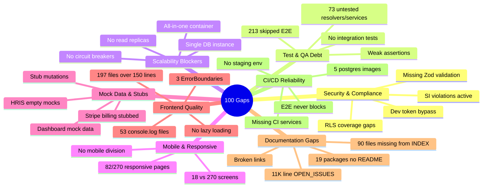
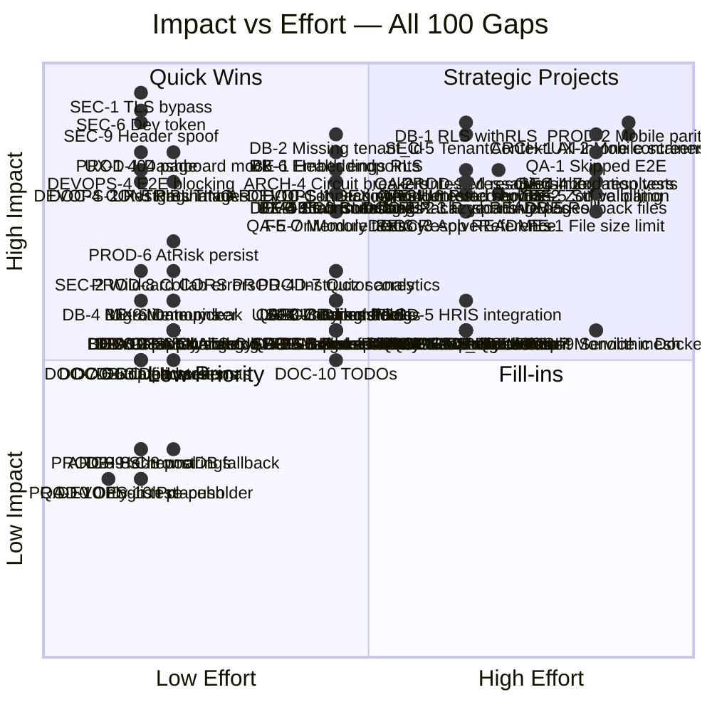
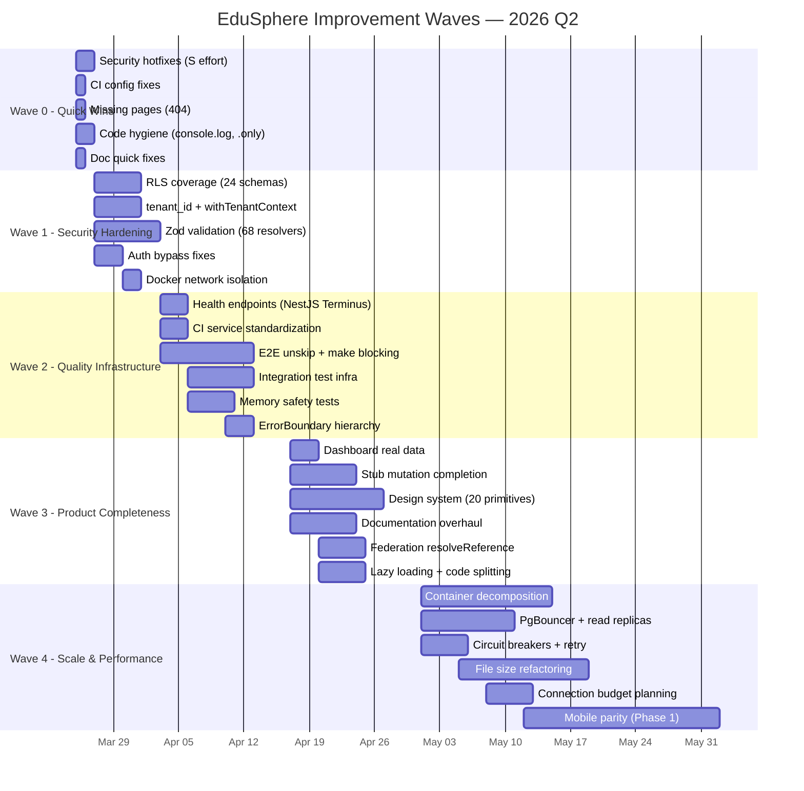
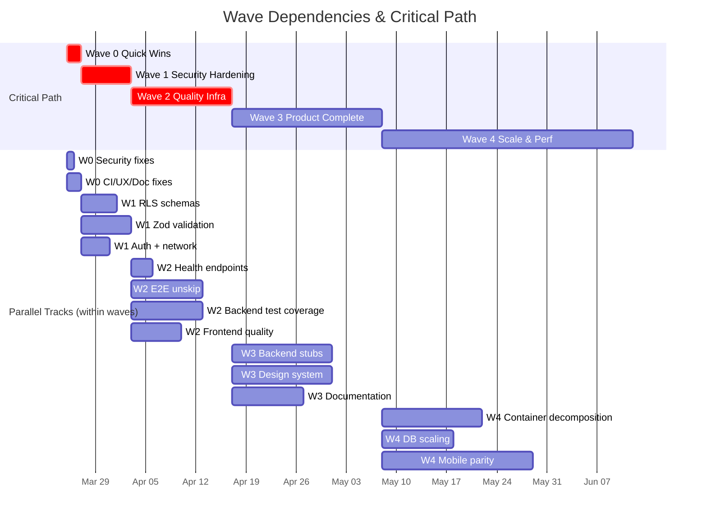
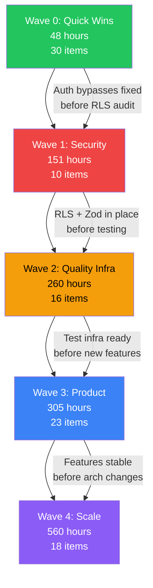
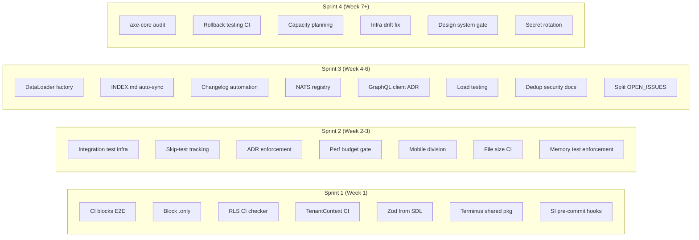
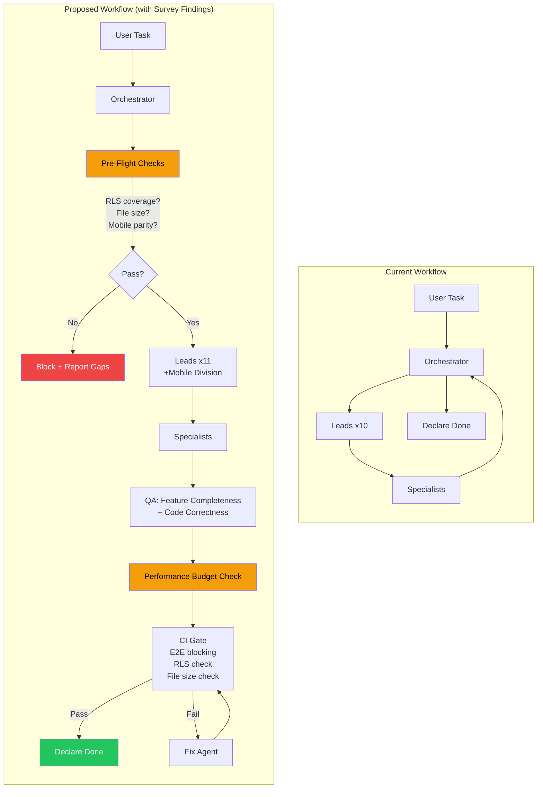
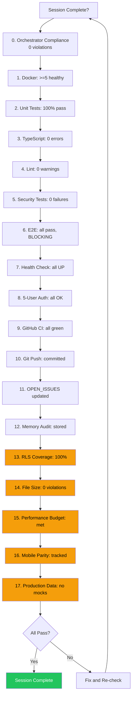
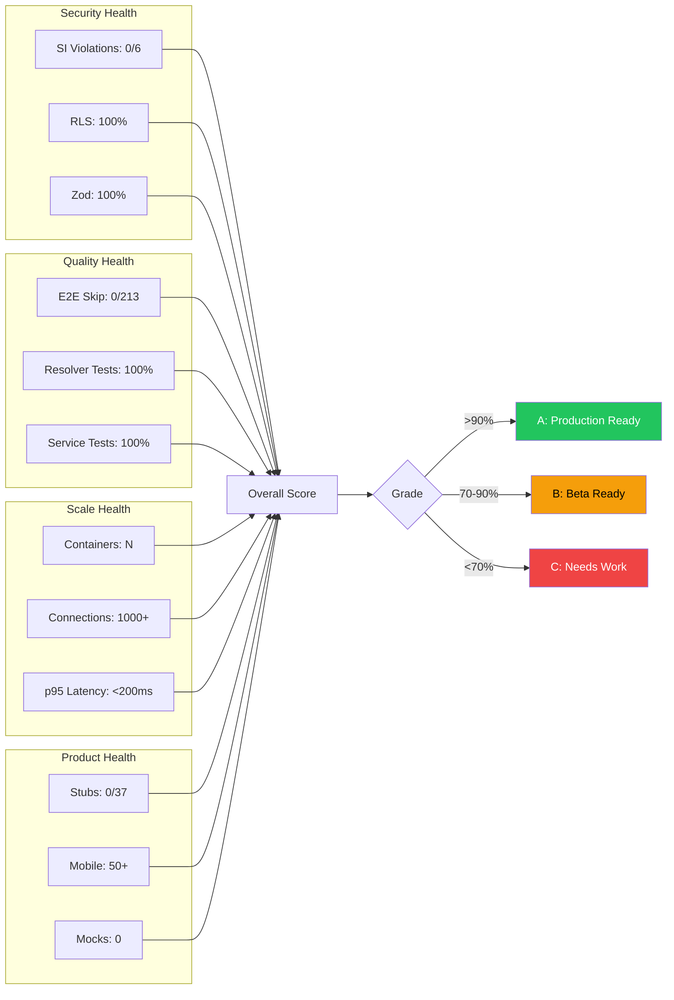

# Periodic Division Survey — Improvement Plan

**Date:** 2026-03-23
**Survey Scope:** All 10 Enterprise Divisions
**Total Gaps Identified:** 100 (10 per division)
**Process Improvements Identified:** 50 (5 per division)
**Conducted By:** Orchestrator via Division Lead interviews

---

## 1. Executive Summary / תקציר מנהלים

סקר תקופתי זה מכסה את כל 10 חטיבות הפיתוח של EduSphere ומזהה 100 פערים טכניים ו-50 שיפורי תהליך. הסקר נערך ב-23 במרץ 2026, לאחר השלמת כל 64 השלבים של מפת הדרכים.

**Key Numbers:**

| Metric | Value |
|--------|-------|
| Divisions surveyed | 10 / 10 |
| Total gaps found | 100 |
| HIGH impact gaps | 47 |
| MEDIUM impact gaps | 46 |
| LOW impact gaps | 7 |
| S effort (quick wins) | 28 |
| M effort | 30 |
| L effort | 25 |
| XL effort (major projects) | 17 |
| Process improvements | 50 |
| Security invariant violations | 6 (SI-2, SI-5, SI-8 active) |

**Critical Headline Findings:**

1. **Security exposure:** `NODE_TLS_REJECT_UNAUTHORIZED=0` in production, wildcard CORS, dev token bypass grants SUPER_ADMIN — immediate action required.
2. **RLS coverage gap:** 24 schema files lack `withRLS()`, 96 service files lack `withTenantContext`, 7 schemas missing `tenant_id` — multi-tenant isolation at risk.
3. **Test infrastructure debt:** 213 skipped E2E tests, 31 untested resolvers, 42 untested services, E2E tests never block CI.
4. **Architecture scalability:** All-in-one container, single PostgreSQL with 100 max_connections, no read replicas — cannot support 100K users.
5. **Mobile parity:** 18 mobile screens vs 167-270 web pages (6-11%) — mobile is effectively a prototype.

---

## 2. Cross-Division Critical Findings / ממצאים חוצי-חטיבות

### 2.1 Thematic Grouping

The 100 gaps cluster into 8 cross-cutting themes:

### 2.2 TOP 20 Most Critical Cross-Cutting Issues

These are the highest-priority items considering impact, blast radius, and dependencies across divisions.

| Rank | ID | Issue | Divisions Affected | Impact | Effort |
|------|----|-------|--------------------|--------|--------|
| 1 | SEC-1 | `NODE_TLS_REJECT_UNAUTHORIZED=0` in production | Security, DevOps | CRITICAL | S |
| 2 | SEC-6 | Dev token bypass grants SUPER_ADMIN without `ALLOW_DEV_TOKEN` | Security, Backend | CRITICAL | S |
| 3 | SEC-9 | Header-based auth allows spoofed SUPER_ADMIN | Security, Backend, Gateway | CRITICAL | S |
| 4 | DB-1 | 24 schema files lack RLS (`withRLS()`) | Database, Security | HIGH | L |
| 5 | DB-2 | 7 schema files missing `tenant_id` column | Database, Security | HIGH | M |
| 6 | DB-6 | Embeddings table lacks `tenant_id` and RLS | Database, Security, AI | HIGH | M |
| 7 | SEC-4 | Only 18/94 resolvers use Zod validation | Security, Backend | HIGH | XL |
| 8 | SEC-5 | 96 service files lack `withTenantContext` | Security, Backend, Database | HIGH | L |
| 9 | QA-1 | 213 skipped E2E tests across 71 files | QA, All | HIGH | XL |
| 10 | ARCH-1 | All-in-one container (15+ supervisord processes) | Architecture, DevOps | HIGH | XL |
| 11 | ARCH-2 | Single PostgreSQL 100 max_connections (target: 100K) | Architecture, Database | HIGH | L |
| 12 | BE-1 | No health/readiness/liveness endpoints | Backend, DevOps, Architecture | HIGH | M |
| 13 | QA-2 | 31 backend resolvers zero test coverage | QA, Backend | HIGH | L |
| 14 | QA-3 | 42 backend services zero test coverage | QA, Backend | HIGH | L |
| 15 | FE-1 | 197 files exceed 150-line limit | Frontend, QA | HIGH | XL |
| 16 | BE-2 | 68/85 resolvers lack Zod validation | Backend, Security | HIGH | XL |
| 17 | DEVOPS-4 | E2E tests run `continue-on-error: true` | DevOps, QA | HIGH | S |
| 18 | ARCH-4 | No circuit breakers or retry logic in gateway | Architecture, Backend | HIGH | M |
| 19 | UX-1 | No 404/Not Found page | UX, Frontend | HIGH | S |
| 20 | DB-5 | Only 1 rollback file for 32 migrations | Database, DevOps | HIGH | XL |

### 2.3 Theme-to-Division Responsibility Matrix

| Theme | Primary Division | Supporting Divisions | Gap Count |
|-------|-----------------|---------------------|-----------|
| Security & Compliance | Security | Backend, Database | 16 |
| Test & QA Debt | QA | Backend, Frontend | 14 |
| Scalability Blockers | Architecture | DevOps, Database | 8 |
| Mobile & Responsive | UX/UI + Frontend | Product | 6 |
| Mock Data & Stubs | Product + Backend | Frontend | 7 |
| Frontend Quality | Frontend | QA | 12 |
| Documentation Gaps | Documentation | All | 10 |
| CI/CD Reliability | DevOps | QA, Architecture | 10 |
| Backend Completeness | Backend | Database | 10 |
| Design System | UX/UI | Frontend | 7 |

---

## 3. Impact/Effort Matrix / מטריצת השפעה-מאמץ

---

## 4. Wave-Based Improvement Plan / תוכנית שיפור גלית

### Wave Overview

---

### Wave 0: Quick Wins (1-2 days)

**Goal:** Eliminate all HIGH-impact items that require S (small) effort. Zero-risk, high-value changes.

| # | Item | Source Division | Description | Est. Hours |
|---|------|----------------|-------------|------------|
| W0-1 | SEC-1 | Security | Remove `NODE_TLS_REJECT_UNAUTHORIZED=0` from production configs | 1 |
| W0-2 | SEC-6 | Security | Add `ALLOW_DEV_TOKEN` environment gate to dev token bypass | 1 |
| W0-3 | SEC-9 | Security | Remove header-based SUPER_ADMIN spoofing path | 2 |
| W0-4 | SEC-2 | Security | Replace wildcard CORS with explicit origin list on AEO endpoints | 1 |
| W0-5 | DEVOPS-4 | DevOps | Remove `continue-on-error: true` from E2E CI step | 0.5 |
| W0-6 | DEVOPS-2 | DevOps | Standardize postgres image to `postgres:16-alpine` across all 20 CI workflows | 2 |
| W0-7 | UX-1 | UX/UI | Create 404/Not Found page with navigation back | 3 |
| W0-8 | UX-5 | UX/UI | Add reusable Pagination component (shadcn/ui) | 3 |
| W0-9 | UX-6 | UX/UI | Add DatePicker/Calendar component (shadcn/ui) | 2 |
| W0-10 | UX-9 | UX/UI | Add reusable EmptyState component | 2 |
| W0-11 | PROD-1 | Product | Connect Dashboard to backend `myStats` resolver (remove mock) | 3 |
| W0-12 | PROD-6 | Product | Persist At-Risk Dashboard config to backend | 2 |
| W0-13 | PROD-8 | Product | Surface schema errors on Collaboration page | 1 |
| W0-14 | PROD-9 | Product | Replace hardcoded Hebrew in CreateLessonPage with i18n | 1 |
| W0-15 | PROD-10 | Product | Replace hardcoded English in BiExportSettingsPage with i18n | 1 |
| W0-16 | QA-10 | QA | Remove committed `.only()` from UserMenu.test.tsx | 0.5 |
| W0-17 | DOC-4 | Documentation | Create CONTRIBUTING.md | 3 |
| W0-18 | DOC-5 | Documentation | Deduplicate 3 file pairs in docs/security/ | 1 |
| W0-19 | DOC-6 | Documentation | Resolve 4 duplicate filenames across directories | 1 |
| W0-20 | DOC-7 | Documentation | Update 4 docs referencing outdated tech versions | 1 |
| W0-21 | DB-4 | Database | Fix duplicate migration numbers (0034, 0037) | 1 |
| W0-22 | DB-8 | Database | Initialize remaining 2 of 5 graph ontology node types | 2 |
| W0-23 | DB-9 | Database | Replace `new Pool()` in migrate.ts/seed.ts with `getOrCreatePool()` | 1 |
| W0-24 | DB-10 | Database | Optimize HNSW index parameters for scale | 2 |
| W0-25 | BE-8 | Backend | Add `OnModuleDestroy` to lesson-pipeline-template.service | 1 |
| W0-26 | BE-9 | Backend | Replace hardcoded stub in GapAnalysisService with proper error | 1 |
| W0-27 | DEVOPS-6 | DevOps | Automate changelog generation with `conventional-changelog` | 3 |
| W0-28 | DEVOPS-8 | DevOps | Add NATS service to missing CI workflows | 2 |
| W0-29 | ARCH-8 | Architecture | Add ChromaDB fallback/health-check in HIVEMIND | 2 |
| W0-30 | DEVOPS-10 | DevOps | Add lint + typecheck to pre-push hook | 1 |

**Total estimated hours:** ~48 agent-hours
**Dependencies:** None (all independent)
**Success criteria:**
- Zero active SI violations (SI-2, SI-5, SI-8 resolved)
- E2E tests block CI on failure
- 404 page renders for unknown routes
- Dashboard shows real data from backend
- All 30 items verified with unit tests

---

### Wave 1: Security Hardening (1 week)

**Goal:** Eliminate all multi-tenant isolation gaps and authentication vulnerabilities. After this wave, RLS coverage should be 100%.

| # | Item | Source Division | Description | Est. Hours |
|---|------|----------------|-------------|------------|
| W1-1 | DB-1 | Database | Add `withRLS()` to 24 schema files | 16 |
| W1-2 | DB-2 | Database | Add `tenant_id` column to 7 schema files + migrations | 12 |
| W1-3 | DB-6 | Database | Add `tenant_id` + RLS to embeddings table | 6 |
| W1-4 | SEC-5 | Security | Add `withTenantContext` wrapper to 96 service files | 32 |
| W1-5 | SEC-4 / BE-2 | Security + Backend | Add Zod validation schemas to 68 resolvers (batch generation from SDL) | 40 |
| W1-6 | SEC-3 | Security | Replace 3 `new Pool()` usages with `getOrCreatePool()` | 3 |
| W1-7 | SEC-7 | Security | Audit and restrict `withBypassRLS` to admin-only services | 6 |
| W1-8 | SEC-8 | Security | Add Docker network isolation (internal networks per service group) | 8 |
| W1-9 | SEC-10 | Security | Implement GDPR data retention cron worker | 16 |
| W1-10 | QA-5 | QA | Add `OnModuleDestroy` to 39 backend services missing it | 12 |

**Total estimated hours:** ~151 agent-hours
**Dependencies:** Wave 0 must complete (SEC-1, SEC-6, SEC-9 fix auth bypass first)
**Success criteria:**
- `pnpm test:security` — 0 failures, all 249+ tests pass
- `pnpm test:rls` — 100% RLS coverage, all tables verified
- Every schema file has `withRLS()` — grep returns 0 misses
- Every service file uses `withTenantContext` — grep returns 0 misses
- Cross-tenant isolation tests pass for all 5 user roles

---

### Wave 2: Quality Infrastructure (2 weeks)

**Goal:** Build the test and CI infrastructure that makes future development safe and fast.

| # | Item | Source Division | Description | Est. Hours |
|---|------|----------------|-------------|------------|
| W2-1 | BE-1 | Backend | Add NestJS Terminus health/readiness/liveness to all 6 subgraphs | 16 |
| W2-2 | DEVOPS-1 | DevOps | Create `docker-compose.staging.yml` with production-like config | 12 |
| W2-3 | DEVOPS-3 | DevOps | Add Keycloak + MinIO services to CI test workflows | 8 |
| W2-4 | QA-1 | QA | Unskip and fix 213 E2E tests (batch by page/feature) | 48 |
| W2-5 | QA-2 | QA | Write tests for 31 untested backend resolvers | 24 |
| W2-6 | QA-3 | QA | Write tests for 42 untested backend services | 32 |
| W2-7 | QA-4 | QA | Create integration test infrastructure for all 6 subgraphs | 24 |
| W2-8 | FE-4 | Frontend | Write tests for 14 untested hooks (incl. security-critical) | 12 |
| W2-9 | FE-7 | Frontend | Add memory safety tests for 12 timer-using files without tests | 8 |
| W2-10 | FE-5 | Frontend | Add hierarchical ErrorBoundary coverage (route > feature > component) | 12 |
| W2-11 | FE-3 | Frontend | Replace 53 `console.log` files with Pino logger | 8 |
| W2-12 | QA-7 | QA | Add `toHaveScreenshot()` to 66 E2E specs missing visual regression | 16 |
| W2-13 | QA-8 | QA | Replace 278 weak `toBeTruthy`/`toBeDefined` with behavioral assertions | 16 |
| W2-14 | QA-9 | QA | Expand gateway test coverage (currently 7 files) | 12 |
| W2-15 | DOC-1 | Documentation | Sync INDEX.md to include all 90 missing files | 8 |
| W2-16 | DOC-8 | Documentation | Fix 14+ broken internal links | 4 |

**Total estimated hours:** ~260 agent-hours
**Dependencies:** Wave 0 (CI fixes), Wave 1 (RLS + validation in place before testing)
**Success criteria:**
- Skipped E2E tests reduced from 213 to < 20
- Backend resolver test coverage > 90%
- Backend service test coverage > 85%
- All 6 subgraphs have health endpoints responding
- CI blocks on E2E failure (no `continue-on-error`)
- Visual regression baseline established for all E2E specs
- `pnpm turbo test` — 100% pass, 0 skip in backend

---

### Wave 3: Product Completeness (3-4 weeks)

**Goal:** Replace stubs with real implementations, complete the design system, and bring documentation to production quality.

| # | Item | Source Division | Description | Est. Hours |
|---|------|----------------|-------------|------------|
| W3-1 | BE-4 | Backend | Implement 4 stub mutations in org-onboarding resolver | 16 |
| W3-2 | BE-3 | Backend | Implement missing 33 `resolveReference` for federation entities | 24 |
| W3-3 | BE-6 | Backend | Implement 2 GraphQL subscription resolvers | 8 |
| W3-4 | BE-7 | Backend | Apply `@rateLimit` directive to sensitive mutations | 4 |
| W3-5 | BE-10 | Backend | Add NATS consumers for orphaned publisher events | 16 |
| W3-6 | PROD-4 | Product | Complete Instructor Analytics with AI usage data | 12 |
| W3-7 | PROD-5 | Product | Connect HRIS Integration page to real data endpoints | 16 |
| W3-8 | PROD-7 | Product | Add quiz score tracking to Course Analytics | 8 |
| W3-9 | UX-4 | UX/UI | Add 20 missing shadcn/ui primitives | 16 |
| W3-10 | UX-7 | UX/UI | Extend dark mode `dark:` classes across all components | 16 |
| W3-11 | UX-8 | UX/UI | Add loading/error states to remaining 55% of pages | 20 |
| W3-12 | UX-10 | UX/UI | Add confirmation dialogs for destructive actions (257 pages) | 12 |
| W3-13 | FE-2 | Frontend | Add lazy loading to 156 route-level pages | 16 |
| W3-14 | FE-8 | Frontend | Standardize GraphQL client to single solution (urql) | 20 |
| W3-15 | FE-9 | Frontend | Add Suspense boundaries + React.memo where needed | 8 |
| W3-16 | FE-10 | Frontend | Add Zod to 6 forms + i18n to 25 pages | 10 |
| W3-17 | DOC-2 | Documentation | Write README for 19 packages | 16 |
| W3-18 | DOC-3 | Documentation | Write README for 6 apps | 10 |
| W3-19 | DOC-9 | Documentation | Split OPEN_ISSUES.md into active + archive | 6 |
| W3-20 | DOC-10 | Documentation | Resolve 17 TODO/FIXME markers in docs | 4 |
| W3-21 | DB-3 | Database | Remove 9 dead/unexported schema files | 3 |
| W3-22 | DB-7 | Database | Add DataLoaders for high-cardinality entity types | 16 |
| W3-23 | ARCH-5 | Architecture | Split 100+ file barrel into domain-scoped sub-barrels | 8 |

**Total estimated hours:** ~305 agent-hours
**Dependencies:** Wave 1 (security in place), Wave 2 (test infra ready for new features)
**Success criteria:**
- Zero stub mutations remaining in production resolvers
- All federation entities have `resolveReference` implemented
- Design system has all 20 standard shadcn/ui primitives
- Every package and app has a README
- OPEN_ISSUES.md active section < 500 lines
- All route-level pages use lazy loading
- Single GraphQL client across frontend

---

### Wave 4: Scale & Performance (4-6 weeks)

**Goal:** Prepare the system to handle 100,000+ concurrent users. Architecture and infrastructure overhaul.

| # | Item | Source Division | Description | Est. Hours |
|---|------|----------------|-------------|------------|
| W4-1 | ARCH-1 | Architecture | Decompose all-in-one container into per-service containers | 60 |
| W4-2 | ARCH-2 | Architecture | Configure PgBouncer transaction-mode pooling + connection budget | 20 |
| W4-3 | ARCH-6 | Architecture | Add PostgreSQL read replicas for query workloads | 24 |
| W4-4 | ARCH-4 | Architecture | Add circuit breakers (opossum) + retry logic to gateway | 12 |
| W4-5 | ARCH-3 | Architecture | Validate PgBouncer + RLS `SET LOCAL` compatibility | 8 |
| W4-6 | ARCH-10 | Architecture | Document and enforce connection budget for 100K users | 8 |
| W4-7 | FE-1 | Frontend | Refactor 197 files exceeding 150-line limit | 60 |
| W4-8 | DB-5 | Database | Create rollback files for all 32 migrations | 40 |
| W4-9 | BE-5 | Backend | Implement Stripe billing integration (replace stubs) | 60 |
| W4-10 | PROD-3 | Product | Build direct messaging / inbox system | 40 |
| W4-11 | DEVOPS-7 | DevOps | Refactor monolithic Dockerfile into multi-stage per-service | 32 |
| W4-12 | DEVOPS-5 | DevOps | Add rollback testing to CI pipeline | 16 |
| W4-13 | DEVOPS-9 | DevOps | Implement secret rotation automation | 16 |
| W4-14 | ARCH-9 | Architecture | Evaluate and plan service mesh (Linkerd) | 16 |
| W4-15 | ARCH-7 | Architecture | Optimize agent hierarchy latency (direct specialist pools) | 12 |
| W4-16 | UX-3 | UX/UI | Add responsive breakpoints to remaining 188 pages | 40 |
| W4-17 | PROD-2 / UX-2 | Product + UX | Mobile parity Phase 1: top 30 screens | 80 |
| W4-18 | QA-1-rem | QA | Fix any remaining skipped E2E tests from Wave 2 | 16 |

**Total estimated hours:** ~560 agent-hours
**Dependencies:** Waves 0-3 complete (security + quality + features stable before architecture changes)
**Success criteria:**
- Each service runs in its own container (no supervisord)
- PgBouncer handles connection pooling with RLS-safe transaction mode
- Read replicas active for query workloads
- Circuit breakers prevent cascade failures
- Load test: 100K simulated concurrent users with < 200ms p95 latency
- Mobile app has 50+ screens (up from 18)
- All files under 150-line limit (except documented exceptions)
- Stripe billing functional in staging

---

### Wave Summary Table

| Wave | Duration | Items | Agent-Hours | Key Metric |
|------|----------|-------|-------------|------------|
| Wave 0 | 1-2 days | 30 | 48 | SI violations: 6 -> 0 |
| Wave 1 | 1 week | 10 | 151 | RLS coverage: ~70% -> 100% |
| Wave 2 | 2 weeks | 16 | 260 | Skipped E2E: 213 -> <20 |
| Wave 3 | 3-4 weeks | 23 | 305 | Stub resolvers: 37 -> 0 |
| Wave 4 | 4-6 weeks | 18 | 560 | Containers: 1 -> N per-service |
| **Total** | **~12 weeks** | **97** | **1,324** | |

> **Note:** 3 items are addressed across multiple waves (SEC-4/BE-2 Zod validation spans W1+W3, QA-1 spans W2+W4, PROD-2/UX-2 mobile parity spans W4 and beyond).

---

## 5. Wave Dependency Graph / גרף תלויות גלי

### Dependency Rules

---

## 6. Process Improvement Recommendations / המלצות לשיפור תהליכים

### 6.1 Consolidated Process Improvements

The 50 process improvements from all 10 divisions consolidate into 8 actionable categories:

#### Category A: CI/CD Gates (12 improvements)

| # | Improvement | Source Division(s) | Priority |
|---|-------------|-------------------|----------|
| A1 | Block CI on E2E failure (remove `continue-on-error`) | DevOps, QA | CRITICAL |
| A2 | Add file size enforcement (max 150 lines) to CI | Frontend | HIGH |
| A3 | Block `.only()` in pre-commit hook | QA | HIGH |
| A4 | Add RLS coverage checker to CI | Database, Security | HIGH |
| A5 | Add `withTenantContext` enforcement to CI | Security | HIGH |
| A6 | Add broken-link checker to CI for docs | Documentation | MEDIUM |
| A7 | Enforce memory cleanup test requirement in pre-commit | QA, Frontend | MEDIUM |
| A8 | Add schema-drift-check to CI | DevOps | MEDIUM |
| A9 | Add responsive design enforcement in CI | UX/UI | MEDIUM |
| A10 | Enforce package/app README in completion gate | Documentation | MEDIUM |
| A11 | Add migration numbering enforcement to pre-commit | Database | LOW |
| A12 | Add Trivy infrastructure-as-code scanning | Security | MEDIUM |

#### Category B: Code Generation & Standardization (8 improvements)

| # | Improvement | Source Division(s) | Priority |
|---|-------------|-------------------|----------|
| B1 | Auto-generate Zod schemas from GraphQL SDL | Security, Backend | HIGH |
| B2 | DataLoader generation factory/pattern | Database | MEDIUM |
| B3 | Memory safety tests auto-generated for timer-using files | Frontend, QA | MEDIUM |
| B4 | Automate INDEX.md sync after doc creation | Documentation | MEDIUM |
| B5 | Automate changelog + versioning on release tags | DevOps | MEDIUM |
| B6 | Standardize NestJS Terminus health module as shared package | Backend | HIGH |
| B7 | Centralize NATS event registry with consumer validation | Backend | MEDIUM |
| B8 | GraphQL client standardization (ADR) | Frontend | MEDIUM |

#### Category C: Testing Process (7 improvements)

| # | Improvement | Source Division(s) | Priority |
|---|-------------|-------------------|----------|
| C1 | Add integration test infrastructure for all subgraphs | QA | HIGH |
| C2 | Automate skipped-test tracking in CI dashboard | QA | HIGH |
| C3 | Replace weak assertions with behavioral assertions (lint rule) | QA | MEDIUM |
| C4 | Add scalability/load testing to QA process | Architecture | MEDIUM |
| C5 | QA wave should verify feature completeness, not just code | Product | MEDIUM |
| C6 | Add accessibility audit automation (axe-core in Playwright) | UX/UI | MEDIUM |
| C7 | Add rollback testing to CI | DevOps | MEDIUM |

#### Category D: Architecture & Planning (6 improvements)

| # | Improvement | Source Division(s) | Priority |
|---|-------------|-------------------|----------|
| D1 | Enforce ADR process for architecture decisions | Architecture | HIGH |
| D2 | Add performance budget to completion gate | Architecture | HIGH |
| D3 | Create capacity planning documentation | Architecture | MEDIUM |
| D4 | Address infrastructure drift (docker-compose vs K8s) | DevOps | MEDIUM |
| D5 | Reduce all-in-one container volume mount complexity | DevOps | MEDIUM |
| D6 | Schema file ownership map between subgraphs | Database | MEDIUM |

#### Category E: Documentation Pipeline (5 improvements)

| # | Improvement | Source Division(s) | Priority |
|---|-------------|-------------------|----------|
| E1 | Consolidate duplicate security docs | Documentation | MEDIUM |
| E2 | Split OPEN_ISSUES.md into active/archive | Documentation | MEDIUM |
| E3 | Stub service audit and tracking document | Backend | MEDIUM |
| E4 | Storybook coverage gap (15/26 components) | UX/UI | LOW |
| E5 | Resolve TODO/FIXME markers in docs | Documentation | LOW |

#### Category F: Agent & Process Architecture (5 improvements)

| # | Improvement | Source Division(s) | Priority |
|---|-------------|-------------------|----------|
| F1 | Add Mobile division to agent hierarchy | Product | HIGH |
| F2 | Discovery wave checklist: add mobile parity check | Product | MEDIUM |
| F3 | Session Completion Gate: add "Production Data Integration" check | Product | MEDIUM |
| F4 | Design system completeness gate before page development | UX/UI | MEDIUM |
| F5 | Mobile parity tracking in IMPLEMENTATION_ROADMAP.md | UX/UI | MEDIUM |

#### Category G: Security Process (5 improvements)

| # | Improvement | Source Division(s) | Priority |
|---|-------------|-------------------|----------|
| G1 | Security invariant pre-commit hook enforcement | Security | HIGH |
| G2 | Dev token bypass consolidation | Security | MEDIUM |
| G3 | Federation entity resolution audit | Backend | MEDIUM |
| G4 | Graph client connection pooling + health checks | Database | MEDIUM |
| G5 | Secret rotation automation | DevOps | MEDIUM |

#### Category H: Stale Code Management (2 improvements)

| # | Improvement | Source Division(s) | Priority |
|---|-------------|-------------------|----------|
| H1 | Stale comments/TODOs caught by process gate | Product | MEDIUM |
| H2 | Route-level code splitting coordination with backend | Frontend | LOW |

### 6.2 Implementation Priority

---

## 7. Improved Agent Workflow / תהליך סוכנים משופר

### Current vs. Proposed Workflow

### Proposed New Completion Gate (Enhanced)

> **Yellow items (13-17)** are new gates proposed from this survey.

---

## 8. Metrics & KPIs / מדדים ויעדי ביצוע

### 8.1 Baseline Metrics (as of 2026-03-23)

| Metric | Current Value | Target (Post-Wave 4) |
|--------|--------------|----------------------|
| **Security** | | |
| Active SI violations | 6 | 0 |
| Schema files with RLS | ~76% | 100% |
| Resolvers with Zod validation | 18/94 (19%) | 94/94 (100%) |
| Services with `withTenantContext` | ~0% | 100% |
| **Testing** | | |
| Skipped E2E tests | 213 | 0 |
| Backend resolver test coverage | 64/95 (67%) | 95/95 (100%) |
| Backend service test coverage | 43/85 (51%) | 85/85 (100%) |
| Integration test files | 3 | 18+ (3 per subgraph) |
| Visual regression coverage | 68/134 (51%) | 134/134 (100%) |
| **Frontend** | | |
| Files over 150 lines | 197 | 0 |
| Files using console.log | 53 | 0 |
| Lazy-loaded routes | 9/165 (5%) | 165/165 (100%) |
| ErrorBoundary coverage | 3 refs | Route + Feature + Component |
| **Architecture** | | |
| Container count | 1 (all-in-one) | 8+ (per-service) |
| DB max_connections | 100 | 1000+ (PgBouncer) |
| Read replicas | 0 | 2+ |
| Circuit breakers | 0 | All gateway routes |
| **Product** | | |
| Mock data pages | 3+ | 0 |
| Stub resolvers | 37+ | 0 |
| Mobile screens | 18 | 50+ |
| Responsive pages | 82/270 (30%) | 270/270 (100%) |
| **Documentation** | | |
| Packages with README | 2/21 (10%) | 21/21 (100%) |
| Apps with README | 5/11 (45%) | 11/11 (100%) |
| Files in INDEX.md | ~56% | 100% |
| Broken internal links | 14+ | 0 |

### 8.2 Per-Wave KPI Targets

| KPI | Baseline | After W0 | After W1 | After W2 | After W3 | After W4 |
|-----|----------|----------|----------|----------|----------|----------|
| SI violations | 6 | 0 | 0 | 0 | 0 | 0 |
| RLS coverage | 76% | 76% | 100% | 100% | 100% | 100% |
| Zod coverage | 19% | 19% | 100% | 100% | 100% | 100% |
| Skipped E2E | 213 | 212 | 212 | <20 | <10 | 0 |
| Resolver test coverage | 67% | 67% | 67% | >90% | >95% | 100% |
| Files >150 lines | 197 | 197 | 197 | 197 | 197 | 0 |
| console.log files | 53 | 53 | 53 | 0 | 0 | 0 |
| Lazy-loaded routes | 5% | 5% | 5% | 5% | 100% | 100% |
| Mobile screens | 18 | 18 | 18 | 18 | 18 | 50+ |
| README coverage | 27% | 27% | 27% | 27% | 100% | 100% |
| Stub resolvers | 37 | 35 | 35 | 35 | 0 | 0 |

### 8.3 Measurement Automation

| Metric | How to Measure | Frequency |
|--------|---------------|-----------|
| SI violations | `pnpm test:security` | Every CI run |
| RLS coverage | Custom CI script: grep schemas without `withRLS()` | Every CI run |
| Zod coverage | Count resolvers with/without Zod import | Weekly |
| Skipped E2E | `grep -r "test.skip\|it.skip\|describe.skip" apps/web/e2e/ \| wc -l` | Every CI run |
| Resolver coverage | `pnpm turbo test -- --coverage` per subgraph | Every CI run |
| File size | Custom lint rule: max 150 lines (with exceptions) | Every CI run |
| console.log | ESLint `no-console` rule enforcement | Every CI run |
| Mobile screens | `ls apps/mobile/src/screens/ \| wc -l` | Weekly |
| README coverage | Script: check for README.md in each package/app dir | Weekly |
| Performance p95 | Load test with k6 against staging | Before each release |

### 8.4 Health Dashboard Proposal

---

## Appendix A: Full Gap Inventory by Division

Click to expand all 100 gaps with metadata

### Product & Requirements (PROD-1 through PROD-10)

| ID | Gap | Impact | Effort | Wave |
|----|-----|--------|--------|------|
| PROD-1 | Dashboard uses mock data despite backend myStats resolver ready | HIGH | S | W0 |
| PROD-2 | Mobile parity gap: 167 web pages vs 18 mobile screens (11%) | HIGH | XL | W4 |
| PROD-3 | No direct messaging / inbox system | HIGH | L | W4 |
| PROD-4 | Instructor Analytics incomplete — "AI usage analytics coming soon" | MEDIUM | M | W3 |
| PROD-5 | HRIS Integration page uses empty mock data | MEDIUM | L | W3 |
| PROD-6 | At-Risk Dashboard config not persisted to backend | MEDIUM | S | W0 |
| PROD-7 | Course Analytics quiz scores not tracked | MEDIUM | M | W3 |
| PROD-8 | Collaboration page hides schema errors | MEDIUM | S | W0 |
| PROD-9 | CreateLessonPage has hardcoded Hebrew strings | LOW | S | W0 |
| PROD-10 | BiExportSettingsPage has hardcoded English placeholder | LOW | S | W0 |

### Software Architecture (ARCH-1 through ARCH-10)

| ID | Gap | Impact | Effort | Wave |
|----|-----|--------|--------|------|
| ARCH-1 | All-in-one container anti-pattern (15+ supervisord) | HIGH | XL | W4 |
| ARCH-2 | Single PostgreSQL with 100 max_connections | HIGH | L | W4 |
| ARCH-3 | PgBouncer + RLS SET LOCAL bypass risk | HIGH | M | W4 |
| ARCH-4 | No circuit breakers or retry logic in gateway | HIGH | M | W4 |
| ARCH-5 | 100+ schema files through single barrel | MEDIUM | L | W3 |
| ARCH-6 | No read replicas configured | HIGH | L | W4 |
| ARCH-7 | 3-level agent hierarchy adds latency | MEDIUM | M | W4 |
| ARCH-8 | No ChromaDB fallback in HIVEMIND | LOW | S | W0 |
| ARCH-9 | No service mesh for inter-service communication | MEDIUM | XL | W4 |
| ARCH-10 | Missing connection budget planning for 100K users | HIGH | M | W4 |

### UX/UI Design (UX-1 through UX-10)

| ID | Gap | Impact | Effort | Wave |
|----|-----|--------|--------|------|
| UX-1 | No 404/Not Found page | HIGH | S | W0 |
| UX-2 | Mobile parity: 18 screens vs 270 web pages (6.7%) | HIGH | XL | W4 |
| UX-3 | Only 82 of 270 pages (30%) use responsive breakpoints | HIGH | L | W4 |
| UX-4 | 20 standard shadcn/ui primitives missing | HIGH | M | W3 |
| UX-5 | No dedicated pagination component | HIGH | S | W0 |
| UX-6 | No date picker / calendar component | MEDIUM | S | W0 |
| UX-7 | Dark mode: only 1 component uses dark: classes | MEDIUM | M | W3 |
| UX-8 | Loading/error states cover only ~45% of pages | MEDIUM | M | W3 |
| UX-9 | No reusable empty state component | MEDIUM | S | W0 |
| UX-10 | Only 13 of 270 pages use confirmation dialogs | MEDIUM | M | W3 |

### Frontend Engineering (FE-1 through FE-10)

| ID | Gap | Impact | Effort | Wave |
|----|-----|--------|--------|------|
| FE-1 | 197 files exceed 150-line limit (28 >300 lines) | HIGH | XL | W4 |
| FE-2 | Only 9 files use lazy loading across 165 pages | HIGH | L | W3 |
| FE-3 | 53 files use console.log instead of Pino | HIGH | M | W2 |
| FE-4 | 14 hooks have zero tests (incl. security-critical) | HIGH | L | W2 |
| FE-5 | Only 3 ErrorBoundary references across 558 components | HIGH | M | W2 |
| FE-6 | 12 components have zero tests | MEDIUM | M | W2 |
| FE-7 | 22 files with setInterval — only 10 memory tests | HIGH | M | W2 |
| FE-8 | Inconsistent GraphQL client (urql + graphql-request + raw fetch) | MEDIUM | L | W3 |
| FE-9 | Only 5 Suspense boundaries + 21 React.memo | MEDIUM | M | W3 |
| FE-10 | 6 forms lack Zod validation + 25 pages lack i18n | MEDIUM | M | W3 |

### Backend Engineering (BE-1 through BE-10)

| ID | Gap | Impact | Effort | Wave |
|----|-----|--------|--------|------|
| BE-1 | No health/readiness/liveness endpoints in any subgraph | HIGH | M | W2 |
| BE-2 | 68 of 85 resolvers lack Zod validation | HIGH | XL | W1 |
| BE-3 | 39 federation @key entities but only 6 resolveReference | HIGH | L | W3 |
| BE-4 | 4 stub mutations in org-onboarding resolver | HIGH | M | W3 |
| BE-5 | Stripe billing entirely stubbed | HIGH | XL | W4 |
| BE-6 | 2 GraphQL subscriptions defined but no resolver | MEDIUM | M | W3 |
| BE-7 | @rateLimit directive defined but never applied | MEDIUM | M | W3 |
| BE-8 | Memory leak: lesson-pipeline-template.service without OnModuleDestroy | MEDIUM | S | W0 |
| BE-9 | GapAnalysisService returns hardcoded stub on DB error | MEDIUM | S | W0 |
| BE-10 | NATS publishers outnumber consumers (events into void) | MEDIUM | L | W3 |

### Database & Data (DB-1 through DB-10)

| ID | Gap | Impact | Effort | Wave |
|----|-----|--------|--------|------|
| DB-1 | 24 schema files lack RLS (withRLS()) | HIGH | L | W1 |
| DB-2 | 7 schema files missing tenant_id column | HIGH | M | W1 |
| DB-3 | 9 schema files not exported (dead/legacy) | MEDIUM | S | W3 |
| DB-4 | Duplicate migration numbers (0034, 0037) | MEDIUM | S | W0 |
| DB-5 | Only 1 rollback file for 32 migrations | HIGH | XL | W4 |
| DB-6 | Embeddings table lacks tenant_id and RLS | HIGH | M | W1 |
| DB-7 | Only 3 DataLoaders for 40+ entity types | MEDIUM | L | W3 |
| DB-8 | Graph ontology only 3 of 5 node types initialized | MEDIUM | S | W0 |
| DB-9 | migrate.ts/seed.ts use new Pool() — violates SI-8 | LOW | S | W0 |
| DB-10 | HNSW index not optimized for scale | MEDIUM | S | W0 |

### Security & Compliance (SEC-1 through SEC-10)

| ID | Gap | Impact | Effort | Wave |
|----|-----|--------|--------|------|
| SEC-1 | NODE_TLS_REJECT_UNAUTHORIZED=0 in production | HIGH | S | W0 |
| SEC-2 | Wildcard CORS on 5 AEO endpoints | MEDIUM | S | W0 |
| SEC-3 | 3 packages use new Pool() directly | MEDIUM | M | W1 |
| SEC-4 | Only 18 resolvers use Zod parsing out of 94 | HIGH | XL | W1 |
| SEC-5 | 96 service files lack withTenantContext | HIGH | L | W1 |
| SEC-6 | Dev token bypass grants SUPER_ADMIN without ALLOW_DEV_TOKEN | HIGH | S | W0 |
| SEC-7 | withBypassRLS used in non-admin services | MEDIUM | M | W1 |
| SEC-8 | No Docker network isolation | MEDIUM | M | W1 |
| SEC-9 | Header-based auth allows spoofed SUPER_ADMIN | HIGH | S | W0 |
| SEC-10 | Missing GDPR data retention enforcement | MEDIUM | L | W1 |

### QA & Validation (QA-1 through QA-10)

| ID | Gap | Impact | Effort | Wave |
|----|-----|--------|--------|------|
| QA-1 | 213 skipped E2E tests across 71 files | HIGH | XL | W2/W4 |
| QA-2 | 31 backend resolvers have zero test coverage | HIGH | L | W2 |
| QA-3 | 42 backend services have zero test coverage | HIGH | L | W2 |
| QA-4 | Only 3 integration test files across all 6 subgraphs | HIGH | XL | W2 |
| QA-5 | 39 backend services missing OnModuleDestroy | HIGH | M | W1 |
| QA-6 | 15 hooks untested including security-critical | MEDIUM | M | W2 |
| QA-7 | 66 E2E specs missing visual regression (toHaveScreenshot) | MEDIUM | L | W2 |
| QA-8 | 278 weak toBeTruthy/toBeDefined assertions | MEDIUM | M | W2 |
| QA-9 | Gateway has only 7 test files | MEDIUM | L | W2 |
| QA-10 | 1 committed .only() in UserMenu.test.tsx | LOW | S | W0 |

### Documentation (DOC-1 through DOC-10)

| ID | Gap | Impact | Effort | Wave |
|----|-----|--------|--------|------|
| DOC-1 | INDEX.md missing 90 files (44% invisible) | HIGH | M | W2 |
| DOC-2 | 19 of 21 packages have no README | HIGH | L | W3 |
| DOC-3 | 6 of 11 apps have no README | HIGH | L | W3 |
| DOC-4 | No CONTRIBUTING.md | HIGH | S | W0 |
| DOC-5 | 3 duplicate file pairs in docs/security/ | MEDIUM | S | W0 |
| DOC-6 | 4 duplicate filenames across directories | MEDIUM | S | W0 |
| DOC-7 | 4 docs reference outdated tech versions | MEDIUM | S | W0 |
| DOC-8 | 14+ broken internal links | MEDIUM | M | W2 |
| DOC-9 | OPEN_ISSUES.md is 11,134 lines — unmanageable | MEDIUM | L | W3 |
| DOC-10 | 17 docs with TODO/FIXME markers | MEDIUM | M | W3 |

### DevOps & Release (DEVOPS-1 through DEVOPS-10)

| ID | Gap | Impact | Effort | Wave |
|----|-----|--------|--------|------|
| DEVOPS-1 | No staging environment in Docker Compose | HIGH | M | W2 |
| DEVOPS-2 | 5 different postgres images across 20 CI workflows | HIGH | S | W0 |
| DEVOPS-3 | Missing Keycloak and MinIO in CI test services | HIGH | M | W2 |
| DEVOPS-4 | E2E tests run with continue-on-error: true | HIGH | S | W0 |
| DEVOPS-5 | No rollback testing in CI | MEDIUM | L | W4 |
| DEVOPS-6 | Changelog generation is manual | MEDIUM | S | W0 |
| DEVOPS-7 | All-in-one Dockerfile is monolithic | MEDIUM | XL | W4 |
| DEVOPS-8 | Missing NATS in several CI workflows | MEDIUM | S | W0 |
| DEVOPS-9 | No secret rotation automation | MEDIUM | L | W4 |
| DEVOPS-10 | Pre-push hook only runs Git LFS check | LOW | S | W0 |

---

## Appendix B: Process Improvement Quick Reference

| ID | Improvement | Category | Sprint |
|----|-------------|----------|--------|
| A1 | Block CI on E2E failure | CI/CD | 1 |
| A2 | File size CI enforcement | CI/CD | 2 |
| A3 | Block .only() in pre-commit | CI/CD | 1 |
| A4 | RLS coverage CI checker | CI/CD | 1 |
| A5 | withTenantContext CI enforcement | CI/CD | 1 |
| A6 | Broken-link CI check for docs | CI/CD | 3 |
| A7 | Memory cleanup test requirement | CI/CD | 2 |
| A8 | Schema-drift-check CI | CI/CD | 3 |
| A9 | Responsive design CI enforcement | CI/CD | 3 |
| A10 | Package/app README gate | CI/CD | 3 |
| A11 | Migration numbering pre-commit | CI/CD | 3 |
| A12 | Trivy IaC scanning | CI/CD | 3 |
| B1 | Zod from SDL auto-generation | Codegen | 1 |
| B2 | DataLoader factory | Codegen | 3 |
| B3 | Memory test auto-generation | Codegen | 2 |
| B4 | INDEX.md auto-sync | Codegen | 3 |
| B5 | Changelog automation | Codegen | 3 |
| B6 | NestJS Terminus shared pkg | Codegen | 1 |
| B7 | NATS event registry | Codegen | 3 |
| B8 | GraphQL client ADR | Codegen | 2 |
| C1 | Integration test infra | Testing | 2 |
| C2 | Skipped-test tracking | Testing | 2 |
| C3 | Weak assertion lint rule | Testing | 3 |
| C4 | Load testing | Testing | 3 |
| C5 | Feature completeness in QA | Testing | 2 |
| C6 | axe-core accessibility audit | Testing | 4 |
| C7 | Rollback testing CI | Testing | 4 |
| D1 | ADR enforcement | Architecture | 2 |
| D2 | Performance budget gate | Architecture | 2 |
| D3 | Capacity planning docs | Architecture | 4 |
| D4 | Infra drift reconciliation | Architecture | 4 |
| D5 | Container volume reduction | Architecture | 4 |
| D6 | Schema ownership map | Architecture | 3 |
| E1 | Dedup security docs | Documentation | 3 |
| E2 | Split OPEN_ISSUES | Documentation | 3 |
| E3 | Stub audit tracking doc | Documentation | 3 |
| E4 | Storybook coverage | Documentation | 4 |
| E5 | Resolve doc TODOs | Documentation | 4 |
| F1 | Mobile division in hierarchy | Agent Process | 2 |
| F2 | Mobile parity in discovery | Agent Process | 2 |
| F3 | Production data in gate | Agent Process | 2 |
| F4 | Design system gate | Agent Process | 3 |
| F5 | Mobile parity tracking | Agent Process | 2 |
| G1 | SI pre-commit hooks | Security | 1 |
| G2 | Dev token consolidation | Security | 2 |
| G3 | Federation entity audit | Security | 3 |
| G4 | Graph client pooling | Security | 3 |
| G5 | Secret rotation | Security | 4 |
| H1 | Stale TODO process gate | Stale Code | 3 |
| H2 | Route code splitting coord | Stale Code | 4 |

---

**Document prepared:** 2026-03-23
**Next review:** 2026-04-06 (after Wave 0 + Wave 1 completion)
**Owner:** Orchestrator
**Stakeholders:** All 10 Division Leads
