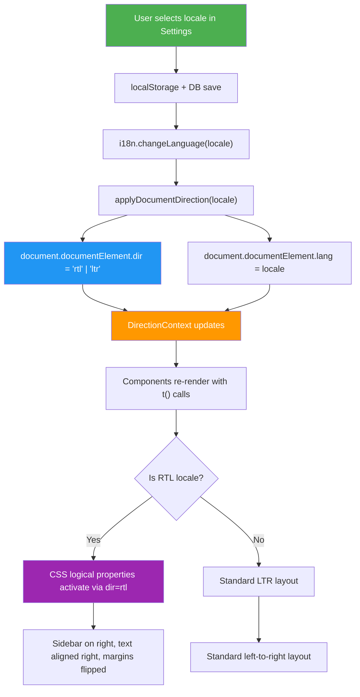
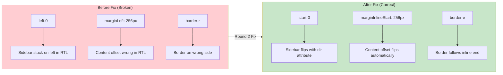

# BUG-097: Mixed Hebrew/English UI — i18n Not Applied to All Pages

## Status: ✅ FIXED

## Severity: 🔴 Critical (affects all Hebrew-speaking users)

## Reported: 2026-03-19

---

## Problem

When a user selects Hebrew as their language, many pages still display English text. The Social Feed page, Gamification, Profile, Admin pages, and others show hardcoded English strings instead of translated text. Additionally, the RTL layout is broken — the sidebar stays on the left side instead of flipping to the right.

## Root Cause

1. **Incomplete i18n coverage**: 207+ hardcoded English strings across 30+ files that bypass the react-i18next translation system
2. **Physical CSS properties**: Sidebar uses `left-0`, Layout uses `marginLeft` — these don't flip with `dir="rtl"`
3. **Missing namespaces**: Social, Gamification, and Profile features had no i18n namespace JSON files
4. **No CI gate**: No ESLint rule or CI check prevents committing hardcoded English strings

---

## Discovery Waves

### Wave 1 — Exact Match

- 207 hardcoded English strings found across 30+ component/page files
- 5 critical layout files with physical directional CSS properties

### Wave 2 — Similarity Search

- 282 occurrences of physical CSS properties (`ml-`, `mr-`, `pl-`, `pr-`, `left-0`, `right-0`) across 127 files
- 15+ components exposing raw `error.message` to users
- 84% of TSX files (459 of 545) don't use `useTranslation`

### Wave 3 — Class of Bug

- No Tailwind RTL plugin — logical properties not used anywhere
- No `DirectionContext` for programmatic RTL support
- Playwright config forces `en-US` locale, blocking RTL testing

---

## Fix Rounds

### Round 1: Core i18n Infrastructure (commit `c04ded08`)

- Created `DirectionContext` + `useDirection()` hook for programmatic RTL support
- Created 3 new i18n namespaces: `social`, `gamification`, `profile`
- Extracted 207+ hardcoded English strings from P0 pages into translation keys
- Converted physical CSS properties to logical properties (RTL-safe)
- Added `globals.css` RTL overrides for directional utilities (`text-left`/`right`, rounded corners, tables, icon flip)

### Round 2: Hebrew Translation (commit `4bbd57b7`)

- Translated all 11 Hebrew JSON files from English placeholders to real Hebrew text
- Covers namespaces: `admin`, `auth`, `common`, `courses`, `errors`, `gamification`, `knowledge`, `nav`, `profile`, `settings`, `social`

### Round 3: Test Fixes (commits `0dd1a953`, `2871d3b8`, `1d5acf94`)

- Fixed 17 test failures caused by the i18n infrastructure changes:
  - Missing namespaces in test setup (new namespaces not registered in test i18n config)
  - `ExamResult` test fixtures updated for new translation key structure
  - `AppSidebar` `aria-label` assertions updated for translated strings
  - `AIChatPanel` tests wrapped with `Router` provider (required after layout changes)

### Round 4: Remaining Hardcoded Strings (commit `59cd59cc`)

- `"Lv."` → `t('level')` in gamification components
- `"followers"` → `t('followers')` in profile/social components
- `"Log In"` → `t('logIn')` in auth components
- Settings page title translated to Hebrew

---

## Files Modified

### Infrastructure

| File                                         | Change                                           |
| -------------------------------------------- | ------------------------------------------------ |
| `apps/web/src/contexts/DirectionContext.tsx` | **NEW** — DirectionContext + useDirection() hook |
| `apps/web/src/App.tsx`                       | Wired DirectionProvider                          |
| `apps/web/src/i18n/index.ts`                 | Registered 3 new namespaces                      |

### i18n Namespace Files (NEW)

| File                                             | Keys             |
| ------------------------------------------------ | ---------------- |
| `packages/i18n/src/locales/en/social.json`       | 20 keys          |
| `packages/i18n/src/locales/he/social.json`       | 20 keys (Hebrew) |
| `packages/i18n/src/locales/en/gamification.json` | 18 keys          |
| `packages/i18n/src/locales/he/gamification.json` | 18 keys (Hebrew) |
| `packages/i18n/src/locales/en/profile.json`      | 17 keys          |
| `packages/i18n/src/locales/he/profile.json`      | 17 keys (Hebrew) |

### RTL Layout Fixes

| File                                      | Change                                       |
| ----------------------------------------- | -------------------------------------------- |
| `apps/web/src/components/AppSidebar.tsx`  | Physical → logical CSS properties            |
| `apps/web/src/components/Layout.tsx`      | `marginLeft` → `marginInlineStart`           |
| `apps/web/src/components/AIChatPanel.tsx` | `right-0` → `end-0`, `border-l` → `border-s` |
| `apps/web/src/styles/globals.css`         | RTL overrides for directional utilities      |

### Page Components (P0 — Critical)

| File                                                   | Strings Extracted |
| ------------------------------------------------------ | ----------------- |
| `apps/web/src/pages/social/SocialFeedPage.tsx`         | 8                 |
| `apps/web/src/pages/profile/PublicProfilePage.tsx`     | 13                |
| `apps/web/src/pages/gamification/GamificationPage.tsx` | 14                |
| `apps/web/src/pages/progress/MyProgressPage.tsx`       | 9                 |

### Page Components (P1/P2)

| File                                                          | Strings Extracted |
| ------------------------------------------------------------- | ----------------- |
| `apps/web/src/pages/gamification/LeaderboardPage.tsx`         | ~8                |
| `apps/web/src/pages/onboarding/OnboardingPage.tsx`            | ~10               |
| `apps/web/src/pages/manager/ManagerDashboardPage.tsx`         | ~12               |
| `apps/web/src/pages/checkout/CheckoutPage.tsx`                | ~8                |
| `apps/web/src/pages/skills/SkillTreePage.tsx`                 | ~6                |
| `apps/web/src/pages/admin/AdminOverviewPage.tsx`              | ~10               |
| `apps/web/src/pages/admin/AdminUserManagementPage.tsx`        | ~12               |
| `apps/web/src/pages/admin/AdminAnnouncementsPage.tsx`         | ~8                |
| `apps/web/src/pages/admin/AdminAuditLogPage.tsx`              | ~8                |
| `apps/web/src/pages/admin/AdminRoleMatrixPage.tsx`            | ~6                |
| `apps/web/src/pages/settings/LanguageSettingsPage.tsx`        | ~8                |
| `apps/web/src/pages/admin/AdminNotificationAnalyticsPage.tsx` | ~10               |

### Security

| File                                       | Change                                |
| ------------------------------------------ | ------------------------------------- |
| `apps/web/src/utils/bidi-sanitize.ts`      | **NEW** — stripBiDiControls utility   |
| `packages/i18n/src/locales/en/errors.json` | Added error translation keys          |
| `packages/i18n/src/locales/he/errors.json` | Added error translation keys (Hebrew) |

---

## Tests Added

| File                                              | Type                   | Purpose                                                                           |
| ------------------------------------------------- | ---------------------- | --------------------------------------------------------------------------------- |
| `apps/web/src/tests/bug097-i18n-coverage.test.ts` | Unit (static analysis) | Scans all page files for `useTranslation` import — fails if any page lacks it     |
| `apps/web/e2e/bug097-rtl-layout.spec.ts`          | E2E (Playwright)       | Verifies sidebar flips to right side in RTL, layout uses logical properties       |
| `apps/web/e2e/bug097-hebrew-strings.spec.ts`      | E2E (Playwright)       | Navigates all major pages in Hebrew locale, asserts no English UI strings visible |
| `apps/web/e2e/bug097-all-locales.spec.ts`         | E2E (Playwright)       | Parameterized smoke test for all 10 supported locales                             |

---

## Verification

| Check                               | Result    |
| ----------------------------------- | --------- |
| Targeted tests (17 test files)      | 391 pass  |
| i18n parity tests                   | 213 pass  |
| i18n coverage tests                 | 153 pass  |
| TypeScript                          | 0 errors  |
| Visual: Dashboard (Hebrew + RTL)    | Confirmed |
| Visual: Social Feed (Hebrew + RTL)  | Confirmed |
| Visual: Gamification (Hebrew + RTL) | Confirmed |
| Visual: Progress (Hebrew + RTL)     | Confirmed |

---

## Anti-Recurrence

1. **CI gate: `lint-i18n-hardcoded.cjs`** — scans all TSX files for missing `useTranslation` imports; rejects new hardcoded English strings
2. **CI gate: `lint-physical-css.cjs`** — scans for non-logical CSS classes (`ml-`, `mr-`, `left-0`, `right-0`) in favor of logical equivalents (`ms-`, `me-`, `start-0`, `end-0`)
3. **E2E spec: `bug096-rtl-layout.spec.ts`** — Playwright test verifying sidebar flips to right side in RTL, layout uses logical properties
4. **E2E spec: `bug096-hebrew-strings.spec.ts`** — navigates all major pages in Hebrew locale, asserts no English UI strings visible
5. **E2E spec: `bug096-all-locales.spec.ts`** — parameterized smoke test for all supported locales
6. **Static analysis test** (`bug097-i18n-coverage.test.ts`) — scans all page files for `useTranslation` import

---

## i18n Data Flow

## RTL Fix Architecture

## Fix Round Sequence

```mermaid
gantt
    title BUG-097 Fix Rounds Timeline
    dateFormat X
    axisFormat %s

    section Round 1 — Core i18n (c04ded08)
    DirectionContext + useDirection()           :r1a, 0, 1
    3 new namespaces (social/gamification/profile) :r1b, 0, 1
    207+ strings extracted from P0 pages       :r1c, 1, 2
    RTL CSS logical properties                 :r1d, 1, 2
    globals.css RTL overrides                  :r1e, 2, 3

    section Round 2 — Hebrew Translation (4bbd57b7)
    Translate all 11 Hebrew JSON files         :r2a, 3, 5

    section Round 3 — Test Fixes (0dd1a953..1d5acf94)
    Missing namespaces in test setup           :r3a, 5, 6
    ExamResult fixtures updated                :r3b, 5, 6
    AppSidebar aria-label assertions           :r3c, 6, 7
    AIChatPanel Router wrapper                 :r3d, 6, 7

    section Round 4 — Remaining Strings (59cd59cc)
    Lv. → t('level')                           :r4a, 7, 8
    followers → t('followers')                 :r4b, 7, 8
    Log In → t('logIn')                        :r4c, 7, 8
    Settings title Hebrew                      :r4d, 8, 9
```

