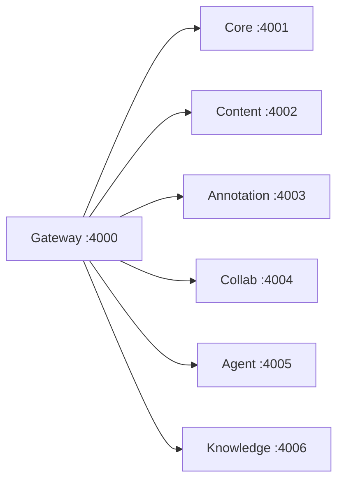
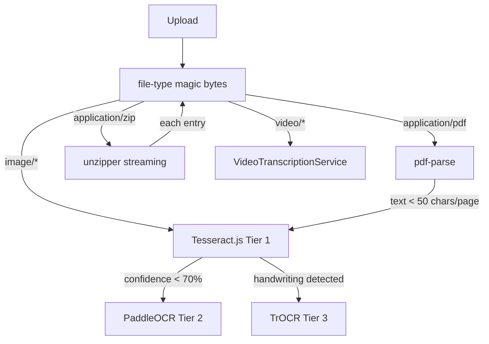
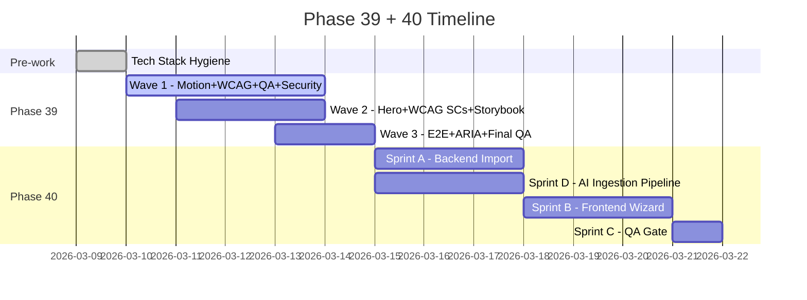

# Phase 39 + 40 — Motion Design, WCAG 2.2, QA Upgrade, Security Hardening v2 + Smart Content Import + Tech Stack Hygiene

**Status:** ✅ Complete — see OPEN_ISSUES.md

---

## Context

Phase 38 complete (3,881 tests ✅, commit a2ffe4f). Phase 39 addresses 5 strategic pillars + Phase 40 adds Smart Content Import + Tech Stack Hygiene:
1. **Motion Design** — Landing page has zero animation libs; CSS-only orbs. Competitors use Framer Motion + GSAP + Remotion. EU clients expect premium visual experience.
2. **WCAG 2.2 Compliance** — 9 new criteria not yet implemented. EAA enforced June 28, 2025 — fines up to €250K (France).
3. **QA Tooling Upgrade** — Argos CI, @axe-core/react, cross-browser, ARIA snapshots, Storybook.
4. **Security Hardening v2** — Semgrep SAST, CycloneDX SBOM, GraphQL fuzzing.
5. **Smart Content Import (Phase 40)** — YouTube playlist, website crawl, folder + ZIP upload, intelligent AI ingestion pipeline (OCR, handwriting, image captioning).
6. **Tech Stack Hygiene (Phase 39 pre-work)** — Full dependency audit revealed mixed TypeScript versions and Vercel AI SDK inconsistencies. Fix before Phase 39 begins.

---

---

# Tech Stack Audit — March 2026 Report (Infrastructure Division)

## 🟢 GREAT NEWS: EduSphere is at the Bleeding Edge

Full dependency audit (March 9, 2026) reveals EduSphere is **significantly ahead** of most production LMS platforms:

| Package | Installed | Latest | Status |
|---------|-----------|--------|--------|
| React | **19.2.4** | 19.2.4 | ✅ Latest |
| Vite | **7.1.2** | 7.3.1 | ✅ Current (minor behind) |
| Vitest | **4.0.18** | 4.x | ✅ Latest major |
| Tailwind CSS | **4.0.12** | 4.2.0 | ✅ v4 (minor behind) |
| React Router | **7.12.1** | 7.x | ✅ v7 (already migrated!) |
| Zod | **4.3.6** | 4.x | ✅ v4 (already on latest major!) |
| NestJS | **11.1.14** | 11.1.16 | ✅ 2 patches behind |
| Drizzle ORM | **0.45.1** | 0.45.1 | ✅ Latest stable (v1 still beta) |
| urql | **4.1.0** | 4.x | ✅ Current |
| TanStack Query | **5.x** | 5.x | ✅ Current |
| Playwright | **1.58.2** | 1.58.2 | ✅ Latest |
| pnpm | **10.30.1** | 10.30.3 | ✅ 2 patches behind |
| Turborepo | **2.7.2** | 2.x | ✅ Current |
| ESLint | **10.x** | 10.x | ✅ Latest major |
| GraphQL Yoga | **5.18.0** | 5.18.0 | ✅ Latest |
| Hive Gateway | **2.5.1** | 2.x | ✅ Current |
| TipTap | **3.20.0** | 3.x | ✅ v3 |
| Expo SDK | **54** | 55 | ⏳ SDK 55 available (Phase 41) |

**Verdict:** The frontend stack (React 19, Vite 7, Vitest 4, Zod 4, React Router 7) is at the absolute cutting edge. Most industry projects are still on React 18 + Vite 5. EduSphere is **ahead by 1-2 major versions**.

---

## 🔴 CRITICAL: Version Inconsistencies to Fix (Pre-Phase 39)

### Issue 1: TypeScript Mixed Versions — HIGH PRIORITY

| Workspace | Version | Status |
|-----------|---------|--------|
| `apps/web` (frontend) | `^5.9.3` | Stable |
| `apps/mobile` | `~5.9.3` | Stable |
| `apps/gateway` | `^6.0.3` | ⚠️ Pre-release RC |
| All 6 subgraphs | `^6.0.3` | ⚠️ Pre-release RC |
| `packages/db` | `^6.0.3` | ⚠️ Pre-release RC |

**Problem:** TS 6.0.x is a **pre-release/RC** (latest stable = 5.8.3 / 5.9.3). Backend packages are running pre-release TypeScript in production. Mixed versions cause type resolution failures when generated types flow backend → frontend.

**Fix:** Standardize ALL workspaces to **`^5.9.3`** via `pnpm overrides`:
```json
{ "pnpm": { "overrides": { "typescript": "^5.9.3" } } }
```

### Issue 2: Vercel AI SDK Mixed Versions — MEDIUM PRIORITY

| Workspace | `ai` version | `@ai-sdk/openai` |
|-----------|-------------|-----------------|
| `subgraph-content` | `^4.0.38` | `^1.0.0` |
| `subgraph-agent` | `^5.0.0` | `^3.0.30` |
| `transcription-worker` | `^5.0.0` | `^3.0.30` |

**Fix:** Upgrade `subgraph-content` → `ai: ^5.0.0` + `@ai-sdk/openai: ^3.0.30`

### Issue 3: AWS SDK Version Drift — LOW PRIORITY

| Workspace | `@aws-sdk/client-s3` |
|-----------|---------------------|
| `subgraph-core`, `transcription-worker` | `^3.600.0` |
| `subgraph-content` | `^3.729.0` |

**Fix:** Standardize to `^3.729.0` across all workspaces

### Issue 4: NestJS 11.1.14 → 11.1.16 (2 patches) — LOW PRIORITY
SWC fixes + JSON logger improvements. No breaking changes.

---

## ✅ Already Installed: Phase 40 Dependencies (Saves Sprint D effort)

| Package | Location | Phase 40 Use | Action |
|---------|----------|-------------|--------|
| `sharp` ^0.34.5 | `subgraph-content` | Image processing, HEIC | Upgrade to 0.35+ for HEIC |
| `file-type` ^21.3.0 | `subgraph-content` | Magic byte detection | ✅ Reuse as-is |
| `adm-zip` ^0.5.16 | `subgraph-content` | ZIP handling | Replace with `unzipper` (streaming) |
| `clamscan` ^2.4.0 | `subgraph-content` | Virus scan | ✅ Reuse as-is |
| `pdf-parse` ^2.4.5 | `subgraph-knowledge` | PDF text extraction | ✅ Reuse as-is |
| `mammoth` ^1.11.0 | `subgraph-knowledge` | DOCX parsing | ✅ Reuse as-is |
| `youtube-transcript` ^1.2.1 | `subgraph-knowledge` | YouTube captions | ✅ Already there! |
| `dataloader` ^2.2.3 | `subgraph-content` | N+1 prevention | ✅ Reuse pattern |

**Still to install:**
- `tesseract.js` v5.0.4 (add to `subgraph-knowledge`)
- `unzipper` v0.11.x (add to `subgraph-knowledge`)
- `pdfjs-dist` (scanned PDF fallback)
- `fflate` v0.8.x (browser ZIP preview, add to `apps/web`)
- Python microservices: PaddleOCR + TrOCR + LibreOffice (new Docker services)

---

## 🚀 Performance Optimization Roadmap (Infrastructure + Backend Division)

### P1 — Immediate Wins (Pre-Phase 39, zero risk)

**1. Vite Manual Chunks** → bundle -40 to -60%
Add to `apps/web/vite.config.ts`:
```typescript
build: { rollupOptions: { output: { manualChunks: {
  'vendor-react': ['react', 'react-dom'],
  'vendor-ui': ['@radix-ui/react-*', 'class-variance-authority', 'clsx'],
  'vendor-query': ['@tanstack/react-query', 'urql', '@urql/core'],
  'vendor-graph': ['graphql', 'graphql-tag', 'graphql-ws'],
  'vendor-forms': ['react-hook-form', 'zod', '@hookform/resolvers'],
  'vendor-editor': ['@tiptap/core', '@tiptap/react'],
  'vendor-charts': ['recharts', 'three'],
}}}}
```
Target: Main bundle < 150KB gzip (currently unaudited — may be 400-600KB)

**2. JWKS Caching in Gateway** → auth latency -99%
Every request does a Keycloak JWKS HTTP fetch (~50ms).
Add 10-minute in-memory cache in `apps/gateway/src/auth/jwks-cache.service.ts`.
Pattern: `Map<url, { keys; expiresAt: Date.now() + 600_000 }>`.

**3. TanStack Query hover-prefetch** → perceived latency ×2
```typescript
onMouseEnter={() => queryClient.prefetchQuery({ queryKey: ['course', id], staleTime: 300_000 })}
```
Add to: `MarketplacePage`, `CoursesPage`, `CertificatesPage` card hover.

**4. Web Vitals Monitoring** → measure before optimizing
Add to `apps/web/src/main.tsx` (package already installed):
```typescript
import { onLCP, onINP, onCLS } from 'web-vitals';
onLCP(m => pinoLogger.info({ metric: 'LCP', value: m.value }));
onINP(m => pinoLogger.info({ metric: 'INP', value: m.value }));
```
**Target 2026:** LCP < 2.5s | INP < 200ms (43% of sites fail this) | CLS < 0.1

### P2 — Phase 39 Actions (concurrent with sprints)

**5. PgBouncer Connection Pooling** → enables 100k concurrent users
Add to `docker-compose.yml`:
```yaml
pgbouncer:
  image: pgbouncer/pgbouncer:1.21
  environment:
    POOL_MODE: transaction    # Transaction-level pooling
    MAX_CLIENT_CONN: "10000"
    DEFAULT_POOL_SIZE: "25"
```
Without PgBouncer: PostgreSQL maxes out at ~200 connections → crashes under load.

**6. pgvector HNSW Index Tuning** → semantic search -28x latency
```sql
-- Check current index type:
SELECT indexname, indexdef FROM pg_indexes WHERE tablename = 'concepts';
-- If IVFFlat → migrate to HNSW:
CREATE INDEX CONCURRENTLY idx_hnsw ON concepts USING hnsw (embedding vector_cosine_ops)
WITH (m = 24, ef_construction = 200);
```

**7. React Compiler (Auto-Memoization)** → re-renders -12% globally
React Compiler 1.0 (production-ready Nov 2025) eliminates ~90% of manual `useMemo`/`useCallback`.
Enable in `vite.config.ts`: `babel: { plugins: ['babel-plugin-react-compiler'] }`.

**8. Turborepo Remote Caching** → CI/CD -50% time
```bash
turbo login   # Connect to Vercel Remote Cache
turbo link    # Link project
# CI: tasks cached, only changed packages rebuild
```

### P3 — Phase 40 Actions

**9. DataLoader Audit** — N+1 prevention in Federation
- Verify all `@FieldResolver` methods use `DataLoader.load()` (pattern from Phase 29)
- Check Pino logs for repeated identical SQL queries (N+1 symptom)

**10. NATS Backpressure**
- All consumers: `fetch({ batch: 100, expires: 30_000 })` (not infinite pull)
- Error handling: `msg.nak(5000)` — 5s retry delay, not immediate storm

**11. GraphQL @cacheControl on hot paths**
```graphql
type CourseListing @cacheControl(maxAge: 300) {
  title: String! @cacheControl(maxAge: 3600)
  enrollmentCount: Int! @cacheControl(maxAge: 60)
}
```

---

## Tech Stack Hygiene Sprint (Pre-Phase 39, 1 day, 2 parallel agents)

**Agent-H1: Dependency Alignment**
1. `pnpm overrides`: TypeScript → `^5.9.3` everywhere
2. `subgraph-content`: `ai` → `^5.0.0`, `@ai-sdk/openai` → `^3.0.30`
3. `@aws-sdk/client-s3` → `^3.729.0` everywhere
4. NestJS → `11.1.16`, pnpm → `10.30.3`, Tailwind → `4.2.0`
5. Run: `pnpm install` → `pnpm turbo typecheck` → `pnpm turbo test`

**Agent-H2: Performance Quick Wins**
1. Vite `manualChunks` in `apps/web/vite.config.ts`
2. `reportWebVitals()` in `apps/web/src/main.tsx`
3. JWKS cache in `apps/gateway/src/auth/`
4. Hover `prefetchQuery` on `MarketplacePage` + `CoursesPage`
5. Measure baseline: `pnpm turbo build` → `vite-bundle-analyzer`

---

## Deferred Upgrades (Post-Phase 40)

| Package | Current | Target | When | Why Defer |
|---------|---------|--------|------|-----------|
| Expo SDK | 54 | 55 | Phase 41 | Drops Legacy Architecture |
| React Native | 0.76 | 0.83 | Phase 41 | With SDK 55 |
| Drizzle ORM | 0.45.1 | 1.0 | Q2 2026 | Still beta |
| PostgreSQL | 16 | 17 | Phase 42 | Needs pgvector + AGE rebuild |
| Vite | 7.1.2 | 7.3.1 | Any time | Minor patch, safe |

---

## Division Reports Summary

### 🧠 PRD — Market Research Findings (Tavily, March 2026)

**EdTech Market:**
- $182–200B in 2026, growing at 13–17% CAGR → $348B by 2030
- AI now a **baseline expectation** — users compare to ChatGPT daily
- Canvas: 36.7% LMS market share | Coursera: 117M learners | 360Learning: fastest enterprise growth
- Key 2026 demand: measurable outcomes, skills-gap analysis, xAPI/LRS, microlearning

**Competitive gaps for Phase 39+:**
| Gap | Priority | Phase |
|-----|----------|-------|
| Immersive landing page (video + motion + Remotion) | **Critical** | **39** |
| WCAG 2.2 full compliance (EAA law) | **Critical** | **39** |
| YouTube playlist bulk import | **Critical** | **40** |
| Website crawl + lesson auto-discovery | **Critical** | **40** |
| Folder upload + smart metadata | High | **40** |
| Skills-based learning paths | High | 41 |
| xAPI / LRS integration | High | 41 |
| White-label per tenant | Medium | 42 |

**Content Import Competitive Analysis (Phase 40 research):**
| Platform | YouTube Import | Website Crawl | Bulk Folder | Transcript Gen | Verdict |
|----------|---|---|---|---|---|
| Teachable | Manual only | ❌ | Drive/Dropbox | Basic | Gap |
| Thinkific | Manual only | ❌ | Drive/Dropbox | Basic | Gap |
| Canvas LMS | Manual + plugin | ❌ | ✅ | Basic | Gap |
| Kajabi | Manual only | ❌ | Drive/Dropbox | None | Gap |
| **EduSphere Phase 40** | ✅ YouTube API v3 | ✅ Firecrawl | ✅ webkitdirectory | ✅ Whisper+LLM | **Unique** |

→ **No competitor** supports intelligent playlist import + web crawl + unified preview. Estimated TAM for LMS content migration consulting: $50M+.

---

### 🎨 UX/Design — Motion Design Strategy

**Stack decision (Tavily + deep Remotion research, March 2026):**

| Library | Role | Bundle | When to Use |
|---------|------|--------|-------------|
| **Framer Motion v11** | UI transitions, hover, gestures, carousels | ~37KB gzip | React component animations |
| **GSAP + ScrollTrigger** | Hero timeline, scroll-reactive sequences | ~23KB gzip | Cinematic scroll animations |
| **Lenis** | Smooth scroll (no jank) | ~4KB gzip | Global scroll wrapper |
| **Remotion v4** | Pre-render hero background MP4 | 0KB at runtime (offline tool) | Generate video asset offline |
| **@remotion/player** | Embed interactive data viz in-browser | ~50KB gzip | Stats/progress animations |

**Remotion Architecture Decision (critical):**
Remotion is a React framework for **programmatic video generation** — NOT a live browser animation library. Correct usage for EduSphere:

- **Pattern A (recommended):** Use Remotion CLI to **pre-render hero background video** as `hero-bg.mp4` (H.264, looping, ~3MB). Embed with standard `<video autoPlay muted loop playsInline>` — zero CPU at runtime.
- **Pattern B (optional, Phase 40+):** Use `@remotion/player` to render **data-driven visualizations** inline (e.g., animated course stats that update from API). CPU cost: moderate.
- **NOT for:** scroll-reactive effects, hover interactions, page transitions → use GSAP + Framer Motion for those.

**Hero background video spec (Remotion):**
```
Composition: HeroBackground
Duration: 10 seconds @ 30fps = 300 frames
Resolution: 1920×1080
Content: Flowing gradient mesh + floating orbs + particle field
Codec: H.264 (MP4) — max 3MB file size
Generated via: npx remotion render HeroBackground public/hero-bg.mp4
```

**Sections to animate:**
1. **Hero** — GSAP staggered text entrance + Remotion-pre-rendered `hero-bg.mp4` looping in background
2. **Stats Bar** — `@remotion/player` counter animation 0→500K with spring physics (data-driven)
3. **Feature Cards** — `motion.div whileInView` stagger with `staggerChildren: 0.1`
4. **NEW Video Section** — `<video autoPlay muted loop playsInline>` + IntersectionObserver lazy load (product demo clip, also Remotion-generated)
5. **How It Works** — GSAP ScrollTrigger numbered circles sequence
6. **Testimonials** — `AnimatePresence` auto-carousel (4s interval, pause on hover)
7. **CTA Banner** — gradient shimmer sweep animation (CSS keyframes, no JS needed)

**Performance rules:**
- Remotion video: `preload="none"` + poster image (WebP, <20KB) + lazy IntersectionObserver
- All live animations: `useReducedMotion()` guard (WCAG 2.3.3)
- Bundle budget: ≤ 500KB increase at runtime (Remotion itself is a build tool, not shipped to browser)
- `@remotion/player`: lazy-import only when hero stats section enters viewport

---

### ♿ Accessibility — WCAG 2.2 Gap Analysis

**Legal deadlines:**
- EAA enforced **June 28, 2025** — already in effect. Fines: €100K (Germany), €250K (France)
- US ADA Title II: WCAG 2.1 AA by April 24, 2026
- ISO/IEC 40500:2025 = WCAG 2.2 is now an ISO standard

**9 New WCAG 2.2 Criteria to implement:**
| SC | Name | Level | Gap |
|----|------|-------|-----|
| 2.4.11 | Focus Not Obscured (Minimum) | AA | Sticky header may obscure focus |
| 2.4.13 | Focus Appearance | AA | Focus ring ≥2px, 3:1 contrast |
| 2.5.3 | Target Size (Minimum) | AA | Interactive targets ≥24×24px |
| 2.5.7 | Dragging Movements | AA | Verify no drag-only UI |
| 2.5.8 | Pointer Target Spacing | AA | Adjacent targets spaced |
| 3.2.6 | Consistent Help | AA | Help link same position across pages |
| 3.3.7 | Redundant Entry | A | Form re-entering data check |
| 3.3.8 | Accessible Authentication | AA | Login captcha needs alt method |

**Critical current gap:** `color-contrast` rule **disabled** in axe — must re-enable + fix all violations

---

### 🧪 QA Division — Tooling Upgrade

**Tool selections:**
| Tool | Reason | Cost |
|------|--------|------|
| **Argos CI** | MIT, Playwright plugin, 5K screenshots/month free, PR diff comments | Free OSS |
| **@axe-core/react** | Unit-level a11y in Vitest (component-level, not just E2E) | Free |
| **Playwright ARIA snapshots** | `toMatchAriaSnapshot()` built into Playwright v1.47+ | 0 install |
| **Firefox + WebKit** | Cross-browser E2E (required for WCAG compliance testing) | 0 install |
| **Storybook 8** | Component docs + Argos visual stories | Free |

---

### 🔒 Security Division — Hardening v2

**Tool selections:**
| Tool | Reason | Cost |
|------|--------|------|
| **Semgrep Community** | Custom EduSphere rules; 10K+ GitHub stars; CI-native; free tier | Free |
| **CycloneDX** (`@cyclonedx/bom`) | SBOM generation — SLSA/SOC2/ISO 27001 requirement | Free |
| **ZAP extended** | GraphQL mutation fuzzing (beyond baseline scan) | Free |

**5 Custom Semgrep rules to write:**
1. `edusphere-rls-bypass` — `db.select()` outside `withTenantContext()`
2. `edusphere-console-log` — `console.log` in production src
3. `edusphere-raw-sql` — raw SQL outside AGE helpers
4. `edusphere-missing-auth` — resolvers without `@authenticated`
5. `edusphere-pii-plaintext` — PII column writes without `encryptField()`

---

## Implementation — 4 Parallel Sprints

### Sprint A — Motion Design (4 days)

**Agent-A1: Deps + Config + Remotion Video Generation**
- `pnpm --filter @edusphere/web add framer-motion gsap @gsap/react lenis @remotion/player`
- `pnpm add -D remotion @remotion/cli` (dev-only — build tool, not shipped)
- Create `apps/web/src/remotion/HeroBackground.tsx` — Remotion composition (gradient mesh + orbs + particles)
- Run: `npx remotion render HeroBackground apps/web/public/hero-bg.mp4` → generates 3-second loop (~2MB H.264)
- Run: `npx remotion render ProductDemo apps/web/public/product-demo.mp4` → 15s product walkthrough
- Vite config: add `public/` exclusion from bundle analysis (MP4 served as static)
- `ReducedMotionProvider` wrapper in `main.tsx`
- **Remotion React 19 note:** requires `remotion@^4.0.0` + `@remotion/player@^4.0.0` (confirmed compatible)

**Agent-A2: Hero + Video Section**
- `apps/web/src/pages/LandingPage.tsx`:
  - Hero section: `<video src="/hero-bg.mp4" autoPlay muted loop playsInline />` (Remotion pre-rendered)
  - GSAP staggered text entrance on hero h1/h2 (scroll-reactive)
  - `@remotion/player` for animated stats (lazy-loaded via IntersectionObserver)
- NEW `apps/web/src/components/landing/VideoSection.tsx` — product demo `<video>` + overlaid text
- Lenis smooth scroll init in `apps/web/src/main.tsx`

**Agent-A3: Cards + Stats + Testimonials**
- Feature cards: `motion.div whileInView` stagger with `staggerChildren: 0.1`
- Stats: `@remotion/player` composing `StatsCounter` composition (frames 0→300, spring physics)
- Testimonials: `AnimatePresence` auto-carousel (4s interval, pause on hover)
- CTA Banner: CSS `@keyframes` shimmer sweep (no JS — pure CSS, no bundle impact)

**Agent-A4: E2E + Visual Baselines**
- Update `apps/web/e2e/landing-page.spec.ts`
- `animations: 'disabled'` + `--reduce-motion` flag for screenshot baselines (disable Remotion player autoplay in test env)
- `prefers-reduced-motion` E2E test: verify `hero-bg.mp4` paused, Framer Motion transitions skipped
- Performance test: verify `hero-bg.mp4` is NOT blocking LCP (must have `loading="lazy"` + poster)

---

### Sprint B — WCAG 2.2 (3 days)

**Agent-B1: Color Contrast Audit + Fix**
- Remove `disableRules(['color-contrast'])` from `accessibility.spec.ts`
- Fix all violations across 7 pages
- Update dark mode tokens if needed

**Agent-B2: 9 New WCAG 2.2 Criteria**
- Focus Not Obscured: audit sticky Layout header
- Target Size: audit all icon buttons (sidebar, card actions)
- Consistent Help: add persistent `?` help link in Layout
- Accessible Auth: add "Use passkey / email magic link" to LoginPage

**Agent-B3: Multi-Browser + Unit A11y**
- Uncomment Firefox + WebKit + Mobile in `apps/web/playwright.config.ts`
- Add `@axe-core/react` to `apps/web/vitest.config.ts` setup
- Fix any browser-specific failures

**Agent-B4: ARIA Snapshots + Statement Update**
- `expect(locator).toMatchAriaSnapshot()` for: AppSidebar, CoursesPage, DashboardPage, MarketplacePage, CertificatesPage
- Update `apps/web/src/pages/AccessibilityStatementPage.tsx` → WCAG 2.2 AA

---

### Sprint C — QA Tooling (2 days, PARALLEL with B)

**Agent-C1: Argos CI**
- `pnpm --filter @edusphere/web add -D @argos-ci/playwright`
- Add `argosScreenshot` to 20 key E2E tests
- Create `.github/workflows/visual-regression.yml`

**Agent-C2: Storybook 8**
- `pnpm --filter @edusphere/web add -D @storybook/react-vite storybook`
- Stories: CertificateCard, QuizQuestion, MarketplacePage listings, AppSidebar
- Integrate with Argos

---

### Sprint D — Security Hardening (2 days, PARALLEL with B+C)

**Agent-D1: Semgrep CI**
- Create `.github/workflows/semgrep.yml`
- Add Community ruleset + custom rules
- Validate: 0 violations on existing codebase

**Agent-D2: Custom Rules + SBOM**
- Create `semgrep/rules/edusphere-rls.yml` + `edusphere-security.yml`
- Create `scripts/generate-sbom.sh`
- Update `.github/workflows/docker-build.yml` → SBOM artifact

---

## Critical File Paths

### Sprint A
- `apps/web/src/pages/LandingPage.tsx` — main animation work
- `apps/web/src/main.tsx` — Lenis init
- `apps/web/src/remotion/HeroBackground.tsx` — NEW (Remotion composition for video pre-render)
- `apps/web/src/remotion/ProductDemo.tsx` — NEW (Remotion product walkthrough)
- `apps/web/src/remotion/StatsCounter.tsx` — NEW (Remotion @remotion/player composition)
- `apps/web/public/hero-bg.mp4` — GENERATED by `npx remotion render`
- `apps/web/public/product-demo.mp4` — GENERATED by `npx remotion render`
- `apps/web/src/components/landing/VideoSection.tsx` — NEW
- `apps/web/e2e/landing-page.spec.ts` — updated baselines

### Sprint B
- `apps/web/e2e/accessibility.spec.ts` — remove color-contrast disable
- `apps/web/playwright.config.ts` — enable Firefox + WebKit
- `apps/web/vitest.config.ts` — add @axe-core/react
- `apps/web/src/components/Layout.tsx` — help link + focus audit
- `apps/web/src/pages/LoginPage.tsx` — accessible auth
- `apps/web/src/pages/AccessibilityStatementPage.tsx`

### Sprint C
- `.github/workflows/visual-regression.yml` — NEW
- `apps/web/.storybook/main.ts` — NEW
- `apps/web/src/stories/*.stories.tsx` — 4 NEW files

### Sprint D
- `.github/workflows/semgrep.yml` — NEW
- `semgrep/rules/edusphere-rls.yml` — NEW
- `semgrep/rules/edusphere-security.yml` — NEW
- `scripts/generate-sbom.sh` — NEW

---

## Execution Timeline

```
Day 1 (All parallel):
  A1 (install libs + Remotion render hero-bg.mp4) + B1 (color contrast) + C1 (Argos) + D1 (Semgrep CI)
  → Remotion pre-render is offline (npx remotion render) — generates hero-bg.mp4 in public/

Day 2–3 (All parallel):
  A2 (Hero+Video+Remotion player embed) + A3 (Cards+Stats+Testimonials) + B2 (WCAG SC) + B3 (browsers) + D2 (rules)

Day 3–4 (All parallel):
  A4 (E2E landing + reduced-motion + LCP test) + B4 (ARIA snapshots) + C2 (Storybook)

Day 4 (Quality Gate):
  pnpm turbo test + typecheck + lint
  Playwright: Chromium + Firefox + WebKit
  axe: 0 WCAG 2.2 AA violations
  Semgrep: 0 custom rule violations
  Argos: baselines established
  Lighthouse: LCP ≤ 2.5s with hero-bg.mp4 lazy-loaded (not blocking LCP)
```

---

## Verification

- [ ] `pnpm turbo build` — runtime bundle size increase ≤ 500KB (Remotion is dev-only; framer-motion ~37KB, GSAP ~23KB, @remotion/player lazy-loaded)
- [ ] `public/hero-bg.mp4` exists and is ≤ 3MB (generated by `npx remotion render HeroBackground`)
- [ ] `public/product-demo.mp4` exists and is ≤ 10MB (product walkthrough)
- [ ] Lighthouse Performance: LCP ≤ 2.5s, CLS ≤ 0.1 (hero video must NOT block LCP — `preload="none"` + poster)
- [ ] Lighthouse Accessibility: ≥ 95 (up from ~88 with color-contrast disabled)
- [ ] axe: **0** WCAG 2.2 AA violations on 7 core pages (color-contrast re-enabled)
- [ ] E2E: pass on **Chromium + Firefox + WebKit + Mobile** (no browser-specific failures)
- [ ] `prefers-reduced-motion` E2E: hero-bg.mp4 paused, all Framer Motion transitions disabled
- [ ] Semgrep: 0 custom rule violations on existing codebase
- [ ] SBOM: `sbom.json` (CycloneDX) generated as CI artifact
- [ ] Argos: 20 page baselines established, CI visual diff active
- [ ] All 5 test users authenticate post-deploy

---

## Expected Test Delta

| Package | Before | After | Delta |
|---------|--------|-------|-------|
| Web unit | 3,881 | ~3,960+ | +79 (a11y, animation, WCAG) |
| E2E specs | 97 | ~108+ | +11 (WCAG 2.2, Argos, video) |
| Security | 967 | ~990+ | +23 (Semgrep rule tests) |
| Browsers | 1 | 3 | ×3 E2E matrix (Firefox + WebKit) |

**Goal:** Close all real gaps surfaced by Phase 38 exploration: add certificate presigned-URL download, fix CourseListing JOIN/filter gap, build CertificatesPage + QuizBuilderPage, update MarketplacePage to show real course data, and add mobile SRS + Certificate screens.

**Architecture:** 3 sprints. Sprint A: 4 parallel agents (backend fixes). Sprint B: 5+ parallel agents (frontend pages). Sprint C: QA gate.

**Tech Stack:** NestJS + Drizzle ORM + @aws-sdk/s3-request-presigner | urql (web) | Apollo Client (mobile) | shadcn/ui + Tailwind | Expo SDK 54 | TypeScript strict

---

## Context

Phase 37 is complete at commit `f350ca5`. Exploration of the Phase 38 scope (Assessment / Certificates / Marketplace / Quiz / SRS) revealed that most backend services are already fully implemented. The gaps are:

- **Certificate presigned URL**: `pdfUrl` stored as raw MinIO object key; no download URL generation; no `CertificatesPage` in web
- **CourseListing resolver mismatch**: supergraph defines `title/instructorName/description/rating/tags` but `marketplace.service.ts::getListings()` does `SELECT * FROM course_listings` returning only DB columns — no JOIN to `courses` or `users` tables
- **Marketplace filters not wired**: `CourseListingFiltersInput` defined in SDL but `marketplace.service.ts` ignores all filter args
- **MarketplacePage renders raw UUIDs**: without title/instructorName fields from backend, the page falls back to `Course ${id.slice(0,8)}...` pattern
- **CertificatesPage**: does not exist at all in `apps/web/src/pages/`
- **QuizBuilderPage**: does not exist — instructor cannot create quizzes via the frontend
- **InstructorEarningsPage `enabled: false`**: live query disabled via placeholder guard — needs to be activated
- **Mobile SRS + Certificate screens**: mobile has no SRS Review or Certificates screen
- **Already done** (no work needed): SRS ReviewPage (`/srs-review`) and InstructorEarningsPage (`/instructor/earnings`) are FULLY implemented in web frontend — only minor fixes needed

---

## Open Items Inventory

| # | Severity | Item | Sprint |
|---|----------|------|--------|
| P38-1 | 🔴 | Certificate presigned URL: `certificate.service.ts` + SDL + `CertificatesPage` | A+B |
| P38-2 | 🔴 | CourseListing JOIN: courses + users table JOIN in `marketplace.service.ts` | A |
| P38-3 | 🔴 | MarketplacePage: show real title/instructorName + filter UI | B |
| P38-4 | 🟡 | Marketplace filters: WHERE clauses in `marketplace.service.ts` | A |
| P38-5 | 🟡 | QuizBuilderPage: instructor quiz creation UI | B |
| P38-6 | 🟡 | InstructorEarningsPage: remove `enabled: false`, use mounted guard | B |
| P38-7 | 🟡 | Mobile SrsReviewScreen + CertificatesScreen | B |
| P38-8 | ⚪ | Supergraph: add `certificateDownloadUrl` query | A+B |
| P38-9 | ⚪ | AppSidebar: add Certificates + SRS Review nav items | B |
| P38-10 | ⚪ | API_CONTRACTS Section 25 + OPEN_ISSUES.md + README sync | C |

---

## Dependency Graph

```
Sprint A — T+0 (4 agents, parallel)
├── Agent-A1 [Backend]: Certificate presigned URL (service + SDL + supergraph query)
├── Agent-A2 [Backend]: CourseListing JOIN + filter WHERE clauses
├── Agent-A3 [Frontend-fix]: InstructorEarningsPage enabled + AppSidebar nav items
└── Agent-A4 [Docs]: API_CONTRACTS Section 25 skeleton + OPEN_ISSUES P38 entries

Sprint B — T+5 (5 agents, after Sprint A, parallel)
├── Agent-B1 [Frontend]: CertificatesPage.tsx (depends on A1)
├── Agent-B2 [Frontend]: QuizBuilderPage.tsx
├── Agent-B3 [Frontend]: MarketplacePage: real fields + filter UI (depends on A2)
├── Agent-B4 [Mobile]: SrsReviewScreen + CertificatesScreen (mobile only)
└── Agent-B5 [DevOps]: Supergraph compose verify + local SDL consistency check

Sprint C — Sequential QA gate
└── Agent-C: E2E specs + security tests + OPEN_ISSUES final sync
```

---

## Sprint A — Backend Fixes (4 Parallel Agents)

### Agent-A1: Certificate Presigned URL Backend

**Pattern to follow:** `apps/subgraph-content/src/analytics/tenant-analytics-export.service.ts`
(uses `@aws-sdk/s3-request-presigner` + `getSignedUrl` + `GetObjectCommand`, PRESIGNED_URL_EXPIRY = 900s)

**File: `apps/subgraph-content/src/certificate/certificate.service.ts`**
- Add private `s3: S3Client` field
- Initialize in constructor (after existing injections):
  ```typescript
  import { S3Client, GetObjectCommand } from '@aws-sdk/client-s3';
  import { getSignedUrl } from '@aws-sdk/s3-request-presigner';
  // In constructor:
  const scheme = minioConfig.useSSL ? 'https' : 'http';
  this.s3 = new S3Client({
    endpoint: `${scheme}://${minioConfig.endpoint}:${minioConfig.port}`,
    region: minioConfig.region,
    credentials: { accessKeyId: minioConfig.accessKey, secretAccessKey: minioConfig.secretKey },
    forcePathStyle: true,
    requestChecksumCalculation: 'WHEN_REQUIRED',
    responseChecksumValidation: 'WHEN_REQUIRED',
  });
  ```
- Add method `getCertificateDownloadUrl(certId: string, userId: string, tenantId: string): Promise<string>`
  - `withTenantContext(db, { tenantId, userId, userRole: 'STUDENT' }, fn)` — SELECT cert WHERE id=certId AND user_id=userId (security: user can only download their own cert)
  - If not found: throw `NotFoundException`
  - If `cert.pdfUrl` is null: throw `BadRequestException('PDF not yet generated')`
  - Return `getSignedUrl(this.s3, new GetObjectCommand({ Bucket: minioConfig.bucket, Key: cert.pdfUrl }), { expiresIn: 900 })`
- **Memory safety note:** If adding S3Client + method pushes file past 200 lines, extract into `certificate-download.service.ts` + add to `CertificateModule`'s providers and exports.
- Add to `onModuleDestroy()`: `this.s3.destroy()` (S3Client has a `.destroy()` method)

**File: `apps/subgraph-content/src/certificate/certificate.graphql`**
- Add to `extend type Query`:
  ```graphql
  certificateDownloadUrl(certId: ID!): String! @authenticated
  ```

**File: `apps/subgraph-content/src/certificate/certificate.resolver.ts`**
- Add `@Query('certificateDownloadUrl')` method calling `certificateService.getCertificateDownloadUrl(certId, ctx.userId, ctx.tenantId)`

**File: `apps/gateway/supergraph.graphql`**
- Add to Query type: `certificateDownloadUrl(certId: ID!): String! @join__field(graph: CONTENT) @authenticated`

**Tests:**
- `certificate.service.spec.ts`: add 3 tests: returns presigned URL; throws NotFoundException for wrong user; throws BadRequestException when pdfUrl is null
- `certificate.resolver.spec.ts`: add test: delegates to service with JWT userId (not arg userId)

---

### Agent-A2: CourseListing JOIN + Filters

**File: `apps/subgraph-content/src/marketplace/marketplace.service.ts`**

Rewrite `getListings(tenantId, filters?)` method using Drizzle JOINs:
```typescript
// JOIN chain:
tx.select({
  id: schema.courseListings.id,
  courseId: schema.courseListings.courseId,
  priceCents: schema.courseListings.priceCents,
  currency: schema.courseListings.currency,
  isPublished: schema.courseListings.isPublished,
  revenueSplitPercent: schema.courseListings.revenueSplitPercent,
  title: schema.courses.title,
  description: schema.courses.description,
  thumbnailUrl: schema.courses.thumbnailUrl,
  instructorName: sql<string>`COALESCE(${schema.users.firstName} || ' ' || ${schema.users.lastName}, ${schema.users.username})`,
  enrollmentCount: sql<number>`(SELECT COUNT(*) FROM purchases p WHERE p.course_id = ${schema.courses.id} AND p.status = 'COMPLETE')`,
})
.from(schema.courseListings)
.innerJoin(schema.courses, eq(schema.courseListings.courseId, schema.courses.id))
.innerJoin(schema.users, eq(schema.courses.instructorId, schema.users.id))
.where(
  and(
    eq(schema.courseListings.tenantId, tenantId),
    eq(schema.courseListings.isPublished, true),
    // conditional filters:
    filters?.search ? ilike(schema.courses.title, `%${filters.search}%`) : undefined,
    filters?.priceMax !== undefined ? lte(schema.courseListings.priceCents, Math.round(filters.priceMax * 100)) : undefined,
    filters?.instructorName ? ilike(sql<string>`COALESCE(...)`, `%${filters.instructorName}%`) : undefined,
  )
)
```

- Return `tags: []` for now (no course_tags table; document in OPEN_ISSUES.md)
- Return `rating: null`, `totalLessons: 0` for now
- Signature: `getListings(tenantId: string, limit?: number, offset?: number, filters?: CourseListingFiltersInput): Promise<CourseListingMapped[]>`

**File: `apps/subgraph-content/src/marketplace/marketplace.graphql`**
- Update `CourseListing` type to include all new fields (title, description, instructorName, thumbnailUrl, price, currency, tags, enrollmentCount, rating, totalLessons)
- Add `CourseListingFiltersInput` input type
- Update `courseListings` query signature: `courseListings(tenantId: ID, limit: Int, offset: Int, filters: CourseListingFiltersInput): [CourseListing!]!`

**File: `apps/subgraph-content/src/marketplace/marketplace.resolver.ts`**
- Update `getCourseListings` to accept `@Args('filters') filters?: CourseListingFiltersInput` and pass to service
- Note: `tenantId` arg must be ignored in favor of JWT tenantId (SI-9)

**Tests:**
- `marketplace.service.spec.ts`: add tests: returns title from courses JOIN; search filter applied; priceMax filter applied; empty filters returns all

---

### Agent-A3: InstructorEarnings Fix + AppSidebar Nav

**File: `apps/web/src/pages/InstructorEarningsPage.tsx`**
- Find `enabled: false` placeholder guard
- Replace with mounted guard:
  ```typescript
  const [mounted, setMounted] = useState(false);
  useEffect(() => { setMounted(true); }, []);
  // In query options: enabled: mounted
  ```

**File: `apps/web/src/components/AppSidebar.tsx`**
- Add nav items (follow existing pattern of conditional role-gated items):
  - Certificates: `{ to: '/certificates', icon: Award, labelKey: 'nav.certificates' }` — all authenticated users
  - SRS Review: `{ to: '/srs-review', icon: Brain, labelKey: 'nav.srsReview' }` — all authenticated users
  - Quiz Builder: `{ to: '/quiz-builder', icon: FileQuestion, labelKey: 'nav.quizBuilder' }` — INSTRUCTOR/ORG_ADMIN/SUPER_ADMIN only

**File: `apps/web/src/locales/en/nav.json` (and other 7 locales)**
- Add keys: `certificates`, `srsReview`, `quizBuilder`
- For non-English locales use English as fallback if translation not available (mark as `[TODO]`)

---

### Agent-A4: Documentation Skeleton

**File: `OPEN_ISSUES.md`**
- Add Phase 38 tracking entry with P38-1 through P38-10 in 🟡 In Progress status

**File: `API_CONTRACTS_GRAPHQL_FEDERATION.md`**
- Add Section 25 at end of file:
  ```markdown
  ## Section 25 — Phase 37+38: Gamification, Manager Dashboard, Onboarding, Certificates (March 2026)

  ### New Query: certificateDownloadUrl(certId: ID!): String!
  Returns a 15-minute presigned MinIO URL for secure PDF download.
  Auth: @authenticated — user can only download their own certificates (server-side userId validation).

  ### Updated Type: CourseListing
  Added fields: title, description, instructorName, thumbnailUrl, price (Float), currency,
  tags ([String!]!), enrollmentCount (Int!), rating (Float), totalLessons (Int!)

  ### New Input: CourseListingFiltersInput
  Fields: tags ([String!]), priceMax (Float), instructorName (String), search (String)
  Applied as server-side WHERE clauses in marketplace resolver.

  ### Phase 37 types (Gamification)
  GamificationStats, UserChallenge, LeaderboardEntry: see gamification.graphql in subgraph-core
  TeamOverview, TeamMemberProgress: see manager.graphql in subgraph-core
  OnboardingState, UpdateOnboardingStepInput: see onboarding.graphql in subgraph-core
  ```

---

## Sprint B — Frontend Pages (5 Parallel Agents)

### Agent-B1: CertificatesPage

**New file:** `apps/web/src/pages/CertificatesPage.tsx`
- Route: `/certificates`
- Uses urql `useQuery` + mounted guard (`pause: !mounted`)
- Queries: `MY_CERTIFICATES_QUERY` + lazy `CERTIFICATE_DOWNLOAD_URL_QUERY`
- Layout: card grid (follow `MarketplacePage.tsx` card pattern)
- Each card: course name, issued date (formatted), verification code (monospace + copy button), Download PDF button
- Download button pattern: lazy query with `pause: activeCertId === null` + `useEffect` to `window.open(url, '_blank')` when URL returns
- States: skeleton loading, empty state ("No certificates yet — complete a course to earn one!"), cards, error

**New file:** `apps/web/src/lib/graphql/certificate.queries.ts`
```typescript
export const MY_CERTIFICATES_QUERY = gql`
  query MyCertificates {
    myCertificates {
      id courseId issuedAt verificationCode pdfUrl
      metadata { learnerName courseName }
    }
  }
`;
export const CERTIFICATE_DOWNLOAD_URL_QUERY = gql`
  query CertificateDownloadUrl($certId: ID!) {
    certificateDownloadUrl(certId: $certId)
  }
`;
```

**Modify:** `apps/web/src/lib/router.tsx` — add `/certificates` lazy route
**Modify:** `apps/web/src/components/AppSidebar.tsx` — coordinate with A3 (if A3 hasn't added it yet, add it here)

**Security invariant:** the raw `pdfUrl` (MinIO key string) must NEVER be rendered in the DOM. Only the presigned URL (fetched on button click) is used, and only via `window.open`, not rendered as visible text.

**New file:** `apps/web/src/pages/CertificatesPage.test.tsx`
- Tests: heading visible; empty state renders; certificate card with course name; download button present; raw pdfUrl NOT in DOM text (regression guard)

---

### Agent-B2: QuizBuilderPage

**Architecture:** Split into 3 files (to stay under 150-line limit):
- `apps/web/src/pages/QuizBuilderPage.tsx` — main shell, route params, submit handler (~80 lines)
- `apps/web/src/components/quiz-builder/QuizBuilderForm.tsx` — question list + add/remove logic (~100 lines)
- `apps/web/src/components/quiz-builder/QuizQuestion.tsx` — individual question form (~80 lines)

**Route:** `/courses/:courseId/modules/:moduleId/quiz/new`
- Role gate: redirect to `/dashboard` if role is not INSTRUCTOR/ORG_ADMIN/SUPER_ADMIN
- Submit: calls `createContentItem` mutation with `contentType: QUIZ` and `body: JSON.stringify(quizContent)`

**Quiz content structure (Phase 38 scope: MULTIPLE_CHOICE only):**
```typescript
interface QuizContent {
  passingScore: number; // 0-100
  items: Array<{
    type: 'MULTIPLE_CHOICE';
    question: string;
    choices: string[];      // 4 choices
    correctIndex: number;   // 0-3
  }>;
}
```

**UI:**
1. Quiz title input (for ContentItem.title)
2. Passing score slider (0-100, default 70)
3. "Add Question" button → appends empty question to list
4. Each question: text area + 4 choice inputs + radio group for correct answer + "Remove" button
5. Submit → validate (min 1 question, all fields filled) → mutate → redirect to course detail page on success

**Modify:** `apps/web/src/lib/router.tsx` — add route
**Modify:** Add `CREATE_CONTENT_ITEM_MUTATION` to `apps/web/src/lib/graphql/content.queries.ts` if not already present

**Tests:**
- `QuizBuilderPage.test.tsx`: renders heading; add question button works; remove question decrements count; submit validates empty; submit calls mutation with correct JSON body

---

### Agent-B3: MarketplacePage Real Data + Filters

**Modify:** `apps/web/src/pages/MarketplacePage.tsx`

Changes:
1. Update GraphQL query to request all new fields: `title, description, instructorName, thumbnailUrl, price, currency, tags, enrollmentCount, rating, totalLessons`
2. Add TypeScript interface update for `CourseListing` to include new fields
3. Add filter bar above course grid:
   - `<input type="text" placeholder="Search courses..." />` — 300ms debounce → sets `filters.search`
   - Max price dropdown: `Free | Under $25 | Under $50 | Any price` → sets `filters.priceMax`
4. Pass `{ filters }` as query variable
5. Update card rendering:
   - Show `listing.title` (not the old UUID truncation)
   - Show `listing.instructorName`
   - Show `listing.description` (line-clamp-2)
   - Show thumbnail image if `listing.thumbnailUrl` present
6. Memory safety: debounce `clearTimeout` on effect cleanup

**Modify:** `apps/web/src/pages/MarketplacePage.test.tsx`
- Update mock to include new fields (title, instructorName)
- Add test: renders `'React Fundamentals'` (real title) not `'Course aabb...'` (UUID truncation)
- Add regression test: DOM text must NOT match `/Course [0-9a-f]{8}/`

---

### Agent-B4: Mobile SrsReviewScreen + CertificatesScreen

**Approach:** Pure logic extraction → mobile screen component

**New file:** `apps/mobile/src/screens/srs.logic.ts`
```typescript
// Pure functions extracted for testability
export function computeSessionStats(cards: SrsCard[], ratings: Rating[]): SessionStats { ... }
export function advanceCard(current: number, total: number): number | null { ... }
export function formatDueDate(dueDate: string): string { ... }
```

**New file:** `apps/mobile/src/screens/SrsReviewScreen.tsx`
- Apollo Client: `useQuery(SRS_REVIEW_QUERY, { skip: !userId })`
- Card flip animation via `Animated.Value` + `interpolate` (no CSS)
- 4 rating buttons: Again (1) / Hard (2) / Good (3) / Easy (5)
- On rate → `submitRating` mutation → advance to next card
- Empty state: "No cards due today — check back tomorrow!"
- `useFocusEffect` (React Navigation) as pause guard

**New file:** `apps/mobile/src/screens/CertificatesScreen.tsx`
- Apollo Client `useQuery(MY_CERTIFICATES_QUERY)`
- `FlatList` of certificate cards
- Download button → `Linking.openURL(presignedUrl)` after fetching `certificateDownloadUrl` query
- Empty state: "No certificates yet"

**New file:** `apps/mobile/src/screens/__tests__/SrsReviewScreen.test.ts`
- Pure logic tests: `computeSessionStats` correct counts; `advanceCard` returns null at end; `formatDueDate` formatting

**New file:** `apps/mobile/src/screens/__tests__/CertificatesScreen.test.ts`
- Pure logic tests: certificate date formatting; verification code masking

**Modify:** `apps/mobile/src/navigation/MainTabNavigator.tsx` — if tabs not full, add SRS Review tab (Brain icon) and Certificates tab (Award icon)

---

### Agent-B5: Supergraph Compose Verify

**Modify:** `apps/gateway/supergraph.graphql`
- Verify `certificateDownloadUrl` field is in Query type (may have been added by A1)
- Verify `CourseListing` type matches the updated local SDL from A2 (title, description, instructorName, etc.)
- Verify `CourseListingFiltersInput` is present

**Run:** `pnpm --filter @edusphere/gateway compose` — confirm zero composition errors
**Report:** Paste the compose output; if any errors, fix the supergraph type definitions

---

## Sprint C — QA Gate (Sequential)

### Agent-C: E2E + Security + Final Sync

**New E2E specs:**

| File | Assertions |
|------|-----------|
| `apps/web/e2e/certificates.spec.ts` | Login → /certificates → heading visible; empty/cards state; no raw MinIO key in DOM; `toHaveScreenshot` |
| `apps/web/e2e/marketplace-data.spec.ts` | Mock courseListings with title field → assert real title appears, UUID pattern absent; filter input visible; `toHaveScreenshot` |
| `apps/web/e2e/quiz-builder.spec.ts` | Instructor login → /courses/.../quiz/new → heading visible; add question; submit form; `toHaveScreenshot` |
| `apps/web/e2e/srs-review.spec.ts` | Login → /srs-review → flashcard OR no-cards state visible; no `[object Object]` in DOM; `toHaveScreenshot` |

**Security tests (`tests/security/api-security.spec.ts`):**
- `certificateDownloadUrl` with another user's certId → expect `NotFoundException` (not 200 OK)
- `courseListings` filter with SQL injection string → Drizzle parameterized query returns empty/normal result (no 500)

**Final OPEN_ISSUES.md update:**
- Mark all P38 items as ✅ Fixed, listing exact E2E spec files
- Update Phase 38 entry to ✅ Complete

**README.md update:**
- Update test counts with new Phase 38 test additions

---

## Memory Safety Checklist

| Service / Component | Rule | Implementation |
|---------------------|------|----------------|
| `certificate.service.ts` | S3Client destroy | `this.s3.destroy()` in `onModuleDestroy()` |
| `CertificatesPage.tsx` | Download query cleanup | `pause: activeCertId === null` clears on unmount |
| `MarketplacePage.tsx` | Debounce cleanup | `clearTimeout(debounceRef.current)` in useEffect cleanup |
| `SrsReviewScreen.tsx` | Query pause | `useFocusEffect` sets `skip: true` when screen unfocuses |

---

## Security Invariants

| Check | Implementation |
|-------|---------------|
| Certificate download: user can only download their own cert | `WHERE cert.user_id = jwt.userId` before presigned URL generation |
| Marketplace filter: no SQL injection | Drizzle parameterized queries via `ilike()`, `lte()` (never raw string interpolation) |
| No PII in leaderboard | Confirmed from Phase 37: `displayName` only, no email |

---

## Critical Files

| File | Change |
|------|--------|
| `apps/subgraph-content/src/certificate/certificate.service.ts` | Add S3Client + `getCertificateDownloadUrl()` |
| `apps/subgraph-content/src/certificate/certificate.graphql` | Add `certificateDownloadUrl` query |
| `apps/subgraph-content/src/marketplace/marketplace.service.ts` | Rewrite `getListings()` with JOIN + filters |
| `apps/subgraph-content/src/marketplace/marketplace.graphql` | Update CourseListing type + add filters input |
| `apps/gateway/supergraph.graphql` | Add certificateDownloadUrl + verify CourseListing |
| `apps/web/src/pages/CertificatesPage.tsx` | NEW — certificate list + download UI |
| `apps/web/src/pages/QuizBuilderPage.tsx` | NEW — instructor quiz creation |
| `apps/web/src/pages/InstructorEarningsPage.tsx` | Fix `enabled: false` → mounted guard |
| `apps/web/src/pages/MarketplacePage.tsx` | Real fields + filter bar |
| `apps/web/src/components/AppSidebar.tsx` | Add Certificates + SRS Review + QuizBuilder nav items |
| `apps/mobile/src/screens/SrsReviewScreen.tsx` | NEW |
| `apps/mobile/src/screens/CertificatesScreen.tsx` | NEW |

---

## Verification Steps

### After Sprint A
```bash
# CourseListing JOIN works:
# mcp__graphql__query-graphql: { courseListings { title instructorName description } }
# → returns real course titles (not empty/null)

# certificateDownloadUrl in SDL:
grep "certificateDownloadUrl" apps/gateway/supergraph.graphql  # → 1 match
grep "certificateDownloadUrl" apps/subgraph-content/src/certificate/certificate.graphql  # → 1 match
```

### After Sprint B
```bash
# CertificatesPage exists and renders
grep -r "CertificatesPage" apps/web/src/lib/router.tsx  # → 1 match

# No raw UUID pattern in MarketplacePage
grep "slice(0,8)" apps/web/src/pages/MarketplacePage.tsx  # → 0 results

# QuizBuilderPage exists
ls apps/web/src/pages/QuizBuilderPage.tsx  # → exists
```

### After Sprint C (Full QA Gate)
```bash
pnpm turbo test               # all pass
pnpm turbo typecheck          # 0 TypeScript errors
pnpm turbo lint               # 0 warnings
pnpm --filter @edusphere/web test:e2e  # all E2E pass
pnpm test:security            # 0 failures
./scripts/health-check.sh     # all services UP
```

---

## OPEN_ISSUES.md Entry

```
FEAT-PHASE38-CERTIFICATES-MARKETPLACE-QUIZ-SRS | 🟡 In Progress | HIGH
Phase 38 — Assessment Engine / Certificate Download / Marketplace Data / Quiz Builder / SRS UI
10 items: certificate presigned URL + CertificatesPage, CourseListing JOIN fix + filters,
MarketplacePage real data + filter UI, QuizBuilderPage (instructor), InstructorEarnings fix,
mobile SRS Review + Certificates screens, AppSidebar nav items, docs sync
Files: apps/web, apps/mobile, apps/subgraph-content, apps/gateway
Tests required: unit + E2E (certificates, marketplace, quiz-builder, srs-review) + security
```

---

---

# Phase 40 — Smart Content Import (Bulk YouTube, Website Crawl, Folder Upload)

> **For Claude:** REQUIRED SUB-SKILL: Use `executing-plans` + `dispatching-parallel-agents`
> **Document Storage:** `docs/plans/features/2026-03-09-phase40-smart-content-import.md`

---

## Context

**The Problem:** Instructors who already have educational content elsewhere cannot easily bring it into EduSphere. They have:
- Hundreds of videos in YouTube playlists (no competitor supports API-level import)
- Existing course websites/blogs with structured content (Substack, WordPress, personal sites)
- Local folders with MP4/PDF/PPTX files organized as courses

**The Opportunity:** No competitor (Teachable, Thinkific, Canvas, Kajabi, Podia) supports automated bulk import from these sources. This is a $50M+ content migration market. Smart import = instant onboarding for instructors with existing content libraries.

**PRD Research Findings (March 2026):**
- YouTube: `playlistItems.list` costs only 1 quota unit per call; 10,000 free units/day = ~1,000 playlist imports/day per API key
- Website crawl: Firecrawl (firecrawl.dev) handles JavaScript SPA rendering, returns structured Markdown, free tier 500 pages/month
- Folder upload: `webkitdirectory` API supported in Chrome/Firefox/Edge (97% desktop browsers); iOS Safari does NOT support it
- NATS JetStream already available for real-time progress events
- **ZIP upload**: No competitor supports bulk ZIP import with auto-routing per file type
- **OCR + Handwriting**: No competitor auto-extracts text from uploaded images, scanned PDFs, or handwritten notes — this is a unique AI-powered feature
- **Image formats**: Instructors use iPhones → upload HEIC photos; must auto-convert; no other LMS handles this transparently

---

## Division Reports Summary — Phase 40

### 🧠 PRD — Content Import Market Research

**YouTube Playlist Import:**
- API: `playlistItems.list` (1 quota unit) + `videos.list` for duration/thumbnail (1 unit per 50 videos)
- Metadata available: title, description, thumbnails, video ID, position, duration
- Transcript: requires OAuth 2.0 (`captions.list` = 50 units/call) — alternative: `yt-dlp` (open source, no API key)
- Quota management: 10,000 units/day free; 500-video import costs ~20 units total
- Public/private detection: OAuth required for private playlists

**Website Crawler (Firecrawl):**
- Handles JS-rendered SPAs automatically (unlike raw Playwright crawl)
- Returns structured Markdown + JSON with custom extraction schema
- Lesson detection heuristics: URL patterns `/lesson/`, `/module/`, `/chapter/`; `<article>` tags; schema.org/Course; word count 300–5000
- LLM extraction schema: title, description, estimatedDuration, topics[], prerequisites[], videoUrl
- Cost: Free (500 pages/mo) → $99/mo (2,000 pages) → $499/mo (100K pages)

**Folder Upload (webkitdirectory):**
- `<input type="file" webkitdirectory>` + `file.webkitRelativePath` for directory structure
- Auto-detect lesson ordering: numeric prefix `01_`, `02_` → sort by prefix
- Supported: `.mp4`, `.mov`, `.pdf`, `.pptx`, `.docx`, `.md`, `.txt`, `.zip`, images
- Mobile limitation: iOS Safari does NOT support webkitdirectory → fall back to Expo DocumentPicker per-file

---

### 🤖 AI Division — Intelligent Content Ingestion Pipeline (NEW)

**The core insight:** Every file uploaded — regardless of source (YouTube, folder, ZIP, website) — must pass through a universal AI pipeline that:
1. Detects the real file type (magic bytes, not extension)
2. Extracts text automatically (OCR, PDF parse, transcript)
3. Recognizes handwriting when present
4. Describes images in natural language (for accessibility + search)
5. Tags topics automatically (via LLM + knowledge graph)

**ZIP File Support:**
- `unzipper` v0.11.x (Node.js streaming) — handles Zip64 (4GB+), preserves directory structure
- Security: ZIP bomb guard (max 5GB uncompressed), path traversal rejection (`../` in paths), ClamAV scan of each extracted file
- Auto-routing: detect each entry's mime type → dispatch to correct sub-pipeline
- Folder structure preservation: `01_Introduction/lesson1.mp4` → module "01_Introduction", lesson "lesson1"
- Browser-side preview: `fflate` (2KB gzip, 200KB JS) extracts file list client-side before upload

**Image Format Support (comprehensive, 2026):**
| Format | Support | Method |
|--------|---------|--------|
| JPEG, PNG, WebP, GIF | ✅ Native | Direct pass-through |
| AVIF | ✅ | `sharp` v0.33.5 |
| **HEIC/HEIF** (iPhone photos) | ✅ | `sharp` + libheif compiled from source |
| TIFF | ✅ | `sharp` → convert to WebP |
| BMP | ✅ | `sharp` → convert to PNG |
| SVG | ✅ with sanitization | DOMPurify before storage |
| RAW (CR2, NEF, ARW) | ⚠️ Phase 41 | ImageMagick Docker sidecar |

**OCR Accuracy Benchmarks (2026 research):**
| Tool | Printed Text | Handwriting | Speed (CPU) | Deployment |
|------|---|---|---|---|
| **Tesseract.js v5** | 85–96% | 15–30% | 2–5s/page | npm (NestJS worker thread) |
| **PaddleOCR v4** | **99–100%** | 75–85% | 1–3s/page | Python Docker microservice |
| **TrOCR (Microsoft)** | 92–98% | **95%+** | 500ms/line | Python Docker microservice |
| **Moondream 2** | 90–95% | 70–80% | 1–3s/image | Ollama (already installed) |

**3-Tier OCR Strategy (automatic, user-transparent):**
```
Tier 1 — Fast (95% of uploads): Tesseract.js v5 [npm, built-in NestJS]
  → Clean printed PDFs, lecture slides, text-heavy documents

Tier 2 — Accurate (4% of uploads): PaddleOCR v4 [Python microservice, port 8001]
  → Complex layouts, invoices, multi-column academic papers
  → Triggered when: Tier 1 confidence < 70% OR page has dense tables

Tier 3 — Specialized (1% of uploads):
  → TrOCR [Python microservice, port 8002]: Handwriting detected by Moondream
  → Moondream 2 [Ollama, already running]: Image captions + handwriting detection
```

**Handwriting Detection + Recognition:**
- Detection: Moondream 2 prompt "Does this image contain handwritten text? yes/no" → routes to TrOCR
- TrOCR pipeline: CRAFT text detector (line segmentation) → TrOCR per line → reconstruct full text
- Hebrew/Arabic handwriting: PaddleOCR (better multilingual support than TrOCR)
- Mobile (Expo): `react-native-mlkit-ocr` — iOS Vision framework + Android ML Kit (on-device, no server needed)

**PDF Intelligence:**
- Tier 1: `pdf-parse` v1.1.1 — extract embedded text layer (100–500ms)
- Check: if extracted text < 50 chars/page → "scanned document" → fallback to OCR
- Thumbnail: `pdfjs-dist` → render first page as PNG → store as `thumbnailUrl`
- PPTX/DOCX: LibreOffice headless (Docker sidecar) → convert to PDF → same pipeline

**New Docker microservices to add to `docker-compose.yml`:**
```yaml
paddle-ocr:        # Port 8001 — PaddleOCR v4
  mem_limit: 3GB, mem_reservation: 2GB
handwriting-ocr:   # Port 8002 — TrOCR + CRAFT
  mem_limit: 4GB, mem_reservation: 3GB
libreoffice:       # Port 8003 — PPTX/DOCX → PDF
  mem_limit: 1GB, mem_reservation: 512MB
```

**New environment variables:**
```
PADDLE_OCR_URL=http://paddle-ocr:8001
HANDWRITING_OCR_URL=http://handwriting-ocr:8002
LIBREOFFICE_URL=http://libreoffice:8003
# OLLAMA_URL already exists
```

---

## Smart Import UX Flow (5 Steps)

```
Step 1: Source Selection
  ☐ YouTube Playlist URL   → API key (or OAuth for private)
  ☐ Website / Blog URL     → Firecrawl crawl
  ☐ Upload Folder          → webkitdirectory (all file types including ZIP)
  ☐ Upload ZIP Archive     → single ZIP → auto-extract → route per file type
  ☐ Google Drive / Dropbox → Phase 41 (OAuth integrations)

Step 2: Discovery + Fetch
  YouTube: Fetch playlist items (paginated, 50/call) → show lesson count
  Website: Crawl 100-500 pages → LLM extract lesson cards
  Folder: Parse file list → group by directory → detect ordering

Step 3: Preview + Edit Metadata Table (editable inline)
  Columns: Order | Title | Description | Duration | Type | Status
  All fields auto-filled; instructor can edit any cell before import
  Drag-and-drop row reordering to adjust lesson sequence

Step 4: Module Assignment
  Select target course + module (or create new module)
  Batch assign all detected lessons

Step 5: Background Processing with Live Progress
  Real-time NATS events: EDUSPHERE.content.import.{courseId}.progress
  Per-lesson status: uploading → transcribing → embedding → done
  Overall progress bar + ETA + success/error counts
```

---

## Implementation — 3 Sprints

### Sprint A — Backend (3 Parallel Agents)

**Agent-PA1: Content Import Service + NATS Worker**
- New NestJS service: `apps/subgraph-content/src/content-import/content-import.service.ts`
  - `importFromYoutube(playlistUrl, courseId, moduleId, tenantId, userId)` — YouTube Data API v3
  - `importFromFolder(files[], courseId, moduleId, tenantId, userId)` — process uploaded file array
  - `importFromWebsite(siteUrl, courseId, moduleId, tenantId, userId)` — Firecrawl API call
  - Background worker via NATS JetStream: `EDUSPHERE.content.import.{importJobId}.process`
  - Progress events: `NATS.publish('EDUSPHERE.content.import.{courseId}.progress', { pct, current, total, lesson })`
- Memory safety: `onModuleDestroy()` — unsubscribe all NATS subscriptions
- Security: `withTenantContext()` on all DB writes; `tenantId` from JWT only (SI-9)

**Agent-PA2: YouTube API + Firecrawl Integration**
- `apps/subgraph-content/src/content-import/youtube.client.ts`
  - `getPlaylistItems(playlistId, apiKey)` — paginated, returns array of `{ title, description, videoId, thumbnailUrl, position, durationSecs }`
  - Quota tracking: track units used per tenant/day, warn at 8,000 units
  - Error handling: 403 quota exceeded → friendly error to user
- `apps/subgraph-content/src/content-import/firecrawl.client.ts`
  - `crawlSite(url, limit)` — calls Firecrawl API, extracts lesson cards via LLM schema
  - Cache: 1-day TTL per URL SHA256 (prevent redundant crawls)
  - Extraction schema: `{ title, description, estimatedDuration, topics, videoUrl }`
- GraphQL SDL: `apps/subgraph-content/src/content-import/content-import.graphql`
  ```graphql
  extend type Mutation {
    importFromYoutube(input: YoutubeImportInput!): ImportJob! @authenticated @requiresRole(roles: [INSTRUCTOR, ORG_ADMIN, SUPER_ADMIN])
    importFromWebsite(input: WebsiteImportInput!): ImportJob! @authenticated @requiresRole(roles: [INSTRUCTOR, ORG_ADMIN, SUPER_ADMIN])
    cancelImport(jobId: ID!): Boolean! @authenticated
  }
  extend type Subscription {
    importProgress(jobId: ID!): ImportProgressEvent! @authenticated
  }
  type ImportJob { id: ID! status: ImportStatus! lessonCount: Int! estimatedMinutes: Int }
  type ImportProgressEvent { jobId: ID! pct: Int! currentLesson: String status: ImportStatus! completedCount: Int! errorCount: Int! }
  enum ImportStatus { PENDING RUNNING COMPLETE FAILED CANCELLED }
  ```

**Agent-PA3: Database + Security**
- New Drizzle migration: `packages/db/src/migrations/0023_content_imports.ts`
  ```
  content_imports: id, tenant_id, user_id, course_id, module_id,
                   source_type (youtube|folder|website|drive),
                   status, lesson_count, progress_pct,
                   source_url (nullable), api_quota_used,
                   created_at, completed_at
  content_import_logs: id, import_id, lesson_index, lesson_title,
                       status, error_msg, content_item_id (FK)
  ```
- RLS policies: SELECT/INSERT/UPDATE scoped to `tenant_id`
- Security test: cross-tenant import isolation (Tenant A cannot see Tenant B import jobs)

---

### Sprint B — Frontend (3 Parallel Agents)

**Agent-PB1: Import Wizard UI**
- NEW `apps/web/src/pages/ContentImportPage.tsx` — route: `/courses/:courseId/import`
- NEW `apps/web/src/components/content-import/ImportSourceSelector.tsx` (Step 1)
- NEW `apps/web/src/components/content-import/LessonPreviewTable.tsx` (Step 3 — editable, drag-and-drop)
- NEW `apps/web/src/components/content-import/ImportProgressPanel.tsx` (Step 5 — NATS subscription)
- Role gate: redirect to `/dashboard` if not INSTRUCTOR/ORG_ADMIN/SUPER_ADMIN
- Memory safety: `useSubscription` pause on unmount (existing pattern from CLAUDE.md)

**Agent-PB2: Import Hooks + urql Queries**
- NEW `apps/web/src/hooks/useContentImport.ts`
  - `importFromYoutube(playlistUrl, courseId, moduleId)` — calls mutation → subscribes to progress
  - `importFromFolder(files, courseId, moduleId)` — multipart upload + progress
  - `cancelImport(jobId)` — calls mutation
- NEW `apps/web/src/lib/graphql/content-import.queries.ts`
  - `IMPORT_FROM_YOUTUBE_MUTATION`, `IMPORT_FROM_WEBSITE_MUTATION`, `CANCEL_IMPORT_MUTATION`
  - `IMPORT_PROGRESS_SUBSCRIPTION`
- Add route to `apps/web/src/lib/router.tsx`: `/courses/:courseId/import`
- Add "Import Content" button to `apps/web/src/pages/CoursesPage.tsx`

**Agent-PB3: Folder Upload Component + webkitdirectory**
- NEW `apps/web/src/components/content-import/FolderUploadZone.tsx`
  - `<input type="file" multiple webkitdirectory>` with styled drag-and-drop zone
  - Parse `file.webkitRelativePath` → detect module/lesson folder structure
  - Sort by numeric prefix (`01_`, `02_`) → auto-generate lesson order
  - Browser detection: show mobile fallback (single file picker) if iOS Safari
  - Preview: directory tree view before submitting
- File validation: supported types check + total size warning (>500MB)
- Memory safety: `URL.createObjectURL()` → `URL.revokeObjectURL()` in useEffect cleanup

---

### Sprint C — QA Gate

**Agent-PC: E2E + Security + Docs**
- NEW `apps/web/e2e/content-import.spec.ts`:
  - Mock YouTube API → import 5-lesson playlist → verify preview table
  - Simulate folder upload → verify lesson ordering from filename prefix
  - Import progress subscription → verify progress reaches 100%
  - Role gate: student cannot access `/courses/.../import`
  - `toHaveScreenshot` for all 5 import steps
- Security tests (`tests/security/api-security.spec.ts`):
  - Cross-tenant import isolation: Tenant B cannot access Tenant A's import job
  - Instructor-only: STUDENT role → `importFromYoutube` → expect `UNAUTHORIZED`
  - SQL injection in `siteUrl` field → parameterized Drizzle query, expect empty result not 500
- Update `OPEN_ISSUES.md` + `README.md` + `API_CONTRACTS_GRAPHQL_FEDERATION.md` Section 26

---

### Sprint D — Intelligent Content Ingestion Pipeline (PARALLEL with A+B)

**Purpose:** Every file uploaded — from ANY source (folder, ZIP, YouTube, website crawler) — automatically passes through the AI pipeline. Transparent to user: upload file → content is searchable, accessible, and indexed.

**Agent-PD1: Universal Ingestion Pipeline (NestJS — subgraph-knowledge)**

New service: `apps/subgraph-knowledge/src/services/content-ingestion-pipeline.service.ts`
- Universal router: `ingestContent(buffer, filename, tenantId)` — dispatches by magic byte (NOT extension)
- `file-type` v18.x npm: detects real MIME type from buffer bytes
- Routes:
  - `application/zip` → ZIP sub-pipeline (unzipper v0.11.x → recurse per entry)
  - `application/pdf` → PDF sub-pipeline (pdf-parse → if empty → Tesseract OCR)
  - `image/*` → Image sub-pipeline (sharp → Tesseract/TrOCR → Moondream caption)
  - `video/*` → existing `VideoTranscriptionService` (Whisper — already built Phase 29)
  - `application/vnd.openxmlformats-officedocument.*` (PPTX/DOCX) → LibreOffice → PDF → PDF pipeline
  - `text/*` → direct text processing + topic extraction

ZIP Security rules (critical):
- Max uncompressed: 5GB hard limit (ZIP bomb guard)
- Path traversal: reject any entry whose path contains `../`
- ClamAV scan each extracted file individually (already available from Phase 29)
- Folder structure → module name (top-level dir = module, files = lessons)

New npm packages (in `apps/subgraph-knowledge/package.json`):
- `unzipper` v0.11.x — streaming ZIP extraction
- `file-type` v18.x — magic byte detection
- `pdf-parse` v1.1.1 — PDF text layer extraction
- `tesseract.js` v5.0.4 — printed text OCR (server-side WASM, 4MB)
- `sharp` v0.33.5 — universal image processing (HEIC/TIFF/BMP/AVIF/WebP)
- `fflate` v0.8.x — browser-side ZIP preview (client only, 200KB)

Memory safety:
- Tesseract workers: `createScheduler()` + `onModuleDestroy()` calls `scheduler.terminate()`
- unzipper streams: `directory.close()` in finally block

**Agent-PD2: OCR Microservices (Python Docker)**

New Docker service: `services/ocr-microservice/` (PaddleOCR v4 — port 8001)
- `app.py`: FastAPI endpoint `POST /ocr/extract` → accepts image buffer → returns `{ text, confidence, boxes }`
- Language support: English + Hebrew + Arabic (configured at startup)
- GPU auto-detect: `use_gpu=True` (falls back to CPU if no GPU)
- `Dockerfile`: Python 3.11-slim + paddleocr + fastapi + uvicorn
- Called from NestJS: `PaddleOcrClientService` (HTTP client, 30s timeout)
- Triggered when: Tesseract confidence < 70% OR input is complex multi-column layout

New Docker service: `services/handwriting-microservice/` (TrOCR — port 8002)
- `app.py`: FastAPI endpoint `POST /handwriting/extract`
- Pipeline: CRAFT text detector (line segmentation) → TrOCR per line → reconstruct text
- Model: `microsoft/trocr-large-handwritten` (443MB, MIT license)
- Triggered when: Moondream 2 detects handwriting in image (Ollama already running)
- Called from NestJS: `HandwritingRecognitionService` (HTTP client)

New Docker service: `services/libreoffice-service/` (port 8003)
- Converts PPTX, DOCX, ODP, ODS → PDF (headless mode: `libreoffice --headless --convert-to pdf`)
- Simple REST API: `POST /convert` → returns PDF binary
- `Dockerfile`: Ubuntu 22.04 + LibreOffice 7.x headless

Add to `docker-compose.yml`:
```yaml
paddle-ocr:     mem_limit: 3GB  # PaddleOCR v4
handwriting-ocr: mem_limit: 4GB # TrOCR + CRAFT
libreoffice:    mem_limit: 1GB  # PPTX/DOCX converter
```

**Agent-PD3: Image Intelligence + GraphQL Schema**

New service: `apps/subgraph-knowledge/src/services/image-understanding.service.ts`
- `generateCaption(imageBuffer)` → Moondream 2 via Ollama (already running): returns natural language description
- `detectHandwriting(imageBuffer)` → Moondream 2: returns boolean
- Caption stored as `aiCaption` field on ContentItem → used for:
  - Accessibility: auto-populated `alt` text on all uploaded images
  - Search: pgvector embedding includes caption text
  - AI tutor: agent can reference "diagram uploaded in lesson 3"

New service: `apps/subgraph-knowledge/src/services/image-processor.service.ts`
- `processAndOptimize(buffer, filename)` → sharp v0.33.5:
  - HEIC/HEIF → JPEG (transparent for iPhone photos)
  - TIFF → WebP
  - All → generate 3 variants: WebP (web), AVIF (modern), JPEG (fallback)
  - Metadata extraction: dimensions, format, colorspace
- HEIC note: requires `sharp` compiled from source with libheif — add to Docker base image

Update GraphQL SDL `apps/subgraph-knowledge/src/knowledge.graphql`:
```graphql
extend type Mutation {
  ingestContent(file: Upload!, courseId: ID!): ContentIngestionResult! @authenticated
  ingestContentBatch(files: [Upload!]!, courseId: ID!): [ContentIngestionResult!]! @authenticated
}

type ContentIngestionResult {
  contentItemId: ID!
  extractedText: String!
  aiCaption: String          # Moondream-generated description
  isHandwritten: Boolean!
  ocrMethod: OcrMethod!
  ocrConfidence: Float!      # 0.0–1.0
  topics: [String!]!
  thumbnailUrl: String
  estimatedDuration: Int!    # minutes
  pageCount: Int             # PDFs only
  warnings: [String!]!       # e.g. "Low OCR confidence — manual review recommended"
}

enum OcrMethod { EMBEDDED_TEXT TESSERACT PADDLE TROCR MOONDREAM NONE }
```

**Agent-PD4: Tests**
- `apps/subgraph-knowledge/src/test/content-ingestion-pipeline.spec.ts`:
  - ZIP with path traversal `../../etc/passwd` → expect `BadRequestException`
  - ZIP with 6GB uncompressed → expect `PayloadTooLargeException`
  - HEIC image → sharp converts to JPEG without error
  - Scanned PDF (no text layer) → Tesseract OCR runs → non-empty text returned
  - PDF with text layer → `pdf-parse` used (Tesseract NOT called)
  - Handwritten image → `detectHandwriting = true` → TrOCR client called
  - PPTX → LibreOffice client called → PDF pipeline runs
  - Unknown file type → `UnsupportedMediaTypeException`
- `tests/security/content-ingestion-security.spec.ts`:
  - ZIP bomb detection test
  - SVG XSS injection: `<svg onload="alert(1)">` → DOMPurify strips it
  - HEIC EXIF data: GPS coordinates stripped from iPhone photos before storage (privacy)

---

## Critical File Paths — Phase 40

### Smart Import (Sprints A–C)
| File | Change |
|------|--------|
| `apps/subgraph-content/src/content-import/content-import.service.ts` | NEW — orchestrator |
| `apps/subgraph-content/src/content-import/youtube.client.ts` | NEW — YouTube API v3 |
| `apps/subgraph-content/src/content-import/firecrawl.client.ts` | NEW — Firecrawl API |
| `apps/subgraph-content/src/content-import/content-import.graphql` | NEW — SDL |
| `packages/db/src/migrations/0023_content_imports.ts` | NEW migration |
| `apps/web/src/pages/ContentImportPage.tsx` | NEW — wizard route |
| `apps/web/src/components/content-import/ImportSourceSelector.tsx` | NEW |
| `apps/web/src/components/content-import/LessonPreviewTable.tsx` | NEW |
| `apps/web/src/components/content-import/FolderUploadZone.tsx` | NEW (ZIP + webkitdirectory) |
| `apps/web/src/components/content-import/ImportProgressPanel.tsx` | NEW |
| `apps/web/src/hooks/useContentImport.ts` | NEW |
| `apps/gateway/supergraph.graphql` | Add import mutations + subscription |
| `apps/web/e2e/content-import.spec.ts` | NEW — E2E |

### Intelligent Ingestion Pipeline (Sprint D)
| File | Change |
|------|--------|
| `apps/subgraph-knowledge/src/services/content-ingestion-pipeline.service.ts` | NEW — universal router |
| `apps/subgraph-knowledge/src/services/zip-ingestion.service.ts` | NEW — ZIP bomb + path traversal protection |
| `apps/subgraph-knowledge/src/services/pdf-processor.service.ts` | NEW — pdf-parse + OCR fallback |
| `apps/subgraph-knowledge/src/services/image-processor.service.ts` | NEW — sharp + HEIC/TIFF/AVIF |
| `apps/subgraph-knowledge/src/services/tesseract-ocr.service.ts` | NEW — Tesseract.js v5 (Tier 1 OCR) |
| `apps/subgraph-knowledge/src/services/paddle-ocr-client.service.ts` | NEW — PaddleOCR HTTP client (Tier 2) |
| `apps/subgraph-knowledge/src/services/handwriting-recognition.service.ts` | NEW — TrOCR HTTP client (Tier 3) |
| `apps/subgraph-knowledge/src/services/image-understanding.service.ts` | NEW — Moondream 2 via Ollama |
| `apps/subgraph-knowledge/src/knowledge.graphql` | Add `ingestContent` mutation + `ContentIngestionResult` type |
| `services/ocr-microservice/app.py` | NEW — PaddleOCR FastAPI (port 8001) |
| `services/ocr-microservice/Dockerfile` | NEW |
| `services/handwriting-microservice/app.py` | NEW — TrOCR FastAPI (port 8002) |
| `services/handwriting-microservice/Dockerfile` | NEW |
| `services/libreoffice-service/Dockerfile` | NEW — PPTX/DOCX → PDF (port 8003) |
| `docker-compose.yml` | Add paddle-ocr + handwriting-ocr + libreoffice services |
| `apps/subgraph-knowledge/src/test/content-ingestion-pipeline.spec.ts` | NEW — 10+ tests |
| `tests/security/content-ingestion-security.spec.ts` | NEW — ZIP bomb, XSS, EXIF privacy |

---

## Environment Variables Required (Phase 40)

| Variable | Service | Description |
|----------|---------|-------------|
| `YOUTUBE_API_KEY` | subgraph-content | Google Cloud Console key (YouTube Data API v3) |
| `FIRECRAWL_API_KEY` | subgraph-content | firecrawl.dev API key (free tier 500 pages/mo) |
| `PADDLE_OCR_URL` | subgraph-knowledge | `http://paddle-ocr:8001` (Docker service) |
| `HANDWRITING_OCR_URL` | subgraph-knowledge | `http://handwriting-ocr:8002` (Docker service) |
| `LIBREOFFICE_URL` | subgraph-knowledge | `http://libreoffice:8003` (Docker service) |
| `YOUTUBE_OAUTH_CLIENT_ID` | optional (Phase 41) | For private playlist access |
| `OLLAMA_URL` | already set | Reused for Moondream 2 image captioning |

---

## Expected Test Delta — Phase 40

| Package | Before (Phase 39) | After Phase 40 | Delta |
|---------|-------------------|----------------|-------|
| Web unit | ~3,960+ | ~4,060+ | +100 (import wizard, hooks, folder upload) |
| E2E specs | ~108+ | ~117+ | +9 (import flow, role gate, progress, ZIP) |
| Security | ~990+ | ~1,015+ | +25 (cross-tenant, IDOR, ZIP bomb, XSS, EXIF) |
| Backend unit (subgraph-knowledge) | existing | +45 | +45 (pipeline router, OCR, image, ZIP, PDF) |
| Backend unit (subgraph-content) | existing | +25 | +25 (YouTube client, Firecrawl, service) |

---

## Phase 40 — OPEN_ISSUES.md Entry

```
FEAT-PHASE40-SMART-CONTENT-IMPORT | 🟡 Planned | HIGH
Phase 40 — Smart Bulk Content Import + Intelligent Content Ingestion Pipeline

PART 1: Smart Import Sources (YouTube Playlist, Website Crawl, Folder Upload, ZIP)
Files: apps/subgraph-content/src/content-import/, apps/web/src/components/content-import/
Env: YOUTUBE_API_KEY, FIRECRAWL_API_KEY

PART 2: Intelligent Content Ingestion (OCR, Handwriting, Image AI, ZIP, HEIC)
Files: apps/subgraph-knowledge/src/services/, services/ocr-microservice/,
       services/handwriting-microservice/, services/libreoffice-service/
Env: PADDLE_OCR_URL, HANDWRITING_OCR_URL, LIBREOFFICE_URL (OLLAMA_URL already set)
New Docker services: paddle-ocr (port 8001), handwriting-ocr (port 8002), libreoffice (port 8003)

Key AI capabilities (automatic, transparent to user):
- ZIP upload: extract → route each file → process
- Image formats: JPEG/PNG/WebP/AVIF/GIF/HEIC/TIFF/BMP all supported via sharp v0.33.5
- OCR 3-tier: Tesseract.js (fast) → PaddleOCR (accurate) → TrOCR (handwriting)
- Image text extraction: Tesseract for printed, TrOCR for handwritten
- Image AI caption: Moondream 2 via Ollama (accessibility alt-text + semantic search)
- PDF: pdf-parse (text layer) → OCR fallback if scanned
- PPTX/DOCX: LibreOffice → PDF → pipeline
- HEIC (iPhone photos): auto-convert to JPEG via sharp + libheif

Competitive gap: no LMS competitor auto-extracts text from images, recognizes handwriting,
or handles ZIP bulk import with per-file AI processing — this is a unique differentiator

Tests: unit (pipeline router, OCR accuracy, ZIP security, image processing),
       security (ZIP bomb, path traversal, SVG XSS, EXIF privacy stripping),
       E2E (full import wizard + ingestion flow)
```

---

## Documentation Team Plan — Phase 39 + 40

> **Division 10 — Documentation** is responsible for maintaining all 136 markdown files in sync with every code change. This section defines the **exact trigger → action → output** chain.

---

### 📋 Doc Registry: What Gets Updated When

| Trigger | Document(s) Updated | Agent | Content Added |
|---------|---------------------|-------|---------------|
| Every `feat/fix` git push | `CHANGELOG.md` | D1 | New `[0.39.0]` / `[0.40.0]` section: Added/Fixed/Tests/Security |
| Every new GraphQL type/field | `API_CONTRACTS_GRAPHQL_FEDERATION.md` | D3 | Section 26 (Phase 39) + Section 27 (Phase 40) |
| Phase completion | `IMPLEMENTATION_ROADMAP.md` | D2 | Phase 39/40 acceptance criteria → ✅ Complete |
| New test counts | `README.md` | D4 | Update badge + test count table |
| Bug fixed | `OPEN_ISSUES.md` | D4 | Status 🟡→✅ + anti-recurrence file:line |
| New feature plan | `docs/plans/features/` | D5 | `2026-03-09-phase39-40-motion-wcag-qa-security-import.md` |
| New architecture decision | `docs/architecture/ARCHITECTURE.md` | D3 | Mermaid diagram + ADR entry |
| Security change (SI-*) | `docs/security/SECURITY_PLAN.md` | D2 | Updated invariant + test reference |
| New E2E spec added | `docs/testing/TEST_REGISTRY.md` | D5 | Spec path + coverage notes |
| Session end | `docs/project/SESSION_SUMMARY.md` | D5 | Milestone + deliverables + next session plan |
| Sprint plan complete | `docs/project/SPRINT_STATUS.md` | D4 | Wave completion %, blockers, next sprint |
| New environment variable | `docs/deployment/DOCKER_DEPLOYMENT.md` | D2 | Variable added to `.env.example` section |
| New Docker service added | `docker-compose.yml` + `docs/deployment/` | D2 | Service table, `mem_limit` documented |

---

### 🔄 Documentation Pipeline Protocol (After Every `feat/fix` Push)

**Wave 1 (parallel):**
- **Agent-DOC:** Full doc audit — scan all 136 MD files for stale content (outdated test counts, missing sections, broken links)
- **Agent-QA-Doc:** Quality scores — ensure every new feature has E2E spec listed in OPEN_ISSUES.md before close

**Wave 2 (parallel, 5 agents):**
- **D1 (CHANGELOG):** Add `[0.39.0]` entry with all new files + test delta
- **D2 (ROADMAP + Deployment):** Mark Phase 39 acceptance criteria ✅, update `.env` sections for new vars
- **D3 (API_CONTRACTS):** Add Section 26 (Phase 39 SDL changes) + Section 27 (Phase 40 import mutations)
- **D4 (README + STATUS + SPRINT):** Update test count badge, service table, sprint status dashboard
- **D5 (TEST_REGISTRY + SESSION_SUMMARY + IMPL_STATUS):** Log E2E specs, session deliverables, implementation status

**Wave 3:**
- `git commit docs: Phase 39 sync` → push → verify with `gh run list`

---

### 📁 New Docs to Create (Phase 39 + 40)

| Document | Path | Contents |
|----------|------|----------|
| Phase 39/40 implementation plan | `docs/plans/features/2026-03-09-phase39-40-motion-wcag-qa-security-import.md` | This plan file (moved from claude/plans/) |
| Motion design ADR | `docs/architecture/ADR-012-motion-design-stack.md` | Why Remotion+GSAP+Framer over pure CSS; Remotion as build tool decision |
| WCAG 2.2 compliance report | `docs/compliance/WCAG-2.2-COMPLIANCE.md` | 9 new criteria, EAA legal status, axe test results, Argos baselines |
| Smart Content Import PRD | `docs/plans/features/2026-03-09-phase39-40-motion-wcag-qa-security-import.md` (§Phase 40) | ✅ Implemented — covered in this plan file, Phase 40 complete |
| OCR pipeline architecture | `docs/ai/OCR-INGESTION-PIPELINE.md` | 3-tier OCR strategy, accuracy benchmarks, Docker microservices, security rules |
| Semgrep custom rules guide | `docs/security/SEMGREP-CUSTOM-RULES.md` | 5 EduSphere-specific rules, usage in CI, false positive handling |
| SBOM management guide | `docs/security/SBOM-CYCLONEDX.md` | How to generate, where artifact is stored, SOC2/SLSA compliance note |
| Argos CI visual regression guide | `docs/testing/ARGOS-VISUAL-REGRESSION.md` | Setup, baseline update workflow, PR diff review process |
| Storybook component catalog | `docs/development/STORYBOOK.md` | Story file locations, how to add new story, Argos integration |

---

### 📊 Mermaid Diagram Support — Current State + Enablement Plan

**Research findings (March 2026):**
- ✅ Mermaid syntax **already written** in `docs/architecture/ARCHITECTURE.md` + `docs/database/DATABASE_SCHEMA.md`
- ✅ **GitHub renders ` ```mermaid ` natively** in all `.md` files (since Oct 2022) — **no config required**. All existing diagrams render on GitHub today.
- ✅ `@mermaid-js/mermaid-core` already installed (used in LangGraph diagram generator workflow)
- ⚠️ VS Code local preview: requires `bierner.markdown-mermaid` extension (add to `.vscode/extensions.json`)
- ⚠️ Web app inline markdown viewer (if `ReactMarkdown` is used): needs `rehype-mermaid` plugin

**Agent-DOC-M1: Enrich All Key Docs with Mermaid Diagrams**

Add Mermaid diagrams to these files:

`docs/architecture/ARCHITECTURE.md` — Federation subgraph topology:


`docs/ai/OCR-INGESTION-PIPELINE.md` (NEW) — 3-tier OCR decision flowchart:


`IMPLEMENTATION_ROADMAP.md` — Phase 39+40 Gantt:


**Agent-DOC-M2: Enable Mermaid in Web App + VS Code**
- Search `apps/web/src/` for `ReactMarkdown` usage → if found, add `rehype-mermaid` plugin
- Add to `.vscode/extensions.json`: `"bierner.markdown-mermaid"` and `"bierner.markdown-preview-github-styles"`
- These enable correct local preview matching GitHub rendering

---

### 📆 Future Activities Documentation

| Future Phase | Pre-Work Doc | Owner Agent | Target |
|---|---|---|---|
| **Phase 41** — Expo SDK 55 + RN 0.83 | `docs/plans/features/2026-Q2-phase41-mobile-upgrade.md` | D5 | Before Phase 40 closes |
| **Phase 41** — xAPI / LRS integration | `docs/plans/features/2026-03-09-phase41-xapi-drive-import.md` | D4 | ✅ Complete |
| **Phase 42** — White-label per tenant | `docs/plans/features/2026-03-09-phase42-white-label-runtime.md` | D3 | ✅ Complete |
| **Phase 42** — PostgreSQL 16 → 17 | `docs/deployment/PG17-MIGRATION-PLAN.md` | D2 | Before Phase 42 |
| **Q2 2026** — Drizzle ORM v1 stable | `docs/reference/DRIZZLE-V1-MIGRATION.md` | D3 | When v1 exits beta |
| **Ongoing** — SBOM quarterly review | `docs/security/SBOM-CYCLONEDX.md` | D2 | Every 3 months |
| **Ongoing** — Dependency audit | `docs/reference/TECH-STACK-AUDIT.md` | D1 | Monthly (automated CI) |

---

### 🛠️ Recommended Skills from Skills.SH (Documentation Division)

| Skill | When to Activate |
|-------|-----------------|
| `changelog-automation` | Auto-generate CHANGELOG entries from git commits after every push; formats by feat/fix/perf/security |
| `architecture-decision-records` | Write ADR-012 (Motion Design), ADR-013 (OCR tier strategy), ADR-014 (Content Import sources) |
| `context-driven-development` | Maintain `docs/project/` status artifacts across sessions; auto-update implementation status |
| `openapi-spec-generation` | Generate OpenAPI 3.1 specs for the 3 new FastAPI microservices (PaddleOCR, TrOCR, LibreOffice) |
| `accessibility-compliance` | Generate `docs/compliance/WCAG-2.2-COMPLIANCE.md` — structured AA compliance matrix with EAA legal mapping |
| `api-design-principles` | Review API_CONTRACTS Sections 26+27 for consistency with existing sections before publish |

**How agents activate skills:**
```
# At top of each doc agent session:
# → Invoke Skill tool with relevant skill name before writing any doc content
# Example: Skill('architecture-decision-records') before writing ADR-012
# Example: Skill('changelog-automation') for CHANGELOG update
# Example: Skill('accessibility-compliance') for WCAG-2.2-COMPLIANCE.md
```

---

### 📑 API_CONTRACTS Pre-Outline — Section 26 + 27

**Section 26 — Phase 39:**
- No new GraphQL types (Motion + WCAG + QA + Security are frontend/CI-only changes)
- Note: `disableRules(['color-contrast'])` removed from axe test → adds no schema changes
- New CI artifacts: `sbom.json` (CycloneDX), Argos visual baselines, Semgrep SARIF report
- Doc note: Semgrep rules in `semgrep/rules/` are CI-gate enforced, not GraphQL schema

**Section 27 — Phase 40:**
- New mutations: `importFromYoutube`, `importFromWebsite`, `cancelImport`
- New subscription: `importProgress(jobId: ID!): ImportProgressEvent!`
- New mutations: `ingestContent`, `ingestContentBatch`
- New types: `ImportJob`, `ImportProgressEvent`, `ImportStatus`, `ContentIngestionResult`, `OcrMethod`
- New inputs: `YoutubeImportInput`, `WebsiteImportInput`
- New DB tables: `content_imports`, `content_import_logs` (migration 0023)
- New Docker services: `paddle-ocr` (8001), `handwriting-ocr` (8002), `libreoffice` (8003)
- New env vars: `YOUTUBE_API_KEY`, `FIRECRAWL_API_KEY`, `PADDLE_OCR_URL`, `HANDWRITING_OCR_URL`, `LIBREOFFICE_URL`

---

## Operational Protocol — Execution Mandate

> **IRON RULE:** This protocol OVERRIDES all other execution instructions. Do not deviate.

### 1. Progress Reporting (Every 10 Minutes — Non-Negotiable)

Every 10 minutes during active execution, Claude MUST emit:

```
═══════════════════════════════════════════════════
📊 PROGRESS REPORT — Phase [X] — [HH:MM]
═══════════════════════════════════════════════════
✅ Completed since last report:
   - [file/task done]
   - [file/task done]

🔵 In Progress (% estimates):
   - Agent-N [Division | Mission]: [what it's doing] — [XX]%
   - Agent-N [Division | Mission]: [what it's doing] — [XX]%

⏳ Pending (not started yet):
   - [task]: [depends on / ready to start]

📈 Overall wave progress: [XX]% — ETA: [X min]
═══════════════════════════════════════════════════
```

### 2. Wave-Based Execution Order

**Pre-Phase 39 (Wave 0 — 1 day):**
- Agent-H1 (Deps) + Agent-H2 (Perf) in parallel
- Gate: `pnpm turbo typecheck` 0 errors before Wave 1 begins

**Wave 1 — Day 1 (all in parallel):**
- Sprint A: Agent-A1 (install + Remotion render)
- Sprint B: Agent-B1 (color contrast audit)
- Sprint C: Agent-C1 (Argos CI)
- Sprint D: Agent-D1 (Semgrep CI)

**Wave 2 — Days 2–3 (all in parallel):**
- Agent-A2 (Hero + Video) + Agent-A3 (Cards + Stats + Testimonials)
- Agent-B2 (WCAG SCs) + Agent-B3 (multi-browser + axe-core)
- Agent-D2 (custom rules + SBOM)

**Wave 3 — Days 3–4 (all in parallel):**
- Agent-A4 (E2E landing + reduced-motion + LCP)
- Agent-B4 (ARIA snapshots) + Agent-C2 (Storybook)

**Wave 4 — Phase 40 (parallel with each other):**
- Sprint A (PA1 + PA2 + PA3) + Sprint D (PD1 + PD2 + PD3 + PD4) in parallel
- Sprint B (PB1 + PB2 + PB3) after Sprint A completes
- Sprint C (PC) after Sprint B completes

### 3. Parallel Agent Scaling

- **Every 5 minutes:** Check available agent slots → add new agents if CPU < 80% AND memory < 80%
- **Scale up rule:** If any wave has ≥2 independent subtasks not yet assigned → spawn agents
- **Scale down rule:** If `docker stats` shows any container > 80% memory → stop adding agents, wait for current wave to complete
- **Max parallel:** 5 agents at once (hardware limit for this machine)
- **OOM response:** Reduce by 1 agent immediately; never retry the same agent count that caused OOM

### 4. Orchestrator Availability

The Orchestrator (Claude) remains continuously available for user guidance and pivots.
- User instructions take priority over current wave plan
- Mid-wave pivot: finish current file/test → checkpoint → redirect
- Emergency stop: mark current agent states, save partial work to git stash

### 5. Session Completion Gate (MANDATORY — no skipping)

A session is NOT complete until ALL rows show ✅:

| # | Check | Command | Required |
|---|-------|---------|----------|
| 0 | Docker UP | `docker ps \| grep -c healthy` | ≥5 containers |
| 1 | Unit Tests | `pnpm turbo test` | 100% pass |
| 2 | TypeScript | `pnpm turbo typecheck` | 0 errors |
| 3 | Lint | `pnpm turbo lint` | 0 warnings |
| 4 | Security | `pnpm test:security` | 0 failures |
| 5 | E2E | `pnpm --filter @edusphere/web test:e2e` | all pass |
| 6 | Health | `./scripts/health-check.sh` | all UP |
| 7 | 5-User Auth | Keycloak login × 5 roles | all login OK |
| 8 | GitHub CI | `gh run list --limit 3` | all green |
| 9 | Git Push | `git log --oneline -1` | pushed to master |
| 10 | OPEN_ISSUES | Updated with E2E file paths | status ✅ |

**5 required users:**
| User | Role | Password |
|------|------|----------|
| super.admin@edusphere.dev | SUPER_ADMIN | SuperAdmin123! |
| instructor@example.com | INSTRUCTOR | Instructor123! |
| org.admin@example.com | ORG_ADMIN | OrgAdmin123! |
| researcher@example.com | RESEARCHER | Researcher123! |
| student@example.com | STUDENT | Student123! |

### 6. Document Storage (After Plan Mode Exits)

Move this file to:
```
docs/plans/features/2026-03-09-phase39-40-motion-wcag-qa-security-import.md
```
Then delete `C:\Users\P0039217\.claude\plans\iterative-purring-parnas.md`.
