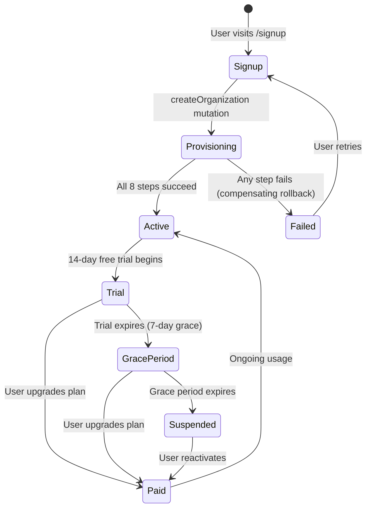
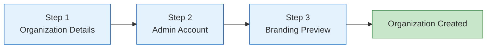
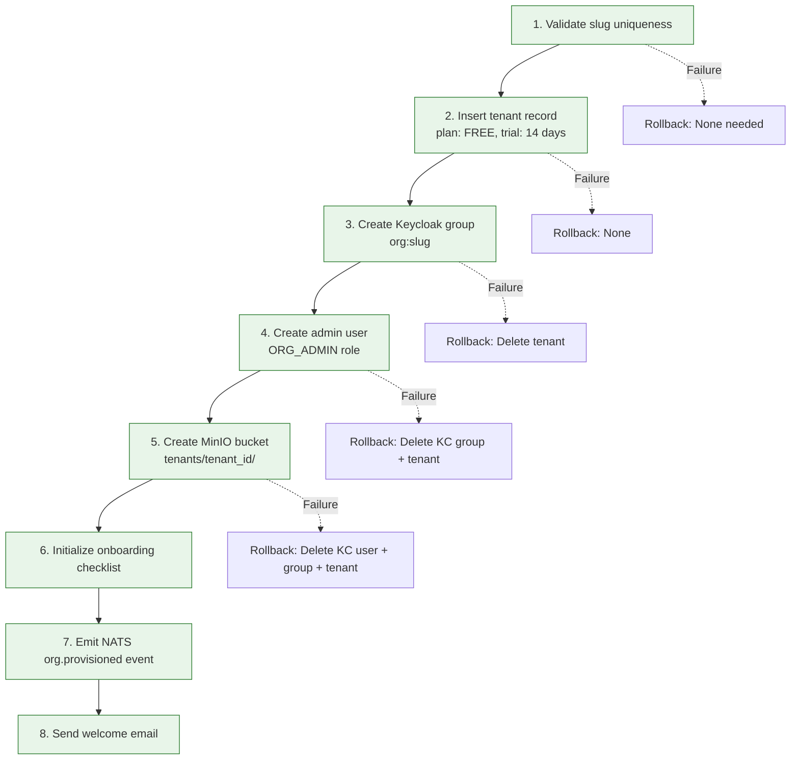
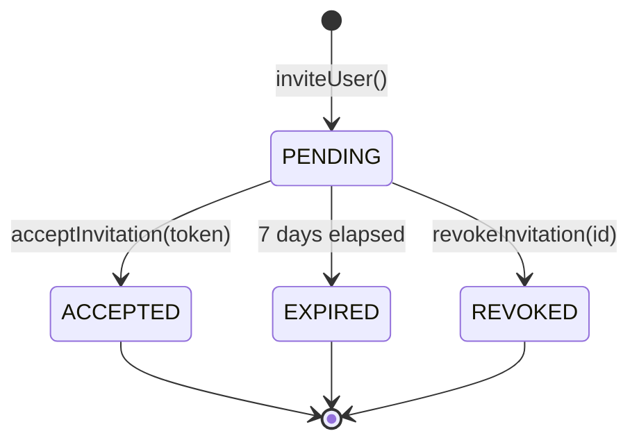
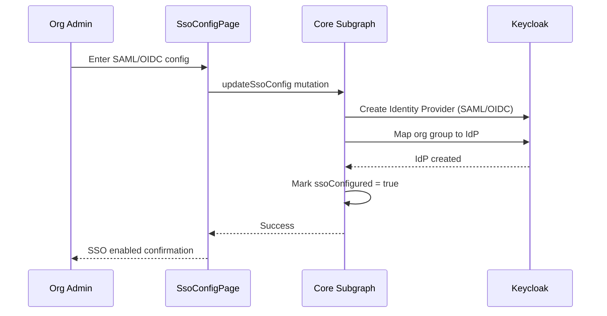
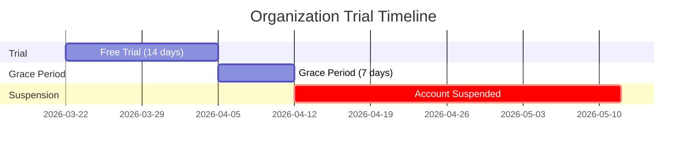
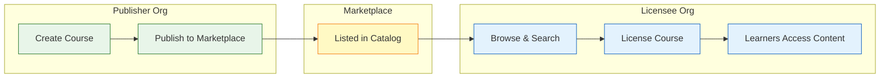
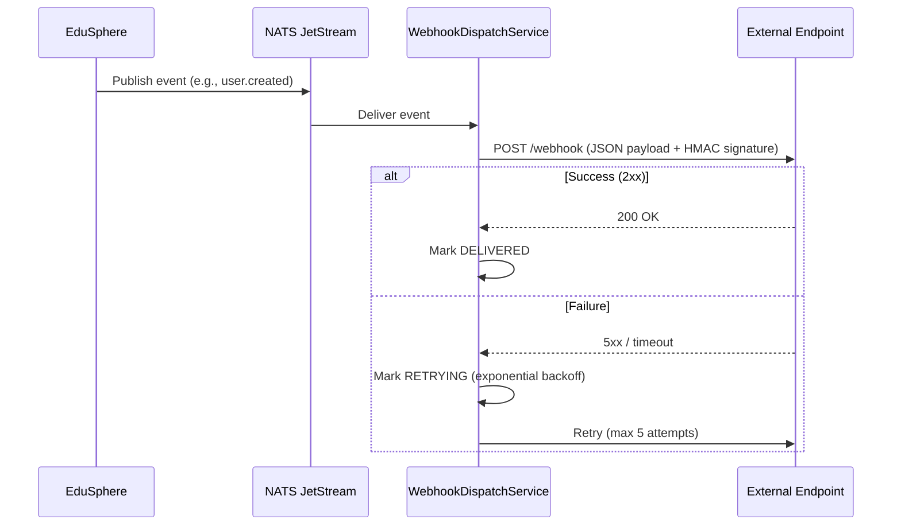
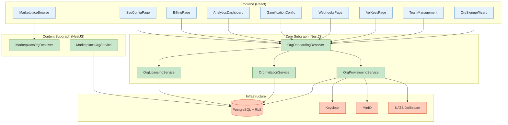

# Organization Onboarding — Admin Guide

**Document Type:** Admin Operations Guide
**Feature:** FEAT-ORG-ONBOARDING
**Date:** 2026-03-22
**Audience:** Organization Administrators, Platform Operators

---

## Table of Contents

1. [Overview](#1-overview)
2. [Creating an Organization](#2-creating-an-organization)
3. [Onboarding Checklist](#3-onboarding-checklist)
4. [Inviting Users](#4-inviting-users)
5. [Configuring Branding](#5-configuring-branding)
6. [Setting Up SSO](#6-setting-up-sso)
7. [Managing Billing & Plans](#7-managing-billing--plans)
8. [Content Marketplace](#8-content-marketplace)
9. [API Keys](#9-api-keys)
10. [Webhooks](#10-webhooks)
11. [Gamification Configuration](#11-gamification-configuration)
12. [Analytics Dashboard](#12-analytics-dashboard)
13. [Architecture Reference](#13-architecture-reference)

---

## 1. Overview

EduSphere supports self-service organization onboarding. Any user can create an organization, receive a 14-day free trial, and begin configuring their white-labeled learning platform immediately. The onboarding process follows an 8-step provisioning pipeline that sets up all infrastructure automatically.

### Onboarding Lifecycle



### Available Plans

| Plan | Price | Max Users | Storage | Features |
|------|-------|-----------|---------|----------|
| **FREE** | $0/mo | 10 | 1 GB | Basic courses, 1 admin |
| **STARTER** | $12K/yr | 100 | 50 GB | Marketplace, API keys, branding |
| **PROFESSIONAL** | $35K/yr | 1,000 | 500 GB | SSO, webhooks, analytics, gamification |
| **ENTERPRISE** | Custom | Unlimited | Unlimited | White-label, SLA, dedicated support |

---

## 2. Creating an Organization

### Signup Wizard (3 Steps)

The signup wizard at `/signup` guides new org admins through three steps:



**Step 1 — Organization Details:**
- Organization name (required, 2-100 characters)
- URL slug (auto-generated from name, editable, checked for uniqueness via `checkSlugAvailability`)
- Slug format: lowercase letters, numbers, hyphens only

**Step 2 — Admin Account:**
- Admin email (required, validated)
- First name and last name (required)
- Password is set via Keycloak email verification flow

**Step 3 — Branding Preview:**
- Optional logo upload
- Primary and secondary color selection
- Live preview of the branded UI

### Provisioning Pipeline

After the wizard completes, the `createOrganization` mutation triggers an 8-step provisioning pipeline:



Each step is idempotent via the `idempotencyKey` field on the `CreateOrganizationInput`. If provisioning fails partway through, compensating transactions roll back completed steps.

### GraphQL Mutation

```graphql
mutation CreateOrg($input: CreateOrganizationInput!) {
  createOrganization(input: $input) {
    id
    name
    slug
    provisioningStatus
    trialEndsAt
    onboardingChecklist {
      completionPercentage
    }
  }
}
```

---

## 3. Onboarding Checklist

After organization creation, a checklist tracks progress through key setup tasks. The checklist is returned as part of the `myOrganization` query.

| Step | Field | How to Complete |
|------|-------|-----------------|
| Configure Branding | `brandingConfigured` | Upload logo + set colors in Settings > Branding |
| Invite First User | `firstUserInvited` | Send at least one invitation via Team Management |
| Create First Course | `firstCourseCreated` | Create a course via Courses > New Course |
| Configure Domain | `domainConfigured` | Add custom domain in Settings > Domains |
| Configure SSO | `ssoConfigured` | Set up SAML/OIDC in Settings > SSO |

The `completionPercentage` field returns a 0-100 integer based on how many steps are complete.

```graphql
query MyOrg {
  myOrganization {
    name
    onboardingChecklist {
      brandingConfigured
      firstUserInvited
      firstCourseCreated
      domainConfigured
      ssoConfigured
      completionPercentage
    }
  }
}
```

---

## 4. Inviting Users

### Sending Invitations

Org admins can invite users by email with a specific role assignment. Invitations expire after 7 days.

```graphql
mutation InviteUser($input: InviteUserInput!) {
  inviteUser(input: $input) {
    id
    email
    role
    status
    expiresAt
  }
}
```

**Input fields:**
- `email` (required) — Recipient email address
- `role` (required) — One of: `STUDENT`, `INSTRUCTOR`, `ORG_ADMIN`, `RESEARCHER`
- `message` (optional) — Custom message included in the invitation email

### Invitation Lifecycle



### Managing Invitations

```graphql
# List pending invitations
query ListInvitations {
  orgInvitations(status: PENDING) {
    id
    email
    role
    status
    expiresAt
  }
}

# Revoke an invitation
mutation RevokeInvite($id: ID!) {
  revokeInvitation(id: $id)
}
```

### Managing Members

```graphql
# List current members
query ListMembers {
  orgMembers(limit: 50) {
    id
    email
    name
    role
    joinedAt
    lastActiveAt
  }
}

# Change a member's role
mutation ChangeRole($userId: ID!, $role: String!) {
  updateMemberRole(userId: $userId, role: $role) {
    id
    role
  }
}

# Remove a member
mutation RemoveMember($userId: ID!) {
  removeMember(userId: $userId)
}
```

---

## 5. Configuring Branding

Branding is configured through the existing `tenantBranding` and `tenantThemes` infrastructure. The org onboarding wizard includes a branding preview step, and branding can be updated at any time through Settings > Branding.

Configurable elements:
- **Logo** — Uploaded to MinIO (`tenants/{tenant_id}/branding/logo.*`)
- **Primary color** — Used for buttons, links, active states
- **Secondary color** — Used for accents, hover states
- **Font family** — Custom font selection
- **Custom CSS** — Advanced CSS overrides (Enterprise plan only)

When branding is configured, the `brandingConfigured` checklist item is marked complete.

---

## 6. Setting Up SSO

SSO configuration is available on Professional and Enterprise plans. The SSO Config page (`/admin/sso`) supports:

- **SAML 2.0** — Entity ID, SSO URL, certificate upload
- **OIDC** — Client ID, client secret, discovery URL
- **Keycloak Identity Brokering** — Auto-configured via Keycloak Admin API

### SSO Configuration Flow



---

## 7. Managing Billing & Plans

The Billing page (`/admin/billing`) shows:
- Current plan and usage
- Trial status (days remaining, grace period)
- Upgrade/downgrade options
- Invoice history (via Stripe integration)

### Trial Status Query

```graphql
query TrialInfo {
  trialStatus {
    isTrialing
    trialEndsAt
    daysRemaining
    isInGracePeriod
    gracePeriodEndsAt
  }
}
```

### Trial Timeline



---

## 8. Content Marketplace

The marketplace enables org-to-org course sharing. Publishers list courses with pricing; licensees browse and license content.

### Publishing a Course

```graphql
mutation PublishCourse($input: PublishToMarketplaceInput!) {
  publishToMarketplace(input: $input) {
    id
    title
    pricingModel
    isPublished
  }
}
```

**Pricing models:**
- `FREE` — No charge, unlimited access
- `PER_SEAT` — Price per active learner
- `FLAT_RATE` — One-time or annual flat fee

### Browsing & Licensing

```graphql
# Browse marketplace
query BrowseMarketplace {
  marketplaceListings(search: "machine learning", limit: 20) {
    id
    title
    publisherName
    pricingModel
    pricePerSeat
    categories
  }
}

# License a course
mutation LicenseCourse($input: LicenseCourseInput!) {
  licenseCourse(input: $input) {
    id
    licenseType
    maxSeats
    status
  }
}
```

### Marketplace Flow



---

## 9. API Keys

API keys allow programmatic access to the EduSphere GraphQL API. Keys are scoped and rate-limited.

### Creating an API Key

```graphql
mutation CreateKey($input: CreateApiKeyInput!) {
  createApiKey(input: $input) {
    apiKey {
      id
      name
      keyPrefix
      scopes
      rateLimitPerMinute
    }
    plainTextKey  # Shown ONCE — store securely!
  }
}
```

**Important:** The `plainTextKey` is returned only on creation. It cannot be retrieved later. Store it securely immediately.

**Available scopes:**
- `courses:read` — Read course data
- `courses:write` — Create/update courses
- `users:read` — Read user data
- `users:manage` — Manage user roles and invitations
- `analytics:read` — Read analytics data
- `webhooks:manage` — Manage webhook endpoints

### Managing API Keys

```graphql
# List active keys
query ListKeys {
  apiKeys {
    id
    name
    keyPrefix
    scopes
    rateLimitPerMinute
    lastUsedAt
    isActive
  }
}

# Revoke a key
mutation RevokeKey($id: ID!) {
  revokeApiKey(id: $id)
}
```

---

## 10. Webhooks

Webhooks deliver real-time event notifications to external systems via HTTP POST.

### Registering a Webhook

```graphql
mutation RegisterWebhook($input: CreateWebhookInput!) {
  createWebhook(input: $input) {
    id
    url
    events
    isActive
  }
}
```

**Available events:**
- `user.created`, `user.updated`, `user.deleted`
- `course.created`, `course.published`, `course.completed`
- `enrollment.created`, `enrollment.completed`
- `exam.submitted`, `exam.graded`
- `org.member.invited`, `org.member.joined`, `org.member.removed`

### Webhook Delivery Flow



### Testing & Monitoring

```graphql
# Send a test event
mutation TestWebhook($id: ID!) {
  testWebhook(id: $id) {
    id
    eventType
    status
    responseStatus
  }
}

# View delivery history
query DeliveryLog($webhookId: ID!) {
  webhookDeliveries(webhookId: $webhookId, limit: 50) {
    id
    eventType
    status
    responseStatus
    attempt
    deliveredAt
  }
}
```

---

## 11. Gamification Configuration

Per-org gamification settings control what gamification features are visible to learners.

```graphql
# Get current config
query GamificationSettings {
  gamificationConfig {
    enabled
    showLeaderboard
    showBadges
    showPoints
    showStreaks
    leaderboardScope
    xpRules
  }
}

# Update config
mutation UpdateGamification($input: UpdateGamificationConfigInput!) {
  updateGamificationConfig(input: $input) {
    enabled
    showLeaderboard
    leaderboardScope
  }
}
```

**Leaderboard scopes:**
- `TENANT` — Organization-wide leaderboard
- `DEPARTMENT` — Per-department leaderboards
- `GLOBAL` — Cross-organization leaderboard (opt-in)

---

## 12. Analytics Dashboard

The analytics dashboard (`/admin/analytics`) provides org-level learning metrics.

```graphql
query OrgMetrics($range: DateRangeInput!) {
  orgAnalytics(dateRange: $range) {
    activeLearners
    totalEnrollments
    completionRate
    totalLearningHours
    topCourses {
      title
      enrollmentCount
      completionRate
    }
    dailySnapshots {
      date
      activeLearners
      completions
      newEnrollments
      learningMinutes
    }
  }
}

# Export to CSV/PDF
mutation ExportReport($input: ExportAnalyticsInput!) {
  exportAnalytics(input: $input) {
    downloadUrl
    expiresAt
    format
  }
}
```

### Analytics Dashboard Layout

```mermaid
flowchart TD
    subgraph Header
        H1[Date Range Picker]
        H2[Export Button CSV/PDF]
    end
    subgraph KPI Cards
        K1[Active Learners]
        K2[Total Enrollments]
        K3[Completion Rate %]
        K4[Learning Hours]
    end
    subgraph Charts
        C1[Daily Activity Line Chart]
        C2[Top Courses Bar Chart]
    end
    subgraph Table
        T1[Daily Snapshots Table]
    end

    Header --> KPI Cards --> Charts --> Table

    style K1 fill:#e3f2fd,stroke:#1565c0
    style K2 fill:#e3f2fd,stroke:#1565c0
    style K3 fill:#e3f2fd,stroke:#1565c0
    style K4 fill:#e3f2fd,stroke:#1565c0
```

---

## 13. Architecture Reference

### System Component Map



### Database Tables (Migration 0036)

| Table | Purpose | RLS |
|-------|---------|-----|
| `onboarding_checklist` | Tracks org setup progress | tenant_id |
| `org_invitations` | User invitation records | tenant_id |
| `course_licenses` | Marketplace course licenses | tenant_id |
| `api_keys` | Scoped API keys per org | tenant_id |
| `webhook_endpoints` | Registered webhook URLs | tenant_id |
| `webhook_deliveries` | Delivery attempt logs | tenant_id (via webhook) |
| `gamification_config` | Per-org gamification settings | tenant_id |
| `marketplace_listings` | Published course listings | tenant_id |

### Related Files

| Category | Path |
|----------|------|
| Architecture Design | `docs/plans/features/FEAT-ORG-ONBOARDING-ARCHITECTURE.md` |
| PRD | `docs/plans/features/FEAT-ORG-ONBOARDING-PRD.md` |
| UX Spec | `docs/plans/features/FEAT-ORG-ONBOARDING-UX.md` |
| Core SDL | `apps/subgraph-core/src/tenant/org-onboarding.graphql` |
| Marketplace SDL | `apps/subgraph-content/src/marketplace/marketplace-org.graphql` |
| DB Migration | `packages/db/src/migrations/0036_org_onboarding.sql` |
| API Contracts | `API_CONTRACTS_GRAPHQL_FEDERATION.md` (sections 7.2, 8.2) |
| E2E Tests | `apps/web/e2e/org-signup-wizard.spec.ts`, `apps/web/e2e/org-i18n-pages.spec.ts` |
| Security Tests | `tests/security/org-onboarding-rls.spec.ts`, `tests/security/org-onboarding-rate-csrf-gdpr.spec.ts` |
