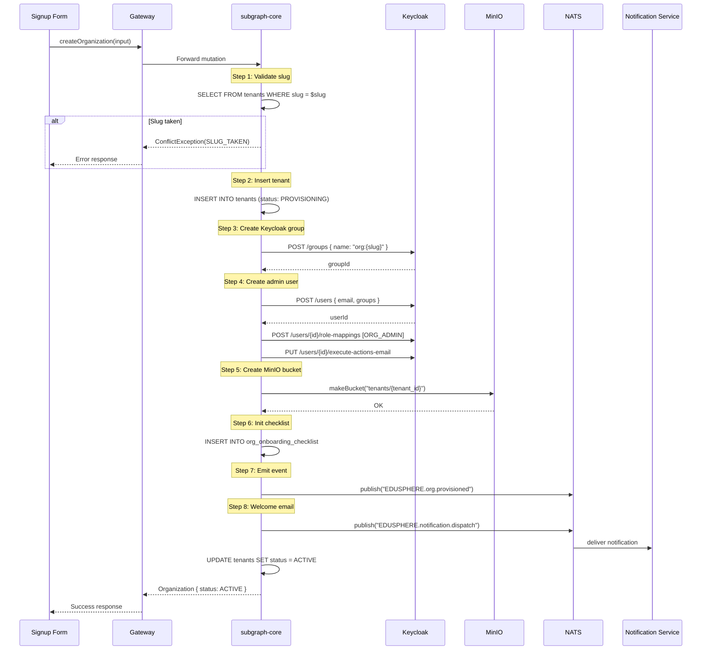
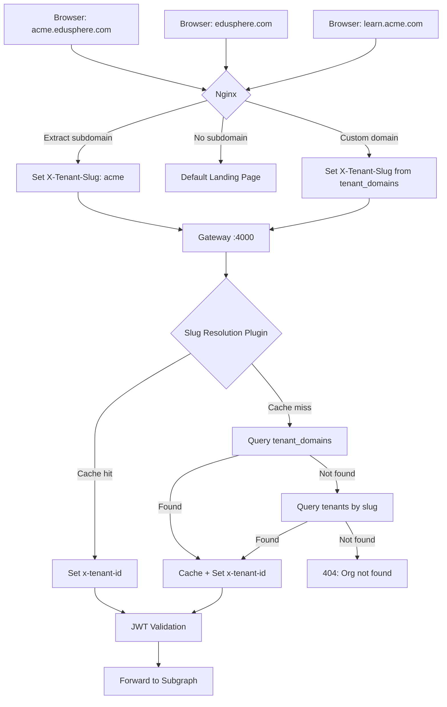
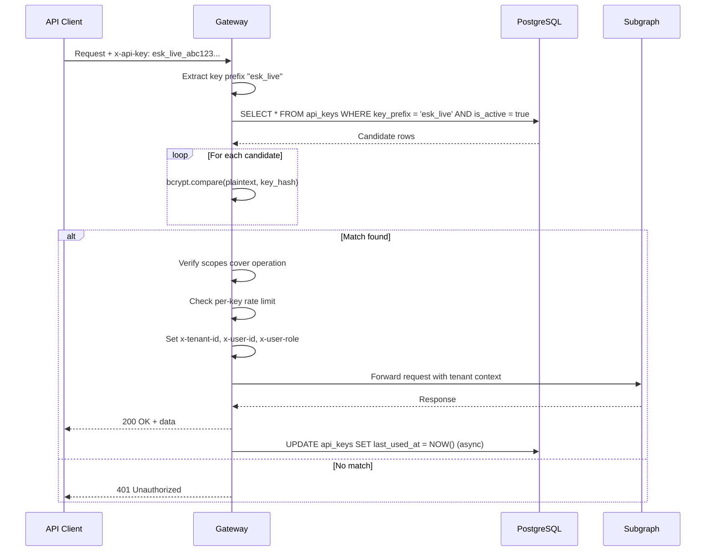
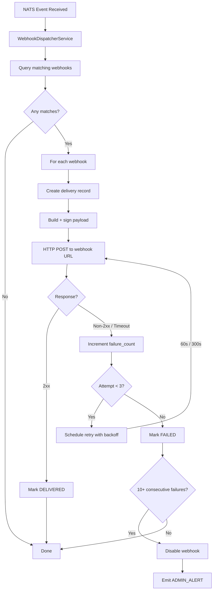
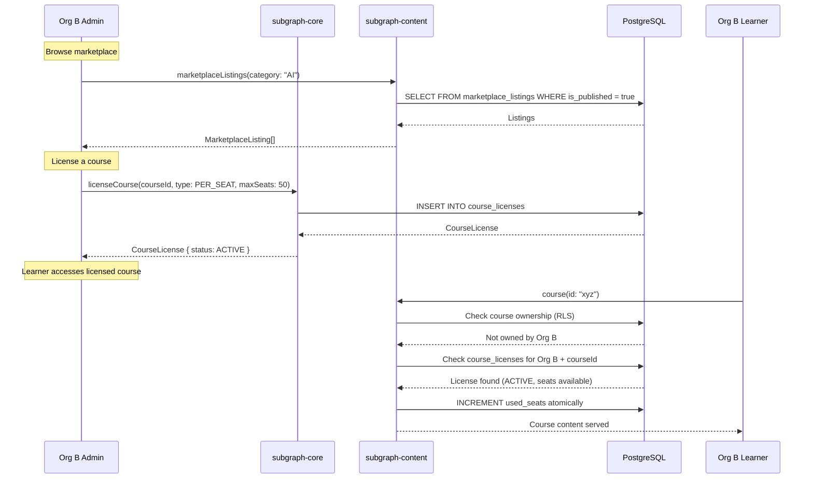
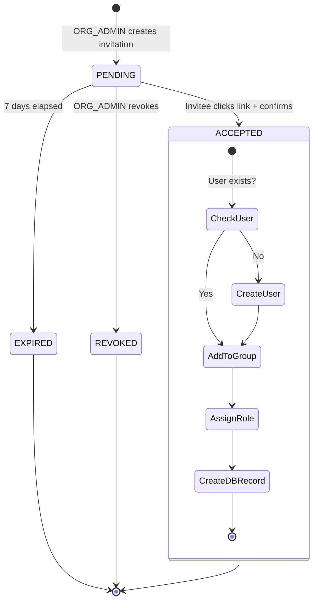
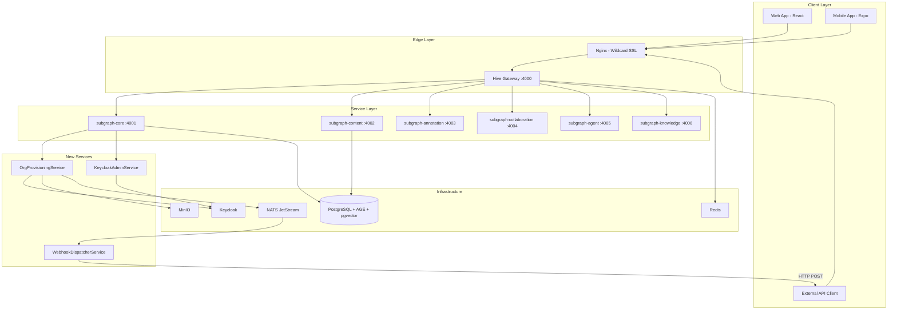

# FEAT-ORG-ONBOARDING — Organization Self-Service Onboarding & White-Label Platform

**Status:** Architecture Design
**Author:** Software Architecture Division
**Date:** 2026-03-22
**Phases:** 15 (cross-cutting: DB, Backend, Frontend, Mobile, Infrastructure)

---

## Table of Contents

1. [Executive Summary](#1-executive-summary)
2. [Provisioning Pipeline Design](#2-provisioning-pipeline-design)
3. [Subdomain Routing Architecture](#3-subdomain-routing-architecture)
4. [Keycloak Integration Design](#4-keycloak-integration-design)
5. [Content Marketplace Architecture](#5-content-marketplace-architecture)
6. [API Key & Webhook Architecture](#6-api-key--webhook-architecture)
7. [Per-Org Gamification Architecture](#7-per-org-gamification-architecture)
8. [Analytics Architecture](#8-analytics-architecture)
9. [Mobile White-Label Architecture](#9-mobile-white-label-architecture)
10. [GraphQL Schema Changes (Federation Impact)](#10-graphql-schema-changes-federation-impact)
11. [Database Migration Strategy](#11-database-migration-strategy)
12. [Security Considerations](#12-security-considerations)
13. [Mermaid Diagrams](#13-mermaid-diagrams)

---

## 1. Executive Summary

This feature enables organizations to self-service onboard onto EduSphere, receive a white-labeled subdomain, manage users via invitations, license marketplace content, configure gamification, and integrate via API keys and webhooks. The architecture builds on existing multi-tenant infrastructure (`tenants`, `tenantBranding`, `tenantDomains`, `tenantThemes` tables) and extends it with provisioning automation, marketplace licensing, API key management, and webhook dispatch.

### Existing Infrastructure Leveraged

| Component | Existing | Extension Needed |
|-----------|----------|-----------------|
| `tenants` table | `id`, `name`, `slug`, `plan`, `settings`, `portalConfig` | Add `trial_ends_at`, `provisioning_status`, `idempotency_key` |
| `tenantBranding` table | Full branding fields (logo, colors, fonts, CSS) | None — already complete |
| `tenantDomains` table | `domain`, `domainType`, `verified`, `sslProvisioned` | None — already complete |
| `tenantThemes` table | `primitives` jsonb, `isActive` | None — already complete |
| `onboardingState` table | Per-user onboarding wizard state | Extend for org-level checklist |
| `ThemeContext` (frontend) | `setTenantTheme()`, `previewThemeChanges()` | Add subdomain-based auto-load |
| RLS via `withTenantContext()` | Full RLS with `SET LOCAL` + Prometheus metrics | None — reuse as-is |
| NATS events | 25+ event subjects with type guards | Add `org.*` event domain |
| Gateway rate limiting | Per-tenant sliding window + premium tiers | Add API key rate limiting |
| Keycloak JWT auth | Gateway JWT verification + role extraction | Add group-based org routing |

---

## 2. Provisioning Pipeline Design

### 2.1 Pipeline Overview

The provisioning pipeline is triggered by the `createOrganization` mutation and runs as an **async saga** with compensating transactions for rollback. Each step is idempotent via an `idempotency_key` stored on the tenant record.

### 2.2 Pipeline Steps

```
Signup Form → createOrganization mutation → OrgProvisioningService
  → Step 1: Validate slug uniqueness (DB query)
  → Step 2: Insert tenant record (plan: FREE, trial: 14 days)
  → Step 3: Create Keycloak group `org:{slug}` via Admin API
  → Step 4: Create admin user in Keycloak → assign ORG_ADMIN role
  → Step 5: Create MinIO bucket `tenants/{tenant_id}/`
  → Step 6: Initialize onboarding_checklist row
  → Step 7: Emit NATS `org.provisioned` event
  → Step 8: Send welcome email via notification service
```

### 2.3 Step Details

#### Step 1: Validate Slug Uniqueness

```
Input:  { slug: string, orgName: string, adminEmail: string }
Query:  SELECT id FROM tenants WHERE slug = $1
Pass:   No row returned → continue
Fail:   Row exists → throw ConflictException('SLUG_TAKEN')
Idempotent: Yes (read-only check)
```

#### Step 2: Insert Tenant Record

```
Action: INSERT INTO tenants (id, name, slug, plan, settings, trial_ends_at, provisioning_status, idempotency_key)
        VALUES (gen_random_uuid(), $orgName, $slug, 'FREE', '{}', NOW() + INTERVAL '14 days', 'PROVISIONING', $idempotencyKey)
Rollback: DELETE FROM tenants WHERE idempotency_key = $key AND provisioning_status = 'PROVISIONING'
Idempotent: ON CONFLICT (idempotency_key) DO NOTHING — returns existing row
```

#### Step 3: Create Keycloak Group

```
Action: POST /admin/realms/edusphere/groups  { name: "org:{slug}" }
Rollback: DELETE /admin/realms/edusphere/groups/{groupId}
Retry:  3 attempts with exponential backoff (1s, 2s, 4s)
Idempotent: Check GET /admin/realms/edusphere/groups?search=org:{slug} first
Store:  keycloak_group_id on tenant record for rollback
```

#### Step 4: Create Admin User in Keycloak

```
Action: POST /admin/realms/edusphere/users { email, firstName, lastName, enabled: true, groups: ["org:{slug}"] }
        → POST /admin/realms/edusphere/users/{userId}/role-mappings/realm { roles: [ORG_ADMIN] }
        → PUT  /admin/realms/edusphere/users/{userId}/execute-actions-email ["UPDATE_PASSWORD"]
Rollback: DELETE /admin/realms/edusphere/users/{userId}
Retry:  3 attempts with exponential backoff
Idempotent: Check GET /admin/realms/edusphere/users?email={email} first
Store:  keycloak_user_id on users table for rollback
```

#### Step 5: Create MinIO Bucket

```
Action: mc mb tenants/{tenant_id}/
        → Set bucket policy: tenant-scoped read/write
Rollback: mc rb tenants/{tenant_id}/ --force
Retry:  3 attempts with exponential backoff
Idempotent: mc ls tenants/{tenant_id}/ — skip if exists
```

#### Step 6: Initialize Onboarding Checklist

```
Action: INSERT INTO org_onboarding_checklist (tenant_id, steps) VALUES ($tenantId, $defaultSteps)
Rollback: DELETE FROM org_onboarding_checklist WHERE tenant_id = $tenantId
Idempotent: ON CONFLICT (tenant_id) DO NOTHING
```

Default checklist steps:
1. `BRANDING_CONFIGURED` — Upload logo, set colors
2. `FIRST_USER_INVITED` — Invite at least one team member
3. `FIRST_COURSE_CREATED` — Create or license a course
4. `DOMAIN_CONFIGURED` — Set up custom subdomain
5. `SSO_CONFIGURED` — (optional) Configure SAML/OIDC

#### Step 7: Emit NATS Event

```
Subject: EDUSPHERE.org.provisioned
Payload: OrgProvisionedPayload { tenantId, slug, adminEmail, plan, timestamp }
Retry:  Fire-and-forget with circuit breaker — non-critical
Idempotent: Consumer deduplicates by tenantId + idempotency_key
```

#### Step 8: Send Welcome Email

```
Subject: EDUSPHERE.notification.dispatch
Payload: { recipientId: adminUserId, template: 'ORG_WELCOME', data: { orgName, slug, loginUrl } }
Retry:  Handled by notification service (3 attempts)
Idempotent: Notification service deduplicates by template + recipientId + tenantId within 1hr window
```

### 2.4 Rollback Strategy (Compensating Saga)

If any step fails after retries, the pipeline executes compensating transactions **in reverse order**:

```
Step 8 fail → no rollback needed (email not sent = acceptable)
Step 7 fail → no rollback needed (event not emitted = consumers unaware)
Step 6 fail → DELETE FROM org_onboarding_checklist WHERE tenant_id = $id
Step 5 fail → mc rb tenants/{tenant_id}/ --force
Step 4 fail → DELETE /admin/realms/edusphere/users/{userId}
Step 3 fail → DELETE /admin/realms/edusphere/groups/{groupId}
Step 2 fail → DELETE FROM tenants WHERE id = $id AND provisioning_status = 'PROVISIONING'
```

The tenant record's `provisioning_status` transitions:
- `PROVISIONING` → `ACTIVE` (success)
- `PROVISIONING` → `FAILED` (all retries exhausted, compensations complete)
- `FAILED` → `PROVISIONING` (manual retry triggered by admin)

### 2.5 Idempotency

Every `createOrganization` call generates an `idempotency_key` (UUID v4) on the client side, passed as a mutation argument. The tenant table has a unique index on `idempotency_key`. Duplicate requests return the existing tenant without re-running the pipeline.

### 2.6 Service Architecture

```
OrgProvisioningService (@Injectable, OnModuleDestroy)
├── KeycloakAdminClient (HTTP client for Keycloak Admin REST API)
├── MinioService (S3-compatible bucket management)
├── NatsClient (event emission)
├── Database (Drizzle ORM via withTenantContext)
└── ProvisioningStateMachine (tracks step progress, handles rollback)
```

The `ProvisioningStateMachine` stores step completion status in a `provisioning_steps` jsonb column on the tenant record, enabling resume-on-failure:

```json
{
  "step1_slug_validated": true,
  "step2_tenant_created": true,
  "step3_keycloak_group": { "groupId": "abc-123", "completed": true },
  "step4_admin_user": { "userId": "def-456", "completed": true },
  "step5_minio_bucket": { "completed": false, "error": "connection timeout", "retries": 2 },
  "step6_checklist": { "completed": false },
  "step7_nats_event": { "completed": false },
  "step8_welcome_email": { "completed": false }
}
```

---

## 3. Subdomain Routing Architecture

### 3.1 Nginx Wildcard Configuration

```nginx
server {
    listen 443 ssl;
    server_name *.edusphere.com;

    ssl_certificate     /etc/letsencrypt/live/edusphere.com/fullchain.pem;
    ssl_certificate_key /etc/letsencrypt/live/edusphere.com/privkey.pem;

    # Extract subdomain from Host header
    set $subdomain "";
    if ($host ~* "^(.+)\.edusphere\.com$") {
        set $subdomain $1;
    }

    # Skip platform subdomains (www, api, admin, docs)
    if ($subdomain ~* "^(www|api|admin|docs|status)$") {
        set $subdomain "";
    }

    # Forward subdomain as header to gateway
    proxy_set_header X-Tenant-Slug $subdomain;
    proxy_set_header X-Forwarded-Host $host;
    proxy_set_header X-Forwarded-Proto $scheme;

    location /graphql {
        proxy_pass http://gateway:4000/graphql;
    }

    location / {
        proxy_pass http://frontend:5173;
    }
}

# Default (no subdomain) — platform landing page
server {
    listen 443 ssl;
    server_name edusphere.com www.edusphere.com;

    location / {
        proxy_pass http://frontend:5173;
    }
}
```

### 3.2 Gateway Middleware: Subdomain-to-Tenant Resolution

The gateway adds a new plugin that runs **before** JWT validation to resolve `X-Tenant-Slug` into `x-tenant-id`:

```
Request arrives with Host: acme.edusphere.com
  → Nginx extracts "acme" → sets X-Tenant-Slug: acme
  → Gateway plugin reads X-Tenant-Slug header
  → Queries tenant_domains table: SELECT tenant_id FROM tenant_domains WHERE domain = 'acme' AND verified = true
  → Falls back to tenants table: SELECT id FROM tenants WHERE slug = 'acme'
  → Sets x-tenant-id header for downstream subgraphs
  → If no match found: return 404 { error: "Organization not found" }
```

Cache strategy: LRU cache (max 1000 entries, TTL 5 minutes) for slug → tenant_id resolution to avoid per-request DB queries.

### 3.3 Frontend Subdomain Detection

The frontend `ThemeContext` is extended to detect subdomain on initial load:

```
1. App mounts → extract hostname from window.location.host
2. Parse subdomain: "acme.edusphere.com" → "acme"
3. If subdomain exists:
   a. Call publicBranding(slug: "acme") query (existing, unauthenticated)
   b. Apply tenant theme via setTenantTheme(primitives)
   c. Set favicon, title, logo from branding response
   d. Store slug in React context for subsequent API calls
4. If no subdomain (edusphere.com):
   a. Show default EduSphere landing page
   b. Use default theme primitives
```

### 3.4 Custom Domain Support (Existing)

The `tenantDomains` table already supports custom domains (`domainType: 'CUSTOM'`) with DNS verification (`verificationToken`) and SSL provisioning (`sslProvisioned`). The gateway middleware handles both subdomain and custom domain resolution through the same `tenant_domains` lookup.

### 3.5 DNS Verification Flow for Custom Domains

```
1. Org admin adds custom domain "learn.acme.com" via updateTenantDomain mutation
2. System generates verificationToken (random 64-char hex)
3. Admin creates TXT record: _edusphere-verify.learn.acme.com → {token}
4. System periodically checks DNS (via NATS scheduled job, every 5 min)
5. Once verified: set verified = true, provision SSL via Let's Encrypt
6. Nginx server_name updated dynamically (or via K8s Ingress annotation)
```

---

## 4. Keycloak Integration Design

### 4.1 Single Realm Architecture

All organizations share a single Keycloak realm `edusphere`. Organization isolation is achieved via **Keycloak groups**, not separate realms. This is critical for:
- Shared user pool (users can belong to multiple orgs)
- Single JWKS endpoint for the gateway
- Simplified Keycloak administration
- Cross-org SSO capability

### 4.2 Group Hierarchy

```
edusphere (realm)
├── org:hebrew-university (group)
│   ├── ORG_ADMIN (role)
│   ├── INSTRUCTOR (role)
│   └── STUDENT (role)
├── org:technion (group)
│   ├── ORG_ADMIN (role)
│   ├── INSTRUCTOR (role)
│   └── STUDENT (role)
└── platform (group)
    ├── SUPER_ADMIN (role)
    └── RESEARCHER (role)
```

### 4.3 JWT Claims Structure

The JWT issued by Keycloak includes org-specific claims via a custom Protocol Mapper:

```json
{
  "sub": "user-uuid",
  "iss": "https://auth.edusphere.com/realms/edusphere",
  "tenant_id": "org-tenant-uuid",
  "role": "ORG_ADMIN",
  "realm_access": {
    "roles": ["ORG_ADMIN"]
  },
  "groups": ["/org:hebrew-university"],
  "email": "admin@hebrew-university.ac.il"
}
```

Custom Keycloak mapper: **Group-to-Tenant Mapper** — maps the user's first `org:*` group to `tenant_id` claim by looking up the group name in the `tenants` table (via slug).

### 4.4 Invitation Flow

```
1. ORG_ADMIN calls inviteUser(email, role) mutation
2. Backend creates invitation record: { email, tenantId, role, token, expiresAt }
3. System sends invitation email via NATS notification dispatch
4. Invitee clicks link → frontend loads invite acceptance page
5. If user exists in Keycloak:
   a. Add user to org group → assign role
   b. Create user record in EduSphere DB with tenantId
6. If user is new:
   a. Create Keycloak user (email, temporary password)
   b. Add to org group → assign role
   c. Create user record in EduSphere DB
   d. Send "set password" email via Keycloak
7. Mark invitation as accepted
```

### 4.5 SSO Broker Configuration

Organizations on PROFESSIONAL/ENTERPRISE plans can configure their own Identity Provider (SAML 2.0 or OIDC) via the admin panel:

```
1. ORG_ADMIN provides IdP metadata (SAML XML or OIDC discovery URL)
2. Backend calls Keycloak Admin API:
   POST /admin/realms/edusphere/identity-provider/instances
   {
     alias: "org-{slug}-saml",
     providerId: "saml",
     config: { ... metadata ... },
     firstBrokerLoginFlowAlias: "org-{slug}-first-login"
   }
3. Configure authentication flow to auto-map external users to org group
4. Users from external IdP → Keycloak brokered login → auto-assigned to org group + STUDENT role
5. ORG_ADMIN can promote brokered users to INSTRUCTOR
```

### 4.6 Keycloak Admin API Client

A new `KeycloakAdminService` in `subgraph-core` wraps the Keycloak Admin REST API:

| Method | Keycloak Endpoint | Purpose |
|--------|-------------------|---------|
| `createGroup(slug)` | `POST /groups` | Create org group |
| `deleteGroup(groupId)` | `DELETE /groups/{id}` | Rollback org group |
| `createUser(email, groups)` | `POST /users` | Create org member |
| `assignRole(userId, role)` | `POST /users/{id}/role-mappings/realm` | Set org role |
| `configureIdP(slug, config)` | `POST /identity-provider/instances` | SSO setup |
| `listGroupMembers(groupId)` | `GET /groups/{id}/members` | List org users |

Authentication: Service account with `realm-management` client role (client credentials grant).

---

## 5. Content Marketplace Architecture

### 5.1 Licensing Model

Courses can be published to the marketplace by their owning tenant. Other tenants can license courses for their learners. The licensing model supports:

- **Per-seat licensing**: org pays per active learner enrolled
- **Unlimited licensing**: org pays flat fee for unlimited access
- **Time-limited licensing**: license expires after N months

### 5.2 New Tables

#### `course_licenses` Table

```sql
CREATE TABLE course_licenses (
  id UUID PRIMARY KEY DEFAULT gen_random_uuid(),
  tenant_id UUID NOT NULL REFERENCES tenants(id),
  course_id UUID NOT NULL,  -- references courses table in subgraph-content
  license_type VARCHAR(20) NOT NULL DEFAULT 'UNLIMITED',  -- UNLIMITED | PER_SEAT | TIME_LIMITED
  max_seats INTEGER,  -- null for UNLIMITED
  used_seats INTEGER NOT NULL DEFAULT 0,
  licensed_at TIMESTAMPTZ NOT NULL DEFAULT NOW(),
  expires_at TIMESTAMPTZ,  -- null for perpetual
  licensor_tenant_id UUID NOT NULL,  -- the org that published the course
  status VARCHAR(20) NOT NULL DEFAULT 'ACTIVE',  -- ACTIVE | EXPIRED | REVOKED
  created_at TIMESTAMPTZ NOT NULL DEFAULT NOW(),
  updated_at TIMESTAMPTZ NOT NULL DEFAULT NOW()
);

ALTER TABLE course_licenses ENABLE ROW LEVEL SECURITY;
CREATE POLICY "course_licenses_tenant_isolation" ON course_licenses
  USING (tenant_id::text = current_setting('app.current_tenant', TRUE)
         OR licensor_tenant_id::text = current_setting('app.current_tenant', TRUE));
```

#### `marketplace_listings` Table

```sql
CREATE TABLE marketplace_listings (
  id UUID PRIMARY KEY DEFAULT gen_random_uuid(),
  course_id UUID NOT NULL,
  tenant_id UUID NOT NULL,  -- the org publishing the course
  title VARCHAR(500) NOT NULL,
  description TEXT,
  pricing_model VARCHAR(20) NOT NULL DEFAULT 'FREE',  -- FREE | PER_SEAT | FLAT_RATE
  price_per_seat NUMERIC(10,2),
  flat_rate_price NUMERIC(10,2),
  currency VARCHAR(3) NOT NULL DEFAULT 'USD',
  is_published BOOLEAN NOT NULL DEFAULT false,
  categories TEXT[] NOT NULL DEFAULT '{}',
  preview_url VARCHAR(512),
  created_at TIMESTAMPTZ NOT NULL DEFAULT NOW(),
  updated_at TIMESTAMPTZ NOT NULL DEFAULT NOW()
);

-- No RLS: marketplace listings are public (read by all tenants)
-- Write restricted via GraphQL directive (@requiresRole ORG_ADMIN)
```

### 5.3 License Enforcement via RLS

When a learner from Org B accesses a course published by Org A:

```
1. GraphQL query: course(id: "xyz") → subgraph-content resolver
2. Resolver checks: is course owned by learner's tenant?
   a. Yes → serve directly (standard RLS)
   b. No → check course_licenses table:
      SELECT * FROM course_licenses
      WHERE tenant_id = $learnerTenantId
        AND course_id = $courseId
        AND status = 'ACTIVE'
        AND (expires_at IS NULL OR expires_at > NOW())
   c. License found → serve content
   d. No license → throw ForbiddenException('LICENSE_REQUIRED')
3. For PER_SEAT licenses: check used_seats < max_seats before enrollment
```

### 5.4 Federation Split

| Operation | Subgraph | Rationale |
|-----------|----------|-----------|
| `marketplaceListings` query | `subgraph-content` | Course data lives in content |
| `marketplaceListing(id)` query | `subgraph-content` | Single listing detail |
| `publishToMarketplace` mutation | `subgraph-content` | Course owner action |
| `licenseCourse` mutation | `subgraph-core` | Licensing is a tenant/billing concern |
| `courseLicenses` query | `subgraph-core` | License management by org admin |
| `revokeCourseLicense` mutation | `subgraph-core` | Admin action |

---

## 6. API Key & Webhook Architecture

### 6.1 API Key Storage

```sql
CREATE TABLE api_keys (
  id UUID PRIMARY KEY DEFAULT gen_random_uuid(),
  tenant_id UUID NOT NULL REFERENCES tenants(id),
  name VARCHAR(200) NOT NULL,
  key_hash VARCHAR(128) NOT NULL,  -- bcrypt hash of the plaintext key
  key_prefix VARCHAR(8) NOT NULL,  -- first 8 chars for identification (e.g., "esk_live")
  scopes TEXT[] NOT NULL DEFAULT '{}',  -- e.g., ['courses:read', 'users:read', 'analytics:read']
  rate_limit_per_minute INTEGER NOT NULL DEFAULT 60,
  last_used_at TIMESTAMPTZ,
  expires_at TIMESTAMPTZ,
  is_active BOOLEAN NOT NULL DEFAULT true,
  created_by UUID NOT NULL,  -- the user who created this key
  created_at TIMESTAMPTZ NOT NULL DEFAULT NOW(),
  updated_at TIMESTAMPTZ NOT NULL DEFAULT NOW()
);

ALTER TABLE api_keys ENABLE ROW LEVEL SECURITY;
CREATE POLICY "api_keys_tenant_isolation" ON api_keys
  USING (tenant_id::text = current_setting('app.current_tenant', TRUE));
CREATE INDEX idx_api_keys_hash ON api_keys(key_hash);
CREATE INDEX idx_api_keys_prefix ON api_keys(key_prefix);
```

### 6.2 Key Format

```
esk_live_a1b2c3d4e5f6g7h8i9j0k1l2m3n4o5p6
└─prefix─┘└──────────── random 32 chars ─────────────┘
```

- Prefix `esk_live_` for production, `esk_test_` for sandbox
- Random portion: 32 chars from `[a-z0-9]` (crypto.randomBytes)
- Shown once at creation → stored as bcrypt hash in DB
- Key prefix stored separately for lookup optimization

### 6.3 Authentication Flow

```
1. Request arrives with x-api-key: esk_live_a1b2c3d4...
2. Gateway middleware extracts key
3. Extract prefix "esk_live" → query api_keys WHERE key_prefix = 'esk_live' AND is_active = true
4. For each candidate row: bcrypt.compare(plaintext, key_hash)
5. Match found:
   a. Verify scopes cover the requested operation
   b. Check per-key rate limit (separate from tenant rate limit)
   c. Set x-tenant-id from api_keys.tenant_id
   d. Set x-user-id from api_keys.created_by (audit trail)
   e. Set x-user-role to 'API_CLIENT' (new role for API access)
   f. Update last_used_at (async, non-blocking)
6. No match: 401 Unauthorized
```

### 6.4 Rate Limiting Per Key

API keys have their own rate limit bucket, separate from the tenant-level rate limit:

```
Tenant rate limit:     100 req/min (standard) or 1000 req/min (premium) — existing
API key rate limit:    configurable per key (default 60 req/min)
Both enforced:         request must pass BOTH limits
```

### 6.5 Webhook Architecture

#### `webhooks` Table

```sql
CREATE TABLE webhooks (
  id UUID PRIMARY KEY DEFAULT gen_random_uuid(),
  tenant_id UUID NOT NULL REFERENCES tenants(id),
  url VARCHAR(2048) NOT NULL,
  events TEXT[] NOT NULL,  -- e.g., ['course.completed', 'user.enrolled', 'badge.issued']
  secret VARCHAR(128) NOT NULL,  -- HMAC-SHA256 signing secret
  is_active BOOLEAN NOT NULL DEFAULT true,
  failure_count INTEGER NOT NULL DEFAULT 0,
  last_triggered_at TIMESTAMPTZ,
  last_failure_at TIMESTAMPTZ,
  created_at TIMESTAMPTZ NOT NULL DEFAULT NOW(),
  updated_at TIMESTAMPTZ NOT NULL DEFAULT NOW()
);

ALTER TABLE webhooks ENABLE ROW LEVEL SECURITY;
CREATE POLICY "webhooks_tenant_isolation" ON webhooks
  USING (tenant_id::text = current_setting('app.current_tenant', TRUE));
```

#### `webhook_deliveries` Table (Audit Log)

```sql
CREATE TABLE webhook_deliveries (
  id UUID PRIMARY KEY DEFAULT gen_random_uuid(),
  webhook_id UUID NOT NULL REFERENCES webhooks(id),
  tenant_id UUID NOT NULL,
  event_type VARCHAR(100) NOT NULL,
  payload JSONB NOT NULL,
  response_status INTEGER,
  response_body TEXT,
  attempt INTEGER NOT NULL DEFAULT 1,
  delivered_at TIMESTAMPTZ,
  next_retry_at TIMESTAMPTZ,
  status VARCHAR(20) NOT NULL DEFAULT 'PENDING',  -- PENDING | DELIVERED | FAILED | RETRYING
  created_at TIMESTAMPTZ NOT NULL DEFAULT NOW()
);

ALTER TABLE webhook_deliveries ENABLE ROW LEVEL SECURITY;
CREATE POLICY "webhook_deliveries_tenant_isolation" ON webhook_deliveries
  USING (tenant_id::text = current_setting('app.current_tenant', TRUE));
CREATE INDEX idx_webhook_deliveries_status ON webhook_deliveries(status, next_retry_at);
```

### 6.6 Webhook Dispatch Flow

```
1. NATS event received (e.g., EDUSPHERE.course.completed)
2. WebhookDispatcherService receives event
3. Query webhooks WHERE tenant_id = event.tenantId AND events @> ARRAY[event.type] AND is_active = true
4. For each matching webhook:
   a. Create webhook_deliveries record (status: PENDING)
   b. Build payload: { event, data, timestamp, webhookId }
   c. Sign payload: HMAC-SHA256(JSON.stringify(payload), webhook.secret)
   d. POST to webhook.url with headers:
      - Content-Type: application/json
      - X-EduSphere-Signature: sha256={hmac}
      - X-EduSphere-Event: course.completed
      - X-EduSphere-Delivery: {deliveryId}
      - X-EduSphere-Timestamp: {unix_timestamp}
   e. On 2xx response: update delivery status to DELIVERED
   f. On non-2xx or timeout (10s):
      - Increment failure_count
      - Schedule retry with exponential backoff:
        Attempt 1: immediate
        Attempt 2: +60s
        Attempt 3: +300s (5 min)
      - After 3 failures: mark delivery as FAILED
      - After 10 consecutive failures across all deliveries: disable webhook (is_active = false)
      - Emit NATS admin alert: EDUSPHERE.admin.alert { type: 'WEBHOOK_DISABLED', webhookId, tenantId }
```

### 6.7 Webhook Events

| Event | NATS Subject | Payload |
|-------|-------------|---------|
| `course.completed` | `EDUSPHERE.course.completed` | `CourseCompletedPayload` |
| `course.enrolled` | `EDUSPHERE.course.enrolled` | `CourseEnrolledPayload` |
| `badge.issued` | `EDUSPHERE.badge.issued` | `BadgeIssuedPayload` |
| `user.invited` | `EDUSPHERE.org.user.invited` | `UserInvitedPayload` |
| `user.joined` | `EDUSPHERE.org.user.joined` | `UserJoinedPayload` |
| `org.provisioned` | `EDUSPHERE.org.provisioned` | `OrgProvisionedPayload` |
| `license.activated` | `EDUSPHERE.org.license.activated` | `LicenseActivatedPayload` |

---

## 7. Per-Org Gamification Architecture

### 7.1 Existing Infrastructure

The gamification system already has full tenant isolation:
- `badges` table: `tenantId` column (null = platform-wide)
- `userBadges` table: `tenantId` + RLS policy
- `userPoints` table: `tenantId` + RLS policy
- `pointEvents` table: `tenantId` + RLS policy

### 7.2 New Tables

#### `gamification_config` Table

```sql
CREATE TABLE gamification_config (
  id UUID PRIMARY KEY DEFAULT gen_random_uuid(),
  tenant_id UUID NOT NULL REFERENCES tenants(id) UNIQUE,
  enabled BOOLEAN NOT NULL DEFAULT true,
  show_leaderboard BOOLEAN NOT NULL DEFAULT true,
  show_badges BOOLEAN NOT NULL DEFAULT true,
  show_points BOOLEAN NOT NULL DEFAULT true,
  show_streaks BOOLEAN NOT NULL DEFAULT true,
  xp_rules JSONB NOT NULL DEFAULT '{
    "course_completion": 100,
    "lesson_completion": 10,
    "quiz_pass": 25,
    "discussion_post": 5,
    "peer_review": 15,
    "streak_bonus_per_day": 2,
    "daily_login": 1
  }',
  leaderboard_scope VARCHAR(20) NOT NULL DEFAULT 'TENANT',  -- TENANT | DEPARTMENT | GLOBAL
  created_at TIMESTAMPTZ NOT NULL DEFAULT NOW(),
  updated_at TIMESTAMPTZ NOT NULL DEFAULT NOW()
);

ALTER TABLE gamification_config ENABLE ROW LEVEL SECURITY;
CREATE POLICY "gamification_config_tenant_isolation" ON gamification_config
  USING (tenant_id::text = current_setting('app.current_tenant', TRUE));
```

#### `org_badges` Table (Custom Badge Definitions per Org)

The existing `badges` table already supports per-org badges via `tenantId` (null = platform-wide, non-null = org-specific). No new table needed — the admin UI just needs a CRUD interface for badges WHERE `tenantId = currentTenant`.

### 7.3 XP Rules Engine

Each org can customize XP values for different actions. The `xp_rules` jsonb column in `gamification_config` defines multipliers:

```
Default: course_completion = 100 XP
Org A:   course_completion = 200 XP (emphasizes completion)
Org B:   course_completion = 50 XP, peer_review = 100 XP (emphasizes collaboration)
```

The `GamificationService` reads `gamification_config` for the current tenant when awarding points. If no config exists, platform defaults are used.

---

## 8. Analytics Architecture

### 8.1 Existing Infrastructure

The `tenantAnalyticsSnapshots` table already captures daily/weekly/monthly aggregates:
- `activeLearners`, `completions`, `avgCompletionRate`, `totalLearningMinutes`, `newEnrollments`
- RLS policy on `tenant_id`
- Unique index on `(tenant_id, snapshot_date, snapshot_type)`

### 8.2 Extensions

#### Department-Level Drilldown

New `department_analytics_snapshots` table mirrors the tenant-level structure but adds a `department_id` dimension:

```sql
CREATE TABLE department_analytics_snapshots (
  id UUID PRIMARY KEY DEFAULT gen_random_uuid(),
  tenant_id UUID NOT NULL,
  department_id UUID NOT NULL,
  snapshot_date DATE NOT NULL,
  snapshot_type analytics_snapshot_type NOT NULL DEFAULT 'daily',
  active_learners INTEGER NOT NULL DEFAULT 0,
  completions INTEGER NOT NULL DEFAULT 0,
  avg_completion_rate DOUBLE PRECISION NOT NULL DEFAULT 0,
  total_learning_minutes INTEGER NOT NULL DEFAULT 0,
  new_enrollments INTEGER NOT NULL DEFAULT 0,
  created_at TIMESTAMPTZ NOT NULL DEFAULT NOW()
);

ALTER TABLE department_analytics_snapshots ENABLE ROW LEVEL SECURITY;
CREATE POLICY "dept_analytics_tenant_isolation" ON department_analytics_snapshots
  USING (tenant_id::text = current_setting('app.current_tenant', TRUE));
CREATE UNIQUE INDEX idx_dept_analytics_unique
  ON department_analytics_snapshots(tenant_id, department_id, snapshot_date, snapshot_type);
```

### 8.3 Real-Time KPIs

The `orgAnalytics` query returns live-computed KPIs by running aggregate queries against enrollment/completion tables:

| KPI | Query Source | Computation |
|-----|-------------|-------------|
| Active Learners (today) | `user_courses` | `COUNT(DISTINCT user_id) WHERE last_accessed_at > NOW() - INTERVAL '24h'` |
| Course Completion Rate | `user_courses` | `COUNT(completed) / COUNT(*)` |
| Avg. Time to Complete | `user_courses` | `AVG(completed_at - enrolled_at)` |
| Top Courses | `user_courses` | `GROUP BY course_id ORDER BY COUNT(*) DESC LIMIT 10` |
| Learning Hours (week) | `user_progress` | `SUM(time_spent_seconds) / 3600` |

These are scoped by `withTenantContext()` automatically via RLS.

### 8.4 Export

The `exportAnalytics(format: CSV | PDF, dateRange: DateRange)` mutation generates a report:

- **CSV**: Server-side CSV generation via `fast-csv` library → upload to MinIO → return signed download URL
- **PDF**: Server-side PDF generation via `@react-pdf/renderer` → upload to MinIO → return signed download URL
- Both formats include the same data: KPIs, charts data, leaderboard snapshot

---

## 9. Mobile White-Label Architecture

### 9.1 Expo Dynamic Configuration

The `app.config.ts` in `apps/mobile` reads tenant branding at build time for white-label builds:

```typescript
// apps/mobile/app.config.ts
export default ({ config }) => ({
  ...config,
  name: process.env.APP_DISPLAY_NAME || 'EduSphere',
  slug: process.env.APP_SLUG || 'edusphere',
  icon: process.env.APP_ICON_PATH || './assets/icon.png',
  splash: {
    image: process.env.APP_SPLASH_PATH || './assets/splash.png',
    backgroundColor: process.env.APP_SPLASH_BG || '#2563eb',
  },
  ios: {
    bundleIdentifier: process.env.APP_BUNDLE_ID || 'com.edusphere.app',
  },
  android: {
    package: process.env.APP_PACKAGE || 'com.edusphere.app',
  },
});
```

### 9.2 Runtime Branding

At runtime, the mobile app mirrors the web's `ThemeContext`:

1. App startup → detect if launched via custom URL scheme or deep link
2. Extract org slug from deep link or stored preference
3. Call `publicBranding(slug)` query
4. Apply theme via React Native `StyleSheet` + `ThemeContext`
5. Cache branding in `expo-sqlite` for offline access

### 9.3 OTA Updates for Branding

When an org updates their branding (colors, logo), the change propagates:
- **Web**: Immediate (next page load fetches new branding)
- **Mobile**: Expo Updates OTA (no app store submission required)
  - NATS event `EDUSPHERE.org.branding.updated` triggers OTA manifest update
  - Next app launch downloads updated JS bundle with new branding assets

### 9.4 EAS Build Pipeline (Per-Org)

For orgs wanting fully branded app store listings:

```
eas build --profile org-{slug} --platform all
```

Each org has an EAS build profile in `eas.json`:

```json
{
  "build": {
    "org-hebrew-university": {
      "extends": "production",
      "env": {
        "APP_DISPLAY_NAME": "Hebrew University Learn",
        "APP_SLUG": "hu-learn",
        "APP_BUNDLE_ID": "ac.il.huji.learn",
        "APP_ICON_PATH": "./assets/orgs/hu/icon.png",
        "APP_SPLASH_BG": "#003366"
      }
    }
  }
}
```

---

## 10. GraphQL Schema Changes (Federation Impact)

### 10.1 New Types

#### subgraph-core (Port 4001) — Org Management

```graphql
# ─── Provisioning ──────────────────────────────────────────────

enum ProvisioningStatus {
  PROVISIONING
  ACTIVE
  FAILED
  SUSPENDED
}

type Organization @key(fields: "id") {
  id: ID!
  name: String!
  slug: String!
  plan: TenantPlan!
  provisioningStatus: ProvisioningStatus!
  trialEndsAt: DateTime
  onboardingChecklist: OrgOnboardingChecklist
  memberCount: Int!
  createdAt: DateTime!
}

type OrgOnboardingChecklist {
  brandingConfigured: Boolean!
  firstUserInvited: Boolean!
  firstCourseCreated: Boolean!
  domainConfigured: Boolean!
  ssoConfigured: Boolean!
  completionPercentage: Int!
}

type OrgInvitation {
  id: ID!
  email: String!
  role: UserRole!
  status: InvitationStatus!
  expiresAt: DateTime!
  createdAt: DateTime!
}

enum InvitationStatus {
  PENDING
  ACCEPTED
  EXPIRED
  REVOKED
}

type OrgMember {
  id: ID!
  email: String!
  name: String
  role: UserRole!
  joinedAt: DateTime!
  lastActiveAt: DateTime
}

# ─── API Keys ──────────────────────────────────────────────────

type ApiKey {
  id: ID!
  name: String!
  keyPrefix: String!
  scopes: [String!]!
  rateLimitPerMinute: Int!
  lastUsedAt: DateTime
  expiresAt: DateTime
  isActive: Boolean!
  createdAt: DateTime!
}

type ApiKeyCreated {
  apiKey: ApiKey!
  plainTextKey: String!  # Shown ONCE at creation
}

# ─── Webhooks ──────────────────────────────────────────────────

type Webhook {
  id: ID!
  url: String!
  events: [String!]!
  isActive: Boolean!
  failureCount: Int!
  lastTriggeredAt: DateTime
  createdAt: DateTime!
}

type WebhookDelivery {
  id: ID!
  eventType: String!
  responseStatus: Int
  attempt: Int!
  status: WebhookDeliveryStatus!
  deliveredAt: DateTime
  createdAt: DateTime!
}

enum WebhookDeliveryStatus {
  PENDING
  DELIVERED
  FAILED
  RETRYING
}

# ─── Licensing ─────────────────────────────────────────────────

type CourseLicense {
  id: ID!
  courseId: ID!
  licenseType: LicenseType!
  maxSeats: Int
  usedSeats: Int!
  status: LicenseStatus!
  licensedAt: DateTime!
  expiresAt: DateTime
}

enum LicenseType {
  UNLIMITED
  PER_SEAT
  TIME_LIMITED
}

enum LicenseStatus {
  ACTIVE
  EXPIRED
  REVOKED
}

# ─── Gamification Config ──────────────────────────────────────

type GamificationConfig {
  enabled: Boolean!
  showLeaderboard: Boolean!
  showBadges: Boolean!
  showPoints: Boolean!
  showStreaks: Boolean!
  xpRules: JSON!
  leaderboardScope: LeaderboardScope!
}

enum LeaderboardScope {
  TENANT
  DEPARTMENT
  GLOBAL
}
```

### 10.2 New Queries

#### subgraph-core

```graphql
type Query {
  # Org management (ORG_ADMIN, SUPER_ADMIN)
  myOrganization: Organization! @authenticated
  orgMembers(limit: Int = 20, offset: Int = 0): [OrgMember!]! @authenticated @requiresRole(roles: [ORG_ADMIN, SUPER_ADMIN])
  orgInvitations(status: InvitationStatus): [OrgInvitation!]! @authenticated @requiresRole(roles: [ORG_ADMIN, SUPER_ADMIN])

  # API keys (ORG_ADMIN, SUPER_ADMIN)
  apiKeys: [ApiKey!]! @authenticated @requiresRole(roles: [ORG_ADMIN, SUPER_ADMIN])

  # Webhooks (ORG_ADMIN, SUPER_ADMIN)
  webhooks: [Webhook!]! @authenticated @requiresRole(roles: [ORG_ADMIN, SUPER_ADMIN])
  webhookDeliveries(webhookId: ID!, limit: Int = 20): [WebhookDelivery!]! @authenticated @requiresRole(roles: [ORG_ADMIN, SUPER_ADMIN])

  # Licensing (ORG_ADMIN, SUPER_ADMIN)
  courseLicenses: [CourseLicense!]! @authenticated @requiresRole(roles: [ORG_ADMIN, SUPER_ADMIN])

  # Gamification config (ORG_ADMIN)
  gamificationConfig: GamificationConfig! @authenticated @requiresRole(roles: [ORG_ADMIN, SUPER_ADMIN])

  # Analytics (ORG_ADMIN, INSTRUCTOR)
  orgAnalytics(dateRange: DateRangeInput!): OrgAnalytics! @authenticated @requiresRole(roles: [ORG_ADMIN, INSTRUCTOR, SUPER_ADMIN])
}
```

### 10.3 New Mutations

#### subgraph-core

```graphql
type Mutation {
  # Provisioning (public — no auth required for signup)
  createOrganization(input: CreateOrganizationInput!): Organization!

  # Invitations (ORG_ADMIN)
  inviteUser(input: InviteUserInput!): OrgInvitation! @authenticated @requiresRole(roles: [ORG_ADMIN, SUPER_ADMIN])
  acceptInvitation(token: String!): OrgMember!
  revokeInvitation(id: ID!): Boolean! @authenticated @requiresRole(roles: [ORG_ADMIN, SUPER_ADMIN])

  # Member management (ORG_ADMIN)
  updateMemberRole(userId: ID!, role: UserRole!): OrgMember! @authenticated @requiresRole(roles: [ORG_ADMIN, SUPER_ADMIN])
  removeMember(userId: ID!): Boolean! @authenticated @requiresRole(roles: [ORG_ADMIN, SUPER_ADMIN])

  # API keys (ORG_ADMIN)
  createApiKey(input: CreateApiKeyInput!): ApiKeyCreated! @authenticated @requiresRole(roles: [ORG_ADMIN, SUPER_ADMIN])
  revokeApiKey(id: ID!): Boolean! @authenticated @requiresRole(roles: [ORG_ADMIN, SUPER_ADMIN])

  # Webhooks (ORG_ADMIN)
  createWebhook(input: CreateWebhookInput!): Webhook! @authenticated @requiresRole(roles: [ORG_ADMIN, SUPER_ADMIN])
  updateWebhook(id: ID!, input: UpdateWebhookInput!): Webhook! @authenticated @requiresRole(roles: [ORG_ADMIN, SUPER_ADMIN])
  deleteWebhook(id: ID!): Boolean! @authenticated @requiresRole(roles: [ORG_ADMIN, SUPER_ADMIN])
  testWebhook(id: ID!): WebhookDelivery! @authenticated @requiresRole(roles: [ORG_ADMIN, SUPER_ADMIN])

  # Licensing (ORG_ADMIN)
  licenseCourse(input: LicenseCourseInput!): CourseLicense! @authenticated @requiresRole(roles: [ORG_ADMIN, SUPER_ADMIN])
  revokeCourseLicense(id: ID!): Boolean! @authenticated @requiresRole(roles: [ORG_ADMIN, SUPER_ADMIN])

  # Gamification config (ORG_ADMIN)
  updateGamificationConfig(input: UpdateGamificationConfigInput!): GamificationConfig! @authenticated @requiresRole(roles: [ORG_ADMIN, SUPER_ADMIN])

  # Analytics export (ORG_ADMIN)
  exportAnalytics(input: ExportAnalyticsInput!): ExportResult! @authenticated @requiresRole(roles: [ORG_ADMIN, SUPER_ADMIN])
}
```

#### subgraph-content (Port 4002) — Marketplace

```graphql
type MarketplaceListing @key(fields: "id") {
  id: ID!
  courseId: ID!
  title: String!
  description: String
  pricingModel: PricingModel!
  pricePerSeat: Float
  flatRatePrice: Float
  currency: String!
  isPublished: Boolean!
  categories: [String!]!
  previewUrl: String
  publisherName: String!
}

enum PricingModel {
  FREE
  PER_SEAT
  FLAT_RATE
}

type Query {
  marketplaceListings(
    category: String
    pricingModel: PricingModel
    search: String
    limit: Int = 20
    offset: Int = 0
  ): [MarketplaceListing!]!

  marketplaceListing(id: ID!): MarketplaceListing
}

type Mutation {
  publishToMarketplace(input: PublishToMarketplaceInput!): MarketplaceListing!
    @authenticated @requiresRole(roles: [ORG_ADMIN, INSTRUCTOR, SUPER_ADMIN])

  unpublishFromMarketplace(listingId: ID!): Boolean!
    @authenticated @requiresRole(roles: [ORG_ADMIN, INSTRUCTOR, SUPER_ADMIN])
}
```

### 10.4 New Input Types

```graphql
input CreateOrganizationInput {
  name: String!
  slug: String!
  adminEmail: String!
  adminFirstName: String!
  adminLastName: String!
  idempotencyKey: String!
}

input InviteUserInput {
  email: String!
  role: UserRole!
  message: String
}

input CreateApiKeyInput {
  name: String!
  scopes: [String!]!
  rateLimitPerMinute: Int = 60
  expiresAt: DateTime
}

input CreateWebhookInput {
  url: String!
  events: [String!]!
}

input UpdateWebhookInput {
  url: String
  events: [String!]
  isActive: Boolean
}

input LicenseCourseInput {
  courseId: ID!
  licenseType: LicenseType!
  maxSeats: Int
  durationMonths: Int
}

input UpdateGamificationConfigInput {
  enabled: Boolean
  showLeaderboard: Boolean
  showBadges: Boolean
  showPoints: Boolean
  showStreaks: Boolean
  xpRules: JSON
  leaderboardScope: LeaderboardScope
}

input PublishToMarketplaceInput {
  courseId: ID!
  title: String!
  description: String
  pricingModel: PricingModel!
  pricePerSeat: Float
  flatRatePrice: Float
  currency: String = "USD"
  categories: [String!]
  previewUrl: String
}

input ExportAnalyticsInput {
  format: ExportFormat!
  dateRange: DateRangeInput!
}

enum ExportFormat {
  CSV
  PDF
}

input DateRangeInput {
  from: DateTime!
  to: DateTime!
}

type ExportResult {
  downloadUrl: String!
  expiresAt: DateTime!
  format: ExportFormat!
}

type OrgAnalytics {
  activeLearners: Int!
  totalEnrollments: Int!
  completionRate: Float!
  totalLearningHours: Float!
  topCourses: [CourseAnalytics!]!
  dailySnapshots: [AnalyticsSnapshot!]!
}

type CourseAnalytics {
  courseId: ID!
  title: String!
  enrollmentCount: Int!
  completionRate: Float!
  avgTimeToComplete: Float
}

type AnalyticsSnapshot {
  date: String!
  activeLearners: Int!
  completions: Int!
  newEnrollments: Int!
  learningMinutes: Int!
}
```

---

## 11. Database Migration Strategy

### 11.1 Migration Order

Migrations are sequenced to avoid foreign key conflicts:

```
Migration 0036: org_onboarding_checklist table
Migration 0037: tenants table extensions (trial_ends_at, provisioning_status, idempotency_key, provisioning_steps)
Migration 0038: org_invitations table
Migration 0039: api_keys table
Migration 0040: webhooks + webhook_deliveries tables
Migration 0041: course_licenses + marketplace_listings tables
Migration 0042: gamification_config table
Migration 0043: department_analytics_snapshots table
```

### 11.2 Rollback Strategy

Each migration has a corresponding `_down.rollback` file:
- Drop tables in reverse order
- Remove added columns from `tenants` table
- Preserve existing data in `tenants`, `tenantBranding`, `tenantDomains` tables

### 11.3 RLS Policies

All new tables follow the established pattern:
- `ENABLE ROW LEVEL SECURITY` on every tenant-scoped table
- `USING (tenant_id::text = current_setting('app.current_tenant', TRUE))` for read isolation
- `WITH CHECK (tenant_id::text = current_setting('app.current_tenant', TRUE))` for write isolation
- Additional role-based policies where needed (e.g., `api_keys` only readable by ORG_ADMIN)

---

## 12. Security Considerations

### 12.1 Provisioning Security

| Threat | Mitigation |
|--------|-----------|
| Slug enumeration | Rate limit `createOrganization` mutation (5/hr per IP) |
| Admin email spoofing | Email verification required before org activation |
| Provisioning DoS | Idempotency key prevents duplicate provisioning |
| Partial provisioning leak | Compensating saga cleans up all resources on failure |

### 12.2 API Key Security

| Threat | Mitigation |
|--------|-----------|
| Key leakage | Plaintext shown once; stored as bcrypt hash |
| Brute force | Key prefix lookup + bcrypt comparison = slow by design |
| Scope escalation | Scopes validated per-request against operation |
| Stolen key | Revocation via `revokeApiKey` mutation; `last_used_at` for auditing |
| Key in logs | Key prefix logged, never full key |

### 12.3 Webhook Security

| Threat | Mitigation |
|--------|-----------|
| SSRF via webhook URL | URL validation: no private IPs (10.x, 172.16-31.x, 192.168.x, localhost) |
| Replay attack | Timestamp in signature + delivery ID for deduplication |
| Secret leakage | HMAC secret stored encrypted; never returned in API responses |
| Denial of service | Max 10 webhooks per org; auto-disable after 10 consecutive failures |

### 12.4 Marketplace Security

| Threat | Mitigation |
|--------|-----------|
| Unlicensed content access | RLS + resolver-level license check before serving content |
| License seat overflow | Atomic `UPDATE ... SET used_seats = used_seats + 1 WHERE used_seats < max_seats` |
| Cross-tenant data leak | RLS on `course_licenses` with dual-tenant policy (licensee OR licensor) |

### 12.5 SI Compliance Checklist

| SI Rule | Status | Notes |
|---------|--------|-------|
| SI-1: RLS variable name | Compliant | All new tables use `current_setting('app.current_user_id', TRUE)` |
| SI-3: PII encryption | Required | `adminEmail` in invitations must use `encryptField()` |
| SI-8: DB access | Compliant | All queries via Drizzle ORM + `withTenantContext()` |
| SI-9: Cross-tenant query | Compliant | `withTenantContext()` wraps all queries |
| SI-10: LLM consent | N/A | No AI features in this module |

---

## 13. Mermaid Diagrams

### 13.1 Provisioning Pipeline Sequence Diagram



### 13.2 Subdomain Routing Flow



### 13.3 API Key Authentication Flow



### 13.4 Webhook Dispatch Flow



### 13.5 Marketplace Licensing Flow



### 13.6 Invitation Flow



### 13.7 System Architecture Overview



---

## Appendix A: NATS Event Subjects (New)

| Subject | Payload Type | Publisher | Consumer |
|---------|-------------|-----------|----------|
| `EDUSPHERE.org.provisioned` | `OrgProvisionedPayload` | OrgProvisioningService | WebhookDispatcher, Analytics |
| `EDUSPHERE.org.user.invited` | `UserInvitedPayload` | OrgInvitationService | NotificationService, WebhookDispatcher |
| `EDUSPHERE.org.user.joined` | `UserJoinedPayload` | OrgInvitationService | NotificationService, WebhookDispatcher, Analytics |
| `EDUSPHERE.org.branding.updated` | `BrandingUpdatedPayload` | TenantBrandingService | Mobile OTA, CDN Cache Invalidation |
| `EDUSPHERE.org.license.activated` | `LicenseActivatedPayload` | CourseLicenseService | WebhookDispatcher, Analytics |
| `EDUSPHERE.org.license.expired` | `LicenseExpiredPayload` | LicenseExpiryJob (cron) | WebhookDispatcher, NotificationService |
| `EDUSPHERE.org.webhook.disabled` | `WebhookDisabledPayload` | WebhookDispatcherService | AdminAlertService |
| `EDUSPHERE.org.trial.expiring` | `TrialExpiringPayload` | TrialMonitorJob (cron) | NotificationService |

## Appendix B: File Structure (New Files)

```
apps/subgraph-core/src/
├── org/
│   ├── org.module.ts
│   ├── org.graphql                          # New SDL types + queries + mutations
│   ├── org.resolver.ts                      # Resolver for org queries/mutations
│   ├── org-provisioning.service.ts          # 8-step provisioning pipeline
│   ├── org-provisioning.service.spec.ts
│   ├── org-provisioning.service.memory.spec.ts
│   ├── org-invitation.service.ts            # Invitation CRUD + acceptance
│   ├── org-invitation.service.spec.ts
│   ├── org-member.service.ts                # Member management
│   ├── org-member.service.spec.ts
│   ├── org-analytics.service.ts             # Org-level analytics queries
│   ├── org-analytics.service.spec.ts
│   ├── org-onboarding-checklist.service.ts  # Checklist progress tracking
│   └── org-onboarding-checklist.service.spec.ts
├── api-key/
│   ├── api-key.module.ts
│   ├── api-key.graphql
│   ├── api-key.resolver.ts
│   ├── api-key.service.ts
│   ├── api-key.service.spec.ts
│   └── api-key.service.memory.spec.ts
├── webhook/
│   ├── webhook.module.ts
│   ├── webhook.graphql
│   ├── webhook.resolver.ts
│   ├── webhook.service.ts
│   ├── webhook.service.spec.ts
│   ├── webhook-dispatcher.service.ts        # NATS consumer → HTTP POST
│   ├── webhook-dispatcher.service.spec.ts
│   └── webhook-dispatcher.service.memory.spec.ts
├── keycloak/
│   ├── keycloak-admin.module.ts
│   ├── keycloak-admin.service.ts            # Keycloak Admin REST API client
│   ├── keycloak-admin.service.spec.ts
│   └── keycloak-admin.service.memory.spec.ts
└── license/
    ├── license.module.ts
    ├── license.graphql
    ├── license.resolver.ts
    ├── license.service.ts
    └── license.service.spec.ts

apps/subgraph-content/src/
└── marketplace/
    ├── marketplace.module.ts
    ├── marketplace.graphql
    ├── marketplace.resolver.ts
    ├── marketplace.service.ts
    └── marketplace.service.spec.ts

packages/db/src/
├── schema/
│   ├── org-onboarding-checklist.ts
│   ├── org-invitations.ts
│   ├── api-keys.ts
│   ├── webhooks.ts
│   ├── webhook-deliveries.ts
│   ├── course-licenses.ts
│   ├── marketplace-listings.ts
│   ├── gamification-config.ts
│   └── department-analytics-snapshots.ts
└── migrations/
    ├── 0036_org_onboarding_checklist.sql
    ├── 0037_tenants_provisioning_extensions.sql
    ├── 0038_org_invitations.sql
    ├── 0039_api_keys.sql
    ├── 0040_webhooks.sql
    ├── 0041_marketplace_licensing.sql
    ├── 0042_gamification_config.sql
    └── 0043_department_analytics.sql

packages/nats-client/src/
└── org-events.ts                            # New event types + type guards

apps/web/src/pages/
├── OrgOnboardingPage.tsx
├── OrgSettingsPage.tsx
├── OrgMembersPage.tsx
├── OrgApiKeysPage.tsx
├── OrgWebhooksPage.tsx
├── OrgAnalyticsPage.tsx
├── MarketplacePage.tsx                      # (existing — extend)
└── OrgGamificationConfigPage.tsx

apps/web/e2e/
├── org-onboarding.spec.ts
├── org-members.spec.ts
├── org-api-keys.spec.ts
├── org-webhooks.spec.ts
└── org-marketplace.spec.ts
```

## Appendix C: Implementation Phases

| Phase | Scope | Dependencies |
|-------|-------|-------------|
| 1 | DB schema + migrations (tables, RLS, indexes) | None |
| 2 | Keycloak Admin Service | Phase 1 |
| 3 | Provisioning Pipeline Service | Phase 1, 2 |
| 4 | Org GraphQL schema + resolvers (CRUD) | Phase 1, 3 |
| 5 | Invitation system (backend + Keycloak) | Phase 2, 4 |
| 6 | Subdomain routing (Nginx + Gateway plugin) | Phase 4 |
| 7 | API Key management (backend) | Phase 1, 4 |
| 8 | Webhook system (backend + dispatcher) | Phase 1, 4 |
| 9 | Marketplace + Licensing (backend) | Phase 1, 4 |
| 10 | Gamification config (backend) | Phase 1, 4 |
| 11 | Analytics extensions (backend) | Phase 1, 4 |
| 12 | Frontend: Onboarding wizard + Settings pages | Phase 4, 6 |
| 13 | Frontend: Members, API Keys, Webhooks pages | Phase 5, 7, 8 |
| 14 | Mobile: White-label + OTA branding | Phase 6, 12 |
| 15 | E2E tests + Security audit + Load testing | Phase 1-14 |
