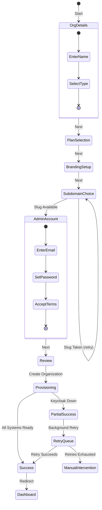
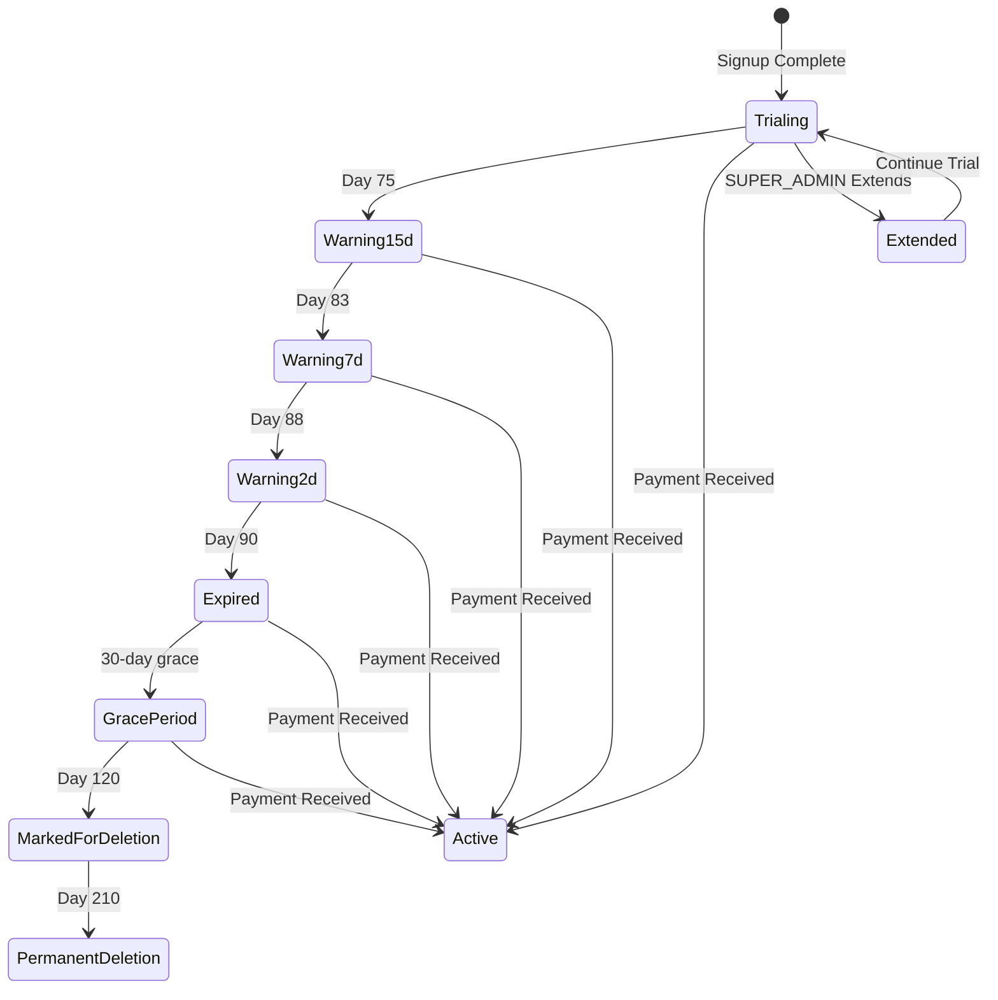
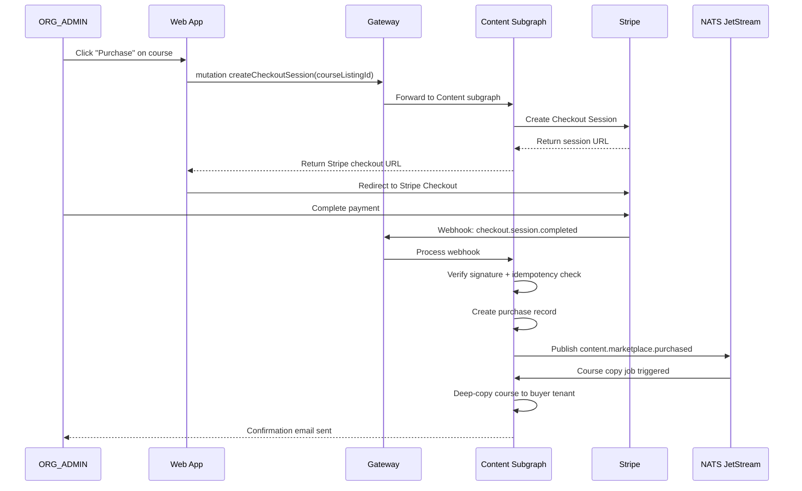
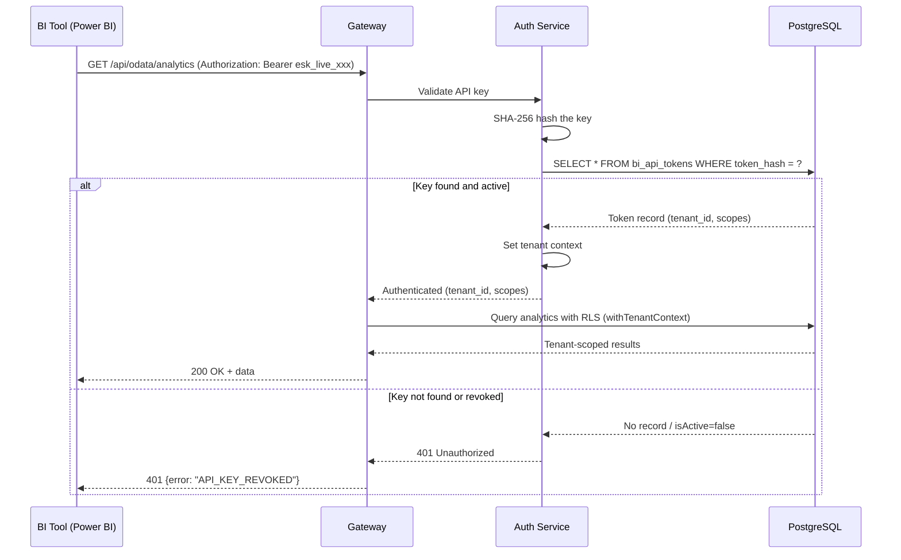

# FEAT-ORG-ONBOARDING — Organization Self-Service Onboarding & White-Label Platform

**Status:** Draft
**Author:** Product & Requirements Division
**Date:** 2026-03-22
**Priority:** P0
**Epic:** Organization Self-Service Onboarding
**Stakeholders:** ORG_ADMIN (primary), SUPER_ADMIN, INSTRUCTOR, STUDENT

---

## Executive Summary

Enable organizations to self-service onboard onto EduSphere with a guided signup wizard, brand their instance, provision subdomains, invite users, manage trials, and operate a fully white-labeled learning platform. This epic covers 15 P0 features spanning the entire org lifecycle from initial signup through daily operation.

---

## Existing Infrastructure (as of 2026-03-22)

| Component                    | Schema/Location                                        | Status                                                                                                        |
| ---------------------------- | ------------------------------------------------------ | ------------------------------------------------------------------------------------------------------------- |
| `tenants` table              | `packages/db/src/schema/tenants.ts`                    | slug, plan enum (FREE/STARTER/PROFESSIONAL/ENTERPRISE), settings jsonb, portalConfig, subscription_expires_at |
| `tenant_branding` table      | `packages/db/src/schema/tenantBranding.ts`             | logoUrl, colors (primary/secondary/accent/bg), fontFamily, orgName, tagline, customCss, hideEduSphereBranding |
| `tenant_domains` table       | `packages/db/src/schema/tenantDomains.ts`              | domain, domainType (SUBDOMAIN/CUSTOM), verified, verificationToken, sslProvisioned, keycloakRealm             |
| `subscription_plans` table   | `packages/db/src/schema/billing.ts`                    | name, priceUsdCents, billingPeriodMonths, maxYau, features jsonb                                              |
| `tenant_subscriptions` table | `packages/db/src/schema/billing.ts`                    | status (trialing/active/past_due/canceled/pilot), stripe fields, pilotEndsAt                                  |
| `yau_events` table           | `packages/db/src/schema/billing.ts`                    | YAU tracking per tenant/user/year                                                                             |
| `pilot_requests` table       | `packages/db/src/schema/billing.ts`                    | orgName, orgType, contactEmail, status (pending/approved/rejected/expired)                                    |
| `usage_snapshots` table      | `packages/db/src/schema/billing.ts`                    | monthly snapshots: yauCount, activeUsersCount, coursesCount, storageGb                                        |
| `onboarding_state` table     | `packages/db/src/schema/onboarding.ts`                 | userId-scoped, currentStep, totalSteps, completed, data jsonb                                                 |
| `bi_api_tokens` table        | `packages/db/src/schema/bi-tokens.ts`                  | tokenHash (SHA-256), description, isActive, lastUsedAt                                                        |
| `gamification` tables        | `packages/db/src/schema/gamification.ts`               | badges, userBadges, userPoints, pointEvents                                                                   |
| `marketplace` tables         | `packages/db/src/schema/marketplace.ts`                | courseListings, stripeCustomers, purchases, instructorPayouts                                                 |
| `tenant_analytics_snapshots` | `packages/db/src/schema/tenant-analytics-snapshots.ts` | snapshot_type enum, metrics jsonb                                                                             |
| `tenant_themes`              | `packages/db/src/schema/tenant-themes.ts`              | Theme presets                                                                                                 |
| `tenant_social_links`        | `packages/db/src/schema/tenant-social-links.ts`        | Social media links                                                                                            |
| White-label runtime          | `apps/web/src/lib/branding.ts`                         | applyTenantBranding(), detectTenantSlug() — partially wired                                                   |
| BrandingSettingsPage         | `apps/web/src/pages/BrandingSettingsPage.tsx`          | Admin branding form                                                                                           |
| Keycloak auth                | Single realm `edusphere`, JWT with tenant_id           | RLS via withTenantContext()                                                                                   |

---

## P0 Feature List

| #    | Feature                    | Owner Role             | Description                                                                            |
| ---- | -------------------------- | ---------------------- | -------------------------------------------------------------------------------------- |
| F-01 | Self-Service Signup Wizard | ORG_ADMIN              | Multi-step wizard: org details → plan selection → branding → subdomain → admin account |
| F-02 | Branding Editor            | ORG_ADMIN              | Live-preview WYSIWYG editor for colors, logo, fonts, custom CSS, favicon               |
| F-03 | Subdomain Provisioning     | System                 | Auto-provision `{slug}.edusphere.io` with SSL, DNS, and Keycloak client                |
| F-04 | Admin Dashboard            | ORG_ADMIN              | Central hub: user count, active users, storage, subscription status, quick actions     |
| F-05 | User Invitations           | ORG_ADMIN              | Email-based invitation system with role assignment, expiry, resend, bulk invite        |
| F-06 | CSV User Import            | ORG_ADMIN              | Upload CSV with user data, validate, preview, import with progress tracking            |
| F-07 | Free Trial Management      | ORG_ADMIN, SUPER_ADMIN | 90-day trial lifecycle: start → warnings → grace period → downgrade/convert            |
| F-08 | Keycloak Auto-Provisioning | System                 | Auto-create Keycloak client, roles, identity provider config per tenant                |
| F-09 | Branded Login Page         | ORG_ADMIN              | Tenant-branded Keycloak login with org logo, colors, custom welcome message            |
| F-10 | Content Isolation          | System                 | RLS enforcement ensuring zero cross-tenant data leakage for all content types          |
| F-11 | White-Label Mobile         | ORG_ADMIN              | Expo SDK 54 app with dynamic branding, push notification channels per org              |
| F-12 | Per-Org Gamification       | ORG_ADMIN              | Org-scoped badges, points, leaderboards with configurable rules per tenant             |
| F-13 | Org API Keys               | ORG_ADMIN              | Generate/revoke API keys for integrations (LTI, SCIM, webhooks, BI export)             |
| F-14 | Content Marketplace        | ORG_ADMIN, INSTRUCTOR  | Browse/purchase/license courses from other orgs or EduSphere content library           |
| F-15 | Org Analytics Dashboard    | ORG_ADMIN              | Real-time analytics: engagement, completion rates, learning paths, ROI metrics         |

---

## Feature Details

---

### F-01: Self-Service Signup Wizard

#### User Stories

**US-01.1:** As an ORG_ADMIN, I want to sign up my organization through a guided wizard, so that I can start using EduSphere without contacting sales.

**US-01.2:** As a SUPER_ADMIN, I want to review pending org signups in a queue, so that I can approve or flag suspicious registrations.

**US-01.3:** As an ORG_ADMIN, I want to resume an incomplete signup if I close my browser, so that I don't lose my progress.

#### Acceptance Criteria

```gherkin
Scenario: Complete signup wizard — happy path
  Given I am on the public signup page at /signup/org
  When I fill in organization name "Acme University"
  And I select org type "University"
  And I enter admin email "admin@acme.edu" and password meeting complexity requirements
  And I choose the "STARTER" plan
  And I pick the slug "acme-university"
  And I upload a logo and pick primary color "#1a73e8"
  And I accept Terms of Service and Privacy Policy
  And I click "Create Organization"
  Then a new tenant row is created with slug "acme-university" and plan "STARTER"
  And a tenant_branding row is created with the uploaded logo and color
  And a tenant_domains row is created for "acme-university.edusphere.io" with domainType "SUBDOMAIN"
  And a Keycloak client is auto-provisioned for the tenant
  And the admin user is created with role ORG_ADMIN in the tenant
  And I receive a verification email at "admin@acme.edu"
  And I am redirected to "acme-university.edusphere.io/dashboard"
  And the entire wizard completes in under 60 seconds

Scenario: Slug already taken
  Given the slug "acme-university" is already registered
  When I enter slug "acme-university" in the wizard
  Then I see an inline error "This subdomain is already taken"
  And I am offered suggestions: "acme-university-2", "acme-uni", "acmeuniversity"
  And the "Next" button is disabled until I pick an available slug

Scenario: Slug validation rules
  Given I am on the slug selection step
  When I enter a slug with uppercase letters, spaces, or special characters
  Then the input shows an error "Slug must be lowercase letters, numbers, and hyphens only (3-63 characters)"
  And reserved slugs ("admin", "api", "www", "mail", "support", "app", "dashboard") are rejected with "This subdomain is reserved"

Scenario: Resume incomplete signup
  Given I completed steps 1-3 of the wizard and closed my browser
  When I return to /signup/org and enter my email
  Then I am prompted to resume from step 4
  And my previous entries (org name, type, email) are pre-filled

Scenario: Email already registered
  Given "admin@acme.edu" is already associated with a tenant
  When I enter "admin@acme.edu" in the wizard
  Then I see "This email is already associated with an organization. Please log in or use a different email."

Scenario: SUPER_ADMIN reviews pending signups
  Given there are 3 pending org signups in the queue
  When SUPER_ADMIN opens the Org Approval Queue page
  Then all 3 signups are listed with org name, type, contact email, estimated users, and submission date
  And SUPER_ADMIN can approve, reject (with reason), or request more info for each
```

#### Edge Cases & Error Scenarios

| Scenario                                    | Expected Behavior                                                                                                                                                          |
| ------------------------------------------- | -------------------------------------------------------------------------------------------------------------------------------------------------------------------------- |
| Network failure during final submission     | Wizard shows retry button; partial tenant data is rolled back via DB transaction                                                                                           |
| Keycloak is down during provisioning        | Tenant is created with status "PROVISIONING_FAILED"; background retry job attempts 3x with exponential backoff; admin sees "Setup in progress, we'll email you when ready" |
| Duplicate concurrent signups with same slug | Database unique constraint prevents duplicate; second request gets "slug taken" error                                                                                      |
| SQL injection in org name                   | Zod validation strips/escapes; Drizzle ORM parameterized queries prevent injection                                                                                         |
| XSS in organization name field              | Input sanitized via DOMPurify before storage; output escaped in all rendering contexts                                                                                     |
| Very long org name (>255 chars)             | Zod schema rejects with "Organization name must be under 255 characters"                                                                                                   |

---

### F-02: Branding Editor

#### User Stories

**US-02.1:** As an ORG_ADMIN, I want to customize my organization's colors, logo, and fonts with a live preview, so that the platform matches our brand identity.

**US-02.2:** As an ORG_ADMIN, I want to inject custom CSS for advanced styling, so that I can fine-tune the appearance beyond the standard options.

**US-02.3:** As a STUDENT, I want to see my organization's branding when I log in, so that the platform feels like an internal tool rather than a third-party service.

#### Acceptance Criteria

```gherkin
Scenario: Update branding with live preview
  Given I am logged in as ORG_ADMIN
  When I navigate to Settings → Branding
  And I change primary color to "#e63946"
  Then the live preview panel updates immediately without page reload
  And clicking "Save" persists the change to tenant_branding
  And all users in my org see the new color on next page load

Scenario: Upload logo with validation
  Given I am on the branding editor
  When I upload a logo file
  Then files > 2MB are rejected with "Logo must be under 2MB"
  And non-image files (.exe, .pdf) are rejected with "Please upload a PNG, JPG, SVG, or WebP image"
  And images smaller than 64x64px are warned "Logo may appear blurry at small sizes"
  And uploaded logos are stored in MinIO under tenant-scoped bucket path

Scenario: Custom CSS injection
  Given I am on the branding editor advanced tab
  When I enter custom CSS ".sidebar { border-radius: 12px; }"
  Then the preview shows the rounded sidebar
  And CSS containing `<script>`, `javascript:`, `expression()`, or `url(data:)` is stripped with warning "Unsafe CSS removed"
  And the CSS is stored in tenant_branding.custom_css

Scenario: Reset to defaults
  Given I have customized all branding fields
  When I click "Reset to Defaults"
  Then a confirmation dialog appears "This will reset all branding to EduSphere defaults. Continue?"
  And confirming restores all fields to schema defaults (primaryColor=#2563eb, fontFamily=Inter, etc.)

Scenario: Hide EduSphere branding (ENTERPRISE plan only)
  Given my org is on the ENTERPRISE plan
  When I toggle "Hide EduSphere Branding"
  Then all "Powered by EduSphere" footers and watermarks are removed
  And if my plan is STARTER or PROFESSIONAL, the toggle is disabled with tooltip "Available on Enterprise plan"
```

#### Edge Cases & Error Scenarios

| Scenario                                 | Expected Behavior                                                                                                                            |
| ---------------------------------------- | -------------------------------------------------------------------------------------------------------------------------------------------- |
| Invalid hex color (e.g., "#GGGGGG")      | Input validation rejects; color picker enforces valid hex                                                                                    |
| Logo upload fails mid-stream             | Progress bar shows error; previous logo preserved; retry available                                                                           |
| Custom CSS causes layout breakage        | Preview shows warning "Your CSS may affect layout"; changes are sandboxed to preview until saved                                             |
| Concurrent branding edits by two admins  | Last-write-wins with optimistic locking (updatedAt check); second admin sees "Branding was updated by another admin. Reload to see changes." |
| Font family not available on user device | System font fallback chain: `{customFont}, Inter, system-ui, sans-serif`                                                                     |

---

### F-03: Subdomain Provisioning

#### User Stories

**US-03.1:** As an ORG_ADMIN, I want my organization to have a branded subdomain (e.g., `acme.edusphere.io`), so that users access a URL that reflects our brand.

**US-03.2:** As an ORG_ADMIN on the ENTERPRISE plan, I want to connect a custom domain (e.g., `learn.acme.com`), so that the platform appears fully owned by us.

**US-03.3:** As a SUPER_ADMIN, I want to monitor all active subdomains and their SSL status, so that I can ensure platform health.

#### Acceptance Criteria

```gherkin
Scenario: Subdomain provisioned during signup
  Given an org signs up with slug "acme-university"
  Then within 30 seconds:
    - DNS CNAME for "acme-university.edusphere.io" is configured
    - SSL certificate is provisioned via Let's Encrypt
    - tenant_domains row is created with domain="acme-university.edusphere.io", domainType="SUBDOMAIN", verified=true, sslProvisioned=true
    - Navigating to https://acme-university.edusphere.io shows the branded login page

Scenario: Custom domain setup (ENTERPRISE)
  Given I am an ORG_ADMIN on the ENTERPRISE plan
  When I navigate to Settings → Domain and enter "learn.acme.com"
  Then I am shown a DNS verification record: "Add CNAME record: learn.acme.com → proxy.edusphere.io"
  And a TXT verification record: "Add TXT record: _edusphere-verify.learn.acme.com → {verificationToken}"
  And I click "Verify Domain"
  Then if DNS records are correct, domain status changes to "Verified"
  And SSL is auto-provisioned within 5 minutes
  And tenant_domains row is created with domainType="CUSTOM", verified=true

Scenario: Custom domain DNS not configured
  Given I added "learn.acme.com" but DNS records are not set
  When I click "Verify Domain"
  Then I see "DNS records not found. Please add the CNAME and TXT records shown above and try again in a few minutes."
  And the domain status remains "Pending Verification"
  And a background job retries verification every 6 hours for 7 days

Scenario: Custom domain on non-ENTERPRISE plan
  Given I am an ORG_ADMIN on the STARTER plan
  When I navigate to Settings → Domain
  Then the custom domain section shows "Custom domains are available on the Enterprise plan" with an upgrade CTA
  And the subdomain field is read-only showing my current subdomain
```

#### Edge Cases & Error Scenarios

| Scenario                                  | Expected Behavior                                                                                                    |
| ----------------------------------------- | -------------------------------------------------------------------------------------------------------------------- |
| SSL provisioning fails (rate limit)       | Retry with exponential backoff (1h, 2h, 4h); admin notified via email after 3 failures                               |
| Domain already pointed to another service | Verification fails; clear error message shown                                                                        |
| Subdomain conflicts with reserved words   | Rejected at signup; reserved list includes: admin, api, www, mail, support, app, dashboard, status, docs, blog, help |
| DNS propagation delay                     | "Verification pending — DNS changes can take up to 48 hours to propagate"                                            |
| Let's Encrypt downtime                    | Fallback to self-signed cert with browser warning; re-attempt when LE recovers                                       |
| Custom domain pointed to wrong CNAME      | Verification succeeds for TXT but CNAME doesn't match; specific error shown                                          |

---

### F-04: Admin Dashboard

#### User Stories

**US-04.1:** As an ORG_ADMIN, I want a dashboard showing key metrics (active users, courses, storage, subscription status), so that I can monitor my organization's platform usage at a glance.

**US-04.2:** As an ORG_ADMIN, I want quick action buttons (invite users, create course, manage billing), so that I can perform common tasks efficiently.

**US-04.3:** As a SUPER_ADMIN, I want a platform-wide dashboard showing all orgs, their health, and billing status, so that I can manage the multi-tenant platform.

#### Acceptance Criteria

```gherkin
Scenario: ORG_ADMIN dashboard loads with metrics
  Given I am logged in as ORG_ADMIN
  When I navigate to /admin/dashboard
  Then I see the following metric cards:
    - Total Users (count from users table for my tenant)
    - Active Users (YAU count from yau_events for current year)
    - Total Courses (count from courses for my tenant)
    - Storage Used (from latest usage_snapshot)
    - Subscription Status (from tenant_subscriptions: plan name + days remaining)
    - Trial Days Remaining (if status = "trialing" or "pilot")
  And the dashboard loads in under 3 seconds
  And metric data is refreshed every 5 minutes via polling

Scenario: Quick actions panel
  Given I am on the admin dashboard
  Then I see quick action buttons:
    - "Invite Users" → opens invitation modal
    - "Create Course" → navigates to course builder
    - "Import Users (CSV)" → opens CSV import dialog
    - "Manage Billing" → navigates to billing page
    - "Branding Settings" → navigates to branding editor

Scenario: SUPER_ADMIN platform dashboard
  Given I am logged in as SUPER_ADMIN
  When I navigate to /admin/platform
  Then I see:
    - Total Organizations (tenant count)
    - Total Platform Users (all users across tenants)
    - Revenue MRR (sum of active subscriptions)
    - Pending Pilot Requests (count)
    - Org health table: each row shows org name, plan, user count, YAU count, status, last activity
  And clicking an org row navigates to that org's detail view

Scenario: Dashboard respects RLS
  Given ORG_ADMIN of Tenant A is logged in
  When dashboard queries execute
  Then all queries use withTenantContext(tenantA_id)
  And zero data from Tenant B appears in any metric
```

#### Edge Cases & Error Scenarios

| Scenario                         | Expected Behavior                                                                                               |
| -------------------------------- | --------------------------------------------------------------------------------------------------------------- |
| No usage snapshots yet (new org) | Metrics show "0" with "Data collection starts after first user activity"                                        |
| Subscription expired             | Dashboard shows warning banner: "Your subscription expired on {date}. Upgrade to restore full access." with CTA |
| Database query timeout           | Individual metric cards show skeleton loading → error state with retry button; other cards still display        |
| Very large org (50,000+ users)   | Metrics are pre-computed in usage_snapshots, not live-counted; dashboard remains fast                           |

---

### F-05: User Invitations

#### User Stories

**US-05.1:** As an ORG_ADMIN, I want to invite users via email with specific role assignments, so that I can onboard my team quickly.

**US-05.2:** As an ORG_ADMIN, I want to bulk-invite up to 100 users at once, so that I can efficiently onboard large groups.

**US-05.3:** As an invited user (STUDENT/INSTRUCTOR), I want to accept an invitation via email link, so that I can join the organization and start using the platform immediately.

#### Acceptance Criteria

```gherkin
Scenario: Send single invitation
  Given I am logged in as ORG_ADMIN
  When I click "Invite User" and enter email "instructor@acme.edu" with role "INSTRUCTOR"
  And I click "Send Invitation"
  Then an invitation record is created with status "PENDING" and expiry 7 days from now
  And an email is sent to "instructor@acme.edu" with:
    - Subject: "You've been invited to join {orgName} on EduSphere"
    - Body includes: org name, inviter name, role description, accept link (with signed token)
    - Accept link expires after 7 days
  And the invitation appears in the "Pending Invitations" list

Scenario: Accept invitation
  Given I received an invitation email
  When I click the accept link
  Then I am taken to a registration page pre-filled with my email
  And after setting my password, a Keycloak user is created in the tenant's scope
  And a users table row is created with the assigned role
  And the invitation status changes to "ACCEPTED"
  And I am redirected to the org's branded dashboard

Scenario: Invitation expired
  Given an invitation was sent 8 days ago (past 7-day expiry)
  When the invitee clicks the accept link
  Then they see "This invitation has expired. Please contact your organization admin for a new invitation."
  And the invitation status is updated to "EXPIRED"

Scenario: Bulk invite (up to 100)
  Given I am on the invitation page
  When I enter 100 comma-separated emails with role "STUDENT"
  And I click "Send All"
  Then 100 invitation records are created
  And 100 emails are queued (sent via background job, not synchronously)
  And I see a progress bar "Sending 100 invitations..." → "100 invitations sent successfully"

Scenario: Bulk invite exceeds limit
  Given I enter 101 emails
  Then I see "Maximum 100 invitations per batch. Please split into multiple batches."

Scenario: Duplicate invitation
  Given "user@acme.edu" already has a pending invitation
  When I try to invite "user@acme.edu" again
  Then I see "This email already has a pending invitation (sent {date}). Resend instead?"
  And I can click "Resend" to send a new email with a refreshed expiry

Scenario: Max users limit reached
  Given my subscription plan allows 500 users and I currently have 498
  When I try to invite 5 new users
  Then I see "Your plan allows 500 users. You can invite 2 more users. Upgrade your plan for additional seats."
  And only 2 invitation fields are enabled
```

#### Edge Cases & Error Scenarios

| Scenario                                                    | Expected Behavior                                                                                          |
| ----------------------------------------------------------- | ---------------------------------------------------------------------------------------------------------- |
| Email delivery fails (SMTP error)                           | Invitation stays "PENDING"; admin sees "Email delivery failed" badge; retry available                      |
| Invitee already has account in different org                | "This email is already registered. The user can request access to your org via the org join page."         |
| Invalid email format in bulk invite                         | Invalid rows highlighted in red; valid rows processed; summary: "95 sent, 5 failed (invalid email format)" |
| ORG_ADMIN tries to invite SUPER_ADMIN role                  | Role dropdown does not include SUPER_ADMIN; only: STUDENT, INSTRUCTOR, ORG_ADMIN                           |
| Invitation token tampered/forged                            | Cryptographic signature verification fails; "Invalid invitation link" shown                                |
| Race condition: two admins invite same email simultaneously | Database unique constraint on (email, tenant_id, status=PENDING); second request gets "already invited"    |

---

### F-06: CSV User Import

#### User Stories

**US-06.1:** As an ORG_ADMIN, I want to upload a CSV file to bulk-create user accounts, so that I can migrate users from another system efficiently.

**US-06.2:** As an ORG_ADMIN, I want to preview and fix validation errors before importing, so that I don't create corrupted user records.

**US-06.3:** As an ORG_ADMIN, I want to track import progress and download a report of any failures, so that I know exactly which users were created and which need attention.

#### Acceptance Criteria

```gherkin
Scenario: Upload and preview CSV
  Given I am on the User Import page
  When I upload a CSV file with columns: email, firstName, lastName, role
  Then the system parses the file and shows a preview table with:
    - Row count
    - Column mapping (auto-detected or manually mapped)
    - First 10 rows for verification
    - Validation status per row (green checkmark or red X with error)

Scenario: CSV validation rules
  Given a CSV is uploaded
  Then the following validations run per row:
    - email: valid format, not already registered in this tenant
    - firstName: required, 1-100 characters
    - lastName: required, 1-100 characters
    - role: must be one of STUDENT, INSTRUCTOR, ORG_ADMIN
    - Duplicate emails within the CSV are flagged
  And a summary shows: "{valid} valid rows, {invalid} invalid rows"

Scenario: Import with progress tracking
  Given a CSV with 5,000 valid rows is uploaded and previewed
  When I click "Import Users"
  Then a background job processes the import
  And I see a progress bar: "Importing... 1,234 / 5,000 users created"
  And the import completes within 5 minutes for 10,000 rows
  And for each valid row:
    - A Keycloak user is created
    - A users table row is created with RLS tenant context
    - A welcome email is queued
  And a final report is available for download (CSV format) with:
    - All successfully imported rows
    - All failed rows with specific error messages

Scenario: CSV with invalid rows
  Given a CSV has 95 valid rows and 5 invalid rows
  When I click "Import Users"
  Then I am asked "5 rows have errors. Import valid rows only, or fix errors first?"
  And choosing "Import valid rows" processes only the 95 valid rows
  And the 5 failed rows are available in the error report

Scenario: Import would exceed user limit
  Given my plan allows 500 users, I have 450, and the CSV has 100 rows
  When I preview the CSV
  Then I see "Your plan allows 50 more users. This import has 100 rows. Only the first 50 will be imported, or upgrade your plan."
  And the option to select which 50 rows to import is available

Scenario: Large CSV (10,000 rows)
  Given I upload a CSV with 10,000 rows
  Then the upload and parsing complete within 30 seconds
  And the preview shows first 10 rows with total count
  And the import job completes within 5 minutes
  And memory usage stays bounded (stream processing, not full-file in-memory)
```

#### Edge Cases & Error Scenarios

| Scenario                              | Expected Behavior                                                                            |
| ------------------------------------- | -------------------------------------------------------------------------------------------- |
| CSV file > 10MB                       | Rejected: "File too large. Maximum 10MB (approximately 50,000 users)."                       |
| Non-CSV file uploaded (.xlsx, .pdf)   | Rejected: "Please upload a CSV file (.csv)"                                                  |
| CSV with wrong delimiter (semicolons) | Auto-detect common delimiters (comma, semicolon, tab); ask user to confirm if ambiguous      |
| CSV with BOM (UTF-8-BOM)              | BOM stripped silently; import proceeds normally                                              |
| Empty CSV (headers only)              | "No user data found. Please ensure your CSV has at least one data row."                      |
| CSV with extra columns                | Extra columns ignored; only mapped columns processed                                         |
| Keycloak down during import           | Partial import; failed rows logged with "Keycloak unavailable"; retry button for failed rows |
| Concurrent imports by two admins      | Second import queued: "An import is already in progress. Please wait for it to complete."    |
| CSV with unicode/non-Latin names      | Full UTF-8 support; names stored and displayed correctly                                     |
| Duplicate email across orgs (allowed) | Users can exist in multiple orgs; each org has its own user record scoped by tenant_id       |

---

### F-07: Free Trial Management

#### User Stories

**US-07.1:** As an ORG_ADMIN, I want a 90-day free trial with full feature access, so that I can evaluate EduSphere before committing to a paid plan.

**US-07.2:** As a SUPER_ADMIN, I want to monitor all active trials and their expiration dates, so that I can proactively engage with trial orgs.

**US-07.3:** As an ORG_ADMIN, I want clear warnings as my trial approaches expiration, so that I can decide to upgrade or export my data before losing access.

#### Acceptance Criteria

```gherkin
Scenario: Trial starts on signup
  Given an org signs up and selects any plan
  When the org is provisioned
  Then tenant_subscriptions.status = "trialing"
  And pilotEndsAt = now + 90 days
  And all plan features are unlocked during the trial
  And the dashboard shows "Trial: {X} days remaining"

Scenario: Trial warning emails
  Given an org trial is active
  Then the following automated emails are sent to ORG_ADMIN:
    - Day 75 (15 days left): "Your trial ends in 15 days. Upgrade now to keep your data."
    - Day 83 (7 days left): "Your trial ends in 7 days. Here's what you'll lose if you don't upgrade."
    - Day 88 (2 days left): "Your trial ends tomorrow. Upgrade now or export your data."
    - Day 90 (expiry day): "Your trial has ended. Your data is preserved for 30 days."

Scenario: Trial expires — grace period
  Given an org's 90-day trial has expired
  Then tenant_subscriptions.status changes to "past_due"
  And a 30-day grace period begins
  And during grace period:
    - ORG_ADMIN can still log in and access billing/export pages
    - All other users see "Your organization's trial has ended. Contact your administrator."
    - No new content can be created
    - Existing content is read-only
    - Data export remains available

Scenario: Trial expires — data retention
  Given the 30-day grace period has ended (120 days after signup)
  Then tenant data is marked for deletion (soft-delete)
  And SUPER_ADMIN is notified for final review before hard delete
  And data is preserved for 90 more days (total 210 days) before permanent deletion
  And deletion follows GDPR erasure protocol

Scenario: Convert trial to paid
  Given I am on a trialing subscription
  When I navigate to Billing → Upgrade
  And I select "PROFESSIONAL" plan and enter payment via Stripe
  Then tenant_subscriptions.status changes to "active"
  And stripeSubscriptionId and stripeCustomerId are stored
  And the trial countdown banner disappears
  And a confirmation email is sent

Scenario: Trial extension by SUPER_ADMIN
  Given an org requests a trial extension
  When SUPER_ADMIN extends the trial by 30 days
  Then pilotEndsAt is updated to original + 30 days
  And ORG_ADMIN receives email: "Your trial has been extended to {new_date}"
```

#### Edge Cases & Error Scenarios

| Scenario                                      | Expected Behavior                                                                                             |
| --------------------------------------------- | ------------------------------------------------------------------------------------------------------------- |
| Stripe webhook is replayed (duplicate event)  | Idempotent handling: check stripeSubscriptionId existence; skip if already processed; return 200              |
| Stripe webhook signature invalid              | Return 400; log security event; do not update subscription                                                    |
| Payment fails during upgrade                  | subscription stays "trialing"; user sees "Payment failed. Please update your payment method."                 |
| Org tries to sign up again after trial expiry | Email recognized; "Your previous trial has ended. Contact sales for a new trial or upgrade."                  |
| Clock skew between servers                    | Trial expiry checked with 1-hour tolerance; background job runs hourly to process expirations                 |
| Trial org creates 10,000 users then expires   | Data preserved during grace; user count shown in export summary; exceeding new plan limits flagged at upgrade |

---

### F-08: Keycloak Auto-Provisioning

#### User Stories

**US-08.1:** As a System, I want to automatically create Keycloak clients and role mappings when a new org is provisioned, so that authentication works immediately without manual configuration.

**US-08.2:** As an ORG_ADMIN, I want my organization's SSO (SAML/OIDC) identity provider to be configurable, so that users can log in with their corporate credentials.

**US-08.3:** As a SUPER_ADMIN, I want to monitor Keycloak client health for all tenants, so that I can detect authentication issues proactively.

#### Acceptance Criteria

```gherkin
Scenario: Keycloak client auto-created on signup
  Given a new org is provisioned with slug "acme-university"
  Then within 10 seconds:
    - A Keycloak client "edusphere-acme-university" is created in the "edusphere" realm
    - Client has redirect URIs: https://acme-university.edusphere.io/*
    - Default roles created: STUDENT, INSTRUCTOR, ORG_ADMIN
    - Admin user is assigned ORG_ADMIN role
    - Client settings: public client, PKCE enabled, CORS configured for subdomain

Scenario: Keycloak is down during provisioning
  Given Keycloak is unreachable during org signup
  Then the tenant is created in DB with a flag "keycloak_provisioned = false"
  And a retry job runs every 5 minutes for up to 1 hour
  And ORG_ADMIN sees: "Account setup in progress. You'll receive an email when ready (typically within 1 hour)."
  And if retry succeeds, email is sent and flag updated
  And if all retries fail, SUPER_ADMIN alert is triggered for manual intervention

Scenario: SSO identity provider configuration (ENTERPRISE)
  Given I am an ORG_ADMIN on ENTERPRISE plan
  When I navigate to Settings → SSO
  And I configure a SAML identity provider with metadata URL
  Then a Keycloak identity provider is created linked to my client
  And users can authenticate via their corporate IdP
  And JIT (just-in-time) user provisioning creates EduSphere users on first SSO login

Scenario: Keycloak client cleanup on org deletion
  Given a SUPER_ADMIN deletes an org
  Then the Keycloak client is disabled (not deleted) for 30 days
  And after 30 days, the client and all associated users are permanently deleted
```

#### Edge Cases & Error Scenarios

| Scenario                                       | Expected Behavior                                                                             |
| ---------------------------------------------- | --------------------------------------------------------------------------------------------- |
| Keycloak admin credentials expired             | Provisioning fails gracefully; SUPER_ADMIN alerted; org gets "setup pending" status           |
| Rate limiting on Keycloak Admin API            | Exponential backoff on 429 responses; max 5 retries                                           |
| Orphaned Keycloak clients (no matching tenant) | Weekly cleanup job detects and reports orphaned clients to SUPER_ADMIN                        |
| SSO metadata URL unreachable                   | "Cannot reach your identity provider. Please verify the metadata URL is publicly accessible." |
| Concurrent provisioning of 50 orgs             | Queue-based processing via NATS JetStream; max 5 concurrent Keycloak provisioning jobs        |

---

### F-09: Branded Login Page

#### User Stories

**US-09.1:** As an ORG_ADMIN, I want the login page at my subdomain to show my organization's logo, colors, and welcome message, so that users see a branded experience from the first interaction.

**US-09.2:** As a STUDENT, I want to see my organization's branding on the login page, so that I know I'm logging into the right platform.

**US-09.3:** As an ORG_ADMIN, I want to customize the login page welcome text and background image, so that the login experience reflects our institution's identity.

#### Acceptance Criteria

```gherkin
Scenario: Branded login page renders
  Given org "Acme University" has custom branding set
  When a user navigates to https://acme-university.edusphere.io/login
  Then the login page shows:
    - Acme University's logo (from tenant_branding.logoUrl)
    - Primary color applied to buttons and accents
    - Organization name as page title
    - Custom welcome message if configured
    - "Powered by EduSphere" footer (unless hideEduSphereBranding=true on ENTERPRISE)

Scenario: Branding loads without authentication
  Given the branding API is a public endpoint (no JWT required)
  When the login page loads
  Then a GET /api/public/branding?slug={tenant-slug} returns:
    - logoUrl, primaryColor, secondaryColor, organizationName, tagline, backgroundImageUrl
  And the response is cached with 5-minute TTL
  And no sensitive tenant data (settings, subscription info) is exposed

Scenario: Default branding for new orgs
  Given a new org has not customized branding
  When users visit the login page
  Then EduSphere default branding is shown (blue theme, EduSphere logo)
  And organization name is shown from the tenant record

Scenario: SSO login button on branded page
  Given the org has configured an SSO identity provider
  When the login page loads
  Then an additional button "Sign in with {IdP Name}" appears above the standard login form
  And clicking it redirects to the org's IdP
```

#### Edge Cases & Error Scenarios

| Scenario                     | Expected Behavior                                                                                              |
| ---------------------------- | -------------------------------------------------------------------------------------------------------------- |
| Logo URL returns 404         | Fallback to EduSphere default logo; log error for admin review                                                 |
| Branding API slow (>2s)      | Login form renders with defaults immediately; branding applied when response arrives (progressive enhancement) |
| Invalid slug in URL          | Redirect to main EduSphere login with "Organization not found" message                                         |
| Branding API completely down | Login page works with default EduSphere branding; auth flow unaffected                                         |

---

### F-10: Content Isolation

#### User Stories

**US-10.1:** As a System, I want all content (courses, lessons, quizzes, files) to be strictly isolated per tenant via RLS, so that no organization can access another's data.

**US-10.2:** As a SUPER_ADMIN, I want to audit cross-tenant queries to verify isolation, so that I can certify data security compliance.

**US-10.3:** As an ORG_ADMIN, I want assurance that my organization's content is private, so that I can use the platform for sensitive training materials.

#### Acceptance Criteria

```gherkin
Scenario: RLS enforced on all content queries
  Given Tenant A has 50 courses and Tenant B has 30 courses
  When a user from Tenant A queries courses
  Then only 50 courses are returned (Tenant A's)
  And zero courses from Tenant B appear
  And the query uses withTenantContext(tenantA_id) which sets:
    - SET LOCAL app.current_tenant = '{tenantA_id}'
    - SET LOCAL app.current_user_id = '{userId}'

Scenario: Cross-tenant content access attempt
  Given a user from Tenant A knows a course ID from Tenant B
  When they query that course by ID
  Then the query returns null (RLS filters it out)
  And a security audit log entry is created: "Cross-tenant access attempt: user {id} tried to access course {id} from tenant {other_tenant}"

Scenario: Content isolation covers all entity types
  Given content isolation is enabled
  Then RLS policies exist and are enforced on ALL of:
    - courses, modules, lessons, content_items
    - quizzes, quiz_results, assessments
    - files, annotations, discussions
    - agent_sessions, knowledge graph entities
    - certificates, badges, gamification records
    - user progress, learning paths

Scenario: SUPER_ADMIN cross-tenant access
  Given a SUPER_ADMIN user is authenticated
  When they query courses without tenant context
  Then they can see courses from all tenants
  And this access is logged in the audit trail

Scenario: RLS validation test suite
  Given the RLS test suite runs
  Then for each tenant-scoped table:
    - Test: user from Tenant A cannot read Tenant B data (returns 0 rows)
    - Test: user from Tenant A cannot write to Tenant B (insert/update fails)
    - Test: withTenantContext correctly sets session variables
    - Test: queries without tenant context return empty results (not all data)
```

#### Edge Cases & Error Scenarios

| Scenario                                            | Expected Behavior                                                                   |
| --------------------------------------------------- | ----------------------------------------------------------------------------------- |
| Missing tenant context in query                     | RLS policy returns empty result set (fail-closed, not fail-open)                    |
| SQL injection attempt to bypass RLS                 | Parameterized queries via Drizzle prevent injection; RLS is server-side enforcement |
| Bulk operations (migrations, seeds)                 | Use SUPER_ADMIN context with explicit audit logging                                 |
| GraphQL federation entity resolution cross-subgraph | Tenant context propagated via x-tenant-id header in all inter-subgraph calls        |
| Apache AGE graph queries                            | Graph queries use tenant-scoped namespaces; Cypher queries include tenant filter    |
| pgvector similarity search                          | Embedding queries include tenant_id filter to prevent cross-tenant semantic matches |

---

### F-11: White-Label Mobile

#### User Stories

**US-11.1:** As an ORG_ADMIN, I want the mobile app to show my organization's branding (logo, colors), so that the mobile experience matches our web platform.

**US-11.2:** As a STUDENT, I want push notifications branded with my organization's name, so that I know which platform the notification is from.

**US-11.3:** As an ORG_ADMIN on ENTERPRISE plan, I want a standalone app listing in app stores with our own branding, so that the mobile app appears fully owned by us.

#### Acceptance Criteria

```gherkin
Scenario: Dynamic branding on mobile app launch
  Given the mobile app is configured for org "Acme University"
  When the app launches
  Then:
    - Splash screen shows Acme University logo
    - Navigation bar uses Acme's primary color
    - App title shows "Acme University" (not "EduSphere")
    - Tab bar icons use Acme's accent color

Scenario: Push notifications per org
  Given a STUDENT at "Acme University" receives a push notification
  Then the notification title is "Acme University" (not "EduSphere")
  And the notification icon is the org's logo mark (logoMarkUrl from tenant_branding)
  And notification channels are scoped per tenant (Android) / categories per tenant (iOS)

Scenario: Offline-first with tenant context
  Given the mobile app is used offline
  Then all cached data is scoped to the current tenant
  And switching orgs (multi-org users) clears and reloads the cache
  And offline data sync uses tenant-scoped NATS subjects

Scenario: Standalone app build (ENTERPRISE)
  Given an ENTERPRISE org requests a standalone app
  Then a CI/CD pipeline generates a custom Expo build with:
    - Bundle ID: com.acmeuniversity.learning (custom)
    - App name: "Acme University Learning"
    - App icon: org's logo
    - Splash screen: org's branding
  And the build is delivered within 48 hours
  And the org can submit to App Store / Google Play
```

#### Edge Cases & Error Scenarios

| Scenario                                    | Expected Behavior                                                                    |
| ------------------------------------------- | ------------------------------------------------------------------------------------ |
| Branding fetch fails on app launch          | Cached branding used; if no cache, EduSphere defaults shown                          |
| User belongs to multiple orgs               | Org picker shown on login; branding switches based on selected org                   |
| Push notification for user in multiple orgs | Each notification clearly identifies which org it's from via title and icon          |
| Standalone app needs update                 | OTA updates via Expo (code changes); native updates require new app store submission |
| App store rejection for branding issues     | Template branding reviewed before submission; fallback guidelines provided           |

---

### F-12: Per-Org Gamification

#### User Stories

**US-12.1:** As an ORG_ADMIN, I want to configure gamification rules (points, badges, leaderboards) specific to my organization, so that the reward system aligns with our learning objectives.

**US-12.2:** As an ORG_ADMIN, I want to create custom badges with our organization's branding, so that achievements feel meaningful and on-brand.

**US-12.3:** As a STUDENT, I want to see my points and badges within my organization's context only, so that leaderboards are relevant to my peers.

#### Acceptance Criteria

```gherkin
Scenario: Org-scoped gamification configuration
  Given I am logged in as ORG_ADMIN
  When I navigate to Settings → Gamification
  Then I can configure:
    - Point values: course completion, quiz score, lesson completion, discussion participation
    - Badge creation: name, description, icon, criteria (auto-award rules)
    - Leaderboard visibility: enabled/disabled, scope (org-wide, per-course, per-department)
    - Time-based challenges: weekly/monthly goals with rewards

Scenario: Custom badge creation
  Given I am on the gamification settings page
  When I create a badge "Knowledge Champion" with:
    - Icon: uploaded custom SVG
    - Criteria: complete 10 courses with avg quiz score > 80%
  Then the badge is created scoped to my tenant
  And students who meet the criteria are auto-awarded the badge
  And the badge appears with our org's branding (colors, style)

Scenario: Leaderboard isolation
  Given Tenant A has 100 students and Tenant B has 200 students
  When a STUDENT from Tenant A views the leaderboard
  Then only students from Tenant A appear (max 100 entries)
  And zero students from Tenant B are visible
  And RLS on userPoints and pointEvents tables enforces isolation

Scenario: Gamification disabled
  Given an ORG_ADMIN disables gamification for their org
  Then all gamification UI (points, badges, leaderboard) is hidden for that org's users
  And existing data is preserved (not deleted)
  And gamification can be re-enabled at any time
```

#### Edge Cases & Error Scenarios

| Scenario                                 | Expected Behavior                                                             |
| ---------------------------------------- | ----------------------------------------------------------------------------- |
| Badge icon upload fails                  | Fallback to default badge icon; retry available                               |
| Points overflow (>2^31)                  | Use bigint for point accumulation; warn admin if approaching limits           |
| Concurrent point awards (race condition) | Use database-level atomic increment; no lost updates                          |
| Custom badge criteria conflict           | Clear error: "This criteria overlaps with badge 'X'. Users may receive both." |
| Leaderboard with tied scores             | Tie-breaking by earliest achievement date; display same rank for ties         |

---

### F-13: Org API Keys

#### User Stories

**US-13.1:** As an ORG_ADMIN, I want to generate API keys for my organization, so that I can integrate EduSphere with our LTI, SCIM, or BI tools.

**US-13.2:** As an ORG_ADMIN, I want to revoke API keys immediately, so that I can respond to security incidents.

**US-13.3:** As a SUPER_ADMIN, I want to see all API keys across all orgs with usage statistics, so that I can monitor API consumption and detect abuse.

#### Acceptance Criteria

```gherkin
Scenario: Generate API key
  Given I am logged in as ORG_ADMIN
  When I navigate to Settings → API Keys and click "Generate New Key"
  And I enter description "Power BI Integration"
  And I select scopes: ["read:analytics", "read:users"]
  Then a new API key is generated and displayed ONCE: "esk_live_abc123..."
  And a SHA-256 hash of the key is stored in bi_api_tokens
  And I am warned: "Copy this key now. It cannot be retrieved again."
  And key generation completes in under 1 second

Scenario: API key authentication
  Given I have a valid API key "esk_live_abc123"
  When I make an API request with header "Authorization: Bearer esk_live_abc123"
  Then the system hashes the key with SHA-256
  And looks up the hash in bi_api_tokens
  And if found and isActive=true:
    - The request is authenticated
    - Tenant context is set from the token's tenant_id
    - lastUsedAt is updated
    - Request is scoped to permitted operations only
  And if not found or isActive=false:
    - 401 Unauthorized is returned

Scenario: Revoke API key
  Given an API key "Power BI Integration" is active
  When I click "Revoke" on that key
  Then a confirmation dialog appears: "Revoke this key? Any integrations using it will immediately stop working."
  And confirming sets isActive=false
  And any in-flight requests with this key immediately fail with 401

Scenario: API key while in use — revocation
  Given an integration is actively using API key X for periodic data sync
  When the key is revoked
  Then the next API call with key X returns 401 Unauthorized
  And the integration receives clear error: {"error": "API_KEY_REVOKED", "message": "This API key has been revoked. Please generate a new key."}

Scenario: API key rate limiting
  Given an API key exists
  Then each key is rate-limited to 1000 requests/hour
  And exceeding the limit returns 429 Too Many Requests with Retry-After header
  And ORG_ADMIN can see API usage statistics per key

Scenario: Maximum keys per org
  Given an org already has 10 active API keys
  When ORG_ADMIN tries to create another
  Then they see "Maximum 10 active keys per organization. Revoke an unused key to create a new one."
```

#### Edge Cases & Error Scenarios

| Scenario                                      | Expected Behavior                                                                |
| --------------------------------------------- | -------------------------------------------------------------------------------- |
| API key used from different tenant context    | Key's tenant_id must match; cross-tenant use returns 403 Forbidden               |
| Brute force API key guessing                  | Rate limit on auth failures: 10 failed attempts → 15-minute lockout for IP       |
| Key rotation (create new before revoking old) | Both keys work simultaneously during transition period; old key revoked manually |
| Database down during key validation           | Return 503 Service Unavailable; do not cache key validation results              |
| Key with no scopes selected                   | Rejected: "At least one scope is required"                                       |
| Leaked API key detection                      | SUPER_ADMIN can search by key prefix; revoke all keys for an org in one action   |

---

### F-14: Content Marketplace

#### User Stories

**US-14.1:** As an ORG_ADMIN, I want to browse and purchase courses from EduSphere's content marketplace, so that I can quickly add high-quality content to my platform.

**US-14.2:** As an INSTRUCTOR, I want to list my courses on the marketplace, so that other organizations can license my content.

**US-14.3:** As an ORG_ADMIN, I want to preview courses before purchasing, so that I can evaluate content quality and relevance.

#### Acceptance Criteria

```gherkin
Scenario: Browse marketplace
  Given I am logged in as ORG_ADMIN
  When I navigate to Marketplace
  Then I see a catalog of available courses with:
    - Course title, description, thumbnail
    - Author/publisher name
    - Price (from courseListings.priceCents)
    - Rating and review count
    - Language and difficulty level
    - "Preview" and "Purchase" buttons
  And the catalog supports:
    - Search by keyword
    - Filter by category, language, difficulty, price range
    - Sort by: popularity, price (low/high), rating, newest
  And the catalog loads within 2 seconds for 10,000+ courses

Scenario: Preview course before purchase
  Given I am browsing the marketplace
  When I click "Preview" on a course
  Then I see:
    - Full course description and learning objectives
    - Module/lesson outline (titles only, no content)
    - Sample lesson (first lesson of first module, read-only)
    - Instructor bio
    - Review summaries
  And no full content is accessible until purchased

Scenario: Purchase course for org
  Given I click "Purchase" on a $499 course
  When I confirm payment via Stripe checkout
  Then:
    - A purchases record is created with status="COMPLETE"
    - A copy of the course structure is created in my tenant (not a reference — a full copy)
    - The course appears in my org's course catalog
    - The original author retains ownership; my org gets a licensed copy
    - Revenue split applied per courseListings.revenueSplitPercent (default 70% to author)

Scenario: Stripe webhook for payment confirmation
  Given a Stripe checkout.session.completed webhook fires
  Then the system:
    - Verifies the webhook signature
    - Checks for duplicate processing (idempotency via stripePaymentIntentId unique constraint)
    - Creates the purchase record
    - Triggers course copy to buyer's tenant
    - Sends confirmation email to ORG_ADMIN
  And if the webhook is replayed (duplicate):
    - The duplicate is detected via unique stripePaymentIntentId
    - No duplicate purchase is created
    - 200 OK is returned (idempotent)

Scenario: Instructor lists course on marketplace
  Given I am logged in as INSTRUCTOR
  When I navigate to My Courses → "Publish to Marketplace"
  And I set price $199 and revenue split 70/30 (instructor/platform)
  Then a courseListings record is created with isPublished=true
  And the course appears in the marketplace for all orgs
  And I cannot list courses from another org (RLS enforced)
```

#### Edge Cases & Error Scenarios

| Scenario                             | Expected Behavior                                                                                 |
| ------------------------------------ | ------------------------------------------------------------------------------------------------- |
| Payment fails                        | Purchase stays PENDING; user sees "Payment failed. Please try again."                             |
| Course delisted after purchase       | Buyer retains their licensed copy; original listing marked as delisted                            |
| Refund requested within 14 days      | Stripe refund processed; purchase status → REFUNDED; licensed copy removed from buyer's tenant    |
| Author updates course after purchase | Buyer's copy is independent; they can choose to "Sync updates from marketplace" (optional)        |
| Marketplace search with 0 results    | "No courses found matching your criteria. Try broadening your search."                            |
| Org tries to buy own course          | "You already own this course. No purchase needed."                                                |
| Currency conversion                  | All prices stored in USD cents; display currency converted based on org locale; settlement in USD |

---

### F-15: Org Analytics Dashboard

#### User Stories

**US-15.1:** As an ORG_ADMIN, I want a comprehensive analytics dashboard showing learner engagement, course completion rates, and learning outcomes, so that I can measure ROI of our training investment.

**US-15.2:** As an ORG_ADMIN, I want to export analytics data to Power BI or Tableau, so that I can create custom reports for stakeholders.

**US-15.3:** As an ORG_ADMIN, I want to track individual learner progress and identify at-risk students, so that I can intervene before they disengage.

#### Acceptance Criteria

```gherkin
Scenario: Analytics dashboard loads with KPIs
  Given I am logged in as ORG_ADMIN
  When I navigate to Analytics
  Then I see the following KPI cards:
    - Total Active Learners (current month)
    - Average Course Completion Rate (%)
    - Average Quiz Score (%)
    - Total Learning Hours (sum across all users)
    - Engagement Score (composite metric)
    - Content Utilization Rate (% of courses with active learners)
  And a date range picker (last 7d, 30d, 90d, YTD, custom)
  And the dashboard loads within 3 seconds

Scenario: Engagement trend charts
  Given the analytics dashboard is loaded
  Then I see interactive charts:
    - Daily/Weekly/Monthly active users (line chart)
    - Course completion over time (area chart)
    - Learning hours by department/role (bar chart)
    - Top 10 most popular courses (horizontal bar)
    - Learner progress distribution (histogram: not started / in progress / completed)

Scenario: Individual learner drill-down
  Given I click on a learner's name in the analytics table
  Then I see:
    - Courses enrolled, in-progress, completed
    - Quiz scores per course
    - Time spent per course/lesson
    - Last activity date
    - Badges earned
    - At-risk flag (if applicable)

Scenario: At-risk learner identification
  Given the analytics engine runs daily
  Then learners are flagged as "at-risk" if:
    - No activity for 14+ days while enrolled in active courses
    - Quiz scores consistently below 50%
    - Course completion rate < 20% after 30 days of enrollment
  And ORG_ADMIN sees an "At-Risk Learners" section with count and list

Scenario: Export to BI tools
  Given I have an API key with read:analytics scope
  When I configure Power BI to connect via OData endpoint
  Then the following datasets are available:
    - Users (anonymized as per GDPR)
    - Course enrollments and progress
    - Quiz results (aggregated)
    - Daily activity metrics
    - Usage snapshots (monthly)
  And data is always tenant-scoped (RLS enforced via API key's tenant_id)

Scenario: Analytics data isolation
  Given ORG_ADMIN of Tenant A accesses analytics
  Then all data is scoped to Tenant A
  And analytics queries use withTenantContext()
  And no aggregated metrics include data from other tenants
  And SUPER_ADMIN can see cross-tenant aggregate (total platform metrics) separately
```

#### Edge Cases & Error Scenarios

| Scenario                          | Expected Behavior                                                                             |
| --------------------------------- | --------------------------------------------------------------------------------------------- |
| New org with no data yet          | Dashboard shows "No data yet. Analytics will populate after your first users start learning." |
| Analytics for 50,000+ users       | Pre-computed in tenant_analytics_snapshots; live queries used only for last-24h data          |
| BI tool connects with revoked key | 401 returned; clear error message in BI tool connection                                       |
| Date range > 1 year               | Aggregated data shown (monthly granularity instead of daily) to maintain performance          |
| Dashboard loads slowly (>3s)      | Show skeleton loaders per card; lazy-load charts; cache 5-minute TTL                          |
| GDPR data subject access request  | Individual learner data exportable in JSON/CSV; follows GDPR erasure protocol                 |

---

## Non-Functional Requirements

| ID     | Requirement                          | Target                            | Measurement                                               |
| ------ | ------------------------------------ | --------------------------------- | --------------------------------------------------------- |
| NFR-01 | Signup wizard completion time        | < 60 seconds (happy path)         | Timer from first step to dashboard redirect               |
| NFR-02 | Subdomain accessibility after signup | < 30 seconds                      | Time from "Create Organization" click to HTTPS accessible |
| NFR-03 | CSV import throughput                | 10,000 rows in < 5 minutes        | Background job processing time                            |
| NFR-04 | API key generation latency           | < 1 second                        | Time from click to key displayed                          |
| NFR-05 | Analytics dashboard load time        | < 3 seconds                       | Time to interactive (all KPI cards rendered)              |
| NFR-06 | Marketplace catalog load time        | < 2 seconds for 10,000+ courses   | Time to first page of results rendered                    |
| NFR-07 | Branding preview latency             | < 200ms                           | Time from color picker change to preview update           |
| NFR-08 | Invitation email delivery            | < 30 seconds (95th percentile)    | Time from "Send" to email received                        |
| NFR-09 | Trial warning email accuracy         | 100% delivery to active ORG_ADMIN | Verified via email delivery logs                          |
| NFR-10 | RLS policy coverage                  | 100% of tenant-scoped tables      | Verified via pnpm test:rls                                |
| NFR-11 | Concurrent org signups               | Support 100 simultaneous signups  | Load test with k6                                         |
| NFR-12 | API key validation latency           | < 50ms (p99)                      | Hash lookup + cache check                                 |
| NFR-13 | Mobile branding load                 | < 1 second on 3G                  | Time from app launch to branded UI                        |
| NFR-14 | Cross-tenant data leakage            | Zero incidents                    | Continuous RLS testing + penetration testing              |
| NFR-15 | WCAG 2.1 AA compliance               | All new UI components             | Automated axe-core + manual audit                         |

---

## Risk Matrix

| #    | Risk                                                  | Likelihood | Impact   | Severity     | Mitigation                                                                                              |
| ---- | ----------------------------------------------------- | ---------- | -------- | ------------ | ------------------------------------------------------------------------------------------------------- |
| R-01 | Keycloak becomes bottleneck with 1000+ tenant clients | Medium     | High     | **High**     | Connection pooling; consider per-tenant realm if >500 clients; monitor Keycloak heap                    |
| R-02 | Subdomain DNS propagation delays                      | Medium     | Medium   | **Medium**   | Use wildcard DNS \*.edusphere.io; only custom domains need propagation                                  |
| R-03 | Stripe webhook delivery failures                      | Low        | High     | **Medium**   | Idempotent webhook handling; reconciliation job runs hourly; manual retry in admin panel                |
| R-04 | CSV import OOM on large files                         | Medium     | Medium   | **Medium**   | Stream processing (not full-file load); chunk size 500 rows; memory limit per import job                |
| R-05 | RLS policy bypass via SQL injection                   | Very Low   | Critical | **High**     | Drizzle ORM parameterized queries; no raw SQL; quarterly penetration testing                            |
| R-06 | Trial expiry email not received                       | Medium     | Medium   | **Medium**   | Multiple email channels (primary + fallback); in-app notification as backup; SMS for final warning      |
| R-07 | Cross-tenant data leak in search                      | Low        | Critical | **Critical** | pgvector queries MUST include tenant_id filter; dedicated RLS test for vector search                    |
| R-08 | API key brute force attack                            | Medium     | High     | **High**     | Rate limiting (10 failures/15min lockout); key prefix + sufficient entropy (256-bit); monitoring alerts |
| R-09 | Marketplace payment disputes                          | Medium     | Medium   | **Medium**   | Clear refund policy; Stripe Radar for fraud detection; purchase audit trail                             |
| R-10 | Mobile app store rejection                            | Low        | Medium   | **Medium**   | Pre-submission review checklist; compliance with Apple/Google guidelines; template validation           |
| R-11 | Analytics dashboard performance at scale              | Medium     | Medium   | **Medium**   | Pre-computed snapshots; materialized views; query result caching                                        |
| R-12 | GDPR compliance for trial data retention              | Medium     | High     | **High**     | Automated data deletion after 210-day retention; audit log; DPO review                                  |
| R-13 | Single realm Keycloak limits multi-tenancy            | Medium     | High     | **High**     | Monitor client count; prepare migration path to per-tenant realms if >500                               |
| R-14 | Concurrent branding edits cause visual glitches       | Low        | Low      | **Low**      | Optimistic locking on branding records; last-write-wins with notification                               |
| R-15 | Let's Encrypt rate limits for SSL provisioning        | Low        | Medium   | **Medium**   | Use wildcard cert for subdomains; only custom domains need individual certs                             |

---

## Dependencies

| Dependency                              | Required For                          | Status                                      |
| --------------------------------------- | ------------------------------------- | ------------------------------------------- |
| Stripe API integration                  | F-07, F-14, F-15                      | Partially built (marketplace schema exists) |
| Keycloak Admin API client               | F-01, F-03, F-08, F-09                | Needs dedicated NestJS service              |
| NATS JetStream                          | F-01, F-05, F-06 (background jobs)    | Existing infrastructure                     |
| MinIO file storage                      | F-02 (logo upload), F-06 (CSV upload) | Existing infrastructure                     |
| Email service (SMTP/SES)                | F-05, F-07                            | Needs configuration                         |
| DNS management API (Route53/Cloudflare) | F-03                                  | New integration needed                      |
| Let's Encrypt / ACME client             | F-03                                  | New integration needed                      |
| Expo EAS Build                          | F-11 (standalone apps)                | Existing but needs CI/CD pipeline           |

---

## Success Metrics

| Metric                            | Target                             | Measurement Period |
| --------------------------------- | ---------------------------------- | ------------------ |
| Org signup conversion rate        | > 30% (visitor → completed signup) | First 90 days      |
| Time to first course published    | < 24 hours after signup            | Per-org tracking   |
| Trial-to-paid conversion rate     | > 15%                              | Quarterly          |
| Average onboarding NPS            | > 50                               | Monthly survey     |
| Platform uptime (per org)         | > 99.9%                            | Monthly            |
| Support tickets during onboarding | < 2 per org                        | First 30 days      |
| CSV import success rate           | > 98% of valid rows                | Ongoing            |
| API key adoption rate             | > 40% of PROFESSIONAL+ orgs        | Quarterly          |
| Marketplace courses purchased     | > 100 per quarter                  | Quarterly          |
| Analytics dashboard daily usage   | > 60% of ORG_ADMINs                | Monthly            |

---

## Glossary

| Term        | Definition                                                                                  |
| ----------- | ------------------------------------------------------------------------------------------- |
| Tenant      | An organization instance with isolated data, branding, and configuration                    |
| Slug        | URL-safe identifier for the org (e.g., "acme-university" in acme-university.edusphere.io)   |
| YAU         | Yearly Active User — a unique user who performed a meaningful action within a calendar year |
| RLS         | Row-Level Security — PostgreSQL feature ensuring data isolation per tenant                  |
| White-Label | Platform appearance fully customized to org's brand, hiding EduSphere identity              |
| Pilot       | A 90-day trial period with full feature access and no payment required                      |
| OTA         | Over-The-Air — mobile app updates pushed without app store submission (via Expo)            |

---

## Appendix A: Signup Wizard Flow



## Appendix B: Trial Lifecycle



## Appendix C: Content Marketplace Purchase Flow



## Appendix D: API Key Authentication Flow


