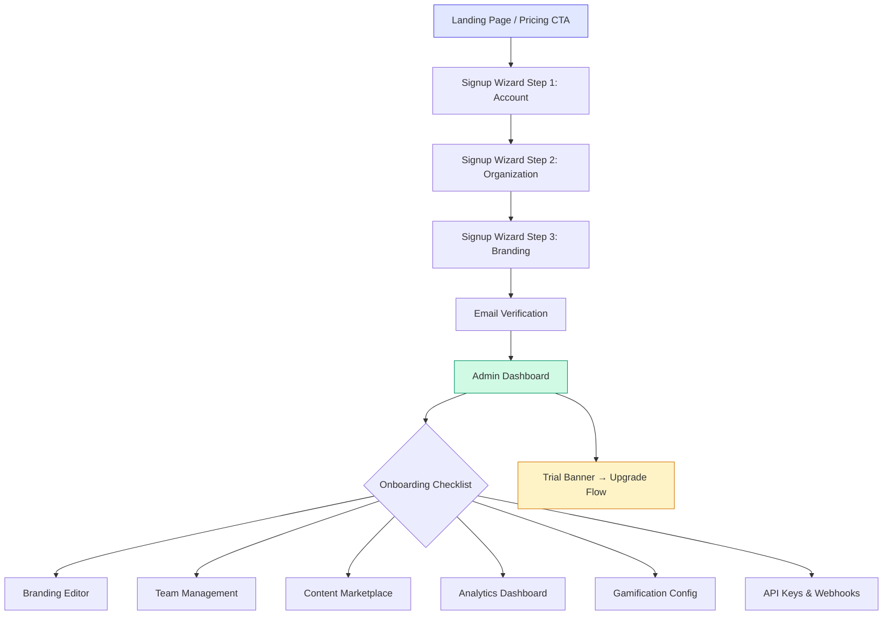
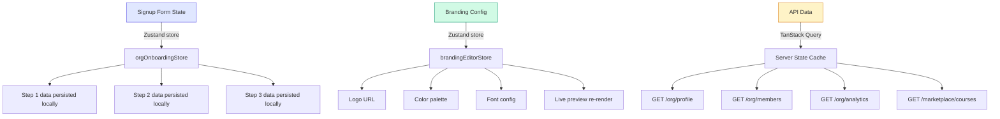

# FEAT-ORG-ONBOARDING — UX/UI Design Document

> **Feature:** Organization Self-Service Onboarding & White-Label Platform
> **Author:** UX/UI Design Division
> **Date:** 2026-03-22
> **Status:** Draft
> **Competitors analyzed:** Docebo, TalentLMS, Thinkific, Canvas LMS, Udemy Business, Coursera for Business

---

## Table of Contents

1. [Signup Wizard (3 Steps)](#1-signup-wizard)
2. [Admin Dashboard](#2-admin-dashboard)
3. [Branding Editor](#3-branding-editor)
4. [Content Marketplace Browse](#4-content-marketplace-browse)
5. [Analytics Dashboard](#5-analytics-dashboard)
6. [Team Management](#6-team-management)
7. [Gamification Config](#7-gamification-config)
8. [API Keys & Webhooks](#8-api-keys--webhooks)
9. [Onboarding Checklist Widget](#9-onboarding-checklist-widget)
10. [Trial Banner](#10-trial-banner)
11. [Accessibility (WCAG 2.1 AA)](#11-accessibility)
12. [Responsive Breakpoints](#12-responsive-breakpoints)
13. [i18n Considerations](#13-i18n-considerations)
14. [Design System Mapping](#14-design-system-mapping)

---

## Design Principles

| Principle                  | Description                                                                       |
| -------------------------- | --------------------------------------------------------------------------------- |
| **Progressive Disclosure** | Show only what's needed at each step; advanced options behind expandable sections |
| **Immediate Feedback**     | Real-time validation, live previews, optimistic UI updates                        |
| **Minimal Time-to-Value**  | Org admin sees branded portal within 5 minutes of signup                          |
| **Mobile-First**           | All flows usable on mobile; admin tasks optimized for desktop                     |
| **Consistency**            | Use existing shadcn/ui components; no custom UI unless required                   |

---

## User Flow Overview



---

## 1. Signup Wizard

**Route:** `/signup/organization`
**Components:** Card, Input, Button, Checkbox, Select, Progress (stepper)

### Progress Stepper (Top of all 3 steps)

```
┌──────────────────────────────────────────────────────────────────────┐
│                                                                      │
│   ● Account ─────────── ○ Organization ─────────── ○ Branding       │
│   Step 1                 Step 2                      Step 3          │
│                                                                      │
└──────────────────────────────────────────────────────────────────────┘

States:
  ● = completed (filled circle, primary color, checkmark icon)
  ◉ = active (filled circle, primary color, pulsing ring)
  ○ = pending (outlined circle, muted color)
  ─── = connector line (solid = completed, dashed = pending)
```

### Step 1 — Account Creation

```
┌──────────────────────────────────────────────────────────────────────┐
│  ◉ Account ──────────── ○ Organization ──────────── ○ Branding      │
├──────────────────────────────────────────────────────────────────────┤
│                                                                      │
│                    Create Your Account                                │
│              Join thousands of organizations using EduSphere          │
│                                                                      │
│  ┌────────────────────────────────────────────────────────────────┐  │
│  │  Full Name                                                     │  │
│  │  ┌──────────────────────────────────────────────────────────┐  │  │
│  │  │  John Smith                                              │  │  │
│  │  └──────────────────────────────────────────────────────────┘  │  │
│  │                                                                │  │
│  │  Work Email                                                    │  │
│  │  ┌──────────────────────────────────────────────────────────┐  │  │
│  │  │  john@company.com                           ✓ Valid      │  │  │
│  │  └──────────────────────────────────────────────────────────┘  │  │
│  │                                                                │  │
│  │  Password                                                      │  │
│  │  ┌──────────────────────────────────────────────────────────┐  │  │
│  │  │  ••••••••••••                                👁 Toggle   │  │  │
│  │  └──────────────────────────────────────────────────────────┘  │  │
│  │  Strength: [████████░░░░] Strong                               │  │
│  │  ✓ 8+ characters  ✓ Uppercase  ✓ Number  ○ Special char       │  │
│  │                                                                │  │
│  │  ☑ I agree to the Terms of Service and Privacy Policy          │  │
│  │  ☑ I consent to data processing per GDPR (required)            │  │
│  │                                                                │  │
│  │  ┌──────────────────────────────────────────────────────────┐  │  │
│  │  │                    Next →                                │  │  │
│  │  └──────────────────────────────────────────────────────────┘  │  │
│  │                                                                │  │
│  │  Already have an account? Log in                               │  │
│  └────────────────────────────────────────────────────────────────┘  │
│                                                                      │
│  ┌──────────────────────────────────────────────────────────────┐    │
│  │  OR continue with:                                           │    │
│  │  [Google] [Microsoft] [SSO]                                  │    │
│  └──────────────────────────────────────────────────────────────┘    │
└──────────────────────────────────────────────────────────────────────┘
```

**Interactions:**

- Email: debounced validation (300ms), checks format + availability via API
- Password: real-time strength meter updates on each keystroke
- Strength meter colors: red (weak) → orange (fair) → yellow (good) → green (strong)
- "Next" disabled until all fields valid + both checkboxes checked
- Social login buttons: Google, Microsoft, enterprise SSO (redirects to IdP)

**Validation Rules:**
| Field | Rule | Error Message |
|-------|------|---------------|
| Name | 2-100 chars, no special chars | `orgOnboarding.nameRequired` |
| Email | RFC 5322 format, not disposable domain | `orgOnboarding.emailInvalid` |
| Password | Min 8 chars, 1 upper, 1 number, 1 special | `orgOnboarding.passwordWeak` |
| ToS | Must be checked | `orgOnboarding.tosRequired` |
| GDPR | Must be checked | `orgOnboarding.gdprRequired` |

### Step 2 — Organization Details

```
┌──────────────────────────────────────────────────────────────────────┐
│  ● Account ──────────── ◉ Organization ──────────── ○ Branding      │
├──────────────────────────────────────────────────────────────────────┤
│                                                                      │
│                  Tell Us About Your Organization                     │
│                                                                      │
│  ┌────────────────────────────────────────────────────────────────┐  │
│  │  Organization Name                                             │  │
│  │  ┌──────────────────────────────────────────────────────────┐  │  │
│  │  │  Acme Corporation                                        │  │  │
│  │  └──────────────────────────────────────────────────────────┘  │  │
│  │                                                                │  │
│  │  Your Portal URL                                               │  │
│  │  ┌──────────────────────────────┐                              │  │
│  │  │  acme-corporation           │ .edusphere.com   ✓ Available │  │
│  │  └──────────────────────────────┘                              │  │
│  │  💡 Auto-generated from org name. You can customize it.        │  │
│  │                                                                │  │
│  │  Industry                                                      │  │
│  │  ┌──────────────────────────────────────────────────────────┐  │  │
│  │  │  Technology                                          ▼   │  │  │
│  │  └──────────────────────────────────────────────────────────┘  │  │
│  │                                                                │  │
│  │  Organization Size                                             │  │
│  │  ┌─────────┐ ┌─────────┐ ┌──────────┐ ┌──────────┐ ┌──────┐  │  │
│  │  │  1-10   │ │  11-50  │ │  51-200  │ │ 201-1000 │ │1000+ │  │  │
│  │  │   ◉     │ │   ○     │ │    ○     │ │    ○     │ │  ○   │  │  │
│  │  └─────────┘ └─────────┘ └──────────┘ └──────────┘ └──────┘  │  │
│  │                                                                │  │
│  │  Country / Region                                              │  │
│  │  ┌──────────────────────────────────────────────────────────┐  │  │
│  │  │  🇮🇱 Israel                                          ▼   │  │  │
│  │  └──────────────────────────────────────────────────────────┘  │  │
│  │                                                                │  │
│  │  ┌──────────┐  ┌─────────────────────────────────────────┐    │  │
│  │  │ ← Back   │  │              Next →                     │    │  │
│  │  └──────────┘  └─────────────────────────────────────────┘    │  │
│  └────────────────────────────────────────────────────────────────┘  │
└──────────────────────────────────────────────────────────────────────┘
```

**Interactions:**

- Org name → slug auto-generation: `"Acme Corporation"` → `acme-corporation`
- Slug: debounced availability check (500ms) via `GET /api/orgs/slug-check/:slug`
- Slug field editable — user can customize, re-checks availability on change
- Availability indicator: green checkmark (available), red X with suggestion (taken)
- Industry dropdown: 15 options (Technology, Education, Healthcare, Finance, Government, Non-profit, Retail, Manufacturing, Media, Legal, Consulting, Real Estate, Energy, Transportation, Other)
- Org size: radio button group styled as segmented control
- Country: searchable dropdown with flag emojis, auto-detected from browser locale

**Slug Generation Rules:**

```
Input: "Acme Corporation & Partners"
1. toLowerCase()        → "acme corporation & partners"
2. replace non-alnum    → "acme-corporation---partners"
3. collapse hyphens     → "acme-corporation-partners"
4. trim hyphens         → "acme-corporation-partners"
5. max 63 chars         → truncate if needed (DNS label limit)
```

### Step 3 — Initial Branding

```
┌──────────────────────────────────────────────────────────────────────┐
│  ● Account ──────────── ● Organization ──────────── ◉ Branding      │
├──────────────────────────────────────────────────────────────────────┤
│                                                                      │
│           Make It Yours — Customize Your Portal                      │
│                                                                      │
│  ┌──────────────────────────┐  ┌─────────────────────────────────┐  │
│  │  CONFIGURATION            │  │  LIVE PREVIEW                   │  │
│  │                           │  │                                 │  │
│  │  Logo                     │  │  ┌─────────────────────────┐   │  │
│  │  ┌───────────────────┐   │  │  │  ┌──┐                    │   │  │
│  │  │                   │   │  │  │  │🖼│ Acme Corporation    │   │  │
│  │  │   📁 Drop your    │   │  │  │  └──┘                    │   │  │
│  │  │   logo here or    │   │  │  │                           │   │  │
│  │  │   click to browse │   │  │  │  ┌─────────────────────┐ │   │  │
│  │  │                   │   │  │  │  │                     │ │   │  │
│  │  │  PNG, SVG, JPEG   │   │  │  │  │   Welcome to        │ │   │  │
│  │  │  Max 2MB          │   │  │  │  │   Acme Corporation  │ │   │  │
│  │  └───────────────────┘   │  │  │  │   Learning Portal   │ │   │  │
│  │                           │  │  │  │                     │ │   │  │
│  │  Primary Color            │  │  │  │  [Email         ]   │ │   │  │
│  │  ┌───┐ ┌───┐ ┌───┐ ┌───┐│  │  │  │  [Password      ]   │ │   │  │
│  │  │🔵│ │🟢│ │🟣│ │🔴││  │  │  │  │  [  Log In  ]       │ │   │  │
│  │  └───┘ └───┘ └───┘ └───┘│  │  │  │                     │ │   │  │
│  │  ┌───┐ ┌───┐ ┌───┐ ┌───┐│  │  │  │  "Innovation       │ │   │  │
│  │  │🟠│ │⚫│ │🟤│ │🩷││  │  │  │  │   starts with      │ │   │  │
│  │  └───┘ └───┘ └───┘ └───┘│  │  │  │   learning."       │ │   │  │
│  │                           │  │  │  └─────────────────────┘ │   │  │
│  │  Custom: [#4F46E5 ]  🎨  │  │  │                           │   │  │
│  │                           │  │  │  Powered by EduSphere     │   │  │
│  │  Tagline                  │  │  └─────────────────────────────┘ │  │
│  │  ┌───────────────────┐   │  │                                 │  │
│  │  │ Innovation starts │   │  │  Device: [Desktop|Tablet|Mobile]│  │
│  │  │ with learning.    │   │  │                                 │  │
│  │  └───────────────────┘   │  └─────────────────────────────────┘  │
│  │                           │                                       │
│  │  ┌──────┐ ┌────────────┐ │  ☑ Skip for now — I'll set this up  │
│  │  │← Back│ │Launch Portal│ │    later from Settings               │
│  │  └──────┘ └────────────┘ │                                       │
│  └──────────────────────────┘                                       │
└──────────────────────────────────────────────────────────────────────┘
```

**Interactions:**

- Logo upload: drag & drop zone, click to open file picker, preview thumbnail after upload
- Logo validation: max 2MB, accepted formats: PNG, SVG, JPEG; shows error toast if invalid
- Color presets: 8 curated palettes (Indigo, Emerald, Violet, Rose, Amber, Slate, Brown, Pink)
- Custom hex input: validates hex format, live preview updates on blur
- Tagline: max 120 chars, optional, appears on login page
- Live preview: updates in real-time (debounced 100ms) as user changes logo/color/tagline
- Device toggle: switches preview between desktop (default), tablet, mobile mockup frames
- "Skip for now" checkbox: enables "Launch Portal" without completing branding
- "Launch Portal" triggers: org creation API call → redirect to Admin Dashboard

**Color Preset Palette:**
| Preset | Hex | Name |
|--------|-----|------|
| 🔵 | `#4F46E5` | Indigo (default) |
| 🟢 | `#059669` | Emerald |
| 🟣 | `#7C3AED` | Violet |
| 🔴 | `#DC2626` | Rose |
| 🟠 | `#D97706` | Amber |
| ⚫ | `#1E293B` | Slate |
| 🟤 | `#92400E` | Brown |
| 🩷 | `#DB2777` | Pink |

---

## 2. Admin Dashboard

**Route:** `/admin` (org admin role required)
**Components:** Card, Table, Badge, Button, DropdownMenu, Avatar, Tooltip

```
┌──────────────────────────────────────────────────────────────────────────────┐
│ ⚠ 14 days remaining in your free trial. Upgrade now → [Upgrade] [✕]        │
├────────────┬─────────────────────────────────────────────────────────────────┤
│            │  ┌──┐                                                          │
│  EduSphere │  │🖼│ Acme Corp    👤 John Smith ▼    🔔 3    ⚙             │
│            │  └──┘                                                          │
│  ──────────┤─────────────────────────────────────────────────────────────────┤
│            │                                                                 │
│  🏠 Home   │  Welcome back, John! Here's your organization overview.        │
│            │                                                                 │
│  👥 Team   │  ┌──────────┐ ┌──────────┐ ┌──────────┐ ┌──────────┐          │
│            │  │ 👥 127   │ │ 📊 73%   │ │ 📚 24    │ │ 💾 2.1GB │          │
│  📚 Content│  │ Active   │ │ Completion│ │ Courses  │ │ Storage  │          │
│            │  │ Learners │ │ Rate     │ │ Total    │ │ Used     │          │
│  🛒 Market │  │ ↑12% ▲  │ │ ↑5% ▲   │ │ +3 new   │ │ of 10GB  │          │
│            │  └──────────┘ └──────────┘ └──────────┘ └──────────┘          │
│  📊 Analy. │                                                                │
│            │  ┌─────────────────────────────────────┬────────────────────┐  │
│  🎨 Brand  │  │  Recent Activity                    │ Quick Actions      │  │
│            │  │                                     │                    │  │
│  🎮 Gamif. │  │  🟢 Sarah joined "Data Science"    │ ┌────────────────┐ │  │
│            │  │     2 minutes ago                   │ │ 👥 Invite Users│ │  │
│  🔑 API    │  │                                     │ └────────────────┘ │  │
│            │  │  🟢 Mike completed "React Basics"   │ ┌────────────────┐ │  │
│  ⚙ Settings│  │     15 minutes ago                  │ │ 📚 New Course  │ │  │
│            │  │                                     │ └────────────────┘ │  │
│  ──────────│  │  🟡 3 invitations pending           │ ┌────────────────┐ │  │
│            │  │     1 hour ago                      │ │ 🛒 Marketplace │ │  │
│  📋 Setup  │  │                                     │ └────────────────┘ │  │
│  Guide     │  │  🏆 Team "Engineering" unlocked     │ ┌────────────────┐ │  │
│  3/6 ◔     │  │     "Fast Learners" badge           │ │ 📊 Analytics   │ │  │
│            │  │     3 hours ago                     │ └────────────────┘ │  │
│            │  │                                     │ ┌────────────────┐ │  │
│            │  │  📝 Course "AI Fundamentals"        │ │ 🎨 Branding    │ │  │
│            │  │     published by Admin              │ └────────────────┘ │  │
│            │  │     yesterday                       │                    │  │
│            │  └─────────────────────────────────────┴────────────────────┘  │
│            │                                                                │
└────────────┴────────────────────────────────────────────────────────────────┘
```

**KPI Cards Detail:**
| Card | Metric | Trend | Icon | Color |
|------|--------|-------|------|-------|
| Active Learners | Count of users active in last 7d | ↑/↓ vs previous 7d | `Users` | Blue |
| Completion Rate | Avg course completion % | ↑/↓ vs previous 30d | `BarChart` | Green |
| Total Courses | Licensed + created courses | New this month | `BookOpen` | Purple |
| Storage Used | MB/GB of uploaded content | Of total quota | `HardDrive` | Orange |
| Trial Days (if trial) | Days remaining | Urgency color | `Clock` | Yellow→Red |

**Recent Activity Feed:**

- Max 10 items, newest first
- Event types: user_joined, course_completed, invitation_pending, badge_earned, course_published, user_removed
- Each item: colored dot (green=positive, yellow=info, red=alert) + description + relative time
- "View All" link at bottom → navigates to full activity log

**Quick Actions Grid:**

- 5 action cards, each navigates to respective admin page
- Icons match sidebar nav for consistency
- Tooltip on hover shows description

**Sidebar:**

- Collapsible (chevron toggle at bottom)
- Collapsed state: icons only with tooltips
- Active item: highlighted background + bold text
- Setup Guide at bottom with progress ring

---

## 3. Branding Editor

**Route:** `/admin/branding`
**Components:** Tabs, Input, Button, Card, Switch, Textarea, Tooltip

```
┌──────────────────────────────────────────────────────────────────────────────┐
│  Branding Editor                                        [Save] [Reset]      │
├──────────────────────────────────────┬───────────────────────────────────────┤
│  CONFIGURATION                       │  LIVE PREVIEW                         │
│                                      │                                       │
│  ┌──────┬────────┬───────┬────────┐ │  Device: [🖥 Desktop] [📱 Tablet] [📲]│
│  │ Logo │ Colors │ Fonts │Advanced│ │                                       │
│  └──────┴────────┴───────┴────────┘ │  ┌───────────────────────────────────┐│
│                                      │  │                                   ││
│  ── Logo Tab ──                      │  │   ┌──┐                            ││
│                                      │  │   │🖼│  Acme Corporation          ││
│  Main Logo (header, login)           │  │   └──┘                            ││
│  ┌────────────────────────────────┐ │  │                                   ││
│  │                                │ │  │   ┌─────────────────────────┐     ││
│  │   📁 Drop logo here           │ │  │   │                         │     ││
│  │   or click to upload          │ │  │   │   Welcome to            │     ││
│  │                                │ │  │   │   Acme Corporation     │     ││
│  │   PNG, SVG, JPEG · Max 2MB    │ │  │   │   Learning Portal      │     ││
│  └────────────────────────────────┘ │  │   │                         │     ││
│  Recommended: 200×50px              │  │   │   [Email            ]   │     ││
│                                      │  │   │   [Password         ]   │     ││
│  Logo Mark (favicon, mobile)         │  │   │   [    Log In       ]   │     ││
│  ┌────────────────────────────────┐ │  │   │                         │     ││
│  │   📁 Drop icon here           │ │  │   │   "Innovation starts    │     ││
│  │   Square, 128×128px min       │ │  │   │    with learning."      │     ││
│  └────────────────────────────────┘ │  │   └─────────────────────────┘     ││
│                                      │  │                                   ││
│  Favicon (browser tab)               │  │   Powered by EduSphere            ││
│  ┌────────────────────────────────┐ │  └───────────────────────────────────┘│
│  │   📁 .ico or .png, 32×32px    │ │                                       │
│  └────────────────────────────────┘ │  Page: [Login ▼]                      │
│                                      │  (Login | Dashboard | Course | Cert)  │
└──────────────────────────────────────┴───────────────────────────────────────┘
```

**Colors Tab:**

```
┌──────────────────────────────────────┐
│  ── Colors Tab ──                     │
│                                       │
│  Primary Color          [#4F46E5 ] 🎨│
│  ████████████████████                 │
│  Used for: buttons, links, active nav │
│                                       │
│  Secondary Color        [#059669 ] 🎨│
│  ████████████████████                 │
│  Used for: accents, badges, progress  │
│                                       │
│  Accent Color           [#D97706 ] 🎨│
│  ████████████████████                 │
│  Used for: alerts, highlights, CTAs   │
│                                       │
│  Background Color       [#FFFFFF ] 🎨│
│  ████████████████████                 │
│  Used for: page backgrounds           │
│                                       │
│  ── Presets ──                         │
│  [Corporate Blue] [Forest] [Sunset]   │
│  [Minimal] [Dark Mode] [Ocean]        │
│                                       │
│  Contrast Check:                      │
│  ✓ Primary on white: 7.2:1 (AAA)     │
│  ✓ Primary on dark: 5.1:1 (AA)       │
│  ⚠ Accent on white: 3.8:1 (fail)     │
│    → Suggest: #B45309 (4.6:1 AA) ✓   │
└───────────────────────────────────────┘
```

**Fonts Tab:**

```
┌───────────────────────────────────────┐
│  ── Fonts Tab ──                       │
│                                        │
│  Heading Font                          │
│  ┌──────────────────────────────────┐ │
│  │  Inter                        ▼  │ │
│  └──────────────────────────────────┘ │
│  Preview: The Quick Brown Fox         │
│  AaBbCcDdEeFfGg 1234567890           │
│                                        │
│  Body Font                             │
│  ┌──────────────────────────────────┐ │
│  │  Inter                        ▼  │ │
│  └──────────────────────────────────┘ │
│  Preview: The quick brown fox jumps   │
│  over the lazy dog. 1234567890.       │
│                                        │
│  Font Size Scale                       │
│  ○ Compact  ◉ Default  ○ Large        │
│                                        │
│  Available: Inter, Roboto, Open Sans,  │
│  Lato, Poppins, Montserrat, Nunito,   │
│  Source Sans Pro, Rubik (Hebrew),      │
│  Noto Sans Hebrew                      │
└────────────────────────────────────────┘
```

**Advanced Tab:**

```
┌───────────────────────────────────────┐
│  ── Advanced Tab ──                    │
│                                        │
│  Custom CSS (applied to portal)        │
│  ┌──────────────────────────────────┐ │
│  │  /* Override specific styles */   │ │
│  │  .login-card {                    │ │
│  │    border-radius: 16px;           │ │
│  │  }                                │ │
│  │                                   │ │
│  └──────────────────────────────────┘ │
│  ⚠ Advanced: CSS is sanitized.        │
│  Forbidden: @import, url(), position   │
│                                        │
│  "Powered by EduSphere" Badge          │
│  [ON ●━━━━━━━━━ ] Show                │
│  ℹ Free/Starter plans: always shown    │
│  ℹ Business/Enterprise: can hide       │
│                                        │
│  Custom Login Background               │
│  ┌──────────────────────────────────┐ │
│  │   📁 Upload background image     │ │
│  │   JPG/PNG · Max 5MB · 1920×1080  │ │
│  └──────────────────────────────────┘ │
│                                        │
│  Login Page Layout                     │
│  ○ Centered Card  ◉ Split (Left/Right) │
│  ○ Full Background                     │
└────────────────────────────────────────┘
```

---

## 4. Content Marketplace Browse

**Route:** `/admin/marketplace`
**Components:** Input, Select, Card, Badge, Button, ScrollArea, Tabs

```
┌──────────────────────────────────────────────────────────────────────────────┐
│  Content Marketplace                                                         │
│                                                                              │
│  ┌────────────────────────────────────────────────────────────────┐          │
│  │  🔍 Search courses, topics, authors...               [Search] │          │
│  └────────────────────────────────────────────────────────────────┘          │
│                                                                              │
│  Filters:                                                                    │
│  [Category ▼] [Difficulty ▼] [Language ▼] [Rating ▼] [Price ▼] [Clear All] │
│                                                                              │
│  ── Curated Collections ──                                          See All │
│  ┌─────────────┐ ┌─────────────┐ ┌─────────────┐ ┌─────────────┐          │
│  │ 🚀 Popular  │ │ 🆕 New This │ │ 💼 Business │ │ 🤖 AI &     │  ← →    │
│  │    This     │ │    Month    │ │   Skills    │ │    Data     │          │
│  │    Month    │ │             │ │             │ │    Science  │          │
│  └─────────────┘ └─────────────┘ └─────────────┘ └─────────────┘          │
│                                                                              │
│  ── All Courses ──                                    Sort: [Relevance ▼]   │
│                                                                              │
│  ┌────────────────────┐ ┌────────────────────┐ ┌────────────────────┐       │
│  │ ┌──────────────┐   │ │ ┌──────────────┐   │ │ ┌──────────────┐   │       │
│  │ │  Thumbnail   │   │ │ │  Thumbnail   │   │ │ │  Thumbnail   │   │       │
│  │ │              │   │ │ │              │   │ │ │              │   │       │
│  │ └──────────────┘   │ │ └──────────────┘   │ │ └──────────────┘   │       │
│  │                     │ │                     │ │                     │       │
│  │ Machine Learning    │ │ Leadership 101     │ │ Data Analytics     │       │
│  │ Fundamentals        │ │                     │ │ with Python        │       │
│  │                     │ │ Prof. Jane Smith    │ │                     │       │
│  │ Dr. Alex Chen       │ │ ★★★★★ (342)        │ │ DataCamp           │       │
│  │ ★★★★☆ (1,247)       │ │ 👥 5,890 enrolled  │ │ ★★★★☆ (891)        │       │
│  │ 👥 12,340 enrolled  │ │                     │ │ 👥 8,120 enrolled  │       │
│  │                     │ │ Beginner · 4 hrs    │ │                     │       │
│  │ Intermediate · 8hrs │ │                     │ │ Intermediate · 6hrs│       │
│  │                     │ │ $29/seat/yr         │ │                     │       │
│  │ $49/seat/yr         │ │                     │ │ $39/seat/yr         │       │
│  │                     │ │ [License for Org]   │ │                     │       │
│  │ [License for Org]   │ │                     │ │ [License for Org]   │       │
│  └────────────────────┘ └────────────────────┘ └────────────────────┘       │
│                                                                              │
│  ┌──────────────────────────────────────────────────────────────────┐       │
│  │  ◀  1  2  3  4  5  ...  12  ▶                        Page 1/12 │       │
│  └──────────────────────────────────────────────────────────────────┘       │
└──────────────────────────────────────────────────────────────────────────────┘
```

**Course Card Anatomy:**

```
┌────────────────────────┐
│ ┌────────────────────┐ │
│ │    THUMBNAIL       │ │  ← 16:9 aspect ratio, lazy loaded
│ │    (placeholder    │ │
│ │     skeleton)      │ │
│ └────────────────────┘ │
│ [Beginner] [AI]        │  ← Badge chips (difficulty + category)
│                        │
│ Course Title Here      │  ← Max 2 lines, ellipsis overflow
│                        │
│ Author Name            │  ← Avatar + name
│ ★★★★☆ 4.2 (1,247)     │  ← Star rating + count
│ 👥 12,340 enrolled     │  ← Social proof
│                        │
│ Intermediate · 8 hrs   │  ← Difficulty dot + duration
│                        │
│ $49/seat/yr            │  ← Price (or "Included in plan")
│ ┌────────────────────┐ │
│ │ License for Org    │ │  ← Primary CTA button
│ └────────────────────┘ │
└────────────────────────┘
```

**Filter Options:**
| Filter | Options |
|--------|---------|
| Category | Technology, Business, Design, Marketing, Data Science, Leadership, Compliance, Health & Safety, Languages, Soft Skills |
| Difficulty | Beginner, Intermediate, Advanced, All Levels |
| Language | English, Spanish, French, Hebrew, Portuguese, Hindi, + 4 more |
| Rating | 4.5+, 4.0+, 3.5+, Any |
| Price | Free, Under $25, $25-50, $50-100, $100+ |

---

## 5. Analytics Dashboard

**Route:** `/admin/analytics`
**Components:** Card, Table, Select, Button, Tabs, Badge

```
┌──────────────────────────────────────────────────────────────────────────────┐
│  Analytics Dashboard                                                         │
│                                                                              │
│  Date Range: [Last 30 days ▼]  Department: [All ▼]  [Export CSV] [Export PDF]│
│                                                                              │
│  ┌──────────────┐ ┌──────────────┐ ┌──────────────┐ ┌──────────────┐       │
│  │ 👥 Active     │ │ 📊 Completion│ │ ⏱ Avg Time   │ │ 📚 Courses   │       │
│  │   Learners   │ │   Rate       │ │   per Course │ │   Active     │       │
│  │              │ │              │ │              │ │              │       │
│  │   127 / 150  │ │   73.2%      │ │   4.5 hrs    │ │   24         │       │
│  │   ↑12% ▲     │ │   ↑5.1% ▲   │ │   ↓8% ▽     │ │   +3 new     │       │
│  │   vs prev 30d│ │   vs prev 30d│ │   improving  │ │   this month │       │
│  └──────────────┘ └──────────────┘ └──────────────┘ └──────────────┘       │
│                                                                              │
│  ┌────────────────────────────────────┐ ┌──────────────────────────────────┐│
│  │  Completion Trend                  │ │  Enrollments by Department      ││
│  │                                    │ │                                  ││
│  │  100%│                        ╱──  │ │  Engineering   ████████████ 45  ││
│  │   80%│              ╱────────╱     │ │  Sales         ████████    32  ││
│  │   60%│       ╱─────╱               │ │  Marketing     ██████      24  ││
│  │   40%│ ╱────╱                      │ │  Support       ████        16  ││
│  │   20%│╱                            │ │  HR            ███         10  ││
│  │    0%└───────────────────────      │ │                                  ││
│  │      W1  W2  W3  W4  W5  W6       │ │                                  ││
│  └────────────────────────────────────┘ └──────────────────────────────────┘│
│                                                                              │
│  ── User Progress ──                                      [Search users 🔍] │
│  ┌──────────────────────────────────────────────────────────────────────────┐│
│  │ Name ▼        │ Courses │ % Complete │ Last Active ▼│ Quiz Avg │ Action ││
│  ├───────────────┼─────────┼────────────┼──────────────┼──────────┼────────┤│
│  │ Sarah Cohen   │    5    │ ████░ 82%  │ 2 min ago    │  91%     │ View → ││
│  │ Mike Johnson  │    3    │ ███░░ 65%  │ 1 hour ago   │  78%     │ View → ││
│  │ Lisa Wang     │    7    │ █████ 100% │ yesterday    │  95%     │ View → ││
│  │ Ahmed Hassan  │    2    │ ██░░░ 40%  │ 3 days ago   │  67%     │ View → ││
│  │ Emily Brown   │    4    │ ████░ 78%  │ today        │  85%     │ View → ││
│  ├───────────────┴─────────┴────────────┴──────────────┴──────────┴────────┤│
│  │  ◀  1  2  3  ...  8  ▶                           Showing 1-10 of 127  ││
│  └──────────────────────────────────────────────────────────────────────────┘│
└──────────────────────────────────────────────────────────────────────────────┘
```

**Chart Specifications:**
| Chart | Type | Library | Data Points |
|-------|------|---------|-------------|
| Completion Trend | Line chart | Recharts `<LineChart>` | Weekly aggregates, 6-12 weeks |
| Enrollments by Dept | Horizontal bar | Recharts `<BarChart layout="vertical">` | Top 5-10 departments |

**Table Columns:**
| Column | Sortable | Format |
|--------|----------|--------|
| Name | Yes (alpha) | Avatar + full name |
| Courses Enrolled | Yes (numeric) | Integer count |
| % Complete | Yes (numeric) | Progress bar + percentage |
| Last Active | Yes (date) | Relative time (ago format) |
| Quiz Average | Yes (numeric) | Percentage with color coding |
| Action | No | "View" link → user detail page |

**Mobile Layout:**

- KPI cards: 2×2 grid, swipeable
- Charts: full width, stacked vertically, swipeable between chart types
- Table: replaced with card list (one card per user), sortable header dropdown

---

## 6. Team Management

**Route:** `/admin/team`
**Components:** Tabs, Table, Input, Select, Button, Badge, Dialog

```
┌──────────────────────────────────────────────────────────────────────────────┐
│  Team Management                                              [Invite User] │
│                                                                              │
│  ┌──────────┬──────────────┬────────────┐                                   │
│  │ Members  │ Invitations  │ CSV Import │                                   │
│  └──────────┴──────────────┴────────────┘                                   │
│                                                                              │
│  ── Members Tab ──                                                           │
│                                                                              │
│  🔍 Search by name or email...                     Showing 127 members      │
│                                                                              │
│  ┌──────────────────────────────────────────────────────────────────────────┐│
│  │  Name             │ Email                │ Role       │ Last    │ ⋯     ││
│  │                   │                      │            │ Active  │       ││
│  ├───────────────────┼──────────────────────┼────────────┼─────────┼───────┤│
│  │ 👤 Sarah Cohen    │ sarah@acme.com       │ [Admin ▼]  │ 2m ago  │ ⋯     ││
│  │ 👤 Mike Johnson   │ mike@acme.com        │ [Learner▼] │ 1h ago  │ ⋯     ││
│  │ 👤 Lisa Wang      │ lisa@acme.com        │ [Manager▼] │ today   │ ⋯     ││
│  │ 👤 Ahmed Hassan   │ ahmed@acme.com       │ [Learner▼] │ 3d ago  │ ⋯     ││
│  │ 👤 Emily Brown    │ emily@acme.com       │ [Learner▼] │ today   │ ⋯     ││
│  ├───────────────────┴──────────────────────┴────────────┴─────────┴───────┤│
│  │  ◀  1  2  3  ...  13  ▶                         Showing 1-10 of 127   ││
│  └──────────────────────────────────────────────────────────────────────────┘│
│                                                                              │
│  ⋯ Menu: [Edit Profile] [Reset Password] [Remove from Org]                 │
└──────────────────────────────────────────────────────────────────────────────┘
```

**Invitations Tab:**

```
┌──────────────────────────────────────────────────────────────────────────────┐
│  ── Invitations Tab ──                                                       │
│                                                                              │
│  ┌────────────────────────────────────────────────────────────────────────┐  │
│  │  Invite New Member                                                     │  │
│  │                                                                        │  │
│  │  Email Address                     Role                                │  │
│  │  ┌─────────────────────────┐      ┌────────────┐     ┌──────┐         │  │
│  │  │ user@company.com        │      │ Learner  ▼ │     │ Send │         │  │
│  │  └─────────────────────────┘      └────────────┘     └──────┘         │  │
│  │                                                                        │  │
│  │  ℹ Invitation will be sent via email with a 7-day expiry.              │  │
│  └────────────────────────────────────────────────────────────────────────┘  │
│                                                                              │
│  Pending Invitations (5)                                                     │
│  ┌──────────────────────────────────────────────────────────────────────────┐│
│  │  Email                │ Role     │ Sent        │ Expires   │ Actions   ││
│  ├──────────────────────┼──────────┼─────────────┼───────────┼───────────┤│
│  │  bob@acme.com        │ Learner  │ 2 days ago  │ in 5 days │ [Resend]  ││
│  │                      │          │             │           │ [Revoke]  ││
│  │  carol@acme.com      │ Manager  │ 5 days ago  │ in 2 days │ [Resend]  ││
│  │                      │          │             │           │ [Revoke]  ││
│  │  dave@acme.com       │ Admin    │ 6 days ago  │ in 1 day  │ [Resend]  ││
│  │                      │          │             │ ⚠ Expiring│ [Revoke]  ││
│  └──────────────────────┴──────────┴─────────────┴───────────┴───────────┘│
└──────────────────────────────────────────────────────────────────────────────┘
```

**CSV Import Tab:**

```
┌──────────────────────────────────────────────────────────────────────────────┐
│  ── CSV Import Tab ──                                                        │
│                                                                              │
│  ┌────────────────────────────────────────────────────────────────────────┐  │
│  │                                                                        │  │
│  │          📁 Drop your CSV file here or click to browse                 │  │
│  │                                                                        │  │
│  │          Required columns: name, email, role                           │  │
│  │          Optional: department, title                                   │  │
│  │          [Download Template CSV]                                       │  │
│  │                                                                        │  │
│  └────────────────────────────────────────────────────────────────────────┘  │
│                                                                              │
│  Preview (after upload):                                                     │
│  ┌──────────────────────────────────────────────────────────────────────────┐│
│  │  Row │ Name          │ Email              │ Role    │ Status            ││
│  ├─────┼───────────────┼────────────────────┼─────────┼───────────────────┤│
│  │  1  │ Bob Smith     │ bob@acme.com       │ Learner │ ✓ Valid           ││
│  │  2  │ Carol Lee     │ carol@acme.com     │ Manager │ ✓ Valid           ││
│  │  3  │ Dave Wilson   │ invalid-email      │ Learner │ ✗ Invalid email   ││
│  │  4  │               │ empty@acme.com     │ Admin   │ ✗ Name required   ││
│  │  5  │ Eve Adams     │ eve@acme.com       │ Learner │ ✓ Valid           ││
│  └─────┴───────────────┴────────────────────┴─────────┴───────────────────┘│
│                                                                              │
│  3 valid · 2 errors · Errors will be skipped                                │
│                                                                              │
│  ┌───────────────────────────────┐                                          │
│  │  Import 3 Valid Members       │    [Cancel]                              │
│  └───────────────────────────────┘                                          │
└──────────────────────────────────────────────────────────────────────────────┘
```

**Role Options:**
| Role | Permissions |
|------|-------------|
| Learner | Browse & enroll in courses, earn badges, view own progress |
| Manager | Learner + view team analytics, assign courses |
| Admin | Manager + manage users, branding, settings, billing |

---

## 7. Gamification Config

**Route:** `/admin/gamification`
**Components:** Switch, Card, Input, Button, Dialog, Badge, Tabs, Table

```
┌──────────────────────────────────────────────────────────────────────────────┐
│  Gamification Settings                                                       │
│                                                                              │
│  Enable Gamification  [━━━━━━━━━● ON]                                       │
│  ℹ When enabled, learners earn XP, badges, and appear on leaderboards.      │
│                                                                              │
│  ┌────────────────┬──────────────────┬───────────────────┐                  │
│  │  XP Rules      │  Custom Badges   │  Leaderboard      │                  │
│  └────────────────┴──────────────────┴───────────────────┘                  │
│                                                                              │
│  ── XP Rules Tab ──                                                          │
│                                                                              │
│  ┌──────────────────────────────────────────────────────────────────────────┐│
│  │  Action                    │ XP Points │ Cooldown  │ Status             ││
│  ├────────────────────────────┼───────────┼───────────┼────────────────────┤│
│  │  Complete a lesson         │ [10    ]  │ None      │ [ON ●━━]           ││
│  │  Complete a course         │ [100   ]  │ None      │ [ON ●━━]           ││
│  │  Pass a quiz (>70%)       │ [25    ]  │ None      │ [ON ●━━]           ││
│  │  Perfect quiz score        │ [50    ]  │ None      │ [ON ●━━]           ││
│  │  Daily login streak        │ [5     ]  │ 24hrs     │ [ON ●━━]           ││
│  │  Post a discussion         │ [10    ]  │ 1hr       │ [━━━○ OFF]         ││
│  │  Help a peer (upvoted)    │ [15    ]  │ None      │ [ON ●━━]           ││
│  │  Earn a certificate        │ [200   ]  │ None      │ [ON ●━━]           ││
│  └────────────────────────────┴───────────┴───────────┴────────────────────┘│
│                                                                              │
│  [Reset to Defaults]                                          [Save Changes]│
└──────────────────────────────────────────────────────────────────────────────┘
```

**Custom Badges Tab:**

```
┌──────────────────────────────────────────────────────────────────────────────┐
│  ── Custom Badges Tab ──                                      [Create Badge]│
│                                                                              │
│  ┌──────────┐  ┌──────────┐  ┌──────────┐  ┌──────────┐  ┌──────────┐     │
│  │   🏆     │  │   🎯     │  │   🔥     │  │   📚     │  │   ⭐     │     │
│  │          │  │          │  │          │  │          │  │          │     │
│  │ Fast     │  │ Perfect  │  │ 7-Day    │  │ Bookworm │  │ Top 10%  │     │
│  │ Learner  │  │ Score    │  │ Streak   │  │          │  │          │     │
│  │          │  │          │  │          │  │          │  │          │     │
│  │ Auto     │  │ Auto     │  │ Auto     │  │ Manual   │  │ Auto     │     │
│  │ [Edit]   │  │ [Edit]   │  │ [Edit]   │  │ [Edit]   │  │ [Edit]   │     │
│  └──────────┘  └──────────┘  └──────────┘  └──────────┘  └──────────┘     │
│                                                                              │
└──────────────────────────────────────────────────────────────────────────────┘
```

**Badge Editor Modal:**

```
┌─────────────────────────────────────────────┐
│  Create Custom Badge                    [✕] │
├─────────────────────────────────────────────┤
│                                             │
│  Badge Icon                                 │
│  ┌─────────────────┐                        │
│  │  📁 Upload icon  │   or select emoji:    │
│  │  64×64px, PNG    │   🏆🎯🔥📚⭐🎓🏅💎  │
│  └─────────────────┘                        │
│                                             │
│  Name                                       │
│  ┌───────────────────────────────────────┐  │
│  │  Fast Learner                         │  │
│  └───────────────────────────────────────┘  │
│                                             │
│  Description                                │
│  ┌───────────────────────────────────────┐  │
│  │  Awarded for completing 5 courses in  │  │
│  │  a single week.                       │  │
│  └───────────────────────────────────────┘  │
│                                             │
│  Award Type                                 │
│  ◉ Automatic (based on criteria below)     │
│  ○ Manual (admin awards individually)      │
│                                             │
│  Criteria (if automatic)                    │
│  ┌───────────────────────────────────────┐  │
│  │  When: [Courses Completed ▼]          │  │
│  │  Threshold: [5                    ]   │  │
│  │  Time Window: [7 days ▼]              │  │
│  └───────────────────────────────────────┘  │
│                                             │
│  [Cancel]                     [Create Badge]│
└─────────────────────────────────────────────┘
```

**Leaderboard Tab:**

```
┌──────────────────────────────────────────────────────────────────────────────┐
│  ── Leaderboard Preview ──                                                   │
│                                                                              │
│  Leaderboard Visibility                                                      │
│  ◉ All learners can see     ○ Managers only     ○ Disabled                  │
│                                                                              │
│  Leaderboard Period: [Monthly ▼]   Reset: [Auto-reset each period]          │
│                                                                              │
│  Preview:                                                                    │
│  ┌──────────────────────────────────────────────────────────────────────────┐│
│  │  Rank │ Learner          │ XP      │ Badges │ Streak │ Trend           ││
│  ├──────┼──────────────────┼─────────┼────────┼────────┼─────────────────┤│
│  │  🥇  │ Sarah Cohen      │ 2,450   │ 🏆🎯🔥 │ 14 days│  ↑ +320 XP     ││
│  │  🥈  │ Mike Johnson     │ 2,180   │ 🏆🎯   │ 7 days │  ↑ +180 XP     ││
│  │  🥉  │ Lisa Wang        │ 1,890   │ 🏆     │ 21 days│  ↓ -50 XP      ││
│  │  4   │ Ahmed Hassan     │ 1,650   │ 🎯🔥   │ 3 days │  ↑ +420 XP     ││
│  │  5   │ Emily Brown      │ 1,420   │ 🏆     │ 10 days│  ── no change  ││
│  └──────┴──────────────────┴─────────┴────────┴────────┴─────────────────┘│
└──────────────────────────────────────────────────────────────────────────────┘
```

---

## 8. API Keys & Webhooks

**Route:** `/admin/api`
**Components:** Tabs, Table, Button, Dialog, Checkbox, Input, Badge

```
┌──────────────────────────────────────────────────────────────────────────────┐
│  API Keys & Webhooks                                                         │
│                                                                              │
│  ┌───────────┬────────────┐                                                 │
│  │ API Keys  │ Webhooks   │                                                 │
│  └───────────┴────────────┘                                                 │
│                                                                              │
│  ── API Keys Tab ──                                        [Generate New Key]│
│                                                                              │
│  ┌──────────────────────────────────────────────────────────────────────────┐│
│  │ Name         │ Scopes                      │ Created   │ Last   │Action ││
│  │              │                              │           │ Used   │       ││
│  ├──────────────┼─────────────────────────────┼───────────┼────────┼───────┤│
│  │ Integration  │ [read:users] [read:courses] │ Jan 15    │ 2m ago │[Revoke││
│  │ Key          │ [read:analytics]            │ 2026      │        │       ││
│  ├──────────────┼─────────────────────────────┼───────────┼────────┼───────┤│
│  │ HRIS Sync    │ [read:users] [write:users]  │ Feb 3     │ 1d ago │[Revoke││
│  │              │ [write:enrollments]         │ 2026      │        │       ││
│  ├──────────────┼─────────────────────────────┼───────────┼────────┼───────┤│
│  │ Analytics    │ [read:analytics]            │ Mar 10    │ never  │[Revoke││
│  │ Export       │ [read:courses]              │ 2026      │        │       ││
│  └──────────────┴─────────────────────────────┴───────────┴────────┴───────┘│
│                                                                              │
│  ℹ API keys grant programmatic access to your organization's data.          │
│  ⚠ Revoking a key is immediate and cannot be undone.                        │
└──────────────────────────────────────────────────────────────────────────────┘
```

**Key Generation Modal:**

```
┌─────────────────────────────────────────────┐
│  Generate API Key                       [✕] │
├─────────────────────────────────────────────┤
│                                             │
│  Key Name                                   │
│  ┌───────────────────────────────────────┐  │
│  │  My Integration                       │  │
│  └───────────────────────────────────────┘  │
│                                             │
│  Scopes (select permissions)                │
│  ┌───────────────────────────────────────┐  │
│  │  ☑ read:users                         │  │
│  │  ☐ write:users                        │  │
│  │  ☑ read:courses                       │  │
│  │  ☐ write:courses                      │  │
│  │  ☑ read:analytics                     │  │
│  │  ☐ write:enrollments                  │  │
│  └───────────────────────────────────────┘  │
│                                             │
│  Expiration                                 │
│  ○ Never  ◉ 90 days  ○ 1 year  ○ Custom   │
│                                             │
│  [Cancel]                    [Generate Key] │
└─────────────────────────────────────────────┘
```

**Key Display (shown ONCE after generation):**

```
┌─────────────────────────────────────────────┐
│  🔑 API Key Generated                  [✕] │
├─────────────────────────────────────────────┤
│                                             │
│  ⚠ Copy this key now. It will NOT be       │
│  shown again.                               │
│                                             │
│  ┌───────────────────────────────────────┐  │
│  │ esk_live_a1b2c3d4e5f6g7h8i9j0k1l2m3 │  │
│  │                              [📋Copy] │  │
│  └───────────────────────────────────────┘  │
│                                             │
│  Name: My Integration                       │
│  Scopes: read:users, read:courses,          │
│          read:analytics                     │
│  Expires: June 20, 2026                     │
│                                             │
│  [I've Copied the Key — Close]              │
└─────────────────────────────────────────────┘
```

**Webhooks Tab:**

```
┌──────────────────────────────────────────────────────────────────────────────┐
│  ── Webhooks Tab ──                                       [Add Endpoint]    │
│                                                                              │
│  ┌──────────────────────────────────────────────────────────────────────────┐│
│  │ Endpoint URL           │ Events          │ Status │ Last      │ Actions ││
│  │                        │                 │        │ Delivery  │         ││
│  ├────────────────────────┼─────────────────┼────────┼───────────┼─────────┤│
│  │ https://api.acme.com/  │ user.created    │ 🟢     │ 2m ago    │ [Test]  ││
│  │ webhooks/edusphere     │ user.enrolled   │ Active │ 200 OK    │ [Edit]  ││
│  │                        │ course.completed│        │           │ [Delete]││
│  ├────────────────────────┼─────────────────┼────────┼───────────┼─────────┤│
│  │ https://hooks.slack.   │ badge.earned    │ 🟡     │ 1d ago    │ [Test]  ││
│  │ com/services/T0123     │                 │ Retry  │ 500 Err   │ [Edit]  ││
│  │                        │                 │        │           │ [Delete]││
│  └────────────────────────┴─────────────────┴────────┴───────────┴─────────┘│
│                                                                              │
│  Webhook Events:                                                             │
│  user.created · user.enrolled · user.completed_course · badge.earned ·      │
│  course.published · certificate.issued · user.removed                        │
└──────────────────────────────────────────────────────────────────────────────┘
```

---

## 9. Onboarding Checklist Widget

**Position:** Fixed bottom-right corner, z-index 50
**Components:** Card, Progress (ring), Button, Checkbox

### Collapsed State

```
                                    ┌──────────────────────┐
                                    │  ◔ 3/6   Setup Guide │
                                    └──────────────────────┘
```

### Expanded State

```
                        ┌─────────────────────────────────────────┐
                        │  Setup Guide                     [─ ✕] │
                        │  ◔ 3 of 6 steps complete                │
                        │  [████████████░░░░░░░░░░░] 50%          │
                        │                                         │
                        │  ✓ Upload your logo                     │
                        │    Logo uploaded and applied             │
                        │                                         │
                        │  ✓ Set brand colors                     │
                        │    Primary: #4F46E5 applied              │
                        │                                         │
                        │  ✓ Invite your first team member        │
                        │    3 members invited                     │
                        │                                         │
                        │  ○ Create your first course       [→]   │
                        │    Set up learning content               │
                        │                                         │
                        │  ○ Configure SSO                  [→]   │
                        │    Connect your identity provider        │
                        │                                         │
                        │  ○ Set up billing                 [→]   │
                        │    Choose a plan and payment method      │
                        │                                         │
                        │  ┌───────────────────────────────────┐  │
                        │  │  🎉 Complete setup to unlock all  │  │
                        │  │     features and remove trial     │  │
                        │  │     limitations.                  │  │
                        │  └───────────────────────────────────┘  │
                        └─────────────────────────────────────────┘
```

**Checklist Steps:**
| Step | Page Navigation | Auto-Detection |
|------|-----------------|----------------|
| Upload Logo | `/admin/branding` (Logo tab) | `org.logo_url IS NOT NULL` |
| Set Brand Colors | `/admin/branding` (Colors tab) | `org.primary_color != default` |
| Invite First User | `/admin/team` (Invitations tab) | `org.members.count > 1` |
| Create First Course | `/admin/courses/new` | `org.courses.count > 0` |
| Configure SSO | `/admin/settings/sso` | `org.sso_provider IS NOT NULL` |
| Set Up Billing | `/admin/billing` | `org.subscription IS NOT NULL` |

**Behavior:**

- Widget persists across all admin pages until all 6 steps complete
- Clicking a pending step navigates to the relevant admin page
- Steps auto-check when the corresponding action is completed
- "Dismiss" button (✕) hides widget for the session but it returns on next login
- After all 6 complete: confetti animation + "Setup Complete!" toast, widget hidden permanently

---

## 10. Trial Banner

**Position:** Fixed top of page, above header, full width
**Components:** Alert (custom variant), Button, Badge

### States by Time Remaining

**7+ days (informational — blue):**

```
┌──────────────────────────────────────────────────────────────────────────────┐
│ ℹ  14 days remaining in your free trial.  [Explore Plans]           [✕]     │
└──────────────────────────────────────────────────────────────────────────────┘
```

**3-7 days (warning — yellow/amber):**

```
┌──────────────────────────────────────────────────────────────────────────────┐
│ ⚠  5 days remaining in your free trial. Upgrade to keep your data & users. │
│    [Upgrade Now]  [Compare Plans]                                    [✕]    │
└──────────────────────────────────────────────────────────────────────────────┘
```

**<3 days (urgent — red):**

```
┌──────────────────────────────────────────────────────────────────────────────┐
│ 🔴 Your trial expires in 2 days! Your org data will be archived.            │
│    After expiry, learners lose access. [Upgrade Now]                 [✕]    │
└──────────────────────────────────────────────────────────────────────────────┘
```

**Expired (critical — dark red, non-dismissible):**

```
┌──────────────────────────────────────────────────────────────────────────────┐
│ ⛔ Your trial has expired. Your organization is in read-only mode.           │
│    Learners cannot access courses. [Reactivate Account]                     │
└──────────────────────────────────────────────────────────────────────────────┘
```

**Banner Rules:**
| Days Left | Color | Dismissible | Shows Again |
|-----------|-------|-------------|-------------|
| 7+ | Blue (`bg-blue-50 border-blue-200`) | Yes | After 3 days |
| 3-7 | Amber (`bg-amber-50 border-amber-200`) | Yes | Every login |
| 1-2 | Red (`bg-red-50 border-red-200`) | Yes | Every page nav |
| 0 (expired) | Dark red (`bg-red-100 border-red-400`) | No | Always visible |

---

## 11. Accessibility (WCAG 2.1 AA)

### Global Patterns

| Pattern              | Implementation                                                                    |
| -------------------- | --------------------------------------------------------------------------------- |
| Skip to main content | Hidden link, first focusable element, visible on focus                            |
| Focus indicators     | 2px solid outline, offset 2px, primary color, visible on all interactive elements |
| Focus trap           | Dialogs/modals trap focus; Escape closes                                          |
| Live regions         | Toast notifications use `role="status" aria-live="polite"`                        |
| Error announcements  | Form errors use `aria-describedby` linked to error message, `aria-invalid="true"` |

### Per-Page Keyboard Navigation

**Signup Wizard:**

```
Tab Order: Name → Email → Password → Show/Hide toggle → ToS checkbox → GDPR checkbox → Next button → Social login buttons
- Enter on "Next" submits step
- Escape does nothing (no modal context)
- Password strength meter: aria-live="polite", role="meter", aria-valuenow/min/max
- Step indicator: aria-label="Step 1 of 3: Account Creation, current step"
```

**Admin Dashboard:**

```
Tab Order: Skip link → Sidebar items (top to bottom) → KPI cards (left to right) → Activity feed items → Quick action buttons
- Sidebar: Arrow keys navigate items, Enter activates
- KPI cards: role="group" aria-label="Key performance indicators"
- Activity feed: role="feed" with aria-label, each item role="article"
```

**Branding Editor:**

```
Tab Order: Tab bar → Config panel fields → Preview device toggle → Save → Reset
- Color picker: aria-label="Primary color picker", value announced as hex
- Logo upload: role="button" aria-label="Upload main logo, drag and drop or click to browse"
- Live preview: aria-live="polite" region, announces "Preview updated" on changes
```

**Team Management:**

```
Tab Order: Tab bar → Search field → Table headers (sortable) → Table rows → Pagination
- Sortable columns: aria-sort="ascending|descending|none"
- Role dropdown: aria-label="Change role for [user name]"
- Remove button: aria-label="Remove [user name] from organization"
- CSV upload: role="button" aria-label="Upload CSV file"
```

**Analytics Dashboard:**

```
Tab Order: Date range → Department filter → Export buttons → KPI cards → Charts → Table
- Charts: aria-label with summary text (e.g., "Completion trend chart showing 73% average over 6 weeks")
- Data table: role="table" with proper thead/tbody, sortable headers
```

### Color Contrast Requirements

| Element             | Foreground              | Background         | Ratio  | Passes               |
| ------------------- | ----------------------- | ------------------ | ------ | -------------------- |
| Body text           | `#1E293B` (slate-800)   | `#FFFFFF`          | 12.6:1 | AAA                  |
| Primary button text | `#FFFFFF`               | `#4F46E5` (indigo) | 7.2:1  | AAA                  |
| Secondary text      | `#64748B` (slate-500)   | `#FFFFFF`          | 4.6:1  | AA                   |
| Error text          | `#DC2626` (red-600)     | `#FFFFFF`          | 4.6:1  | AA                   |
| Success text        | `#059669` (emerald-600) | `#FFFFFF`          | 4.8:1  | AA                   |
| Disabled text       | `#94A3B8` (slate-400)   | `#FFFFFF`          | 3.0:1  | Fail → use `#64748B` |

### Screen Reader Labels

| Element           | aria-label / aria-labelledby                           |
| ----------------- | ------------------------------------------------------ |
| Sidebar toggle    | "Toggle navigation sidebar"                            |
| Notification bell | "Notifications, 3 unread"                              |
| KPI card          | "Active learners: 127, up 12 percent from last period" |
| Star rating       | "Rating: 4.2 out of 5 stars, based on 1247 reviews"    |
| Progress bar      | "Course completion: 73 percent"                        |
| Trial banner      | "Trial notification: 14 days remaining"                |
| Onboarding widget | "Setup guide: 3 of 6 steps complete"                   |
| Color swatch      | "Color preset: Indigo, hex 4F46E5"                     |

---

## 12. Responsive Breakpoints

### Breakpoint Definitions

| Name    | Range      | Layout Strategy                                         |
| ------- | ---------- | ------------------------------------------------------- |
| Desktop | ≥1024px    | Sidebar + content + preview (3-column where applicable) |
| Tablet  | 768–1023px | Collapsible sidebar, stacked preview below config       |
| Mobile  | <768px     | Bottom tab nav, single column, swipeable cards          |

### Per-Page Responsive Behavior

**Signup Wizard:**
| Breakpoint | Layout |
|------------|--------|
| Desktop | Centered card (max-width 480px), step 3 side-by-side config/preview |
| Tablet | Centered card (max-width 420px), step 3 stacked config then preview |
| Mobile | Full-width card (padding 16px), step 3 stacked, keyboard-aware scroll |

**Admin Dashboard:**
| Breakpoint | Layout |
|------------|--------|
| Desktop | 240px sidebar + fluid content, KPI cards 4-column, activity+actions side-by-side |
| Tablet | Overlay sidebar (hamburger toggle), KPI cards 2-column, stacked sections |
| Mobile | Bottom tab nav (5 items), KPI cards 2-column swipeable, activity list only |

**Branding Editor:**
| Breakpoint | Layout |
|------------|--------|
| Desktop | 50/50 split (config | preview), both visible |
| Tablet | 55/45 split, preview slightly smaller |
| Mobile | Full-width config, "Preview" floating button opens preview as bottom sheet |

**Content Marketplace:**
| Breakpoint | Layout |
|------------|--------|
| Desktop | 3-column card grid, filter row inline |
| Tablet | 2-column card grid, filter dropdown |
| Mobile | 1-column card list, filter as bottom sheet modal |

**Analytics Dashboard:**
| Breakpoint | Layout |
|------------|--------|
| Desktop | KPI row + 2-column charts + full table |
| Tablet | KPI 2×2 grid + stacked charts + scrollable table |
| Mobile | KPI swipeable row + swipeable charts + card list (no table) |

**Team Management:**
| Breakpoint | Layout |
|------------|--------|
| Desktop | Full table with all columns visible |
| Tablet | Table with horizontal scroll, fewer visible columns |
| Mobile | Card list per member (name, role badge, last active, action menu) |

---

## 13. i18n Considerations

### Namespace Keys

All UI text uses i18n keys from a dedicated namespace. No hardcoded strings anywhere.

**New namespace:** `orgOnboarding`

| Key Pattern                                  | Example                                       | Usage                   |
| -------------------------------------------- | --------------------------------------------- | ----------------------- |
| `orgOnboarding.signup.step1.title`           | "Create Your Account"                         | Step 1 heading          |
| `orgOnboarding.signup.step2.slugAvailable`   | "Available"                                   | Slug check result       |
| `orgOnboarding.dashboard.kpi.activeLearners` | "Active Learners"                             | KPI card title          |
| `orgOnboarding.team.invite.sendButton`       | "Send Invitation"                             | Button text             |
| `orgOnboarding.trial.daysRemaining`          | "{{count}} days remaining in your free trial" | Pluralized trial banner |
| `orgOnboarding.branding.colors.primary`      | "Primary Color"                               | Color picker label      |

### RTL Layout Support (Hebrew)

| Element           | LTR (English)        | RTL (Hebrew)          |
| ----------------- | -------------------- | --------------------- |
| Sidebar           | Left side            | Right side            |
| Progress stepper  | Left → Right         | Right → Left          |
| Text alignment    | Left-aligned         | Right-aligned         |
| Icons before text | Icon on left         | Icon on right         |
| Arrows            | → (next) ← (back)    | ← (next) → (back)     |
| Charts            | Y-axis left          | Y-axis right          |
| Tables            | Left-aligned columns | Right-aligned columns |

**Implementation:**

```
dir="auto" on root element
Tailwind: use `rtl:` prefix variants (e.g., `rtl:flex-row-reverse`)
Logical properties: use `ms-*` / `me-*` instead of `ml-*` / `mr-*`
```

### Date & Number Formatting

| Locale | Date Format       | Number Format | Currency |
| ------ | ----------------- | ------------- | -------- |
| en-US  | Mar 22, 2026      | 1,234.56      | $49.00   |
| he-IL  | 22 במרץ 2026      | 1,234.56      | ₪49.00   |
| es-ES  | 22 mar 2026       | 1.234,56      | €49.00   |
| pt-BR  | 22 de mar de 2026 | 1.234,56      | R$49,00  |
| zh-CN  | 2026年3月22日     | 1,234.56      | ¥49.00   |

**Implementation:** Use `Intl.DateTimeFormat` and `Intl.NumberFormat` with locale from user context. Never format dates/numbers manually.

---

## 14. Design System Mapping

### Existing shadcn/ui Components Used

| Component      | Usage in Feature                                    |
| -------------- | --------------------------------------------------- |
| `Button`       | All CTAs, form submits, nav actions                 |
| `Input`        | Text fields, search bars, hex color input           |
| `Select`       | Dropdowns (industry, country, role, font, etc.)     |
| `Checkbox`     | ToS, GDPR, scope selection                          |
| `Switch`       | Gamification toggle, "Powered by" toggle            |
| `Card`         | KPI cards, course cards, badge cards                |
| `Table`        | Members, invitations, analytics, API keys           |
| `Tabs`         | Branding editor, team management, gamification, API |
| `Dialog`       | Badge editor, key generation, confirmation modals   |
| `Badge`        | Role chips, scope chips, status indicators          |
| `Tooltip`      | Sidebar collapsed labels, info icons                |
| `DropdownMenu` | User menu, member actions, sort options             |
| `Avatar`       | User avatars in tables and activity feed            |
| `Progress`     | Trial banner, onboarding checklist, completion bars |
| `ScrollArea`   | Activity feed, long tables                          |
| `Alert`        | Trial banner, validation errors, info notices       |
| `Separator`    | Section dividers                                    |
| `Textarea`     | Custom CSS, badge description                       |
| `Skeleton`     | Loading states for cards, tables, charts            |
| `Form`         | All form layouts (React Hook Form integration)      |
| `Label`        | Form field labels (accessible)                      |

### New Components to Build

| Component          | Description                             | Built With                             |
| ------------------ | --------------------------------------- | -------------------------------------- |
| `Stepper`          | Horizontal progress stepper (3 steps)   | `div` + `Progress` + custom styles     |
| `ColorPicker`      | Hex color input + swatch presets        | `Input` + `Button` + `Popover`         |
| `FileDropzone`     | Drag & drop file upload zone            | Native drag events + `Button` fallback |
| `LivePreview`      | Device-framed preview panel             | `Card` + responsive iframe or render   |
| `OnboardingWidget` | Floating checklist (collapsed/expanded) | `Card` + `Checkbox` + `Progress`       |
| `TrialBanner`      | Top banner with urgency levels          | `Alert` variant + `Button`             |
| `StrengthMeter`    | Password strength indicator             | `Progress` + Zod validation            |
| `SlugInput`        | Auto-slug with availability check       | `Input` + debounced API call + `Badge` |

### Chart Components (Recharts)

| Chart                  | Recharts Components                                                     | Data Shape                          |
| ---------------------- | ----------------------------------------------------------------------- | ----------------------------------- |
| Completion Trend       | `LineChart`, `Line`, `XAxis`, `YAxis`, `Tooltip`, `ResponsiveContainer` | `[{ week: 'W1', rate: 45 }, ...]`   |
| Enrollments by Dept    | `BarChart`, `Bar`, `XAxis`, `YAxis`, `Tooltip`, `ResponsiveContainer`   | `[{ dept: 'Eng', count: 45 }, ...]` |
| Progress Ring (widget) | Custom SVG circle                                                       | `{ completed: 3, total: 6 }`        |

---

## Competitor Feature Comparison

| Feature                     | Docebo | TalentLMS | Thinkific | Canvas    | Udemy Business | EduSphere |
| --------------------------- | ------ | --------- | --------- | --------- | -------------- | --------- |
| Self-service signup         | ✓      | ✓         | ✓         | ✗ (sales) | ✗ (sales)      | ✓         |
| Live branding preview       | ✓      | Basic     | ✓         | ✗         | ✗              | ✓         |
| Custom subdomain            | ✓      | ✓         | ✓         | ✗         | ✗              | ✓         |
| CSV user import             | ✓      | ✓         | ✓         | ✓         | ✓              | ✓         |
| Onboarding checklist        | ✓      | ✗         | ✓         | ✗         | ✗              | ✓         |
| API key management          | ✓      | Limited   | ✓         | ✓         | ✗              | ✓         |
| Gamification config         | ✗      | ✓         | ✗         | ✗         | ✗              | ✓         |
| Trial with urgency banners  | ✓      | ✓         | ✓         | N/A       | N/A            | ✓         |
| Content marketplace         | ✓      | ✗         | ✗         | ✗         | ✓              | ✓         |
| Webhook management          | ✓      | ✗         | ✓         | ✓         | ✗              | ✓         |
| RTL / Hebrew support        | ✗      | Partial   | ✗         | ✗         | ✗              | ✓         |
| Knowledge graph integration | ✗      | ✗         | ✗         | ✗         | ✗              | ✓         |

---

## State Management Strategy



| Data Type                       | Storage                               | Rationale                                           |
| ------------------------------- | ------------------------------------- | --------------------------------------------------- |
| Signup wizard in-progress       | Zustand (persisted to sessionStorage) | Survives page refresh during 3-step flow            |
| Branding editor config          | Zustand (in-memory)                   | Real-time preview needs instant reactivity          |
| Org profile, members, analytics | TanStack Query cache                  | Server state, stale-while-revalidate pattern        |
| Trial status                    | TanStack Query + polling (1h)         | Server-authoritative, cached client-side            |
| Onboarding checklist            | TanStack Query                        | Derived from org state, auto-invalidated on changes |

---

## Error States

### Per-Page Error Handling

| Page            | Error Scenario           | UI Response                                         |
| --------------- | ------------------------ | --------------------------------------------------- |
| Signup Step 1   | Email already registered | Inline error below email field + suggest login link |
| Signup Step 2   | Slug taken               | Red X + auto-suggest alternative slug               |
| Signup Step 3   | Logo upload fails        | Toast error + file stays in dropzone for retry      |
| Admin Dashboard | API timeout              | Skeleton cards with "Retry" button overlay          |
| Branding Editor | Save fails               | Toast error + form stays dirty, no data loss        |
| Marketplace     | Search returns 0         | Empty state illustration + "Try different keywords" |
| Team Management | CSV has all invalid rows | Error summary + "Fix and re-upload" CTA             |
| API Keys        | Generation fails         | Dialog stays open with error banner                 |
| Analytics       | Chart data unavailable   | Chart area shows "No data for this period"          |

### Empty States

| Page                 | Empty State Message                                               | CTA                                    |
| -------------------- | ----------------------------------------------------------------- | -------------------------------------- |
| Dashboard (new org)  | "Welcome! Let's set up your learning portal."                     | "Start Setup Guide"                    |
| Members (no members) | "You're the only one here. Invite your team!"                     | "Invite Members"                       |
| Courses (no courses) | "No courses yet. Create or license from marketplace."             | "Browse Marketplace" / "Create Course" |
| Analytics (no data)  | "Analytics will appear once learners start using courses."        | "Invite Learners"                      |
| API Keys (none)      | "No API keys yet. Generate one to integrate with your tools."     | "Generate Key"                         |
| Webhooks (none)      | "No webhooks configured. Add one to receive event notifications." | "Add Endpoint"                         |

---

## Animation & Transition Specs

| Element                   | Animation                              | Duration    | Easing             |
| ------------------------- | -------------------------------------- | ----------- | ------------------ |
| Step transition           | Slide left/right + fade                | 300ms       | ease-in-out        |
| Live preview update       | Cross-fade                             | 200ms       | ease-out           |
| Onboarding widget expand  | Scale + fade from bottom-right         | 250ms       | spring(1, 100, 10) |
| Trial banner appear       | Slide down from top                    | 300ms       | ease-out           |
| Toast notification        | Slide in from right + fade             | 200ms       | ease-out           |
| Card hover                | Subtle lift (translateY -2px) + shadow | 150ms       | ease-out           |
| KPI card number change    | Count-up animation                     | 500ms       | ease-out           |
| Confetti (setup complete) | Particle burst                         | 2000ms      | gravity sim        |
| Skeleton loading          | Pulse shimmer                          | 1500ms loop | ease-in-out        |

**Reduced motion:** All animations respect `prefers-reduced-motion: reduce` — replaced with instant transitions (0ms).

---

_End of UX Design Document_
