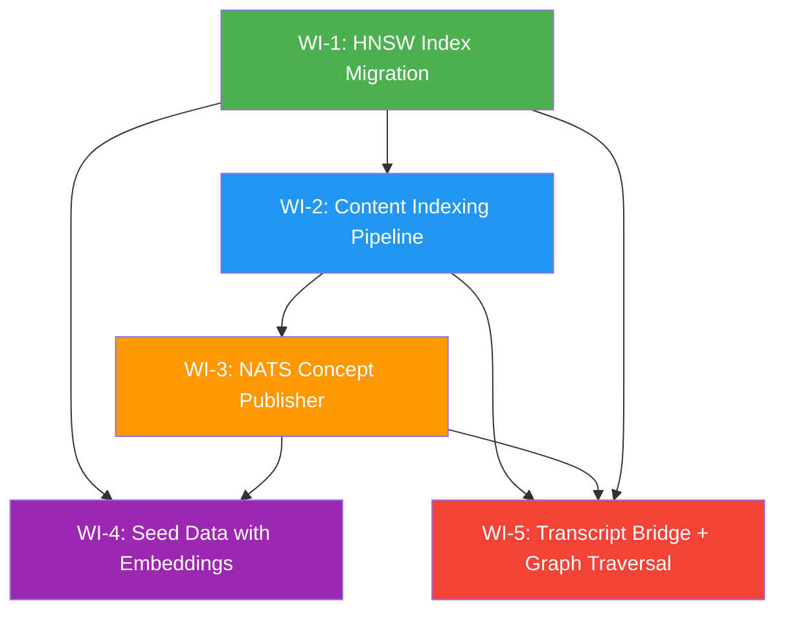

# FEAT-RAG-ACTIVATION — Wire RAG Pipeline for Production Use

**Status:** ✅ Complete
**Date:** 2026-03-27
**Priority:** P1 — Critical (core AI feature blocked)
**Scope:** packages/db, packages/rag, apps/subgraph-knowledge, apps/subgraph-content, apps/transcription-worker

---

## Problem Statement

EduSphere's RAG (Retrieval-Augmented Generation) pipeline has all major components built individually — pgvector embeddings schema, HNSW index definitions, Apache AGE knowledge graph, HybridRAG fusion engine, NATS event consumers, and LLM integration — but **none of them are wired together for real users**. The result:

1. **HNSW indexes exist in code but not in the database.** Migration `0041_optimize_hnsw_indexes.sql` defines indexes with `CREATE INDEX CONCURRENTLY`, but this file is a standalone SQL reference — not executed via Drizzle's migration runner. Every vector search is an O(n) sequential scan.

2. **Content ingestion handlers return stubs.** The `DocumentParserService` processes URLs, text, and DOCX, but PDF and image handlers are not implemented. Video content relies on a transcription worker that embeds transcript segments, but the pipeline from "video uploaded" to "embeddings generated" has no automated trigger.

3. **NATS concept publisher is missing.** The `LessonNERConsumer` in subgraph-knowledge subscribes to `EDUSPHERE.content.*.ner.extracted` and persists NER entities to Apache AGE — but no service publishes to this subject outside of lesson pipeline runs. Standalone content uploads never trigger concept extraction.

4. **Seed/demo data has no embeddings.** The Nahar Shalom seed course creates knowledge sources and chunks, but never calls the embedding service. Demo searches return empty results.

5. **Transcripts are not linked to knowledge sources.** The `EmbeddingWorker` in transcription-worker writes to `content_embeddings` keyed by `segment_id`, but there is no bridge that creates a `knowledge_sources` record for the transcript or links segments to the RAG pipeline's search scope.

6. **`findRelatedConcepts()` in HybridRAG is a placeholder.** The graph traversal step in `packages/rag/src/hybridSearch.ts` returns an empty array, meaning the "hybrid" in HybridRAG provides zero graph signal.

**Net effect:** An instructor can upload content and it appears in the UI, but asking the AI agent a question about that content returns nothing. The entire RAG value proposition is inert.

---

## User Stories

| ID       | Story                                                                                                                                                        | Acceptance Criteria                                                                                                                          |
| -------- | ------------------------------------------------------------------------------------------------------------------------------------------------------------ | -------------------------------------------------------------------------------------------------------------------------------------------- |
| **US-1** | As an instructor, when I upload a PDF to a course, the system extracts text, chunks it, generates embeddings, and makes it searchable within 60 seconds.     | PDF content appears in semantic search results; embedding count > 0 for the source.                                                          |
| **US-2** | As an instructor, when I upload a video with speech, the transcript is automatically linked as a knowledge source and searchable by the AI agent.            | Transcript segments have embeddings; `knowledge_sources` record exists with status READY; AI agent can answer questions about video content. |
| **US-3** | As a learner, when I ask the AI agent a question about course material, it retrieves relevant content from both vector search AND knowledge graph traversal. | HybridRAG returns results with non-zero `semanticScore` AND non-zero graph-boosted scores when related concepts exist.                       |
| **US-4** | As a learner, when I search the knowledge graph, concepts extracted from uploaded content appear as connected nodes.                                         | Apache AGE graph contains Concept vertices linked to Source vertices for every processed content item.                                       |
| **US-5** | As a demo user, when I open the seed course (Nahar Shalom), the AI agent can answer questions about Siddur Nahar Shalom content.                             | Seed data includes pre-generated embeddings; search for "Rashash" returns relevant chunks.                                                   |
| **US-6** | As a platform admin, vector similarity searches complete in under 50ms at 100K vectors scale.                                                                | HNSW indexes are active on all 4 embedding tables; `EXPLAIN ANALYZE` shows Index Scan, not Seq Scan.                                         |

---

## Scope — 5 Work Items

### WI-1: HNSW Index Migration (Database & Data)

**Current state:** `packages/db/src/schema/embeddings.ts` defines HNSW index SQL as exported constants. Migration file `0041_optimize_hnsw_indexes.sql` exists as a standalone reference but is NOT in Drizzle's migration sequence.

**Required work:**

- Create a proper Drizzle migration that applies the 4 HNSW indexes (`content_embeddings`, `annotation_embeddings`, `concept_embeddings`, `exam_item_embeddings`)
- Include `exam_item_embeddings` HNSW index (defined in `packages/db/src/schema/exam/exam-items.ts`)
- Verify indexes are created with `m=32, ef_construction=128` parameters
- Add integration test that confirms index type is `hnsw` via `pg_indexes` catalog query

**Acceptance criteria:**

- [ ] `pnpm --filter @edusphere/db migrate` creates all 4 HNSW indexes
- [ ] `SELECT indexdef FROM pg_indexes WHERE indexname LIKE 'idx_%_hnsw'` returns 4 rows
- [ ] `EXPLAIN ANALYZE SELECT ... ORDER BY embedding <=> $1::vector LIMIT 10` shows "Index Scan using idx_content_embeddings_hnsw"
- [ ] Performance: < 50ms for top-10 cosine similarity at 100K vectors

**Dependencies:** None (can run first)

---

### WI-2: Content Indexing Pipeline — PDF/Image/Video Handlers (Backend + Knowledge)

**Current state:** `DocumentParserService` handles URL, text, and DOCX. PDF handler calls `pdfParse()` (fixed in BUG-081) but the end-to-end flow from "content uploaded" → "embeddings stored" has gaps. Image content (OCR) is not handled. Video content relies on manual transcription worker trigger.

**Required work:**

- Wire PDF parsing → chunking → embedding as an automated pipeline triggered on `knowledge_sources` INSERT with `sourceType = PDF`
- Add image OCR handler (Tesseract.js or similar) for image-based content
- Create automated trigger: when transcription completes → emit NATS event → create knowledge_source → embed segments
- Ensure all handlers set `knowledge_sources.status` to PROCESSING → READY/FAILED with error details

**Acceptance criteria:**

- [ ] Upload PDF → `knowledge_sources.status` transitions PENDING → PROCESSING → READY
- [ ] Upload image → OCR extracts text → chunks created → embeddings stored
- [ ] Video transcription completion → knowledge_source created automatically → segments embedded
- [ ] All 3 content types searchable via HybridRAG within 120 seconds of upload
- [ ] Error handling: failed processing sets status = FAILED with error message in `metadata`

**Dependencies:** WI-1 (HNSW indexes should exist for search performance)

---

### WI-3: NATS Concept Publisher — Content → Knowledge Graph Bridge (Backend)

**Current state:** `LessonNERConsumer` subscribes to `EDUSPHERE.content.*.ner.extracted` and persists entities to Apache AGE. However, this event is ONLY published during lesson pipeline runs (`LessonPipelineOrchestratorService.publishNEREntities()`). Standalone content uploads (PDF, URL, text, DOCX) never trigger concept extraction.

**Required work:**

- Add a `ContentConceptPublisher` service that:
  1. Listens for `knowledge_sources` status change to READY
  2. Runs NER extraction on the source text (reuse existing NER workflow)
  3. Publishes extracted entities to `EDUSPHERE.content.<tenantId>.ner.extracted`
- This bridges the gap: any content upload → NER → NATS → `LessonNERConsumer` → Apache AGE graph
- Also create `Source → Concept` edges in the knowledge graph linking sources to extracted concepts

**Acceptance criteria:**

- [ ] Upload URL source → concepts extracted → appear in Apache AGE graph within 60s
- [ ] `Source` vertices in graph linked to `Concept` vertices via `MENTIONS` edges
- [ ] NATS subject `EDUSPHERE.content.*.ner.extracted` receives messages for non-lesson content
- [ ] DLQ handling: failed extractions land in `EDUSPHERE.content.ner.dlq`

**Dependencies:** WI-2 (content must be processed before concepts can be extracted)

---

### WI-4: Seed Data with Embeddings (Database & Data)

**Current state:** The Nahar Shalom seed creates `knowledge_sources` records and text chunks, but never generates embeddings. Demo users see empty search results.

**Required work:**

- Extend seed script to generate embeddings for all seed content:
  - Nahar Shalom course text (~500 chunks)
  - Any other seed courses with text content
- Pre-compute embeddings offline (store as JSON fixtures) to avoid requiring Ollama during `pnpm seed`
- Seed concept embeddings for knowledge graph concepts
- Add seed verification: after seed completes, verify embedding count matches expected

**Acceptance criteria:**

- [ ] `pnpm --filter @edusphere/db seed` populates `content_embeddings` with ≥500 rows
- [ ] `pnpm --filter @edusphere/db seed` populates `concept_embeddings` with ≥20 rows
- [ ] Search query "Rashash prayer" returns ≥3 relevant results from seed data
- [ ] Seed runs without Ollama/OpenAI (uses pre-computed fixtures)
- [ ] Seed is idempotent: running twice does not create duplicates

**Dependencies:** WI-1 (indexes for search performance), WI-3 (concepts in graph for graph search)

---

### WI-5: Transcript → KnowledgeSource Bridge + Graph Traversal Implementation (Backend + RAG)

**Current state:**

- `EmbeddingWorker` writes to `content_embeddings` by `segment_id` but no `knowledge_sources` record is created for transcripts
- `findRelatedConcepts()` in `packages/rag/src/hybridSearch.ts` returns `[]` (placeholder)

**Required work:**

- **Bridge:** When transcription completes, auto-create a `knowledge_sources` record (type: TRANSCRIPT) linked to the lesson/video
- **Graph traversal:** Implement `findRelatedConcepts()` using Apache AGE Cypher:
  1. Extract top concepts from vector search results
  2. Traverse graph: `MATCH (c:Concept)-[:RELATED_TO*1..2]-(related:Concept) WHERE c.name IN $concepts`
  3. Fetch documents/segments associated with related concepts
  4. Return as additional search results with graph-channel scores
- **RRF reranking:** Apply Reciprocal Rank Fusion to merge vector and graph channels (replace simple weighted sum)

**Acceptance criteria:**

- [ ] After video transcription, a `knowledge_sources` record exists with `sourceType = TRANSCRIPT`
- [ ] `searchWithGraphTraversal()` returns results with non-zero graph scores when concepts exist
- [ ] Graph traversal respects tenant isolation (RLS on graph queries)
- [ ] RRF fusion produces better ranking than vector-only for multi-concept queries
- [ ] End-to-end: upload video → transcribe → embed → extract concepts → graph traversal returns related content

**Dependencies:** WI-1 + WI-2 + WI-3 (full pipeline must be wired)

---

## Dependency Graph

**Execution order:**

1. **WI-1** (no deps — can start immediately)
2. **WI-2** (depends on WI-1)
3. **WI-3** (depends on WI-2)
4. **WI-4** + **WI-5** (depend on WI-1 + WI-2 + WI-3, can run in parallel)

---

## Non-Functional Requirements

| Category          | Requirement                      | Target                                     | Measurement                      |
| ----------------- | -------------------------------- | ------------------------------------------ | -------------------------------- |
| **Performance**   | Vector similarity search latency | < 50ms at 100K vectors                     | `EXPLAIN ANALYZE` + k6 load test |
| **Performance**   | Content indexing throughput      | < 120s for a 50-page PDF                   | End-to-end timer in NATS event   |
| **Performance**   | Graph traversal latency          | < 100ms for 2-hop query                    | Apache AGE `EXPLAIN`             |
| **Scalability**   | Embedding table capacity         | 10M+ rows per tenant                       | HNSW index memory budget         |
| **Reliability**   | Failed content processing        | Automatic retry (3x) + DLQ                 | NATS consumer retry logic        |
| **Reliability**   | Seed idempotency                 | No duplicates on re-run                    | `ON CONFLICT` upsert             |
| **Security**      | Tenant isolation                 | RLS on all embedding tables                | `pnpm test:rls`                  |
| **Security**      | Graph query isolation            | Cypher with tenant_id filter               | Integration test                 |
| **Observability** | Pipeline progress                | NATS events + Pino structured logs         | Log aggregation                  |
| **Observability** | Embedding generation metrics     | Count, latency, error rate per source type | Prometheus metrics               |

---

## Risk Matrix

| Risk                                            | Likelihood | Impact                                           | Mitigation                                                                             |
| ----------------------------------------------- | ---------- | ------------------------------------------------ | -------------------------------------------------------------------------------------- |
| **Ollama OOM on large PDFs**                    | Medium     | High — embedding generation fails                | Chunk size limits (1000 chars), batch embedding (20 at a time), queue backpressure     |
| **HNSW index build time on existing data**      | Low        | Medium — migration takes minutes on large tables | `CREATE INDEX CONCURRENTLY` (non-blocking), run during maintenance window              |
| **Apache AGE Cypher injection**                 | Low        | Critical — data leak                             | Parameterized Cypher queries via `executeCypher()` helper (SI-5 compliance)            |
| **Stale embeddings after content update**       | Medium     | Medium — search returns outdated content         | On content update, re-embed affected chunks; cascading delete on source removal        |
| **Embedding model mismatch (dev vs prod)**      | Medium     | High — incompatible vector dimensions            | Pin `dimensions: 768` in schema; validate at embedding time; reject mismatched vectors |
| **NATS message loss during concept extraction** | Low        | Medium — concepts never reach graph              | JetStream persistence + DLQ + max_age retention; alerting on DLQ depth                 |
| **Seed fixtures become stale**                  | Medium     | Low — demo breaks                                | CI test that verifies seed search returns expected results                             |

---

## Technical Notes

### Key Files (Current State)

| File                                                                       | Role                                  | Gap                                            |
| -------------------------------------------------------------------------- | ------------------------------------- | ---------------------------------------------- |
| `packages/db/src/schema/embeddings.ts`                                     | Defines 3 embedding tables + HNSW SQL | HNSW SQL not in migration runner               |
| `packages/db/src/migrations/0041_optimize_hnsw_indexes.sql`                | HNSW index DDL                        | Standalone file, not in Drizzle sequence       |
| `packages/rag/src/hybridSearch.ts`                                         | HybridRAG engine                      | `findRelatedConcepts()` returns `[]`           |
| `apps/subgraph-knowledge/src/nats/lesson-ner.consumer.ts`                  | NATS → AGE graph consumer             | Works, but no publisher for non-lesson content |
| `apps/subgraph-content/src/lesson/lesson-pipeline-orchestrator.service.ts` | Lesson pipeline with NER publish      | Only source of NER events                      |
| `apps/transcription-worker/src/embedding/embedding.worker.ts`              | Transcript → embeddings               | No knowledge_sources record created            |
| `packages/nats-client/src/knowledge-events.ts`                             | Event type definitions                | Types exist, publisher missing                 |
| `packages/db/src/seed/nahar-shalom-source.ts`                              | Seed data                             | No embeddings generated                        |

### Affected Subgraphs

- `subgraph-knowledge` — concept extraction, graph search, embedding store
- `subgraph-content` — content upload, lesson pipeline, NER publish
- `transcription-worker` — transcript embedding, knowledge source bridge

### Shared Packages

- `packages/db` — schema, migrations, seed
- `packages/rag` — HybridRAG engine, vector store
- `packages/nats-client` — event types, subject constants

---

## Estimated Effort

| Work Item                       | Division      | Effort   | Parallel?             |
| ------------------------------- | ------------- | -------- | --------------------- |
| WI-1: HNSW Migration            | DB & Data     | 2h       | Yes (first)           |
| WI-2: Content Pipeline          | Backend       | 8h       | After WI-1            |
| WI-3: Concept Publisher         | Backend       | 4h       | After WI-2            |
| WI-4: Seed Embeddings           | DB & Data     | 4h       | After WI-3            |
| WI-5: Transcript Bridge + Graph | Backend + RAG | 8h       | After WI-3            |
| **Total**                       |               | **~26h** | ~16h with parallelism |

---

## Success Criteria (Feature Complete)

The RAG Activation feature is **complete** when ALL of the following are true:

1. All 4 HNSW indexes exist in the database and `EXPLAIN ANALYZE` confirms Index Scan
2. PDF upload → embeddings stored → searchable within 120s
3. Video transcription → knowledge_source created → segments searchable
4. Content upload → NER → concepts in Apache AGE graph → graph traversal returns related content
5. Seed data includes embeddings; demo search returns relevant results
6. `findRelatedConcepts()` returns non-empty results from Apache AGE
7. All new code has unit tests, integration tests, and RLS validation
8. `pnpm turbo test` passes 100%
9. Load test: vector search < 50ms p95 at 100K vectors
