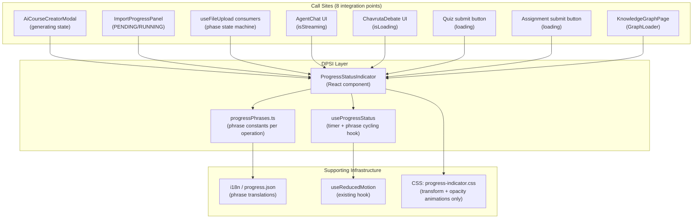
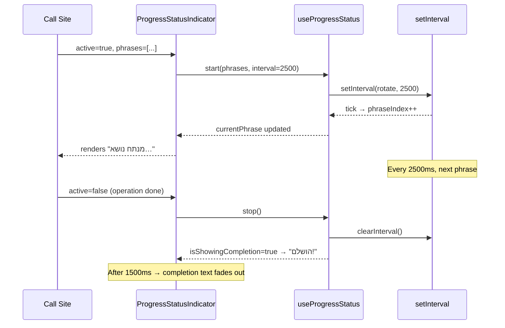
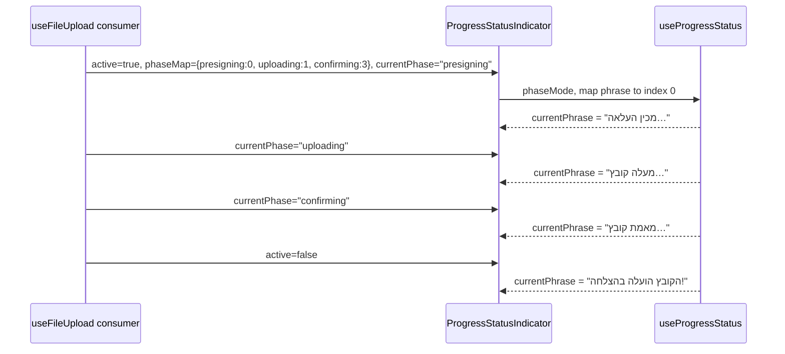

# PRD: Dynamic Progress Status Indicator

**Feature ID:** FEAT-progress-status-indicator
**Status:** Draft
**Author:** Product & Requirements Division
**Date:** 2026-03-18
**Priority:** Medium — UX Enhancement
**Target Release:** Phase 65

---

## 1. Overview

### 1.1 Problem Statement

Every long-running operation in EduSphere currently shows one of two things:

- A generic spinner with a static label (`"Generating…"`, `"Importing…"`)
- Nothing at all (the button becomes disabled with no feedback)

Users have no idea how much longer an operation will take, what the system is actually doing, or whether it is still making progress. For operations lasting 30–180 seconds (AI course generation, content import, file transcription), this causes:

1. **Abandonment** — users navigate away thinking the page is frozen
2. **Repeated clicks** — users re-submit the action, triggering duplicate work
3. **Support tickets** — "is this supposed to take this long?"

### 1.2 Proposed Solution

A **Dynamic Progress Status Indicator** (DPSI) — a reusable React component and companion hook — that cycles through descriptive, context-aware status phrases during any operation that takes >2 seconds.

Inspired by Claude Code's real-time status words (`Reading file…`, `Analyzing code…`), but adapted for EduSphere's educational domain with Hebrew UI strings.

The indicator:
- Rotates through a queue of descriptive phrases every 2.5 seconds
- Supports **known-step** mode (backend emits discrete progress events) and **unknown-step** mode (we only know it started and will eventually end)
- Is fully accessible (ARIA live regions, reduced-motion support)
- Is RTL-first (Hebrew strings with proper `dir="rtl"` wrapping)
- Is memory-safe (timer cleanup on unmount)

---

## 2. Scope

### 2.1 In Scope

- `useProgressStatus` hook — manages phrase cycling, cleanup, and phase-step binding
- `ProgressStatusIndicator` component — renders animated text + optional progress bar
- Status phrase definitions for all 8 identified operation types
- Integration into existing components/hooks (8 integration points)
- Unit tests, memory tests, Playwright E2E tests

### 2.2 Out of Scope

- Server-sent progress percentages (dependent on backend changes; handled via optional `progress` prop)
- Push notifications when background jobs finish
- Mobile (Expo) — Phase 66 follow-on
- Toast/notification on completion (handled by existing Sonner integration)

---

## 3. Functional Requirements

### 3.1 Core Behavior

| ID | Requirement |
|----|-------------|
| FR-01 | When `active=true`, the component displays the first phrase in the queue immediately (no delay) |
| FR-02 | Every `interval` ms (default: 2500ms), the displayed phrase advances to the next in the queue |
| FR-03 | When the queue is exhausted, the last phrase repeats indefinitely until `active` becomes false |
| FR-04 | When `active` becomes false, the component transitions to a completion state (`"הושלם!"`) for 1500ms then unmounts the status text |
| FR-05 | When `active` becomes false with `error=true`, displays the error phrase and stops cycling |
| FR-06 | The component MUST clean up all `setInterval` handles when unmounted — no memory leaks |
| FR-07 | If the current operation has known discrete steps (e.g. `phases: ['presigning','uploading','confirming']`) the component can bind each phrase to a phase rather than cycling by time |
| FR-08 | The cycling interval is configurable per call site (range: 1000ms–5000ms). Default: 2500ms |
| FR-09 | An optional numeric `progress` value (0–100) renders a thin progress bar beneath the phrase |
| FR-10 | Respects `prefers-reduced-motion` — when true, phrases change without the slide-up animation |

### 3.2 Operation-Specific Status Messages

Each operation type has a named **phrase queue** — an ordered array of Hebrew strings. The component cycles through them in order. All queues are defined in a single i18n namespace file (`progress.json`) following the existing i18next pattern.

#### 3.2.1 AI Course Generation (30–60s)
**Source:** `AiCourseCreatorModal.tsx` — `generating` state
**Mode:** Unknown-step (backend subscription emits only COMPLETED/FAILED)
**Interval:** 3000ms

```
"מנתח את הנושא שבחרת…"           (Analyzing the topic you chose…)
"בונה מבנה קורס…"                 (Building course structure…)
"יוצר מודולים ויחידות לימוד…"     (Creating modules and learning units…)
"מוסיף תוכן ומשימות…"             (Adding content and assignments…)
"מכייל את רמת הקושי…"             (Calibrating difficulty level…)
"סוקר את תוכנית הלימודים…"        (Reviewing the curriculum…)
"מסיים וממלא פרטים אחרונים…"      (Finalizing last details…)
"כמעט מוכן…"                      (Almost ready…)
```

#### 3.2.2 Content Import — YouTube Playlist (30–120s)
**Source:** `useContentImport.ts` — `youtubeMutation.isPending`
**Mode:** Unknown-step
**Interval:** 4000ms

```
"מתחבר ל-YouTube…"                (Connecting to YouTube…)
"קורא את הפלייליסט…"              (Reading the playlist…)
"מאחזר מידע על הסרטונים…"         (Fetching video metadata…)
"מורד תמלילים…"                   (Downloading transcripts…)
"מפצל לפרקי לימוד…"              (Splitting into learning units…)
"מעבד תוכן…"                      (Processing content…)
"שומר שיעורים…"                   (Saving lessons…)
"כמעט סיימנו…"                    (Almost done…)
```

#### 3.2.3 Content Import — Website / Blog (30–180s)
**Source:** `useContentImport.ts` — `websiteMutation.isPending`
**Mode:** Unknown-step
**Interval:** 4000ms

```
"גולש לאתר…"                      (Navigating to website…)
"מזהה מבנה התוכן…"                (Identifying content structure…)
"מחלץ מאמרים ודפים…"              (Extracting articles and pages…)
"מנקה תוכן…"                      (Cleaning content…)
"בונה מבנה שיעורים…"              (Building lesson structure…)
"מסנן תוכן לא רלוונטי…"           (Filtering irrelevant content…)
"שומר שיעורים…"                   (Saving lessons…)
"כמעט סיימנו…"                    (Almost done…)
```

#### 3.2.4 Content Import — Google Drive (10–60s)
**Source:** `useContentImport.ts` — `driveMutation.isPending`
**Mode:** Unknown-step
**Interval:** 3000ms

```
"מתחבר ל-Google Drive…"           (Connecting to Google Drive…)
"קורא תיקייה…"                    (Reading folder…)
"מאחזר קבצים…"                    (Fetching files…)
"ממיר קבצים לשיעורים…"            (Converting files to lessons…)
"שומר תוכן…"                      (Saving content…)
"כמעט סיימנו…"                    (Almost done…)
```

#### 3.2.5 File Upload — Large Files (10–120s)
**Source:** `useFileUpload.ts` — `phase` state machine (`presigning`, `uploading`, `confirming`)
**Mode:** Known-step (phase enum maps directly to phrases)
**Interval:** N/A (phase-driven, not timer-driven)

```
presigning  → "מכין העלאה…"                  (Preparing upload…)
uploading   → "מעלה קובץ…"                   (Uploading file…)
             → "ממתין לאישור שרת…"            (Waiting for server confirmation…)  [if >10s in uploading]
confirming  → "מאמת קובץ…"                   (Validating file…)
done        → "הקובץ הועלה בהצלחה!"          (File uploaded successfully!)
error       → "שגיאה בהעלאה. אנא נסה שנית." (Upload error. Please try again.)
```

#### 3.2.6 AI Chat / Chavruta Debate Response (5–30s)
**Source:** `useAgentChat.ts` and `useChavrutaDebate.ts` — `isStreaming`/`isLoading`
**Mode:** Unknown-step
**Interval:** 2000ms

```
"הסוכן חושב…"                     (The agent is thinking…)
"מחפש מידע רלוונטי…"              (Searching for relevant information…)
"מנסח תגובה…"                     (Formulating a response…)
"בודק מקורות…"                    (Checking sources…)
"כמעט מוכן…"                      (Almost ready…)
```

#### 3.2.7 Quiz Grading with AI (5–15s)
**Source:** `useGradeQuiz.ts` — `loading`
**Mode:** Unknown-step
**Interval:** 2500ms

```
"קורא את תשובותיך…"               (Reading your answers…)
"מעריך כל תשובה…"                 (Evaluating each answer…)
"מחשב ניקוד…"                     (Calculating score…)
"מכין משוב…"                      (Preparing feedback…)
"כמעט סיימנו…"                    (Almost done…)
```

#### 3.2.8 Assignment Submission (2–5s)
**Source:** `useSubmitAssignment.ts` — `loading`
**Mode:** Unknown-step
**Interval:** 1500ms

```
"שולח את העבודה…"                 (Submitting assignment…)
"מאמת תוכן…"                      (Validating content…)
"שומר…"                           (Saving…)
```

#### 3.2.9 Page Data Loading — Generic (2–10s)
**Source:** 59+ pages with `isLoading`/`isPending`
**Mode:** Unknown-step
**Interval:** 2500ms
**Note:** This is the fallback phrase queue used when no operation-specific queue is specified.

```
"טוען נתונים…"                    (Loading data…)
"מאחזר מידע…"                     (Fetching information…)
"מכין תצוגה…"                     (Preparing view…)
"כמעט מוכן…"                      (Almost ready…)
```

#### 3.2.10 Knowledge Graph Search / Build (3–8s)
**Source:** `KnowledgeGraphPage.tsx`, `KnowledgeGraph.tsx` — loading state
**Mode:** Unknown-step
**Interval:** 2500ms

```
"חוצה את גרף הידע…"               (Traversing knowledge graph…)
"מחפש חיבורים…"                   (Finding connections…)
"מחשב מרחקים סמנטיים…"            (Computing semantic distances…)
"בונה תצוגה…"                     (Building visualization…)
```

---

## 4. Component API

### 4.1 `useProgressStatus` Hook

```typescript
// apps/web/src/hooks/useProgressStatus.ts

type ProgressStatusMode = 'cycling' | 'phase-driven';

interface UseProgressStatusOptions {
  /** Whether the operation is currently active */
  active: boolean;
  /** Ordered array of status phrases to display */
  phrases: string[];
  /** Rotation interval in ms. Default: 2500. Ignored in phase-driven mode. */
  interval?: number;
  /** In phase-driven mode, the current phase key maps to a phrase index */
  currentPhase?: string;
  /** Explicit phase→phrase index mapping for phase-driven mode */
  phaseMap?: Record<string, number>;
  /** Whether the operation ended in error */
  error?: boolean;
}

interface UseProgressStatusReturn {
  /** The phrase currently displayed */
  currentPhrase: string;
  /** Index of the current phrase (0-based) */
  phraseIndex: number;
  /** True once active has transitioned from true→false */
  isComplete: boolean;
  /** True when showing the post-completion "הושלם!" state */
  isShowingCompletion: boolean;
}

export function useProgressStatus(options: UseProgressStatusOptions): UseProgressStatusReturn;
```

**Memory Safety Contract:**
- The `setInterval` handle MUST be stored in `useRef` and cleared in `useEffect` cleanup return
- No `setInterval` may persist after `active` becomes false or the component unmounts

### 4.2 `ProgressStatusIndicator` Component

```typescript
// apps/web/src/components/ProgressStatusIndicator.tsx

interface ProgressStatusIndicatorProps {
  /** Whether the operation is currently running */
  active: boolean;
  /** Phrase queue — use operation-specific constant from progressPhrases.ts */
  phrases: string[];
  /** Rotation interval (ms). Default: 2500 */
  interval?: number;
  /** Optional 0–100 progress value; renders progress bar when provided */
  progress?: number;
  /** Phase map for known-step mode */
  phaseMap?: Record<string, number>;
  /** Current phase key (for known-step mode) */
  currentPhase?: string;
  /** Whether the operation ended in an error */
  error?: boolean;
  /** CSS class override */
  className?: string;
  /** Visual variant. Default: 'inline' */
  variant?: 'inline' | 'overlay' | 'banner';
}

export function ProgressStatusIndicator(props: ProgressStatusIndicatorProps): JSX.Element | null;
```

**Variants:**

| Variant | Use Case | Layout |
|---------|----------|--------|
| `inline` | Button labels, form status areas | Single line, flows with document |
| `overlay` | Modal operations (AI course generation) | Centered overlay on modal content |
| `banner` | Full-page operations (content import) | Sticky top or bottom banner |

### 4.3 Phrase Constants File

```typescript
// apps/web/src/lib/progressPhrases.ts

export const PROGRESS_PHRASES = {
  AI_COURSE_GENERATION: [...],
  CONTENT_IMPORT_YOUTUBE: [...],
  CONTENT_IMPORT_WEBSITE: [...],
  CONTENT_IMPORT_DRIVE: [...],
  FILE_UPLOAD: { presigning: 0, uploading: 1, confirming: 3 }, // phase map
  AI_CHAT_RESPONSE: [...],
  QUIZ_GRADING: [...],
  ASSIGNMENT_SUBMISSION: [...],
  PAGE_LOADING: [...],         // generic fallback
  KNOWLEDGE_GRAPH: [...],
} as const;
```

---

## 5. Integration Points

The following existing files require modification to integrate the DPSI. Each integration is a targeted, minimal change — adding the `<ProgressStatusIndicator>` component and passing the correct phrase queue.

| # | File | Change | Phrases Key |
|---|------|--------|-------------|
| 1 | `apps/web/src/components/AiCourseCreatorModal.tsx` | Replace `{t('aiCreator.generating')}` static text with `<ProgressStatusIndicator>` | `AI_COURSE_GENERATION` |
| 2 | `apps/web/src/components/content-import/ImportProgressPanel.tsx` | Add status phrase cycling during `PENDING`/`RUNNING` states | `CONTENT_IMPORT_YOUTUBE` / `_WEBSITE` / `_DRIVE` (passed as prop) |
| 3 | `apps/web/src/hooks/useFileUpload.ts` | Export `phase` already; consuming components add `<ProgressStatusIndicator phaseMap={...}>` | `FILE_UPLOAD` (phase-driven) |
| 4 | `apps/web/src/hooks/useAgentChat.ts` | `isStreaming` flag → `<ProgressStatusIndicator>` in chat input area | `AI_CHAT_RESPONSE` |
| 5 | `apps/web/src/hooks/useChavrutaDebate.ts` | `isLoading` flag → `<ProgressStatusIndicator>` in debate UI | `AI_CHAT_RESPONSE` |
| 6 | `apps/web/src/hooks/useGradeQuiz.ts` | `loading` flag → `<ProgressStatusIndicator>` in quiz submit button | `QUIZ_GRADING` |
| 7 | `apps/web/src/hooks/useSubmitAssignment.ts` | `loading` flag → `<ProgressStatusIndicator>` in assignment submit button | `ASSIGNMENT_SUBMISSION` |
| 8 | `apps/web/src/pages/KnowledgeGraphPage.tsx` | Replace `GraphLoader` spinner with `<ProgressStatusIndicator>` | `KNOWLEDGE_GRAPH` |

---

## 6. Non-Functional Requirements

### 6.1 Accessibility

| ID | Requirement |
|----|-------------|
| NFR-A01 | The container element MUST have `role="status"` and `aria-live="polite"` so screen readers announce phrase changes without interrupting |
| NFR-A02 | Phrase changes MUST NOT use `aria-live="assertive"` — polite is sufficient; assertive is too disruptive |
| NFR-A03 | The spinner/animation element MUST have `aria-hidden="true"` — it is decorative |
| NFR-A04 | The component MUST pass `aria-label` that describes the overall operation (e.g. `"AI course generation in progress"`) |
| NFR-A05 | WCAG 1.4.3: Text contrast ratio of status phrases ≥ 4.5:1 against background |
| NFR-A06 | When `prefers-reduced-motion: reduce` is active, phrase transitions MUST skip CSS animation (instant swap, no slide/fade) |

### 6.2 RTL / Hebrew

| ID | Requirement |
|----|-------------|
| NFR-R01 | The container MUST set `dir="rtl"` explicitly — do not rely on CSS inheritance |
| NFR-R02 | Hebrew phrases MUST use Unicode bidirectional marks if they contain embedded LTR text (URLs, numbers, brand names) |
| NFR-R03 | The animated progress bar MUST fill left-to-right in LTR and right-to-left in RTL |
| NFR-R04 | The spinner icon placement: `ltr:mr-2 rtl:ml-2` — consistent with existing `Loader2` usage in codebase |

### 6.3 Performance

| ID | Requirement |
|----|-------------|
| NFR-P01 | The `useProgressStatus` hook MUST NOT trigger parent component re-renders. All state is local to the indicator subtree |
| NFR-P02 | Phrase array MUST be defined as module-level constants (not inline in JSX) to prevent array identity churn |
| NFR-P03 | The component MUST NOT import or depend on TanStack Query, urql, or any state manager — it is a pure presentational + timer component |
| NFR-P04 | Bundle impact target: < 3 KB gzipped (no external deps beyond React) |
| NFR-P05 | CSS animations MUST use `transform` and `opacity` only — no `top`/`left`/`height` animation (causes layout reflow) |

### 6.4 Memory Safety

Per the project's Memory Safety rules:

| ID | Requirement |
|----|-------------|
| NFR-M01 | Every `setInterval` in `useProgressStatus` MUST store handle in `useRef<ReturnType<typeof setInterval>>` and call `clearInterval` in the `useEffect` cleanup return |
| NFR-M02 | The completion-phase `setTimeout` (1500ms) MUST also be tracked in `useRef` and cleared on unmount |
| NFR-M03 | A `*.memory.test.ts` file is REQUIRED that verifies `clearInterval` and `clearTimeout` are called after `unmount()` |

---

## 7. Architecture



### 7.1 Data Flow — Cycling Mode



### 7.2 Data Flow — Phase-Driven Mode



---

## 8. File Structure

```
apps/web/src/
├── hooks/
│   ├── useProgressStatus.ts              # NEW: core cycling logic + memory safety
│   ├── useProgressStatus.test.ts         # NEW: unit tests (interval, cleanup, phase-driven)
│   └── useProgressStatus.memory.test.ts  # NEW: memory safety (clearInterval on unmount)
├── components/
│   ├── ProgressStatusIndicator.tsx       # NEW: React component (all 3 variants)
│   └── ProgressStatusIndicator.test.tsx  # NEW: renders correct phrase, aria-live, RTL
├── lib/
│   └── progressPhrases.ts                # NEW: all phrase queues as const arrays
└── pages/ (8 integration point changes — see §5)
```

---

## 9. Acceptance Criteria

All criteria are testable. A criterion is considered passed only when a corresponding automated test goes green.

| ID | Criteria | Test Type |
|----|----------|-----------|
| AC-01 | When `active` becomes true, the first phrase is displayed immediately (within 1 render cycle) | Unit |
| AC-02 | After `interval` ms, the second phrase replaces the first | Unit (fake timers) |
| AC-03 | After the last phrase in the queue, the same last phrase repeats — no index out-of-bounds | Unit |
| AC-04 | When `active` becomes false, `clearInterval` is called before the component unmounts | Memory test |
| AC-05 | When `active` becomes false, `"הושלם!"` is shown for 1500ms then disappears | Unit (fake timers) |
| AC-06 | When `error=true` and `active=false`, the error phrase is shown (not `"הושלם!"`) | Unit |
| AC-07 | In phase-driven mode, phrase updates when `currentPhase` prop changes (no timer involved) | Unit |
| AC-08 | Container has `role="status"` and `aria-live="polite"` | Unit (DOM query) |
| AC-09 | Spinner icon has `aria-hidden="true"` | Unit (DOM query) |
| AC-10 | When `useReducedMotion` returns true, the CSS animation class is NOT applied | Unit (mock hook) |
| AC-11 | In RTL layout, `dir="rtl"` is present on the container element | Unit |
| AC-12 | Phrases are defined in `progressPhrases.ts` as module-level constants, not inline JSX | Code review / lint rule |
| AC-13 | `AiCourseCreatorModal` shows cycling Hebrew phrases during `generating=true` | E2E (Playwright mock) |
| AC-14 | `ImportProgressPanel` shows cycling phrases during `PENDING` and `RUNNING` job states | E2E (Playwright mock) |
| AC-15 | `useAgentChat` consumers show cycling phrases during `isStreaming=true` | E2E (Playwright mock) |
| AC-16 | All 5 user roles can see the progress indicator functioning correctly | E2E (5-user auth test) |
| AC-17 | Bundle size of `ProgressStatusIndicator` + `useProgressStatus` + `progressPhrases` is < 3 KB gzipped | Build analysis |
| AC-18 | `pnpm turbo typecheck` passes with 0 errors after all changes | CI gate |
| AC-19 | `pnpm turbo test` passes 100% for `@edusphere/web` after all changes | CI gate |
| AC-20 | Visual regression: `toHaveScreenshot('progress-indicator-cycling.png')` captures indicator in mid-cycle state | Playwright visual |

---

## 10. Risk Matrix

| # | Risk | Probability | Impact | Mitigation |
|---|------|-------------|--------|------------|
| R-01 | Timer drift — phrases cycle at wrong rate due to React re-renders resetting interval | Medium | Low | Use `useRef` for interval handle; never recreate interval inside render body |
| R-02 | Memory leak — `setInterval` outlives component if `active` prop change triggers re-mount | Medium | High | `useEffect(() => () => clearInterval(ref.current), [])` with empty dep array + separate effect for `active` changes |
| R-03 | Hebrew text overflow in narrow containers (mobile portrait) | Low | Low | Use `truncate` or `line-clamp-1` with tooltip fallback; test at 320px viewport |
| R-04 | Phrase arrays become stale — Hebrew strings drift from actual backend behavior | Low | Medium | Phrases reviewed by product owner each quarter; stale phrases cause user confusion, not crashes |
| R-05 | ARIA live region is too chatty — VoiceOver announces every 2.5s | Medium | Medium | Use `aria-live="polite"` (not assertive); assistive tech respects user activity before announcing |
| R-06 | Reduced-motion users still see layout shift when phrase changes | Low | Medium | Instant swap (no animation) when `prefers-reduced-motion`; test with macOS Accessibility Inspector |
| R-07 | Call sites that use `useProgressStatus` forget to pass `phrases` from constants — pass inline arrays instead | Medium | Low | ESLint rule: no array literals as JSX prop values for `phrases` prop; enforced in lint config |
| R-08 | Phase-driven mode integration with `useFileUpload` introduces extra prop drilling through AssetUploader → ProgressStatusIndicator | Low | Low | `useFileUpload` already exposes `phase` as a return value; no prop drilling needed — callers pass it directly |
| R-09 | Integration into 8 components in a single PR causes merge conflicts with parallel feature branches | Medium | Medium | Integrate in a dedicated `feat/dpsi` branch; coordinate with active feature branches before merge |

---

## 11. Dependencies

| Dependency | Version | Notes |
|------------|---------|-------|
| React 19 | Already in use | `useEffect`, `useRef`, `useState` — no new APIs required |
| i18next / react-i18next | Already in use | Add `progress` namespace to `NAMESPACES` constant in `@edusphere/i18n` |
| `useReducedMotion` hook | Already in `apps/web/src/hooks/useReducedMotion.ts` | Import directly — no changes needed |
| shadcn/ui `Progress` component | Already in `apps/web/src/components/ui/progress.tsx` | Use for optional progress bar rendering |
| Tailwind CSS | Already in use | Animation classes: `animate-slide-up`, `transition-opacity` |

---

## 12. Testing Plan

### 12.1 Unit Tests (`useProgressStatus.test.ts`)

Using `vitest` + `@testing-library/react` + fake timers:

1. Phrase advances after interval
2. Phrase stays at last index when queue exhausted
3. `clearInterval` called on unmount (memory guard)
4. `clearInterval` called when `active` changes from true → false
5. Phase-driven: phrase index follows `currentPhase` changes
6. Error state: shows error phrase when `error=true`
7. Completion state: shows `"הושלם!"` for 1500ms then clears

### 12.2 Memory Tests (`useProgressStatus.memory.test.ts`)

Using `renderHook` + `unmount`:

1. `clearInterval` is called exactly once after unmount
2. `clearTimeout` (completion timer) is called after unmount during completion phase
3. No `setInterval` handle leaks when `active` rapidly toggles (stress test: 50 toggles)

### 12.3 Component Tests (`ProgressStatusIndicator.test.tsx`)

1. Renders correct first phrase on mount
2. `role="status"` and `aria-live="polite"` present
3. `aria-hidden` on spinner icon
4. `dir="rtl"` on container
5. Progress bar renders when `progress` prop supplied
6. No animation class when `prefers-reduced-motion=true`
7. Variant `overlay` applies correct CSS class
8. Variant `banner` applies correct CSS class

### 12.4 E2E Tests (`apps/web/e2e/progress-status-indicator.spec.ts`)

Using Playwright with `page.route()` to intercept GraphQL mutations and delay responses:

1. AI course generation: mock `generateCourseFromPrompt` mutation with 8s delay → verify at least 2 different Hebrew phrases appear during wait
2. Content import: mock `importFromYoutube` mutation with 6s delay → verify phrase cycling in `ImportProgressPanel`
3. Assignment submission: mock `submitTextAssignment` with 3s delay → verify phrase appears
4. Completion: verify `"הושלם!"` appears after mock resolves
5. Error: verify error phrase appears when mock rejects
6. Visual regression: `expect(page).toHaveScreenshot('progress-indicator-cycling.png')` on mid-cycle state

---

## 13. Definition of Done

- [ ] `useProgressStatus` hook implemented with full memory safety
- [ ] `ProgressStatusIndicator` component implemented (3 variants)
- [ ] `progressPhrases.ts` constants file complete (all 10 operation types)
- [ ] All 8 integration points updated
- [ ] All acceptance criteria (AC-01 through AC-20) have passing tests
- [ ] `pnpm turbo test` passes 100% for `@edusphere/web`
- [ ] `pnpm turbo typecheck` passes with 0 errors
- [ ] `pnpm turbo lint` passes with 0 warnings
- [ ] Playwright E2E test file written and passing
- [ ] `toHaveScreenshot` visual regression baseline captured
- [ ] `OPEN_ISSUES.md` updated with feature entry
- [ ] This document updated to status `Implemented`

---

## 14. Future Enhancements (Out of Scope — Phase 66+)

1. **Mobile (Expo):** Port `useProgressStatus` to `apps/mobile` — same hook, different renderer component
2. **Real-time backend progress:** If/when backend emits discrete progress events (e.g. `importProgress` subscription), bind numeric `progress` value to indicator
3. **Estimated time remaining:** If backend provides `estimatedMinutes`, show countdown alongside phrases
4. **Personalized phrases:** Adapt phrases to user's learning context (e.g. if importing a course on "Python", say `"מכין שיעורי Python…"`)
5. **Sound feedback:** Optional subtle audio cue on completion (off by default, respects `prefers-reduced-motion` equivalent for audio)
