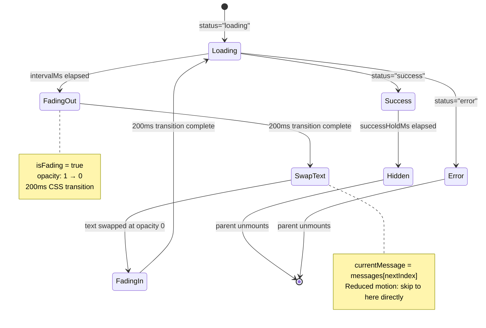
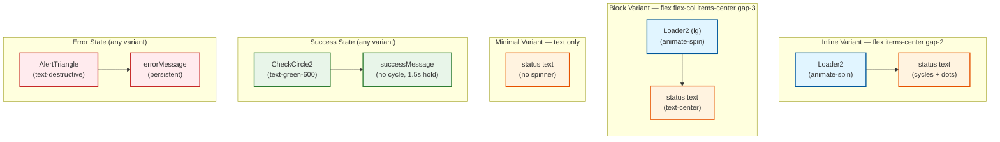
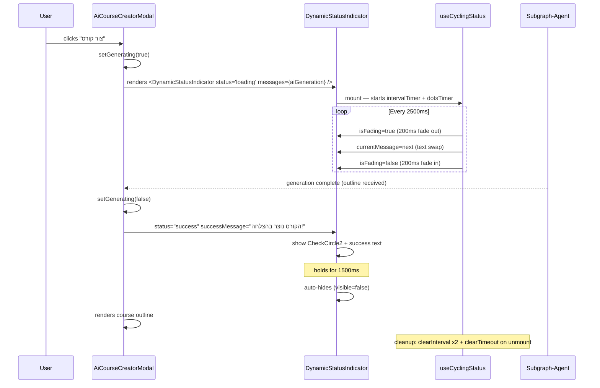
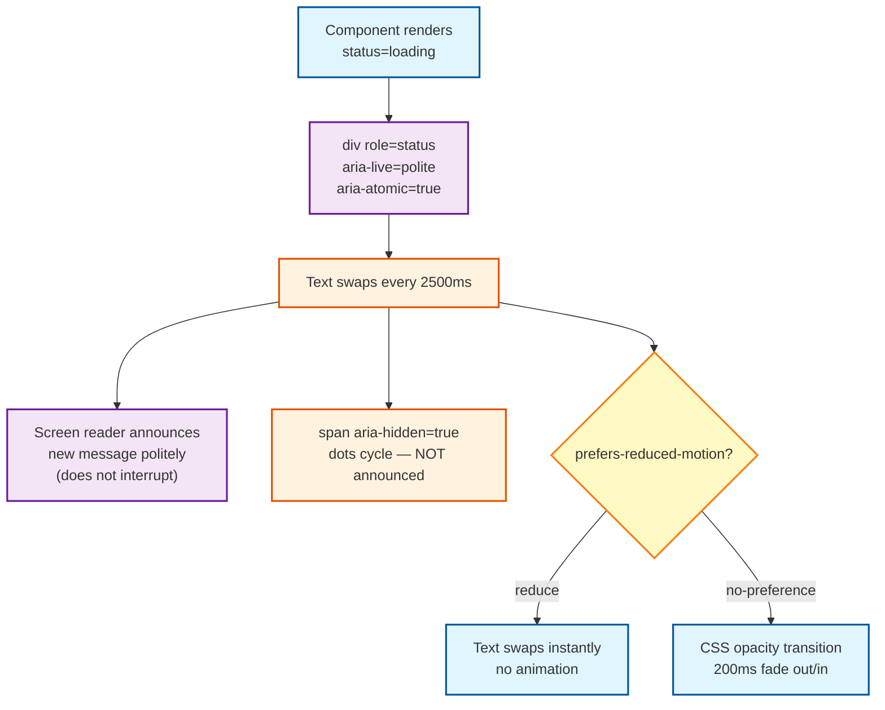

# UX/UI Design Specification: Dynamic Progress Status Indicator

**Feature ID:** FEAT-progress-status
**Division:** UX/UI Design
**Status:** Draft — Ready for Frontend Engineering
**Date:** 2026-03-18
**Target Surface:** `apps/web` (shadcn/ui + Tailwind CSS) + shared hook logic usable in `apps/mobile`

---

## 1. Purpose & Motivation

Long operations (>2 seconds) currently show a static `Loader2` spinner with a frozen label (e.g., "מייצר..."). Users have no indication of _what_ is happening internally, which increases perceived wait time and uncertainty.

This feature introduces a **DynamicStatusIndicator** component that cycles through meaningful, operation-specific Hebrew status messages — similar to how Claude Code's status line narrates its own work. This transforms a passive wait into a transparent, trustworthy experience.

---

## 2. Component Architecture

### 2.1 Deliverables

| Artifact        | Path                                                         |
| --------------- | ------------------------------------------------------------ |
| Core component  | `apps/web/src/components/ui/DynamicStatusIndicator.tsx`      |
| Hook            | `apps/web/src/hooks/useCyclingStatus.ts`                     |
| Memory test     | `apps/web/src/hooks/useCyclingStatus.memory.test.ts`         |
| Unit tests      | `apps/web/src/components/ui/DynamicStatusIndicator.test.tsx` |
| E2E spec        | `apps/web/e2e/dynamic-status-indicator.spec.ts`              |
| Message presets | `apps/web/src/lib/status-messages.ts`                        |

### 2.2 Component Variants

Three layout variants cover all contexts in EduSphere:

| Variant   | Layout                                        | Primary Use Cases                                       |
| --------- | --------------------------------------------- | ------------------------------------------------------- |
| `inline`  | Spinner + text on same line (horizontal flex) | Buttons, table row actions, inline card loading         |
| `block`   | Spinner centered above, text centered below   | Full-page loading, modal generation state, wizard steps |
| `minimal` | Text only — no spinner                        | Inside panels/cards that already carry a progress bar   |

---

## 3. Visual Design

### 3.1 Typography & Color Tokens

All tokens are shadcn/ui design system tokens — no new CSS variables are introduced.

| State                | Text Class                                   | Icon Class                           |
| -------------------- | -------------------------------------------- | ------------------------------------ |
| In progress          | `text-sm text-muted-foreground`              | `text-muted-foreground`              |
| Success (1.5 s hold) | `text-sm text-green-600 dark:text-green-400` | `text-green-600 dark:text-green-400` |
| Error (persistent)   | `text-sm text-destructive`                   | `text-destructive`                   |
| Cancelled            | — (component unmounts)                       | —                                    |

### 3.2 Spinner

Reuse the existing project pattern: `Loader2` from `lucide-react` with `animate-spin`.

```
Size mapping:
  sm  → h-3 w-3   (inline buttons, tight spaces)
  md  → h-4 w-4   (default — modals, cards)
  lg  → h-6 w-6   (block variant, full-page)
```

Success state replaces `Loader2` with `CheckCircle2` (already used in `AiCourseCreatorModal.tsx`).
Error state replaces spinner with `AlertTriangle` (already used in `AiCourseCreatorModal.tsx`).

### 3.3 Text Transition Animation

The status text fades out, swaps, then fades in. This is a **CSS opacity transition**, not a layout shift.

```
Normal operation:
  opacity: 1 → 0 over 200 ms  (fade out)
  text content swaps at opacity 0
  opacity: 0 → 1 over 200 ms  (fade in)
  Hold duration: 2500 ms (configurable per-instance)

Reduced motion (prefers-reduced-motion: reduce):
  No opacity transition — text content swaps instantly.
  useReducedMotion() hook (already at apps/web/src/hooks/useReducedMotion.ts)
  must be read inside useCyclingStatus and passed as isFading=false.
```

Tailwind class for the animated text span:

```
transition-opacity duration-200
```

State control: `opacity-0` / `opacity-100` applied via React state during the swap window.

### 3.4 Optional Dots Animation (Trailing Ellipsis)

When `showDots={true}` (default), a separate `<span aria-hidden="true">` appended after the message text cycles through `""` → `"."` → `".."` → `"..."` on a 400 ms interval, independent of the message cycling interval. This is decorative only and excluded from the accessible label.

Reduced motion: dots are static `"..."` — no cycling.

### 3.5 Shimmer / Pulse (Optional)

An optional `shimmer` prop adds a subtle `animate-pulse` class to the text span. Default: `false`. Shimmer is suppressed under `prefers-reduced-motion`.

---

## 4. Layout Variants — Detailed Specifications

### 4.1 Inline Variant

```
[  spinner  ]  [ status text...  ]
```

- Container: `flex items-center gap-2`
- RTL: `flex-row-reverse` is NOT needed — gap handles RTL automatically because the browser reverses flex items in RTL context when `dir="rtl"` is set on a parent.
- Min-width: `min-w-0` on the text span to allow truncation if space is tight.
- Text truncation: `truncate` on the text span — overflow is hidden with ellipsis.
- Typical use: inside a `<Button>` replacing the static `{t('aiCreator.generating')}` call.

```tsx
// Before (current pattern in AiCourseCreatorModal.tsx):
<Loader2 className="h-4 w-4 ltr:mr-1.5 rtl:ml-1.5 animate-spin" />;
{
  t('aiCreator.generating');
}

// After:
<DynamicStatusIndicator
  variant="inline"
  messages={STATUS_MESSAGES.aiGeneration}
  size="sm"
/>;
```

### 4.2 Block Variant

```
         [ spinner ]
   [ status text centered ]
```

- Container: `flex flex-col items-center gap-3 py-6`
- Spinner size: `lg` (h-6 w-6)
- Text: `text-center` — works in both LTR and RTL without explicit text-align switching.
- Typical use: modal body during AI course generation, full-page loading screens.

### 4.3 Minimal Variant

```
[ status text ]
```

- Container: `flex items-center` (no spinner child rendered)
- Typical use: inside a card/panel that already has a `<Progress value={pct} />` bar above it, so the spinning icon would be redundant.
- The `<Progress>` bar and `DynamicStatusIndicator minimal` are composed externally by the parent — not bundled together inside this component.

---

## 5. RTL / Hebrew Considerations

### 5.1 Text Direction

All Hebrew message strings are inherently RTL. The component does **not** hard-code a `dir` attribute — it inherits from the nearest ancestor with `dir="rtl"`, which is set at the `<html>` element level by the i18n system.

### 5.2 Inline Variant RTL Behaviour

The `inline` variant uses `flex` with `gap`. In RTL context (Hebrew UI), the browser automatically renders flex children right-to-left, so spinner appears to the right of text — which is the correct visual order for Hebrew. No `ltr:/rtl:` Tailwind prefixes are needed on the container itself.

However the spinner icon (`Loader2`) has no inherent direction — it looks identical in both directions. No adjustment needed.

### 5.3 Text Truncation in RTL

`truncate` (which sets `overflow: hidden; text-overflow: ellipsis; white-space: nowrap`) works correctly in RTL — the ellipsis appears on the left edge (the logical start) as expected in Hebrew.

### 5.4 Test Coverage

E2E spec must include an assertion with `dir="rtl"` set on the test wrapper to verify that the inline variant renders spinner to the right of text and text does not overflow.

---

## 6. Status Message Presets

All presets are defined in `apps/web/src/lib/status-messages.ts` and typed as `string[]`. They are consumed by the `messages` prop of `DynamicStatusIndicator`.

**In the actual implementation, these strings will be i18n keys** fetched via `t()`. The Hebrew values shown here are the translations for `he` locale.

```ts
// apps/web/src/lib/status-messages.ts
export const STATUS_MESSAGES = {
  aiGeneration: [
    'מנתח את הנושא...',
    'בונה מתווה...',
    'יוצר מודולים...',
    'מסיים...',
  ],
  fileUpload: ['מכין העלאה...', 'מעלה קובץ...', 'מאשר...', 'הושלם!'],
  quizGrading: ['בודק תשובות...', 'מחשב ציון...', 'מכין משוב...'],
  pageLoad: ['טוען נתונים...', 'מעבד...', 'כמעט מוכן...'],
  contentImport: ['מתחבר למקור...', 'מייבא תוכן...', 'מעבד שיעורים...'],
  aiChat: ['חושב...', 'מנסח תשובה...', 'כמעט מוכן...'],
} as const satisfies Record<string, readonly string[]>;
```

---

## 7. Accessibility (WCAG 2.1 AA)

### 7.1 Live Region

The visible status text container must carry:

```tsx
<div
  role="status"
  aria-live="polite"
  aria-atomic="true"
  aria-label={currentMessage}
>
  <span>{currentMessage}</span>
  {showDots && <span aria-hidden="true">{dots}</span>}
</div>
```

`aria-atomic="true"` ensures screen readers announce the entire message as a unit, not just the changed portion, which prevents the dots cycling from triggering spurious announcements.

`aria-live="polite"` — the updates are informational, not urgent. They do not interrupt the user's current task.

### 7.2 Integration with useAnnounce

The existing `useAnnounce` hook (`apps/web/src/hooks/useAnnounce.ts`) creates a shared `sr-only` live region in `document.body`. `DynamicStatusIndicator` must **not** use `useAnnounce` for its cycling messages — it has its own visible `role="status"` container which is sufficient. `useAnnounce` (assertive) is reserved for urgent error announcements.

### 7.3 Reduced Motion

```tsx
const reducedMotion = useReducedMotion(); // from apps/web/src/hooks/useReducedMotion.ts

// Pass to useCyclingStatus:
const { currentMessage, isFading } = useCyclingStatus({
  messages,
  intervalMs: 2500,
  reducedMotion,
});

// In render: skip opacity transition class when reducedMotion=true
<span
  className={cn(
    'transition-opacity duration-200',
    !reducedMotion && (isFading ? 'opacity-0' : 'opacity-100'),
    reducedMotion && 'opacity-100'
  )}
>
  {currentMessage}
</span>;
```

Under `prefers-reduced-motion: reduce`:

- No fade transition
- Dots span renders `"..."` statically without cycling
- `animate-pulse` shimmer suppressed

### 7.4 Focus Management

The component is purely presentational — it does not receive focus and does not interrupt keyboard navigation. No `tabIndex` attribute is set.

---

## 8. Interaction States

### 8.1 In Progress (default)

- `status="loading"` prop
- Spinner animates; messages cycle every `intervalMs` ms (default 2500)
- Optional dots cycle every 400 ms

### 8.2 Success

- `status="success"` prop + `successMessage` string
- Spinner replaced by `CheckCircle2` (green)
- Success message shown — does NOT cycle
- After `successHoldMs` ms (default 1500), component auto-hides by setting internal `visible=false`
- Parent should also clear its `generating/loading` state at the same time — the component does not own that state
- Under reduced motion: no fade on hide — unmounts immediately

### 8.3 Error

- `status="error"` prop + `errorMessage` string
- Spinner replaced by `AlertTriangle` (text-destructive)
- Error message shown — does NOT cycle, does NOT auto-hide
- Component stays visible until parent unmounts it (e.g., user dismisses the modal)

### 8.4 Cancelled / Unmounted

- Parent removes the component from the tree (conditional render)
- `useCyclingStatus` cleans up its intervals in the `useEffect` return — see memory rules below

---

## 9. Hook: useCyclingStatus

```ts
interface UseCyclingStatusOptions {
  messages: readonly string[];
  intervalMs?: number; // default: 2500
  reducedMotion?: boolean; // from useReducedMotion()
}

interface UseCyclingStatusResult {
  currentMessage: string;
  isFading: boolean; // true during 200ms fade-out window
  dots: string; // '', '.', '..', '...' — for showDots feature
}
```

### Memory Safety (mandatory per CLAUDE.md)

The hook creates two intervals:

1. Message cycling interval (`intervalMs`)
2. Dots cycling interval (400 ms)

Both **must** be stored in `useRef<ReturnType<typeof setInterval>>` and cleared in the `useEffect` cleanup return. This satisfies the frontend memory rule:

> Every `setInterval` in component/hook MUST have `clearInterval` in `useEffect` cleanup return.

The fade transition uses a `setTimeout` for the 200 ms opacity swap window — this must also be cleared in the cleanup return.

**Required memory test** (`useCyclingStatus.memory.test.ts`):

- Verify `clearInterval` is called on unmount for both intervals
- Verify `clearTimeout` is called on unmount for the fade timeout

---

## 10. Component Props API

```ts
interface DynamicStatusIndicatorProps {
  /** Controls which layout is rendered */
  variant?: 'inline' | 'block' | 'minimal';

  /** Current operation state */
  status?: 'loading' | 'success' | 'error';

  /** Messages to cycle through during loading state */
  messages: readonly string[];

  /** Message shown on success */
  successMessage?: string;

  /** Message shown on error */
  errorMessage?: string;

  /** Spinner and text size */
  size?: 'sm' | 'md' | 'lg';

  /** Milliseconds between message swaps (default: 2500) */
  intervalMs?: number;

  /** Show animated trailing dots after each message (default: true) */
  showDots?: boolean;

  /** Add animate-pulse shimmer to text (default: false) */
  shimmer?: boolean;

  /** Milliseconds to show success message before hiding (default: 1500) */
  successHoldMs?: number;

  /** Additional Tailwind classes for the container */
  className?: string;
}
```

---

## 11. Mobile Considerations (Expo SDK 54)

The `useCyclingStatus` hook contains only standard React hooks (`useState`, `useEffect`, `useRef`) and **no DOM API usage** — it is safe for use in React Native / Expo.

The visual component (`DynamicStatusIndicator.tsx`) uses Tailwind (web-only). For Expo, a parallel `DynamicStatusIndicator.native.tsx` should be created in `apps/mobile/src/components/ui/` using React Native `Animated.timing` for the opacity transition and `Text` + `ActivityIndicator`. The hook is shared directly from `apps/web/src/hooks/useCyclingStatus.ts` via the shared package boundary.

---

## 12. Component State Machine



---

## 13. Variant Layout Diagrams



---

## 14. Integration Flow — AI Course Generator (Primary Use Case)



---

## 15. Accessibility Flow



---

## 16. Theming

The component uses exclusively Tailwind semantic tokens from the shadcn/ui design system. No new CSS custom properties are introduced. Dark mode is handled automatically by Tailwind's `dark:` variant applied to the same semantic tokens.

| Token                   | Light Mode Value         | Dark Mode Value            |
| ----------------------- | ------------------------ | -------------------------- |
| `text-muted-foreground` | `hsl(215.4 16.3% 46.9%)` | `hsl(215 20.2% 65.1%)`     |
| `text-destructive`      | `hsl(0 84.2% 60.2%)`     | same                       |
| `text-green-600`        | `#16a34a`                | `text-green-400` (#4ade80) |

---

## 17. Testing Requirements

| Test Type             | File                               | Coverage                                                               |
| --------------------- | ---------------------------------- | ---------------------------------------------------------------------- |
| Unit — hook cycling   | `useCyclingStatus.test.ts`         | Intervals fire, message increments, cleanup called                     |
| Unit — hook memory    | `useCyclingStatus.memory.test.ts`  | clearInterval × 2, clearTimeout × 1 on unmount                         |
| Unit — component      | `DynamicStatusIndicator.test.tsx`  | All 3 variants render, success/error state, role/aria attrs            |
| Unit — reduced motion | `DynamicStatusIndicator.test.tsx`  | No transition class when useReducedMotion=true                         |
| E2E                   | `dynamic-status-indicator.spec.ts` | Inline variant in AI modal, message cycling, success flash, RTL layout |

### Key Assertions (E2E)

```ts
// Cycling messages appear
await expect(page.getByRole('status')).toContainText('מנתח את הנושא');
await page.waitForTimeout(2600);
await expect(page.getByRole('status')).toContainText('בונה מתווה');

// Success state appears then disappears
await expect(page.getByRole('status')).toContainText('הקורס נוצר בהצלחה');
await page.waitForTimeout(1600);
await expect(page.getByRole('status')).not.toBeVisible();

// aria-live region present
const region = page.locator('[role="status"][aria-live="polite"]');
await expect(region).toBeAttached();
```

---

## 18. Existing Files That Integrate This Component

The following files will be updated by Frontend Engineering in the implementation phase to replace static loading text with `DynamicStatusIndicator`:

| File                                                        | Current Pattern                                         | Target Variant                         |
| ----------------------------------------------------------- | ------------------------------------------------------- | -------------------------------------- |
| `apps/web/src/components/AiCourseCreatorModal.tsx`          | `Loader2` + `{t('aiCreator.generating')}` inside Button | `inline` sm with `aiGeneration` preset |
| `apps/web/src/components/AssessmentResultReport.tsx`        | `Loader2` with no status text                           | `inline` md                            |
| `apps/web/src/components/analytics/AtRiskLearnersPanel.tsx` | `Loader2` with no status text                           | `minimal`                              |
| `apps/web/src/App.tsx`                                      | `animate-spin` div + no text                            | `block` lg with `pageLoad` preset      |
| `apps/web/src/components/AltTextModal.tsx`                  | `Loader2` + static label                                | `inline` sm                            |

---

## 19. Non-Goals

- This spec does NOT define a Zustand store for global loading state. Each use-site manages its own `status` prop.
- This spec does NOT define server-sent progress percentages. A numeric `<Progress value={pct} />` bar remains a separate component and is composed externally.
- This spec does NOT affect the mobile `ActivityIndicator` — the native variant is a future follow-up.
- This spec does NOT change existing i18n keys — message strings are new additions only.
