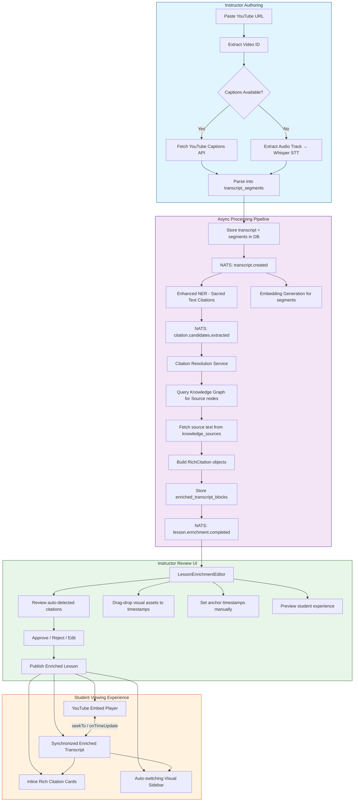
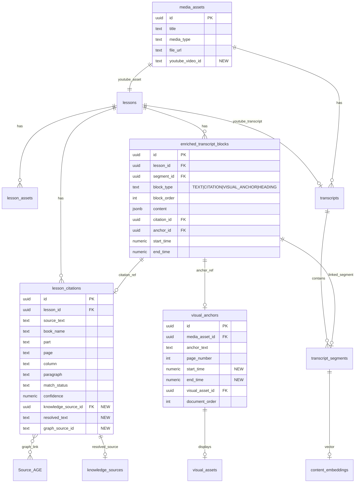
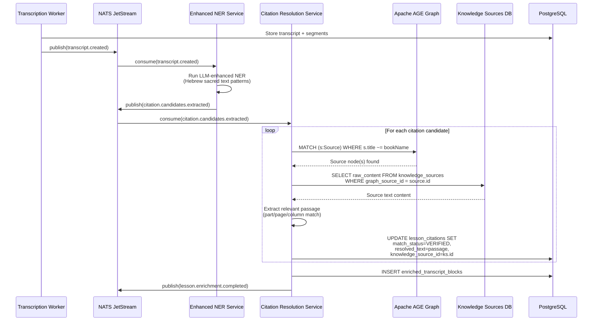
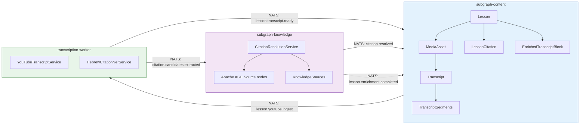

# FEAT: Semantic-Enriched Lesson Creation

## Epic Overview

Transform raw YouTube lecture recordings into rich, semantically-linked lesson experiences. An instructor pastes a YouTube URL; the system extracts the transcript, identifies sacred text citations via enhanced NER, resolves them against the knowledge graph, and produces an enriched transcript with inline citation blocks and visual anchors synchronized to video timestamps. Students view the lesson with a synchronized YouTube embed, auto-scrolling enriched transcript, expandable rich citation cards, and auto-switching visual anchors.

**Design Decision:** Videos remain on YouTube (embedded via IFrame Player API). No video download, no storage of video files. Only transcript text + timestamps are extracted and stored.

## What Already Exists (DO NOT Rebuild)

| Component | Location | Status |
|-----------|----------|--------|
| Transcription Worker | `apps/transcription-worker/` | COMPLETE |
| Whisper Client (dual-mode STT) | `apps/transcription-worker/src/transcription/whisper.client.ts` | COMPLETE |
| DB: `media_assets`, `transcripts`, `transcript_segments` | `packages/db/src/schema/content.ts` | COMPLETE |
| DB: `lessons`, `lesson_assets`, `lesson_citations` | `packages/db/src/schema/lesson.ts` | COMPLETE |
| DB: `visual_anchors`, `visual_assets`, `document_versions` | `packages/db/src/schema/visual-anchoring.ts` | COMPLETE |
| DB: `knowledge_sources` (includes YOUTUBE type) | `packages/db/src/schema/knowledge-sources.ts` | COMPLETE |
| DB: `content_embeddings`, `concept_embeddings` | `packages/db/src/schema/embeddings.ts` | COMPLETE |
| Knowledge Graph (Apache AGE, 5 node types, 7 edge types) | `packages/db/src/graph/ontology.ts` | COMPLETE |
| Concept Extractor (Vercel AI SDK) | `apps/transcription-worker/src/knowledge/concept-extractor.ts` | COMPLETE |
| NER-to-Graph Consumer | `apps/subgraph-knowledge/src/nats/nats.consumer.ts` | COMPLETE |
| CypherConceptService (upsertConceptsFromNER) | `apps/subgraph-knowledge/src/graph/cypher-concept.service.ts` | COMPLETE |
| CypherSourceService | `apps/subgraph-knowledge/src/graph/cypher-source.service.ts` | COMPLETE |
| Visual Anchoring UI | `apps/web/src/components/visual-anchoring/` | COMPLETE |
| UnifiedLearningPage (two-panel layout) | `apps/web/src/pages/UnifiedLearningPage.tsx` | COMPLETE |
| YouTube Client (playlist metadata) | `apps/subgraph-content/src/content-import/youtube.client.ts` | PARTIAL |
| Lesson GraphQL SDL (with citations) | `apps/subgraph-content/src/lesson/lesson.graphql` | COMPLETE |
| Knowledge Source GraphQL (addYoutubeSource) | `apps/subgraph-knowledge/src/sources/knowledge-source.graphql` | COMPLETE |
| useContentData hook | `apps/web/src/hooks/useContentData.ts` | COMPLETE |
| NATS events pipeline | `apps/transcription-worker/src/nats/`, `packages/nats-client/` | COMPLETE |

## System Flow Diagram



## Data Model Diagram



## Citation Resolution Sequence Diagram



---

## Phase 1: Foundation — DB Schema + YouTube Transcript Extraction

**Goal:** Extract transcripts from YouTube videos and store them in the existing schema. Create the `enriched_transcript_blocks` table.

### Tasks

| ID | Task | Size | New/Modify |
|----|------|------|------------|
| P1-01 | Add `youtube_video_id` column to `media_assets` | S | Modify `packages/db/src/schema/content.ts` |
| P1-02 | Add `knowledge_source_id`, `resolved_text`, `graph_source_id` columns to `lesson_citations` | S | Modify `packages/db/src/schema/lesson.ts` |
| P1-03 | Add `start_time`, `end_time` columns to `visual_anchors` | S | Modify `packages/db/src/schema/visual-anchoring.ts` |
| P1-04 | Create `enriched_transcript_blocks` table | M | New file `packages/db/src/schema/enriched-transcript.ts` |
| P1-05 | Write migration `0044_semantic_enriched_lesson.sql` | M | New file `packages/db/drizzle/0044_semantic_enriched_lesson.sql` |
| P1-06 | Build `YouTubeTranscriptService` — extract captions via youtube-transcript lib | L | New file `apps/transcription-worker/src/youtube/youtube-transcript.service.ts` |
| P1-07 | Build `YouTubeTranscriptModule` wiring | S | New file `apps/transcription-worker/src/youtube/youtube-transcript.module.ts` |
| P1-08 | Add NATS consumer in transcription-worker for `lesson.youtube.ingest` | M | New file `apps/transcription-worker/src/youtube/youtube-ingest.consumer.ts` |
| P1-09 | Extend `YouTubeClient` to extract video ID from any YouTube URL format | S | Modify `apps/subgraph-content/src/content-import/youtube.client.ts` |
| P1-10 | Add `ingestYoutubeLesson` mutation in content subgraph | M | Modify `apps/subgraph-content/src/lesson/lesson.graphql` + new resolver |
| P1-11 | Unit tests for YouTubeTranscriptService | M | New spec files |
| P1-12 | Integration test: YouTube URL -> stored transcript_segments | L | New integration spec |

### New DB Table: `enriched_transcript_blocks`

```typescript
// packages/db/src/schema/enriched-transcript.ts
export const enriched_transcript_blocks = pgTable('enriched_transcript_blocks', {
  id: pk(),
  tenant_id: tenantId().references(() => tenants.id, { onDelete: 'cascade' }),
  lesson_id: uuid('lesson_id').notNull().references(() => lessons.id, { onDelete: 'cascade' }),
  segment_id: uuid('segment_id').references(() => transcript_segments.id, { onDelete: 'set null' }),
  block_type: text('block_type', {
    enum: ['TEXT', 'CITATION', 'VISUAL_ANCHOR', 'HEADING'],
  }).notNull(),
  block_order: integer('block_order').notNull().default(0),
  content: jsonb('content').notNull().default({}),
  citation_id: uuid('citation_id').references(() => lesson_citations.id, { onDelete: 'set null' }),
  anchor_id: uuid('anchor_id').references(() => visualAnchors.id, { onDelete: 'set null' }),
  start_time: numeric('start_time', { precision: 10, scale: 3 }),
  end_time: numeric('end_time', { precision: 10, scale: 3 }),
  ...timestamps,
  ...softDelete,
}).withRLS();
```

### NATS Events (New)

| Subject | Publisher | Consumer | Payload |
|---------|-----------|----------|---------|
| `lesson.youtube.ingest` | Content subgraph | Transcription worker | `{ lessonId, youtubeUrl, tenantId, courseId }` |
| `lesson.transcript.ready` | Transcription worker | Content subgraph + Knowledge subgraph | `{ lessonId, transcriptId, segmentCount, tenantId }` |

### Acceptance Criteria

- [ ] `enriched_transcript_blocks` table exists with correct FKs and indexes
- [ ] `media_assets.youtube_video_id` column added
- [ ] `visual_anchors.start_time` and `end_time` columns added
- [ ] `lesson_citations` extended with `knowledge_source_id`, `resolved_text`, `graph_source_id`
- [ ] Given a YouTube URL, system extracts transcript segments with timestamps
- [ ] Segments stored in `transcripts` + `transcript_segments` tables
- [ ] NATS event `lesson.transcript.ready` published on completion
- [ ] Works for Hebrew, English, and multi-language captions
- [ ] Fallback to Whisper when no captions available (audio-only extraction)
- [ ] All tests pass

---

## Phase 2: Citation Matching — Enhanced NER + Knowledge Graph Resolution

**Goal:** Detect Hebrew sacred text references in transcripts and resolve them against the knowledge graph to produce verified citations with actual source text.

### Tasks

| ID | Task | Size | New/Modify |
|----|------|------|------------|
| P2-01 | Build `HebrewCitationNerService` — LLM-enhanced NER for sacred text references | XL | New file `apps/transcription-worker/src/knowledge/hebrew-citation-ner.service.ts` |
| P2-02 | Define Zod schemas for citation NER output | S | New file `apps/transcription-worker/src/knowledge/citation-ner.schemas.ts` |
| P2-03 | Build `CitationResolutionService` in knowledge subgraph | XL | New file `apps/subgraph-knowledge/src/citation/citation-resolution.service.ts` |
| P2-04 | Build `CitationResolutionModule` | S | New file `apps/subgraph-knowledge/src/citation/citation-resolution.module.ts` |
| P2-05 | Add `CypherSourceService.findSourceByTitleFuzzy()` for fuzzy book name matching | M | Modify `apps/subgraph-knowledge/src/graph/cypher-source.service.ts` |
| P2-06 | NATS consumer for `citation.candidates.extracted` | M | New file `apps/subgraph-knowledge/src/citation/citation-nats.consumer.ts` |
| P2-07 | NATS consumer in transcription-worker for `lesson.transcript.ready` to trigger NER | M | New file `apps/transcription-worker/src/knowledge/citation-ner.consumer.ts` |
| P2-08 | Enriched transcript block builder — assembles TEXT + CITATION blocks | L | New file `apps/subgraph-knowledge/src/citation/enriched-block-builder.service.ts` |
| P2-09 | Unit tests for HebrewCitationNerService | L | New spec |
| P2-10 | Unit tests for CitationResolutionService | L | New spec |
| P2-11 | Integration test: transcript → NER → graph lookup → verified citation | XL | New integration spec |

### NER Pattern Recognition (Hebrew Sacred Text)

The `HebrewCitationNerService` uses a specialized LLM prompt recognizing:
- "עץ חיים שער ממז"א" (Etz Chaim, Gate of MaZ"A)
- "רחובות הנהר פרשת בראשית" (Rechovot HaNahar, Parashat Bereshit)
- "זוהר חלק א דף לב" (Zohar Volume 1, Page 32)
- Standard Hebrew citation notation (book + part + page + column + paragraph)

Output: `{ bookName, part, page, column, paragraph, originalText, confidence }`

### NATS Events (New)

| Subject | Publisher | Consumer | Payload |
|---------|-----------|----------|---------|
| `citation.candidates.extracted` | Transcription worker | Knowledge subgraph | `{ lessonId, tenantId, candidates: CitationCandidate[] }` |
| `citation.resolved` | Knowledge subgraph | Content subgraph | `{ lessonId, tenantId, citationId, matchStatus }` |
| `lesson.enrichment.completed` | Knowledge subgraph | Content subgraph | `{ lessonId, tenantId, blockCount, citationCount }` |

### Acceptance Criteria

- [ ] NER correctly identifies Hebrew sacred text references from transcript text
- [ ] Citation candidates resolved against Apache AGE Source nodes (fuzzy title match)
- [ ] Source text fetched from `knowledge_sources.raw_content` when available
- [ ] `lesson_citations` rows updated with `match_status=VERIFIED`, `resolved_text`, `knowledge_source_id`
- [ ] `enriched_transcript_blocks` rows created with correct ordering and references
- [ ] Unresolvable citations marked as `UNVERIFIED` (not dropped)
- [ ] Pipeline is idempotent — re-running does not duplicate blocks
- [ ] All tests pass

---

## Phase 3: Authoring UI — Instructor Enrichment Editor

**Goal:** Build the instructor-facing editor where they paste a YouTube URL, review auto-detected citations, manage visual anchors with timestamps, and preview the student experience.

### Tasks

| ID | Task | Size | New/Modify |
|----|------|------|------------|
| P3-01 | Build `YouTubeEmbedPlayer` React component (IFrame Player API wrapper) | L | New file `apps/web/src/components/youtube/YouTubeEmbedPlayer.tsx` |
| P3-02 | Build `useYouTubePlayer` hook (getCurrentTime, seekTo, onTimeUpdate) | M | New file `apps/web/src/hooks/useYouTubePlayer.ts` |
| P3-03 | Build `EnrichedTranscriptPanel` — renders blocks with citation highlighting | L | New file `apps/web/src/components/enriched-transcript/EnrichedTranscriptPanel.tsx` |
| P3-04 | Build `CitationCard` — expandable card showing source text + metadata | M | New file `apps/web/src/components/enriched-transcript/CitationCard.tsx` |
| P3-05 | Build `LessonEnrichmentEditor` page | XL | New file `apps/web/src/pages/LessonEnrichmentEditor.tsx` |
| P3-06 | Build `YouTubeUrlInput` component — paste URL, preview thumbnail, trigger ingest | M | New file `apps/web/src/components/lesson/YouTubeUrlInput.tsx` |
| P3-07 | Build `CitationReviewPanel` — approve/reject/edit auto-detected citations | L | New file `apps/web/src/components/lesson/CitationReviewPanel.tsx` |
| P3-08 | Build `TimestampAnchorEditor` — set start/end time for visual anchors | M | New file `apps/web/src/components/lesson/TimestampAnchorEditor.tsx` |
| P3-09 | GraphQL queries/mutations for enriched lesson CRUD | M | New file `apps/web/src/lib/graphql/enriched-lesson.queries.ts` |
| P3-10 | Add GraphQL SDL for enriched transcript types + mutations in content subgraph | L | New file `apps/subgraph-content/src/enriched-lesson/enriched-lesson.graphql` |
| P3-11 | Build resolver + service for enriched lesson mutations | L | New files in `apps/subgraph-content/src/enriched-lesson/` |
| P3-12 | Build `useEnrichedLesson` hook (fetch blocks, citations, anchors) | M | New file `apps/web/src/hooks/useEnrichedLesson.ts` |
| P3-13 | Build `useCitationReview` hook (approve/reject/edit mutations) | M | New file `apps/web/src/hooks/useCitationReview.ts` |
| P3-14 | Unit tests for all new components | L | New test files |
| P3-15 | Route registration for `/lesson/:lessonId/edit` | S | Modify `apps/web/src/routes.tsx` or equivalent |

### New GraphQL SDL (Content Subgraph)

```graphql
# apps/subgraph-content/src/enriched-lesson/enriched-lesson.graphql

enum EnrichedBlockType {
  TEXT
  CITATION
  VISUAL_ANCHOR
  HEADING
}

type EnrichedTranscriptBlock {
  id: ID!
  lessonId: ID!
  segmentId: ID
  blockType: EnrichedBlockType!
  blockOrder: Int!
  content: JSON!
  citation: LessonCitation
  anchor: VisualAnchor
  startTime: Float
  endTime: Float
}

type EnrichedLesson {
  id: ID!
  lesson: Lesson!
  blocks: [EnrichedTranscriptBlock!]!
  citations: [LessonCitation!]!
  youtubeVideoId: String
  transcriptReady: Boolean!
  enrichmentStatus: EnrichmentStatus!
}

enum EnrichmentStatus {
  PENDING
  EXTRACTING_TRANSCRIPT
  RUNNING_NER
  RESOLVING_CITATIONS
  READY
  PUBLISHED
}

input IngestYoutubeLessonInput {
  lessonId: ID!
  youtubeUrl: String!
}

input UpdateCitationInput {
  matchStatus: CitationMatchStatus
  sourceText: String
  bookName: String
  part: String
  page: String
  column: String
  paragraph: String
}

input SetBlockAnchorTimestampInput {
  blockId: ID!
  startTime: Float!
  endTime: Float
}

extend type Query {
  enrichedLesson(lessonId: ID!): EnrichedLesson @authenticated
}

extend type Mutation {
  ingestYoutubeLesson(input: IngestYoutubeLessonInput!): EnrichedLesson!
    @authenticated
    @requiresRole(roles: [INSTRUCTOR, ORG_ADMIN, SUPER_ADMIN])

  updateLessonCitation(citationId: ID!, input: UpdateCitationInput!): LessonCitation!
    @authenticated
    @requiresRole(roles: [INSTRUCTOR, ORG_ADMIN, SUPER_ADMIN])

  setBlockAnchorTimestamp(input: SetBlockAnchorTimestampInput!): EnrichedTranscriptBlock!
    @authenticated
    @requiresRole(roles: [INSTRUCTOR, ORG_ADMIN, SUPER_ADMIN])

  publishEnrichedLesson(lessonId: ID!): EnrichedLesson!
    @authenticated
    @requiresRole(roles: [INSTRUCTOR, ORG_ADMIN, SUPER_ADMIN])
}
```

### Acceptance Criteria

- [ ] YouTubeEmbedPlayer loads YouTube video, exposes seekTo/getCurrentTime/onTimeUpdate
- [ ] Instructor can paste YouTube URL and see transcript extraction progress
- [ ] EnrichedTranscriptPanel renders TEXT and CITATION blocks with correct ordering
- [ ] CitationCard expands to show resolved source text, book/part/page/column
- [ ] Instructor can approve, reject, or edit each auto-detected citation
- [ ] Instructor can upload visual assets and assign them to transcript timestamps
- [ ] Preview mode shows what students will see
- [ ] All mutations use RLS via `withTenantContext()`
- [ ] All components have unit tests

---

## Phase 4: Student Viewing Experience

**Goal:** Enhance the UnifiedLearningPage to support enriched lessons with YouTube embed, synchronized transcript, inline citation cards, and auto-switching visual anchors.

### Tasks

| ID | Task | Size | New/Modify |
|----|------|------|------------|
| P4-01 | Integrate `YouTubeEmbedPlayer` into `UnifiedLearningPage.tools-panel.tsx` | M | Modify existing file |
| P4-02 | Build `SyncTranscriptScroller` — auto-scrolls transcript to match video time | L | New file `apps/web/src/components/enriched-transcript/SyncTranscriptScroller.tsx` |
| P4-03 | Build `useTranscriptSync` hook — bidirectional sync between player and transcript | M | New file `apps/web/src/hooks/useTranscriptSync.ts` |
| P4-04 | Enhance `VisualSidebar` to accept timestamp-based anchors | M | Modify `apps/web/src/components/visual-anchoring/VisualSidebar.tsx` |
| P4-05 | Build `useTimestampAnchorDetection` — time-based anchor switching | M | New file `apps/web/src/hooks/useTimestampAnchorDetection.ts` |
| P4-06 | Enhance `useContentData` to detect YouTube content and return enriched data | M | Modify `apps/web/src/hooks/useContentData.ts` |
| P4-07 | Build `InlineCitationBlock` — student-facing citation within transcript flow | M | New file `apps/web/src/components/enriched-transcript/InlineCitationBlock.tsx` |
| P4-08 | Wire enriched lesson data into `UnifiedLearningPage` | L | Modify `apps/web/src/pages/UnifiedLearningPage.tsx` |
| P4-09 | Click-to-seek: click transcript paragraph → video seeks to timestamp | S | Integrated in SyncTranscriptScroller |
| P4-10 | Keyboard shortcuts: Space=play/pause, Arrows=seek +-5s, C=toggle citations | M | New file `apps/web/src/hooks/usePlayerKeyboardShortcuts.ts` |
| P4-11 | E2E test: full student viewing flow with mocked enriched data | XL | New Playwright spec |
| P4-12 | Unit tests for all new hooks and components | L | New test files |

### Acceptance Criteria

- [ ] YouTube video plays in left/top panel via IFrame Player API
- [ ] Transcript auto-scrolls to highlight current segment based on video time
- [ ] Click on transcript paragraph seeks video to that segment's start_time
- [ ] Inline citation cards appear at correct positions in transcript flow
- [ ] Citation cards expand to show resolved source text
- [ ] Visual sidebar switches anchors based on current video timestamp
- [ ] Keyboard shortcuts work (Space, Arrows, C)
- [ ] Performance: <100ms latency for time-based sync at 60fps
- [ ] All tests pass including E2E

---

## Phase 5: Polish, Mobile, and Optimization

**Goal:** Mobile support via Expo, performance optimization, and UX polish.

### Tasks

| ID | Task | Size | New/Modify |
|----|------|------|------------|
| P5-01 | Build Expo `YouTubePlayer` component using `react-native-youtube-iframe` | L | New file `apps/mobile/src/components/YouTubePlayer.tsx` |
| P5-02 | Build Expo `EnrichedTranscriptSheet` (bottom sheet with enriched transcript) | L | New file `apps/mobile/src/components/EnrichedTranscriptSheet.tsx` |
| P5-03 | Build Expo `CitationCard` (mobile-optimized) | M | New file `apps/mobile/src/components/CitationCard.tsx` |
| P5-04 | Offline caching: store enriched blocks in expo-sqlite for offline viewing | L | New file `apps/mobile/src/hooks/useOfflineEnrichedLesson.ts` |
| P5-05 | Performance: virtualize enriched transcript list (long lessons) | M | Use `react-window` or TanStack Virtual in EnrichedTranscriptPanel |
| P5-06 | Performance: debounce time-sync updates to 4Hz (250ms) | S | Modify useTranscriptSync |
| P5-07 | Accessibility: ARIA labels for citation cards, keyboard navigation, screen reader | M | Modify enriched-transcript components |
| P5-08 | Accessibility: YouTube player with custom accessible controls overlay | M | Modify YouTubeEmbedPlayer |
| P5-09 | Analytics: track citation views, expansion rates, seek-from-transcript via xAPI | M | New file `apps/web/src/hooks/useEnrichedLessonAnalytics.ts` |
| P5-10 | Cache enriched lesson data in urql normalized cache with proper invalidation | M | Modify GraphQL cache config |
| P5-11 | Rate limiting: throttle YouTube transcript extraction (YouTube API quotas) | S | Add rate limiter in YouTubeTranscriptService |
| P5-12 | Full regression E2E suite | XL | New Playwright specs |

### Acceptance Criteria

- [ ] Mobile: YouTube plays inline with native controls
- [ ] Mobile: Enriched transcript in bottom sheet with citation cards
- [ ] Mobile: Offline viewing works for cached lessons
- [ ] Web: Virtualized transcript handles 1000+ blocks without jank
- [ ] Web: Time sync at 4Hz keeps UI responsive
- [ ] WCAG 2.1 AA compliance for all new components
- [ ] xAPI events fired for citation interactions
- [ ] YouTube API quota not exceeded (rate limiting)
- [ ] All tests pass across web and mobile

---

## Cross-Subgraph Dependencies



### Key Integration Points

1. **Content subgraph → Transcription Worker**: `lesson.youtube.ingest` triggers YouTube transcript extraction
2. **Transcription Worker → Content subgraph**: `lesson.transcript.ready` updates lesson status
3. **Transcription Worker → Knowledge subgraph**: `citation.candidates.extracted` triggers citation resolution
4. **Knowledge subgraph → Content subgraph**: `lesson.enrichment.completed` completes the pipeline

---

## Migration Plan

**Migration file:** `packages/db/drizzle/0044_semantic_enriched_lesson.sql`

```sql
-- 1. Add youtube_video_id to media_assets
ALTER TABLE media_assets ADD COLUMN youtube_video_id TEXT;
CREATE INDEX idx_media_assets_youtube ON media_assets (youtube_video_id) WHERE youtube_video_id IS NOT NULL;

-- 2. Extend lesson_citations with resolution columns
ALTER TABLE lesson_citations ADD COLUMN knowledge_source_id UUID REFERENCES knowledge_sources(id) ON DELETE SET NULL;
ALTER TABLE lesson_citations ADD COLUMN resolved_text TEXT;
ALTER TABLE lesson_citations ADD COLUMN graph_source_id TEXT;
CREATE INDEX idx_lesson_citations_ks ON lesson_citations (knowledge_source_id);

-- 3. Add timestamp columns to visual_anchors
ALTER TABLE visual_anchors ADD COLUMN start_time NUMERIC(10,3);
ALTER TABLE visual_anchors ADD COLUMN end_time NUMERIC(10,3);
CREATE INDEX idx_visual_anchors_time ON visual_anchors (media_asset_id, start_time) WHERE start_time IS NOT NULL;

-- 4. Create enriched_transcript_blocks table
CREATE TABLE enriched_transcript_blocks (
  id UUID PRIMARY KEY DEFAULT gen_random_uuid(),
  tenant_id UUID NOT NULL REFERENCES tenants(id) ON DELETE CASCADE,
  lesson_id UUID NOT NULL REFERENCES lessons(id) ON DELETE CASCADE,
  segment_id UUID REFERENCES transcript_segments(id) ON DELETE SET NULL,
  block_type TEXT NOT NULL CHECK (block_type IN ('TEXT', 'CITATION', 'VISUAL_ANCHOR', 'HEADING')),
  block_order INTEGER NOT NULL DEFAULT 0,
  content JSONB NOT NULL DEFAULT '{}',
  citation_id UUID REFERENCES lesson_citations(id) ON DELETE SET NULL,
  anchor_id UUID REFERENCES visual_anchors(id) ON DELETE SET NULL,
  start_time NUMERIC(10,3),
  end_time NUMERIC(10,3),
  created_at TIMESTAMPTZ NOT NULL DEFAULT now(),
  updated_at TIMESTAMPTZ NOT NULL DEFAULT now(),
  deleted_at TIMESTAMPTZ
);

CREATE INDEX idx_etb_tenant ON enriched_transcript_blocks (tenant_id);
CREATE INDEX idx_etb_lesson ON enriched_transcript_blocks (lesson_id);
CREATE INDEX idx_etb_lesson_order ON enriched_transcript_blocks (lesson_id, block_order);
CREATE INDEX idx_etb_segment ON enriched_transcript_blocks (segment_id) WHERE segment_id IS NOT NULL;
CREATE INDEX idx_etb_time ON enriched_transcript_blocks (lesson_id, start_time) WHERE start_time IS NOT NULL;

-- 5. RLS policy for enriched_transcript_blocks
ALTER TABLE enriched_transcript_blocks ENABLE ROW LEVEL SECURITY;
CREATE POLICY etb_tenant_isolation ON enriched_transcript_blocks
  USING (tenant_id = current_setting('app.current_tenant')::uuid);
```

---

## Test Plan Summary

| Phase | Test Type | Count (est.) | Key Tests |
|-------|-----------|-------------|-----------|
| P1 | Unit | ~15 | YouTubeTranscriptService, URL parsing, segment storage |
| P1 | Integration | ~5 | Full ingest pipeline, NATS event flow |
| P2 | Unit | ~20 | HebrewCitationNER, CitationResolution, fuzzy Source matching |
| P2 | Integration | ~5 | End-to-end NER → graph → citation verification |
| P3 | Unit | ~25 | All React components, hooks, GraphQL mutations |
| P3 | E2E | ~5 | Instructor authoring flow |
| P4 | Unit | ~20 | Sync hooks, player integration, keyboard shortcuts |
| P4 | E2E | ~8 | Student viewing flow, click-to-seek, citation expansion |
| P5 | Unit | ~10 | Mobile components, offline caching |
| P5 | E2E | ~5 | Full regression suite |
| **Total** | | **~118** | |

### RLS Test Requirements (100% coverage)

- `enriched_transcript_blocks` — tenant isolation verified
- `lesson_citations` extended columns — tenant context propagated
- Cross-tenant access blocked for all new queries

---

## Risk Register

| Risk | Impact | Mitigation |
|------|--------|------------|
| YouTube Captions API may not have captions for all videos | Medium | Fallback to Whisper audio extraction (existing infrastructure) |
| YouTube API quota limits | Medium | Rate limiting, caching transcript results, batch processing |
| Hebrew NER accuracy for sacred text references | High | LLM-enhanced NER with specialized prompt; instructor review as safety net |
| Citation resolution may not find matching Source in graph | Medium | Mark as UNVERIFIED; instructor can manually edit and verify |
| IFrame Player API CSP restrictions | Low | Configure CSP headers; YouTube domain commonly allowed |
| Large transcript synchronization performance | Medium | Virtualized list, debounced sync at 4Hz, intersection observer |

---

## Complexity Summary

| Phase | S | M | L | XL | Total Tasks |
|-------|---|---|---|----|----|
| Phase 1 | 3 | 4 | 3 | 0 | 12 |
| Phase 2 | 1 | 3 | 3 | 2 | 11 |
| Phase 3 | 1 | 7 | 5 | 1 | 15 |
| Phase 4 | 1 | 5 | 3 | 1 | 12 |
| Phase 5 | 2 | 5 | 3 | 1 | 12 |
| **Total** | **8** | **24** | **17** | **5** | **62** |
