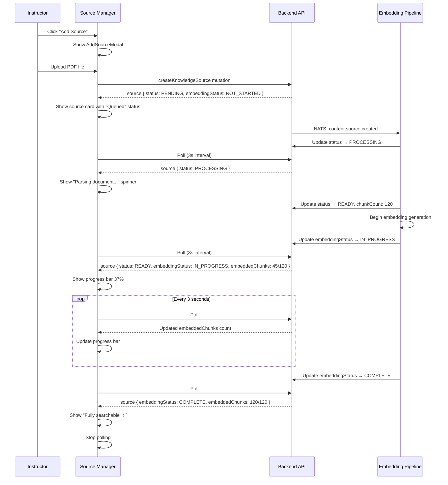
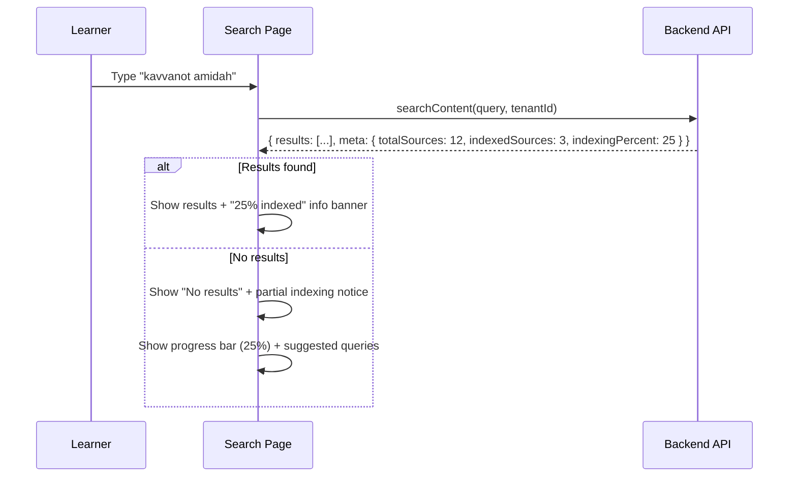
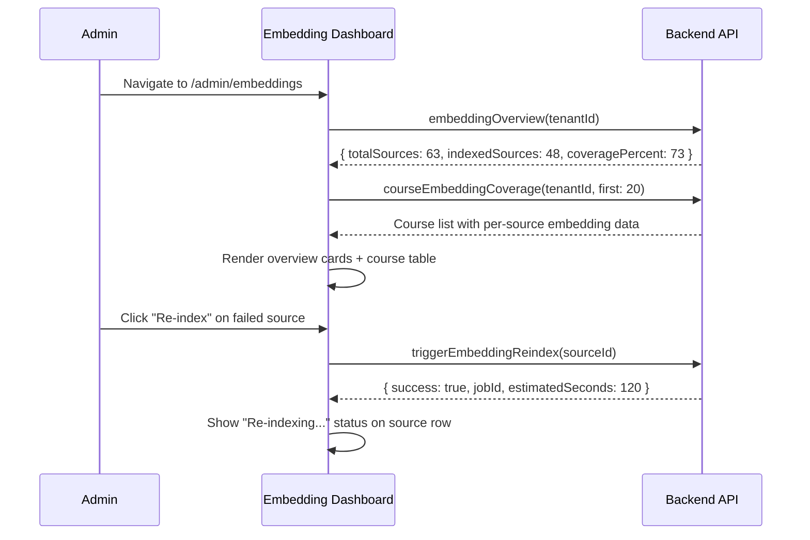
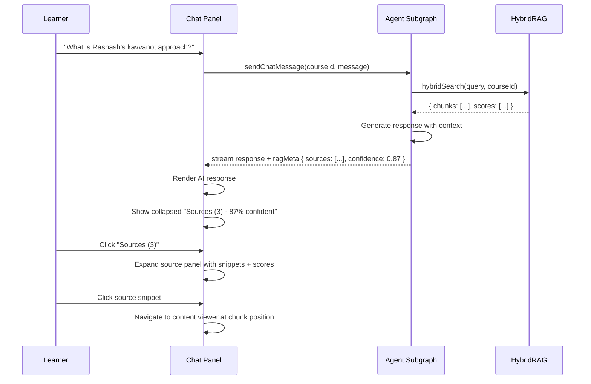

# RAG Activation Feature — UX Design Specification

**Status:** Draft
**Date:** 2026-03-27
**Scope:** Embedding status UX, search empty states, admin embedding dashboard, RAG quality indicator
**Affected Areas:** Source Manager, Search Page, Content Viewer (AI Chat), Admin Dashboard

---

## Table of Contents

1. [Overview](#overview)
2. [Feature 1: Embedding Status Indicator](#feature-1-embedding-status-indicator)
3. [Feature 2: Search Experience When Empty](#feature-2-search-experience-when-empty)
4. [Feature 3: Admin Embedding Dashboard](#feature-3-admin-embedding-dashboard)
5. [Feature 4: RAG Quality Indicator](#feature-4-rag-quality-indicator)
6. [User Flows](#user-flows)
7. [Accessibility Requirements](#accessibility-requirements)
8. [Mobile Parity](#mobile-parity)
9. [Error & Empty States](#error--empty-states)
10. [Loading States](#loading-states)

---

## Overview

The RAG (Retrieval-Augmented Generation) system in EduSphere processes user-uploaded content through a pipeline: upload -> parse -> chunk -> embed -> index. Currently, the Source Manager component shows source-level status (PENDING/PROCESSING/READY/FAILED) but does not expose the **embedding** dimension — whether chunks have been vectorized and are searchable. Search returns empty results when embeddings are missing, with no explanation. AI chat answers lack source attribution despite HybridRAG returning source metadata.

This spec defines four UX improvements to make the RAG pipeline transparent, trustworthy, and actionable.

---

## Feature 1: Embedding Status Indicator

### Problem

The Source Manager (`apps/web/src/components/source-manager/SourceManager.tsx`) shows `SourceStatus` (PENDING | PROCESSING | READY | FAILED) which tracks **document parsing**, not **embedding generation**. A source can be READY (parsed and chunked) but have zero embeddings — meaning it won't appear in search or AI answers.

### Solution: Two-Phase Status Display

Extend the existing source card to show a two-phase progress indicator:

```
Phase 1: Document Processing    Phase 2: Embedding Generation
[=============================] [==============              ]
  Parsing complete ✓               Embedding: 47/120 chunks
```

### Wireframe — Source Card (Enhanced)

```
┌─────────────────────────────────────────────────┐
│ 📕  Nahar Shalom — Rashash Siddur          ✕    │
│     nahar-shalom.docx                            │
│     "The inner kavvanot of the Amidah..."        │
│                                                  │
│  ┌─ Processing ──────────────────────────────┐   │
│  │  ✅ Parsed  ·  500 chunks                 │   │
│  └───────────────────────────────────────────┘   │
│  ┌─ Embedding ───────────────────────────────┐   │
│  │  ⏳ Indexing  ·  312/500 chunks  (62%)    │   │
│  │  [████████████░░░░░░░░]                   │   │
│  └───────────────────────────────────────────┘   │
│                                                  │
│  ⚡ Searchable: Partial (62%)                    │
└─────────────────────────────────────────────────┘
```

### Wireframe — Source Card (Fully Indexed)

```
┌─────────────────────────────────────────────────┐
│ 📕  Nahar Shalom — Rashash Siddur          ✕    │
│     nahar-shalom.docx                            │
│     "The inner kavvanot of the Amidah..."        │
│                                                  │
│  ✅ Parsed  ·  500 chunks                        │
│  ✅ Indexed ·  500/500 embeddings                │
│  🟢 Fully searchable                             │
└─────────────────────────────────────────────────┘
```

### Wireframe — Source Card (Embedding Failed)

```
┌─────────────────────────────────────────────────┐
│ 📕  Nahar Shalom — Rashash Siddur          ✕    │
│     nahar-shalom.docx                            │
│     "The inner kavvanot of the Amidah..."        │
│                                                  │
│  ✅ Parsed  ·  500 chunks                        │
│  🔴 Embedding failed  ·  0/500                   │
│     "Ollama service unavailable"                 │
│  [ Retry Embedding ]                             │
└─────────────────────────────────────────────────┘
```

### New Type: EmbeddingStatus

```typescript
// Extends existing KnowledgeSource type
interface KnowledgeSource {
  // ... existing fields ...
  embeddingStatus: 'NOT_STARTED' | 'IN_PROGRESS' | 'COMPLETE' | 'PARTIAL' | 'FAILED';
  embeddedChunks: number;   // chunks with embeddings
  totalChunks: number;      // total chunks from parsing
  embeddingError?: string;  // error message if FAILED
}
```

### Interaction States

| Source Status | Embedding Status | Display | Searchable? |
|---|---|---|---|
| PENDING | NOT_STARTED | "Queued for processing" | No |
| PROCESSING | NOT_STARTED | "Parsing document..." (spinner) | No |
| READY | NOT_STARTED | "Parsed, waiting for indexing" | No |
| READY | IN_PROGRESS | Progress bar + "Indexing 47/120 chunks" | Partial |
| READY | COMPLETE | Green checkmark + "Fully searchable" | Yes |
| READY | PARTIAL | Yellow warning + "62% searchable" | Partial |
| READY | FAILED | Red error + retry button | No |
| FAILED | NOT_STARTED | Red error on parsing + no embedding row | No |

### Polling Strategy

- When `embeddingStatus === 'IN_PROGRESS'`: poll every 3 seconds (matches existing `refetchInterval` pattern in SourceManager)
- When `embeddingStatus === 'COMPLETE'` or `FAILED`: stop polling
- Animate progress bar transitions with `transition-all duration-300`

---

## Feature 2: Search Experience When Empty

### Problem

The Search Page (`apps/web/src/pages/search/SearchPage.tsx`) shows `t('noResults')` when no results are found. This is ambiguous — the user cannot distinguish between "no content matches your query" vs "content exists but hasn't been indexed yet."

### Solution: Context-Aware Empty States

Add an API field `searchMeta` returned alongside search results that indicates the indexing state of the tenant's content.

### Wireframe — No Embeddings Exist (Instructor View)

```
┌─────────────────────────────────────────────────────────┐
│                                                         │
│              🔍                                         │
│                                                         │
│     Content Not Yet Indexed                             │
│                                                         │
│     Your courses have content, but it hasn't been       │
│     indexed for semantic search yet. Once indexed,      │
│     you'll be able to search across all course          │
│     materials using natural language.                   │
│                                                         │
│     📊 Indexing Status:                                 │
│        • 12 sources uploaded                            │
│        • 0 sources indexed                              │
│        • Estimated time: ~5 minutes                     │
│                                                         │
│     [ Start Indexing ]    [ Learn More ]                │
│                                                         │
└─────────────────────────────────────────────────────────┘
```

### Wireframe — No Embeddings Exist (Learner View)

```
┌─────────────────────────────────────────────────────────┐
│                                                         │
│              🔍                                         │
│                                                         │
│     Search Coming Soon                                  │
│                                                         │
│     Your instructor is preparing course materials       │
│     for search. In the meantime, you can browse         │
│     courses directly.                                   │
│                                                         │
│     [ Browse Courses ]                                  │
│                                                         │
└─────────────────────────────────────────────────────────┘
```

### Wireframe — Partial Indexing (Query Has No Hits)

```
┌─────────────────────────────────────────────────────────┐
│                                                         │
│     No results for "quantum entanglement"               │
│                                                         │
│     ℹ️ Note: Only 3 of 12 sources are indexed.          │
│     More results may appear once indexing completes.    │
│                                                         │
│     [████░░░░░░░░] 25% indexed                         │
│                                                         │
│     Try these suggested queries:                        │
│     [ Talmud study ]  [ Rashash kavvanot ]  [ Prayer ] │
│                                                         │
└─────────────────────────────────────────────────────────┘
```

### Wireframe — Fully Indexed, No Match

```
┌─────────────────────────────────────────────────────────┐
│                                                         │
│     No results for "quantum entanglement"               │
│                                                         │
│     All course materials have been searched.            │
│     Try different keywords or check spelling.           │
│                                                         │
│     Try these suggested queries:                        │
│     [ Talmud study ]  [ Rashash kavvanot ]  [ Prayer ] │
│                                                         │
└─────────────────────────────────────────────────────────┘
```

### New Type: SearchMeta

```typescript
interface SearchMeta {
  totalSources: number;       // total knowledge sources in tenant
  indexedSources: number;     // sources with complete embeddings
  indexingInProgress: boolean; // any sources currently embedding
  indexingPercent: number;     // 0-100
}
```

### Role-Based Display Logic

| Role | No Embeddings | Partial | Full + No Match |
|---|---|---|---|
| STUDENT | "Search coming soon" + browse CTA | "More results may appear" banner | Standard no-results |
| INSTRUCTOR | Indexing status + "Start Indexing" CTA | Progress bar + count | Standard no-results |
| ORG_ADMIN | Full dashboard link + indexing CTA | Progress bar + admin link | Standard no-results |
| SUPER_ADMIN | Full dashboard link + indexing CTA | Progress bar + admin link | Standard no-results |

---

## Feature 3: Admin Embedding Dashboard

### Problem

Administrators have no visibility into the RAG indexing state across their organization. They cannot see which courses have embeddings, coverage gaps, or trigger re-indexing.

### Solution: New Admin Panel — Embedding Management

Located at `/admin/embeddings` within the existing admin routes.

### Wireframe — Dashboard Overview

```
┌──────────────────────────────────────────────────────────────────┐
│  Embedding Management                                [ Re-index All ] │
│                                                                  │
│  ┌──────────────┐  ┌──────────────┐  ┌──────────────┐          │
│  │   Overall     │  │   Sources    │  │   Storage    │          │
│  │   Coverage    │  │   Status     │  │   Usage      │          │
│  │              │  │              │  │              │          │
│  │    73%       │  │  48 Ready    │  │  2.4 GB      │          │
│  │   ██████░░░  │  │  12 Pending  │  │  of 10 GB    │          │
│  │              │  │   3 Failed   │  │              │          │
│  └──────────────┘  └──────────────┘  └──────────────┘          │
│                                                                  │
│  ┌──────────────────────────────────────────────────────────┐   │
│  │  Course Embedding Coverage                                │   │
│  │                                                           │   │
│  │  Course Name              Sources  Indexed  Coverage      │   │
│  │  ─────────────────────────────────────────────────────    │   │
│  │  Nahar Shalom (Rashash)   5/5      500/500  ████████ 100%│   │
│  │  Intro to Talmud          3/4      180/240  ██████░░  75%│   │
│  │  Hebrew Grammar           0/3        0/150  ░░░░░░░░   0%│   │
│  │  Mussar Ethics            2/2      120/120  ████████ 100%│   │
│  │  Halacha Overview         1/6       40/320  █░░░░░░░  13%│   │
│  │                                                           │   │
│  │  [ ← Prev ]  Page 1 of 3  [ Next → ]                    │   │
│  └──────────────────────────────────────────────────────────┘   │
│                                                                  │
│  ┌──────────────────────────────────────────────────────────┐   │
│  │  Recent Embedding Activity                                │   │
│  │                                                           │   │
│  │  🟢 10:32  Nahar Shalom — 500 chunks indexed (2m 14s)    │   │
│  │  🟡 10:30  Intro to Talmud — indexing 180/240...          │   │
│  │  🔴 10:28  Hebrew Grammar — failed: Ollama timeout        │   │
│  │  🟢 10:15  Mussar Ethics — 120 chunks indexed (45s)       │   │
│  │                                                           │   │
│  └──────────────────────────────────────────────────────────┘   │
└──────────────────────────────────────────────────────────────────┘
```

### Wireframe — Course Row Expanded

```
┌──────────────────────────────────────────────────────────────┐
│  ▼ Intro to Talmud          3/4    180/240   ██████░░  75%  │
│                                                              │
│    Source                    Type     Status    Embeddings   │
│    ──────────────────────────────────────────────────────    │
│    intro-talmud.pdf          PDF     ✅ Ready   80/80       │
│    gemara-basics.docx        DOCX    ✅ Ready   60/60       │
│    tosafot-methods.txt       Text    ⏳ Indexing 40/60      │
│    rashi-commentary.url      URL     🔴 Failed  0/40       │
│                                       [ Retry ]             │
│                                                              │
│    [ Re-index Course ]  [ View Course ]                     │
└──────────────────────────────────────────────────────────────┘
```

### Admin Actions

| Action | Description | Role Required |
|---|---|---|
| Re-index All | Trigger embedding generation for all un-indexed content | ORG_ADMIN |
| Re-index Course | Trigger for a specific course | ORG_ADMIN, INSTRUCTOR (own course) |
| Retry Failed | Retry embedding for a failed source | ORG_ADMIN, INSTRUCTOR (own course) |
| View Details | Expand course row to see per-source status | ORG_ADMIN, INSTRUCTOR |
| Export Report | Download CSV of embedding coverage | ORG_ADMIN |

### GraphQL Queries (Proposed)

```graphql
query EmbeddingDashboard($tenantId: ID!) {
  embeddingOverview(tenantId: $tenantId) {
    totalSources
    indexedSources
    failedSources
    pendingSources
    totalChunks
    indexedChunks
    storageUsedBytes
    storageLimitBytes
    overallCoveragePercent
  }
  courseEmbeddingCoverage(tenantId: $tenantId, first: 20) {
    edges {
      node {
        courseId
        courseTitle
        totalSources
        indexedSources
        totalChunks
        indexedChunks
        coveragePercent
        sources {
          id
          title
          sourceType
          status
          embeddingStatus
          embeddedChunks
          totalChunks
        }
      }
    }
    pageInfo { hasNextPage endCursor }
  }
}

mutation TriggerReindex($courseId: ID, $sourceId: ID) {
  triggerEmbeddingReindex(courseId: $courseId, sourceId: $sourceId) {
    success
    jobId
    estimatedSeconds
  }
}
```

---

## Feature 4: RAG Quality Indicator

### Problem

The AI Chat Panel (`apps/web/src/pages/content-viewer/AiChatPanel.tsx`) shows AI responses but does not display which knowledge sources contributed to the answer. The HybridRAG pipeline already returns source metadata (source IDs, relevance scores, chunk references) but this data is not surfaced to the user.

### Solution: Source Attribution Panel

Add collapsible source citations below each AI response, showing which sources contributed and with what confidence.

### Wireframe — AI Response With Sources

```
┌─────────────────────────────────────────────────────┐
│  🤖 AI Chavruta · Dialectical Partner               │
│  ─────────────────────────────────────────────────   │
│                                                      │
│  You: "What is the Rashash's approach to kavvanot    │
│        in the Amidah?"                               │
│                                                      │
│  ┌─────────────────────────────────────────────────┐ │
│  │ The Rashash (Rabbi Shalom Sharabi) developed a  │ │
│  │ systematic approach to kavvanot based on the    │ │
│  │ Ari's framework. In the Nahar Shalom, he       │ │
│  │ arranges the kavvanot for each blessing of the  │ │
│  │ Amidah according to the sefirot...              │ │
│  │                                                 │ │
│  │ ▼ Sources (3)                     87% confident │ │
│  │ ┌─────────────────────────────────────────────┐ │ │
│  │ │ 📕 Nahar Shalom — chunk 47      score: 0.94│ │ │
│  │ │ "...the first three blessings correspond..." │ │ │
│  │ │                                              │ │ │
│  │ │ 📕 Nahar Shalom — chunk 52      score: 0.89│ │ │
│  │ │ "...each sefira maps to a specific kavvana"  │ │ │
│  │ │                                              │ │ │
│  │ │ 🌐 rashash-study.org           score: 0.72 │ │ │
│  │ │ "Overview of Sharabi's Kabbalistic method"   │ │ │
│  │ └─────────────────────────────────────────────┘ │ │
│  └─────────────────────────────────────────────────┘ │
│                                                      │
└─────────────────────────────────────────────────────┘
```

### Wireframe — No Sources Available

```
┌─────────────────────────────────────────────────────┐
│  ┌─────────────────────────────────────────────────┐ │
│  │ Based on general knowledge, the Amidah has      │ │
│  │ 19 blessings and is the central prayer...       │ │
│  │                                                 │ │
│  │ ⚠️ No indexed sources — answer based on         │ │
│  │    general AI knowledge only.                   │ │
│  │    [ Index Course Materials ]                   │ │
│  └─────────────────────────────────────────────────┘ │
│                                                      │
└─────────────────────────────────────────────────────┘
```

### Wireframe — Low Confidence Warning

```
┌─────────────────────────────────────────────────────┐
│  ┌─────────────────────────────────────────────────┐ │
│  │ The relationship between the sefirot and        │ │
│  │ prayer times is discussed in several sources... │ │
│  │                                                 │ │
│  │ ▼ Sources (1)                     32% confident │ │
│  │ ┌─────────────────────────────────────────────┐ │ │
│  │ │ 📕 Nahar Shalom — chunk 201     score: 0.32│ │ │
│  │ │ "...the times of prayer relate to..."        │ │ │
│  │ └─────────────────────────────────────────────┘ │ │
│  │                                                 │ │
│  │ ⚠️ Low confidence — source relevance is weak.   │ │
│  │    This answer may rely on general knowledge.   │ │
│  └─────────────────────────────────────────────────┘ │
│                                                      │
└─────────────────────────────────────────────────────┘
```

### New Types

```typescript
interface RagSource {
  sourceId: string;
  sourceTitle: string;
  sourceType: SourceType;
  chunkIndex: number;
  snippet: string;          // relevant text excerpt
  relevanceScore: number;   // 0.0 - 1.0
}

interface AiResponseMeta {
  sources: RagSource[];
  overallConfidence: number; // 0.0 - 1.0 (average of top scores)
  ragMode: 'hybrid' | 'semantic_only' | 'graph_only' | 'none';
}

// Extended ChatMessage
interface ChatMessage {
  id: string;
  role: string;
  content: string;
  ragMeta?: AiResponseMeta; // only on assistant messages
}
```

### Confidence Thresholds

| Score Range | Display | Color |
|---|---|---|
| 0.80 - 1.00 | "High confidence" | Green (`text-green-600`) |
| 0.50 - 0.79 | "Moderate confidence" | Yellow (`text-yellow-600`) |
| 0.20 - 0.49 | "Low confidence" + warning | Orange (`text-orange-600`) |
| 0.00 - 0.19 | "Very low — general knowledge" | Red (`text-red-500`) |
| No sources | "No indexed sources" + CTA | Gray (`text-muted-foreground`) |

### Source Panel Behavior

- **Default state:** collapsed, showing "Sources (N)" + confidence badge
- **Click to expand:** reveals source cards with snippets
- **Click source:** navigates to content viewer at the relevant chunk position
- **Keyboard:** Enter/Space to toggle, arrow keys to navigate sources
- **Screen reader:** `aria-expanded`, `aria-controls`, `role="region"` for source panel

---

## User Flows

### Flow 1: Instructor Uploads Content and Monitors Indexing



### Flow 2: Learner Searches With Partial Indexing



### Flow 3: Admin Reviews Embedding Coverage



### Flow 4: AI Chat With Source Attribution



---

## Accessibility Requirements

### WCAG 2.1 AA Compliance

| Criterion | Requirement | Implementation |
|---|---|---|
| **1.1.1 Non-text Content** | Progress bars must have text alternatives | `aria-label="Embedding progress: 62 percent"` on progress bar |
| **1.3.1 Info and Relationships** | Status indicators must be programmatically determinable | Use `role="status"` with `aria-live="polite"` for embedding updates |
| **1.4.1 Use of Color** | Status must not rely on color alone | Add text labels (Ready, Failed, Indexing) alongside colored indicators |
| **1.4.3 Contrast** | All text meets 4.5:1 ratio | Verify all status colors pass contrast check in both light and dark themes |
| **1.4.11 Non-text Contrast** | Progress bar track vs fill meets 3:1 | Use `bg-primary` fill on `bg-muted` track |
| **2.1.1 Keyboard** | All interactive elements keyboard accessible | Tab order: source cards → expand/collapse → action buttons |
| **2.4.3 Focus Order** | Logical focus sequence in source panel | Sources panel: expand trigger → source list → close → next message |
| **2.4.7 Focus Visible** | Clear focus indicators | Use `focus-visible:ring-2 focus-visible:ring-primary` |
| **3.3.1 Error Identification** | Embedding failures clearly identified | Error icon + text description + retry action |
| **4.1.2 Name, Role, Value** | Custom components expose correct ARIA | `role="progressbar"` with `aria-valuenow`, `aria-valuemin`, `aria-valuemax` |
| **4.1.3 Status Messages** | Status changes announced to AT | `aria-live="polite"` regions for embedding status transitions |

### Keyboard Navigation

| Context | Key | Action |
|---|---|---|
| Source card | Enter / Space | Toggle embedding detail expansion |
| Source card | Delete / Backspace | Open delete confirmation |
| Progress bar | (non-interactive) | Read via aria-label |
| Sources panel (AI chat) | Enter / Space | Toggle source citations |
| Sources panel | Arrow Up/Down | Navigate between sources |
| Source citation | Enter | Navigate to source in content viewer |
| Admin table row | Enter | Expand course details |
| Retry button | Enter / Space | Trigger re-indexing |

### Screen Reader Announcements

- When embedding starts: "Embedding started for [source title]. Processing [N] chunks."
- Progress update (every 25%): "Embedding progress for [source title]: [N] percent complete."
- When complete: "[source title] is now fully indexed and searchable."
- When failed: "Embedding failed for [source title]. [Error message]. Retry button available."
- AI source attribution: "Answer based on [N] sources with [X] percent confidence."

---

## Mobile Parity

### Expo SDK 54 Considerations

All four features must have equivalent functionality on mobile. Key adaptations:

| Feature | Web | Mobile (Expo) |
|---|---|---|
| **Embedding Status** | Inline in source card | Same layout — progress bar uses `react-native-reanimated` for smooth animation |
| **Search Empty State** | Centered card with CTA buttons | Full-screen empty state with `ScrollView` + pull-to-refresh |
| **Admin Dashboard** | Table layout with expandable rows | Card-based list with `FlatList` + bottom sheet for details |
| **RAG Quality** | Collapsible panel below chat message | Bottom sheet (`@gorhom/bottom-sheet`) triggered by "Sources" button |

### Mobile-Specific Patterns

```
┌─────────────────────────┐
│  Source: Nahar Shalom    │
│  📕 PDF · 500 chunks    │
│                          │
│  ┌────────────────────┐  │
│  │ Parsing    ✅      │  │
│  │ Indexing   ⏳ 62%  │  │
│  │ [████████░░░░░░░]  │  │
│  └────────────────────┘  │
│                          │
│  Searchable: Partial     │
└─────────────────────────┘
```

### Push Notifications (Mobile Only)

| Event | Notification |
|---|---|
| Embedding complete | "Your course materials are now searchable!" |
| Embedding failed | "Indexing failed for [source]. Tap to retry." |
| Large batch complete | "[N] sources indexed across [M] courses." |

### Offline Behavior

- **Source Manager:** Show cached status, queue uploads for sync
- **Search:** Fall back to local SQLite full-text search (existing `offline-db.ts` pattern)
- **Admin Dashboard:** Show cached snapshot with "Last updated: [timestamp]" badge
- **AI Chat:** Show "Offline — cached sources only" banner, use local embeddings if available

---

## Error & Empty States

### Error State Catalog

| Component | Error | Display | Recovery Action |
|---|---|---|---|
| Source Manager | Parsing failed | Red card with error message | "Retry" button |
| Source Manager | Embedding failed | Red embedding row with error | "Retry Embedding" button |
| Source Manager | Network error on poll | Toast notification | Auto-retry in 10s |
| Search Page | API error | "Search temporarily unavailable" | "Try Again" button |
| Search Page | Timeout | "Search is taking longer than expected" | Auto-retry |
| Admin Dashboard | Failed to load overview | Error card with retry | "Refresh" button |
| Admin Dashboard | Re-index request failed | Toast error | "Try Again" in toast |
| AI Chat | RAG pipeline error | "I couldn't access course materials" | Answer from general knowledge + warning |
| AI Chat | No sources found | "No indexed sources" banner | "Index Course Materials" CTA |

### Empty State Catalog

| Component | Condition | Display |
|---|---|---|
| Source Manager | No sources | Books icon + "No sources yet" + "Add your first source" CTA |
| Source Manager | All sources failed | Warning icon + "All sources failed to process" + "Retry All" CTA |
| Search Page | No query entered | Search icon + suggested queries (existing) |
| Search Page | No embeddings exist | Context-aware message (role-based, see Feature 2) |
| Search Page | No results (indexed) | "No results" + spelling suggestions |
| Admin Dashboard | No courses | "No courses created yet" + "Create Course" CTA |
| Admin Dashboard | No sources uploaded | "No content to index" + "Upload materials" CTA |
| Admin Dashboard | All 100% indexed | Green celebration state + "All content is searchable!" |
| AI Chat | No chat history | Quick prompts (existing) |
| AI Chat | No course sources | "No sources indexed" warning above input |

---

## Loading States

### Loading State Specifications

| Component | Trigger | Duration | Display |
|---|---|---|---|
| Source card embedding | Poll response pending | 0-3s | Skeleton pulse on embedding row |
| Search results | Query submitted | 0-5s | 3 skeleton cards (existing pattern) |
| Admin dashboard overview | Page load | 0-2s | 3 skeleton stat cards + skeleton table |
| Admin course expansion | Row click | 0-1s | Skeleton source rows |
| AI chat response | Message sent | 0-30s | Typing indicator (existing dot animation) |
| AI source panel | Response received | 0-1s | Skeleton source cards below response |
| Re-index action | Button click | 0-2s | Button spinner + disabled state |
| Bulk re-index | "Re-index All" click | Immediate | Modal with job queue + estimated time |

### Animation Specifications

| Element | Animation | Duration | Easing |
|---|---|---|---|
| Progress bar fill | Width transition | 300ms | `ease-out` |
| Source card status change | Background color fade | 200ms | `ease-in-out` |
| Source panel expand | Height + opacity | 250ms | `ease-out` |
| Confidence badge appear | Scale + fade | 150ms | `ease-out` |
| Error shake | Horizontal shake | 400ms | `ease-in-out` (2 cycles) |
| Success checkmark | Scale pop | 300ms | `cubic-bezier(0.34, 1.56, 0.64, 1)` |

### Skeleton Patterns

```
Admin Dashboard Loading:
┌──────────────┐  ┌──────────────┐  ┌──────────────┐
│  ░░░░░░░░░░  │  │  ░░░░░░░░░░  │  │  ░░░░░░░░░░  │
│  ░░░░░░░     │  │  ░░░░░░░     │  │  ░░░░░░░     │
│  ░░░░░░░░░   │  │  ░░░░░░░░░   │  │  ░░░░░░░░░   │
└──────────────┘  └──────────────┘  └──────────────┘

┌──────────────────────────────────────────────────┐
│  ░░░░░░░░░░░░░░░  ░░░░░  ░░░░░░░  ░░░░░░░░░░   │
│  ░░░░░░░░░░░░░░░  ░░░░░  ░░░░░░░  ░░░░░░░░░░   │
│  ░░░░░░░░░░░░░░░  ░░░░░  ░░░░░░░  ░░░░░░░░░░   │
│  ░░░░░░░░░░░░░░░  ░░░░░  ░░░░░░░  ░░░░░░░░░░   │
└──────────────────────────────────────────────────┘
```

---

## Component Inventory

### New Components Required

| Component | Location | Description |
|---|---|---|
| `EmbeddingProgress` | `apps/web/src/components/source-manager/EmbeddingProgress.tsx` | Progress bar + status for embedding within source card |
| `SearchEmptyState` | `apps/web/src/pages/search/SearchEmptyState.tsx` | Context-aware empty state (role-based) |
| `SearchIndexingBanner` | `apps/web/src/pages/search/SearchIndexingBanner.tsx` | Partial indexing notice banner |
| `EmbeddingDashboard` | `apps/web/src/pages/admin/EmbeddingDashboard.tsx` | Admin overview page |
| `EmbeddingCourseTable` | `apps/web/src/pages/admin/EmbeddingCourseTable.tsx` | Course-level embedding table |
| `EmbeddingCourseRow` | `apps/web/src/pages/admin/EmbeddingCourseRow.tsx` | Expandable row with source details |
| `EmbeddingOverviewCards` | `apps/web/src/pages/admin/EmbeddingOverviewCards.tsx` | 3 stat cards (coverage, status, storage) |
| `EmbeddingActivityLog` | `apps/web/src/pages/admin/EmbeddingActivityLog.tsx` | Recent embedding events feed |
| `RagSourcePanel` | `apps/web/src/pages/content-viewer/RagSourcePanel.tsx` | Collapsible source citations |
| `RagSourceCard` | `apps/web/src/pages/content-viewer/RagSourceCard.tsx` | Individual source citation card |
| `RagConfidenceBadge` | `apps/web/src/pages/content-viewer/RagConfidenceBadge.tsx` | Confidence score badge |

### Modified Components

| Component | File | Changes |
|---|---|---|
| `SourceManager` | `apps/web/src/components/source-manager/SourceManager.tsx` | Add `EmbeddingProgress` to source cards |
| `SearchPage` | `apps/web/src/pages/search/SearchPage.tsx` | Replace static empty state with `SearchEmptyState` |
| `AiChatPanel` | `apps/web/src/pages/content-viewer/AiChatPanel.tsx` | Add `RagSourcePanel` below assistant messages |
| `ChatMessage` type | `apps/web/src/pages/content-viewer/AiChatPanel.tsx` | Extend with `ragMeta` field |

### Shared UI Primitives Used

All new components use existing shadcn/ui primitives:
- `Card` — stat cards, source cards
- `Badge` — status badges, confidence badges
- `Progress` — embedding progress bars (new from shadcn)
- `Skeleton` — loading states
- `Button` — action buttons (retry, re-index)
- `Table` — admin course table
- `Collapsible` — source panel expand/collapse
- `Tooltip` — confidence score explanation

---

## Design Tokens

| Token | Light | Dark | Usage |
|---|---|---|---|
| `--embedding-ready` | `#16a34a` (green-600) | `#4ade80` (green-400) | Complete status |
| `--embedding-progress` | `#2563eb` (blue-600) | `#60a5fa` (blue-400) | In-progress status |
| `--embedding-pending` | `#eab308` (yellow-500) | `#facc15` (yellow-400) | Pending/waiting |
| `--embedding-failed` | `#dc2626` (red-600) | `#f87171` (red-400) | Error states |
| `--confidence-high` | `#16a34a` (green-600) | `#4ade80` (green-400) | Score >= 0.80 |
| `--confidence-medium` | `#eab308` (yellow-500) | `#facc15` (yellow-400) | Score 0.50-0.79 |
| `--confidence-low` | `#ea580c` (orange-600) | `#fb923c` (orange-400) | Score 0.20-0.49 |
| `--confidence-none` | `#dc2626` (red-600) | `#f87171` (red-400) | Score < 0.20 |

---

## i18n Keys Required

```json
{
  "sources.embeddingNotStarted": "Waiting for indexing",
  "sources.embeddingInProgress": "Indexing {{current}}/{{total}} chunks ({{percent}}%)",
  "sources.embeddingComplete": "Fully searchable",
  "sources.embeddingPartial": "{{percent}}% searchable",
  "sources.embeddingFailed": "Indexing failed",
  "sources.retryEmbedding": "Retry Indexing",

  "search.noEmbeddingsInstructor": "Your courses have content, but it hasn't been indexed for semantic search yet.",
  "search.noEmbeddingsLearner": "Your instructor is preparing course materials for search.",
  "search.partialIndexing": "Only {{indexed}} of {{total}} sources are indexed. More results may appear once indexing completes.",
  "search.startIndexing": "Start Indexing",
  "search.browseCourses": "Browse Courses",
  "search.indexingPercent": "{{percent}}% indexed",

  "admin.embeddings.title": "Embedding Management",
  "admin.embeddings.overallCoverage": "Overall Coverage",
  "admin.embeddings.sourcesStatus": "Sources Status",
  "admin.embeddings.storageUsage": "Storage Usage",
  "admin.embeddings.reindexAll": "Re-index All",
  "admin.embeddings.reindexCourse": "Re-index Course",
  "admin.embeddings.retryFailed": "Retry",
  "admin.embeddings.exportReport": "Export Report",
  "admin.embeddings.courseName": "Course Name",
  "admin.embeddings.sources": "Sources",
  "admin.embeddings.indexed": "Indexed",
  "admin.embeddings.coverage": "Coverage",
  "admin.embeddings.recentActivity": "Recent Embedding Activity",
  "admin.embeddings.noContentToIndex": "No content to index yet",
  "admin.embeddings.allIndexed": "All content is searchable!",

  "chat.sourcesCount": "Sources ({{count}})",
  "chat.confident": "{{percent}}% confident",
  "chat.noSourcesWarning": "No indexed sources — answer based on general AI knowledge only.",
  "chat.lowConfidenceWarning": "Low confidence — source relevance is weak.",
  "chat.indexMaterials": "Index Course Materials",
  "chat.sourceChunk": "chunk {{index}}",
  "chat.sourceScore": "relevance: {{score}}"
}
```

---

## Implementation Priority

| Priority | Feature | Effort | Impact |
|---|---|---|---|
| P0 | Embedding Status Indicator | Medium (extend existing Source Manager) | High — transparency for instructors |
| P1 | Search Empty State | Small (new component + search meta API) | High — reduces user confusion |
| P1 | RAG Quality Indicator | Medium (new components + extend chat API) | High — builds trust in AI answers |
| P2 | Admin Embedding Dashboard | Large (new page + new GraphQL queries) | Medium — admin tooling |

---

## Open Questions

1. **Embedding batch size:** Should re-indexing process all chunks at once or in batches of N? (Affects progress bar granularity)
2. **Storage limits:** Per-tenant embedding storage limits? Currently no limit defined.
3. **Auto-indexing:** Should new sources automatically start embedding after parsing, or require manual trigger?
4. **Confidence threshold for display:** Should we hide sources below a certain relevance score (e.g., < 0.15)?
5. **Graph sources:** Should Apache AGE graph traversal results also appear in RAG source panel, or only pgvector results?
