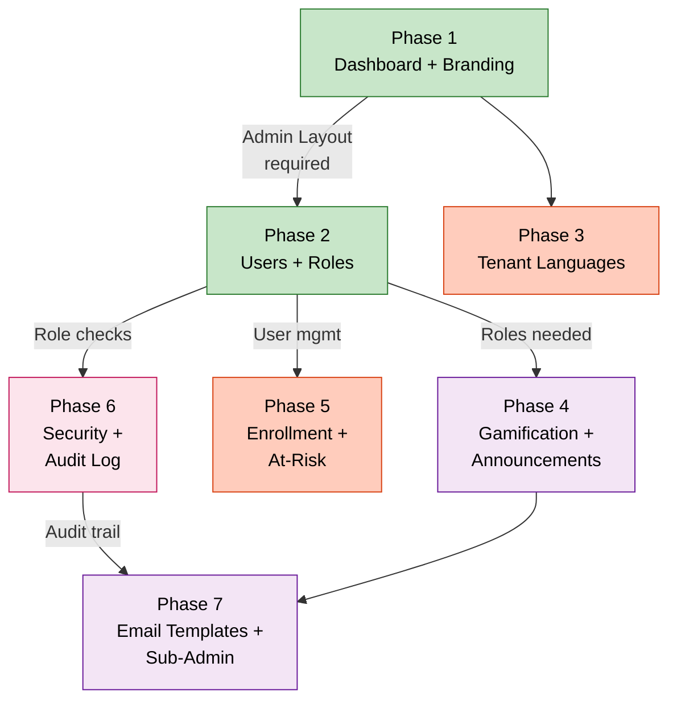

# תוכנית שדרוג Admin — EduSphere

**תאריך:** 25 פברואר 2026 | **Branch:** `feat/admin-upgrade`
_העבר לפרויקט: `docs/plans/ADMIN_UPGRADE_PLAN.md` לפני מימוש_

---

## Context

יכולות ה-Admin ב-EduSphere מוגבלות ל-7 דפי הגדרות מבודדים ללא דשבורד מרכזי, ניהול משתמשים, שליטה בשפות ברמת ה-Tenant, ופאנל ניהול Gamification. מחקר מול 20 פלטפורמות חינוך ו-LMS מובילות (Canvas, Moodle, Docebo, TalentLMS, Absorb, iSpring ועוד) מגלה 15+ יכולות קריטיות הנעדרות מ-EduSphere.

---

## מצב נוכחי — מה קיים

| תחום                         | קיים                      | מיקום                                                 |
| ---------------------------- | ------------------------- | ----------------------------------------------------- |
| Branding                     | ✅ Backend בלבד (service) | `subgraph-core/src/tenant/tenant-branding.service.ts` |
| SCIM Integration             | ✅                        | `/admin/scim`                                         |
| LTI 1.3                      | ✅                        | `/admin/lti`                                          |
| Compliance Reports           | ✅                        | `/admin/compliance`                                   |
| CRM (Salesforce)             | ✅                        | `/admin/crm`                                          |
| BI Export (OData v4)         | ✅                        | `/admin/bi-export`                                    |
| xAPI/LRS                     | ✅                        | `/admin/xapi`                                         |
| CPD Settings                 | ✅                        | `/admin/cpd`                                          |
| 360° Assessment              | ✅ (Stub)                 | `/admin/assessments`                                  |
| Portal Builder               | ✅                        | `/admin/portal`                                       |
| Admin Dashboard              | ❌ אין                    | —                                                     |
| User Management UI           | ❌ אין                    | —                                                     |
| Role/Permission Management   | ❌ רק 4 roles hardcoded   | —                                                     |
| Language Settings (Tenant)   | ❌ רק per-user            | `components/LanguageSelector.tsx`                     |
| Branding UI                  | ❌ אין דף ב-Admin         | —                                                     |
| Gamification Admin           | ❌ hardcoded              | `gamification/badge-definitions.ts`                   |
| Audit Log                    | ❌ אין                    | —                                                     |
| Security Settings            | ❌ אין                    | —                                                     |
| Email/Notification Templates | ❌ אין                    | —                                                     |
| Enrollment Rules             | ❌ אין                    | —                                                     |
| At-Risk Learner Alerts       | ❌ (Module קיים)          | `subgraph-content/src/at-risk/`                       |
| Sub-Admin Delegation         | ❌ אין                    | —                                                     |
| Announcements                | ❌ אין                    | —                                                     |
| Admin Navigation             | ❌ אין Sidebar מרכזי      | —                                                     |

---

## מחקר — מה המתחרים מציעים

### פלטפורמות חינוך (Canvas, Moodle, Blackboard, Google Classroom, Schoology, Kahoot, Duolingo, Coursera, edX, Khan Academy)

| יכולת בולטת                                          | הפלטפורמה המובילה   |
| ---------------------------------------------------- | ------------------- |
| 350-1100+ permissions per role                       | Moodle / Blackboard |
| Multi-language per tenant + language packs           | Moodle              |
| Granular RBAC with context (system/course/module)    | Moodle              |
| Real-time analytics drill-down district→school→class | Khan Academy        |
| MFA enforcement + Advanced Protection                | Google Classroom    |
| Blueprint/template courses district-wide             | Canvas              |
| Plagiarism detection + online proctoring             | Coursera            |
| Struggling student identification + cohort messaging | Coursera            |
| Branding with accessibility 4.5:1 contrast check     | Schoology           |

### פלטפורמות LMS/הכשרה (LinkedIn Learning, Udemy Business, Cornerstone, Docebo, TalentLMS, Skillshare, SAP SF, Absorb, iSpring, Pluralsight)

| יכולת בולטת                                                         | הפלטפורמה המובילה          |
| ------------------------------------------------------------------- | -------------------------- |
| Full white-label + custom domain + branded mobile app               | Docebo / iSpring           |
| 400+ integrations + REST API + OAuth2                               | Docebo                     |
| Gamification config UI (points, badges, levels, leaderboard toggle) | TalentLMS                  |
| Compliance automation: deadlines, auto re-enrollment, reminders     | iSpring                    |
| Custom role types with granular permissions                         | Absorb / TalentLMS         |
| Sub-admin delegation with group scope                               | LinkedIn Learning / Kahoot |
| 42+ languages in 191 countries                                      | Cornerstone / SAP SF       |
| Real-time at-risk identification                                    | Absorb / Coursera          |
| Custom email notification templates                                 | Most platforms             |

---

## Admin Upgrade — Phase Dependency Map



## תוכנית השדרוג — 7 פאזות

### פאזה 1: תשתית Admin מרכזית (Priority: Critical)

**מה:** Admin Dashboard + ניווט + Branding UI
**למה:** כל פלטפורמה מובילה פותחת עם overview dashboard. בלי זה ה-admin מאבד כיוון בין 7 עמודים מבודדים.

#### 1a. Admin Dashboard (`/admin`)

**קבצים חדשים:**

- `apps/web/src/pages/AdminDashboardPage.tsx` — דשבורד ראשי
- `apps/web/src/components/admin/AdminSidebar.tsx` — ניווט צד קבוע
- `apps/web/src/components/admin/AdminLayout.tsx` — Layout wrapper לכל admin pages

**Widgets בדשבורד:**

- סטטיסטיקות כלליות: users, courses, active sessions, completions this month
- At-risk learner count (מ- `at-risk` module הקיים)
- Recent SCIM sync status
- Last compliance report date
- Quick links לכל 7 ה-admin pages הקיימים

**GraphQL Queries נדרשות** (ב- `subgraph-core`):

```graphql
type AdminOverview {
  totalUsers: Int!
  activeUsersThisMonth: Int!
  totalCourses: Int!
  completionsThisMonth: Int!
  atRiskCount: Int!
  lastScimSync: DateTime
  lastComplianceReport: DateTime
}
query adminOverview: AdminOverview @requiresRole(roles: [ORG_ADMIN, SUPER_ADMIN])
```

**Backend:** `apps/subgraph-core/src/admin/admin-overview.service.ts` (חדש)

#### 1b. Branding Settings UI (`/admin/branding`)

**מה קיים:** `tenant-branding.service.ts` כבר עושה את כל העבודה
**מה חסר:** דף UI ב-admin

**קבצים:**

- `apps/web/src/pages/BrandingSettingsPage.tsx` — Form עם:
  - Logo URL + Live preview
  - Primary/secondary/accent/background colors עם color picker
  - Org name, tagline, support email
  - Privacy policy URL, ToS URL
  - Toggle: "Hide EduSphere branding"

**GraphQL** (כבר קיים ב-tenant-branding.service, רק צריך mutations):

- `apps/web/src/lib/graphql/branding.queries.ts` (קובץ חדש - מפנה ל-mutations קיימים)

**Router:** הוסף `/admin/branding` ל- `apps/web/src/lib/router.tsx:~220`

---

### פאזה 2: ניהול משתמשים ותפקידים (Priority: High)

**מה:** User Management + Custom Roles
**למה:** Moodle יש 350+ capabilities, Blackboard 1100+, Absorb 4 roles custom. EduSphere תקועה עם 4 roles hardcoded בלי UI.

#### 2a. User Management (`/admin/users`)

**קבצים חדשים:**

- `apps/web/src/pages/UserManagementPage.tsx`
- `apps/web/src/components/admin/UserTable.tsx` — Sortable, filterable
- `apps/web/src/components/admin/BulkImportUsersModal.tsx` — CSV upload
- `apps/web/src/lib/graphql/admin-users.queries.ts`

**פיצ'רים:**

- חיפוש משתמש (שם, email, role)
- Create/Edit/Deactivate user
- Bulk import CSV (columns: email, name, role, groups)
- Bulk export CSV
- Reset password (trigger Keycloak password reset email)
- Impersonate user (login-as, SUPER_ADMIN only)
- Filter by: role, status, last-login, group

**GraphQL Mutations נדרשות** (ב- `subgraph-core`):

```graphql
mutation createUser(input: CreateUserInput!): User
mutation updateUser(id: ID!, input: UpdateUserInput!): User
mutation deactivateUser(id: ID!): Boolean
mutation bulkImportUsers(csvData: String!): BulkImportResult
mutation bulkExportUsers(filters: UserFilterInput): String # CSV download URL
mutation impersonateUser(userId: ID!): ImpersonationToken @requiresRole(roles: [SUPER_ADMIN])
mutation resetUserPassword(userId: ID!): Boolean
```

**Backend:**

- `apps/subgraph-core/src/user/admin-user.resolver.ts` (חדש)
- `apps/subgraph-core/src/user/admin-user.service.ts` (חדש)

#### 2b. Role & Permission Management (`/admin/roles`)

**קבצים חדשים:**

- `apps/web/src/pages/RoleManagementPage.tsx`
- `apps/web/src/components/admin/PermissionsMatrix.tsx` — Checkbox grid
- `apps/web/src/lib/graphql/admin-roles.queries.ts`

**פיצ'רים:**

- הצג 4 roles קיימים + custom roles
- צור custom role עם permission matrix
- שכפל role קיים
- Assign roles to users

**Backend DB:**

- `packages/db/src/schema/custom-roles.ts` (חדש — Drizzle schema)
- `apps/subgraph-core/src/auth/custom-role.service.ts` (חדש)

**Permissions מוגדרים (לפחות 30 initial):**

```
courses:view, courses:create, courses:edit, courses:delete, courses:publish
users:view, users:create, users:edit, users:deactivate
enrollments:view, enrollments:create, enrollments:bulk
compliance:view, compliance:export
analytics:view, analytics:export
gamification:configure
branding:edit
notifications:manage
security:configure
audit:view
```

---

### פאזה 3: שפות ולוקליזציה ברמת Tenant (Priority: High)

**מה:** Tenant Language Settings
**למה:** המשתמש ציין זאת ספציפית. Moodle, Cornerstone (42+ שפות), SAP SF — כולם מאפשרים admin לקבוע מדיניות שפה ל-Tenant כולו.

#### 3a. Language Settings (`/admin/languages`)

**קבצים חדשים:**

- `apps/web/src/pages/LanguageSettingsPage.tsx`
- `apps/web/src/lib/graphql/admin-language.queries.ts`

**פיצ'רים:**

- Default language for Tenant (כל user חדש יורש זאת)
- Allowed languages: Admin בוחר אילו שפות מוצגות למשתמשים (לדוגמה: רק עברית + אנגלית)
- Force tenant language: Toggle — האם לאפשר למשתמשים לשנות או לאכוף שפה אחת
- RTL auto-enable: כאשר ה-default language הוא עברית/ערבית — RTL אוטומטי

**DB:** הוסף שדות ל- `tenants` table:

```sql
ALTER TABLE tenants ADD COLUMN default_locale text NOT NULL DEFAULT 'en';
ALTER TABLE tenants ADD COLUMN allowed_locales text[] NOT NULL DEFAULT '{en,he}';
ALTER TABLE tenants ADD COLUMN force_tenant_locale boolean NOT NULL DEFAULT false;
```

**Migration:** `packages/db/src/schema/` — עדכן Drizzle schema

**GraphQL:**

```graphql
type TenantLanguageSettings {
  defaultLocale: String!
  allowedLocales: [String!]!
  forceTenantLocale: Boolean!
}
query tenantLanguageSettings: TenantLanguageSettings
mutation updateTenantLanguageSettings(input: TenantLanguageSettingsInput!): TenantLanguageSettings
```

**Backend:** `apps/subgraph-core/src/tenant/tenant-language.service.ts` (חדש)
**Integration:** `apps/web/src/components/LanguageSelector.tsx` — סנן `allowedLocales` מה-Tenant settings

---

### פאזה 4: Gamification Admin + Announcements (Priority: Medium)

**מה:** פאנל הגדרות Gamification + ניהול הודעות
**למה:** TalentLMS מציע full Gamification config UI. EduSphere יש הכל hardcoded.

#### 4a. Gamification Settings (`/admin/gamification`)

**קבצים חדשים:**

- `apps/web/src/pages/GamificationSettingsPage.tsx`
- `apps/web/src/components/admin/BadgeEditor.tsx`
- `apps/web/src/components/admin/PointsConfigTable.tsx`
- `apps/web/src/lib/graphql/admin-gamification.queries.ts`

**פיצ'רים:**

- Enable/Disable gamification globally
- Points configuration: Edit points per action (course completion, quiz, collaboration, knowledge contribution)
- Badge management: Create/edit/delete badges, upload custom icon, set trigger conditions
- Leaderboard toggle: Show/hide public leaderboard
- Level thresholds: Configure level names + point requirements
- Reset leaderboard (for competitions)

**DB:** `packages/db/src/schema/gamification-config.ts` — חדש (מחליף hardcoded badge-definitions.ts)

**GraphQL mutations:**

```graphql
mutation updatePointsConfig(actions: [PointsActionInput!]!): [PointsAction!]!
mutation createBadge(input: BadgeInput!): Badge
mutation updateBadge(id: ID!, input: BadgeInput!): Badge
mutation deleteBadge(id: ID!): Boolean
mutation updateLeaderboardSettings(isPublic: Boolean!, resetPeriod: ResetPeriod): LeaderboardSettings
```

#### 4b. Announcements Management (`/admin/announcements`)

**קבצים חדשים:**

- `apps/web/src/pages/AnnouncementsPage.tsx`
- `apps/web/src/components/admin/AnnouncementEditor.tsx` (Rich text)
- `apps/web/src/lib/graphql/admin-announcements.queries.ts`

**פיצ'רים:**

- Create/edit/delete announcements
- Target: All users / specific groups / specific roles
- Schedule publish time + expiry
- Priority: Info/Warning/Critical (different banner colors)
- Display on: Dashboard / Login page / Both

**DB:** `packages/db/src/schema/announcements.ts` (חדש)

---

### פאזה 5: Enrollment + At-Risk Dashboard (Priority: Medium)

#### 5a. Enrollment Management (`/admin/enrollment`)

**קבצים חדשים:**

- `apps/web/src/pages/EnrollmentManagementPage.tsx`
- `apps/web/src/lib/graphql/admin-enrollment.queries.ts`

**פיצ'רים:**

- View all enrollments with filters
- Bulk enroll users to course (CSV upload or manual select)
- Enrollment rules: Auto-enroll by role/group when user joins
- Waitlist management
- Force-complete enrollment (for admin records)

#### 5b. At-Risk Learner Dashboard (`/admin/at-risk`)

**מה קיים:** `apps/subgraph-content/src/at-risk/` module
**מה חסר:** Admin UI

**קובץ:**

- `apps/web/src/pages/AtRiskDashboardPage.tsx` (שימוש ב-`AtRiskLearnersTable.tsx` הקיים)

**פיצ'רים:**

- List at-risk learners with risk score + reasons
- One-click send intervention message
- Export at-risk report
- Configure risk thresholds (days inactive, completion %)

---

### פאזה 6: Security Settings + Audit Log (Priority: Medium)

#### 6a. Security Settings (`/admin/security`)

**קבצים חדשים:**

- `apps/web/src/pages/SecuritySettingsPage.tsx`
- `apps/web/src/lib/graphql/admin-security.queries.ts`

**פיצ'רים (בהשראת Google Classroom + Blackboard):**

- MFA enforcement: Require MFA for all users / admins only / optional
- Session timeout: Configure idle session timeout (30min / 1h / 4h / custom)
- IP Allowlist: Restrict admin access to specific IPs/CIDRs
- Password policy (propagate to Keycloak via Admin API): min length, complexity, expiry
- Concurrent sessions: Max sessions per user
- Login attempt lockout: Configure threshold (בהתאם ל-SI-4 - כבר hardcoded בKeycloak אבל הראה UI)

**Backend:** `apps/subgraph-core/src/security/security-settings.service.ts` (חדש)
**DB:** `packages/db/src/schema/security-settings.ts` (חדש)

#### 6b. Audit Log Viewer (`/admin/audit`)

**קבצים חדשים:**

- `apps/web/src/pages/AuditLogPage.tsx`
- `apps/web/src/lib/graphql/audit.queries.ts`

**פיצ'רים:**

- Timeline of admin actions with filters (action type, user, date range)
- Events: user created/modified/deleted, role changed, config updated, report exported, login-as used
- Export to CSV
- Retention: 90 days default (configurable)

**DB:** `packages/db/src/schema/audit-log.ts` — טבלה חדשה
**Backend:** Audit interceptor שכותב לטבלה ב-destroy hooks

---

### פאזה 7: Email Templates + Sub-Admin Delegation (Priority: Low-Medium)

#### 7a. Email/Notification Templates (`/admin/notifications`)

**קבצים חדשים:**

- `apps/web/src/pages/NotificationTemplatesPage.tsx`
- `apps/web/src/components/admin/EmailTemplateEditor.tsx` (Rich text + variable insertion)
- `apps/web/src/lib/graphql/admin-notifications.queries.ts`

**תבניות לעריכה:**

- Welcome email (new user)
- Course enrollment confirmation
- Completion certificate email
- Compliance reminder (overdue)
- Password reset
- At-risk learner intervention

**Variables support:** `{{user.name}}`, `{{course.title}}`, `{{tenant.name}}`, `{{due_date}}`

#### 7b. Sub-Admin Delegation (`/admin/delegates`)

בהשראת LinkedIn Learning (sub-admins עם scope מוגבל) ו-Kahoot (admin/owner roles):

**פיצ'רים:**

- Appoint ORG_ADMIN עם scope מוגבל ל-Group/Department ספציפי
- Delegated admin יכול לנהל רק users + courses בscope שלו
- Full audit trail על delegated actions

---

## קבצים קריטיים לשינוי

| קובץ                                                       | שינוי                                |
| ---------------------------------------------------------- | ------------------------------------ |
| `apps/web/src/lib/router.tsx`                              | הוסף 10+ routes חדשים תחת `/admin/*` |
| `apps/web/src/components/admin/AdminLayout.tsx`            | חדש — Layout + Sidebar wrapper       |
| `apps/subgraph-core/src/user/user.module.ts`               | הוסף AdminUserModule                 |
| `apps/subgraph-core/src/tenant/`                           | הוסף language + security services    |
| `apps/subgraph-core/src/gamification/badge-definitions.ts` | מיגרציה ל-DB (dynamic config)        |
| `packages/db/src/schema/index.ts`                          | Export schemas חדשים                 |
| `apps/subgraph-core/src/app.module.ts`                     | Register modules חדשים               |

---

## טבלאות DB חדשות (Drizzle)

```typescript
// packages/db/src/schema/custom-roles.ts
// packages/db/src/schema/gamification-config.ts
// packages/db/src/schema/announcements.ts
// packages/db/src/schema/audit-log.ts
// packages/db/src/schema/security-settings.ts

// עדכון קיים:
// packages/db/src/schema/content.ts — הוסף default_locale, allowed_locales לtenants
```

---

## GraphQL SDL חדש (Schema-First)

**Subgraph-Core SDL additions** (`apps/subgraph-core/src/`):

- `admin/admin.graphql` — AdminOverview query
- `user/user.graphql` — הוסף admin mutations
- `tenant/tenant-language.graphql` — חדש
- `security/security-settings.graphql` — חדש
- `gamification/gamification-admin.graphql` — חדש
- `audit/audit.graphql` — חדש
- `announcements/announcements.graphql` — חדש

---

## Memory Safety Requirements

| שינוי                                      | Test נדרש                                  |
| ------------------------------------------ | ------------------------------------------ |
| `AdminOverviewService` עם DB queries       | `admin-overview.service.memory.spec.ts`    |
| `AuditLogInterceptor` עם setInterval flush | `audit-log.interceptor.memory.spec.ts`     |
| `SecuritySettingsService`                  | `security-settings.service.memory.spec.ts` |
| `AnnouncementsService` עם cache            | `announcements.service.memory.spec.ts`     |

---

## Verification Plan

### בדיקה ידנית

1. פתח `/admin` — ראה Dashboard עם כל הנתונים
2. לחץ על Sidebar → כל 17 admin pages עובדים
3. לשנות branding: logo + colors → רענן → ממשק מתעדכן
4. צור user חדש → assign custom role → Login כ-user → אמת permissions
5. שנה default_locale ל-he → צור user חדש → ממשק מופיע בעברית
6. הגדר Gamification: שנה נקודות לquiz ל-100 → בצע quiz → אמת נקודות
7. צור announcement → Login כ-student → ראה banner

### בדיקות אוטומטיות

```bash
# Unit tests
pnpm --filter @edusphere/subgraph-core test
pnpm --filter @edusphere/web test

# TypeScript
pnpm turbo typecheck

# Schema composition
pnpm --filter @edusphere/gateway compose

# Security
pnpm test:security
pnpm test:rls

# E2E
pnpm --filter @edusphere/web test:e2e -- --grep "admin"
```

---

## סדר עדיפויות ב-OPEN_ISSUES.md

| #     | פיצ'ר                    | Priority    |
| ----- | ------------------------ | ----------- |
| F-101 | Admin Dashboard + Layout | 🔴 Critical |
| F-102 | Branding Settings UI     | 🔴 Critical |
| F-103 | User Management UI       | 🔴 High     |
| F-104 | Tenant Language Settings | 🔴 High     |
| F-105 | Custom Role Management   | 🟡 Medium   |
| F-106 | Gamification Admin Panel | 🟡 Medium   |
| F-107 | Announcements Management | 🟡 Medium   |
| F-108 | Enrollment Management    | 🟡 Medium   |
| F-109 | At-Risk Dashboard UI     | 🟡 Medium   |
| F-110 | Security Settings        | 🟡 Medium   |
| F-111 | Audit Log Viewer         | 🟡 Medium   |
| F-112 | Email Templates          | 🟢 Low      |
| F-113 | Sub-Admin Delegation     | 🟢 Low      |
