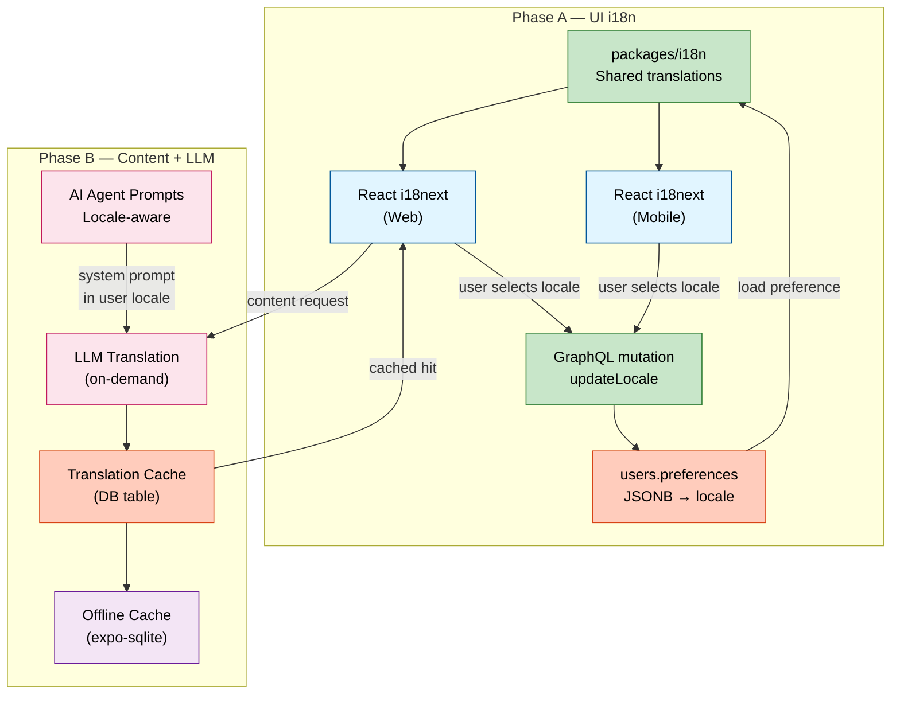

# EduSphere — Complete i18n Implementation Plan

### Full Internationalization: UI + Content + LLM · 9 Languages · Web + Mobile

---

## i18n Data Flow — Phase A + Phase B



## Context

EduSphere currently has zero internationalization infrastructure. Every string displayed to users — across 14 web pages, 18 React components, and 7 mobile screens — is hardcoded English. The `users.preferences` JSONB column already exists in the database but is not surfaced through GraphQL. AI agent system prompts are hardcoded English, and no content translation pipeline exists.

This plan delivers a complete i18n overhaul in two sequential phases:

- **Phase A — UI Internationalization**: Full React + React Native i18n using a shared `packages/i18n` workspace package, user language preference persisted to DB via GraphQL, and a new Settings page for language selection.
- **Phase B — Content & LLM Translation**: On-demand LLM-powered content translation with DB caching, locale-aware AI agent responses across all 5 workflow types, and offline translation caching for mobile.

**Target languages (9):**

| Code    | Language         | Native Script    | Flag |
| ------- | ---------------- | ---------------- | ---- |
| `en`    | English          | English          | 🇬🇧   |
| `zh-CN` | Mandarin Chinese | 中文             | 🇨🇳   |
| `hi`    | Hindi            | हिन्दी           | 🇮🇳   |
| `es`    | Spanish          | Español          | 🇪🇸   |
| `fr`    | French           | Français         | 🇫🇷   |
| `bn`    | Bengali          | বাংলা            | 🇧🇩   |
| `pt`    | Portuguese       | Português        | 🇧🇷   |
| `ru`    | Russian          | Русский          | 🇷🇺   |
| `id`    | Indonesian       | Bahasa Indonesia | 🇮🇩   |

**Confirmed decisions:**

- Translation generation: on-demand + DB cache (first request triggers LLM, result cached permanently)
- Platform scope: Web (`apps/web`) + Mobile (`apps/mobile`) implemented simultaneously
- AI responses: automatically in user's selected language via locale-injected system prompts
- Preference storage: DB (`users.preferences` JSONB) with localStorage / AsyncStorage as local fallback
- Execution model: **mandatory parallel agent execution** across all independent sub-tasks

---

## Architecture Overview

```
┌─────────────────────────────────────────────────────────────────────┐
│                      packages/i18n (NEW)                            │
│  SUPPORTED_LOCALES · LOCALE_LABELS · NAMESPACES                     │
│  locales/{en,zh-CN,hi,es,fr,bn,pt,ru,id}/{12 namespaces}.json      │
└──────────────────┬──────────────────────────┬───────────────────────┘
                   │                          │
        ┌──────────▼──────────┐    ┌──────────▼──────────────┐
        │  apps/web           │    │  apps/mobile            │
        │  src/lib/i18n.ts    │    │  src/lib/i18n.ts        │
        │  (Vite dynamic      │    │  (Metro require()       │
        │   import backend)   │    │   bundle-time resolve)  │
        └──────────┬──────────┘    └──────────┬──────────────┘
                   │                          │
                   ▼                          ▼
        ┌──────────────────────────────────────────────────┐
        │  apps/subgraph-core — UserPreferences GraphQL    │
        │  users.preferences JSONB ← already in DB         │
        │  updateUserPreferences mutation (NEW)            │
        └──────────────────────┬───────────────────────────┘
                               │ locale flows down to:
               ┌───────────────┼────────────────────┐
               │               │                    │
    ┌──────────▼──────┐ ┌──────▼──────────┐ ┌──────▼──────────────────┐
    │ subgraph-agent  │ │ subgraph-content │ │ langgraph-workflows      │
    │ ai.service.ts   │ │ translation/     │ │ tutor/debate/quiz/assess │
    │ locale-prompt.ts│ │ NATS → LLM       │ │ locale param injected    │
    └─────────────────┘ └─────────────────┘ └─────────────────────────┘
                              │
                    ┌─────────▼──────────┐
                    │ content_translations│
                    │ (NEW DB table)      │
                    │ cache + NATS worker │
                    └────────────────────┘
```

**i18n Library**: `i18next` + `react-i18next` — shared core across web and mobile. Web uses Vite's dynamic `import()` for lazy namespace loading. Mobile uses `require()` for Metro bundler compatibility (Metro resolves dynamic require paths at bundle time). Both consume the same JSON files from `packages/i18n`.

---

## Mandatory Parallel Execution — Agent Orchestration

**RULE**: Every independent sub-task is assigned to a dedicated agent. Agents run concurrently within each Wave. No agent waits for another unless there is an explicit data dependency.

### Complete Agent Roster (12 Agents)

| ID      | Agent Role                        | Phase | Wave       | Responsibility                                                                                      |
| ------- | --------------------------------- | ----- | ---------- | --------------------------------------------------------------------------------------------------- |
| **A-1** | i18n Package Architect            | A     | 1          | Create `packages/i18n` — all 9 locales × 12 namespaces, TypeScript types, dual config               |
| **A-2** | Backend Schema Engineer           | A     | 2          | `user.graphql` + `user.service.ts` + `user.resolver.ts` + Zod schemas                               |
| **A-3** | Web Infrastructure Engineer       | A     | 2          | `i18n.ts` config, `App.tsx` bootstrap, `queries.ts` mutation, urql client update                    |
| **A-4** | Web Pages Engineer α              | A     | 3          | Dashboard, Login, ProfilePage, AgentsPage — full `useTranslation` migration                         |
| **A-5** | Web Pages Engineer β              | A     | 3          | CourseList, CourseDetailPage, CourseCreatePage + wizard steps                                       |
| **A-6** | Web Pages Engineer γ              | A     | 3          | AnnotationsPage, CollaborationPage, CollaborationSessionPage, Search, KnowledgeGraph, ContentViewer |
| **A-7** | Web Components Engineer           | A     | 3          | Layout (NAV_ITEMS hook), UserMenu, AIChatPanel, all annotation/dashboard components                 |
| **A-8** | Settings & Hook Engineer          | A     | 3          | SettingsPage, LanguageSelector, useUserPreferences hook, router update                              |
| **A-9** | Mobile Engineer                   | A     | 3          | All 7 screens + navigation + SettingsScreen + mobile i18n setup                                     |
| **B-1** | DB & Content Translation Engineer | B     | 4          | content_translations table, Drizzle schema, translation NestJS module in subgraph-content           |
| **B-2** | AI Localization Engineer          | B     | 4          | locale-prompt.ts, ai.service.ts locale param, all 5 workflow factories, agent-session schema        |
| **T-1** | Test & Visual QA Engineer         | A+B   | Cross-wave | All test files: unit, integration, component, E2E, visual regression, a11y                          |

### Agent Dependency Graph

```
Wave 1:   [A-1]
           │
Wave 2:   [A-2]──────────[A-3]         (both depend on A-1 for locale types)
           │               │
Wave 3:   [A-4][A-5][A-6][A-7][A-8]   (A-4..A-7 depend on A-1; A-8 depends on A-2+A-3)
           [A-9]                        (A-9 depends on A-1 only)
           │
Wave 4:   [B-1]──────────[B-2]         (B-1 independent; B-2 depends on A-1 for locale types)
           │
Wave 5:   [T-1]                         (Tests run after each wave completes)
```

---

## Progress Reporting Protocol

**Every agent reports status every 3 minutes** using the following format:

```
═══════════════════════════════════════════════════════════════
📊 PROGRESS REPORT — i18n Phase [A|B] — [HH:MM:SS]
═══════════════════════════════════════════════════════════════
🔵 Active Agents:
   A-1 [i18n Package]:   Generating zh-CN namespace files — 40% (4/9 locales)
   A-2 [Backend Schema]: user.service.ts updatePreferences method — 70%
   A-3 [Web Infra]:      i18n.ts backend plugin — complete; App.tsx — 50%

✅ Completed this cycle:
   - A-1: en/ locale fully populated (12 namespaces)
   - A-2: user.graphql extended with UserPreferences type + mutation

⚠️  Blockers:
   - None

⏳ Next actions (next 3 min):
   - A-1: Generate es/, fr/, bn/ locale files
   - A-2: user.resolver.ts mutation handler
   - A-3: queries.ts ME_QUERY preferences extension

📈 Wave 1 progress: 35% → Wave 2 progress: 20%
   Estimated Wave 1 completion: 6 min
═══════════════════════════════════════════════════════════════
```

---

## Phase A — UI Internationalization

### Wave 1: Foundation (A-1 only — serial prerequisite)

#### Agent A-1: `packages/i18n/`

This package is the single source of truth for all translation content. Every other agent depends on its TypeScript exports. It must be completed before Wave 2 begins.

**Directory structure:**

```
packages/i18n/
├── package.json
├── tsconfig.json
└── src/
    ├── index.ts            ← SUPPORTED_LOCALES, LOCALE_LABELS, NAMESPACES, SupportedLocale
    ├── config.web.ts       ← i18next init for Vite (dynamic import backend)
    ├── config.mobile.ts    ← i18next init for Metro (require() backend)
    ├── types.d.ts          ← i18next CustomTypeOptions → t() key autocomplete
    └── locales/
        ├── en/
        │   ├── common.json
        │   ├── nav.json
        │   ├── auth.json
        │   ├── dashboard.json
        │   ├── courses.json
        │   ├── content.json
        │   ├── annotations.json
        │   ├── agents.json
        │   ├── collaboration.json
        │   ├── knowledge.json
        │   ├── settings.json
        │   └── errors.json
        ├── zh-CN/  [same 12 files — Mandarin translations]
        ├── hi/     [same 12 files — Hindi translations]
        ├── es/     [same 12 files — Spanish translations]
        ├── fr/     [same 12 files — French translations]
        ├── bn/     [same 12 files — Bengali translations]
        ├── pt/     [same 12 files — Portuguese translations]
        ├── ru/     [same 12 files — Russian translations]
        └── id/     [same 12 files — Indonesian translations]
```

**`package.json`**:

```json
{
  "name": "@edusphere/i18n",
  "version": "0.1.0",
  "private": true,
  "type": "module",
  "exports": {
    ".": "./src/index.ts",
    "./locales/*": "./src/locales/*"
  },
  "dependencies": {
    "i18next": "^23.16.0",
    "react-i18next": "^15.0.0"
  },
  "devDependencies": {
    "@edusphere/tsconfig": "workspace:*",
    "typescript": "^5.8.0"
  }
}
```

**`src/index.ts`**:

```typescript
export const SUPPORTED_LOCALES = [
  'en',
  'zh-CN',
  'hi',
  'es',
  'fr',
  'bn',
  'pt',
  'ru',
  'id',
] as const;
export type SupportedLocale = (typeof SUPPORTED_LOCALES)[number];
export const DEFAULT_LOCALE: SupportedLocale = 'en';

export const LOCALE_LABELS: Record<
  SupportedLocale,
  {
    native: string;
    english: string;
    flag: string;
  }
> = {
  en: { native: 'English', english: 'English', flag: '🇬🇧' },
  'zh-CN': { native: '中文', english: 'Chinese', flag: '🇨🇳' },
  hi: { native: 'हिन्दी', english: 'Hindi', flag: '🇮🇳' },
  es: { native: 'Español', english: 'Spanish', flag: '🇪🇸' },
  fr: { native: 'Français', english: 'French', flag: '🇫🇷' },
  bn: { native: 'বাংলা', english: 'Bengali', flag: '🇧🇩' },
  pt: { native: 'Português', english: 'Portuguese', flag: '🇧🇷' },
  ru: { native: 'Русский', english: 'Russian', flag: '🇷🇺' },
  id: { native: 'Bahasa Indonesia', english: 'Indonesian', flag: '🇮🇩' },
};

export const NAMESPACES = [
  'common',
  'nav',
  'auth',
  'dashboard',
  'courses',
  'content',
  'annotations',
  'agents',
  'collaboration',
  'knowledge',
  'settings',
  'errors',
] as const;
export type I18nNamespace = (typeof NAMESPACES)[number];
```

**`src/types.d.ts`** — TypeScript autocomplete for `t()` key paths:

```typescript
import type commonEn from './locales/en/common.json';
import type navEn from './locales/en/nav.json';
import type authEn from './locales/en/auth.json';
import type dashboardEn from './locales/en/dashboard.json';
import type coursesEn from './locales/en/courses.json';
import type contentEn from './locales/en/content.json';
import type annotationsEn from './locales/en/annotations.json';
import type agentsEn from './locales/en/agents.json';
import type collaborationEn from './locales/en/collaboration.json';
import type knowledgeEn from './locales/en/knowledge.json';
import type settingsEn from './locales/en/settings.json';
import type errorsEn from './locales/en/errors.json';

declare module 'i18next' {
  interface CustomTypeOptions {
    defaultNS: 'common';
    resources: {
      common: typeof commonEn;
      nav: typeof navEn;
      auth: typeof authEn;
      dashboard: typeof dashboardEn;
      courses: typeof coursesEn;
      content: typeof contentEn;
      annotations: typeof annotationsEn;
      agents: typeof agentsEn;
      collaboration: typeof collaborationEn;
      knowledge: typeof knowledgeEn;
      settings: typeof settingsEn;
      errors: typeof errorsEn;
    };
  }
}
```

**Key namespace content samples** (English source — all 8 other locales are human-quality translations):

`en/common.json`:

```json
{
  "loading": "Loading...",
  "error": "An error occurred",
  "retry": "Retry",
  "cancel": "Cancel",
  "save": "Save",
  "back": "Back",
  "search": "Search...",
  "signIn": "Sign In",
  "logOut": "Log out",
  "profile": "Profile",
  "settings": "Settings",
  "yes": "Yes",
  "no": "No",
  "close": "Close",
  "confirm": "Confirm",
  "delete": "Delete",
  "edit": "Edit",
  "create": "Create",
  "submit": "Submit",
  "noResults": "No results found"
}
```

`en/dashboard.json`:

```json
{
  "title": "Dashboard",
  "welcomeBack": "Welcome back, {{name}}!",
  "instructorTools": "Instructor Tools",
  "createCourse": "Create Course",
  "manageCourses": "Manage Courses",
  "continuelearning": "Continue Learning",
  "yourProgress": "Your Progress",
  "studyActivity": "Study Activity",
  "activityDescription": "Your annotation activity over the past 30 days",
  "recentActivity": "Recent Activity",
  "latestEvents": "Your latest learning events",
  "stats": {
    "activeCourses": "Active Courses",
    "learningStreak": "Learning Streak",
    "studyTime": "Study Time",
    "concepts": "Concepts",
    "coursesEnrolled": "Courses Enrolled",
    "conceptsMastered": "Concepts Mastered",
    "annotationsCreated": "Annotations Created",
    "weeklyGoal": "Weekly Goal",
    "days": "days",
    "hours": "hours",
    "minutes": "minutes"
  }
}
```

`en/agents.json`:

```json
{
  "title": "AI Learning Agents",
  "subtitle": "Choose an agent mode to enhance your learning",
  "devMode": "Dev Mode — mock responses",
  "selectAgent": "Select Agent:",
  "reset": "Reset",
  "sendMessage": "Send message",
  "askAgent": "Ask the {{agentLabel}}...",
  "responding": "Agent is responding...",
  "modes": {
    "chavruta": {
      "label": "Chavruta Debate",
      "description": "Dialectical partner — challenges your arguments using Talmudic reasoning"
    },
    "quiz": {
      "label": "Quiz Master",
      "description": "Adaptive quizzes based on your learning history and prerequisite gaps"
    },
    "summarize": {
      "label": "Summarizer",
      "description": "Progressive summaries of your studied content with key concept extraction"
    },
    "research": {
      "label": "Research Scout",
      "description": "Cross-reference finder — discovers connections across texts and time periods"
    },
    "explain": {
      "label": "Explainer",
      "description": "Adaptive explanations that adjust to your understanding level"
    }
  },
  "chatPanel": {
    "title": "AI Learning Assistant",
    "openPanel": "Open AI panel",
    "closePanel": "Close AI panel"
  }
}
```

`en/settings.json`:

```json
{
  "title": "Settings",
  "language": {
    "title": "Language",
    "description": "Select your preferred language for the interface and AI responses",
    "saved": "Language preference saved",
    "error": "Failed to save language preference. Please try again.",
    "saving": "Saving..."
  },
  "appearance": {
    "title": "Appearance",
    "theme": "Theme",
    "light": "Light",
    "dark": "Dark",
    "system": "System"
  },
  "notifications": {
    "title": "Notifications",
    "email": "Email notifications",
    "push": "Push notifications"
  }
}
```

`en/content.json`:

```json
{
  "translating": "Translating content...",
  "translatedTo": "Translated to {{language}}",
  "translationFailed": "Translation failed — showing original",
  "showOriginal": "Show original",
  "showTranslation": "Show translation",
  "transcript": "Transcript",
  "noTranscript": "No transcript available",
  "downloadTranscript": "Download transcript",
  "playbackSpeed": "Playback speed",
  "subtitles": "Subtitles"
}
```

---

### Wave 2: Parallel — Backend Schema + Web Infrastructure (A-2 ∥ A-3)

#### Agent A-2: subgraph-core GraphQL Extension

**Files to modify:**

**`apps/subgraph-core/src/user/user.graphql`** — add `UserPreferences` type, extend `User`, add mutation:

```graphql
type UserPreferences {
  locale: String!
  theme: String!
  emailNotifications: Boolean!
  pushNotifications: Boolean!
}

# User type gains:
preferences: UserPreferences!

# Mutation type gains:
updateUserPreferences(input: UpdateUserPreferencesInput!): User! @authenticated

input UpdateUserPreferencesInput {
  locale: String
  theme: String
  emailNotifications: Boolean
  pushNotifications: Boolean
}
```

**`apps/subgraph-core/src/user/user.service.ts`** — two changes:

1. Extend `mapUser()` to parse the `preferences` JSONB with safe defaults:

```typescript
const rawPrefs = (user.preferences as Record<string, unknown>) ?? {};
preferences: {
  locale:             (rawPrefs['locale']             as string)  ?? 'en',
  theme:              (rawPrefs['theme']              as string)  ?? 'system',
  emailNotifications: (rawPrefs['emailNotifications'] as boolean) ?? true,
  pushNotifications:  (rawPrefs['pushNotifications']  as boolean) ?? true,
},
```

2. Add `updatePreferences(id, input, authContext)` method: fetch existing JSONB → merge patch (only defined fields) → `withTenantContext()` update → return mapped user.

**`apps/subgraph-core/src/user/user.resolver.ts`** — add:

```typescript
@Mutation('updateUserPreferences')
async updateUserPreferences(
  @Args('input') input: UpdateUserPreferencesInput,
  @Context() context: GraphQLContext,
): Promise<User> {
  if (!context.authContext) throw new UnauthorizedException();
  const validated = UpdateUserPreferencesSchema.parse(input);
  return this.userService.updatePreferences(
    context.authContext.userId, validated, context.authContext,
  );
}
```

**Files to create:**

**`apps/subgraph-core/src/user/user.schemas.ts`** — Zod validation (validates locale against SUPPORTED_LOCALES at runtime):

```typescript
import { z } from 'zod';
import { SUPPORTED_LOCALES } from '@edusphere/i18n';

export const UpdateUserPreferencesSchema = z.object({
  locale: z.enum(SUPPORTED_LOCALES as [string, ...string[]]).optional(),
  theme: z.enum(['light', 'dark', 'system']).optional(),
  emailNotifications: z.boolean().optional(),
  pushNotifications: z.boolean().optional(),
});
```

---

#### Agent A-3: Web i18n Infrastructure

**`apps/web/package.json`** — add:

```json
"i18next": "^23.16.0",
"react-i18next": "^15.0.0",
"i18next-browser-languagedetector": "^8.0.0",
"@edusphere/i18n": "workspace:*"
```

**New file — `apps/web/src/lib/i18n.ts`**:

```typescript
import i18n from 'i18next';
import { initReactI18next } from 'react-i18next';
import LanguageDetector from 'i18next-browser-languagedetector';
import { SUPPORTED_LOCALES, DEFAULT_LOCALE, NAMESPACES } from '@edusphere/i18n';

// Custom backend: lazy-loads namespace JSONs via Vite's dynamic import()
const ViteLocaleBackend = {
  type: 'backend' as const,
  init() {},
  async read(
    language: string,
    namespace: string,
    callback: (err: unknown, data: unknown) => void
  ): Promise<void> {
    try {
      const data = await import(
        `@edusphere/i18n/locales/${language}/${namespace}.json`
      );
      callback(null, data.default);
    } catch {
      // Graceful fallback to English if translation missing
      try {
        const fallback = await import(
          `@edusphere/i18n/locales/en/${namespace}.json`
        );
        callback(null, fallback.default);
      } catch (err) {
        callback(err, null);
      }
    }
  },
};

export async function initI18n(initialLocale?: string): Promise<void> {
  if (i18n.isInitialized) return; // Guard against double-init in strict mode
  await i18n
    .use(ViteLocaleBackend)
    .use(LanguageDetector)
    .use(initReactI18next)
    .init({
      supportedLngs: [...SUPPORTED_LOCALES],
      fallbackLng: DEFAULT_LOCALE,
      defaultNS: 'common',
      ns: [...NAMESPACES],
      lng: initialLocale,
      interpolation: { escapeValue: false }, // React XSS-escapes by default
      detection: {
        order: ['localStorage', 'navigator', 'htmlTag'],
        caches: ['localStorage'],
        lookupLocalStorage: 'edusphere_locale',
      },
      load: 'currentOnly', // Prevent loading 'en' when 'en-US' is detected
    });
}

export { i18n };
```

**Modify `apps/web/src/App.tsx`** — extend the bootstrap sequence to include i18n initialization. The order is: Keycloak init → read cached locale → i18n init → render:

```typescript
// After initKeycloak():
const cachedLocale = localStorage.getItem('edusphere_locale') ?? undefined;
await initI18n(cachedLocale);
setKeycloakReady(true);
```

The existing loading splash ("Initializing authentication...") remains hardcoded English — it is displayed for less than 200ms before i18n loads and is acceptable as a pre-i18n bootstrap message.

**Modify `apps/web/src/lib/queries.ts`** — extend `ME_QUERY` and add mutation:

```typescript
export const ME_QUERY = gql`
  query Me {
    me {
      id
      email
      firstName
      lastName
      role
      tenantId
      preferences {
        locale
        theme
        emailNotifications
        pushNotifications
      }
      createdAt
      updatedAt
    }
  }
`;

export const UPDATE_USER_PREFERENCES_MUTATION = gql`
  mutation UpdateUserPreferences($input: UpdateUserPreferencesInput!) {
    updateUserPreferences(input: $input) {
      id
      preferences {
        locale
        theme
        emailNotifications
        pushNotifications
      }
    }
  }
`;
```

---

### Wave 3: Parallel — All UI Migration (A-4 ∥ A-5 ∥ A-6 ∥ A-7 ∥ A-8 ∥ A-9)

#### Agent A-4: Web Pages α

Files to migrate with `useTranslation()`:

**`apps/web/src/pages/Dashboard.tsx`** — `useTranslation(['dashboard', 'common'])`:

- All stat card titles → `t('stats.activeCourses')` etc.
- Welcome message → `t('welcomeBack', { name: firstName })`
- Section headings → `t('studyActivity')`, `t('recentActivity')`
- Button labels → `t('common:create')`, `t('createCourse')`

**`apps/web/src/pages/Login.tsx`** — `useTranslation('auth')`:

- "Welcome to EduSphere" → `t('welcome')`
- "Knowledge Graph Educational Platform" → `t('subtitle')`
- "Sign In with Keycloak" → `t('signInWith', { provider: 'Keycloak' })`

**`apps/web/src/pages/ProfilePage.tsx`** — `useTranslation(['common', 'dashboard'])`:

- Section headings, field labels, stat titles

**`apps/web/src/pages/AgentsPage.tsx`** — `useTranslation('agents')`:

- **Critical**: `AGENT_MODES` is a module-level constant with hardcoded English `label` and `description`. It must become a `useAgentModes()` hook:

```typescript
function useAgentModes() {
  const { t } = useTranslation('agents');
  return AGENT_MODE_IDS.map((id) => ({
    ...AGENT_MODE_STATIC[id], // icon, color, bg, prompts — unchanged
    label: t(`modes.${id}.label`),
    description: t(`modes.${id}.description`),
  }));
}
```

---

#### Agent A-5: Web Pages β

**`apps/web/src/pages/CourseList.tsx`** — `useTranslation('courses')`
**`apps/web/src/pages/CourseDetailPage.tsx`** — `useTranslation('courses')`
**`apps/web/src/pages/CourseCreatePage.tsx`** + wizard step files — `useTranslation('courses')`:

- Wizard step titles, field placeholders, validation messages, button labels

---

#### Agent A-6: Web Pages γ

**`apps/web/src/pages/AnnotationsPage.tsx`** — `useTranslation('annotations')`
**`apps/web/src/pages/CollaborationPage.tsx`** — `useTranslation('collaboration')`
**`apps/web/src/pages/CollaborationSessionPage.tsx`** — `useTranslation('collaboration')`
**`apps/web/src/pages/Search.tsx`** — `useTranslation('common')` (search placeholder, no results)
**`apps/web/src/pages/KnowledgeGraph.tsx`** — `useTranslation('knowledge')`
**`apps/web/src/pages/ContentViewer.tsx`** — `useTranslation(['content', 'common'])` + Phase B translation badge logic

---

#### Agent A-7: Web Components

**`apps/web/src/components/Layout.tsx`** — **most impactful single change**:

The `NAV_ITEMS` array (currently a module-level constant) must become a `useNavItems()` hook. This is critical because it propagates translations to every protected page:

```typescript
function useNavItems() {
  const { t } = useTranslation('nav');
  return useMemo(
    () => [
      { to: '/learn/content-1', icon: BookOpen, label: t('learn') },
      { to: '/courses', icon: BookOpen, label: t('courses') },
      { to: '/graph', icon: Network, label: t('graph') },
      { to: '/annotations', icon: FileText, label: t('annotations') },
      { to: '/agents', icon: Bot, label: t('agents') },
      { to: '/collaboration', icon: Users, label: t('chavruta') },
      { to: '/dashboard', icon: GitBranch, label: t('dashboard') },
    ],
    [t]
  );
}
```

**`apps/web/src/components/UserMenu.tsx`** — `useTranslation('common')`:

- "Profile" → `t('profile')`, "Settings" → `t('settings')`, "Log out" → `t('logOut')`

**`apps/web/src/components/AIChatPanel.tsx`** — `useTranslation('agents')`:

- Panel title, select label, placeholder

**Annotation components** (`AnnotationForm`, `AnnotationItem`, `AnnotationPanel`, `AnnotationThread`) — `useTranslation('annotations')`

**Dashboard components** (`ActivityFeed`, `ActivityHeatmap`, `LearningStats`) — `useTranslation('dashboard')`

**Content components** (`TranscriptPanel`, `VideoPlayer`) — `useTranslation('content')`

---

#### Agent A-8: Settings Page + Preferences Hook

**New file — `apps/web/src/hooks/useUserPreferences.ts`**:

```typescript
import { useEffect, useCallback } from 'react';
import { useMutation, useQuery } from 'urql';
import { useTranslation } from 'react-i18next';
import type { SupportedLocale } from '@edusphere/i18n';
import { ME_QUERY, UPDATE_USER_PREFERENCES_MUTATION } from '@/lib/queries';

interface UseUserPreferencesReturn {
  locale: SupportedLocale;
  setLocale: (locale: SupportedLocale) => Promise<void>;
  isSaving: boolean;
}

export function useUserPreferences(): UseUserPreferencesReturn {
  const { i18n } = useTranslation();
  const [meResult] = useQuery({ query: ME_QUERY });
  const [{ fetching }, updatePreferences] = useMutation(
    UPDATE_USER_PREFERENCES_MUTATION
  );

  // Sync DB locale → i18next + localStorage after ME_QUERY resolves
  useEffect(() => {
    const dbLocale = meResult.data?.me?.preferences?.locale;
    if (dbLocale && dbLocale !== i18n.language) {
      void i18n.changeLanguage(dbLocale);
      localStorage.setItem('edusphere_locale', dbLocale);
    }
  }, [meResult.data?.me?.preferences?.locale, i18n]);

  const setLocale = useCallback(
    async (locale: SupportedLocale): Promise<void> => {
      // Optimistic: update i18next + localStorage immediately for instant UX
      await i18n.changeLanguage(locale);
      localStorage.setItem('edusphere_locale', locale);
      // Persist to DB (background — non-blocking)
      await updatePreferences({ input: { locale } });
    },
    [i18n, updatePreferences]
  );

  const currentLocale = (meResult.data?.me?.preferences?.locale ??
    i18n.language) as SupportedLocale;

  return { locale: currentLocale, setLocale, isSaving: fetching };
}
```

**New file — `apps/web/src/components/LanguageSelector.tsx`**:

- `<Select>` (shadcn) populated from `SUPPORTED_LOCALES` × `LOCALE_LABELS`
- Each `<SelectItem>`: `{flag}  {native}  ({english})`
- Props: `value: SupportedLocale`, `onChange: (l: SupportedLocale) => void`, `disabled?: boolean`
- Accessible: `aria-label={t('settings:language.title')}`

**New file — `apps/web/src/pages/SettingsPage.tsx`**:

- `<Layout>` wrapper (same as all other pages)
- `useUserPreferences()` + `useTranslation('settings')`
- `<Card>` → Language section → `<LanguageSelector>`
- On change: `await setLocale(newLocale)` → `toast.success(t('language.saved'))`
- `disabled={isSaving}` propagated to selector

**Modify `apps/web/src/lib/router.tsx`** — line 130-132: replace `<ProfilePage />` with lazy-loaded `<SettingsPage />`:

```typescript
const SettingsPage = lazy(() =>
  import('@/pages/SettingsPage').then((m) => ({ default: m.SettingsPage }))
);
// route: { path: '/settings', element: guarded(<SettingsPage />) }
```

---

#### Agent A-9: Mobile

**`apps/mobile/package.json`** — add: `i18next`, `react-i18next`, `"@edusphere/i18n": "workspace:*"`

**New file — `apps/mobile/src/lib/i18n.ts`**:

```typescript
import i18n from 'i18next';
import { initReactI18next } from 'react-i18next';
import AsyncStorage from '@react-native-async-storage/async-storage';
import { SUPPORTED_LOCALES, DEFAULT_LOCALE, NAMESPACES } from '@edusphere/i18n';

const LOCALE_KEY = 'edusphere_locale';

// Metro bundler resolves require() at bundle time — do NOT use dynamic import()
const MetroLocaleBackend = {
  type: 'backend' as const,
  init() {},
  // eslint-disable-next-line @typescript-eslint/no-explicit-any
  read(
    language: string,
    namespace: string,
    callback: (e: unknown, d: unknown) => void
  ) {
    try {
      // Metro resolves this at bundle time across all locale/ns combinations
      // eslint-disable-next-line @typescript-eslint/no-var-requires
      const data = require(
        `@edusphere/i18n/locales/${language}/${namespace}.json`
      );
      callback(null, data);
    } catch {
      // eslint-disable-next-line @typescript-eslint/no-var-requires
      const fallback = require(`@edusphere/i18n/locales/en/${namespace}.json`);
      callback(null, fallback);
    }
  },
};

export async function initMobileI18n(): Promise<void> {
  const stored = await AsyncStorage.getItem(LOCALE_KEY).catch(() => null);
  await i18n
    .use(MetroLocaleBackend)
    .use(initReactI18next)
    .init({
      supportedLngs: [...SUPPORTED_LOCALES],
      fallbackLng: DEFAULT_LOCALE,
      lng: stored ?? undefined,
      defaultNS: 'common',
      ns: [...NAMESPACES],
      interpolation: { escapeValue: false },
    });
}

export async function saveMobileLocale(locale: string): Promise<void> {
  await AsyncStorage.setItem(LOCALE_KEY, locale);
  await i18n.changeLanguage(locale);
}

export { i18n };
```

**7 screens to migrate** — `useTranslation()` added to each:

| Screen                     | Namespaces                |
| -------------------------- | ------------------------- |
| `HomeScreen.tsx`           | `['dashboard', 'common']` |
| `CoursesScreen.tsx`        | `['courses', 'common']`   |
| `CourseDetailScreen.tsx`   | `'courses'`               |
| `ProfileScreen.tsx`        | `['common', 'settings']`  |
| `AITutorScreen.tsx`        | `'agents'`                |
| `DiscussionsScreen.tsx`    | `'collaboration'`         |
| `KnowledgeGraphScreen.tsx` | `'knowledge'`             |

**`apps/mobile/src/navigation/index.tsx`** — tab labels must be reactive to language changes. Wrap the `Tab.Navigator` in a component that calls `useTranslation('nav')` and passes translated titles as props:

```typescript
function MainTabs() {
  const { t } = useTranslation('nav');
  return (
    <Tab.Navigator>
      <Tab.Screen name="Home"         options={{ title: t('home') }} ... />
      <Tab.Screen name="Courses"      options={{ title: t('courses') }} ... />
      <Tab.Screen name="Discussions"  options={{ title: t('discussions') }} ... />
      <Tab.Screen name="AITutor"      options={{ title: t('aiTutor') }} ... />
      <Tab.Screen name="KnowledgeGraph" options={{ title: t('graph') }} ... />
      <Tab.Screen name="Profile"      options={{ title: t('profile') }} ... />
    </Tab.Navigator>
  );
}
```

**New file — `apps/mobile/src/screens/SettingsScreen.tsx`**:

- `FlatList` of 9 locales: `{flag} {native}` + `{english}` + checkmark on selected
- `onPress` → `saveMobileLocale(locale)` + GraphQL mutation to persist to DB
- Added as option in `ProfileScreen.tsx` settings menu: "Language & Settings" → navigate to SettingsScreen

---

## Phase B — Content & LLM Translation

### Wave 4: Parallel — DB + AI (B-1 ∥ B-2)

#### Agent B-1: DB Schema + Translation NestJS Module

**New file — `packages/db/src/schema/contentTranslations.ts`**:

```typescript
import {
  pgTable,
  text,
  uuid,
  numeric,
  unique,
  index,
  check,
} from 'drizzle-orm/pg-core';
import { pk, timestamps } from './_shared';
import { contentItems } from './contentItems';

export const translationStatuses = [
  'PENDING',
  'PROCESSING',
  'COMPLETED',
  'FAILED',
] as const;
export type TranslationStatus = (typeof translationStatuses)[number];

export const contentTranslations = pgTable(
  'content_translations',
  {
    id: pk(),
    content_item_id: uuid('content_item_id')
      .notNull()
      .references(() => contentItems.id, { onDelete: 'cascade' }),
    locale: text('locale').notNull(),
    translated_title: text('translated_title'),
    translated_description: text('translated_description'),
    translated_summary: text('translated_summary'),
    translated_transcript: text('translated_transcript'),
    quality_score: numeric('quality_score', { precision: 3, scale: 2 }),
    model_used: text('model_used').notNull().default('ollama/llama3.2'),
    translation_status: text('translation_status', {
      enum: translationStatuses,
    })
      .notNull()
      .default('PENDING'),
    ...timestamps,
  },
  (t) => ({
    item_locale_unique: unique('ct_item_locale_uq').on(
      t.content_item_id,
      t.locale
    ),
    locale_idx: index('ct_locale_idx').on(t.locale),
    status_idx: index('ct_status_idx').on(t.translation_status),
  })
);

export type ContentTranslation = typeof contentTranslations.$inferSelect;
export type NewContentTranslation = typeof contentTranslations.$inferInsert;
```

**Note on RLS**: No `tenant_id` on this table — isolation is enforced via FK join to `content_items`, which carries full RLS. Queries in the service always join through `content_items` to inherit tenant isolation.

**Modify `packages/db/src/schema/index.ts`** — add export.

**Run**: `pnpm --filter @edusphere/db generate && pnpm --filter @edusphere/db migrate`

**New NestJS module — `apps/subgraph-content/src/translation/`**:

```
translation.graphql
translation.module.ts
translation.service.ts
translation.resolver.ts
translation.schemas.ts
```

**`translation.graphql`**:

```graphql
type ContentTranslation {
  id: ID!
  contentItemId: ID!
  locale: String!
  translatedTitle: String
  translatedDescription: String
  translatedSummary: String
  translatedTranscript: String
  qualityScore: Float
  modelUsed: String!
  translationStatus: TranslationStatus!
  createdAt: String!
}

enum TranslationStatus {
  PENDING
  PROCESSING
  COMPLETED
  FAILED
}

extend type Query {
  contentTranslation(contentItemId: ID!, locale: String!): ContentTranslation
    @authenticated
}

extend type Mutation {
  requestContentTranslation(
    contentItemId: ID!
    targetLocale: String!
  ): ContentTranslation! @authenticated
}
```

**`translation.service.ts`** — cache-first logic:

1. Query `content_translations` WHERE `(content_item_id, locale)` AND status = COMPLETED → return immediately
2. If row exists with status PROCESSING → return row (frontend polls `contentTranslation` query)
3. If no row or FAILED → upsert with status PROCESSING + publish NATS `content.translate.requested`
4. NATS consumer (in `transcription-worker`) handles LLM call → updates row to COMPLETED / FAILED

**Modify `apps/subgraph-content/src/app.module.ts`** — add `TranslationModule` to imports array.

**Frontend — new file `apps/web/src/lib/graphql/translation.queries.ts`**:

```typescript
export const CONTENT_TRANSLATION_QUERY = gql`
  query ContentTranslation($contentItemId: ID!, $locale: String!) {
    contentTranslation(contentItemId: $contentItemId, locale: $locale) {
      id
      locale
      translatedTitle
      translatedTranscript
      translationStatus
      qualityScore
      createdAt
    }
  }
`;
```

**Modify `apps/web/src/pages/ContentViewer.tsx`**:

- When `i18n.language !== 'en'`: fire `contentTranslation` query
- Status badge: PROCESSING → `⟳ {t('content:translating')}`, COMPLETED → `✓ {t('content:translatedTo', { language: LOCALE_LABELS[locale].native })}`
- Display translated title/transcript when COMPLETED; fall back to original while PROCESSING

---

#### Agent B-2: AI Service Localization

**New file — `apps/subgraph-agent/src/ai/locale-prompt.ts`**:

This utility is extracted into its own file to keep `ai.service.ts` under 150 lines while providing a single, testable locale-injection function:

```typescript
const LANGUAGE_INSTRUCTIONS: Readonly<Record<string, string>> = {
  'zh-CN':
    'Always respond in Simplified Chinese (中文). Do not switch to English.',
  hi: 'Always respond in Hindi (हिन्दी). Do not switch to English.',
  es: 'Always respond in Spanish (Español). Do not switch to English.',
  fr: 'Always respond in French (Français). Do not switch to English.',
  bn: 'Always respond in Bengali (বাংলা). Do not switch to English.',
  pt: 'Always respond in Brazilian Portuguese (Português). Do not switch to English.',
  ru: 'Always respond in Russian (Русский). Do not switch to English.',
  id: 'Always respond in Indonesian (Bahasa Indonesia). Do not switch to English.',
};

/**
 * Appends a locale instruction to a system prompt.
 * For English ('en'), the prompt is returned unchanged.
 */
export function injectLocale(systemPrompt: string, locale: string): string {
  const instruction = LANGUAGE_INSTRUCTIONS[locale];
  return instruction ? `${systemPrompt}\n\n${instruction}` : systemPrompt;
}
```

**Modify `apps/subgraph-agent/src/ai/ai.service.ts`** — add `locale: string = 'en'` to `continueSession()` signature. Pass to all 5 dispatch branches by wrapping each system prompt with `injectLocale(prompt, locale)`.

**Modify all 3 local workflows**:

- `apps/subgraph-agent/src/workflows/chavruta.workflow.ts` — `createChavrutaWorkflow(model, locale)`: inject locale into all 5 state system prompts
- `apps/subgraph-agent/src/workflows/quiz.workflow.ts` — `createQuizWorkflow(model, locale)`
- `apps/subgraph-agent/src/workflows/summarizer.workflow.ts` — `createSummarizerWorkflow(model, locale)`

**Modify all 4 LangGraph workflows in `packages/langgraph-workflows/`**:

- `tutorWorkflow.ts`, `debateWorkflow.ts`, `quizWorkflow.ts`, `assessmentWorkflow.ts`
- Each factory/constructor gains `locale: string = 'en'` parameter
- Each node that builds a system prompt calls `injectLocale(basePrompt, this.locale)`

**Modify `apps/subgraph-agent/src/agent-session/agent-session.schemas.ts`**:

```typescript
export const StartAgentSessionSchema = z.object({
  templateType: TemplateTypeEnum,
  context: z.record(z.string(), z.unknown()).optional(),
  locale: z
    .enum(SUPPORTED_LOCALES as [string, ...string[]])
    .optional()
    .default('en'),
});
```

**Modify `apps/subgraph-agent/src/agent-session/agent-session.resolver.ts`**:

- On `startAgentSession`: store `locale` in session `metadata` JSONB
- On `sendMessage`: read `locale` from session metadata and pass to `continueSession()`

**Frontend — `apps/web/src/pages/AgentsPage.tsx`**:

- When calling `startAgentSession` mutation, include `locale: i18n.language` in context

**Mobile — `apps/mobile/src/screens/SettingsScreen.tsx`**:

- `translationCache.ts` using `expo-sqlite`:
  - `initTranslationCache()` → create `translation_cache` SQLite table
  - `getCachedTranslation(contentItemId, locale)` → cached row or null
  - `cacheTranslation(contentItemId, locale, data)` → INSERT OR REPLACE
  - Integrated into `useOfflineSync.ts` background sync cycle

---

## Comprehensive Testing Strategy

**Test philosophy**: Every behavioral assertion must have a corresponding test. Every translated UI surface must have a visual regression snapshot per locale. Tests run in parallel by T-1 across 6 layers.

### Layer 1: Unit Tests (Vitest / Jest)

| File                                                                | Scope                    | Key Assertions                                                                                                           |
| ------------------------------------------------------------------- | ------------------------ | ------------------------------------------------------------------------------------------------------------------------ |
| `packages/i18n/src/index.test.ts`                                   | Package exports          | `SUPPORTED_LOCALES` has 9 entries; `LOCALE_LABELS` covers all locales; every locale directory has all 12 namespace files |
| `packages/i18n/src/locale-completeness.test.ts`                     | Translation completeness | For each non-English locale: all keys present in `en/` also exist in target locale (no missing keys)                     |
| `apps/subgraph-core/src/user/user.service.spec.ts`                  | `updatePreferences()`    | JSONB merge with partial input; RLS tenant isolation; default fallbacks in `mapUser()`                                   |
| `apps/subgraph-core/src/user/user.resolver.spec.ts`                 | GraphQL mutation         | `updateUserPreferences` resolves; unauthenticated access throws 401; invalid locale fails Zod                            |
| `apps/subgraph-agent/src/ai/locale-prompt.test.ts`                  | `injectLocale()`         | English returns prompt unchanged; all 8 non-English locales append correct instruction; unknown locale passthrough       |
| `apps/subgraph-agent/src/ai/ai.service.spec.ts`                     | `continueSession()`      | Locale injected into chavruta/quiz/summarizer system prompts; default locale 'en' when omitted                           |
| `apps/subgraph-content/src/translation/translation.service.spec.ts` | Cache logic              | Cache HIT returns COMPLETED row; PROCESSING returns in-progress row; new request upserts PROCESSING + publishes NATS     |
| `apps/web/src/hooks/useUserPreferences.test.ts`                     | Preferences hook         | DB locale syncs to i18next; optimistic locale update precedes DB call; localStorage fallback when unauthenticated        |
| `apps/mobile/src/services/translationCache.test.ts`                 | SQLite cache             | `initTranslationCache` creates table; cache miss returns null; upsert replaces existing row                              |

### Layer 2: Integration Tests

| File                                                             | Scope                   | Key Assertions                                                                                                                                  |
| ---------------------------------------------------------------- | ----------------------- | ----------------------------------------------------------------------------------------------------------------------------------------------- |
| `apps/subgraph-core/src/test/integration/preferences.spec.ts`    | Full GraphQL round-trip | `updateUserPreferences` → DB persists → `me.preferences.locale` reflects change; tenant isolation (Tenant A cannot affect Tenant B preferences) |
| `apps/subgraph-content/src/test/integration/translation.spec.ts` | Translation API         | `contentTranslation` query returns PROCESSING on first call; NATS event published; row upserted correctly                                       |
| `apps/subgraph-agent/src/test/integration/locale-agent.spec.ts`  | AI session locale       | `startAgentSession` with `locale: 'es'` → session metadata stores locale; subsequent `sendMessage` passes locale to AI service                  |
| `packages/db/src/rls/content-translations.test.ts`               | RLS isolation           | Cross-tenant content translation access blocked; FK join correctly restricts via `content_items` RLS                                            |

### Layer 3: Component Tests (React Testing Library)

| File                                                | Scope                   | Key Assertions                                                                                                                                |
| --------------------------------------------------- | ----------------------- | --------------------------------------------------------------------------------------------------------------------------------------------- |
| `apps/web/src/components/LanguageSelector.test.tsx` | Selector component      | Renders all 9 locales; `onChange` fires with correct `SupportedLocale`; `disabled` prop prevents interaction; native scripts render correctly |
| `apps/web/src/pages/SettingsPage.test.tsx`          | Settings page           | Renders within i18n provider; changing language fires `setLocale`; success toast appears; saves button disabled during mutation               |
| `apps/web/src/components/UserMenu.test.tsx`         | UserMenu translations   | "Log out", "Profile", "Settings" render in selected locale                                                                                    |
| `apps/web/src/components/Layout.test.tsx`           | Navigation translations | All 7 nav items render translated labels; switching locale via i18n context updates labels                                                    |
| `apps/web/src/hooks/useUserPreferences.test.ts`     | Hook behavior           | Renders with RTL wrapper; tests locale sync path                                                                                              |

### Layer 4: E2E Tests (Playwright)

**New file — `apps/web/e2e/i18n.spec.ts`**:

```typescript
import { test, expect } from '@playwright/test';
import { SUPPORTED_LOCALES, LOCALE_LABELS } from '@edusphere/i18n';

test.describe('Language selection', () => {
  test.beforeEach(async ({ page }) => {
    await page.goto('/login');
    // Authenticate via Keycloak test user
  });

  test('Settings page displays all 9 languages', async ({ page }) => {
    await page.goto('/settings');
    for (const locale of SUPPORTED_LOCALES) {
      const label = LOCALE_LABELS[locale].native;
      await expect(page.getByText(label)).toBeVisible();
    }
  });

  test('Selecting Chinese updates UI to 中文 immediately', async ({ page }) => {
    await page.goto('/settings');
    await page.getByRole('combobox', { name: /language/i }).click();
    await page.getByText('中文').click();
    // Dashboard nav item should now be in Chinese
    await page.goto('/dashboard');
    // Verify at least one translated element
    await expect(page.getByText('仪表板')).toBeVisible(); // "Dashboard" in Chinese
  });

  test('Language preference persists after logout + login', async ({
    page,
  }) => {
    // Set to Spanish
    await page.goto('/settings');
    await page.getByRole('combobox').click();
    await page.getByText('Español').click();
    // Log out
    await page.getByRole('button', { name: /log out|cerrar sesión/i }).click();
    // Log back in
    // ... re-authenticate
    // Dashboard should show Spanish
    await page.goto('/dashboard');
    await expect(page.getByText('Panel de control')).toBeVisible();
  });

  test('AI agent responds in user language', async ({ page }) => {
    await page.goto('/settings');
    await page.getByRole('combobox').click();
    await page.getByText('Français').click();
    await page.goto('/agents');
    await page.getByText('Explainer').click();
    await page.getByPlaceholder(/ask/i).fill('Explain photosynthesis');
    await page.getByRole('button', { name: /send/i }).click();
    // Response should contain French
    await expect(page.locator('[data-testid="agent-response"]')).toContainText(
      /photosynth/i,
      { timeout: 15000 }
    );
    // Basic check: response not purely English alphabet (French has accents)
  });
});
```

**New file — `apps/web/e2e/content-translation.spec.ts`**:

```typescript
test('Content viewer shows translation badge and translated content', async ({
  page,
}) => {
  // Set language to Hindi
  await page.goto('/settings');
  await page.getByRole('combobox').click();
  await page.getByText('हिन्दी').click();
  // Open a content item
  await page.goto('/learn/content-1');
  // Should show "Translating..." badge
  await expect(
    page.locator('[data-testid="translation-status"]')
  ).toContainText(/translat/i);
});
```

### Layer 5: Visual Regression Tests (Playwright Visual)

**New file — `apps/web/e2e/visual/i18n-visual.spec.ts`**:

Visual regression tests capture full-page screenshots per locale and compare against baselines. These catch font rendering issues (CJK, Devanagari, Bengali, Cyrillic), layout reflow from longer strings (German-length translations), and RTL-preparedness.

```typescript
import { test, expect } from '@playwright/test';
import { SUPPORTED_LOCALES } from '@edusphere/i18n';

const PAGES_TO_SNAPSHOT = [
  { path: '/settings', name: 'settings' },
  { path: '/dashboard', name: 'dashboard' },
  { path: '/courses', name: 'courses' },
  { path: '/agents', name: 'agents' },
  { path: '/profile', name: 'profile' },
];

for (const locale of SUPPORTED_LOCALES) {
  for (const { path, name } of PAGES_TO_SNAPSHOT) {
    test(`[${locale}] ${name} — visual snapshot`, async ({ page }) => {
      // Set locale via localStorage before navigation
      await page.addInitScript((l) => {
        localStorage.setItem('edusphere_locale', l);
      }, locale);

      await page.goto(path);
      await page.waitForLoadState('networkidle');
      // Allow fonts to load (CJK, Devanagari)
      await page.waitForTimeout(500);

      await expect(page).toHaveScreenshot(`${name}-${locale}.png`, {
        fullPage: true,
        maxDiffPixelRatio: 0.02, // 2% tolerance for anti-aliasing
        animations: 'disabled',
      });
    });
  }
}
```

**Visual test coverage**: 9 locales × 5 pages = **45 baseline screenshots**. Run `pnpm --filter @edusphere/web test:visual --update-snapshots` to regenerate baselines.

**Component visual tests** (`apps/web/e2e/visual/components.spec.ts`):

- `LanguageSelector` — all 9 locales listed correctly
- `UserMenu` — translated labels in 3 representative locales (en, zh-CN, ar — future)
- `AIChatPanel` — agent names/descriptions in 3 locales

### Layer 6: Accessibility Tests (axe-core)

**New file — `apps/web/e2e/a11y/i18n-a11y.spec.ts`**:

```typescript
import { test, expect } from '@playwright/test';
import AxeBuilder from '@axe-core/playwright';

const TEST_LOCALES = ['en', 'zh-CN', 'hi', 'ru'] as const; // representative subset

for (const locale of TEST_LOCALES) {
  test(`[${locale}] Settings page is WCAG 2.1 AA compliant`, async ({
    page,
  }) => {
    await page.addInitScript((l) => {
      localStorage.setItem('edusphere_locale', l);
    }, locale);
    await page.goto('/settings');
    await page.waitForLoadState('networkidle');

    const results = await new AxeBuilder({ page })
      .withTags(['wcag2a', 'wcag2aa'])
      .analyze();

    expect(results.violations).toEqual([]);
  });
}
```

Key assertions:

- Language selector has correct `aria-label` in the active locale
- Native script font rendering does not cause layout overflow violations
- Color contrast meets AA standards across all language button states
- Keyboard navigation through LanguageSelector works in all locales

### Layer 7: Translation Completeness Tests

**New file — `packages/i18n/src/__tests__/completeness.test.ts`**:

```typescript
import { SUPPORTED_LOCALES, NAMESPACES } from '../index';
import * as fs from 'fs';
import * as path from 'path';

function getAllKeys(obj: Record<string, unknown>, prefix = ''): string[] {
  return Object.entries(obj).flatMap(([k, v]) => {
    const fullKey = prefix ? `${prefix}.${k}` : k;
    return typeof v === 'object' && v !== null
      ? getAllKeys(v as Record<string, unknown>, fullKey)
      : [fullKey];
  });
}

describe('Translation completeness', () => {
  for (const ns of NAMESPACES) {
    const enPath = path.join(__dirname, '..', 'locales', 'en', `${ns}.json`);
    const enKeys = getAllKeys(JSON.parse(fs.readFileSync(enPath, 'utf-8')));

    for (const locale of SUPPORTED_LOCALES.filter((l) => l !== 'en')) {
      it(`[${locale}] ${ns} — no missing keys vs English`, () => {
        const localePath = path.join(
          __dirname,
          '..',
          'locales',
          locale,
          `${ns}.json`
        );
        const localeKeys = getAllKeys(
          JSON.parse(fs.readFileSync(localePath, 'utf-8'))
        );
        const missing = enKeys.filter((k) => !localeKeys.includes(k));
        expect(missing).toEqual([]); // Zero missing keys
      });
    }
  }
});
```

This test prevents silent fallbacks at runtime: if a translator missed a key, CI fails.

### Complete Test File Inventory

| Layer       | File                                                                 | Agent |
| ----------- | -------------------------------------------------------------------- | ----- |
| Unit        | `packages/i18n/src/__tests__/index.test.ts`                          | T-1   |
| Unit        | `packages/i18n/src/__tests__/completeness.test.ts`                   | T-1   |
| Unit        | `apps/subgraph-core/src/user/user.service.spec.ts` (extended)        | T-1   |
| Unit        | `apps/subgraph-core/src/user/user.resolver.spec.ts` (extended)       | T-1   |
| Unit        | `apps/subgraph-agent/src/ai/locale-prompt.test.ts`                   | T-1   |
| Unit        | `apps/subgraph-agent/src/ai/ai.service.spec.ts` (extended)           | T-1   |
| Unit        | `apps/subgraph-content/src/translation/translation.service.spec.ts`  | T-1   |
| Unit        | `apps/subgraph-content/src/translation/translation.resolver.spec.ts` | T-1   |
| Unit        | `apps/mobile/src/services/translationCache.test.ts`                  | T-1   |
| Integration | `apps/subgraph-core/src/test/integration/preferences.spec.ts`        | T-1   |
| Integration | `apps/subgraph-content/src/test/integration/translation.spec.ts`     | T-1   |
| Integration | `apps/subgraph-agent/src/test/integration/locale-agent.spec.ts`      | T-1   |
| Integration | `packages/db/src/rls/content-translations.test.ts`                   | T-1   |
| Component   | `apps/web/src/components/LanguageSelector.test.tsx`                  | T-1   |
| Component   | `apps/web/src/pages/SettingsPage.test.tsx`                           | T-1   |
| Component   | `apps/web/src/components/UserMenu.test.tsx` (extended)               | T-1   |
| Component   | `apps/web/src/components/Layout.test.tsx` (extended)                 | T-1   |
| Component   | `apps/web/src/hooks/useUserPreferences.test.ts`                      | T-1   |
| E2E         | `apps/web/e2e/i18n.spec.ts`                                          | T-1   |
| E2E         | `apps/web/e2e/content-translation.spec.ts`                           | T-1   |
| Visual      | `apps/web/e2e/visual/i18n-visual.spec.ts` (45 snapshots)             | T-1   |
| Visual      | `apps/web/e2e/visual/components.spec.ts`                             | T-1   |
| A11y        | `apps/web/e2e/a11y/i18n-a11y.spec.ts`                                | T-1   |

---

## Critical Files Reference

| File                                            | Action | Dependency | Why Critical                                                            |
| ----------------------------------------------- | ------ | ---------- | ----------------------------------------------------------------------- |
| `packages/i18n/src/index.ts`                    | CREATE | None       | Foundation — all 11 other agents import `SUPPORTED_LOCALES`             |
| `apps/subgraph-core/src/user/user.graphql`      | MODIFY | A-1        | Exposes `preferences` — unlocks DB persistence chain                    |
| `apps/subgraph-core/src/user/user.service.ts`   | MODIFY | A-2        | JSONB merge logic + `mapUser()` defaults                                |
| `apps/subgraph-core/src/user/user.schemas.ts`   | CREATE | A-1, A-2   | Runtime locale validation against SUPPORTED_LOCALES                     |
| `apps/web/src/App.tsx`                          | MODIFY | A-3        | i18n must initialize before `RouterProvider` renders                    |
| `apps/web/src/components/Layout.tsx`            | MODIFY | A-1, A-3   | `NAV_ITEMS` → `useNavItems()` — affects every protected page            |
| `apps/web/src/hooks/useUserPreferences.ts`      | CREATE | A-2, A-3   | Central sync: DB ↔ i18next ↔ localStorage                               |
| `apps/web/src/pages/SettingsPage.tsx`           | CREATE | A-8        | The primary user-facing entry point for language selection              |
| `apps/web/src/lib/router.tsx`                   | MODIFY | A-8        | `/settings` (line 130-132) → `SettingsPage`                             |
| `apps/web/src/pages/AgentsPage.tsx`             | MODIFY | A-1, A-4   | `AGENT_MODES` → `useAgentModes()` hook — non-trivial refactor           |
| `apps/subgraph-agent/src/ai/locale-prompt.ts`   | CREATE | A-1        | `injectLocale()` — single injection point for all AI workflows          |
| `apps/subgraph-agent/src/ai/ai.service.ts`      | MODIFY | B-2        | `continueSession()` signature change — cascades to all callers          |
| `apps/mobile/src/lib/i18n.ts`                   | CREATE | A-1        | Metro-compatible backend (require vs import) — architectural constraint |
| `apps/mobile/src/navigation/index.tsx`          | MODIFY | A-9        | Reactive tab titles — must use hook pattern, not static labels          |
| `packages/db/src/schema/contentTranslations.ts` | CREATE | None       | Phase B cache table                                                     |

---

## Quality Gates

All of the following must pass before implementation is considered complete:

```bash
# 1. TypeScript — zero errors
pnpm turbo typecheck

# 2. Lint — zero warnings
pnpm turbo lint

# 3. Unit + Integration tests — 100% pass, coverage thresholds met
pnpm turbo test -- --coverage
# Targets: subgraph-core >90%, subgraph-agent >90%, web >80%, i18n package 100%

# 4. Translation completeness — zero missing keys
pnpm --filter @edusphere/i18n test

# 5. Component tests
pnpm --filter @edusphere/web test

# 6. E2E tests
pnpm --filter @edusphere/web test:e2e

# 7. Visual regression — zero unexpected diffs
pnpm --filter @edusphere/web test:visual

# 8. Accessibility
pnpm --filter @edusphere/web test:e2e -- --grep a11y

# 9. Federation composition — zero errors
pnpm --filter @edusphere/gateway compose

# 10. Docker health
./scripts/health-check.sh

# 11. Security audit
pnpm audit --audit-level=high

# 12. Bundle size check — i18n addition must not exceed +15KB gzipped per namespace
pnpm --filter @edusphere/web build -- --report
```

**Visual regression baseline generation** (run once, commit snapshots):

```bash
pnpm --filter @edusphere/web test:visual -- --update-snapshots
git add apps/web/e2e/visual/__snapshots__/
git commit -m "test(visual): add i18n baseline snapshots for 9 locales × 5 pages"
```

---

## Rollout Strategy

### Feature Flag

`VITE_I18N_ENABLED=true` in `apps/web/.env`. During Wave 3 migration, components can be toggled independently. This allows partial deployment and A/B validation.

### Deployment Sequence

1. **Wave 1 + 2**: Deploy `packages/i18n` + subgraph-core schema change (additive, backward-compatible)
2. **Wave 3**: Deploy web + mobile with i18n enabled for internal users only (`VITE_I18N_ENABLED=true`)
3. **Visual QA**: Review all 45 screenshots; fix any rendering issues
4. **Wave 4**: Deploy Phase B (content translation + AI locale) — behind separate flag
5. **Full release**: Enable for all tenants; monitor `translation_status` FAILED rate in Jaeger

---

## Files Count Summary

| Category                        | New Files               | Modified Files |
| ------------------------------- | ----------------------- | -------------- |
| `packages/i18n`                 | ~115 (9×12 JSON + 5 TS) | 0              |
| `packages/db`                   | 2                       | 1              |
| `subgraph-core`                 | 1                       | 3              |
| `subgraph-content`              | 5                       | 2              |
| `subgraph-agent`                | 1                       | 3              |
| `langgraph-workflows`           | 0                       | 4              |
| `apps/web` (setup + settings)   | 4                       | 4              |
| `apps/web` (pages + components) | 0                       | ~22            |
| `apps/mobile`                   | 3                       | 8              |
| Tests (all layers)              | ~24                     | ~10            |
| **Total**                       | **~155**                | **~57**        |

---

_Document version: 2.0 | Updated: 2026-02-21 | Mandatory parallel execution: 12 agents | Test coverage: 7 layers including visual regression (45 snapshots)_
