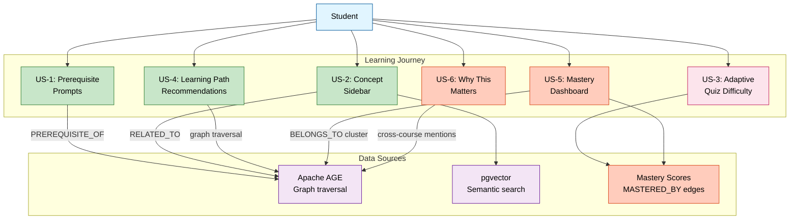

# Knowledge Graph — Student User Stories

> **Purpose:** Surface EduSphere's core differentiator (knowledge graph) to students.
> **Item:** #104 from master work plan | **Priority:** Strategic (Group C4)

---

## Problem Statement

The knowledge graph is EduSphere's primary differentiator vs competitors (Docebo, Moodle, Canvas).
However, it is currently under-marketed and under-surfaced to students. Students interact with
courses but rarely see the semantic connections between concepts.

## Knowledge Graph — Student Interaction Flow

## User Stories

### US-1: Prerequisite Prompts

**As a** student starting a new course module,
**I want** to see which prerequisite concepts I haven't mastered yet,
**so that** I can review them before struggling with advanced material.

**Acceptance Criteria:**

- Before opening a module, show a card: "This module builds on: [Concept A], [Concept B]"
- Concepts I've mastered show ✅, unmastered show ⚠️ with a link to review material
- Data source: Apache AGE `PREREQUISITE_OF` edges between concepts
- Dismiss-able — student can skip and proceed

### US-2: Concept Sidebar

**As a** student reading lesson content,
**I want** to see related concepts in a sidebar panel,
**so that** I can explore connections and deepen my understanding.

**Acceptance Criteria:**

- Right sidebar panel (collapsible) shows 3-5 related concepts
- Each concept card shows: name, brief definition, confidence score
- Clicking a concept navigates to its detail page with connected concepts
- Data source: Apache AGE `RELATED_TO` edges + pgvector semantic similarity

### US-3: Adaptive Quiz Difficulty

**As a** student taking a quiz,
**I want** question difficulty to adapt based on my knowledge graph mastery level,
**so that** I'm challenged appropriately — not bored or overwhelmed.

**Acceptance Criteria:**

- Quiz engine reads student's concept mastery scores from knowledge graph
- Low mastery → easier questions (recall level)
- High mastery → harder questions (application/synthesis level)
- Mastery scores update after quiz completion
- Data source: `MASTERED_BY` edges with weight property

### US-4: Learning Path Recommendations

**As a** student who completed a course,
**I want** to see recommended next courses based on knowledge graph connections,
**so that** I can continue learning in a structured way.

**Acceptance Criteria:**

- "What to learn next" card on course completion page
- Shows 2-3 courses that build on concepts from the completed course
- Ranked by: prerequisite overlap (highest = best next step)
- Data source: Graph traversal from completed course concepts → prerequisite edges → courses

### US-5: Concept Mastery Dashboard

**As a** student reviewing my progress,
**I want** to see a visual map of concepts I've mastered vs. gaps,
**so that** I know where to focus my study time.

**Acceptance Criteria:**

- Dashboard widget showing concept clusters (TopicCluster nodes)
- Each cluster shows: mastery percentage, number of concepts, status (strong/weak/new)
- Clicking a cluster drills into individual concepts
- Data source: Apache AGE `BELONGS_TO` (concept → cluster) + mastery scores

### US-6: "Why This Matters" Context

**As a** student reading about a concept,
**I want** to see where this concept appears across my courses,
**so that** I understand its importance and cross-disciplinary connections.

**Acceptance Criteria:**

- "Appears in" section on concept detail page
- Lists all courses/modules that reference this concept
- Shows how many students have mastered it (anonymized)
- Data source: `TAUGHT_IN` edges (concept → course/module)

---

## Implementation Notes

- All stories require Apache AGE Cypher queries via `executeCypher()` helper
- Mastery scores stored as edge weights on `MASTERED_BY` relationships
- Frontend components should use the knowledge subgraph (port 4006) via Federation
- Mobile: US-1 and US-4 are candidates for mobile implementation (Q3 2026)
- Performance: Cache graph traversal results with 5-minute TTL (TanStack Query staleTime)

## Dependencies

| Story | Depends On                                           |
| ----- | ---------------------------------------------------- |
| US-1  | `PREREQUISITE_OF` edges populated in knowledge graph |
| US-2  | pgvector similarity search + AGE graph traversal     |
| US-3  | Quiz engine in subgraph-content + mastery scores     |
| US-4  | Course → concept mapping via `TAUGHT_IN` edges       |
| US-5  | TopicCluster ontology populated                      |
| US-6  | `TAUGHT_IN` edges + cross-course concept indexing    |

---

_Created: March 2026 — Enterprise Audit Wave 8_
