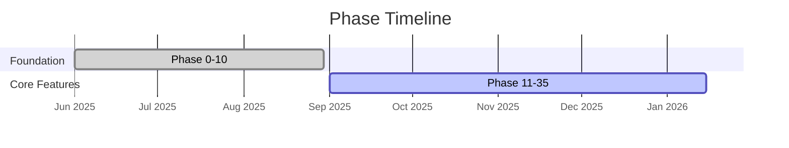

# EduSphere Mermaid Diagram Style Guide

> **Mandatory for all documentation.** Every `.md` file describing architecture, flows, relationships, state machines, or timelines MUST include Mermaid diagrams following this guide.

## 1. Color Palette (classDef Definitions)

Use semantic color categories consistently across all diagrams:

| Category | Fill | Stroke | Use For |
|----------|------|--------|---------|
| **client** | `#e1f5ff` | `#01579b` | Browser, mobile, PWA, user-facing |
| **upload/initiation** | `#e3f2fd` | `#1565c0` | Upload flows, mutations, API calls |
| **gateway** | `#fff9c4` | `#f57f17` | Gateway, reverse proxy, routing |
| **subgraph/service** | `#c8e6c9` | `#2e7d32` | Backend services, subgraphs, resolvers |
| **processing** | `#fff3e0` | `#e65100` | Workers, async jobs, transformations |
| **storage/data** | `#ffccbc` | `#d84315` | PostgreSQL, MinIO, NATS, Redis |
| **infra** | `#f3e5f5` | `#6a1b9a` | Keycloak, Jaeger, monitoring, auth |
| **knowledge** | `#e8f5e9` | `#2e7d32` | Knowledge graph, embeddings, AI output |
| **error/security** | `#ffebee` | `#c62828` | Errors, threats, security boundaries |
| **llm/ai** | `#fce4ec` | `#c2185b` | LLM calls, AI models, inference |
| **stream** | `#e0f2f1` | `#00695c` | WebSockets, subscriptions, real-time |
| **worker** | `#e0f2f1` | `#00695c` | Background processes, consumers |

### classDef Template

```mermaid
classDef client fill:#e1f5ff,stroke:#01579b,stroke-width:2px
classDef gateway fill:#fff9c4,stroke:#f57f17,stroke-width:2px
classDef service fill:#c8e6c9,stroke:#2e7d32,stroke-width:2px
classDef processing fill:#fff3e0,stroke:#e65100,stroke-width:2px
classDef data fill:#ffccbc,stroke:#d84315,stroke-width:2px
classDef infra fill:#f3e5f5,stroke:#6a1b9a,stroke-width:2px
classDef knowledge fill:#e8f5e9,stroke:#2e7d32,stroke-width:2px
classDef error fill:#ffebee,stroke:#c62828,stroke-width:2px
classDef llm fill:#fce4ec,stroke:#c2185b,stroke-width:2px
classDef stream fill:#e0f2f1,stroke:#00695c,stroke-width:2px
```

## 2. Diagram Direction

| Diagram Purpose | Direction | Example |
|-----------------|-----------|---------|
| Architecture overviews | `graph TD` | System layers top-to-bottom |
| Data/request flows | `graph LR` | Left-to-right pipeline |
| Process/pipeline steps | `flowchart TD` or `flowchart LR` | CI/CD, bug fix protocol |
| Request lifecycle | `sequenceDiagram` | Client-server interactions |
| State transitions | `stateDiagram-v2` | Incident response, DR |
| Timelines/roadmaps | `gantt` | Phase milestones |
| Data models | `erDiagram` | Table relationships |
| Git workflow | `gitGraph` | Branching strategy |

## 3. Node Rules

### Naming
- **IDs**: UPPERCASE short names — `GATEWAY`, `PG`, `CORE`, `NATS`
- **Labels**: Descriptive with `<br/>` for multi-line:
  ```
  GATEWAY[Hive Gateway v2<br/>Port 4000<br/>Federation v2.7]
  ```
- **Database nodes**: Use cylinder shape `[( )]`:
  ```
  PG[(PostgreSQL 16<br/>Apache AGE + pgvector)]
  ```
- **Decision nodes**: Use diamond `{ }`:
  ```
  H{Agent Template}
  ```

### Limits
- **Max 15 nodes** per diagram — split into multiple diagrams if more
- **Max 3 levels** of subgraph nesting
- **All edges labeled** when the relationship isn't obvious

## 4. Subgraph Conventions

```mermaid
subgraph "Layer Name"
    NODE1[Description]
    NODE2[Description]
end
```

- Always use **quoted strings** for subgraph names
- Group by **architectural layer** (Client, Gateway, Subgraphs, Data, Infra)
- Use consistent ordering: top = user-facing, bottom = infrastructure

## 5. Edge Styles

| Edge Type | Syntax | Use For |
|-----------|--------|---------|
| Solid arrow | `-->` | Direct dependency, sync call |
| Dotted arrow | `-.->` | Async, optional, validation |
| Labeled solid | `-->|label|` | Conditional flow, specific protocol |
| Labeled dotted | `-.label.->` | JWT validation, traces, monitoring |
| Thick arrow | `==>` | Critical path, primary flow |

## 6. Sequence Diagram Rules

```mermaid
participant Client
participant Gateway as Hive Gateway
participant Core as Core Subgraph
```

- **Always use aliases** for long names: `participant Gateway as Hive Gateway`
- **Message labels**: Include method/URL and key headers
- **Notes**: Use `Note over A,B:` for context
- **Max 8 participants** per diagram

## 7. Gantt Chart Rules



- Always include `dateFormat` and `axisFormat`
- Use `done`, `active`, `crit` markers
- Group phases into logical `section` blocks

## 8. When to Add Diagrams

| Content Pattern | Required Diagram Type |
|-----------------|----------------------|
| Service/component dependencies described in text | `graph TD` |
| Request/response flow described step-by-step | `sequenceDiagram` |
| State transitions or lifecycle stages | `stateDiagram-v2` |
| Timeline or roadmap with dates | `gantt` |
| Process/pipeline with sequential steps | `flowchart TD/LR` |
| Data model relationships | `erDiagram` |
| Git branching strategy | `gitGraph` |
| Comparison of options/decisions | Table (not diagram) |

## 9. Anti-Patterns (Do NOT)

- Do NOT use `\n` for newlines — use `<br/>`
- Do NOT exceed 15 nodes — split into focused diagrams
- Do NOT use generic node names like `A`, `B`, `C` for architecture — use `GATEWAY`, `PG`
- Do NOT mix `graph` and `flowchart` syntax in one block
- Do NOT omit `classDef` — all architecture diagrams must be color-coded
- Do NOT create diagrams for simple lists — use bullet points instead
- Do NOT duplicate a diagram that exists in `ARCHITECTURE.md` — reference it instead

## 10. Placement Rules

1. Place diagram **immediately after** the section heading it illustrates
2. Add a brief **text description below** the diagram explaining key decisions
3. For large documents: place a **summary diagram** at the top of the file
4. ASCII diagrams in existing docs should be **replaced**, not duplicated alongside

---

*Last updated: March 2026 | Source: Extracted from `docs/architecture/ARCHITECTURE.md` existing conventions*
