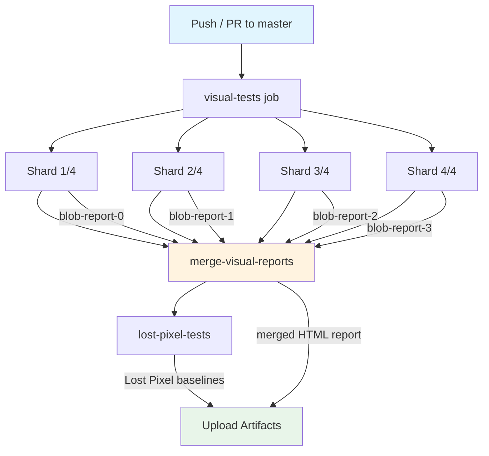

# Visual Testing Coverage

> Living document tracking visual regression test coverage for the EduSphere web application.

## Current Status

| Metric | Count | Target |
|--------|-------|--------|
| **E2E Visual Assertions** | 2,054 | 500+ |
| **Visual Spec Files** | 215 | 40+ |
| **Total E2E Spec Files** | 290 | — |
| **Snapshot Baseline Dirs** | 163 | — |
| **Baseline PNG Files** | 4,613 | — |
| **Storybook Stories** | 69+ files | Full component coverage |
| **CI Shards** | 4 parallel | Optimal for ~500 tests |

## Coverage by Category

| Category | Assertions | Spec Files |
|----------|-----------|------------|
| Admin pages | ~20 | `visual-regression-admin.spec.ts` |
| Dark mode | ~30 | `visual-dark-mode-{public,dashboard,admin,learning}.spec.ts` |
| RTL (Hebrew) | ~25 | `visual-rtl-{public,authenticated,forms}.spec.ts` |
| Accessibility | ~30 | `visual-a11y-{focus-states,high-contrast,reduced-motion}.spec.ts` |
| Charts & Data Viz | ~20 | `visual-charts-{assessment,gamification,analytics}.spec.ts` |
| User Flows | ~25 | `visual-flow-{student-onboarding,instructor-course,exam-lifecycle,collaboration}.spec.ts` |
| Error States | ~15 | `visual-error-states.spec.ts` |
| Loading States | ~15 | `visual-loading-states.spec.ts` |
| Cross-browser | ~70 | `visual-cross-browser-{critical,forms}.spec.ts` |
| Viewport | ~30 | `visual-viewport-{4k,laptop,small-mobile}.spec.ts` |
| Forms | ~30 | `visual-cross-browser-forms.spec.ts`, `visual-rtl-forms.spec.ts` |
| Baseline & Other | ~60+ | `visual-regression-{baseline,public,auth,social,content,...}.spec.ts` |

## Tools

| Tool | Purpose | Integration |
|------|---------|-------------|
| **Playwright** | Primary E2E visual testing | `toHaveScreenshot()` with pixel-diff |
| **Lost Pixel** | Storybook component regression | `.lostpixel/` baselines |
| **Argos CI** | Cloud screenshot review | `ARGOS_TOKEN` in CI secrets |
| **Storybook test-runner** | Component story validation | `build-storybook` in CI |

## How to Run Visual Tests

### Locally

```bash
# Run all visual E2E tests
pnpm --filter @edusphere/web test:e2e

# Run specific visual spec
pnpm --filter @edusphere/web exec playwright test e2e/visual-cross-browser-critical.spec.ts

# Run with specific browser
pnpm --filter @edusphere/web exec playwright test --project=chromium

# Run cross-browser (all 3 engines)
pnpm --filter @edusphere/web exec playwright test e2e/visual-cross-browser-critical.spec.ts --project=chromium --project=firefox --project=webkit
```

### Update Baselines

```bash
# Update all visual baselines
pnpm --filter @edusphere/web exec playwright test --update-snapshots

# Update specific spec baselines
pnpm --filter @edusphere/web exec playwright test e2e/visual-cross-browser-critical --update-snapshots

# Update for specific browser
pnpm --filter @edusphere/web exec playwright test --update-snapshots --project=chromium
```

### Coverage Report

```bash
# Generate coverage summary
node apps/web/scripts/visual-test-coverage.cjs
```

## CI Workflow

The visual regression pipeline runs on every push/PR to `master`/`main`.

### Sharding Strategy

Tests are split across **4 parallel shards** for faster CI execution:

- **Shard 1/4**: ~125 assertions
- **Shard 2/4**: ~125 assertions
- **Shard 3/4**: ~125 assertions
- **Shard 4/4**: ~125 assertions

Playwright automatically distributes spec files across shards.

### Pipeline Flow



### Artifact Outputs

| Artifact | Description | Retention |
|----------|-------------|-----------|
| `visual-shard-{0..3}` | Per-shard screenshots & results | 30 days |
| `blob-report-{0..3}` | Per-shard Playwright blob reports | 7 days |
| `visual-regression-report` | Merged HTML report (all shards) | 30 days |
| `visual-regression-screenshots` | All merged screenshots | 30 days |
| `lost-pixel-baselines` | Storybook component baselines | 30 days |

### Browser Caching

Playwright browser binaries are cached using `actions/cache@v4` with key based on `pnpm-lock.yaml` hash. On cache hit, only system dependencies are installed (not the full browser download), reducing CI time by ~2-3 minutes per shard.

## Screenshot Naming Convention

| Pattern | Example | Used In |
|---------|---------|---------|
| `xbrowser-{page}-full.png` | `xbrowser-dashboard-full.png` | Cross-browser critical pages |
| `xbrowser-{page}-header.png` | `xbrowser-login-header.png` | Cross-browser headers |
| `xbrowser-form-{page}-{section}.png` | `xbrowser-form-login-inputs.png` | Cross-browser forms |
| `rtl-{category}-{page}-{detail}.png` | `rtl-forms-course-create-full.png` | RTL layout tests |
| `dark-{page}-{detail}.png` | `dark-dashboard-sidebar.png` | Dark mode tests |
| `a11y-{feature}-{page}.png` | `a11y-focus-login-inputs.png` | Accessibility tests |
| `viewport-{size}-{page}.png` | `viewport-4k-dashboard.png` | Viewport tests |
| `flow-{name}-step-{n}.png` | `flow-onboarding-step-3.png` | User flow tests |

## Adding New Visual Tests

1. Create a spec file in `apps/web/e2e/` following naming: `visual-{category}-{detail}.spec.ts`
2. Import shared utilities: `import { STABLE_OPTS, LOOSE_OPTS, dynamicMasks } from './helpers/visual-test-utils'`
3. Use `STABLE_OPTS` for static pages, `LOOSE_OPTS` for pages with dynamic content
4. Apply `dynamicMasks(page)` to mask timestamps, avatars, spinners
5. Run `--update-snapshots` to generate baselines
6. Run `node apps/web/scripts/visual-test-coverage.cjs` to verify coverage increased
7. Commit baselines in the `*-snapshots/` directories

## Comparison Options

| Option | Value | Use Case |
|--------|-------|----------|
| `STABLE_OPTS` | 1% maxDiffPixelRatio, fullPage, animations disabled | Static pages |
| `LOOSE_OPTS` | 5% maxDiffPixelRatio, fullPage, animations disabled | Dynamic content |
| Custom | Per-element screenshot without fullPage | Component-level tests |

---

*Last updated: 2026-03-29 | Generated with visual-test-coverage.cjs*
