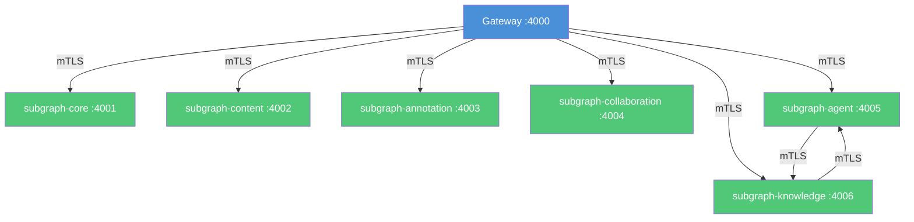

# EduSphere — Inter-Service mTLS (SI-6)

Security Invariant SI-6 requires all inter-service communication to use mutual TLS (mTLS)
in staging and production environments. Plain `http://` subgraph URLs are prohibited outside
of local development.

## Architecture Overview



## Environment Strategy

| Environment | mTLS Method | Config |
|-------------|-------------|--------|
| **Development** | Plain HTTP (localhost) | `SUBGRAPH_*_URL=http://localhost:400X/graphql` |
| **Staging** | Self-signed CA certs | `docker-compose.mtls.yml` overlay |
| **Production** | Linkerd service mesh | Zero-config, automatic cert rotation |

## Quick Start — Staging mTLS (Docker Compose)

### 1. Generate certificates

```bash
cd infrastructure/mtls
chmod +x generate-certs.sh
./generate-certs.sh
```

This creates `infrastructure/mtls/certs/` with a CA and per-service certificates.

### 2. Start with mTLS overlay

```bash
docker-compose -f docker-compose.dev.yml -f docker-compose.mtls.yml up -d
```

The mTLS overlay:
- Mounts CA cert + service certs into each container
- Sets `MTLS_ENABLED=true` on all services
- Configures `NODE_EXTRA_CA_CERTS` so Node.js trusts the self-signed CA
- Switches gateway `SUBGRAPH_*_URL` to `https://`

### 3. Verify mTLS

```bash
# Check that subgraph-core accepts TLS connections
openssl s_client -connect localhost:4001 \
  -cert infrastructure/mtls/certs/gateway/tls.crt \
  -key infrastructure/mtls/certs/gateway/tls.key \
  -CAfile infrastructure/mtls/certs/ca.crt \
  -brief

# Expected: "Verification: OK" and "Protocol: TLSv1.3"
```

## Production — Linkerd Service Mesh (Preferred)

For production Kubernetes deployments, Linkerd provides automatic mTLS without
managing certificates manually. See `infrastructure/k8s/linkerd/README.md`.

### Why Linkerd over manual certs

- **Automatic rotation**: Linkerd rotates mTLS certificates every 24 hours
- **Zero application changes**: mTLS is transparent (proxy sidecar handles TLS)
- **Identity-based auth**: SPIFFE identities tied to Kubernetes service accounts
- **Observable**: `linkerd viz edges` shows encrypted vs plaintext traffic

### Production deployment

```bash
# Install Linkerd
linkerd install --crds | kubectl apply -f -
linkerd install | kubectl apply -f -

# Enable injection for EduSphere namespace
kubectl apply -f infrastructure/k8s/linkerd/namespace-annotations.yaml

# Apply server authorization policies
kubectl apply -f infrastructure/k8s/linkerd/server-policies.yaml -n edusphere

# Apply mTLS enforcement (deny plaintext)
kubectl apply -f infrastructure/k8s/linkerd/mtls-test.yaml -n edusphere

# Restart deployments to inject proxy sidecars
kubectl rollout restart deployment -n edusphere
```

## Certificate Rotation

### Staging (self-signed)

```bash
# Delete old certs and regenerate
rm -rf infrastructure/mtls/certs
./infrastructure/mtls/generate-certs.sh

# Restart services to pick up new certs
docker-compose -f docker-compose.dev.yml -f docker-compose.mtls.yml restart
```

Certificate lifetime: 1 year (service certs), 10 years (CA).
Set a calendar reminder to regenerate before expiry.

### Production (Linkerd)

Linkerd automatically rotates identity certificates every 24 hours.
The trust anchor (root CA) must be rotated manually before expiry:

```bash
# Check trust anchor expiry
linkerd check --proxy -n edusphere

# Rotate trust anchor (see Linkerd docs for full procedure)
# https://linkerd.io/2/tasks/rotating_identity_credentials/
```

## Verifying mTLS Is Working

### Docker Compose (staging)

```bash
# 1. Verify TLS handshake succeeds
openssl s_client -connect localhost:4001 \
  -CAfile infrastructure/mtls/certs/ca.crt -brief

# 2. Verify mutual auth (client cert required)
# This should FAIL (no client cert):
curl -k https://localhost:4001/graphql
# This should SUCCEED (with client cert):
curl --cacert infrastructure/mtls/certs/ca.crt \
     --cert infrastructure/mtls/certs/gateway/tls.crt \
     --key infrastructure/mtls/certs/gateway/tls.key \
     https://localhost:4001/graphql

# 3. Check certificate details
openssl x509 -in infrastructure/mtls/certs/subgraph-core/tls.crt -text -noout
```

### Kubernetes (production)

```bash
# Verify all edges are encrypted
linkerd viz edges -n edusphere
# Every row should show SECURED = true

# Verify proxy is injected in all pods
kubectl get pods -n edusphere -o jsonpath='{range .items[*]}{.metadata.name}{"\t"}{.spec.containers[*].name}{"\n"}{end}'
# Every pod should list "linkerd-proxy" container
```

## Environment Variables

| Variable | Description | Default |
|----------|-------------|---------|
| `MTLS_ENABLED` | Enable HTTPS listener in subgraphs | `false` |
| `MTLS_CERT_PATH` | Path to service TLS certificate | `/etc/edusphere/tls/tls.crt` |
| `MTLS_KEY_PATH` | Path to service TLS private key | `/etc/edusphere/tls/tls.key` |
| `MTLS_CA_PATH` | Path to CA certificate (for client verification) | `/etc/edusphere/tls/ca.crt` |
| `NODE_EXTRA_CA_CERTS` | Node.js CA bundle (set to `MTLS_CA_PATH`) | unset |

## Security Notes

- **Never commit private keys** to Git. The `certs/` directory is gitignored.
- CA key (`ca.key`) is the root of trust. Protect it; compromise = full impersonation.
- Service certs use ECDSA P-256 for faster handshakes than RSA.
- In production, Linkerd manages all certificate lifecycle automatically.

## Compliance

| Standard | Control | Status |
|----------|---------|--------|
| SI-6 | Inter-service mTLS | Enforced via Linkerd (prod) / self-signed CA (staging) |
| ISO 27001 A.13.2 | Network security management | mTLS + NetworkPolicy + ServerAuthorization |
| OWASP ASVS V9 | Communication security | TLS 1.3 for all inter-service traffic |
